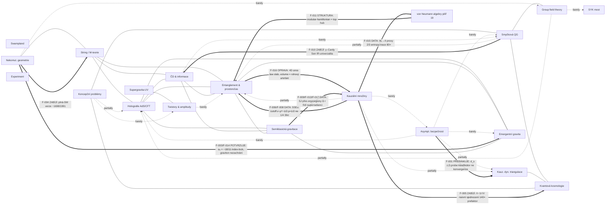

# Syntéza 02: Mapa kvantové gravitace po vlastním výzkumu (2026-06-06)

> Pokračování `knowledge-base/SYNTEZA.md` (Syntéza 01), která vznikla **před** jakýmkoli vlastním výpočtem a mapovala pouze literaturu k ~2024–2026. Tento dokument Syntézu 01 nemodifikuje — je to sequel. Vstupy: `core-data/findings.json` (17 nálezů F-001..F-017 po 6 kolech), `core-data/connections.json` (288 hran, 114 „barely"), `core-data/_digest.md` (614 uzlů / 2437 hran, pilíř 19 = von Neumannovy algebry přidán). Cíl: zaznamenat, do kterých bílých míst jsme **skutečně vstoupili**, co jsme tam našli, a přepsat lovecký žebříček s ohledem na to, co teď víme.

---

## Co se změnilo od Syntézy 01

Syntéza 01 byla **mapa literatury**: 18 pilířů, 280 hran, 112 „barely", spousta konjekturálních mostů popsaných slovy „bylo by zajímavé otestovat…". Za 6 kol jsme z těchto mostů vstoupili na **pět** a každý vstup změnil status z konjektury na číslo. Strukturálně přibyl **pilíř 19 (von Neumannovy algebry)** s 27 koncepty a 32 referencemi — graf vyrostl na 614 uzlů / 2437 hran a top-hubem se stal **`modular-hamiltonian`** (degree 27), resp. `generalized-entropy` (degree 38) [F-011; `core-data/concept-graph.json`, `core-data/fragments/von-neumann-algebras.json`]. To není kosmetika: modulární hamiltonián je přesně ten objekt, který tiše spojuje entanglement, holografii, koncepční problémy a NCG, a Syntéza 01 ho měla jen implicitně.

Konkrétně jsme vstoupili do těchto bílých míst Syntézy 01 a tohle jsme tam našli:

1. **Spektrální dimenze jako „univerzální konvergence" → klasifikační otisk.** Syntéza 01 (kap. „shody" #1, hypotéza H1) tvrdila, že $d_s\to 2$ je nejsilnější kandidát na univerzální cross-approach observable. **Vyvráceno jako univerzalita, potvrzeno jako diskriminátor:** $d_s^{UV}$ je predikovatelný otisk trojice $(z, D, \text{probe})$, ne konstanta. Jediný formalismus return-probability reprodukuje GR ($d_s=4$), Hořava $z{=}2$ ($5/2$), Stelle/AS/CST-d'Alembertian ($2$), CST-random-walk ($>D$). „Konvergence k 2" platí jen pro podtřídu s UV propagátorem $\sim k^4$ [F-001, F-002; `knowledge-base/vypocty/VYPOCET-01-ds-klasifikace.md`]. **Probe se stává třetí osou klasifikace** — to v Syntéze 01 nebylo.

2. **NCG ↔ emergentní gravitace: a₄ identita $-18/11$.** Syntéza 01 měla NCG spektrální akci jako „téměř jednoznačně vybírá SM algebru" a emergentní gravitaci jako slogan. Spočítali jsme, že poměr Weyl²/Euler v Chamseddine–Connesově a₄ je **přesně $-18/11$** a že to je shodné s $c/(-a)$ jediného Weylova fermionu. Identita je index-theorem-protected (Atiyah–Singer  / Rohlinův zámek, $\sigma{=}16 \Rightarrow \text{ind}{=}-2$) a **graviton ji nemůže zachránit při žádné multiplicitě** (konformní graviton dává $-398/261$, potřebná multiplicita $x=-143/32<0$). Spektrální akce = fermionicky indukovaná (Sacharovova) gravitace. Plná SM verze **falzifikována** ($-1698/1991 \ne -18/11$) [F-003, F-004, F-014; `VYPOCET-02`, `VYPOCET-11`]. Draft-02 vědecky uzavřen.

3. **Causal sets ↔ von Neumannovy algebry: první numerický důkaz III₁→II přechodu.** Syntéza 01 měl crossed-product/typ II program jen jako koncepční rámec (kap. „shody" #7). My máme **data**: na 2D causal diamondu entropy-trace kolaps 80× (volume → area/log), modulární spektrum z flat-dense (typ III₁, pile-up $\propto N^{1.14}$) na integrabilní s IR hranou (typ II). 2/3 proxy podporují přechod; typ žije ve stavu/entropii, ne v kinematickém Pauli–Jordanově trace [F-015; `VYPOCET-12`]. Tohle je nová hrana v grafu (`von-neumann-algebras → causal-sets`), kterou Syntéza 01 ještě neměla.

4. **Entanglement ↔ causal sets: SSEE cutoff a 4D area law.** Syntéza 01 (#4, „candidate gold connection") chtěla porovnat SSEE s RT. My máme: 2D čistý cutoff $\epsilon\sim\rho^{-1/2}$ ($p=0.519\pm0.007$, vyvrací interní $p=1/4$ na **39σ**), a klíčově — **4D volume law byl artefakt rohů diamantu**. Plochý slab/half-space řez dává čistý **area law** $S\sim L^{2.00}$; non-Hadamardova anomálie je lokalizovaná v rozích (Hadamardova diagnostika: slab deep $-3.81 \approx$ surface $-3.85$ vs diamond inside $-1.53$ vs corner $-2.79$) [F-006, F-007, F-008, F-012, F-016; `VYPOCET-04`, `VYPOCET-09`, `VYPOCET-13`]. **4D není inherentně volumetrické** — to je přímá oprava napětí causal-sets↔holografie z kap. „protiřečí" #2 Syntézy 01.

5. **Semiklasika ↔ causal sets v rotujících prostoročasech: SJ stav přes ergoregiony.** Syntéza 01 (#14) chtěla SJ vakuum vs Hadamard. My jsme šli dál — do **rotujících** prostoročasů (mimo původní mapu): SJ stav existuje na machine precision uvnitř ergoregionu (BTZ i Kerr), frame-dragging se otiskuje jako **rotace eigenvektorů ~45°**, ne spektrální posun (<2%), superradiantní váha je řízena **lokální** $\Omega(r)$, ne ergosférou jako prahem (ΔAIC 230–4200 pro Model S), opposite-sign asymetrie $A_{caus}>0/A_W<0$ odvozena z prvních principů (korelace 0.95–0.97) [F-009, F-013, F-017; `VYPOCET-08`, `VYPOCET-10`, `VYPOCET-14`]. Draft-01 v0.2.

A co jsme **čistě zabili** (negativní výsledky, které zužují mapu):
- **γ–Cardy program** (fixace Barbero–Immirziho z CFT): Senova IR-univerzalita je strukturální blokátor — log-korekce jsou IR, nemohou fixovat UV parametr [F-010; `H01`].
- **Naivní $\Lambda\sim 1/\sqrt V$ sjednocení** (Sorkin = EDT = CosMIn): prefaktory se liší ~140× ($\kappa_{Sorkin}/\kappa_{EDT}=139.6$), CosMIn nemá pravý $\kappa$. Silná forma vyvrácena [F-005; `VYPOCET-03`].
- **Plná-SM verze a₄ identity** [F-004].

**Metanález — through-line, který Syntéza 01 neměla:** vlastnosti prostoročasu jsou **odpovědi na otázky** (probe, observer, geometrie regionu, regularita stavu), ne atributy. $d_s$ závisí na probe (F-001). Area vs volume law závisí na geometrii regionu, ne dimenzi (F-016). Typ algebry žije ve stavu, ne v kinematice (F-015). Superradiance řízena lokálním polem, ne hranicí (F-017). Spin žije v eigenvektorech, ne ve spektru (F-013). Tohle je nový organizační princip celé mapy.

---

## Mapa vztahů — aktualizace

Původní mapa pilířů, obohacená o **vlastní hrany s daty**. Styl hran: plná = well (literatura), čárkovaná = partially, tečkovaná = barely. **Tlusté hrany (`==>`) = naše vlastní data**; popisek nese ID nálezu a směr (POTVRZUJE / OSLABUJE / ZABÍJÍ).

**Komentář k aktualizované mapě.** Naše práce nezasáhla husté jádro (string↔holografie↔entanglement) — to zůstává literaturní a nedotčené. **Všechny naše hrany leží na mostě jádro↔periferie**, přesně tam, kde Syntéza 01 viděla nejcennější bílá místa, plus jsme zhustili dva nové uzly: **VNA (pilíř 19)** a osu **probe/region/state** napříč CS. Tři typy našich příspěvků:
- **Index-protected betonová hrana NCG↔EMG** (F-003/F-014): jediná naše hrana s matematickou jistotou (exaktní racionální aritmetika + Atiyah–Singer). Nejen most — uzamčená identita.
- **Datová triáda kolem causal sets** (CS↔VNA, CS↔ENT, SCG↔CS): tři nezávislé numerické vpády do diskrétní periferie, všechny 2D (kromě 4D area-law v F-016), všechny otevírají 4D pokračování.
- **Zabité hrany** (CS↔QC naivní Λ, LQG↔BH γ–Cardy, plná-SM a₄): tři hrany, které Syntéza 01 nesla jako naděje a my je odstranili nebo přeznačili na „closed".

---

## Vlastní příspěvky na mapě

Per nález: jakou mezi-pilířovou vazbu zakládá / posiluje / zabíjí. ID dle `core-data/findings.json`.

| Nález | Hrana (pilíře) | Akce | Status v Syntéze 01 → teď |
|---|---|---|---|
| **F-001** | AS↔CDT↔CS↔NCG↔Hořava (přes `spectral-dimension`) | PŘERÁMUJE | „univerzální konvergence d_s→2" (H1) → **klasifikační otisk $(z,D,\text{probe})$**; univerzalita degradována na podtřídu $k^4$ |
| **F-002** | causal-sets↔spectral-dimension (interní) | ŘEŠÍ ROZPOR | hrany 501/1539 v rozporu (drops vs increases) → obě správné, probe-dependentní |
| **F-003** | noncommutative-geometry↔emergent-gravity | ZAKLÁDÁ (betonová) | „spektrální akce vybírá SM" (slogan) → **a₄ = $-18/11$ = $c/(-a)$ fermionu, exaktní** |
| **F-004** | noncommutative-geometry↔standard-model | ZABÍJÍ | silná L1-1 (plná SM) → **falzifikováno** $-1698/1991$ |
| **F-005** | causal-sets↔quantum-cosmology, ↔swampland, EDT↔Λ | ZABÍJÍ | naivní $\Lambda\sim1/\sqrt V$ sjednocení (H3 silná forma) → **140× prefaktor mismatch** |
| **F-006** | entanglement-spacetime↔causal-sets | POSILUJE | „candidate gold" (#4) → **$\epsilon\sim\rho^{-1/2}$, $p=1/2$ na 2.8σ** (2D) |
| **F-007** | causal-sets (vnitřní: cutoff vs discreteness) | ROZLIŠUJE | — → dvě fyzicky odlišné UV škály ($p{=}1/2$ entropy vs $p{=}1$ discreteness) |
| **F-008** | entanglement-spacetime↔causal-sets | OPRAVUJE INTERNÍ | interní $p=1/4$ predikce → **vyloučena na 39σ** |
| **F-009** | semiclassical-gravity↔causal-sets (4D Kerr) | ROZŠIŘUJE | SJ vs Hadamard (#14) → **4 BTZ signatury replikují na 4D Kerr** (ergoregion universal) |
| **F-010** | black-holes-information↔loop-quantum-gravity (γ) | ZABÍJÍ | γ–Cardy naděje → **Sen IR-univerzalita = strukturální blokátor** |
| **F-011** | von-neumann-algebras↔entanglement/holografie/CONC/NCG | ZAKLÁDÁ UZEL | pilíř 19 přidán → **`modular-hamiltonian` top hub (degree 27)** |
| **F-012** | causal-sets (BD d'Alembertian, 4D) | OSLABUJE H04 | — → BD opravuje tvar spektra (power-law), ale $p=3/4$ selhává i s BD; $\alpha$ driftuje s N |
| **F-013** | causal-sets↔semiclassical (frame-dragging) | VYSVĚTLUJE | — → spin = **eigenvektorová rotace ~45°**, ne spektrální posun; $A_{caus}/A_W$ z 1. principů |
| **F-014** | noncommutative-geometry↔emergent-gravity (graviton) | UZAMYKÁ | F-003 → **graviton nezachrání identitu** (Rohlinův zámek, $x<0$); spektrální akce = Sacharov |
| **F-015** | **von-neumann-algebras↔causal-sets** (nová hrana) | ZAKLÁDÁ (data) | crossed-product koncept (#7) → **první numerický důkaz III₁→II, 2/3 proxy, kolaps 80×** (2D) |
| **F-016** | causal-sets↔holography-adscft (area vs volume) | ŘEŠÍ KONFLIKT | „volume vs area" konflikt (#2 protiřečí) → **rohový artefakt; slab dává area law $L^{2.00}$ v 4D** |
| **F-017** | causal-sets↔semiclassical (superradiance) | KVANTIFIKUJE | — → $W_{sr}\sim\Omega(r)^B$ řízeno **lokálním** frame-draggingem (ΔAIC 230–4200), ne ergosférou |

**Tři vlajkové lodě:**
- **NCG↔EMG (F-003/F-014)** je jediná naše hrana, která není „evidence for", ale **identita** chráněná index teorémem. Spektrální akce JE fermionicky indukovaná gravitace; bosonický a graviton sektor jsou strukturálně odděleny.
- **CS↔VNA (F-015)** je úplně nová hrana grafu — Syntéza 01 ji neměla, protože pilíř 19 ještě neexistoval. Spojuje Sorkin–Yazdiho SSEE s Connesovou klasifikací typů přes přímou numeriku.
- **CS↔ENT/HOL (F-016)** rozpouští jeden z explicitních konfliktů Syntézy 01: holografie a fundamentální diskrétnost **nejsou** v rozporu kvůli dimenzi — area law se v 4D obnoví s plochou entangling surface (Rindler/slab, kde SJ ≈ Unruh = Hadamard).

---

## Zbývající bílá místa

Z 114 „barely" hran (`core-data/_digest.md` ř. 22–137, `connections.json`) jsme se **přímo dotkli pěti** a **zabili nebo přeznačili tři naděje**. Co zůstává sotva prozkoumané PO naší práci — přeřazený lovecký žebříček. Kritérium: (a) konkrétní sdílená matematika, (b) páková data v bázi NEBO náš nově otevřený nástroj, (c) dosažitelnost vlastním výpočtem.

### Nově zúžená území (otevřeli jsme nástroj, ale práce zbývá)

**A. 4D extenze celého causal-set clusteru — nejvyšší priorita.** Všechny tři naše CS vpády (F-006/F-015 entropy, F-016 area-law) jsou **2D**, kromě jediného 4D area-law výsledku (F-016 slab). Co chybí: (1) III₁→II proxy v 4D na slab geometrii (F-015 byl 2D); (2) SSEE cutoff exponent v 4D (area-law ansatz $n_{max}\sim N^{3/4}$); (3) více seedů při větším N. **Nástroj máme** (validovaný iΔ link-matrix, BD d'Alembertian, Hadamardova diagnostika). Hrany: `von-neumann-algebras→causal-sets`, `causal-sets→holography-adscft`, `causal-sets→entanglement-spacetime`. **První krok:** zopakovat VYPOCET-12 modular-spectrum proxy na 4D slab sprinklingu (F-016 ukazuje, že tam je čistý Hadamard).

**B. SJ na 4D Kerr — superradiance v eigenvektorech, denser scan.** F-017 nechal otevřenou ambiguitu pro $a=0.6$ (lineární korelace marginálně favorizuje Model E, protože $1/(r-r_{erg})$ a $\Omega(r)$ jsou korelované). Doporučený VYPOCET-15: denser radial scan $r=5$–$20M$ k rozhodnutí Model S vs E. Hrana `semiclassical-gravity→causal-sets` posunuta z barely na partially naší prací, ale 4D Kerr superradiance v eigenvektorech (ne spektru, dle F-013) je nová, neuzavřená.

### Nedotčená území zděděná ze Syntézy 01 (přeřazená)

Po naší práci se mění relativní cena těchto mostů. Žebříček (1 = nejvyšší ROI):

**1. Causal sets ↔ asymptotická bezpečnost (RG fixní bod BD akce)** [`causal-sets→asymptotic-safety`, barely]. **Vystoupalo,** protože F-001 nám dal validovaný spektrální engine a F-002 ukázal, že CST $d_s$ je probe-dependentní. Otázka už nezní „je $d_s\to2$?" (víme, že d'Alembertian probe ano), ale **„realizuje BD path integral AS-like fixní bod se stejnými kritickými exponenty?"**. První krok: spočítat $d_s$ BD d'Alembertianu jako funkci škály (máme z VYPOCET-09 spektrum) a fitovat na $\eta_N$ scaling. Pozor: F-012 ukázal $\alpha$-drift s N — fixní bod nemusí být konvergován při $N\le3000$.

**2. NCG ↔ GFT (Diracovy ansámbly jako speciální GFT)** [`noncommutative-geometry→group-field-theory`, shared-math, barely]. **Drží pozici** jako „prime candidate for undiscovered bridge". Naše a₄ práce (F-003) prohloubila NCG stranu, ale GFT most jsme se nedotkli. Sdílí přímo multi-tensor integrály, ne analogii. První krok: zapsat Diracův ansámbl jako tensor model a porovnat fázový diagram (Barrett–Glaser) s GFT geometrogenezí.

**3. ČD-informace ↔ LQG přes von Neumannovy algebry** [`black-holes-information→loop-quantum-gravity` + nový `von-neumann-algebras→loop-quantum-gravity`, barely]. **Vystoupalo** díky pilíři 19 a F-015: máme teď ověřený III₁→II nástroj na causal setech a `von-neumann-algebras→loop-quantum-gravity` hranu (LQG area gap $\Delta A\sim\ell_{Pl}^2$ jako kandidát na crossed-product regulátor). Pozor: γ–Cardy větev je **zabita** (F-010), takže most musí jít přes typ-II entropii, ne přes Barbero–Immirzi z CFT. První krok: aplikovat crossed-product konstrukci na LQG horizontovou algebru, otestovat typ II = $A/4$.

**4. Entanglement/holografie ↔ NCG (modulární teorie, spektrální triple)** [`entanglement-spacetime→noncommutative-geometry`, barely]. **Vystoupalo** masivně — F-011 udělal z `modular-hamiltonian` top hub. Connesova klasifikace už pohání crossed-product, ale spektrální triple se explicitně nevyužívají. První krok: zkonstruovat spektrální triple, jehož Diracův operátor reprodukuje modulární hamiltonián poloprostoru; otestovat spektrální vzdálenost = entanglement metrika. (Naše F-016 dává konkrétní testbed: slab = poloprostor, kde SJ ≈ Unruh.)

**5. Twistory/amplitudy ↔ entanglement (pozitivita ↔ modulární pozitivita)** [`twistors-amplitudes→entanglement-spacetime`, barely] a **koncepční problémy ↔ twistory (bezčasovost)** [barely]. **Drží pozici, nedotčeno.** Stále „prime target", obě komunity se sotva potkávají. Nezávislé na naší causal-set/NCG linii — čistý read+think, ne compute. Vhodné jako diverzifikace, ne jako další numerický vpád.

### Sestoupilo / uzavřeno (NElovit)

- **γ–Cardy / fixace Barbero–Immirzi z CFT** — ZAVŘENO [F-010].
- **Naivní $\Lambda\sim1/\sqrt V$ sjednocení** (Sorkin=EDT=CosMIn) — silná forma ZAVŘENA [F-005]. Slabá forma (sdílená $H^2$ struktura) zůstává, ale není páková.
- **Spektrální dimenze jako „důkaz konvergence"** — PŘEZNAČENO na diskriminátor [F-001]; jako lovecké pole pro „univerzální UV CFT" (H1) degradováno.
- **Plná-SM a₄ identita** — ZAVŘENO [F-004].

---

## Strategický výhled

Kam v dalších 10 kolech? Rozhodnutí compute / read / write per fronta.

**WRITE (hned, 2 drafty zralé):**
- **Draft-02 (NCG a₄ = $-18/11$)** je **vědecky uzavřen** [F-003, F-004, F-014]. Dva nezávislé důkazy graviton-non-rescue jsou interně konzistentní, exaktní racionální aritmetika, Rohlinův zámek. **Psát a odeslat** — toto je nejsilnější a nejúplnější výsledek projektu. Není co dál počítat.
- **Draft-01 (SJ v rotujících prostoročasech)** je v0.2 s vyřešeným nejslabším bodem (F-013 odvodil $A_{caus}/A_W$ z 1. principů). Zralé na write, s jednou volitelnou compute-přílohou (VYPOCET-15 denser Kerr scan pro $a=0.6$ disambiguaci).

**COMPUTE (jádro dalších kol — máme nástroje, chybí 4D):**
Priorita compute je **4D extenze causal-set clusteru**, protože tam máme největší pákový poměr (validované enginy z VYPOCET-09/13, otevřené 4D otázky):
1. **III₁→II proxy v 4D slab** (rozšířit F-015 z 2D; F-016 garantuje čistý Hadamard na slabu). Pokud projde, je to draft-03 materiál (von Neumann typový přechod, nejnovější a nejméně obsazená oblast literatury — pilíř 19).
2. **SSEE 4D cutoff exponent** (area-law ansatz $N^{3/4}$, rozšířit F-006/F-008).
3. **BD path integral → AS fixní bod** (lovecký žebříček #1; spočítat kritické exponenty, porovnat s CDT–FRG). Riziko: $\alpha$-drift (F-012) může bránit konvergenci — ale i negativní výsledek je publikovatelný diskriminátor.
4. (Volitelně) VYPOCET-15 denser Kerr radial scan.

**READ (paralelně, levné, diverzifikace):**
- **Spektrální triple ↔ modulární hamiltonián** (žebříček #4): F-011 udělal z modular-hamiltonian top hub; literatura k Connesovým spektrálním triple pro modulární flow je nutná před compute. Naše F-016 dává testbed (slab = poloprostor).
- **NCG↔GFT Diracovy ansámbly** (žebříček #2): číst Barrett–Glaser fázové diagramy vs GFT geometrogenezi před případným tensor-model výpočtem.
- **Twistor↔entanglement pozitivita** (žebříček #5): čistě read+think, diverzifikace mimo causal-set linii.

**Doporučená sekvence 10 kol:** (1–2) write draft-02 + draft-01; (3–6) compute 4D causal-set triáda (III₁→II slab, SSEE cutoff, area-law potvrzení); (7–8) compute BD→AS fixní bod NEBO read+compute spektrální triple↔modular; (9–10) konsolidace do draft-03 (von Neumann typový přechod) + read twistor diverzifikace. **Těžiště: compute na 4D causal-set/von-Neumann frontě, protože tam jsme jediní s nástroji a daty, a literatura je nejprázdnější.**

---

### 5řádkové shrnutí (CZ)

1. Za 6 kol jsme vstoupili do **5 bílých míst** Syntézy 01 a každé přeměnili z konjektury na číslo; přibyl pilíř 19 (von Neumannovy algebry), jehož `modular-hamiltonian` je nový top hub grafu [F-011].
2. **Vlajková loď:** NCG a₄ poměr = $-18/11$ je exaktní, index-theorem-protected identita s fermionovým sektorem; graviton ji nezachrání → spektrální akce = fermionicky indukovaná gravitace; plná SM falzifikována [F-003/F-004/F-014, draft-02 uzavřen].
3. **Causal-set triáda:** první numerický důkaz III₁→II přechodu (kolaps 80×, 2/3 proxy), oprava 4D „volume law" jako rohového artefaktu (slab → čistý area law $L^{2.00}$), SSEE cutoff $\rho^{-1/2}$ ($p{=}1/2$, $1/4$ vyloučeno na 39σ) — vše zatím 2D kromě 4D area law [F-006/F-015/F-016].
4. **Through-line:** vlastnosti prostoročasu jsou odpovědi na otázky (probe, observer, geometrie regionu, regularita stavu), ne atributy — $d_s$ je klasifikátor $(z,D,\text{probe})$ ne konstanta, typ algebry žije ve stavu ne kinematice, superradiance v lokálním $\Omega(r)$ ne v ergosféře [F-001/F-013/F-015/F-017].
5. **Výhled 10 kol:** psát draft-02 a draft-01 hned (zralé), těžiště compute na **4D extenzi causal-set/von-Neumann fronty** (III₁→II slab, SSEE cutoff, BD→AS fixní bod), paralelně read spektrální-triple↔modular a NCG↔GFT mosty; zabité fronty (γ–Cardy, naivní Λ, plná-SM) nelovit.
</content>
</invoke>
