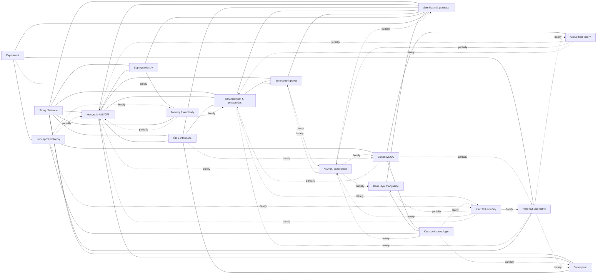

# Syntéza: Mapa kvantové gravitace

> Syntetický průřez 18 pilíři znalostní báze. Data: `core-data/_digest.md`, `core-data/connections.json` (280 hran, matice prozkoumanosti), `core-data/open-problems.json` (143 problémů), `core-data/concept-graph.json` (589 uzlů / 2296 hran). Cíl: najít skryté, dosud neprobádané vazby mezi přístupy. Stav literatury k ~2024–2026.

---

## Velký obraz

Kde dnes stojí každý z 18 pilířů (statusy podle pillar-souborů `knowledge-base/` a matice v `connections.json`):

**Teorie strun a M-teorie** (`approaches/01-string-theory.md`) — Nejúplnější kandidát: jediný program s mikroskopickým započtením entropie ČD (Strominger–Vafa) a s AdS/CFT. Cena: žádná dynamická selekce vakua z ~$10^{500}$ landscape, žádná ověřitelná předpověď, nekontrolované de Sitter vakuum (KKLT/LVS sporné). Hluboce propojen s holografií, supergravitací, swamplandem (vše "well").

**Smyčková kvantová gravitace** (`approaches/02-loop-quantum-gravity.md`) — Background-independentní kanonická kvantizace s diskrétními spektry plochy/objemu a S=A/4 z mikrostavů horizontu. Chybí dokončená dynamika (hamiltonovský constraint), semiklasická limita a kontakt s Page křivkou. Nejtěsnější most ke GFT a kvantové kosmologii (LQC).

**Asymptotická bezpečnost** (`approaches/03-asymptotic-safety.md`) — Bottom-up UV fixní bod (Reuter) v rámci čisté QFT; retrodikce Higgsovy hmotnosti a top kvarku. Otevřeno: nepertubativní existence fixního bodu, unitarita (duchové), lorentzovská signatura, background-independence cutoffu $k$.

**Kauzální dynamické triangulace** (`approaches/04-causal-dynamical-triangulations.md`) — Neperturbativní lorentzovský integrál přes diskrétní geometrie; dynamicky generuje 4D de Sitter „blob" a běžící spektrální dimenzi (4→~2). Otevřeno: genuine kontinuální (UV) limita = Reuterův fixní bod? Význam bifurkační fáze, role foliace.

**Teorie kauzálních množin** (`approaches/05-causal-sets.md`) — „Order + Number = Geometry"; jediná předpověď-předem ($\Lambda \sim 1/\sqrt{V} \sim 10^{-120}$). Fundamentální diskrétnost zachovávající Lorentzovu invarianci (Poissonovo rozsetí). Otevřeno: plně kvantová dynamika, entropický problém (Kleitman–Rothschild), výběr d=4.

**Group field theory** (`approaches/06-group-field-theory.md`) — Druhá kvantizace LQG / generátor spin-foam amplitud; kondenzátová kosmologie dává efektivní Friedmanna s bouncem. Otevřeno: geometrogeneze (fázový přechod do 4D fáze), renormalizovatelnost geometrických 4D modelů.

**Nekomutativní geometrie** (`approaches/07-noncommutative-geometry.md`) — Connesova spektrální akce „téměř jednoznačně" vybírá SM algebru $\mathbb{C}\oplus\mathbb{H}\oplus M_3(\mathbb{C})$; deformované (Moyal, $\kappa$-Minkowski) verze dávají minimální délku a MDR. Otevřeno: lorentzovská signatura spektrálních triple, NCG jako plnohodnotná kvantová gravitace.

**Twistory a amplitudy** (`approaches/08-twistors-amplitudes.md`) — Radikálně bezčasový program: lokalita a unitarita emergentní z pozitivní geometrie (amplituhedron); double copy gravitace = (gauge)². Otevřeno: googly problém (ASD vs SD), gravituhedron, neperturbativní twistor string, celestiální CFT.

**Emergentní gravitace** (`approaches/09-emergent-gravity.md`) — Gravitace jako termodynamika/hydrodynamika (Jacobson, Verlinde, Padmanabhan): Einsteinovy rovnice z $\delta Q = T\,dS$. Otevřeno: „atomy prostoročasu", správné znaménko/velikost indukovaného $G$ a $\Lambda$, kvantová doména za semiklasikou.

**Supergravitace a UV completion** (`approaches/10-supergravity-uv.md`) — N=8 SUGRA konečná do 4 smyček; kritický test je 7. smyčka. Higher-derivative (Stelle/Hořava-Lifshitz/agravity) renormalizovatelné, ale s duchy. Otevřeno: UV osud N=8, mechanismus enhanced cancellations, ghost problém, IR obnova Lorentzovy invariance.

**Holografie a AdS/CFT** (`cross-cutting/11-holography-adscft.md`) — Nejúspěšnější neperturbativní definice kvantové gravitace (na AdS). Centrální uzel grafu (holografický princip degree 37). Otevřeno: dS holografie, flat-space (celestiální) holografie, faktorizační problém, důkaz AdS/CFT.

**Černé díry a informace** (`cross-cutting/12-black-holes-information.md`) — Page křivka odvozena uvnitř holografie (ostrovy, replica wormholes, QES). Otevřeno: mechanismus úniku informace, firewall vs hladký horizont, unitární S-matice, mikroskopika replica saddles, univerzalita ve 4D.

**Entanglement a prostoročas** (`cross-cutting/13-entanglement-spacetime.md`) — „Spacetime from entanglement" (RT, ER=EPR, Van Raamsdonk); entanglement first law → linearizované Einsteinovy rovnice. Otevřeno: emergence mimo AdS, které entanglement struktury dávají geometrii, emergence času.

**Swampland** (`cross-cutting/14-swampland.md`) — Demarkační program: které EFT lze sjednotit s gravitací (WGC, SDC, dS conjecture, TCC). Otevřeno: O(1) konstanty, metastabilní dS, derivace z prvních principů, rozsah (jen string, nebo každá QG?).

**Semiklasická gravitace** (`foundations/15-semiclassical-gravity.md`) — QFT v zakřiveném prostoročase: Hawking, Unruh, $G_{ab}=8\pi G\langle T_{ab}\rangle$. Nejlépe testovatelný pilíř (analogová gravitace). Otevřeno: well-posed self-konzistentní problém, meze platnosti, trans-Planckovská robustnost.

**Koncepční problémy** (`foundations/16-conceptual-problems.md`) — Problém času, background-independence, měření v uzavřeném vesmíru, je-li gravitace kvantová. Rychle rostoucí křižovatka: crossed-product observer algebry (CLPW/Witten).

**Experimentální testy** (`phenomenology/17-experimental-tests.md`) — BMV/QGEM (kvantovost gravitace), LIV/birefringence, analogová Hawking radiace, GW echa, Verlinde-Zurek geontropní šum (GQuEST). Žádný pozitivní signál Planckovské fyziky; vše buď nepřístupné, nebo nepřímé.

**Kvantová kosmologie** (`phenomenology/18-quantum-cosmology.md`) — Wheeler–DeWitt, no-boundary vs tunneling, LQC bounce, measure problem multiverza. Otevřeno: správná počáteční podmínka, problém času, platnost minisuperspace truncation, dark energy z QG.

**Souhrn:** žádný pilíř není kompletní teorií. Nejúspěšnější (string/holografie) jsou neúplné na kosmologickém/dS konci; nejvíce background-independentní (LQG, causal sets, CDT, GFT) postrádají semiklasickou kontrolu a kontakt s daty. Celá síť má 35 hran označených „well", 73 „partially" a **112 „barely" prozkoumaných** — to je samotné lovecké pole.

---

## Mapa vztahů mezi přístupy

Mermaid diagram hlavních vazeb. Styl hran kóduje prozkoumanost: **plná** = well, **čárkovaná** = partially, **tečkovaná** = barely. (Pro čitelnost je zobrazen reprezentativní výběr ~50 z 280 hran — všechny „well" páry plus klíčové „barely" mosty z kapitoly o bílých místech.)

**Komentář.** Graf má jedno husté, dobře prozkoumané jádro — **string ↔ holografie ↔ entanglement ↔ ČD-informace ↔ semiklasika** — kolem nejvíce propojených konceptů (holografický princip, Bekenstein–Hawkingova entropie, RT formule, Page křivka). Mimo toto jádro leží **periferie background-independentních diskrétních přístupů** (causal sets, CDT, GFT, NCG, AS), které jsou mezi sebou propojeny téměř výhradně tečkovanými (barely) hranami, ačkoli sdílejí konkrétní strukturu (spektrální dimenze d→2 v UV). Most mezi jádrem a periferií je nejtenčí a nejcennější: holografie ↔ LQG/causal sets/CDT/GFT/AS jsou všechny „barely". Asymptotická bezpečnost je uzlem s nejvíce barely hranami (8 z 17), protože jako kontinuální FRG program je metodologicky odříznuta od diskrétních i on-shell přístupů.

---

## Kde se přístupy shodují

Konvergentní výsledky dosažené **nezávislými** metodikami jsou nejsilnější indicie, že míří na stejnou fyziku:

1. **Dimenzionální redukce v UV: $d_s \to 2$.** Spektrální dimenze klesá ze 4 na ~2 na Planckově škále nezávisle v: asymptotické bezpečnosti (4→2, z $\eta_N=-2$), CDT (4.02→1.80, první neperturbativní měření), Hořava–Lifshitz gravitaci, LQG/spin foams, nekomutativní geometrii ($\kappa$-Minkowski), a (debatovaně) causal sets. Toto je nejsilnější kandidát na **univerzální cross-approach observable** (uzel `spectral-dimension`, degree 28; hrany `*-spectral-dimension` v `connections.json`). Pozn.: CDT dává spíše 4→3/2 a u causal sets běží d **opačně** — kvantitativní shoda chybí.

2. **Minimální délka / smearing prostoročasu.** NCG (vestavěná škála $\theta$), AS ($1/p^4$ UV propagátor), GUP/DSR, string ($\ell_s$), causal sets (diskrétnost) — všechny implikují rozmazání bodů na Planckově škále. Sdílejí fenomenologii MDR (modifikovaných disperzních relací).

3. **Entropie černých děr $S = A/4G$.** Nezávisle reprodukováno: string (Strominger–Vafa, počítání D-bran), LQG (počítání punktur na horizontu, ladění Barbero–Immirziho parametru), causal sets (Dou–Sorkin „horizon molecules"), NCG (kvantovaná plocha), holografie (RT). Stejný výsledek, radikálně odlišné mikrostavy — `atoms-of-spacetime` zůstává otevřený (čí mikrostavy jsou TY pravé?).

4. **Bounce místo singularity.** LQC (big bounce při $\rho_c \sim 0.41\rho_{Pl}$), GFT kondenzátová kosmologie (efektivní Friedmann s bouncem), causal-set cyklické vesmíry — konvergence na nahrazení Velkého třesku odrazem. GFT = hydrodynamika druhokvantovaného LQG dává LQC jako efektivní limitu (hrana `group-field-theory→quantum-cosmology`).

5. **Emergence Einsteinovy rovnice z entanglementu/termodynamiky.** Jacobson (1995, $\delta Q=T\,dS$ na Rindlerově horizontu) a Faulkner et al. (2014, entanglement first law v AdS/CFT → linearizované Einstein) docházejí ke stejné rovnici z termodynamiky resp. z holografického entanglementu (hrany `emergent-gravity↔entanglement-spacetime`, `↔semiclassical-gravity`, vše „well").

6. **Page křivka jako jediná chápaná diagnostika unitarity** — odvozena v holografii (QES/ostrovy/replica wormholes) a uznána jako semiklasický výpočet (`black-holes-information↔semiclassical-gravity` "well"). Uzel `page-curve` degree 25.

7. **von Neumannovy algebry / modulární teorie** sjednocují holografii, entanglement, koncepční problémy a NCG: typ III$_1$ lokálního QFT (Connes) + crossed product → typ II → konečná, observer-závislá generalized entropy (CLPW 2022, Witten 2021).

---

## Kde si protiřečí

Skutečné konflikty a vzájemně neslučitelné předpoklady (typ `"conflict"` v `connections.json`):

1. **Fundamentální diskrétnost vs spojité UV** (`causal-sets→string-theory`, `causal-dynamical-triangulations→string-theory`, `causal-sets→holography-adscft`). String/holografie předpokládají hladkou (super)varietu a spojitý UV prostoročas; causal sets postulují fundamentální background-free diskrétnost. Filozoficky neslučitelné, žádný formální most — ale CDT diskrétnost je naopak jen odstranitelný regulátor, takže CDT↔causal-sets je rozpor o tom, **zda je diskrétnost fyzikální nebo technická**.

2. **Volume law vs area law entropie** (`causal-sets→holography-adscft`, typ conflict). SSEE na causal setech roste s **objemem**, v napětí s holografickým/Bekensteinovým **area** scalingem — přitom Dou–Sorkin počítání reprodukuje $S=A/4$. Otevřená otázka `area-vs-volume-entropy`: zda je holografický princip vůbec slučitelný s fundamentální diskrétností a jak area law vzniká z volume law UV truncation.

3. **AS UV fixní bod vs swampland** (`asymptotic-safety→swampland`, conflict; `swampland→asymptotic-safety`, conflict). Basile–Knorr–Platania–Schiffer (2025): striktní field-theoretic AS je v napětí s kinematickými swampland principy (no global symmetries, fluktuace topologie), protože FRG negeneruje symetrii-porušující členy. AS tvrdí UV fixní bod v čisté QFT; swampland tvrdí, že čistě-QFT gravitace JE ve swamplandu (musí produkovat struny/věže). Je-li swampland absolutní, jeden z rámců je nekonzistentní.

4. **Emergentní vs kvantovaná geometrie** (`emergent-gravity→loop-quantum-gravity`, conflict). LQG kvantuje geometrii (je fundamentální); emergentní gravitace tvrdí, že geometrie fundamentální NENÍ. Opačné předpoklady o tom, co je primární — přesto potenciálně komplementární (LQG by mohla dodat „atomy" pro termodynamickou limitu).

5. **AS background-dependence vs background-independence** (`conceptual-problems→asymptotic-safety`, conflict). Coarse-graining cutoff $k$ vyžaduje pomocnou pozadovou metriku → problém času a background-independence latentní; kanonická reformulace teprve otevřena (2507.14296).

6. **Lokalita vs unitarita (firewall)** (`conceptual-problems→black-holes-information`, conflict). Monogamie entanglementu (AMPS) + EFT na horizontu + unitarita jsou společně nekonzistentní; každé řešení obětuje něco (ER=EPR popírá nezávislost interiéru, firewall obětuje hladkost).

7. **Semiklasická gravitace jako diskriminátor** (`experimental-tests→semiclassical-gravity`, conflict). BMV/QGEM: je-li gravitace fundamentálně semiklasická ($G_{ab}=8\pi G\langle T_{ab}\rangle$), nesmí entanglovat dvě hmoty. Aktivní spor 2025 (Aziz–Howl: klasická gravitace entangluje; mnoho vyvrácení) — nejostřejší rozhodovací bod.

---

## Sdílené otevřené problémy

Z `open-problems.json` (143 problémů). Většina je listována pod jediným pilířem, ale fyzikálně sdílené **napříč** pilíři (řazeno podle počtu pilířů / šíře dopadu):

| Problém | Pilíře (deklarované + fyzikálně dotčené) | Jádro |
|---|---|---|
| **Emergence času** (`emergence-of-time`) | entanglement-spacetime, holography-adscft + LQG, causal-sets, conceptual-problems, quantum-cosmology | Odvodit časový rozměr a kauzalitu z hraničních QI dat; modulární „čas" není geometrický čas. Nejširší sdílený problém. |
| **Faktorizační problém** (`factorization-problem`) | black-holes-information, holography-adscft + entanglement-spacetime | Replica wormholes implikují ensemble averaging vs faktorizace jediné CFT. |
| **Osud informace / evaporation endpoint** (`evaporation-endpoint-information`) | black-holes-information, semiclassical-gravity + string-theory | Smířit semiklasický osud s unitaritou; ostrovy vs final singularity. |
| **Kosmologická konstanta** (`cosmological-constant`, `dark-energy-from-qg`) | conceptual-problems, quantum-cosmology + causal-sets, swampland, emergent-gravity | Odvodit $\Lambda \sim 10^{-122}M_{Pl}^4$ bez fine-tuningu. Causal sets dávají správný řád ($1/\sqrt V$); swampland tlačí na dynamickou quintessenci. |
| **Problém času** (`problem-of-time-cosmology`, `global-time-problem`) | quantum-cosmology, conceptual-problems + LQG, GFT | WDW $\hat H\Psi=0$ bez vnějšího času; Page–Wootters lokálně funguje, globálně ne. |
| **Spektrální dimenze / Planckovský přístup** (`planck-signature-access`) | experimental-tests + AS, CDT, CS, NCG, LQG, supergravity-uv | $d_s\to 2$ a min. délka jsou sdílené signatury, ale ~10 Planck. délek hluboko, bez zesilovače. |
| **Trans-Planckovský problém** (`trans-planckian-problem-open`, `trans-planckian-hawking-robustness`) | quantum-cosmology, semiclassical-gravity + NCG, causal-sets, LQG | Závisí Hawking spektrum / CMB na neznámé UV fyzice? |
| **Je gravitace kvantová?** (`is-gravity-quantum`, `is-gravity-fundamentally-classical`, `gie-discriminator`) | conceptual-problems, semiclassical-gravity, experimental-tests + emergent-gravity | Jediný experimentálně dosažitelný; BMV vs konzistentní klasické modely (Oppenheim). |
| **Nepertubativní existence UV completion** (`nonperturbative-existence`, `uv-continuum-limit`) | asymptotic-safety, CDT + GFT, LQG | Existuje Reuterův fixní bod / kontinuální limita? CDT, tensor modely dávají evidenci, ne důkaz — a jde možná o TÝŽ fixní bod. |
| **Background independence — definice** (`define-background-independence`) | conceptual-problems + LQG, string, AS | Žádná shoda na definici → spor LQG vs string je možná částečně verbální. |
| **Mikrostavy ČD / atomy prostoročasu** (`atoms-of-spacetime`, `entropy-interpretation-observer`) | emergent-gravity, black-holes-information + LQG, string, causal-sets | Čí mikrostavy reprodukují $S=A/4$? Tři kandidáti, žádný „THE microtheory". |
| **de Sitter / dS holografie** (`de-sitter-holography`, `de-sitter-construction`, `metastable-de-sitter-existence`) | holography-adscft, string-theory, swampland + quantum-cosmology | Chybí kontrolovaný dS duál i kontrolované dS string vakuum — „missing corner" celé QG. |

---

## Bílá místa: sotva prozkoumané souvislosti

**JÁDRO syntézy.** Výběr ~15 nejzajímavějších z 112 barely-explored hran. Kritéria výběru: (a) most mezi jádrem a diskrétní periferií, (b) existence konkrétní sdílené struktury/matematiky (ne jen analogie), (c) páková data v bázi. Pro každou: co to je / proč zajímavá / data v bázi / konkrétní první krok.

### 1. Asymptotická bezpečnost ↔ holografie (CFT duál Reuterova fixního bodu)
`asymptotic-safety→holography-adscft` [conjecture, barely]. UV hodnota $d_s=2$ byla navržena k oslabení napětí mezi AS a holografickým počítáním stupňů volnosti; spekuluje se, že UV fixní bod připouští CFT-duální popis. **Proč:** spojila by jediný funkční neperturbativní rámec (holografie) s jediným bottom-up QFT rámcem. **Data:** `connections.json` (asymptotic-safety→holography-adscft, →spectral-dimension); `holography-adscft→asymptotic-safety` [shared-math] zmiňuje holografický c-teorém vs monotona v ASG; open-problems `observables-from-fixed-point`. **První krok:** otestovat, zda holografický c-teorém (radiální RG) a Wetterichova rovnice sdílejí společný monoton — porovnat ASG kritické exponenty s anomálními dimenzemi v 3D CFT (oba počítatelné).

### 2. AS ↔ LQG / spin foams (je Reuterův fixní bod kontinuální limitou spin foamů?)
`asymptotic-safety→loop-quantum-gravity` [shared-structure, barely] + `loop-quantum-gravity→asymptotic-safety` [conjecture, barely]. Oba neperturbativní background-independent; jediný explicitní společný rys je $d_s\to 2$. **Proč:** sjednotilo by kontinuální (FRG) a diskrétní (canonical/covariant) tábor. **Data:** open-problems `uv-continuum-limit` (CDT), `semiclassical-continuum-limit` (LQG); CDT–FRG matching (2024) už existuje jako prostředník — `causal-dynamical-triangulations→asymptotic-safety` je „partially". **První krok:** spin-foam coarse-graining/renormalization-group flow (Dittrich) → změřit, zda dosahuje netriviálního fixního bodu se stejnými kritickými exponenty jako CDT–FRG matching.

### 3. Causal sets ↔ asymptotická bezpečnost (RG fixní bod BD akce)
`causal-sets→asymptotic-safety` [shared-structure, barely]. Oba nezávisle předpovídají $d_s\sim 2$ v UV. **Proč:** Benincasa–Dowkerova akce / causal-set path integral by mohly realizovat asymptoticky-bezpečný fixní bod — zcela neprobádané. **Data:** `causal-sets→spectral-dimension` ("partially"); open-problem `fundamental-quantum-dynamics` (CST kvantová dynamika). **První krok:** spočítat spektrální dimenzi causal-set d'Alembertianu jako funkci škály a fitovat na $\eta_N$ scaling AS; porovnat s 2025 quantum-enhanced Monte Carlo samplingem BD akce.

### 4. Entanglement-prostoročas ↔ causal sets (SSEE vs RT)
`entanglement-spacetime→causal-sets` [shared-structure, barely]. Sorkin–Yazdiho „spacetime entanglement entropy" na causal setu dává area law; causal sets nesou fundamentální lorentzovskou kauzalitu (kterou RT zvládá špatně). **Proč:** mohla by osvětlit emergenci času, kde RT selhává — kandidát na „gold connection". **Data:** open-problems `area-vs-volume-entropy` (CST), `emergence-of-time`; `causal-sets→entanglement-spacetime` ("partially"). **První krok:** porovnat Sorkin–Yazdi SSEE na sprinkled AdS$_3$ kauzální množině přímo s RT plochou téhož regionu — kde se area law shoduje a kde UV truncation diverguje.

### 5. Entanglement / holografie ↔ nekomutativní geometrie (modulární teorie)
`entanglement-spacetime→noncommutative-geometry` [shared-math, barely] + `noncommutative-geometry→entanglement-spacetime` [barely]. Sdílená operátorově-algebraická řeč: von Neumannovy algebry, Tomita–Takesaki modulární teorie, typy faktorů. Crossed-product/typ II program přivádí entanglement do téhož algebraického světa jako NCG. **Proč:** Connesova klasifikace typu III$_1$ JIŽ pohání crossed-product reformulaci generalized entropy — ale Connesovy spektrální triple se zde explicitně nepoužívají. **Data:** `noncommutative-geometry→holography-adscft` ("partially", zmiňuje typ III$_1$); CLPW 2022. **První krok:** zkonstruovat spektrální triple, jehož Diracův operátor reprodukuje modulární hamiltonián poloprostoru — otestovat, zda spektrální vzdálenost = entanglement-induced metrika.

### 6. NCG ↔ GFT (Diracovy ansámbly jako speciální GFT?)
`noncommutative-geometry→group-field-theory` [shared-math, barely]. Random NCG (Diracovy ansámbly, Barrett–Glaser) i GFT/tensor modely používají matrix/tensor stupně volnosti, z nichž emerguje geometrie; sdílejí strukturu kombinatorických map a multi-matrix integrálů. **Proč:** „prime candidate for an undiscovered bridge" (přímá citace z base) — jsou Diracovy ansámbly speciální GFT? **Data:** open-problems `matrix-phase-to-geometry-dictionary` (NCG), `topology-sum-control` (GFT); double-scaling limity obou vedou na 2D Liouville gravitaci. **První krok:** zapsat Diracův ansámbl jako tensor model a porovnat jeho fázový diagram (Barrett–Glaser) s GFT geometrogenezí — hledat společnou universality class.

### 7. ČD-informace ↔ LQG (horizontové mikrostavy vs Page křivka)
`black-holes-information→loop-quantum-gravity` [shared-math, barely]. LQG počítá entropii ČD z punktur na horizontu, ale vazby na Page křivku, ostrovy a unitární evaporaci v LQG **zcela chybí**. **Proč:** „big opportunity" — porovnat LQG horizontovou entropii s generalized / von Neumann-algebra entropií. **Data:** open-problems `entropy-interpretation-observer`, `information-escape-mechanism`; 2025 práce odvozující area law v LQG přes von Neumannovy algebry (`loop-quantum-gravity→entanglement-spacetime`). **První krok:** aplikovat crossed-product konstrukci na LQG horizontovou algebru a otestovat, zda dá typ II entropii = $A/4$ + kvantové korekce konzistentní s Page křivkou.

### 8. Kvantová kosmologie ↔ asymptotická bezpečnost (fixní bod a WDW vlnová funkce)
`quantum-cosmology→asymptotic-safety` [conjecture, barely]. AS UV fixní bod by mohl definovat trans-Planckovskou fyziku a gravitační path integral nad Planckovou škálou. **Proč:** „potential gold mine" — propojit fixed-point akci s no-boundary path integrálem by mohlo vyřešit trans-Planckovský problém. **Data:** open-problems `correct-initial-condition`, `trans-planckian-problem-open`; RG-improved kosmologie už existuje, ale scale identification $k\leftrightarrow$ fyzická škála je nejednoznačná. **První krok:** dosadit Reuterův efektivní potenciál $f(R)$ do minisuperspace WDW rovnice a spočítat, zda Picard–Lefschetz kontura no-boundary stavu je stabilizována UV během $G(k),\Lambda(k)$.

### 9. Kvantová kosmologie ↔ causal sets (everpresent $\Lambda$ vs no-boundary measure)
`quantum-cosmology→causal-sets` [conjecture, barely]. Causal-set kosmologie predikuje everpresent $\Lambda \sim \pm 1/\sqrt V$ správného řádu (Sorkin) — jediná predikce-předem. Most k WDW vlnové funkci a no-boundary measure je nulový. **Proč:** spojení nejlepší $\Lambda$-predikce QG s formalismem počátečních podmínek. **Data:** `causal-sets→cosmological-constant-fluctuation` ("partially"); open-problem `dark-energy-from-qg`. **První krok:** přeložit Sorkinovu $\Lambda$-fluktuaci do efektivního členu v minisuperspace akci a porovnat s DESI 2024–2025 evolving-$w$ fity.

### 10. Twistory/amplitudy ↔ entanglement-prostoročas (pozitivita ↔ modulární pozitivita)
`twistors-amplitudes→entanglement-spacetime` [conjecture, barely]. Dvě nezávislé emergence stories: „lokalita z pozitivity" (amplituhedron) vs „prostoročas z entanglementu" (ER=EPR). Konjekturální most: pozitivní geometrie ↔ pozitivita modulárního hamiltoniánu. **Proč:** „prime target for undiscovered connections" — obě komunity se sotva potkávají. **Data:** open-problems `spacetime-from-amplitudes`, `which-entanglement-gives-geometry`; celestiální holografie jako prostředník. **První krok:** otestovat, zda pozitivita kanonické formy amplituhedronu implikuje pozitivitu relativní entropie (monotonicita) ve flat-space limitě AdS — sdílí oba positivity statement?

### 11. Koncepční problémy ↔ twistory (bezčasovost)
`conceptual-problems→twistors-amplitudes` [shared-structure, barely]. Amplitudový/S-maticový program je radikálně bezčasový (jen scattering data, žádná evoluce) — strukturálně rezonuje s timeless řešeními problému času a absencí lokálních difeo-invariantních observables. „Near-empty bridge worth mining." **Proč:** problém času je nejširší sdílený open-problem; amplitudy ho možná řeší tím, že ho odstraňují. **Data:** open-problems `problem-of-time-cosmology`, `observables-full-gravity`. **První krok:** formulovat relační Diracovy observables jako asymptotická scattering data — je S-matice úplnou množinou difeo-invariantních observables?

### 12. Emergentní gravitace ↔ asymptotická bezpečnost (effective vs fundamental fixní bod)
`emergent-gravity→asymptotic-safety` [conjecture, barely] + `asymptotic-safety→emergent-gravity` [limit, barely]. Indukovaná gravitace i AS zacházejí s $G,\Lambda$ jako efektivními/běžícími veličinami fixovanými UV fyzikou. Konjektura: AS UV fixní bod je mikroteorie, jejíž efektivním popisem je indukovaná EH akce („effective asymptotic safety", Basile et al. 2025 jako loophole ke swampland napětí). **Proč:** „prime barely explored territory" — nikdo to systematicky nerozvinul. **Data:** open-problems `induced-G-sign-and-cc`, `atoms-of-spacetime`. **První krok:** spočítat, zda Sakharovovo integrování-out matter reprodukuje běh $G(k)$ Reuterova fixního bodu — porovnat znaménko a velikost $1/G_{ind}$.

### 13. Causal sets ↔ NCG (spektrální rekonstrukce geometrie)
`causal-sets→noncommutative-geometry` [shared-math, barely]. Oba odmítají hladkou UV varietu a rekonstruují geometrii **spektrálně**: spektrální triple / Diracův operátor NCG paralelně k Pauli–Jordanovu operátoru a SJ spektru na causal setech. **Proč:** přímá korespondence těchto spektrálních rekonstrukcí je neprozkoumaná, přitom matematicky téměř identická. **Data:** open-problems `lorentzian-quantization-ncg` (NCG), `nonlocality-qft-control` (CST). Pozn.: spektrální dimenze běží **opačně** (NCG klesá, CST roste) — varovný signál. **První krok:** spočítat spektrum Pauli–Jordanova operátoru na sprinkled causal setu a porovnat s eigenvalue spektrem Diracova operátoru fuzzy geometrie stejné dimenze.

### 14. Semiklasická gravitace ↔ causal sets (Sorkin–Johnston vakuum vs Hadamard)
`semiclassical-gravity→causal-sets` [shared-structure, barely]. Causal sets dávají Lorentz-invariantní diskretizaci přirozeně omezující trans-Planckovské frekvence; Sorkin–Johnstonův stav je causal-set analog Hadamardova vakua. **Proč:** přímo by adresovalo `trans-planckian-hawking-robustness` — robustnost Hawking radiace vůči UV fyzice. **Data:** Benincasa–Dowker d'Alembertian; open-problem `area-vs-volume-entropy`. **První krok:** spočítat Hawking spektrum z SJ vakua na sprinkled černé díře a porovnat s Hadamardovým výsledkem QFTCS — modifikuje diskrétnost spektrum po scrambling time?

### 15. Group field theory ↔ holografie (melonický mechanismus SYK)
`group-field-theory→holography-adscft` [shared-math, partially → "prime gold vein"]. Melonické tensor modely (Gurau–Witten, Klebanov–Tarnopolsky) reprodukují SYK large-N limitu bez disorderu: tatáž melonická dominance, gap rovnice, Schwarzian soft mode, near-AdS$_2$ holografie. **Proč:** propojení melonické struktury **geometrických** QG GFT s holografií je „largely unexplored". **Data:** open-problem `tensor-model-holography`; `group-field-theory→black-holes-information` [barely] (Schwarzian v near-extremal ČD i tensor-model IR). **První krok:** identifikovat, zda kinetický kernel geometrické 4D GFT (EPRL) má melonickou dominanci → pokud ano, odvodit její IR Schwarzian a hledat near-AdS$_2$ duál.

---

## Kandidátní hypotézy k prověření

Spekulativní, ale podložené hypotézy. Každá: tvrzení / odůvodnění / **falzifikační test**.

**H1 — Spektrální dimenze $d_s\to 2$ je jediný univerzální fixní bod sdílený všemi UV-kompletními přístupy a definuje univerzální UV CFT.**
*Odůvodnění:* nezávislá konvergence AS, CDT, Hořava–Lifshitz, LQG, NCG na $d_s\to 2$ (kap. „shody" #1); 2D je kritická dimenze, kde se gravitace stává renormalizovatelnou. *Test, který ji vyvrátí:* změřit přesnou UV hodnotu $d_s$ ve všech přístupech s kontrolovanou chybou — pokud se hodnoty signifikantně rozcházejí (CDT už dává ~3/2, ne 2; causal sets běží opačně), univerzalita padá. Data: `experimental-tests→spectral-dimension`, `*-spectral-dimension` hrany.

**H2 — Reuterův fixní bod (AS), kontinuální limita CDT a kontinuální limita spin foamů jsou tatáž věc.**
*Odůvodnění:* všechny tři hledají netriviální UV fixed point background-independentní gravitace; CDT–FRG matching (2024) už dává shodu na scale-factor effective action. *Test:* spočítat kritické exponenty (zejména $\nu$, $\theta_1$) ve všech třech — shoda v rámci chyb potvrzuje, **rozdíl je vyvrací**. Data: open-problems `uv-continuum-limit`, `nonperturbative-existence`; `causal-dynamical-triangulations→asymptotic-safety` ("partially").

**H3 — Everpresent $\Lambda \sim 1/\sqrt V$ (causal sets) a dynamická dark energy ze swamplandu (TCC/dS conjecture) popisují tutéž fyziku a obě predikují evolving-$w$ konzistentní s DESI.**
*Odůvodnění:* obě favorizují dynamickou (ne konstantní) dark energy správného řádu; `swampland→causal-sets` [conjecture] explicitně poznamenává tuto rezonanci. *Test:* odvodit $w(z)$ z Sorkinovy fluktuace a ze S-dual quintessence — pokud dají kvalitativně různé $w(z)$ a DESI DR2+ vyloučí jeden z nich, hypotéza padá. Data: `causal-sets→cosmological-constant-fluctuation`, `swampland→dark-energy`, open-problem `dark-energy-from-qg`.

**H4 — Mikrostavy ČD jsou observer-relativní; všechny tři počítání (string D-brány, LQG punktury, Dou–Sorkin links) jsou různé reprezentace téže typ-II von Neumann algebry.**
*Odůvodnění:* crossed-product přístup dává konečnou observer-závislou entropii; `atoms-of-spacetime` konstatuje, že horizontová entropie je observer-závislá (Rindler), takže inverzní problém je ill-posed — což sedí na observer-relativitu. *Test:* spočítat typ von Neumann faktoru implikovaného každým počítáním; pokud nejsou všechny typ II$_\infty$ se stejnou trace, nejsou ekvivalentní. Data: open-problems `entropy-interpretation-observer`, `atoms-of-spacetime`; `noncommutative-geometry→holography-adscft`.

**H5 — Pozitivita amplituhedronu a pozitivita modulárního hamiltoniánu (entanglement) jsou dvě tváře jediného principu „pozitivita = konzistence".**
*Odůvodnění:* obě emergence stories (lokalita z pozitivity vs prostoročas z entanglementu) používají pozitivitu jako primární; WGC navíc plyne z positivity bounds amplitud (`twistors-amplitudes→swampland`). *Test:* ve flat-space limitě AdS otestovat, zda pozitivita kanonické formy implikuje monotonicitu relativní entropie — pokud existuje amplituhedronově-pozitivní konfigurace s negativní relativní entropií, vyvráceno. Data: `twistors-amplitudes→entanglement-spacetime`, open-problem `spacetime-from-amplitudes`.

**H6 — Diracovy ansámbly (random NCG) jsou speciální třídou GFT/tensor modelů; jejich fázový přechod = geometrogeneze.**
*Odůvodnění:* sdílená multi-matrix/tensor struktura, oba double-scale na 2D Liouville gravitaci, oba mají fázové přechody s redukovanou $d_s$. *Test:* zapsat Diracův ansámbl explicitně jako tensor model — pokud jeho interakční člen NELZE vyjádřit jako GFT konvoluci na grupě, identifikace selže. Data: `noncommutative-geometry→group-field-theory`, `noncommutative-geometry→causal-dynamical-triangulations`, open-problem `matrix-phase-to-geometry-dictionary`.

**H7 — Negativní BMV výsledek by byl evidence pro emergentní/termodynamickou gravitaci (bez kvantovaného mediátoru), ne pro semiklasickou gravitaci.**
*Odůvodnění:* `experimental-tests→emergent-gravity` [conjecture, „gold-grade"]: je-li gravitace emergentní, nemusí mít kvantovaný mediátor → žádný entanglement. *Test:* tato hypotéza je sama experimentálně rozhodnutelná — pozitivní BMV (Aziz–Howl debata) ji vyvrací; negativní BMV + měření decoherence/diffusion (Oppenheim trade-off) ji odlišuje od pouhé semiklasiky. Data: open-problems `gie-discriminator`, `is-gravity-quantum`, `entropic-decoherence`.

**H8 — Holografický princip a fundamentální diskrétnost jsou slučitelné jen tehdy, je-li holografická area law UV-truncation volume-law entropie diskrétní teorie.**
*Odůvodnění:* `causal-sets→holography-adscft` [conflict]: SSEE roste s objemem, ale Dou–Sorkin dává area law pro ČD — rozpor rozhoditelný správnou UV truncation. *Test:* najít fyzikálně motivovanou (ne ad hoc) spektrální truncation Pauli–Jordanova operátoru, která převede volume law na $S=A/4$; pokud žádná taková truncation neexistuje (nebo vyžaduje fine-tuning), holografie a fundamentální diskrétnost jsou nekompatibilní. Data: open-problem `area-vs-volume-entropy`.

---

### 5řádkové shrnutí nejslibnějších bílých míst (CZ)

1. Most jádro↔periferie: holografie / entanglement / ČD-informace jsou propojeny s diskrétními background-independentními přístupy (LQG, causal sets, CDT, GFT, AS) téměř výhradně tečkovanými hranami — největší a nejcennější neprobádané území.
2. Spektrální dimenze $d_s\to 2$ je nejsilnější konvergence napříč 5+ nezávislými přístupy a kandidát na univerzální UV observable; klíčový test je, zda Reuterův fixní bod (AS), kontinuální limita CDT a spin foamů jsou táž věc (H2).
3. Operátorově-algebraický most (von Neumann / Tomita–Takesaki) tiše spojuje entanglement, holografii, koncepční problémy i NCG — crossed-product už pohání generalized entropy, ale Connesovy spektrální triple se zde explicitně nevyužívají (#5, #7, H4).
4. Causal sets nesou dvě podceňované páky: everpresent $\Lambda\sim 1/\sqrt V$ (jediná predikce-předem, most ke kvantové kosmologii a swamplandu, H3) a SJ-vakuum/SSEE jako alternativu k RT a Hadamardovu vakuu (#4, #14).
5. NCG↔GFT (Diracovy ansámbly jako speciální GFT, H6) a melonický SYK most GFT↔holografie (#15) jsou matematicky nejkonkrétnější neobjevené vazby — sdílejí přímo multi-tensor integrály, ne pouhé analogie.
