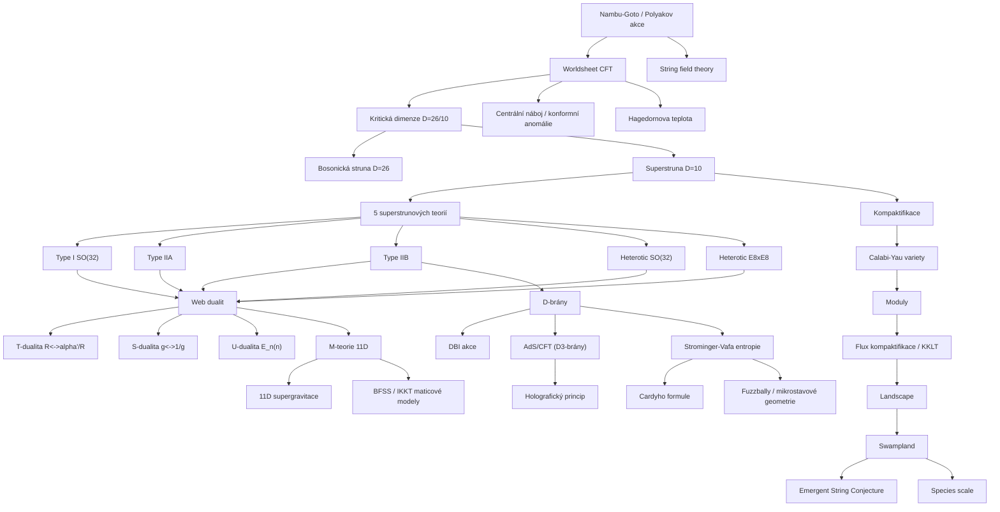

# Teorie strun a M-teorie (String Theory & M-theory)

> **TL;DR** — Teorie strun nahrazuje bodové částice jednorozměrnými objekty (strunami), jejichž vibrační módy odpovídají různým částicím včetně bezhmotného spin-2 gravitonu; je tak kandidátem na konzistentní kvantovou teorii gravitace. Konzistence vyžaduje supersymetrii a kritickou dimenzi $D=10$ (resp. $D=26$ pro bosonickou strunu); existuje pět superstrunových teorií (Type I, IIA, IIB, heterotická $SO(32)$ a $E_8\times E_8$), které jsou navzájem propojeny sítí dualit (T, S, U) a sjednoceny jedenáctirozměrnou **M-teorií** (Witten 1995). Nejsilnějšími kvantitativními výsledky jsou mikroskopické započtení entropie černé díry (Strominger–Vafa 1996) a duální gauge/gravitace dualita AdS/CFT (Maldacena 1997). Současný výzkum (2024–2026) se soustředí na program *swampland* (které efektivní teorie lze konzistentně sjednotit s gravitací), stabilizaci modulů, mikrostavové geometrie (fuzzbally) a celestiální/holografické přístupy.

---

## Přehled a historický kontext

Teorie strun vznikla koncem 60. let zcela mimo kontext kvantové gravitace — jako pokus popsat silnou interakci a hadronové rezonance. Roku 1968 navrhl **Gabriele Veneziano** amplitudu (*Veneziano amplitude*) vyjádřenou Eulerovou beta funkcí, která byla explicitně $s$–$t$ crossing symetrická a realizovala tzv. duální rezonanční model (*dual resonance model*) ([Veneziano 1968](https://doi.org/10.1007/BF02824451)). V letech 1969–1970 dali **Nambu, Nielsen a Susskind** této amplitudě fyzikální interpretaci: amplituda popisuje vibrace jednorozměrné relativistické struny. Nambu a Goto zapsali reparametrizačně invariantní akci struny (*Nambu–Goto action*).

Model měl ovšem dva problémy fatální pro hadronovou fyziku: vyžadoval kritickou dimenzi (26 pro bosonickou strunu) a obsahoval bezhmotnou částici se spinem 2. Roku 1974 **Scherk, Schwarz a Yoneya** rozpoznali, že tato spin-2 částice je graviton — a navrhli teorii strun jako teorii kvantové gravitace, nikoli hadronů. S nástupem QCD jako správné teorie silné interakce teorie strun jako model hadronů zanikla.

**První superstrunová revoluce** (1984) přišla s objevem **Greena a Schwarze**, že anomálie se ruší pouze pro gauge grupy $SO(32)$ a $E_8\times E_8$ (*Green–Schwarz mechanism*). To otevřelo cestu k pěti konzistentním superstrunovým teoriím v $D=10$. **Druhá superstrunová revoluce** (1995) začala Wittenovým návrhem, že všech pět teorií jsou limity jediné jedenáctirozměrné **M-teorie** ([Witten 1995](https://arxiv.org/abs/hep-th/9503124)), a **Polchinského** objevem D-bran jako nositelů Ramond–Ramond náboje ([Polchinski 1995](https://arxiv.org/abs/hep-th/9510017)). Následovaly dva největší kvantitativní triumfy: mikroskopické započtení entropie černé díry ([Strominger & Vafa 1996](https://arxiv.org/abs/hep-th/9601029)) a holografická dualita AdS/CFT ([Maldacena 1997](https://arxiv.org/abs/hep-th/9711200)).

---

## Klíčové koncepty

- **Struna (string)** — jednorozměrný rozprostřený objekt, jehož pohyb zametá dvourozměrnou světoplochu (*worldsheet*). Otevřené struny mají konce, uzavřené struny tvoří smyčky. Charakteristickou škálou je délka struny $\ell_s = \sqrt{\alpha'}$, kde $\alpha'$ (*Regge slope*) souvisí s napětím struny $T = 1/(2\pi\alpha')$.

- **Bosonická vs. superstrunová teorie (bosonic / superstring)** — bosonická struna je nestabilní (tachyon v základním stavu), žije v $D=26$ a obsahuje pouze bosony. Superstruna přidává na světoplochu fermionické stupně volnosti, vyžaduje supersymetrii, žije v $D=10$ a je bez tachyonu.

- **Kritická dimenze (critical dimension)** — počet rozměrů, při kterém se ruší konformní (Weylova) anomálie na světoploše. Pro bosonickou strunu $D=26$, pro superstrunu $D=10$. Anomálie je úměrná $(D-26)$, resp. $(D-10)$.

- **Pět superstrunových teorií** — **Type I** (otevřené i uzavřené struny, gauge grupa $SO(32)$, $\mathcal{N}=1$), **Type IIA** (uzavřené, nechirální, $\mathcal{N}=2$), **Type IIB** (uzavřené, chirální, $\mathcal{N}=2$), **heterotic $SO(32)$** a **heterotic $E_8\times E_8$** (hybrid bosonické levé a superstrunové pravé pohyblivosti).

- **D-brány (D-branes)** — $p+1$-rozměrné nadplochy, na nichž končí otevřené struny (Dirichletovy okrajové podmínky). Nesou Ramond–Ramond náboj, jsou dynamické a jejich nízkoenergetický popis je gauge teorie. Klíč k neperturbativní fyzice a k AdS/CFT ([Polchinski 1995](https://arxiv.org/abs/hep-th/9510017)).

- **Duality (T, S, U)** — **T-dualita** (*T-duality*) ztotožňuje strunu na kružnici o poloměru $R$ se strunou na poloměru $\alpha'/R$ (záměna hybnostních a vinutí/*winding* módů); **S-dualita** (*S-duality*) ztotožňuje silnou a slabou vazbu ($g_s \leftrightarrow 1/g_s$); **U-dualita** (*U-duality*) je jejich sjednocení, realizované výjimečnými grupami $E_{n(n)}$.

- **M-teorie (M-theory)** — domnělá jedenáctirozměrná neperturbativní teorie, jejíž nízkoenergetickou limitou je 11D supergravitace; pět 10D superstrunových teorií jsou její limity ([Witten 1995](https://arxiv.org/abs/hep-th/9503124)). Obsahuje membrány M2 a M5.

- **Kompaktifikace (compactification)** — svinutí přebytečných 6 (resp. 7) rozměrů do malého kompaktního variety. Pro zachování $\mathcal{N}=1$ SUSY ve 4D se používají **Calabi–Yauovy variety** (Ricci-ploché Kählerovy variety se speciální holonomií $SU(3)$).

- **Moduly a jejich stabilizace (moduli stabilization)** — geometrické parametry kompaktifikace (velikost, tvar) jsou bezhmotná pole (moduly). Musí být stabilizovány (jinak vznikají nepozorované páté síly) pomocí fluxů a neperturbativních efektů (scénáře **KKLT**, **LVS**).

- **String field theory (SFT)** — pokus o druhé kvantování struny, vytvoření plnohodnotné teorie pole se strunami jako kvanty (Wittenova kubická otevřená SFT 1986; uzavřená SFT Zwiebach).

- **Maticové modely (matrix models)** — **BFSS** (M(atrix) teorie, $0+1$ rozměrná supersymetrická kvantová mechanika, DLCQ M-teorie) a **IKKT** ($0+0$, redukce 10D SYM, kandidát na neperturbativní definici teorie IIB).

- **Hagedornova teplota (Hagedorn temperature)** — maximální teplota gazu strun, nad níž divergují termodynamické veličiny, protože hustota stavů roste exponenciálně s energií.

- **Landscape a swampland** — *landscape* je obrovský soubor (řádově $10^{500}$) konzistentních vakuí teorie strun; *swampland* je doplněk — efektivní teorie, jež vypadají konzistentně, ale nelze je UV-doplnit do kvantové gravitace.

---

## Matematický rámec

### Polyakovova akce (Polyakov action)

$$S_P = -\frac{1}{4\pi\alpha'} \int d^2\sigma \,\sqrt{-h}\, h^{ab}\, \partial_a X^\mu \,\partial_b X^\nu \, G_{\mu\nu}(X)$$

Zde $X^\mu(\sigma^a)$ jsou vnoření světoplochy do cílového prostoročasu (souřadnice struny), $\sigma^a=(\tau,\sigma)$ parametrizují světoplochu, $h_{ab}$ je (pomocná) metrika světoplochy s determinantem $h$, $G_{\mu\nu}$ je metrika cílového prostoru a $\alpha'$ je Reggeho sklon (kvadrát délky struny). Akce je invariantní vůči reparametrizacím a Weylovým transformacím; tato Weylova invariance na kvantové úrovni vynucuje kritickou dimenzi a Einsteinovy rovnice pro $G_{\mu\nu}$ ([Polyakov 1981](https://doi.org/10.1016/0370-2693(81)90743-7)).

### Napětí struny a Regge trajektorie

$$T = \frac{1}{2\pi\alpha'}, \qquad M^2 \approx \frac{1}{\alpha'}\big(N - a\big), \qquad J \le \alpha' M^2 + \text{konst}$$

$T$ je napětí struny (energie na jednotku délky), $M$ hmotnost vibračního módu, $N$ číslo excitačního stupně (počet kvant oscilátorů), $a$ je normálně-uspořádaná konstanta ($a=1$ pro bosonickou otevřenou strunu). Lineární vztah mezi spinem $J$ a $M^2$ je Reggeho trajektorie — historicky původní motivace.

### Kritická dimenze z konformní anomálie

$$c_{\text{total}} = D - 26 \stackrel{!}{=} 0 \;\Rightarrow\; D=26 \quad(\text{bosonická}), \qquad c_{\text{total}} = \tfrac{3}{2}(D-10) \stackrel{!}{=} 0 \;\Rightarrow\; D=10 \quad(\text{super})$$

$c$ je centrální náboj (*central charge*) Virasorovy algebry světoplochové CFT. Každé pole $X^\mu$ přispívá $c=1$, reparametrizační duchové (*ghosts*) přispívají $c=-26$. Vymizení celkové anomálie ($c=0$) je nutné pro konzistenci (zachování Weylovy symetrie) a fixuje dimenzi prostoročasu ([Lovelace](https://en.wikipedia.org/wiki/Bosonic_string_theory)).

### T-dualita: spektrum na kružnici

$$M^2 = \left(\frac{n}{R}\right)^2 + \left(\frac{m R}{\alpha'}\right)^2 + \frac{2}{\alpha'}(N+\tilde N - 2), \qquad R \;\longleftrightarrow\; \frac{\alpha'}{R}, \quad n \;\longleftrightarrow\; m$$

$n$ je hybnostní (Kaluza–Klein) kvantové číslo, $m$ je vinutí (*winding number*), $R$ poloměr kompaktní kružnice, $N,\tilde N$ levo/pravo-pohyblivé excitace. Spektrum je invariantní vůči současné záměně $R\to\alpha'/R$ a $n\leftrightarrow m$. **Samoduální poloměr** je $R=\sqrt{\alpha'}$. T-dualita ztotožňuje IIA $\leftrightarrow$ IIB a heterotic $SO(32)\leftrightarrow E_8\times E_8$ ([T-duality](https://en.wikipedia.org/wiki/T-duality)).

### Napětí D$p$-brány

$$T_{Dp} = \frac{1}{(2\pi)^p\, g_s\, \alpha'^{(p+1)/2}} \cdot \frac{1}{\sqrt{\alpha'}} \;=\; \frac{2\pi}{g_s\,(2\pi\sqrt{\alpha'})^{p+1}}$$

$g_s$ je struny vazba (*string coupling*, dáno hodnotou dilatonu $g_s=e^{\langle\Phi\rangle}$), $p$ rozměr brány. Klíčové je škálování $T_{Dp}\sim 1/g_s$ — D-brány jsou těžké při slabé vazbě, na rozdíl od fundamentální struny ($T\sim g_s^0$) a NS5-brány ($T\sim 1/g_s^2$). To z nich činí solitony, jejichž započítání umožňuje neperturbativní výpočty ([Polchinski 1995](https://arxiv.org/abs/hep-th/9510017)).

### DBI akce (Dirac–Born–Infeld)

$$S_{DBI} = -T_{Dp} \int d^{p+1}\xi\; e^{-\Phi}\,\sqrt{-\det\!\big(g_{ab} + B_{ab} + 2\pi\alpha' F_{ab}\big)}$$

$g_{ab}$ je pullback metriky cílového prostoru na bránu, $B_{ab}$ pullback Kalb–Ramondova pole, $F_{ab}$ intenzita gauge pole žijícího na bráně, $\Phi$ dilaton. Popisuje nízkoenergetickou dynamiku D-brány; v expanzi reprodukuje Maxwellovu/Yang–Millsovu teorii na světoobjemu. Limit velkého $B$-pole vede na nekomutativní gauge teorii ([Seiberg & Witten 1999](https://arxiv.org/abs/hep-th/9908142)).

### Strominger–Vafa: entropie černé díry

$$c = 6\,Q_1 Q_5, \qquad S = 2\pi\sqrt{\frac{c\,L_0}{6}} = 2\pi\sqrt{Q_1 Q_5 \, n} = \frac{A}{4G} = S_{BH}$$

Pětidimenzionální extrémní BPS černá díra je realizována vázaným stavem $Q_1$ D1-bran, $Q_5$ D5-bran a $n$ jednotek hybnosti podél společného směru v teorii IIB. CFT vázaných stavů má centrální náboj $c=6Q_1Q_5$; degenerace stavů s $L_0=n$ se počítá Cardyho asymptotickou formulí $S=2\pi\sqrt{cL_0/6}$. Výsledek **přesně** reprodukuje Bekensteinovu–Hawkingovu entropii $A/4G$ — první mikroskopické odvození entropie černé díry ([Strominger & Vafa 1996](https://arxiv.org/abs/hep-th/9601029)).

### Cardyho formule (Cardy formula)

$$S = 2\pi\sqrt{\frac{c}{6}\Big(L_0 - \frac{c}{24}\Big)} + 2\pi\sqrt{\frac{\bar c}{6}\Big(\bar L_0 - \frac{\bar c}{24}\Big)}$$

Univerzální asymptotická degenerace stavů 2D konformní teorie pole o centrálním náboji $c$ ($\bar c$ pro pravé pohyblivé) při velké hodnotě konformní váhy $L_0$. Je matematickým jádrem všech mikroskopických výpočtů entropie i Cardyho-podobných formulí pro AdS$_3$ černé díry (Strominger 1997).

### Hagedornova teplota

$$\rho(M) \sim M^{-a}\, e^{\beta_H M}, \qquad T_H = \frac{1}{\beta_H} = \frac{1}{4\pi\sqrt{\alpha'}}\;(\text{uzavřená struna}), \quad T_H = \frac{1}{2\pi\sqrt{2\alpha'}}\;(\text{otevřená})$$

$\rho(M)$ je hustota stavů struny, jež roste **exponenciálně** s hmotností. Kanonická partiční funkce $Z=\int dM\,\rho(M)e^{-\beta M}$ diverguje pro $\beta<\beta_H$, tedy nad teplotou $T_H$. Hagedornova teplota je řádově $T_H\sim 1/\ell_s \sim 10^{30}\,\mathrm{K}$ a značí fázový přechod / mez aplikovatelnosti standardní termodynamiky ([Hagedorn temperature](https://en.wikipedia.org/wiki/Hagedorn_temperature)).

### Nízkoenergetická efektivní akce (supergravitace)

$$S = \frac{1}{2\kappa^2}\int d^{10}x\,\sqrt{-G}\,e^{-2\Phi}\Big(R + 4\,(\partial\Phi)^2 - \tfrac{1}{12}H_{\mu\nu\rho}H^{\mu\nu\rho}\Big) + \dots$$

$R$ je Ricciho skalár cílového prostoru, $\Phi$ dilaton, $H=dB$ intenzita NS–NS pole, $\kappa$ gravitační vazba. Tato akce je výsledkem požadavku Weylovy invariance (vymizení beta funkcí světoplochové CFT) — Einsteinovy rovnice se v teorii strun objevují jako **podmínka konformní invariance**, ne jako postulát. Faktor $e^{-2\Phi}$ je strunový (string-frame) prefaktor, $g_s=e^{\langle\Phi\rangle}$.

### 11D supergravitace (low-energy limit M-teorie)

$$S_{11} = \frac{1}{2\kappa_{11}^2}\int d^{11}x\,\sqrt{-g}\Big(R - \tfrac{1}{2}|F_4|^2\Big) - \frac{1}{12\kappa_{11}^2}\int C_3\wedge F_4 \wedge F_4$$

$F_4=dC_3$ je intenzita 3-formního potenciálu $C_3$ (na nějž se vážou M2-brány), poslední člen je Chern–Simonsův. Jde o **jedinečnou** supergravitaci v 11 rozměrech (Cremmer–Julia–Scherk 1978). Radius 11. rozměru souvisí se strunovou vazbou IIA: $R_{11} = g_s^{2/3}\,\ell_p$, takže silně vázaná IIA dekompaktifikuje do 11D ([Witten 1995](https://arxiv.org/abs/hep-th/9503124)).

---

## Klíčové výsledky a milníky

1. **Veneziano amplituda (1968)** — zrod teorie strun jako duálního rezonančního modelu ([Veneziano 1968](https://doi.org/10.1007/BF02824451)).

2. **Graviton v spektru / strunová gravitace (1974)** — Scherk, Schwarz, Yoneya identifikují bezhmotný spin-2 mód jako graviton a navrhují teorii strun jako kvantovou gravitaci.

3. **Green–Schwarzův mechanismus rušení anomálií (1984)** — pouze $SO(32)$ a $E_8\times E_8$ jsou bez anomálií; start první superstrunové revoluce ([Green & Schwarz 1984](https://doi.org/10.1016/0370-2693(84)91565-X)).

4. **Heterotická struna (1985)** — Gross, Harvey, Martinec, Rohm; nejatraktivnější kandidát pro fenomenologii (gauge grupa $E_8\times E_8$ obsahuje Standardní model).

5. **M-teorie a 11. rozměr (1995)** — Witten: silně vázaná IIA $\to$ 11D, sjednocení pěti teorií ([Witten 1995](https://arxiv.org/abs/hep-th/9503124)).

6. **D-brány (1995)** — Polchinski: D-brány nesou RR náboj a jsou nezbytné pro duality; klíč k neperturbativní fyzice ([Polchinski 1995](https://arxiv.org/abs/hep-th/9510017)).

7. **Strominger–Vafa (1996)** — mikroskopické započtení entropie 5D extrémní černé díry: *"The Bekenstein-Hawking area-entropy relation $S_{BH}=A/4$ is derived for a class of five-dimensional extremal black holes in string theory by counting the degeneracy of BPS soliton bound states."* (česky: BH vztah plocha–entropie je odvozen pro třídu 5D extrémních černých děr započtením degenerace BPS vázaných stavů) ([Strominger & Vafa 1996](https://arxiv.org/abs/hep-th/9601029)).

8. **BFSS maticová teorie (1996)** — Banks, Fischler, Shenker, Susskind: neperturbativní (DLCQ) definice M-teorie pomocí supersymetrické maticové kvantové mechaniky ([BFSS 1996](https://arxiv.org/abs/hep-th/9610043)).

9. **AdS/CFT / Maldacenova dualita (1997)** — Type IIB na AdS$_5\times S^5$ $\equiv$ 4D $\mathcal{N}=4$ super-Yang–Mills; nejcitovanější článek HEP, realizace holografického principu ([Maldacena 1997](https://arxiv.org/abs/hep-th/9711200), upřesnění [GKP 1998](https://arxiv.org/abs/hep-th/9802109), [Witten 1998](https://arxiv.org/abs/hep-th/9802150)).

10. **IKKT model (1996)** — Ishibashi, Kawai, Kitazawa, Tsuchiya: maticový model jako neperturbativní definice IIB struny, kandidát na dynamickou emergenci prostoročasu ([IKKT 1996](https://arxiv.org/abs/hep-th/9612115)).

11. **Flux kompaktifikace a KKLT (2003)** — Kachru, Kallosh, Linde, Trivedi: konstrukce metastabilních de Sitterových vakuí, počátek diskuse o landscape ([KKLT 2003](https://arxiv.org/abs/hep-th/0301240)).

12. **Swampland program (2005–)** — Vafa a další: kritéria, jež musí efektivní teorie splnit pro UV-doplnění do kvantové gravitace ([Vafa 2005](https://arxiv.org/abs/hep-th/0509212)).

---

## Současný stav (2024–2026)

Teorie strun dnes funguje spíše jako rozsáhlý teoretický rámec a "laboratoř kvantové gravitace" než jako jednoznačně predikující teorie. Hlavní aktivní směry 2024–2026:

- **Swampland program** je nejdynamičtější odvětví. Centrální je **Emergent String Conjecture** (Lee–Lerche–Weigand): každá limita nekonečné vzdálenosti v prostoru modulů je buď dekompaktifikace, nebo limita, v níž zeslábne (stane se bez napětí) nějaká fundamentální struna v jistém duálním rámci. V roce 2024 byly testy provedeny pomocí Gopakumar–Vafa invariantů ([2309.10024](https://arxiv.org/abs/2309.10024)) a omezení z rozptylu gravitonů a černých děr ([JHEP 07(2024)208](https://link.springer.com/article/10.1007/JHEP07(2024)208)).

- **Species scale** (*škála druhů*) jako gravitační UV cutoff: $\Lambda_{\text{sp}}=M_{\text{Pl}}/\sqrt{N}$, kde $N$ je počet lehkých druhů; v roce 2024 se zkoumá její vztah k modulární invarianci a expanzi efektivní teorie ([JHEP 12(2024)019](https://link.springer.com/article/10.1007/JHEP12(2024)019)).

- **Problém de Sitterova vakua** zůstává nevyřešen a je předmětem sporu. Refined de Sitter Conjecture tvrdí, že metastabilní dS vakua jsou ve swamplandu; KKLT scénář je opakovaně kritizován i obhajován. V roce 2025 byly navrženy modely s dynamicky generovaným napětím struny, jež by mohly slučovat inflaci a temnou energii se swampland podmínkami ([phys.org 2025](https://phys.org/news/2025-06-theory-swampland-problem-conflicts-dark.html)). Mnozí se přiklánějí k **kvintesenci** (časově proměnné temné energii) místo konstantní $\Lambda$.

- **Mikrostavové geometrie a fuzzbally**: program Beny, Martince, Mathura a Warnera konstruuje hladké, bezhorizontové supergravitační řešení popisující mikrostruktura černých děr; v roce 2025 byly studovány i neextrémní mikrostavy a "informaci nesoucí" záření ([2503.17310](https://arxiv.org/abs/2503.17310), [2204.13113](https://arxiv.org/abs/2204.13113)).

- **Celestiální a plochá holografie**: snaha najít holografický popis (téměř) ploché prostoročasu (Simons Collaboration on Celestial Holography); workshop na Harvardu únor 2026. Spojení s twistorovými/ambitwistorovými strunami a měkkými teorémy.

- **Maticové modely**: BFSS jako model emergentní kosmologie a dynamické emergence prostoru a času z termálního stavu ([2205.06016](https://arxiv.org/pdf/2205.06016)); IKKT pro emergenci 3+1 prostoročasu.

- **Strojové učení landscape**: systematické skenování Calabi–Yau vakuí a numerická stabilizace Kählerových modulů ([2507.00615](https://arxiv.org/pdf/2507.00615)).

- **Stálé jádro**: AdS/CFT zůstává nejlépe pochopenou a nejvíce využívanou částí — jako nástroj pro QCD-podobné teorie, kvantovou informaci (Ryu–Takayanagi), černé díry a kondenzovaný stav.

---

## Otevřené problémy

1. **Existence de Sitterových vakuí.** Lze v plně kontrolované teorii strun zkonstruovat stabilní (nebo dlouhožijící metastabilní) de Sitterovo vakuum s pozitivní kosmologickou konstantou? Těžké, protože dS porušuje supersymetrii, vyžaduje uplift (anti-D3 brány) v režimu, kde nelze plně kontrolovat $\alpha'$ a $g_s$ korekce; swampland conjectures naznačují, že to nejde.

2. **Výběr vakua / problém landscape.** Teorie má $\sim 10^{500}$ (a více) vakuí; neexistuje dynamický princip ani předpověď, které vakuum odpovídá našemu vesmíru. Těžké, protože chybí neperturbativní formulace umožňující porovnat vakua a antropický výběr není predikce.

3. **Neperturbativní definice celé teorie.** Co je M-teorie *jako celek* (mimo perturbativní expanze a duální limity)? BFSS/IKKT jsou kandidáti, ale jejich úplná ekvivalence s M-teorií a obnova Lorentzovy invariance nejsou dokázány.

4. **Falsifikovatelnost a experimentální kontakt.** Charakteristická škála $\ell_s$ je řádově Planckova; přímé předpovědi (supersymetrie na LHC, kosmické superstruny v gravitačních vlnách, modifikace inflace) buď nebyly potvrzeny, nebo nejsou jednoznačné. Těžké, protože relevantní energie jsou nedosažitelné a teorie nemá jediné vakuum.

5. **Emergence času a kosmologická singularita.** AdS/CFT funguje pro negativní $\Lambda$ a (časově neproměnný) okraj; holografie pro kosmologii (de Sitter, Big Bang) chybí. Jak vzniká čas a jak popsat počáteční singularitu, zůstává otevřené.

6. **Informační paradox a unitárnost.** Strominger–Vafa a fuzzbally silně naznačují unitárnost a mikroskopické nositele entropie, ale úplný, na obecné (neextrémní, dynamické) černé díry aplikovatelný mechanismus úniku informace ze strunové teorie chybí (vztah k Page křivce a replica wormholes je teprve budován).

7. **Stabilizace modulů s plnou kontrolou.** KKLT a LVS spoléhají na neperturbativní efekty a aproximace; existuje trvalá debata, zda jsou jejich předpoklady (např. tau-uplift, racionální poloměry) konzistentní.

8. **Měření / vznik klasické geometrie z maticových modelů.** Jak přesně z IKKT/BFSS dynamicky vznikne 3+1 rozměrný klasický prostoročas se správnou kosmologií? Numericky naznačeno, analyticky nedořešeno.

---

## Vztahy k ostatním přístupům

### Holografie a AdS/CFT (holography-adscft) — **dobře prozkoumáno**
AdS/CFT je *přímým produktem* teorie strun (D3-brány v IIB) a je nejpřesněji zpracovanou realizací holografického principu. Strominger–Vafa byl jeho předzvěstí. Hranice mezi "teorií strun" a "holografií" je spíše organizační než fyzikální — AdS/CFT je strunový výsledek par excellence ([Maldacena 1997](https://arxiv.org/abs/hep-th/9711200)).

### Černé díry a informace (black-holes-information) — **dobře prozkoumáno**
Strunová teorie poskytla první mikroskopické započtení entropie ([Strominger & Vafa 1996](https://arxiv.org/abs/hep-th/9601029)), fuzzball program a (přes AdS/CFT) napojení na Page křivku a replica wormholes. Nejsilnější kvantitativní most teorie strun k fyzice černých děr.

### Provázanost a prostoročas (entanglement-spacetime) — **částečně prozkoumáno**
Přes AdS/CFT vede Ryu–Takayanagi formule ($S=A/4G$ pro provázanostní entropii) a program "ER=EPR" / "geometrie z provázanosti". Jde o aktivní, ale stále neúplně pochopené téma (zejména mimo AdS).

### Supergravitace (supergravity-uv) — **dobře prozkoumáno**
Supergravitace je nízkoenergetická efektivní limita teorie strun (10D) a M-teorie (11D). Teorie strun poskytuje UV-doplnění supergravitace; otázka, zda je $\mathcal{N}=8$ supergravitace sama o sobě UV-konečná (bez strun), je samostatná, ale úzce propojená.

### Swampland (swampland) — **dobře prozkoumáno (a aktivní)**
Swampland program je *vnitřní* odvětví teorie strun snažící se vymezit hranice landscape; Distance Conjecture, Weak Gravity Conjecture, Emergent String Conjecture. Most ke kosmologii a fenomenologii ([Vafa 2005](https://arxiv.org/abs/hep-th/0509212)).

### Nekomutativní geometrie (noncommutative-geometry) — **částečně prozkoumáno**
V limitě silného $B$-pole se světoobjem D-brány stává nekomutativním prostorem s Moyalovým součinem; Seiberg–Wittenova mapa ztotožňuje komutativní a nekomutativní popis ([Seiberg & Witten 1999](https://arxiv.org/abs/hep-th/9908142)). Most je dobře pochopen v tomto konkrétním režimu, ale širší vztah ke Connesově nekomutativní geometrii a Standardnímu modelu je sotva prozkoumán.

### Twistory a amplitudy (twistors-amplitudes) — **částečně prozkoumáno**
Wittenova twistorová struna (2003) ukázala, že perturbativní amplitudy $\mathcal{N}=4$ SYM jsou podporovány na holomorfních křivkách v twistorovém prostoru ([Witten 2003](https://arxiv.org/abs/hep-th/0312171)); ambitwistorové struny reprodukují amplitudy teorie pole bez masivních módů a napojují se na celestiální holografii.

### Smyčková kvantová gravitace (loop-quantum-gravity) — **sotva prozkoumáno**
LQG i teorie strun usilují o kvantovou gravitaci, ale jejich kinematika je radikálně odlišná (spinové sítě / diskrétní spektra ploch vs. spojité struny v pozadí). Společné téma: diskrétnost prostoru na Planckově škále a mikroskopické započítání entropie černé díry (obě teorie reprodukují $A/4$, ale různým mechanismem). Přímý matematický most prakticky neexistuje — jde o jednu z hlavních nevyužitých příležitostí.

### Asymptotická bezpečnost (asymptotic-safety) — **sotva prozkoumáno**
Asymptotická bezpečnost hledá netriviální UV fixní bod gravitace bez nových stupňů volnosti; teorie strun naopak přidává nekonečnou věž stavů a $\alpha'$-korekce. Možný most: species scale a vztah mezi věží stavů a UV chováním běhu vazeb — téměř neprobádáno.

### Kauzální množiny / CDT / GFT (causal-sets, causal-dynamical-triangulations, group-field-theory) — **sotva prozkoumáno**
Diskrétní/kombinatorické přístupy ke gravitaci. Sdílí s teorií strun motiv emergentní geometrie (zejména s maticovými modely BFSS/IKKT, jež jsou samy "pre-geometrickými" formulacemi). Maticové modely jsou potenciálně nejbližší most (matice $\to$ prostoročas), ale explicitní spojení s GFT/CDT je sotva prozkoumáno.

### Emergentní gravitace (emergent-gravity) — **částečně prozkoumáno**
V AdS/CFT je gravitace emergentní z gauge teorie bez gravitace na okraji; v maticových modelech vzniká prostoročas z matic. Verlindeova entropická gravitace a Jacobsonova termodynamická odvození jsou idejně příbuzné, ale formálně oddělené.

### Semiklasická gravitace a kosmologie (semiclassical-gravity, quantum-cosmology) — **částečně prozkoumáno**
Strunová kosmologie (pre-Big-Bang, brane-gas, ekpyrotický scénář), strunový plyn s Hagedornovou termodynamikou jako mechanismus výběru 3 velkých rozměrů (Brandenberger–Vafa). Kosmologická konstanta a inflace v landscape jsou aktivní, ale nedořešené.

### Experimentální testy (experimental-tests) — **sotva prozkoumáno**
Kosmické superstruny v stochastickém pozadí gravitačních vln (LISA, pulsar timing arrays), supersymetrie, modifikace disperze. Žádná jednoznačná předpověď nebyla potvrzena; jde o nejslabší článek programu.

---

## Mapa konceptů

---

## Reference

1. Veneziano, G. (1968). *Construction of a crossing-symmetric, Regge-behaved amplitude for linearly rising trajectories.* Nuovo Cimento A 57, 190. DOI: [10.1007/BF02824451](https://doi.org/10.1007/BF02824451). — Zrod teorie strun (duální rezonanční model).

2. Polyakov, A. M. (1981). *Quantum geometry of bosonic strings.* Phys. Lett. B 103, 207. DOI: [10.1016/0370-2693(81)90743-7](https://doi.org/10.1016/0370-2693(81)90743-7). — Path-integrálová kvantizace struny, kritická dimenze z Weylovy anomálie.

3. Green, M. B. & Schwarz, J. H. (1984). *Anomaly cancellations in supersymmetric D=10 gauge theory and superstring theory.* Phys. Lett. B 149, 117. DOI: [10.1016/0370-2693(84)91565-X](https://doi.org/10.1016/0370-2693(84)91565-X). — Start první superstrunové revoluce; výběr $SO(32)$ a $E_8\times E_8$.

4. Witten, E. (1995). *String theory dynamics in various dimensions.* Nucl. Phys. B 443, 85. arXiv: [hep-th/9503124](https://arxiv.org/abs/hep-th/9503124). — Návrh M-teorie; sjednocení pěti teorií v 11D.

5. Polchinski, J. (1995). *Dirichlet-branes and Ramond-Ramond charges.* Phys. Rev. Lett. 75, 4724. arXiv: [hep-th/9510017](https://arxiv.org/abs/hep-th/9510017). — D-brány jako nositelé RR náboje; klíč k neperturbativní teorii strun.

6. Strominger, A. & Vafa, C. (1996). *Microscopic origin of the Bekenstein-Hawking entropy.* Phys. Lett. B 379, 99. arXiv: [hep-th/9601029](https://arxiv.org/abs/hep-th/9601029). — První mikroskopické započtení entropie černé díry; $S=2\pi\sqrt{Q_1Q_5 n}=A/4G$.

7. Banks, T., Fischler, W., Shenker, S. H. & Susskind, L. (1996). *M theory as a matrix model: A conjecture.* Phys. Rev. D 55, 5112. arXiv: [hep-th/9610043](https://arxiv.org/abs/hep-th/9610043). — BFSS maticový model jako neperturbativní (DLCQ) definice M-teorie.

8. Ishibashi, N., Kawai, H., Kitazawa, Y. & Tsuchiya, A. (1996). *A large-N reduced model as superstring.* Nucl. Phys. B 498, 467. arXiv: [hep-th/9612115](https://arxiv.org/abs/hep-th/9612115). — IKKT maticový model, neperturbativní formulace IIB struny.

9. Maldacena, J. (1997). *The large N limit of superconformal field theories and supergravity.* Adv. Theor. Math. Phys. 2, 231. arXiv: [hep-th/9711200](https://arxiv.org/abs/hep-th/9711200). — AdS/CFT; nejcitovanější článek HEP, realizace holografie.

10. Gubser, S. S., Klebanov, I. R. & Polyakov, A. M. (1998). *Gauge theory correlators from non-critical string theory.* Phys. Lett. B 428, 105. arXiv: [hep-th/9802109](https://arxiv.org/abs/hep-th/9802109). — Upřesnění slovníku AdS/CFT.

11. Witten, E. (1998). *Anti-de Sitter space and holography.* Adv. Theor. Math. Phys. 2, 253. arXiv: [hep-th/9802150](https://arxiv.org/abs/hep-th/9802150). — Holografický slovník, korelační funkce z gravitace.

12. Hořava, P. & Witten, E. (1996). *Heterotic and Type I string dynamics from eleven dimensions.* Nucl. Phys. B 460, 506. arXiv: [hep-th/9510209](https://arxiv.org/abs/hep-th/9510209). — Heterotická M-teorie; $E_8$ na okrajích 11D.

13. Seiberg, N. & Witten, E. (1999). *String theory and noncommutative geometry.* JHEP 09, 032. arXiv: [hep-th/9908142](https://arxiv.org/abs/hep-th/9908142). — Nekomutativní gauge teorie z D-brán v $B$-poli; Seiberg–Wittenova mapa.

14. Kachru, S., Kallosh, R., Linde, A. & Trivedi, S. P. (2003). *de Sitter vacua in string theory.* Phys. Rev. D 68, 046005. arXiv: [hep-th/0301240](https://arxiv.org/abs/hep-th/0301240). — KKLT konstrukce metastabilního dS vakua; počátek landscape diskuse.

15. Witten, E. (2003). *Perturbative gauge theory as a string theory in twistor space.* Commun. Math. Phys. 252, 189. arXiv: [hep-th/0312171](https://arxiv.org/abs/hep-th/0312171). — Twistorová struna; amplitudy na holomorfních křivkách.

16. Vafa, C. (2005). *The string landscape and the swampland.* arXiv: [hep-th/0509212](https://arxiv.org/abs/hep-th/0509212). — Zavedení pojmu swampland.

17. Obers, N. A. & Pioline, B. (1999). *U-duality and M-theory.* Phys. Rept. 318, 113. arXiv: [hep-th/9809039](https://arxiv.org/abs/hep-th/9809039). — Přehled U-duality a výjimečných grup.

18. Ydri, B. (2017). *Review of M(atrix)-theory, type IIB matrix model and matrix string theory.* arXiv: [1708.00734](https://arxiv.org/abs/1708.00734). — Souhrnný přehled maticových modelů.

19. Bena, I., Martinec, E. J., Mathur, S. D. & Warner, N. P. (2022). *Fuzzballs and microstate geometries: Black-hole structure in string theory.* (Snowmass White Paper) arXiv: [2204.13113](https://arxiv.org/abs/2204.13113). — Přehled fuzzball programu.

20. Lee, S.-J., Lerche, W. & Weigand, T. (2019). *Emergent strings from infinite distance limits.* JHEP 02 (2022) 190. arXiv: [1910.01135](https://arxiv.org/abs/1910.01135). — Emergent String Conjecture.

21. Palti, E. (2019). *The swampland: Introduction and review.* Fortsch. Phys. 67, 1900037. arXiv: [1903.06239](https://arxiv.org/abs/1903.06239). — Standardní přehled swampland programu.

22. *Microstate geometries* (2025). arXiv: [2503.17310](https://arxiv.org/abs/2503.17310). — Aktuální přehled mikrostavových geometrií (2025).

23. *Gopakumar-Vafa invariants and the Emergent String Conjecture* (2024). JHEP 03 (2024) 061. arXiv: [2309.10024](https://arxiv.org/abs/2309.10024). — Test ESC pomocí GV invariantů (2024).

24. *On the species scale, modular invariance and the gravitational EFT expansion* (2024). JHEP 12 (2024) 019. [Springer](https://link.springer.com/article/10.1007/JHEP12(2024)019). — Species scale a modulární invariance (2024).

25. Conlon, J. P., Quevedo, F. & Suruliz, K. (2005). *Large-volume flux compactifications: Moduli spectrum and D3/D7 soft supersymmetry breaking.* JHEP 08, 007. arXiv: [hep-th/0505076](https://arxiv.org/abs/hep-th/0505076). — Large Volume Scenario stabilizace modulů.

26. Strominger, A. (1997). *Black hole entropy from near-horizon microstates.* JHEP 02, 009. arXiv: [hep-th/9712251](https://arxiv.org/abs/hep-th/9712251). — Cardyho formule a univerzálnost entropie černých děr.

27. Tong, D. (2009). *Lectures on string theory.* arXiv: [0908.0333](https://arxiv.org/abs/0908.0333). — Standardní moderní přednáškové poznámky (Polyakovova akce, dimenze, dualisy).
