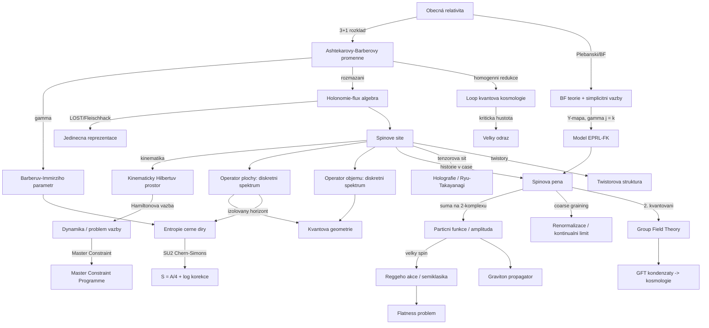

# Smyčková kvantová gravitace a spinové pěny (Loop Quantum Gravity & Spin Foams)

> **TL;DR** — Smyčková kvantová gravitace (Loop Quantum Gravity, LQG) je background-independentní, neporuchový pokus o kvantování gravitace, který bere geometrický obsah obecné relativity (general relativity, GR) doslova: kvantuje samotnou geometrii prostoru. Kanonická LQG přepisuje GR pomocí Ashtekarových-Barberových proměnných (SU(2) konexe a duální triáda), jejíž kvantování vede ke spinovým sítím (spin networks) jako bázi kinematického Hilbertova prostoru a k **diskrétním spektrům operátorů plochy a objemu** s minimálním nenulovým kvantem geometrie ($A \propto 8\pi\gamma\ell_P^2\sqrt{j(j+1)}$). Kovariantní formulace — **spinové pěny (spin foams)**, zejména model EPRL-FK — definuje amplitudu přechodu jako sumu přes historie spinových sítí na 2-komplexu. LQG úspěšně reprodukuje Bekensteinovu-Hawkingovu entropii černé díry (po fixaci Barberova-Immirziho parametru) a nahrazuje počáteční singularitu „velkým odrazem" (big bounce) v loop kvantové kosmologii. Hlavními otevřenými problémy zůstávají Hamiltonova vazba (Hamiltonian constraint) a dynamika, kontinuální/semiklasický limit (včetně „flatness problem" spinových pěn) a fyzikální status Barberova-Immirziho parametru.

## Přehled a historický kontext

Smyčková kvantová gravitace vznikla v polovině 80. let jako reakce na neúspěch perturbativní kvantizace GR a jako alternativa ke strunové teorii, která zachovává dvě klíčové vlastnosti GR: **background independence** (neexistence pevné prostoročasové metriky na pozadí) a **difeomorfní invarianci** (diffeomorphism invariance).

Klíčové milníky historického vývoje (podle [Wikipedia: Loop quantum gravity] a [Rovelli & Vidotto 2014]):

- **1986** — Abhay Ashtekar přeformuloval GR pomocí nových proměnných (Ashtekarovy proměnné) připomínajících Yangovo-Millsovo kalibrační pole, čímž učinil vazby polynomiálními ([Ashtekar 1986](https://doi.org/10.1103/PhysRevLett.57.2244)).
- **1988** — Ted Jacobson a Lee Smolin našli smyčková (loop) řešení Wheelerovy-DeWittovy rovnice; Carlo Rovelli a Lee Smolin zavedli loop reprezentaci neporuchové kvantové gravitace ([Rovelli & Smolin 1990](https://doi.org/10.1016/0550-3213(90)90019-A)).
- **1994–1995** — Rovelli a Smolin odvodili **diskrétní spektrum plochy a objemu**; objevily se spinové sítě jako ortonormální báze ([Rovelli & Smolin 1995](https://arxiv.org/abs/gr-qc/9411005)).
- **1996–1998** — Thomas Thiemann zkonstruoval (anomálně-free) operátor Hamiltonovy vazby; Ashtekar, Baez, Corichi, Krasnov spočítali entropii černé díry, čímž se objevil Barberův-Immirziho parametr ([Ashtekar, Baez, Corichi, Krasnov 1997/1998](https://arxiv.org/abs/gr-qc/9710007)).
- **2006** — Ashtekar, Pawłowski, Singh: „velký odraz" (big bounce) v loop kvantové kosmologii (LQC) nahrazuje velký třesk ([Ashtekar, Pawłowski, Singh 2006](https://arxiv.org/abs/gr-qc/0602086)).
- **2007–2008** — Engle, Pereira, Rovelli, Livine (a nezávisle Freidel, Krasnov) definovali **model EPRL-FK** — moderní spinovou pěnu s konečným Immirziho parametrem a správnou asymptotikou ([Engle, Pereira, Rovelli, Livine 2008](https://arxiv.org/abs/0711.0146)).
- **2020–** — „efektivní spinové pěny" (effective spin foams) a vysoce výkonné numerické kódy (sl2cfoam-next) umožnily první explicitní výpočty dynamiky ([Asante, Dittrich, Haggard 2020](https://arxiv.org/abs/2004.07013)).
- **2024–2026** — první implementace **graph-changing dynamiky** kanonické LQG ([Guedes, Mena Marugán, Vidotto, Müller 2024](https://arxiv.org/abs/2412.20257)); rok 2026 = 40 let Ashtekarových proměnných.

LQG má dvě komplementární větve: **kanonickou** (Hamiltonovskou, 3+1 rozštěpení, kvantování vazeb) a **kovariantní** (spinové pěny, dráhový integrál). Cílem je, aby spinové pěny poskytly fyzikální vnitřní součin a projektor na jádro vazeb kanonické teorie.

## Klíčové koncepty

- **Ashtekarovy-Barberovy proměnné (Ashtekar-Barbero variables)** — kanonický pár tvořený SU(2) konexí $A_a^i = \Gamma_a^i + \gamma K_a^i$ a hustotnenou triádou (densitized triad) $\tilde{E}^a_i$. Zde $\Gamma_a^i$ je spinová konexe, $K_a^i$ extrinsická křivost a $\gamma$ Barberův-Immirziho parametr. Přepisují GR jako SU(2) kalibrační teorii ([Wikipedia: Ashtekar variables]).

- **Barberův-Immirziho parametr (Barbero-Immirzi parameter) $\gamma$** — bezrozměrný volný parametr klasické teorie, který na klasické úrovni neovlivňuje dynamiku (je to kanonická transformace), ale kvantově vstupuje do spekter geometrie a do entropie černé díry. Jeho hodnota je fixována porovnáním s Bekensteinovou-Hawkingovou entropií ([Vyas & Joshi 2022, Physics 4(4)](https://www.mdpi.com/2624-8174/4/4/72)).

- **Holonomie-flux algebra (holonomy-flux algebra)** — fundamentální kinematická algebra LQG. Místo bodové konexe se používají **holonomie** $h_\gamma[A]$ (path-ordered exponenciála konexe podél hrany) a **fluxy** $E_S$ (toky triády plochou $S$). Tato algebra připouští **jedinečnou** (až na izomorfismus) difeomorfně-invariantní reprezentaci — věta LOST/Fleischhack ([Lewandowski, Okołów, Sahlmann, Thiemann 2006](https://arxiv.org/abs/gr-qc/0504147)).

- **Spinová síť (spin network)** — graf vnořený do prostorové hyperplochy, jehož hrany jsou označeny ireducibilními reprezentacemi SU(2) (spiny $j$) a vrcholy intertwinery (invariantní tenzory). Spinové sítě tvoří ortonormální bázi kinematického Hilbertova prostoru. Hrana = „kvantum plochy", vrchol = „kvantum objemu".

- **Diskrétní spektrum plochy a objemu (discrete area/volume spectrum)** — operátory plochy a objemu mají **diskrétní spektrum** s minimálním nenulovým vlastním číslem řádu Planckovy plochy. Tohle je signaturní výsledek LQG: prostor má atomární, zrnitou strukturu na Planckově škále.

- **Spinová pěna (spin foam)** — 2-komplex (vrcholy, hrany, stěny) označený spiny a intertwinery, reprezentující „historii" spinové sítě v čase. Amplituda spinové pěny je definována jako součin vrcholových, hranových a stěnových amplitud, sčítaný přes všechna označení.

- **Model EPRL-FK (EPRL-FK model)** — moderní spinová pěna pro 4D Lorentzovskou gravitaci. Vychází z BF teorie (topologická teorie) a vnucuje **simplicitní vazby** (simplicity constraints) prostřednictvím **Y-mapy** $Y_\gamma: \mathcal{H}_j^{SU(2)} \to \mathcal{H}_{(p,k)}^{SL(2,\mathbb{C})}$, lineární simplicitní vazba $p = \gamma j$, $k = j$ ([Perez 2013, Living Reviews](https://arxiv.org/abs/1205.2019)).

- **Plebanského formulace / BF teorie (Plebanski / BF theory)** — GR je získána z topologické BF teorie přidáním vazby, která nutí 2-formu $B$ být jednoduchá (simple), tj. $B = \star(e \wedge e)$. Spinové pěny realizují tuto strategii „constrained BF theory" diskrétně.

- **Twisted geometrie (twisted geometries)** — klasická interpretace fázového prostoru LQG na pevném grafu: každá hrana nese pár spinorů/twistorů, plochy a Lorentzovské dihedrální úhly jsou kanonickými páry. Geometrie je obecně „nepravidelná" (sousední tetrahedry sdílejí plochu o stejné velikosti, ale různého tvaru) ([Speziale & Wieland 2012](https://arxiv.org/abs/1207.6348)).

- **Izolovaný horizont (isolated horizon)** — kvazi-lokální definice horizontu černé díry v rovnováze (bez požadavku stacionarity celého prostoročasu), na kterém je definována SU(2) Chern-Simonsova teorie. Mikrostavy = body (punctures), kde spinová síť protíná horizont ([Ashtekar, Baez, Corichi, Krasnov 1998](https://arxiv.org/abs/gr-qc/9710007)).

- **Velký odraz (big bounce)** — v loop kvantové kosmologii nahrazuje počáteční singularitu odraz při kritické hustotě $\rho_c \approx 0{,}41\,\rho_{\text{Planck}}$; kvantová geometrie generuje efektivně odpudivou sílu ([Ashtekar, Pawłowski, Singh 2006](https://arxiv.org/abs/gr-qc/0602086)).

- **Flatness problem (problém plochosti)** — patologie spinových pěn: v limitě velkých spinů (semiklasické) může amplituda být peakována na **plochých** (flat) geometriích, místo aby reprodukovala plnou Reggeho dynamiku. Klíčová otevřená otázka kovariantní LQG ([Asante, Dittrich, Haggard 2020](https://arxiv.org/abs/2004.07013)).

- **Master Constraint Programme** — Thiemannův návrh, jak obejít neuzavřenost algebry Hamiltonových vazeb: sloučit všechny Hamiltonovy vazby do jediné „master" vazby $\mathbf{M} = \int d^3x\, \frac{H(x)^2}{\sqrt{\det q}}$ ([Thiemann 2003](https://arxiv.org/abs/gr-qc/0305080)).

## Matematický rámec

### Kanonické Poissonovy závorky

$$\{A_a^i(x),\, \tilde{E}^b_j(y)\} = 8\pi G\,\gamma\,\delta^b_a\,\delta^i_j\,\delta^3(x-y)$$

**Význam symbolů:** $A_a^i$ je Ashtekarova-Barberova SU(2) konexe (index $a$ prostorový, $i$ vnitřní su(2)), $\tilde{E}^b_j$ hustotnenná triáda (kanonický moment), $G$ Newtonova konstanta, $\gamma$ Barberův-Immirziho parametr. **Význam:** definuje fázový prostor kanonické LQG; konexe a triáda jsou kanonicky konjugované. Faktor $\gamma$ renormalizuje efektivní vazbu.

### Ashtekarova-Barberova konexe

$$A_a^i = \Gamma_a^i + \gamma\, K_a^i$$

**Význam symbolů:** $\Gamma_a^i$ je spinová konexe kompatibilní s triádou, $K_a^i$ je (triádová) extrinsická křivost prostorové hyperplochy, $\gamma \in \mathbb{R}\setminus\{0\}$ (případně $\gamma = \pm i$ pro self-duální Ashtekarovu konexi). **Význam:** sloučí vnitřní a vnější geometrii do jediné SU(2) konexe; pro $\gamma = \pm i$ se vazby zjednoduší na polynomiální (původní Ashtekarova self-duální formulace), ale ztrácí se reálná Hilbertova struktura.

### Holonomie a flux

$$h_\gamma[A] = \mathcal{P}\exp\!\left(\int_\gamma A_a^i \,\tau_i\, dx^a\right), \qquad E_S(f) = \int_S f^i\,\epsilon_{abc}\,\tilde{E}^a_i\, dx^b dx^c$$

**Význam symbolů:** $\mathcal{P}\exp$ je path-ordered (uspořádaná) exponenciála, $\tau_i = -\tfrac{i}{2}\sigma_i$ generátory su(2), $\gamma$ hrana (curve), $S$ plocha, $f^i$ su(2)-hodnotová testovací funkce. **Význam:** holonomie a fluxy jsou „rozmazané" (smeared) verze konexe a triády, na nichž je postavena dobře definovaná kvantová algebra; obcházejí potíže s kvantizací bodových polí.

### Spektrum operátoru plochy

$$\hat{A}_S\,|s\rangle = 8\pi\,\gamma\,\ell_P^2 \sum_{p \in S\cap s} \sqrt{j_p(j_p+1)}\;|s\rangle$$

**Význam symbolů:** $\hat{A}_S$ operátor plochy povrchu $S$, $|s\rangle$ spinová síť, $\ell_P^2 = G\hbar/c^3$ Planckova plocha, $j_p$ spin hrany protínající $S$ v bodě $p$, suma přes všechny průsečíky. **Význam:** plocha je **kvantována**; minimální nenulová plocha (area gap) je $\Delta = 4\pi\sqrt{3}\,\gamma\,\ell_P^2$ pro $j=\tfrac12$. Prostor má atomární strukturu ([Rovelli & Smolin 1995](https://arxiv.org/abs/gr-qc/9411005)).

### Spektrum operátoru objemu

$$\hat{V}_R\,|s\rangle = \sum_{v \in R} \sqrt{\left|\,\frac{1}{48}\,\epsilon_{ijk}\,\epsilon^{abc}\,\hat{E}^i_a\hat{E}^j_b\hat{E}^k_c\,\right|}\;|s\rangle$$

**Význam symbolů:** $\hat{V}_R$ operátor objemu oblasti $R$, suma přes vrcholy $v$ spinové sítě uvnitř $R$, $\epsilon_{ijk}$ a $\epsilon^{abc}$ Levi-Civitovy symboly, $\hat{E}^i_a$ triádové operátory. **Význam:** objem je rovněž diskrétní; nenulový příspěvek dávají pouze vrcholy valence $\geq 4$ s nekomplanární geometrií. Spektrum je složitější než u plochy (žádný uzavřený obecný vzorec) ([Rovelli & Smolin 1995, Discreteness](https://arxiv.org/abs/gr-qc/9411005)).

### Partiční funkce / amplituda spinové pěny

$$Z = \sum_{\{j_f\},\{i_e\}} \prod_f A_f(j_f) \prod_e A_e(j_f,i_e) \prod_v A_v(j_f,i_e)$$

**Význam symbolů:** suma přes všechna označení stěn $f$ spiny $j_f$ a hran $e$ intertwinery $i_e$; $A_f$ stěnová (face), $A_e$ hranová (edge), $A_v$ vrcholová (vertex) amplituda. **Význam:** definuje kovariantní dynamiku jako „součet přes geometrie"; klíčová netriviální složka je vrcholová amplituda $A_v$, která kóduje fyzikální obsah modelu ([Perez 2013](https://arxiv.org/abs/1205.2019)).

### Lineární simplicitní vazba a Y-mapa (EPRL)

$$Y_\gamma: |j, m\rangle_{SU(2)} \longmapsto |(p=\gamma j,\, k=j);\, j, m\rangle_{SL(2,\mathbb{C})}$$

**Význam symbolů:** $(p,k)$ označuje hlavní sérii ireducibilních unitárních reprezentací $SL(2,\mathbb{C})$, $j$ spin SU(2). Lineární simplicitní vazba je $p = \gamma j$, $k = j$. **Význam:** Y-mapa vnořuje SU(2) spinové sítě (kinematika LQG) do Lorentzovských reprezentací; je to způsob, jakým EPRL realizuje simplicitní (Plebanského) vazbu na kvantové úrovni a propojuje kanonickou a kovariantní teorii ([Engle, Pereira, Rovelli, Livine 2008](https://arxiv.org/abs/0711.0146)).

### Asymptotika vrcholové amplitudy (Reggeho akce)

$$A_v(j_f) \;\xrightarrow{\;j_f \to \infty\;}\; \frac{1}{(\ldots)}\Big( N_+ e^{+iS_{\text{Regge}}(j_f)} + N_- e^{-iS_{\text{Regge}}(j_f)} + \text{(degenerované členy)}\Big)$$

**Význam symbolů:** $S_{\text{Regge}}$ je Reggeho akce (diskrétní Einsteinova-Hilbertova akce) pro 4-simplex, $N_\pm$ prefaktory, „degenerované členy" jsou nežádoucí degenerované geometrie. **Význam:** v limitě velkých spinů dává EPRL vrchol Reggeho akci, což je test semiklasického limitu; problémem je přítomnost více než jednoho členu a degenerovaných konfigurací, které je nutno potlačit ([Engle 2013: vertex with correct semiclassical limit](https://arxiv.org/abs/1201.2187)).

### Bekensteinova-Hawkingova entropie a fixace $\gamma$

$$S = \frac{\gamma_0}{\gamma}\,\frac{A}{4\ell_P^2} - \frac{1}{2}\ln\!\left(\frac{A}{\ell_P^2}\right) + \mathcal{O}(1)$$

**Význam symbolů:** $A$ plocha horizontu, $\gamma_0$ konstanta z počítání mikrostavů (závisí na kalibrační grupě: U(1) vs. SU(2)), logaritmická korekce, jejíž koeficient je závislý na schématu ($-\tfrac12$ v U(1) počítání plochy — Meissner; $-\tfrac32$ v SU(2) Chern-Simonsově zpracování). **Význam:** porovnání s Bekensteinovou-Hawkingovou $S = A/4\ell_P^2$ fixuje $\gamma = \gamma_0$. Plné SU(2) počítání dává $\gamma_0 \approx 0{,}274$; starší U(1) počítání (Domagała-Lewandowski, Meissner) dává $\gamma_0 \approx 0{,}2375$. ⚠️ Pozor: naivní jednospinový uzavřený tvar $\ln 2/(\pi\sqrt{3}) \approx 0{,}127$ se **nerovná** skutečné SU(2) hodnotě $0{,}274$ (ta vychází z transcendentní rovnice plného počítání, nikoli z prostého logaritmu) ([Domagała & Lewandowski 2004](https://arxiv.org/abs/gr-qc/0407051); [Engle, Noui, Perez 2010](https://arxiv.org/abs/0905.3168)).

### Loop kvantová kosmologie: efektivní Friedmannova rovnice

$$\left(\frac{\dot{a}}{a}\right)^2 = \frac{8\pi G}{3}\,\rho\left(1 - \frac{\rho}{\rho_c}\right), \qquad \rho_c = \frac{\sqrt{3}}{32\pi^2\gamma^3 G^2\hbar} \approx 0{,}41\,\rho_{\text{Planck}}$$

**Význam symbolů:** $a$ škálový faktor, $\rho$ hustota energie, $\rho_c$ kritická hustota, $\gamma$ Immirziho parametr. **Význam:** korekční člen $(1-\rho/\rho_c)$ způsobuje odraz (bounce): při $\rho = \rho_c$ je $\dot{a}=0$ a expanze se obrátí. Klasický velký třesk je nahrazen kvantovým odrazem ([Ashtekar, Pawłowski, Singh 2006](https://arxiv.org/abs/gr-qc/0602086)).

### Master Constraint

$$\mathbf{M} = \int_\Sigma d^3x\,\frac{|H(x)|^2}{\sqrt{\det q(x)}}, \qquad \mathbf{M}\,|\psi\rangle_{\text{phys}} = 0$$

**Význam symbolů:** $H(x)$ lokální Hamiltonova vazba, $q$ prostorová metrika, integrál přes hyperplochu $\Sigma$. **Význam:** sloučí nekonečně mnoho Hamiltonových vazeb (které tvoří otevřenou algebru se strukturními funkcemi) do jediné kladné vazby, čímž obejde problém s neuzavírající se algebrou; jádro $\mathbf{M}$ definuje fyzikální stavy ([Thiemann 2003](https://arxiv.org/abs/gr-qc/0305080)).

## Klíčové výsledky a milníky

- **Jedinečnost reprezentace (LOST/Fleischhack, 2006)** — holonomie-flux algebra má jedinou difeomorfně-invariantní kvantovou reprezentaci. Tohle dává LQG silnou rigiditu: kinematika je v podstatě určena jednoznačně ([Lewandowski, Okołów, Sahlmann, Thiemann 2006](https://arxiv.org/abs/gr-qc/0504147)).

- **Diskrétní geometrie (1994–1995)** — plocha a objem mají diskrétní spektrum s minimálním kvantem. Toto je nejrobustnější predikce LQG, byť operátorově závislá (kalibrační a regularizační volby ovlivňují přesný tvar spektra) ([Rovelli & Smolin 1995](https://arxiv.org/abs/gr-qc/9411005)).

- **Entropie černé díry (1997–1998, revize 2010)** — počítání mikrostavů na izolovaném horizontu reprodukuje $S = A/4$ po fixaci $\gamma$. SU(2)-invariantní formulace dává $\gamma \approx 0{,}274$ a logaritmickou korekci (koeficient je závislý na schématu: $-\tfrac12 \ln A$ v U(1) počítání plochy, $-\tfrac32 \ln A$ v SU(2) Chern-Simonsově zpracování) ([Ashtekar, Baez, Corichi, Krasnov 1997/1998](https://arxiv.org/abs/gr-qc/9710007); [Engle, Noui, Perez 2010](https://arxiv.org/abs/0905.3168)).

- **Velký odraz v LQC (2006)** — kvantová geometrie rozliší singularitu velkého třesku; numericky robustní pro široké třídy stavů. Kritická hustota $\rho_c \approx 0{,}41\,\rho_{\text{Pl}}$ ([Ashtekar, Pawłowski, Singh 2006](https://arxiv.org/abs/gr-qc/0602086)).

- **Model EPRL-FK (2007–2008)** — vyřešil problémy starého Barrettova-Craneova modelu (špatné intertwinery, omezený semiklasický limit) zavedením konečného $\gamma$ a Y-mapy ([Engle, Pereira, Rovelli, Livine 2008](https://arxiv.org/abs/0711.0146); [Freidel & Krasnov 2008](https://arxiv.org/abs/0708.1595)).

- **Graviton propagator (2006)** — Bianchi, Modesto, Rovelli, Speziale spočítali komponenty dvoubodové funkce (gravitonového propagátoru) z vylepšené spinové pěny; nízkoenergetický limit korektně odpovídá propagátoru čisté gravitace v transverzálním radiálním kalibru ([Bianchi, Modesto, Rovelli, Speziale 2006](https://arxiv.org/abs/gr-qc/0604044)).

- **Spinová pěna s kosmologickou konstantou (2014–2021)** — Haggard, Han, Kamiński, Riello: pomocí $SL(2,\mathbb{C})$ Chern-Simonsovy teorie a kvantové grupy $SU(2)_q$ ($q$ kořen jednotky, $\Lambda \propto 1/k$; přesný číselný koeficient $\Lambda = 6\pi/(\ell_P^2 k)$ ⚠️ neověřeno) zavedli $\Lambda \neq 0$; amplitudy jsou konečné a asymptotika dává Reggeho akci se zakřiveným 4-simplexem ([Haggard, Han, Kamiński, Riello 2015](https://arxiv.org/abs/1412.7546); [Han 2021](https://arxiv.org/abs/2109.00034)).

- **Efektivní spinové pěny (2020–2021)** — Asante, Dittrich, Haggard (2020) / Asante, Dittrich, Padua-Arguelles (2021, Lorentzovská verze): výpočetně nejefektivnější modely, používající kvantové spektrum plochy a co nejsilnější gluing constraints; umožnily první kvantitativní testy semiklasického režimu ([Asante, Dittrich, Haggard 2020](https://arxiv.org/abs/2004.07013); [Asante, Dittrich, Padua-Arguelles 2021](https://arxiv.org/abs/2104.00485)).

- **Numerika EPRL (2018–2024)** — kód sl2cfoam-next zrychlil výpočty Lorentzovských EPRL amplitud o mnoho řádů a umožnil potvrdit „flatness problem" i první výpočet dynamiky s vnitřní hranou ([Gozzini 2021](https://arxiv.org/abs/2107.13952)).

## Současný stav (2024-2026)

Pole je v roce 2026 v aktivní fázi přechodu od formálních konstrukcí k **explicitním (numerickým) výpočtům dynamiky**:

1. **Graph-changing dynamika (2024)** — poprvé numericky implementována akce Hamiltonovy vazby měnící graf (nejen spiny, ale i topologii spinové sítě). Nalezena nová řešení vazby nedostupná v aproximaci s pevným grafem; ukázáno, že některé pozorovatelné se chovají jinak než ve fixed-graph truncacích ([Guedes, Mena Marugán, Vidotto, Müller 2024](https://arxiv.org/abs/2412.20257)).

2. **Kontinuální limit spinových pěn (2026)** — nová axiomatika založená na TQFT a Refined Algebraic Quantisation: silné notiony konvergence nutně vedou k topologické teorii (no-go), proto se přijímá **distribucionální** rámec, ve kterém kontinuální amplitudy fungují jako distribuce na fyzikálních stavech; amplituda válce definuje rigging mapu konstruující fyzikální Hilbertův prostor ([Bruno, Colafranceschi, Mele, Rovelli: Structure of the Continuum Limit, 2026](https://arxiv.org/abs/2603.16999)).

3. **Efektivní spinové pěny & Monte Carlo** — kombinace efektivních modelů s uniform-sampling Monte Carlo dramaticky snižuje výpočetní náklady na amplitudy s mnoha vnitřními stěnami; cílem je vystihnout semiklasický režim a otestovat Einsteinovy rovnice ([Asante, Dittrich, Haggard 2021](https://arxiv.org/abs/2104.00485)).

4. **Černé díry & Planck stars (2024–2025)** — efektivní LQG modely gravitačního kolapsu: singularita nahrazena odrazem při Planckově hustotě, vznik „Planck star" remnantů; junction conditions (Israel-Darmois) udržují odraz kauzálně skrytý za horizontem; remnanty jako kandidáti na temnou hmotu ([Could Planck Star Remnants be Dark Matter? 2025](https://arxiv.org/abs/2506.03334)).

5. **40 let Ashtekarových proměnných (2026)** — speciální číslo časopisu *Universe* na počest A. Ashtekara; reflexe nad kanonickou i kovariantní větví ([MDPI Universe special issue 2026](https://www.mdpi.com/journal/universe/special_issues/honorary_ak)).

## Otevřené problémy

1. **Hamiltonova vazba a dynamika (Hamiltonian constraint problem).** Thiemannův operátor je matematicky dobře definovaný a anomálně-free, ale: (a) algebra vazeb se neuzavírá s konstantními strukturními koeficienty (struktura *funkcí*, ne *konstant*), takže standardní Diracovo kvantování naráží; (b) operátor je **graph-changing**, takže semiklasické koherentní stavy nevypovídají o nově generovaných stupních volnosti; (c) faktorové uspořádání a regularizace jsou **vícenásobně nejednoznačné**. *Proč je to těžké:* difeomorfní invariance vede k vazbové algebře se strukturními funkcemi a k „problému času" (problem of time). Pokus o řešení: Master Constraint Programme (Thiemann) ([Thiemann 2003](https://arxiv.org/abs/gr-qc/0305080)).

2. **Semiklasický a kontinuální limit (semiclassical/continuum limit).** Nebyl podán důkaz, že LQG (kanonická ani kovariantní) reprodukuje GR jako efektivní teorii. Velký-spin limit a kontinuální limit **nemusí komutovat**. *Proč je to těžké:* background independence znamená, že neexistuje pevné pozadí, kolem nějž by se perturbovalo; je třeba definovat samotnou notion „klasické geometrie" uvnitř teorie ([Bruno, Colafranceschi, Mele, Rovelli 2026](https://arxiv.org/abs/2603.16999)).

3. **Flatness problem spinových pěn.** V semiklasickém limitě může amplituda spinové pěny být peakována na **plochých** geometriích, místo aby fluktuace kolem zakřivené Reggeho geometrie byly potlačeny. *Proč je to těžké:* gluing constraints a volba ploch jako fundamentálních proměnných tlačí dynamiku k plochosti; efektivní spinové pěny se mu vyhýbají jen v omezeném pásmu parametrů ([Asante, Dittrich, Haggard 2020](https://arxiv.org/abs/2004.07013)).

4. **Fyzikální status Barberova-Immirziho parametru.** $\gamma$ je klasicky kanonickou transformací (nepozorovatelný), ale kvantově určuje měřítko diskrétní geometrie i entropii. *Proč je to těžké:* jeho hodnota je fixována *ad hoc* požadavkem $S=A/4$; různá počítání (U(1) vs. SU(2), různé předpoklady o minimálním spinu) dávají různé hodnoty ($\approx 0{,}237$ až $0{,}274$ a další), a není jasné, zda jde o skutečnou fundamentální konstantu ([Vyas & Joshi 2022](https://www.mdpi.com/2624-8174/4/4/72)).

5. **Vztah kanonické a kovariantní teorie.** Není dokázáno, že amplituda spinové pěny EPRL skutečně implementuje projektor na jádro Hamiltonovy vazby kanonické LQG. *Proč je to těžké:* obě formulace používají odlišné stupně volnosti (graph-changing operátory vs. pevné 2-komplexy) a jejich přesné slovní spojení vyžaduje kontrolu nad sumou přes 2-komplexy (refinement limit) ([Perez 2013](https://arxiv.org/abs/1205.2019)).

6. **Spojení hmoty a Standardního modelu.** Začlenění fermionů, kalibračních polí a získání nízkoenergetické fyziky částic z LQG zůstává sporadické; chybí systematický mechanismus pro emergenci Standardního modelu. *Proč je to těžké:* LQG kvantuje geometrii, ale nemá vestavěný princip určující obsah hmoty (na rozdíl od strunové teorie).

7. **Lorentzova invariance a fenomenologie.** Diskrétní spektrum geometrie vyvolává obavy z porušení Lorentzovy invariance / modifikovaných disperzních relací; LQG spíše vede k *deformaci* (DSR, $\kappa$-Poincaré) než k porušení, ale plný důkaz lokální Lorentzovy invariance chybí. *Proč je to těžké:* diskrétnost plochy je škálová veličina, kterou je třeba sladit s relativitou; astrofyzikální data (gamma-ray bursts) silně omezují lineární modifikace disperzí ([Bojowald, Morales-Tecotl, Sahlmann 2005](https://arxiv.org/abs/gr-qc/0411101)).

## Vztahy k ostatním přístupům

### Group Field Theory (GFT)
**Jak dobře prozkoumáno: dobře.** GFT je *druhokvantovaná* reformulace stavového prostoru LQG a kompletizace spinové pěny: perturbativní rozvoj GFT kolem vakua generuje Feynmanovy diagramy duální 4D buněčným komplexům, jejichž amplitudy **jsou** přesně spinové pěny. GFT kondenzáty modelují homogenní kosmologie a reprodukují Friedmannovu dynamiku včetně LQC korekcí a odrazu. Toto je nejtěsnější a nejlépe zmapovaný most LQG ([Gielen, Oriti, Sindoni 2013](https://arxiv.org/abs/1303.3576)).

### Causal Dynamical Triangulations (CDT) a Causal Sets
**Jak dobře prozkoumáno: částečně.** Sdílejí filozofii diskrétní/kauzální struktury prostoročasu. Klíčový rozdíl: v LQG/spinových pěnách je **diskrétnost fundamentální**, kdežto v CDT je to regularizace odstraňovaná kontinuálním limitem. V CDT lze přesně počítat vzdálenosti (triangulace jsou vlastní stavy operátoru vzdálenosti), v LQG nikoli. Spojení přes „efektivní spinové pěny" (jako simplicial path integral) je aktivně zkoumáno, ale formální slovník (LQG ↔ CDT fázový diagram) chybí ([Wikipedia: CDT]).

### Asymptotic Safety
**Jak dobře prozkoumáno: sotva prozkoumáno.** Oba programy hledají neporuchovou definici kvantové gravitace; spinové pěny by mohly mít netriviální RG fixní bod (UV completion) analogický asymptotic-safety scénáři. Coarse-graining/tensor network renormalizace spinových pěn explicitně hledá fázovou strukturu a fixní body ([Editorial: Coarse graining in QG 2021](https://arxiv.org/abs/2103.14605)). Přímý důkaz, že kontinuální limit spinové pěny = asymptoticky bezpečný fixní bod, **chybí** — to je jeden z hlavních „gold" mostů k prozkoumání.

### Holografie / AdS-CFT a Entanglement-Spacetime
**Jak dobře prozkoumáno: částečně.** Spinové sítě jsou přirozeně tenzorové sítě (PEPS) a vykazují area law entanglementu. Han & Hung ukázali exact holographic mapping mezi LQG spinovými sítěmi a tenzorovými sítěmi; boundary entanglement entropy emergentní tenzorové sítě splňuje **Ryuovu-Takayanagiho formuli** v semiklasickém režimu ([Han & Hung 2017](https://arxiv.org/abs/1610.02134)). Nové práce (2025) odvozují geometrický area law přímo v LQG ([arXiv:2510.26922, 2025](https://arxiv.org/abs/2510.26922)). Chybí ale vlastní holografická dualita LQG ↔ CFT a propojení s AdS/CFT slovníkem.

### Twistory a amplitudy (Twistors-Amplitudes)
**Jak dobře prozkoumáno: částečně.** Fázový prostor LQG na pevném grafu se rozkládá na **twistory** (dva twistory na hranu), holonomie a fluxy jsou spinorové bilineáry; EPRL amplitudy lze odvodit z dráhového integrálu v twistorovém prostoru ([Speziale & Wieland 2012](https://arxiv.org/abs/1207.6348)). Spojení se spinor-helicity formalismem amplitud částicové fyziky je naznačeno, ale konkrétní výpočetní most (LQG ↔ scattering amplitudes) je nevyužitý.

### Noncommutative Geometry / DSR
**Jak dobře prozkoumáno: částečně.** Linearizace deformované hypersurface-deformation algebry LQG je spojena s $\kappa$-Poincaré symetrií a DSR programem; $\kappa$-Minkowski je nekomutativní prostoročas duální ke $\kappa$-Poincaré ([Loop-deformed Poincaré algebra 2013](https://arxiv.org/abs/1304.2208)). Tohle je slibný most ke kvantově-gravitační fenomenologii (modifikované disperze), ale není dokázáno, že LQG *jednoznačně* implikuje konkrétní deformaci.

### Strunová teorie a holografie
**Jak dobře prozkoumáno: sotva prozkoumáno.** Historicky chápány jako rivalové; přímé mosty jsou vzácné. Sdílejí ovšem koncept *area law* entropie černé díry, *diskrétní spektra* a v poslední době *tenzorové sítě / holografii*. Možný (zatím nevyužitý) most: spinová pěna jako lattice-discretizace strunové world-sheet teorie, nebo společná struktura přes BF/topologické teorie. Toto je jeden z nejméně prozkoumaných, ale potenciálně nejcennějších mostů.

### Quantum Cosmology a Black Holes / Information
**Jak dobře prozkoumáno: dobře (LQC) / částečně (informace).** LQC je nejúspěšnější aplikace LQG: odraz, potlačení singularity, predikce pro CMB. Mosty k black-hole information: Planck stars, remnanty, návrhy řešení informačního paradoxu odrazem uvnitř horizontu — koncepčně zajímavé, ale kvantitativně nedotažené ([Could Planck Star Remnants be Dark Matter? 2025](https://arxiv.org/abs/2506.03334)).

## Mapa konceptů

## Reference

1. Ashtekar, A. (1986). *New Variables for Classical and Quantum Gravity*. Phys. Rev. Lett. 57, 2244. DOI: [10.1103/PhysRevLett.57.2244](https://doi.org/10.1103/PhysRevLett.57.2244). — Zavedení Ashtekarových proměnných; zakládající práce LQG.

2. Rovelli, C., Smolin, L. (1990). *Loop space representation of quantum general relativity*. Nucl. Phys. B 331, 80. DOI: [10.1016/0550-3213(90)90019-A](https://doi.org/10.1016/0550-3213(90)90019-A). — Loop reprezentace; vznik neporuchové kvantové gravitace.

3. Rovelli, C., Smolin, L. (1995). *Discreteness of area and volume in quantum gravity*. Nucl. Phys. B 442, 593. arXiv: [gr-qc/9411005](https://arxiv.org/abs/gr-qc/9411005). — Diskrétní spektrum plochy a objemu; signaturní výsledek.

4. Rovelli, C., Smolin, L. (1995). *Spin networks and quantum gravity*. Phys. Rev. D 52, 5743. arXiv: [gr-qc/9505006](https://arxiv.org/abs/gr-qc/9505006). — Spinové sítě jako ortonormální báze kinematiky.

5. Ashtekar, A., Lewandowski, J. (1997). *Quantum theory of geometry I: Area operators*. Class. Quant. Grav. 14, A55. arXiv: [gr-qc/9602046](https://arxiv.org/abs/gr-qc/9602046). — Rigorózní konstrukce operátoru plochy.

6. Thiemann, T. (1998). *Quantum Spin Dynamics (QSD)*. Class. Quant. Grav. 15, 839. arXiv: [gr-qc/9606089](https://arxiv.org/abs/gr-qc/9606089). — Anomálně-free operátor Hamiltonovy vazby.

7. Ashtekar, A., Baez, J., Corichi, A., Krasnov, K. (1998). *Quantum Geometry and Black Hole Entropy*. Phys. Rev. Lett. 80, 904. arXiv: [gr-qc/9710007](https://arxiv.org/abs/gr-qc/9710007). — Entropie černé díry z izolovaného horizontu; objev role $\gamma$.

8. Domagała, M., Lewandowski, J. (2004). *Black hole entropy from Quantum Geometry*. Class. Quant. Grav. 21, 5233. arXiv: [gr-qc/0407051](https://arxiv.org/abs/gr-qc/0407051). — Přesné U(1) počítání mikrostavů, hodnota $\gamma$.

9. Meissner, K. (2004). *Black hole entropy in Loop Quantum Gravity*. Class. Quant. Grav. 21, 5245. arXiv: [gr-qc/0407052](https://arxiv.org/abs/gr-qc/0407052). — Logaritmická korekce $-\tfrac12 \ln A$.

10. Lewandowski, J., Okołów, A., Sahlmann, H., Thiemann, T. (2006). *Uniqueness of diffeomorphism invariant states on holonomy-flux algebras*. Commun. Math. Phys. 267, 703. arXiv: [gr-qc/0504147](https://arxiv.org/abs/gr-qc/0504147). — Věta LOST o jedinečnosti reprezentace.

11. Ashtekar, A., Pawłowski, T., Singh, P. (2006). *Quantum Nature of the Big Bang*. Phys. Rev. Lett. 96, 141301. arXiv: [gr-qc/0602086](https://arxiv.org/abs/gr-qc/0602086). — Velký odraz v LQC, kritická hustota $\rho_c \approx 0{,}41\,\rho_{\text{Pl}}$.

12. Bianchi, E., Modesto, L., Rovelli, C., Speziale, S. (2006). *Graviton propagator in loop quantum gravity*. Class. Quant. Grav. 23, 6989. arXiv: [gr-qc/0604044](https://arxiv.org/abs/gr-qc/0604044). — Dvoubodová funkce / gravitonový propagátor ze spinové pěny.

13. Engle, J., Pereira, R., Rovelli, C., Livine, E. (2008). *LQG vertex with finite Immirzi parameter*. Nucl. Phys. B 799, 136. arXiv: [0711.0146](https://arxiv.org/abs/0711.0146). — Model EPRL; moderní vrcholová amplituda.

14. Freidel, L., Krasnov, K. (2008). *A new spin foam model for 4d gravity*. Class. Quant. Grav. 25, 125018. arXiv: [0708.1595](https://arxiv.org/abs/0708.1595). — Model FK (komplementární k EPRL).

15. Rovelli, C. (2011). *Zakopane lectures on loop gravity*. PoS QGQGS2011, 003. arXiv: [1102.3660](https://arxiv.org/abs/1102.3660). — Pedagogický přehled kovariantní LQG a definice modelu.

16. Engle, J., Noui, K., Perez, A. (2010). *Black hole entropy and SU(2) Chern-Simons theory*. Phys. Rev. Lett. 105, 031302. arXiv: [0905.3168](https://arxiv.org/abs/0905.3168). — SU(2)-invariantní entropie, $\gamma \approx 0{,}274$. (Opraveno: arXiv 0905.3168 má pouze tři autory; D. Pranzetti není autorem.)

17. Perez, A. (2013). *The Spin Foam Approach to Quantum Gravity*. Living Rev. Rel. 16, 3. arXiv: [1205.2019](https://arxiv.org/abs/1205.2019). DOI: [10.12942/lrr-2013-3](https://doi.org/10.12942/lrr-2013-3). — Autoritativní přehled spinových pěn.

18. Engle, J. (2013). *A spin-foam vertex amplitude with the correct semiclassical limit*. Phys. Lett. B 724, 333. arXiv: [1201.2187](https://arxiv.org/abs/1201.2187). — „Proper vertex" potlačující degenerované sektory.

19. Speziale, S., Wieland, W. (2012). *The twistorial structure of loop-gravity transition amplitudes*. Phys. Rev. D 86, 124023. arXiv: [1207.6348](https://arxiv.org/abs/1207.6348). — Twistorová parametrizace; most k amplitudám.

20. Rovelli, C., Vidotto, F. (2014). *Covariant Loop Quantum Gravity*. Cambridge University Press. — Standardní monografie kovariantní LQG a spinfoamu.

21. Haggard, H., Han, M., Kamiński, W., Riello, A. (2015). *SL(2,C) Chern-Simons theory, a non-planar graph operator, and 4D quantum gravity with a cosmological constant*. Nucl. Phys. B 900, 1. arXiv: [1412.7546](https://arxiv.org/abs/1412.7546). — Zakřivený 4-simplex, kosmologická konstanta přes kvantovou grupu.

22. Han, M. (2021). *Four-dimensional Spinfoam Quantum Gravity with Cosmological Constant: Finiteness and Semiclassical Limit*. arXiv: [2109.00034](https://arxiv.org/abs/2109.00034). — Konečnost a semiklasický limit spinové pěny s $\Lambda$. (Jediný autor: Muxin Han.)

23. Han, M., Hung, L.-Y. (2017). *Loop Quantum Gravity, Exact Holographic Mapping, and Holographic Entanglement Entropy*. Phys. Rev. D 95, 024011. arXiv: [1610.02134](https://arxiv.org/abs/1610.02134). — Most LQG ↔ tenzorové sítě ↔ Ryu-Takayanagi.

24. Asante, S., Dittrich, B., Haggard, H. (2020). *Effective Spin Foam Models for Four-Dimensional Quantum Gravity*. Phys. Rev. Lett. 125, 231301. arXiv: [2004.07013](https://arxiv.org/abs/2004.07013). — Efektivní spinové pěny; flatness problem.

25. Asante, S. K., Dittrich, B., Padua-Arguelles, J. (2021). *Effective Spin Foam Models for Lorentzian Quantum Gravity*. Class. Quant. Grav. 38, 195002. arXiv: [2104.00485](https://arxiv.org/abs/2104.00485). — Lorentzovská verze efektivních modelů. (Opraveno: třetím autorem je Padua-Arguelles, nikoli Haggard.)

26. Gozzini, F. (2021). *A high-performance code for EPRL spin foam amplitudes*. Eur. Phys. J. C 81, 491. arXiv: [2107.13952](https://arxiv.org/abs/2107.13952). — Kód sl2cfoam-next; numerické amplitudy.

27. Thiemann, T. (2003). *The Phoenix Project: Master Constraint Programme for Loop Quantum Gravity*. Class. Quant. Grav. 23, 2211. arXiv: [gr-qc/0305080](https://arxiv.org/abs/gr-qc/0305080). — Master Constraint jako řešení problému dynamiky.

28. Bojowald, M., Morales-Tecotl, H. A., Sahlmann, H. (2005). *On Loop Quantum Gravity Phenomenology and the Issue of Lorentz Invariance*. Phys. Rev. D 71, 084012. arXiv: [gr-qc/0411101](https://arxiv.org/abs/gr-qc/0411101). — Fenomenologie a Lorentzova invariance. (Opraveno: autoři nejsou Gambini & Pullin, nýbrž Bojowald, Morales-Tecotl, Sahlmann.)

29. Gielen, S., Oriti, D., Sindoni, L. (2013). *Cosmology from Group Field Theory Formalism for Quantum Gravity*. Phys. Rev. Lett. 111, 031301. arXiv: [1303.3576](https://arxiv.org/abs/1303.3576). — GFT kondenzáty a kosmologie; most LQG ↔ GFT.

30. Bruno, M., Colafranceschi, E., Mele, F. M., Rovelli, C. (2026). *The Structure of the Continuum Limit of Spin Foams*. arXiv: [2603.16999](https://arxiv.org/abs/2603.16999). — Kontinuální limit přes TQFT/RAQ, distribucionální rámec (2026). (Opraveno: autoři nejsou Dittrich et al.)

31. Guedes, T. L. M., Mena Marugán, G. A., Vidotto, F., Müller, M. (2024). *Computing the graph-changing dynamics of loop quantum gravity*. arXiv: [2412.20257](https://arxiv.org/abs/2412.20257). — První numerická implementace graph-changing Hamiltonovy vazby. (Opraveno: autoři nejsou Liegener et al.)

32. (2025). *Entanglement entropy in Loop Quantum Gravity and geometrical area law*. arXiv: [2510.26922](https://arxiv.org/abs/2510.26922). — Geometrický area law přímo v LQG.

33. (2025). *Could Planck Star Remnants be Dark Matter?*. arXiv: [2506.03334](https://arxiv.org/abs/2506.03334). — Planck stars, remnanty, temná hmota.

34. Vyas, R. P., Joshi, M. J. (2022). *The Barbero–Immirzi Parameter: An Enigmatic Parameter of Loop Quantum Gravity*. Physics 4(4), 1094–1116. DOI: [10.3390/physics4040072](https://doi.org/10.3390/physics4040072). — Přehled hodnot a interpretací $\gamma$. (Opraveno: autoři jsou Vyas & Joshi, nikoli Sahlmann; strany 1094–1116, nikoli 1134.)
