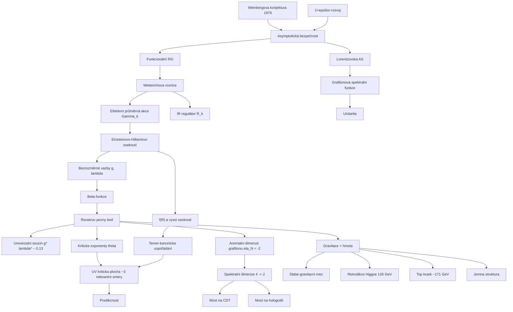

# Asymptotická bezpečnost (Asymptotic Safety)

> **TL;DR** — Asymptotická bezpečnost (asymptotic safety, AS) je scénář, v němž je gravitace **neporuchově renormalizovatelnou** kvantovou teorií pole díky netriviálnímu (interagujícímu) ultrafialovému (UV) pevnému bodu renormalizační grupy — tzv. **Reuterovu pevnému bodu (Reuter fixed point)**. Bezrozměrné vazby (zejména Newtonova vazba $g$ a kosmologická konstanta $\lambda$) se na vysokých energiích nepřibližují k nule, nýbrž ke konstantním netriviálním hodnotám, takže fyzikální veličiny zůstávají „v bezpečí" před divergencemi. Hlavním nástrojem je **Wetterichova rovnice (Wetterich equation)** — exaktní funkcionální renormalizační grupa pro efektivní průměrnou akci. Klíčovým numerickým výsledkem v Einsteinově-Hilbertově oseknutí (truncation) je netriviální pevný bod s $g^*>0$, $\lambda^*>0$, univerzálním součinem $g^*\lambda^*\approx 0{,}13$ a komplexně sdruženou dvojicí kritických exponentů. **UV kritická plocha (critical surface)** se zdá být konečněrozměrná (≈ 3 relevantní směry), což činí teorii predikční. Mezi nejslavnější fenomenologické výsledky patří **retrodikce hmotnosti Higgse ≈ 126 GeV** (Shaposhnikov & Wetterich 2009). Otevřenými problémy zůstávají lorentzovský podpis, unitarita, nezávislost na pozadí a závislost na oseknutí.

## Přehled a historický kontext

Poruchová kvantová gravitace je **nerenormalizovatelná**: 't Hooft a Veltman (1974) ukázali jednosmyčkovou renormalizovatelnost čisté gravitace na hmotnostní slupce, ale Goroff a Sagnotti (1986) prokázali dvousmyčkovou divergenci $\propto R^3$, kterou nelze absorbovat do Einsteinovy-Hilbertovy akce. Standardní kritérium renormalizovatelnosti (konečný počet protičlenů) tak selhává — Newtonova konstanta má zápornou hmotnostní dimenzi a teorie je „nepoužitelná" jako fundamentální v poruchovém smyslu.

**Steven Weinberg** navrhl v roce 1976 (publikováno 1979 v *General Relativity: An Einstein Centenary Survey*, eds. Hawking & Israel) myšlenku, že gravitace může být **neporuchově renormalizovatelná**, pokud renormalizační tok jejích vazeb končí v UV na netriviálním (interagujícím) pevném bodě. Po vzoru asymptotické volnosti (asymptotic freedom) neabelovských kalibračních teorií zavedl termín **asymptotic safety** — fyzikální veličiny jsou „bezpečné" před divergencemi při odstranění obřízky (cutoff). Weinberg podpořil tuto myšlenku **$2+\varepsilon$ rozvojem (2+ε expansion)**: kolem dvou dimenzí, kde je Newtonova konstanta bezrozměrná, má beta-funkce netriviální pevný bod $g^* \propto \varepsilon$ a teorie je tam asymptoticky bezpečná. Extrapolace k $d=4$ ($\varepsilon=2$) je ovšem nekontrolovaná.

Skutečný průlom přišel s **Martinem Reuterem** (1996–1998), který odvodil **exaktní funkcionální renormalizační grupovou rovnici** pro **efektivní průměrnou akci (effective average action)** gravitačního pole a v **Einsteinově-Hilbertově oseknutí (Einstein-Hilbert truncation)** nalezl netriviální UV pevný bod, jenž je UV-přitažlivý v obou směrech vazeb [Reuter 1998](https://arxiv.org/abs/hep-th/9605030). Tento pevný bod se dnes nazývá **Reuterův pevný bod**.

Následoval rychlý rozvoj důkazů: Souma (1999) potvrdil pevný bod, Lauscher & Reuter (2002) přidali $R^2$ člen, Codello, Percacci & Rahmede (2008) a Machado & Saueressig (2008) rozšířili oseknutí na polynomiální $f(R)$, Benedetti, Machado & Saueressig (2009) zahrnuli $R^2_{\mu\nu}$, a Falls, Litim, Nikolakopoulos & Rahmede (2013–2016) prokázali pozoruhodnou konvergenci kritických exponentů ve vysokostupňových $f(R)$ oseknutích. Codello, Percacci & Rahmede (2009) shrnuli, že **téměř-kanonické uspořádání (near-canonical scaling)** drží: kvantové škálovací dimenze zůstávají blízké kanonickým, což omezuje počet relevantních směrů na ≈ 3.

Paralelně se objevily fenomenologické aplikace: **retrodikce hmotnosti Higgse** [Shaposhnikov & Wetterich 2009](https://arxiv.org/abs/0912.0208), **omezení obsahu hmoty** [Donà, Eichhorn & Percacci 2014](https://arxiv.org/abs/1311.2898), **predikce jemné struktury** a **hmotnosti top kvarku** (Eichhorn & Held 2017–2018). Posledních ~5 let dominuje úsilí o **lorentzovskou formulaci**, **unitaritu** (grafitonová spektrální funkce, rozptylové amplitudy) a propojení s **mřížkovými přístupy (CDT)**.

Standardní moderní reference: Living Review [Niedermaier & Reuter 2006](https://link.springer.com/article/10.12942/lrr-2006-5), Scholarpedia (Reuter & Saueressig), monografie Reuter & Saueressig *Quantum Gravity and the Functional Renormalization Group* (Cambridge 2019), recenze Eichhorn (2018, 2020), Percacci *An Introduction to Covariant Quantum Gravity and Asymptotic Safety* (2017) a kapitoly *Handbook of Quantum Gravity* (2023–2024).

## Klíčové koncepty

- **Asymptotická bezpečnost (asymptotic safety)** — scénář UV-úplnosti, v němž renormalizační tok končí na netriviálním pevném bodě; bezrozměrné vazby zůstávají konečné a teorie je neporuchově renormalizovatelná i bez asymptotické volnosti ($g^*\neq 0$).

- **Reuterův pevný bod (Reuter fixed point)** — interagující (non-Gaussian) UV pevný bod gravitačního renormalizačního toku; jádro celého programu. UV-přitažlivý v relevantních směrech.

- **Efektivní průměrná akce (effective average action $\Gamma_k$)** — koarse-grainovaný (coarse-grained) funkcionál, v němž jsou integrovány kvantové fluktuace s hybnostmi $p \gtrsim k$; interpoluje mezi mikroskopickou akcí ($k\to\infty$) a plnou efektivní akcí ($k\to 0$).

- **Wetterichova rovnice (Wetterich equation)** — exaktní funkcionálně-diferenciální tok $\partial_t \Gamma_k$; implementuje Wilsonovskou renormalizaci „slupku po slupce" v hybnostním prostoru a dává přístup k toku mimo poruchový režim.

- **Funkcionální renormalizační grupa (functional renormalization group, FRG)** — neporuchová formulace RG založená na Wetterichově rovnici; hlavní výpočetní nástroj AS.

- **Einsteinovo-Hilbertovo oseknutí (Einstein-Hilbert truncation)** — nejjednodušší neporuchová aproximace teoretického prostoru: $\Gamma_k$ zahrnuje jen $\int\sqrt{g}(2\Lambda_k - R)/(16\pi G_k)$, tj. běžící Newtonovu vazbu a kosmologickou konstantu.

- **Bezrozměrné vazby (dimensionless couplings)** — $g_k = k^{d-2}G_k$ a $\lambda_k = k^{-2}\Lambda_k$; pevný bod existuje v jejich prostoru.

- **UV kritická plocha (UV critical surface)** — podprostor teoretického prostoru tvořený trajektoriemi, které končí v UV na pevném bodě; její **dimenze = počet relevantních směrů** = počet volných parametrů teorie. Konečnost = predikčnost.

- **Kritické exponenty (critical exponents $\theta_I$)** — vlastní čísla stabilitní matice $-\partial\beta_i/\partial g_j$ v pevném bodě (se znaménkem). $\mathrm{Re}\,\theta_I > 0$ ⇒ relevantní (UV-přitažlivý) směr; $\mathrm{Re}\,\theta_I < 0$ ⇒ irelevantní. V Einsteinově-Hilbertově oseknutí jsou komplexně sdružené, $\theta_{1,2}=\theta'\pm i\theta''$.

- **Relevantní / irelevantní směry (relevant/irrelevant directions)** — relevantní směry = volné parametry; irelevantní směry jsou pevně určeny pevným bodem (jejich hodnoty „přitaženy" do kritické plochy).

- **Regulátor / obřízková funkce (IR regulator $\mathcal{R}_k$)** — člen kvadratický ve fluktuacích, který dává hmotnost ($\sim k^2$) modům s $p<k$ a tlumí infračervené fluktuace; jeho tvar (Litimův optimalizovaný, exponenciální…) je zdrojem **schématické závislosti (scheme dependence)**.

- **Anomální dimenze grafitonu (graviton anomalous dimension $\eta_N$)** — v pevném bodě $\eta_N = 2-d$ (v $d=4$ tedy $\eta_N=-2$); změkčuje propagátor grafitonu z $1/p^2$ na $1/p^4$, což stojí za **dimenzionální redukcí**.

- **Spektrální dimenze (spectral dimension $d_s$)** — efektivní dimenze „viděná" difundujícím testovacím tělesem; v AS klesá z $d_s=4$ v IR na $d_s=2$ v UV (fraktální struktura prostoročasu).

- **Slabě-gravitační mez (weak-gravity bound)** — kritická síla gravitačních fluktuací, nad níž gravitace generuje komplexní pevné body v hmotných interakcích a ničí asymptotickou bezpečnost; omezuje obsah hmoty.

- **Téměř-kanonické uspořádání (near-canonical scaling)** — empirické pozorování, že kvantové škálovací dimenze operátorů $R^n$ zůstávají blízké kanonickým, takže relevantní operátory jsou jen ty s $n\le 2$ (⇒ ≈ 3 relevantní směry).

- **Gravitací indukovaná anomální dimenze (gravity-induced anomalous dimension)** — příspěvek gravitačních fluktuací k běhu hmotných vazeb; činí jinak ne-asymptoticky-volné vazby (např. abelovskou kalibrační, kvartickou) predikčními.

- **Bimetrický / fluktuační přístup (bimetric / fluctuation approach)** — rozlišuje **dynamickou** metriku fluktuací od **pozadí**; vede k oddělené sadě „fluktuačních" vazeb a jejich pevných bodů (Pawlowski, Reichert). Nutný pro adresování nezávislosti na pozadí (split Wardovy identity) a pro spektrální funkce. Typické dynamické hodnoty $g^*\approx 0{,}7$, $\lambda^*\approx 0{,}2$.

- **Esenciální schéma (essential / minimal essential scheme)** — moderní strategie redukující redundantní (neesenciální) vazby pomocí změn polních proměnných, takže zůstanou jen fyzikálně esenciální kombinace; zmenšuje schématickou závislost a počet zdánlivě relevantních směrů [Saueressig 2023](https://arxiv.org/abs/2302.14152).

- **Velký počet polí (large-N expansion)** — kontrolovaný rozvoj v počtu $N$ hmotných polí; gravitační pevný bod vzniká z hmotných smyček a poskytuje jednu z pěti nezávislých důkazních linií AS.

## Matematický rámec

### Wetterichova rovnice (exaktní tok efektivní průměrné akce)

$$\partial_t \Gamma_k[\Phi;\bar{g}] \;=\; \frac{1}{2}\,\mathrm{STr}\!\left[\left(\Gamma_k^{(2)} + \mathcal{R}_k\right)^{-1}\,\partial_t \mathcal{R}_k\right]$$

Zde $t = \ln(k/k_0)$ je „RG čas", $k$ je koarse-grainovací škála (obřízka), $\Phi$ kolektivní pole fluktuací, $\bar{g}$ pomocné pozadí (background), $\Gamma_k^{(2)}$ je hessián (druhá funkcionální derivace) efektivní akce, $\mathcal{R}_k$ infračervený regulátor a $\mathrm{STr}$ superstopa (zahrnuje sumu přes pole, integraci přes hybnosti a znaménka pro fermiony/duchy). Rovnice je **exaktní** (žádný poruchový rozvoj), ale prakticky neřešitelná — řeší se v **oseknutích** (truncations) teoretického prostoru. Význam: implementuje Wilsonovskou renormalizaci a je matematickým srdcem celého programu.

### Einsteinovo-Hilbertovo oseknutí

$$\Gamma_k \;\simeq\; \frac{1}{16\pi G_k}\int d^dx\,\sqrt{\bar{g}}\,\bigl(2\Lambda_k - R\bigr) + \text{(gauge-fixing + ghosts)}$$

$G_k$ je škálově závislá Newtonova konstanta, $\Lambda_k$ kosmologická konstanta, $R$ Ricciho skalár. Toto je nejjednodušší neporuchová aproximace; její řešení dává Reuterův pevný bod. Doplňuje se kalibrační fixace a duchy (Faddeev-Popov).

### Bezrozměrné vazby a jejich beta-funkce

$$g_k = k^{d-2}\,G_k\,, \qquad \lambda_k = k^{-2}\,\Lambda_k\,, \qquad \beta_g = \partial_t g_k\,, \quad \beta_\lambda = \partial_t \lambda_k$$

Přechod k bezrozměrným veličinám je nutný, protože pevný bod existuje jen pro ně (rozměrné vazby vždy „běží" triviálně škálováním). $\beta_g$ a $\beta_\lambda$ jsou racionální funkce $(g,\lambda)$ získané vyhodnocením stopy ve Wetterichově rovnici; jejich společné nuly definují pevné body.

### Reuterův pevný bod (Einsteinovo-Hilbertovo oseknutí, $d=4$)

$$\beta_g(g^*,\lambda^*) = 0\,, \quad \beta_\lambda(g^*,\lambda^*) = 0\,; \qquad g^* > 0\,,\; \lambda^* > 0\,, \qquad g^*\lambda^* \approx 0{,}12\text{–}0{,}14$$

Existují dva pevné body: **Gaussovský** (triviální) v $g^*=0=\lambda^*$ a **non-Gaussovský** (Reuterův) s $g^*,\lambda^*>0$. Zatímco jednotlivé hodnoty $g^*$, $\lambda^*$ závisí na schématu (kalibrace, regulátor), jejich **součin** $g^*\lambda^*$ je přibližně **univerzální**: v Einsteinově-Hilbertově i ve vysokostupňových $f(R)$ oseknutích leží $\lambda^*g^*$ v rozmezí $\approx 0{,}12$–$0{,}14$ (studie do $R^{34}$ uvádí $g^*\lambda^*\approx 0{,}121$) [Falls, Litim, Nikolakopoulos & Rahmede 2013](https://arxiv.org/abs/1301.4191), [Falls et al. 2016 (do $R^{34}$)](https://arxiv.org/abs/1410.4815). Přibližná univerzalita součinu je silným signálem, že pevný bod není artefaktem oseknutí. (⚠️ neověřeno: často citovaná přesná hodnota $\lambda^*g^*\approx 0{,}133$/$0{,}136$ se nepodařila ověřit proti uvedeným zdrojům.)

### Kritické exponenty a stabilitní matice

$$\theta_I = -\,\mathrm{eig}\!\left(\frac{\partial \beta_i}{\partial g_j}\bigg|_{*}\right)\,, \qquad \theta_{1,2}^{\rm UV} = \theta' \pm i\,\theta''$$

Lineární odchylky od pevného bodu se vyvíjejí jako $\delta g_i(k) \sim \sum_I C_I V^I_i\,(k_0/k)^{\theta_I}$. Kladná reálná část ⇒ směr roste při $k\to\infty$ (relevantní). V Einsteinově-Hilbertově oseknutí je dvojice komplexně sdružená (spirálovitý tok kolem pevného bodu), s $\theta'\approx 1{,}5$–$2{,}5$ a $\theta''\approx 2{,}3$–$4{,}3$ (závisí na schématu; např. vlastní čísla $-1{,}69\pm2{,}49i$ v Percacciho přehledu). Ve vysokostupňových $f(R)$ oseknutích konverguje vůdčí reálný exponent k hodnotě řádu $\theta'\approx 2{,}5$ (studie do $R^{34}$) [Falls et al. 2016 (do $R^{34}$)](https://arxiv.org/abs/1410.4815). ⚠️ neověřeno: dříve uváděná hodnota $1/\nu = \theta'\approx1{,}472$ se nepodařila ověřit proti citovaným zdrojům (a původně byla chybně přiřazena práci arXiv:1307.0765, jež je ve skutečnosti od Nagye a kol., nikoli od Fallse a kol.). Obě vazby jsou v Einsteinově-Hilbertově oseknutí relevantní ⇒ dvourozměrná kritická plocha v tomto oseknutí.

### Dimenze UV kritické plochy (predikčnost)

$$\dim(\text{UV critical surface}) = \#\{I : \mathrm{Re}\,\theta_I > 0\} \;\approx\; 3$$

Ve vysokostupňových $f(R)$ oseknutích (až $R^{34}$ a výše) zůstávají relevantní jen ≈ 3 operátory (kolem $R^0, R^1, R^2$); vyšší jsou irelevantní. Konečná dimenze ⇒ teorie má **konečně mnoho volných parametrů** (≈ 3) ⇒ je predikční [Falls, Litim, Nikolakopoulos & Rahmede 2016](https://arxiv.org/abs/1607.04962).

### Anomální dimenze grafitonu a změkčení propagátoru

$$\eta_N = 2 - d \quad (\eta_N = -2 \text{ v } d=4)\,, \qquad G_{\rm grav}(p) \sim \frac{1}{p^{2-\eta_N}} = \frac{1}{p^{4}}$$

V pevném bodě nabývá anomální dimenze Newtonovy vazby hodnoty $\eta_N = 2-d$. Efektivní propagátor grafitonu pak škáluje jako $1/p^4$ místo $1/p^2$, což je „bezpečné" UV chování (změkčení singularity na logaritmus, jako boson ve 2D). Tato hodnota stojí za **dimenzionální redukcí** prostoročasu na $d_s = 2$.

### Spektrální dimenze (dimenzionální redukce)

$$d_s(k) = -\,2\,\frac{d\,\ln P(T)}{d\,\ln T}\,, \qquad d_s \xrightarrow{\;\text{IR}\;} 4\,, \quad d_s \xrightarrow{\;\text{UV}\;} 2$$

$P(T)$ je pravděpodobnost návratu difúzního procesu po difúzním čase $T$. Na velkých škálách (IR) je $d_s = 4$ (klasický prostoročas), na sub-Planckových škálách (UV) klesá na $d_s = 2$ — prostoročas je fraktál [Lauscher & Reuter 2005](https://arxiv.org/abs/hep-th/0508202). Hodnota $d_s=2$ je přesným důsledkem $\eta_N=-2$. (CDT nezávisle nachází redukci $d_s: 4\to 3/2$.)

### Gravitací indukovaná anomální dimenze hmotných vazeb

$$\beta_{u} = \big(d_u + \eta_u^{\rm grav}\big)\,u + \beta_u^{\rm matter}\,, \qquad \eta_u^{\rm grav} = -\,f_g(g,\lambda)\,g$$

$u$ je obecná hmotná vazba (kvartická skalární $\lambda_\phi$, Yukawova $y$, kalibrační $\alpha$), $d_u$ její kanonická dimenze, $\beta_u^{\rm matter}$ čistě hmotný (poruchový) příspěvek a $\eta_u^{\rm grav}$ univerzální gravitační příspěvek úměrný $g$. Klíčový jev: je-li $\eta_u^{\rm grav}<0$ dostatečně velké, „přepne" jinak marginální/relevantní vazbu na **irelevantní** ⇒ její IR hodnota je **predikována** pevným bodem. Toto je společný mechanismus za retrodikcí Higgse, top kvarku i jemné struktury. Pro abelovskou kalibrační vazbu $\beta_\alpha = -\eta_g\,\alpha + \tfrac{b}{...}\alpha^2$ vzniká interagující IR-přitažlivý pevný bod, který činí $\alpha$ vypočitatelnou [Eichhorn, Held & Wetterich 2018](https://arxiv.org/abs/1711.02949).

### Mez na obsah hmoty a slabě-gravitační mez

$$\exists\,N_S^{\max}(N_V),\ N_F^{\max}(N_V)\ :\ g^* > 0 \ \Leftrightarrow\ N_S \le N_S^{\max},\ N_F \le N_F^{\max}$$

Pro daný počet vektorových (kalibračních) polí $N_V$ existuje **maximální počet skalárů $N_S$ a Weylových fermionů $N_F$** slučitelný s pevným bodem při kladné Newtonově vazbě. Standardní model ($N_S$ = 4 reálné skaláry, $N_V$ = 12, $N_F$ = 45 Weylových fermionů) a jeho běžná rozšíření leží uvnitř dovolené oblasti [Donà, Eichhorn & Percacci 2014](https://arxiv.org/abs/1311.2898). Doplňkově **slabě-gravitační mez** (weak-gravity bound) vyžaduje, aby síla gravitačních fluktuací byla pod kritickou hodnotou; nad ní gravitace generuje **komplexní** pevné body ve skalárním sektoru a AS zaniká. Spinující hmota (fermiony, vektory) tlačí systém zpět do dovolené oblasti [Eichhorn et al. 2021](https://arxiv.org/abs/2107.03839).

### Retrodikce hmotnosti Higgse (Shaposhnikov-Wetterich)

$$\lambda_\phi(M_{\rm Pl}) \approx 0\,, \quad \frac{d\lambda_\phi}{d\,\beta_\phi}\bigg|_{\rm fp} \approx 0 \;\Rightarrow\; M_H \approx 126\ \mathrm{GeV}\ (\pm \text{ pár GeV})$$

Předpoklad: gravitace indukuje kladnou anomální dimenzi, která činí kvartickou samointerakci Higgse $\lambda_\phi$ **irelevantní** — její běh nad Planckovou škálou je tažen do nuly. Spolu s předpovědí $\lambda_\phi(M_{\rm Pl})\approx 0$ a $\beta_{\lambda_\phi}\approx 0$ (oba téměř vymizí) dostáváme okrajovou podmínku, jejíž zpětný běh do elektroslabé škály dává $M_H \approx 126$ GeV s nejistotou několika GeV [Shaposhnikov & Wetterich 2009](https://arxiv.org/abs/0912.0208). Pozdější naměřená hodnota $M_H \approx 125{,}25$ GeV (2012) leží pozoruhodně blízko.

## Důkazní linie (lines of evidence)

Síla AS programu spočívá v tom, že důkazy přicházejí z **pěti nezávislých výpočetních nastavení** s odlišnými systematickými chybami; žádné samo o sobě není přesvědčivé, ale dohromady tvoří silný případ (Niedermaier & Reuter 2006):

1. **$2+\varepsilon$ rozvoj (2+ε expansion)** — Weinberg, Gastmans-Kallosh-Truffin, Christensen-Duff; pevný bod $g^*\propto\varepsilon$ kolem $d=2$.
2. **Poruchová teorie vyšších derivací (higher-derivative perturbation theory)** — Stelle 1977, Codello-Percacci 2006; $R^2+R^2_{\mu\nu}$ gravitace je asymptoticky volná.
3. **Velké $N$ (large-N expansion)** — rozvoj v počtu hmotných polí; gravitační pevný bod vzniká z hmotných smyček.
4. **Symetrické oseknutí / dimenzionální redukce** — pevné body v symetricky redukovaných modelech.
5. **Oseknutá funkcionální RG (truncated FRG)** — Reuter 1998 a navazující; hlavní moderní linie, nyní rozšířená až na $f(R)$ stupně $R^{34}$+ a fluktuační (vrcholové) rozvoje.

K nim přibyly **neperturbativní mřížkové důkazy**: CDT, euklidovské dynamické triangulace a tenzorové modely poskytují konfiguračně založené testy existence pevného bodu jakožto druhořadého fázového přechodu.

## Klíčové výsledky a milníky

- **1976/1979 — Weinbergova konjektura a $2+\varepsilon$ rozvoj.** Weinberg formuluje asymptotickou bezpečnost a podpoří ji rozvojem kolem $d=2$: pevný bod $g^* = \tfrac{3}{38}\varepsilon + O(\varepsilon^2)$, exponent $\theta = \varepsilon + O(\varepsilon^2)$ [Weinberg 1979, *General Relativity: An Einstein Centenary Survey*]. Extrapolace k $d=4$ je nekontrolovaná, ale jediný relevantní směr je povzbudivý.

- **1986 — dvousmyčková divergence.** Goroff & Sagnotti prokazují $R^3$ protičlen ⇒ poruchová nerenormalizovatelnost čisté gravitace [Goroff & Sagnotti 1986, Nucl. Phys. B266, 709].

- **1996–1998 — Reuterova rovnice a pevný bod.** Reuter odvozuje FRG pro efektivní průměrnou akci gravitace a v Einsteinově-Hilbertově oseknutí nalézá netriviální UV-přitažlivý pevný bod [Reuter 1998](https://arxiv.org/abs/hep-th/9605030). Zakládá moderní program.

- **1999–2002 — robustnost a vyšší oseknutí.** Souma (1999) potvrzuje pevný bod; Lauscher & Reuter (2002) přidávají $R^2$ a ukazují slabou závislost $g^*\lambda^*$, $\theta'$, $\theta''$ na kalibraci a regulátoru [Lauscher & Reuter 2002](https://arxiv.org/abs/hep-th/0108040). Reuter & Saueressig (2002) studují schématickou závislost.

- **2005 — fraktální prostoročas.** Lauscher & Reuter ukazují, že AS implikuje pokles spektrální dimenze ze 4 na 2 na sub-Planckových škálách [Lauscher & Reuter 2005](https://arxiv.org/abs/hep-th/0508202). Důležitý možný most k holografii a CDT.

- **2008–2009 — $f(R)$ a konvergence.** Codello, Percacci & Rahmede a Machado & Saueressig studují polynomiální $f(R)$ až $R^6$–$R^8$; nacházejí ≈ 3 relevantní směry a téměř-kanonické uspořádání [Codello, Percacci & Rahmede 2009](https://arxiv.org/abs/0805.2909).

- **2009 — retrodikce Higgse.** Shaposhnikov & Wetterich předpovídají $M_H \approx 126$ GeV z předpokladu kladné gravitací indukované anomální dimenze [Shaposhnikov & Wetterich 2009](https://arxiv.org/abs/0912.0208). Nejcitovanější fenomenologický výsledek.

- **2013–2016 — vysokostupňová $f(R)$ a konvergence exponentů.** Falls, Litim, Nikolakopoulos & Rahmede dosahují $R^{34}$ a vyšších stupňů s pozoruhodnou konvergencí kritických exponentů; součin $\lambda^*g^*$ leží v rozmezí $\approx0{,}12$–$0{,}14$ (studie do $R^{34}$ uvádí $\approx0{,}121$) [Falls et al. 2013](https://arxiv.org/abs/1301.4191), [Falls et al. 2016 (do $R^{34}$)](https://arxiv.org/abs/1410.4815), [Falls et al. 2016](https://arxiv.org/abs/1607.04962). (⚠️ neověřeno: hodnoty $\lambda^*g^*\approx0{,}133$/$0{,}136$ a $1/\nu\approx1{,}472$ se nepodařily ověřit proti zdrojům.)

- **2004 — optimalizovaný regulátor.** Litim zavádí optimalizovanou obřízkovou funkci, s níž jsou výsledky pro pevný bod nejstabilnější vůči schématu; standardní volba dodnes [Litim 2004](https://arxiv.org/abs/hep-th/0312114).

- **2014 — hmota a její meze.** Donà, Eichhorn & Percacci: pro daný počet kalibračních polí existuje maximální počet skalárů a fermionů slučitelný s pevným bodem; **Standardní model a jeho běžná rozšíření (pravoruké neutríno, axion, jednoskalární temná hmota) jsou slučitelné** [Donà, Eichhorn & Percacci 2014](https://arxiv.org/abs/1311.2898).

- **2017–2018 — predikce SM vazeb.** Eichhorn & Held: AS gravitace může předpovědět **hmotnost top kvarku** $M_{t,\rm pole} \approx 171$ GeV [Eichhorn & Held 2017](https://arxiv.org/abs/1707.01107) a hodnotu **jemné struktury / abelovské vazby** činí vypočitatelnou pro třídu GUT modelů [Eichhorn, Held & Wetterich 2017](https://arxiv.org/abs/1711.02949).

- **2021 — slabě-gravitační mez.** Eichhorn, Held a spolupracovníci ukazují, že nad kritickou silou gravitace generuje komplexní pevné body ve skalárních interakcích; AS vyžaduje spinující hmotu (fermiony, vektory) k udržení v dovoleném režimu [Eichhorn et al. 2021](https://arxiv.org/abs/2107.03839).

- **2023–2024 — lorentzovská formulace.** D'Angelo (kovariantní lorentzovská FRG), Fehre, Litim, Pawlowski, Reichert (grafitonová spektrální funkce v lorentzovském podpisu), Saueressig & Wang (foliovaná AS přes Wickovu rotaci) [D'Angelo 2024](https://arxiv.org/abs/2310.20603).

- **2024–2025 — unitarita.** Pastor-Gutiérrez, Pawlowski, Reichert & Ruisi: úplný AS účinný průřez $e^+e^-\to\mu^+\mu^-$ **klesá v UV** a je slučitelný s unitárními mezemi [Pastor-Gutiérrez et al. 2024](https://arxiv.org/abs/2412.13800). Pawlowski, Reichert & Wessely: samosouhlasná **grafitonová spektrální funkce** je pozitivní s jednotkovou spektrální váhou [Pawlowski, Reichert & Wessely 2025](https://arxiv.org/abs/2507.22169).

- **2025 — swampland a mřížka.** [Basile, Knorr, Platania & Schiffer 2025](https://arxiv.org/abs/2502.12290) posuzují vztah AS ke swamplandu; [Schiffer 2025](https://arxiv.org/abs/2509.26352) srovnává funkcionální a mřížkové důkazy. Obě práce vyznačují aktuální hranici programu (konceptuální konzistence a meziteoretické srovnání).

### Přehled klíčových numerických a fenomenologických hodnot

| Veličina | Hodnota | Zdroj |
|---|---|---|
| Univerzální součin $g^*\lambda^*$ | $\approx 0{,}12$–$0{,}14$ (do $R^{34}$: $\approx0{,}121$) | [Falls et al. 2016](https://arxiv.org/abs/1410.4815) |
| Kritický exponent $\theta'$ (vůdčí) | EH-oseknutí $1{,}5$–$2{,}5$; do $R^{34}$ $\approx2{,}5$ | [Falls et al. 2016](https://arxiv.org/abs/1410.4815) |
| Imaginární část $\theta''$ | $\approx 2{,}3$–$4{,}3$ (schématicky) | [Lauscher & Reuter 2002](https://arxiv.org/abs/hep-th/0108040) |
| Dimenze UV kritické plochy | $\approx 3$ relevantní směry | [Codello, Percacci & Rahmede 2009](https://arxiv.org/abs/0805.2909) |
| Anomální dimenze grafitonu $\eta_N$ | $2-d = -2$ (v $d=4$) | [Lauscher & Reuter 2005](https://arxiv.org/abs/hep-th/0508202) |
| Spektrální dimenze (UV) | $d_s = 2$ | [Lauscher & Reuter 2005](https://arxiv.org/abs/hep-th/0508202) |
| Retrodikce Higgse $M_H$ | $\approx 126$ GeV ($\pm$ pár GeV) | [Shaposhnikov & Wetterich 2009](https://arxiv.org/abs/0912.0208) |
| Predikce top kvarku $M_{t,\rm pole}$ | $\approx 171$ GeV | [Eichhorn & Held 2017](https://arxiv.org/abs/1707.01107) |
| Obsah SM (slučitelný) | $N_S{=}4,\ N_V{=}12,\ N_F{=}45$ | [Donà, Eichhorn & Percacci 2014](https://arxiv.org/abs/1311.2898) |

## Současný stav (2024–2026)

Obor se v letech 2024–2026 soustředí na čtyři fronty:

1. **Lorentzovský podpis a unitarita.** Po desetiletí euklidovských výpočtů se těžiště přesouvá k **lorentzovské FRG**. D'Angelo (2024) zavedl kovariantní lorentzovský tok a nalezl netriviální pevný bod v Einsteinově-Hilbertově oseknutí pomocí stavově- a pozadí-nezávislých příspěvků [D'Angelo 2024](https://arxiv.org/abs/2310.20603). Saueressig & Wang formulovali **foliovanou AS** přes Wickovu rotaci [Saueressig & Wang 2023](https://link.springer.com/article/10.1007/JHEP09(2023)064). Nejsilnější nové důkazy unitarity: rozptyl $e^+e^-\to\mu^+\mu^-$ v AS Standardním modelu, kde grafitonem zprostředkovaná amplituda na stromové úrovni roste s energií (porušuje unitaritu), ale neporuchové hybnostně-závislé vrcholy z efektivní akce toto obrátí a průřez **klesá v UV** ve shodě s Froissartovou mezí [Pastor-Gutiérrez et al. 2024](https://arxiv.org/abs/2412.13800). Samosouhlasná **grafitonová spektrální funkce** (Pawlowski, Reichert, Wessely 2025) je **pozitivní**, s bezhmotným jednografitonovým pólem, multigrafitonovým kontinuem a téměř-kvadratickým UV poklesem; grafiton splňuje sumační pravidlo asymptotického stavu s jednotkovou spektrální vahou [Pawlowski, Reichert & Wessely 2025](https://arxiv.org/abs/2507.22169).

2. **Mřížkové a CDT mosty.** Recenze [Schiffer 2025](https://arxiv.org/abs/2509.26352) systematicky srovnává funkcionální a mřížkové perspektivy AS, hledá konzistenci škálovacích dimenzí a spektrální dimenze napříč přístupy. CDT poskytuje neperturbativní, na konfiguracích založený test existence Reuterova pevného bodu jako druhořadého fázového přechodu. Souběžně se rozvíjejí **foliované (ADM) formulace** s časupodobnou foliací, **N-typové obřízky** (N-type cutoffs) a esenciální schémata, jež mají sblížit kovariantní FRG s kanonickou kvantovou gravitací a s lorentzovským podpisem [Saueressig 2023](https://arxiv.org/abs/2302.14152); junkce „asymptoticky bezpečná ↔ kanonická kvantová gravitace" byla explicitně studována (JHEP 10 (2024) 013).

3. **Fenomenologie a Standardní model.** Pokračuje program „predikce z pevného bodu": hmotnost top kvarku, jemná struktura, Higgsova hmotnost s temným portálem, $Z'$ modely [Pastor-Gutiérrez et al. 2024 a navazující 2024–2025]. Cílem je vícenásobná, falzifikovatelná predikce mezi UV pevným bodem a měřitelnými IR vazbami.

4. **Konceptuální vyjasnění (swampland, pozadí-nezávislost).** [Basile, Knorr, Platania & Schiffer 2025](https://arxiv.org/abs/2502.12290) provádějí konceptuální posouzení vztahu AS ke swamplandu: striktní polní AS se zdá **neslučitelná s několika kinematickými swampland principy** (fluktuace topologie, no-global-symmetries), protože FRG negeneruje členy porušující symetrii, pokud je regulátor nezachovává — což by mohlo dovolovat globální symetrie, jež swampland zakazuje. Diskutuje se i přeinterpretace termodynamiky černých děr.

## Otevřené problémy

1. **Lorentzovský podpis vs. euklidovský (Lorentzian vs. Euclidean).** Naprostá většina historických výpočtů je v **euklidovském** podpisu; v gravitaci **neexistuje jednoduchá Wickova rotace** (závisí na pozadí a foliaci). *Proč je to těžké:* Wickova rotace vyžaduje globální časovou strukturu, kterou kvantová geometrie nemusí mít; různé foliace dávají různé toky. *Pokroky 2023–2025:* kovariantní lorentzovská FRG, foliovaná AS, grafitonová spektrální funkce — ale plná lorentzovská konzistence v gravitaci zůstává neuzavřená.

2. **Unitarita a duchové (unitarity, ghosts).** Vyšší derivační členy ($R^2_{\mu\nu}$, $R^3$) klasicky nesou **Ostrogradského duchy** (negativní normy). *Proč je to těžké:* otázka, zda jsou tyto póly fyzikální nebo jen artefakty perturbativního rozkladu, vyžaduje neperturbativní analýzu spektrální funkce při fyzikálních hodnotách vazeb. *Pokroky:* pozitivní grafitonová spektrální funkce (2025) a UV-klesající průřezy (2024) jsou silné indicie unitarity, ale netvoří důkaz.

3. **Nezávislost na pozadí (background independence).** FRG vyžaduje pomocné pozadí $\bar{g}$ k definici obřízky $k$ (coarse-graining potřebuje metriku) ⇒ $\Gamma_k$ závisí na **dvou** metrikách (pozadí + fluktuace). *Proč je to těžké:* fyzikální nezávislost na pozadí vyžaduje splnění **modifikovaných Wardových identit** (split Ward identities), které propojují obě závislosti; jejich úplné řešení je technicky náročné. Bimetrický a fluktuační přístup (Pawlowski, Reichert) toto adresuje, ale výsledky stále vykazují rozptyl.

4. **Závislost na oseknutí a schématu (truncation & scheme dependence).** Hodnoty $g^*$, $\lambda^*$, jednotlivé $\theta_I$ závisí na volbě kalibrace, regulátoru a oseknutí; jen některé veličiny ($g^*\lambda^*$, vůdčí exponenty) jsou robustně univerzální. *Proč je to těžké:* neexistuje malý expanzní parametr, takže konvergence oseknutí je empirická (apparent convergence), ne dokázaná. Donoghue (2019) z toho činí hlavní kritiku: *„the present practice of Asymptotic Safety in gravity is in conflict with explicit calculations in low energy quantum gravity"* (současná praxe AS je v rozporu s explicitními nízkoenergetickými výpočty) [Donoghue 2019](https://arxiv.org/abs/1911.02967).

5. **Konstrukce pozorovatelných (observables).** Pevný bod žije v teoretickém prostoru bezrozměrných vazeb; přechod k **pozorovatelným S-maticovým / kosmologickým veličinám** vyžaduje identifikaci RG škály $k$ s fyzikální škálou (např. v RG-improved černých dírách a kosmologii). *Proč je to těžké:* tato identifikace není jednoznačná a měření S-matice na/za Planckovou škálou je experimentálně nedostupné.

6. **Existence pevného bodu mimo oseknutí (non-perturbative existence).** Reuterův pevný bod je dosud doložen jen v (byť stále rozsáhlejších) oseknutích; **rigorózní důkaz** jeho existence v plném teoretickém prostoru chybí. *Proč je to těžké:* Wetterichova rovnice je nelineární funkcionálně-diferenciální rovnice v nekonečně-rozměrném prostoru; nezávislé metody (CDT, tenzorové modely) dávají indicie, ne důkaz.

7. **Slučitelnost s plnou hmotou SM a slabě-gravitační mez (matter compatibility).** Zda Reuterův pevný bod přežije se *všemi* interakcemi Standardního modelu (Yukawy, kvartiky) a zda systém leží pod slabě-gravitační mezí, závisí na oseknutí. *Proč je to těžké:* gravitační fluktuace mohou generovat komplexní pevné body ve skalárním sektoru nad kritickou silou; spinující hmota pomáhá, ale úplná SM analýza je neúplná [Eichhorn et al. 2021](https://arxiv.org/abs/2107.03839).

### Kritiky a komunitní odpovědi

Hlavní strukturovanou kritiku přednesl **John Donoghue** [Donoghue 2020](https://arxiv.org/abs/1911.02967). Jeho námitky: (a) běh $G$ a $\Lambda$ nalezený v AS *„are not realized in the real world"* (není realizován ve skutečném světě) ve srovnání s explicitními nízkoenergetickými výpočty efektivní teorie pole; (b) Wetterichova rovnice mísí fyzikální běh s artefakty regulátoru, takže predikce postrádá univerzalitu; (c) lorentzovská verze není dobře ošetřena a kvadratická gravitace je transparentnější. Donoghue uzavírá, že tyto problémy dohromady podkopávají nárok AS na životaschopnou teorii.

Komunitní odpověď [Bonanno, Eichhorn, Gies, Pawlowski, Percacci, Reuter, Saueressig & Vacca 2020](https://arxiv.org/abs/2004.06810) reaguje bod po bodu: rozlišuje **běh univerzálních bezrozměrných** vazeb od neuniverzálního běhu rozměrných; argumentuje, že rozpor s nízkoenergetickou EFT pramení ze záměny dvou různých „běhů"; uznává ovšem otevřenost unitarity, lorentzovského podpisu a nezávislosti na pozadí jako legitimních. Klíčové uznání: *„measurement of the S matrix at the Planck scale and beyond would give the most direct test of Asymptotic Safety. Unfortunately, neither the theoretical nor the experimental sides are available"* (měření S-matice na Planckově škále by bylo nejpřímějším testem AS — bohužel ani teoretická, ani experimentální strana není k dispozici). Tento bod činí AS prozatím **těžko přímo falzifikovatelnou**, což je samo o sobě otevřený metodologický problém.

## Vztahy k ostatním přístupům

### Kauzální dynamické triangulace (Causal Dynamical Triangulations) — **částečně prozkoumáno**
Nejpřirozenější most: CDT je neperturbativní mřížková regularizace gravitačního dráhového integrálu a **druhořadý fázový přechod (second-order phase transition)** v jejím fázovém diagramu (linie B–C) by mohl odpovídat Reuterovu UV pevnému bodu — definujícímu kontinuální limitu. Obě teorie nezávisle nacházejí **dimenzionální redukci spektrální dimenze**: AS predikuje $d_s: 4\to 2$, CDT měří $d_s: 4\to 3/2$ (hodnoty se liší, což je otevřená nesrovnalost) [Coumbe & Jurkiewicz 2015](https://arxiv.org/abs/1411.7712). Kvantitativní porovnání kritických exponentů AS vs. CDT je rozpracované, ale stále neúplné — to je hlavní výzkumná příležitost (viz [Schiffer 2025](https://arxiv.org/abs/2509.26352)).

### Mřížkové / Reggeho přístupy a tenzorové modely (lattice/tensor models) — **částečně prozkoumáno**
Euklidovské dynamické triangulace (EDT), kvantová Reggeho kalkulace a tenzorové modely poskytují další neperturbativní testy existence pevného bodu s odlišnými systematickými chybami. Komunita je vidí jako komplementární k FRG; konkrétní mapování operátorů a vazeb je však jen částečné.

### Kvadratická / vyšší-derivační gravitace (quadratic/higher-derivative gravity) — **dobře prozkoumáno**
Stelle (1977) ukázal, že $R^2 + R^2_{\mu\nu}$ gravitace je **poruchově renormalizovatelná a asymptoticky volná**, ale obsahuje masivní spin-2 ducha. AS lze chápat jako neporuchové zobecnění, kde se duch může stát neartefaktem. Vztah mezi asymptotickou volností (Stelle) a asymptotickou bezpečností (Reuter) je dobře zmapován [Niedermaier 2009; Codello-Percacci-Rahmede]; sdílejí matematiku beta-funkcí vyšších derivací.

### Holografie / AdS-CFT (holography) — **sotva prozkoumáno**
Hodnota spektrální dimenze $d_s=2$ v UV byla navržena jako možné rozřešení napětí mezi AS a **holografickým principem** (počítání stupňů volnosti) [Lauscher & Reuter 2005]. Existují spekulace, že netriviální UV pevný bod by mohl mít CFT duální popis, ale **konkrétní AS/CFT slovník neexistuje** — toto je jeden z nejméně prozkoumaných, a tedy potenciálně nejcennějších mostů. Hlubší napětí odhalili [Basile, Knorr, Platania & Schiffer 2025](https://arxiv.org/abs/2502.12290): striktní polní AS nemá fluktuace topologie ani standardní statisticko-termodynamickou interpretaci entropie černých děr, takže běžné holografické argumenty (Bekensteinova mez, počítání mikrostavů) se v ní neuplatňují přímo. To naznačuje buď nutnost ne-lokalit v IR, nekonečně mnoho polí, nebo „efektivní" (ne fundamentální) charakter AS — všechny tři jsou neprozkoumané hypotézy, které spojují AS s emergentní gravitací a holografií.

### Twistory a amplitudy (twistors / amplitudes) — **sotva prozkoumáno**
AS poskytuje neperturbativní vrcholové funkce (momentum-dependent vertices), z nichž lze počítat gravitační amplitudy a rozptylové průřezy [Pastor-Gutiérrez et al. 2024](https://arxiv.org/abs/2412.13800). Souvislost s moderními amplitudovými metodami (on-shell, pozitivita, unitarní meze) je teprve naznačena: UV-klesající průřezy jsou konzistentní s Froissartovou mezí, ale formální propojení s twistorovými/amplitudovými strukturami chybí.

### Swampland a teorie strun (swampland, string theory) — **částečně prozkoumáno**
AS je „bottom-up" UV-úplnost, swampland/teorie strun „top-down". [Basile, Knorr, Platania & Schiffer 2025](https://arxiv.org/abs/2502.12290) ukazují, že striktní polní AS je **v napětí** s několika kinematickými swampland kritérii (no-global-symmetries, fluktuace topologie). Klíčová otázka: jsou swampland principy **absolutní** (platí pro každou kvantovou gravitaci) nebo **relativní** (jen pro struny)? Pokud absolutní a AS je porušuje, jeden z přístupů je nekonzistentní. Slabě-gravitační konjektura (weak gravity conjecture) byla testována v AS-kalibračních systémech [Eichhorn et al. 2021]; pozitivní meze a foton-grafitonové toky byly studovány 2024–2025.

### Smyčková kvantová gravitace / spinové pěny (loop quantum gravity) — **sotva prozkoumáno**
Obě jsou neperturbativní a usilují o predikci kvantové geometrie, ale technicky téměř disjunktní: LQG je kanonická/kovariantní s diskrétními spektry, AS je kontinuální FRG. Sdílejí **prostoročasovou dimenzionální redukci** (LQG/spin foams též vykazují $d_s\to 2$) — to je jediný explicitní most. Hlubší vztah (zda je Reuterův pevný bod kontinuální limitou spinových pěn) je prakticky neprozkoumaný.

### Skupinová polní teorie / kondenzát (group field theory) — **sotva prozkoumáno**
GFT používá FRG techniky k hledání vlastních pevných bodů (asymptotická bezpečnost/svoboda GFT vazeb). Sdílí tedy **matematiku funkcionální RG**, ale jde o RG v prostoru kombinatorických struktur, ne metrik. Most je metodologický, ne fyzikální; téměř neprozkoumaný.

### Emergentní gravitace / indukovaná gravitace (emergent gravity) — **sotva prozkoumáno**
Pokud je gravitace emergentní (Sakharovova indukovaná gravitace, entropická gravitace), pak Reuterův pevný bod by mohl být efektivní (ne fundamentální). [Basile et al. 2025] explicitně zmiňují „efektivní AS" jako únikovou cestu ze swampland napětí. Vztah je konceptuálně zajímavý, ale formálně nerozpracovaný.

### Semiklasická gravitace a kosmologie (semiclassical gravity, quantum cosmology) — **částečně prozkoumáno**
RG-improved kosmologie a černé díry (nahrazení $G\to G_k$, $\Lambda\to\Lambda_k$) dávají scénáře řešení singularit a inflace z AS [Bonanno & Reuter; Platania]. Identifikace škály $k$ s fyzikální veličinou je nejednoznačná (otevřený problém), ale fenomenologie je aktivní.

## Mapa konceptů

## Reference

1. **Weinberg, S.** (1979). *Ultraviolet divergences in quantum theories of gravitation.* In: General Relativity: An Einstein Centenary Survey (eds. Hawking & Israel), Cambridge Univ. Press, pp. 790–831. — Původní formulace asymptotické bezpečnosti a $2+\varepsilon$ rozvoje.

2. **'t Hooft, G. & Veltman, M.** (1974). *One-loop divergencies in the theory of gravitation.* Ann. Inst. Henri Poincaré A20, 69. — Jednosmyčková renormalizovatelnost na slupce.

3. **Goroff, M. & Sagnotti, A.** (1986). *The ultraviolet behavior of Einstein gravity.* Nucl. Phys. B266, 709. — Dvousmyčková $R^3$ divergence; poruchová nerenormalizovatelnost.

4. **Reuter, M.** (1998). *Nonperturbative evolution equation for quantum gravity.* Phys. Rev. D57, 971. [arXiv:hep-th/9605030](https://arxiv.org/abs/hep-th/9605030) — Zakládající FRG rovnice a Reuterův pevný bod.

5. **Wetterich, C.** (1993). *Exact evolution equation for the effective potential.* Phys. Lett. B301, 90. — Wetterichova rovnice (obecná FRG).

6. **Lauscher, O. & Reuter, M.** (2002). *Ultraviolet fixed point and generalized flow equation of quantum gravity.* Phys. Rev. D65, 025013. [arXiv:hep-th/0108040](https://arxiv.org/abs/hep-th/0108040) — $R^2$ oseknutí, robustnost pevného bodu.

7. **Lauscher, O. & Reuter, M.** (2005). *Fractal spacetime structure in asymptotically safe gravity.* JHEP 10, 050. [arXiv:hep-th/0508202](https://arxiv.org/abs/hep-th/0508202) — Spektrální dimenze $4\to 2$, fraktální prostoročas.

8. **Niedermaier, M. & Reuter, M.** (2006). *The Asymptotic Safety Scenario in Quantum Gravity.* Living Rev. Relativity 9, 5. [doi:10.12942/lrr-2006-5](https://link.springer.com/article/10.12942/lrr-2006-5) — Standardní Living Review.

9. **Codello, A., Percacci, R. & Rahmede, C.** (2009). *Investigating the ultraviolet properties of gravity with a Wilsonian renormalization group equation.* Annals Phys. 324, 414. [arXiv:0805.2909](https://arxiv.org/abs/0805.2909) — Polynomiální $f(R)$, ≈ 3 relevantní směry.

10. **Percacci, R.** (2007). *Asymptotic Safety.* In: Approaches to Quantum Gravity (ed. Oriti). [arXiv:0709.3851](https://arxiv.org/abs/0709.3851) — Přehledová kapitola.

11. **Litim, D.** (2004). *Fixed points of quantum gravity.* Phys. Rev. Lett. 92, 201301. [arXiv:hep-th/0312114](https://arxiv.org/abs/hep-th/0312114) — Optimalizovaný regulátor, robustní pevný bod.

12. **Shaposhnikov, M. & Wetterich, C.** (2010). *Asymptotic safety of gravity and the Higgs boson mass.* Phys. Lett. B683, 196. [arXiv:0912.0208](https://arxiv.org/abs/0912.0208) — Retrodikce $M_H \approx 126$ GeV.

13. **Donà, P., Eichhorn, A. & Percacci, R.** (2014). *Matter matters in asymptotically safe quantum gravity.* Phys. Rev. D89, 084035. [arXiv:1311.2898](https://arxiv.org/abs/1311.2898) — Meze na obsah hmoty; slučitelnost SM.

14. **Falls, K., Litim, D. F., Nikolakopoulos, K. & Rahmede, C.** (2013). *A bootstrap strategy for asymptotic safety.* [arXiv:1301.4191](https://arxiv.org/abs/1301.4191) — Vysokostupňová $f(R)$ (do $R^{34}$), near-canonical scaling.

15. **Falls, K., Litim, D. F., Nikolakopoulos, K. & Rahmede, C.** (2014). *Further evidence for asymptotic safety of quantum gravity.* Phys. Rev. D93, 104022 (2016). [arXiv:1410.4815](https://arxiv.org/abs/1410.4815) — Konvergence pevného bodu a kritických exponentů.

16. **Falls, K., Litim, D. F., Nikolakopoulos, K. & Rahmede, C.** (2016). *On de Sitter solutions in asymptotically safe f(R) theories.* [arXiv:1607.04962](https://arxiv.org/abs/1607.04962) — Konvergence exponentů a ≈ 3 relevantní směry.

17. **Eichhorn, A. & Held, A.** (2018). *Top mass from asymptotic safety.* Phys. Lett. B777, 217. [arXiv:1707.01107](https://arxiv.org/abs/1707.01107) — Predikce $M_{t,\rm pole}\approx 171$ GeV.

18. **Eichhorn, A., Held, A. & Wetterich, C.** (2018). *Quantum-gravity predictions for the fine-structure constant.* Phys. Lett. B777, 706. [arXiv:1711.02949](https://arxiv.org/abs/1711.02949) — Výpočet abelovské vazby / jemné struktury.

19. **Eichhorn, A.** (2019). *An asymptotically safe guide to quantum gravity and matter.* Front. Astron. Space Sci. 5, 47. [arXiv:1810.07615] [doi:10.3389/fspas.2018.00047](https://www.frontiersin.org/journals/astronomy-and-space-sciences/articles/10.3389/fspas.2018.00047/full) — Moderní přehled gravitace + hmota.

20. **Bonanno, A., Eichhorn, A., Gies, H., Pawlowski, J., Percacci, R., Reuter, M., Saueressig, F. & Vacca, G.** (2020). *Critical reflections on asymptotically safe gravity.* Front. Phys. 8, 269. [arXiv:2004.06810](https://arxiv.org/abs/2004.06810) — Komunální odpověď na kritiky; otevřené problémy.

21. **Donoghue, J.** (2020). *A critique of the asymptotic safety program.* Front. Phys. 8, 56. [arXiv:1911.02967](https://arxiv.org/abs/1911.02967) — Hlavní kritika (schéma, nízkoenergetické výpočty, lorentzovský podpis).

22. **Reuter, M. & Saueressig, F.** (2019). *Quantum Gravity and the Functional Renormalization Group.* Cambridge Univ. Press. — Standardní monografie.

23. **Saueressig, F.** (2023). *The functional renormalization group in quantum gravity.* In: Handbook of Quantum Gravity. [arXiv:2302.14152](https://arxiv.org/abs/2302.14152) — Pedagogická kapitola; Wetterichova rovnice a oseknutí.

24. **D'Angelo, E.** (2024). *Asymptotic safety in Lorentzian quantum gravity.* Phys. Rev. D109, 066012. [arXiv:2310.20603](https://arxiv.org/abs/2310.20603) — Kovariantní lorentzovská FRG, pevný bod.

25. **Pastor-Gutiérrez, Á., Pawlowski, J., Reichert, M. & Ruisi, G.** (2024). *$e^+e^-\to\mu^+\mu^-$ in the asymptotically safe Standard Model.* [arXiv:2412.13800](https://arxiv.org/abs/2412.13800) — Důkaz unitarity: UV-klesající průřez.

26. **Pawlowski, J., Reichert, M. & Wessely, J.** (2025). *Self-consistent graviton spectral function in Lorentzian quantum gravity.* [arXiv:2507.22169](https://arxiv.org/abs/2507.22169) — Pozitivní grafitonová spektrální funkce, jednotková spektrální váha.

27. **Schiffer, M.** (2025). *Asymptotically safe quantum gravity: functional and lattice perspectives.* [arXiv:2509.26352](https://arxiv.org/abs/2509.26352) — Srovnání FRG a mřížky/CDT.

28. **Basile, I., Knorr, B., Platania, A. & Schiffer, M.** (2025). *Asymptotic safety, quantum gravity, and the swampland: a conceptual assessment.* [arXiv:2502.12290](https://arxiv.org/abs/2502.12290) — Vztah AS ke swamplandu a strunám.

29. **Coumbe, D. N. & Jurkiewicz, J.** (2015). *Evidence for asymptotic safety from dimensional reduction in causal dynamical triangulations.* JHEP 03, 151. [arXiv:1411.7712](https://arxiv.org/abs/1411.7712) — Most CDT ↔ AS, spektrální dimenze.

30. **de Brito, G. P., Eichhorn, A. & Lino dos Santos, R. R.** (2021). *The weak-gravity bound and the need for spin in asymptotically safe matter-gravity models.* JHEP 11, 110. [arXiv:2107.03839](https://arxiv.org/abs/2107.03839) — Slabě-gravitační mez, role spinu.

31. **Stelle, K.** (1977). *Renormalization of higher-derivative quantum gravity.* Phys. Rev. D16, 953. — Poruchová renormalizovatelnost kvadratické gravitace (kontext pro AS a duchy).

32. **Souma, W.** (1999). *Non-trivial ultraviolet fixed point in quantum gravity.* Prog. Theor. Phys. 102, 181. [arXiv:hep-th/9907027](https://arxiv.org/abs/hep-th/9907027) — Nezávislé potvrzení Reuterova pevného bodu.

33. **Nagy, S., Fazekas, B., Juhász, L. & Sailer, K.** (2013). *Critical exponents in quantum Einstein gravity.* Phys. Rev. D88, 116010. [arXiv:1307.0765](https://arxiv.org/abs/1307.0765) — Nezávislá FRG studie kritických exponentů v Einsteinově-Hilbertově oseknutí. (Oprava: tato práce je od Nagye a kol., NIKOLI od Fallse a kol., jak bylo původně chybně uvedeno; číselné hodnoty součinu a exponentů z vysokostupňových $f(R)$ pokrývají [Falls et al. 2016](https://arxiv.org/abs/1410.4815) a [Falls et al. 2013](https://arxiv.org/abs/1301.4191).)

34. **Reuter, M. & Saueressig, F.** (2012). *Asymptotic Safety in quantum gravity.* Scholarpedia 7(5), 8508 / [arXiv:1202.2274](https://arxiv.org/abs/1202.2274) — Encyklopedický přehled programu, důkazních linií a numerických hodnot pevného bodu.
