# Kauzální dynamické triangulace (Causal Dynamical Triangulations)

> **TL;DR** — Kauzální dynamické triangulace (CDT) jsou neporuchová, mřížková regularizace gravitačního dráhového integrálu (path integral), v níž se nad prostoročas sčítá pomocí lepení plochých minkowskovských simplexů, jež respektují globální kauzální časovou foliaci. Po Wickově rotaci se model stává statistickou teorií náhodných geometrií, kterou lze počítat metodou Monte Carlo. Hlavním výsledkem je, že z čistě planckovských kvantových fluktuací **dynamicky vzniká rozšířený 4D vesmír typu de Sitter** a že **spektrální dimenze běží od ~4 v IR k ~2 v UV** (dynamická dimenzionální redukce). Fázový diagram má čtyři fáze (A, B, C_dS, C_b) a fázové přechody druhého/vyššího řádu jsou kandidáty na UV pevný bod ve smyslu asymptotické bezpečnosti. CDT vyrostly z neúspěchu euklidovských dynamických triangulací (EDT), kde absence kauzality vedla pouze ke zborcené (crumpled) a větvenému-polymeru (branched-polymer) podobné fázi bez klasické limity.

## Přehled a historický kontext

Kauzální dynamické triangulace jsou neporuchová, neabstrakthní (numericky řešitelná) realizace **Feynmanova sčítání přes historie (sum-over-histories)** pro gravitaci. Cílem je získat kvantovou teorii gravitace jako škálovací limitu mřížkově regularizované teorie, plně difeomorfismově invariantním a na pozadí nezávislým (background-independent) způsobem. Přístup vyvinuli **Jan Ambjørn, Jerzy Jurkiewicz a Renate Loll** koncem 90. let 20. století; je rozšířením kvantového **Reggeho kalkulu (Regge calculus)** zavedeného Tulliem Reggem (1961), který kóduje křivost prostoročasu v deficitních úhlech (deficit angles) kolem kostí (bones) simpliciálního komplexu.

Jádrový tým tvoří **Jan Ambjørn** (Niels Bohr Institute, Kodaň), **Jerzy Jurkiewicz** (Jagellonská univerzita, Krakov), **Renate Loll** (Radboud University, Nijmegen) a širší skupina (A. Görlich, J. Gizbert-Studnicki, D. Coumbe, S. Jordan, N. Klitgaard, M. Schiffer, D. Németh, Z. Drogosz). Metoda navazuje i na práce **J. W. Barretta, L. Cranea a J. C. Baeze** v simpliciální/spinově-pěnové geometrii.

Předchůdcem byly **euklidovské dynamické triangulace (Euclidean Dynamical Triangulations, EDT)** z 80.–90. let (Ambjørn, David, Kazakov, Migdal a další), kde se sčítalo přes všechny triangulace s pozitivně definitní metrikou. Ve čtyřech dimenzích však EDT selhaly: neomezený dráhový integrál byl ovládán dvěma patologickými fázemi — **zborcenou fází (crumpled phase)** s (téměř) nekonečnou Hausdorffovou dimenzí a **fází typu větveného polymeru (branched-polymer phase)** s Hausdorffovou dimenzí ~2 — z nichž ani jedna nemá dobrou klasickou limitu. Přechod mezi nimi se ukázal jako přechod prvního řádu, takže neexistoval bod pro netriviální spojitou limitu. Příčinou je **neohraničenost euklidovské Einsteinovy–Hilbertovy akce** v konformním módu (Gibbons–Hawking–Perry); kauzalita v CDT tento problém efektivně řeší výběrem podtřídy geometrií.

**Renesance EDT.** Otázku, zda je kauzalita skutečně nepostradatelná, znovu otevřely moderní EDT simulace (Laiho, Schiffer, Unmuth-Yockey a spol.): s **netriviálním měrovým členem (non-trivial measure term)** v dráhovém integrálu vykazují i euklidovské triangulace emergentní de Sitter geometrii a vyhnou se zborcené i polymerové fázi. To naznačuje, že rozhodující není nutně kauzalita sama, nýbrž potlačení konformního módu — ať už foliací (CDT), nebo vhodným měrovým členem (moderní EDT). Vztah obou mechanismů zůstává otevřený.

CDT zachraňují situaci zavedením **kauzality (causality)**: do dráhového integrálu se připustí jen ty Lorentzovské geometrie, které mají dobře definovanou kauzální strukturu a globální časovou foliaci na prostorové řezy konstantní topologie. Myšlenka navazuje na Teitelboimův požadavek, že jen historie, v nichž koncová 3-geometrie leží zcela v budoucnosti počáteční, mají přispívat. Foundational dvojrozměrný model publikovali Ambjørn a Loll v roce 1998: *„Non-perturbative Lorentzian Quantum Gravity, Causality and Topology Change"* (Nucl. Phys. B 536). Ve 2D je model **přesně řešitelný** a jeho spojitá limita souhlasí s 2D gravitací v gauge vlastního času (proper-time gauge), nikoli však s maticovými modely / Liouvillovou teorií — pokud se ovšem nepovolí změna topologie prostorových řezů (tvorba „baby universes"). Přelomovými 4D numerickými výsledky byly *„Reconstructing the Universe"* (2005) a *„Spectral Dimension of the Universe"* (2005).

**Dimenzionální hierarchie výsledků.** Historicky se CDT propracovávaly od nejnižší dimenze:
- **2D (1998):** analytické řešení přes přenosovou matici → self-adjoint Hamiltonián, spojitá teorie 2D gravitace.
- **3D / (2+1) (2000–2013):** numericky se objevuje dvoufázová struktura — **degenerovaná fáze** (objemové profily divoce fluktuují) a **de Sitter fáze**, v níž vzniká rozšířený 3D objekt, jehož kvantové fluktuace popisuje semiklasická efektivní akce pro prostorový objem. 3D CDT bylo také mapováno na hermitovský dvoumaticový model s ABAB-interakcí.
- **4D (2004–dosud):** plný fyzikálně relevantní program — emergentní de Sitter vesmír, běh spektrální dimenze, čtyřfázový diagram, přenosová matice, renormalizační grupa.

**Numerická mašinérie.** Po Wickově rotaci se model simuluje **Metropolisovým–Hastingsovým algoritmem** s lokálními geometrii měnícími tahy (v 4D **Pachnerovy tahy** typu 1↔5, 2↔4, 3↔3, modifikované tak, aby zachovaly foliaci a kauzální orientaci hran). Tahy musí být **ergodické** (dosáhnou každé povolené triangulace) a respektovat detailní rovnováhu. Celkový čtyřobjem $N_4$ se obvykle fixuje (kanonický soubor s měkkým objemovým členem $\epsilon(\sum N_4 - \bar N_4)^2$), protože holá kosmologická konstanta $\kappa_4$ musí být jemně doladěna na kritickou hodnotu, aby existoval termodynamický limit. Typické simulace pracují s $N_{41}$ řádově $10^5$–$3\times10^5$ simplexů a desítkami až stovkami časových řezů. Měřené observably jsou vždy **difeomorfismově invariantní** (objemové profily, geodetické vzdálenosti, difuzní procesy, spektra Laplaceova operátoru), neboť triangulace přímo reprezentuje třídu metrik modulo difeomorfismy — to je hlavní koncepční výhoda oproti přístupům na pevném pozadí.

**Pět vstupů CDT.** Konstrukce stojí na pěti minimalistických ingrediencích, jež Loll opakovaně zdůrazňuje jako přednost přístupu: (1) **superpozice (sum-over-histories)** jako kvantové pravidlo; (2) **kauzalita / globální časová foliace**; (3) **diskrétní stavební bloky** (ploché simplexy s pevnými délkami hran) jako regularizace; (4) **Wickova rotace** umožňující Monte Carlo; (5) **odstranění regulátoru** (spojitá limita $a\to0$ při fázovém přechodu druhého řádu). Žádný z těchto vstupů nepředpokládá strunu, supersymetrii, extra dimenze ani jakoukoli fundamentální diskrétnost prostoročasu — diskrétnost je pouze výpočetní lešení, které má zmizet ve spojité limitě.

## Klíčové koncepty

- **Kauzální triangulace (causal triangulation)** — simpliciální prostoročas slepený z plochých 4-simplexů, který připouští **globální časovou foliaci (global time foliation)** na prostorové 3-řezy s pevnou topologií (typicky $S^3$ nebo $T^3$). Pravidla lepení tuto foliaci zachovávají.
- **Reggeho kalkulus (Regge calculus)** — diskretizace obecné relativity, v níž je křivost soustředěna v deficitních úhlech kolem $(d-2)$-rozměrných kostí; akce je funkcí jen objemů simplexů a počtu podsimplexů.
- **Typy 4-simplexů (4,1) a (3,2)** — v 4D existují dva typy buněk dle rozdělení vrcholů mezi dva sousední časové řezy: **(4,1)-simplex** (4 vrcholy v čase $t$, 1 v $t{+}1$, plus zrcadlově (1,4)) a **(3,2)-simplex** (3 vrcholy v $t$, 2 v $t{+}1$, plus (2,3)). Spacelike hrany mají $\ell_s^2 = a^2$, timelike hrany $\ell_t^2 = -\alpha a^2$ s asymetrickým parametrem $\alpha>0$.
- **Wickova rotace (Wick rotation)** — analytické pokračování $\alpha \to -\alpha$ převede komplexní lorentzovské váhy $e^{iS}$ na reálné euklidovské boltzmannovské váhy $e^{-S_{eu}}$, což umožní Monte Carlo simulace. CDT mají dobře definovanou Wickovu rotaci díky foliaci, na rozdíl od obecných lorentzovských geometrií.
- **Dráhový integrál / partiční funkce (path integral / partition function)** — sčítání přes neekvivalentní triangulace dělené jejich symetrickým faktorem.
- **Spektrální dimenze (spectral dimension)** $D_S$ — efektivní dimenze „cítěná" difuzním procesem (náhodnou procházkou) na kvantové geometrii; v CDT **běží od ~4 v IR k ~2 v UV**.
- **Hausdorffova dimenze (Hausdorff dimension)** $d_H$ — škálování objemu s geodetickou vzdáleností; v de Sitter fázi $d_H \approx 4$.
- **Dynamická dimenzionální redukce (dynamical dimensional reduction)** — jev, kdy se prostoročas jeví nižší dimenze na malých (planckovských) škálách.
- **Fázový diagram (phase diagram)** — prostor holých vazeb $(\kappa_0, \Delta)$ se čtyřmi fázemi A, B, C_dS, C_b.
- **De Sitter fáze (de Sitter phase, C_dS)** — fyzikálně zajímavá fáze, kde profil objemu odpovídá euklidovskému de Sitter (kulatá čtyřsféra).
- **Bifurkační fáze (bifurcation phase, C_b)** — čtvrtá fáze objevená kolem 2016–2017, charakterizovaná singulárními vrcholy velmi vysokého řádu.
- **Efektivní/přenosová matice (transfer matrix)** $M$ — operátor evoluce mezi sousedními prostorovými geometriemi; v CDT parametrizovaný pouze celkovým 3-objemem $N_3(t)$.
- **Minisuperprostorová efektivní akce (minisuperspace effective action)** — akce pro globální škálový faktor / 3-objem, kterou CDT data reprodukují a jež odpovídá Hartleho–Hawkingově modelu.
- **Linie konstantní fyziky (lines of constant physics)** — trajektorie v prostoru vazeb definované pomocí semiklasických vlastností emergentního vesmíru; slouží k definici renormalizační grupy v na pozadí nezávislé teorii.
- **Kvantová Ricciho křivost (quantum Ricci curvature, QRC)** — observabla zavedená Klitgaardem a Loll (2018) využívající jen lokální měření vzdáleností a objemů, bez tenzorového kalkulu.
- **Asymetrický parametr / asymetrie hran ($\Delta$, $\alpha$)** — vazba odlišující délku timelike ($\ell_t^2 = -\alpha a^2$) a spacelike ($\ell_s^2 = a^2$) hran; čistě lorentzovský parametr bez protějšku v EDT.
- **Singulární vrcholy (singular vertices)** — vrcholy s extrémně vysokým koordinačním číslem (lokálně téměř nekonečná konektivita), charakteristické pro fáze B a C_b.
- **Změna topologie / baby universes** — odštěpování prostorových oblastí; v plné 4D CDT zakázáno foliací, ale relevantní v 2D a při vazbě na hmotu.
- **Konformní mód (conformal mode)** — neohraničený směr euklidovské Einsteinovy–Hilbertovy akce; v EDT zdroj patologií, v CDT efektivně potlačený kauzalitou. Neohraničenost zdola pochází z Gibbons–Hawking–Perryho konformního rotování metriky a je hlavní příčinou selhání naivního euklidovského dráhového integrálu.
- **Pachnerovy tahy (Pachner moves)** — lokální tahy měnící triangulaci (v 4D 1↔5, 2↔4, 3↔3), modifikované na zachování foliace; generují Markovův řetězec přes kauzální triangulace a musí být ergodické a splňovat detailní rovnováhu.
- **Spektrální observably (spectral observables)** — vlastní hodnoty diskretizovaného Laplaceova–Beltramiho / Hodgeova operátoru na triangulaci; kódují geometrii, slouží k měření efektivní dimenze i k vázání kalibračních polí (Clemente & D'Elia 2023).
- **Vazba hmoty (matter coupling)** — přidání polí na dynamickou geometrii: skaláry (velké amplitudy indukují geometrické přechody), kalibrační pole přes Hodgeův laplacián ($U(1)$, $SU(2)$ ve 2D); fermiony brzdí znaménkový problém.

### Charakterizace čtyř fází
- **Fáze A (větvený polymer):** dominuje pro velké $\kappa_0$; geometrie se rozpadá na strom tenkých trubic, $d_H \approx 2$, žádný rozšířený 4D vesmír. Přechod A–C je **prvního řádu**.
- **Fáze B (zborcená):** dominuje pro malé $\Delta$; téměř všechny vrcholy splynou do několika singulárních vrcholů s gigantickou konektivitou, $d_H$ velmi vysoká, prostor „kolabuje" do jednoho časového řezu. Přechod B–C_b je **vyššího/druhého řádu**.
- **Fáze C_dS (de Sitter):** fyzikální fáze; objemový profil $\propto \cos^3$, $d_H \approx 4$, $D_S$ běží $4 \to 2$. Zde se měří efektivní akce a Newtonova konstanta.
- **Fáze C_b (bifurkační):** mezi B a C_dS; objevuje se „bifurkace" v rozdělení objemů sousedních řezů spojená se singulárními vrcholy. Přechod C_dS–C_b je **druhého řádu**. Identifikátorem fáze je mezera ve spektru Laplaceova–Beltramiho operátoru.

## Matematický rámec

**Stavební bloky.** Prostoročas se ve 4D skládá z plochých Minkowského **4-simplexů (pentachoronů)** se dvěma druhy hran: spacelike (ležící v prostorovém řezu, $\ell_s^2=a^2$) a timelike (spojující sousední řezy, $\ell_t^2=-\alpha a^2$). Existují přesně dva geometricky odlišné typy podle rozdělení pěti vrcholů mezi řezy $t$ a $t{+}1$: typ **(4,1)** (4 vrcholy v $t$, 1 v $t{+}1$) a typ **(3,2)** (3 v $t$, 2 v $t{+}1$), plus jejich časově zrcadlené verze (1,4) a (2,3). Prostorové řezy jsou samy euklidovské 3D triangulace pevné topologie (typicky $S^3$ nebo $T^3$). Křivost je dle Reggeho kalkulu soustředěna v deficitních úhlech kolem 2D „kostí" (trojúhelníků). Holé vazby teorie jsou tři: $\kappa_0$ (inverzní Newton), $\kappa_4$ (kosmologická, fixuje objem) a $\Delta$ (asymetrie); efektivní fyzikální prostor je tedy dvourozměrný $(\kappa_0,\Delta)$ po doladění $\kappa_4$.

**Euklidovská CDT akce (po Wickově rotaci) ve 4D:**

$$S^{CDT}_{eu}[T] = -(\kappa_0 + 6\Delta)\,N_0(T) + \kappa_4\big(N_{41}(T) + N_{32}(T)\big) + \Delta\big(2N_{41}(T) + N_{32}(T)\big)$$

Symboly: $N_0$ je počet vrcholů (0-simplexů); $N_{41}$ a $N_{32}$ jsou počty 4-simplexů typu (4,1)+(1,4) resp. (3,2)+(2,3); $\kappa_0$ je úměrné inverzní holé gravitační konstantě (Newtonově), $\kappa_4$ je holá kosmologická konstanta (Lagrangeův multiplikátor pro celkový objem) a $\Delta$ je **asymetrický parametr** vázající délku timelike a spacelike hran ($\Delta=0$ odpovídá $\alpha=1$). Význam: jde o Reggeho diskretizaci Einsteinovy–Hilbertovy akce; $\Delta$ je čistě lorentzovský parametr, který v EDT chybí, a je klíčový pro vznik fyzikální fáze.

**Lorentzovská partiční funkce:**

$$Z = \sum_{T \in \mathcal{T}} \frac{1}{C(T)}\, e^{\,i S[T]} \quad \xrightarrow{\text{Wick}} \quad Z^{CDT}_{eu} = \sum_{T \in \mathcal{T}} \frac{1}{C(T)}\, e^{-S^{CDT}_{eu}[T]}$$

Symboly: $\mathcal{T}$ je množina kauzálních triangulací s danou topologií; $C(T)$ je řád grupy automorfismů (symetrický faktor); $S[T]$ je Reggeho akce. Význam: regularizovaný dráhový integrál; po Wickově rotaci je sčítanec reálný a kladný, takže lze použít Monte Carlo s Metropolisovým algoritmem (žádný znaménkový problém / sign problem).

**Definice spektrální dimenze pomocí difuze:**

$$D_S(\sigma) = -2\,\frac{d\,\ln P(\sigma)}{d\,\ln \sigma}$$

Symboly: $P(\sigma)$ je střední pravděpodobnost návratu (return probability) fiktivní difuze po $\sigma$ krocích difuzního „času"; $\sigma$ je difuzní čas. Význam: měří efektivní dimenzi prostoročasu na škále $\sim\sqrt{\sigma}$.

**Naměřený fit běhu spektrální dimenze (4D CDT, de Sitter fáze):**

$$D_S(\sigma) = 4.02 - \frac{119}{54 + \sigma}$$

Symboly/hodnoty: pro $\sigma \to \infty$ (IR) $D_S \to 4.02 \pm 0.1$; pro $\sigma \to 0$ (UV) $D_S \to 1.80 \pm 0.25$ (extrapolací $\approx 4.02 - 119/54 \approx 1.8$). Význam: kvantitativní důkaz dynamické dimenzionální redukce — prostoročas je čtyřrozměrný na velkých a (přibližně) dvojrozměrný na planckovských škálách.

**De Sitter profil objemu (tvar emergentního vesmíru):**

$$\langle V_3(t)\rangle = \frac{3}{4}\,\frac{V_4}{\omega_0\,V_4^{1/4}}\,\cos^3\!\left(\frac{t}{\omega_0\,V_4^{1/4}}\right), \qquad \omega_0^4 = \frac{3}{8\pi^3}$$

Symboly: $V_3(t)$ je prostorový 3-objem v čase $t$; $V_4$ je celkový 4-objem; $\omega_0$ je číselná konstanta. Význam: naměřený průměrný tvar kvantového vesmíru je s vysokou přesností **kulatá čtyřsféra** (euklidovský de Sitter, řešení Einsteinových rovnic s $\Lambda>0$); šířka $B \propto V_4^{1/4}$ ukazuje, že vesmír je sebepodobný objekt bez vnitřní škály.

**Diskretizovaná efektivní (minisuperprostorová) akce pro 3-objem:**

$$S_{eff}[N_3] = \frac{1}{\Gamma}\sum_t \left[ \frac{(N_3(t+1) - N_3(t))^2}{N_3(t)} + \delta\, N_3^{1/3}(t) \right]$$

Symboly: $N_3(t)$ je diskrétní 3-objem (počet 3-simplexů) v čase $t$; první (kinetický) člen popisuje změnu objemu, druhý (potenciálový) $\propto N_3^{1/3}$ je krivostní/„objemový" člen; $\Gamma$ a $\delta$ jsou efektivní konstanty. Naměřeno $\delta = \delta_0 \equiv 3/(8\pi^2)$. Význam: data CDT jsou přesně popsána touto akcí, jež je diskrétní formou Hartleho–Hawkingovy minisuperprostorové akce.

**Spojitá minisuperprostorová akce a identifikace s Newtonovou konstantou:**

$$S_{eff} = \frac{\sqrt{\bar N_4}}{\Gamma}\int ds\left[\frac{\dot n_3^2(s)}{n_3(s)} + \delta\, n_3^{1/3}(s)\right], \qquad \frac{\sqrt{V_4}}{\Gamma} = \frac{\sqrt{V_4}}{24\pi G}$$

Symboly: $n_3(s)$ je škálovaný 3-objem, $\dot n_3$ jeho derivace dle (škálovaného) vlastního času $s$; $G$ je Newtonova konstanta. Význam: porovnáním s klasickou minisuperprostorovou akcí ($S \propto \tfrac{1}{G}\int dt\,(-a\dot a^2 - a + \tfrac{\Lambda}{3}a^3)$) lze z efektivní konstanty $\Gamma$ extrahovat $G$ — gravitační vazba se tak měří z kvantových fluktuací.

**Efektivní přenosová matice:**

$$\langle n_{t+1}|M|n_t\rangle \propto e^{-L_{eff}[n_t, n_{t+1}]}, \qquad L_{eff}[n,m] = \frac{1}{\Gamma}\frac{(n-m)^2}{n+m} + \mu\left(\frac{n+m}{2}\right)^{1/3} - \lambda\,\frac{n+m}{2}$$

Symboly: $n_t = N_3(t)$; $\mu$ je krivostní vazba, $\lambda$ vazba kosmologické konstanty, $\Gamma$ řídí amplitudu fluktuací. Význam: kompletní kvantovou dynamiku škálového faktoru lze zakódovat do jediné přenosové matice, z níž se rekonstruuje efektivní akce na všech škálách a získá základní stav (ground-state wave function). Naměřené hodnoty (při $\kappa_0=2{.}2,\ \Delta=0{.}6$): $\Gamma = 23\pm1$, $\mu = 13{.}9\pm0{.}7$, $\lambda_{eff} = 0{.}027\pm0{.}003$.

**2D spojitý Hamiltonián (analytický výsledek):**

$$\hat H = -\,L\,\frac{\partial^2}{\partial L^2} + \lambda\,L, \qquad G_\lambda(L_1, L_2; T) = \langle L_2 | e^{-T\hat H} | L_1\rangle$$

Symboly: $L$ je délka (1-objem) prostorového řezu, $L_1, L_2$ počáteční a koncová délka, $T$ vlastní čas, $\lambda$ kosmologická konstanta. Význam: ve 2D je CDT **přesně řešitelné** — přenosová matice má spojitou limitu danou tímto self-adjoint Hamiltoniánem, jehož propagátor $G_\lambda$ je analyticky znám. Self-adjointnost (na rozdíl od neunitárních euklidovských maticových modelů) je přímým důsledkem zákazu změny prostorové topologie a je 2D vzorem pro celý program. Tentýž Hamiltonián definuje **projektabilní 2D Hořava–Lifshitzovu gravitaci** (Ambjørn, Glaser, Sato, Watabiki 2013).

**Bifurkační modifikace (fáze C_b):**

$$L_{eff}[n,m] = \frac{1}{\Gamma}\frac{(n-m)^2}{n+m} \;\longrightarrow\; \text{rozštěp na dvě Gaussovky s posunem } c[n+m]$$

Význam: v bifurkační fázi se kinetický člen bifurkuje (rozdvojuje) na dvě Gaussovy distribuce; při přechodu C_b–C_dS posun $c_0 \to 0$ a tvrdost $s_b \to \infty$.

### Spektrální vs. Hausdorffova dimenze
Tyto dvě efektivní dimenze nejsou totožné a jejich rozdíl je sám o sobě fyzikálně informativní. **Hausdorffova dimenze** $d_H$ vychází z globálního škálování objemu s geodetickou vzdáleností, $V(r)\sim r^{d_H}$, a v de Sitter fázi dává $d_H\approx4$ (geometrie je na velkých škálách opravdu čtyřrozměrná). **Spektrální dimenze** $D_S$ je naopak lokální, škálově závislá veličina měřená difuzí; v IR dává $\approx4{.}02$, ale v UV klesá k $\approx1{.}8$. Skutečnost, že $d_H$ a $D_S$ se na velkých škálách shodují ($\approx4$), ale na malých se rozcházejí, je jádrem tvrzení o **anomální (fraktální) krátkovzdálenostní struktuře** kvantového prostoročasu: na planckovských škálách se geometrie chová jako fraktál s netriviální difuzí, nikoli jako hladká varieta. Tatáž UV hodnota $D_S\approx2$ vychází nezávisle z funkcionální renormalizační grupy v asymptotické bezpečnosti ([Lauscher & Reuter 2005](https://arxiv.org/abs/hep-th/0508202)) i z Hořava–Lifshitzovy gravitace ([Hořava 2009](https://arxiv.org/abs/0901.3775)) — pozoruhodná trojnásobná konvergence nezávislých metod.

### Proč kauzalita mění výsledek
Rozdíl mezi EDT a CDT není kosmetický. V EDT je suma ovládána entropií (počtem) triangulací: dominují buď maximálně propojené (zborcené) konfigurace, nebo stromovité (větvený polymer). V CDT **foliace zakazuje** prostorové topologické změny v čase a zabraňuje tvorbě „baby universes" a degenerovaných hrdel; tím se efektivně potlačí konformní mód (conformal-mode problem), který v euklidovském dráhovém integrálu vede k neohraničenosti akce zdola. Asymetrický parametr $\Delta$ (resp. $\alpha$) je při tom klíčový — je to jediný způsob, jak do mřížky vnést rozlišení mezi časem a prostorem, a teprve pro $\Delta>0$ vzniká rozšířená 4D fáze C. Wickova rotace je v CDT **dobře definovaná na úrovni jednotlivých geometrií** (nikoli jen formálně), protože každý simplex má jednoznačně přiřazené timelike a spacelike hrany; v obecném lorentzovském dráhovém integrálu taková rotace neexistuje.

## Klíčové výsledky a milníky

- **Přesně řešitelný 2D model (1998).** Ambjørn a Loll formulovali a analyticky vyřešili 2D lorentzovskou CDT; spojitá limita dává unitární self-adjoint Hamiltonián $\hat H = -L\,\partial_L^2 + \lambda L$ a souhlasí s 2D gravitací v proper-time gauge — [Ambjørn & Loll 1998](https://arxiv.org/abs/hep-th/9805108). Klíčové pozorování: zatímco euklidovská 2D gravitace (Liouville / maticové modely) má Hausdorffovu dimenzi $d_H=4$ a fraktální strukturu plnou baby-universes, **2D CDT má $d_H=2$** — kauzalita tedy mění i kontinuum 2D teorie, ne jen 4D. Pokud se ve 2D CDT povolí změna topologie, teorie se spojitě „vrátí" k euklidovskému (Liouvillovu) chování — most mezi oběma formulacemi.
- **3D lorentzovská gravitace a maticové modely.** Korespondence 3D CDT s hermitovským **dvoumaticovým modelem s ABAB-interakcí** (Ambjørn, Anagnostopoulos, Loll, Pushkina); přenosová matice se zde dá zapsat jako logaritmus maticového integrálu, což otevírá cestu k analytickým výsledkům i ve (2+1)D. Ve (2+1)D vzniká v de Sitter fázi rozšířený 3D vesmír; jeho objemový profil a fluktuace jsou popsány diskretizovanou minisuperprostorovou akcí odvozenou z Einsteinovy–Hilbertovy akce — viz též [Jordan & Loll 2013, „De Sitter Universe from CDT without Preferred Foliation"](https://arxiv.org/abs/1307.5469), které ukázalo, že de Sitter vesmír vzniká i bez explicitní preferované foliace (foliaci lze rekonstruovat dynamicky).
- **Vznik 4D vesmíru — „Reconstructing the Universe" (2005).** Z čistě neporuchového sčítání geometrií vzniká makroskopický 4D vesmír se semiklasickou dynamikou objemu — [Ambjørn, Jurkiewicz & Loll 2005](https://arxiv.org/abs/hep-th/0505154), Phys. Rev. D 72, 064014. Jde o **jediný přístup ke kvantové gravitaci, který demonstroval, že klasický vesmír může vzniknout dynamicky z planckovských kvantových fluktuací** (Loll, Scholarpedia). Pozorovaná dimenze prostoročasu vychází z dat jako $d=4$ (nikoli vložená) a její velkoškálový tvar je řešením Einsteinových rovnic — gravitace tedy v CDT „vzniká", nikoli se předpokládá.
- **Spektrální dimenze běží 4 → 2 (2005).** *„While four-dimensional on large scales, the quantum universe appears two-dimensional at short distances."* (cs.: „Zatímco na velkých škálách je čtyřrozměrný, na krátkých vzdálenostech se kvantový vesmír jeví jako dvourozměrný."): $D_S^{IR}\approx 4.02$, $D_S^{UV}\approx 1.80$ — [Ambjørn, Jurkiewicz & Loll 2005](https://arxiv.org/abs/hep-th/0505113), Phys. Rev. Lett. 95, 171301.
- **Planckovský zrod kvantového de Sitter vesmíru (2008).** Naměřené kvantové vesmíry měří v lineární velikosti **17–28 Planckových délek**; fluktuace kolem de Sitter jsou semiklasické — [Ambjørn, Görlich, Jurkiewicz & Loll 2008](https://arxiv.org/abs/0712.2485).
- **Fázové přechody (2011–2012).** Identifikován **přechod druhého řádu** B–C (kandidát na UV pevný bod) vedle přechodu prvního řádu A–C — [Ambjørn et al. 2011/2012, Phys. Rev. D 85, 124044](https://link.aps.org/doi/10.1103/PhysRevD.85.124044).
- **Přenosová matice ve 4D (2012–2013).** Efektivní přenosová matice parametrizovaná jen 3-objemem reprodukuje minisuperprostorovou akci na všech škálách — [Ambjørn, Gizbert-Studnicki, Görlich, Jurkiewicz 2012, JHEP 09, 017](https://arxiv.org/abs/1205.3791).
- **Objev bifurkační fáze C_b (2016–2017).** Čtvrtá fáze charakterizovaná singulárními vrcholy vysokého řádu; přechod B–C_b je vyšší/druhého řádu — [Coumbe, Gizbert-Studnicki, Jurkiewicz 2016, JHEP 02, 144](https://arxiv.org/abs/1510.08672) a [Characteristics of the new phase in CDT 2017, EPJC 77, 152](https://arxiv.org/abs/1610.05245). Přechod C_dS–C_b je rovněž identifikován jako druhého řádu, takže celá vnitřní hranice fyzikální oblasti je tvořena přechody vyššího řádu — to dělá z bodu, kde se linie potkávají, hlavního kandidáta na netriviální spojitou limitu.
- **Renormalizační grupa a „linie konstantní fyziky" (2014).** Definice RG toku v na pozadí nezávislé teorii; přechod druhého řádu lze interpretovat jako UV přechod při anizotropním škálování prostoru a času — [Ambjørn et al. 2014, Class. Quantum Grav. 31, 165003](https://arxiv.org/abs/1405.4585).
- **Toroidální topologie (2018–2020).** Plný fázový diagram potvrzen i pro $T^3$; B–C_b přechod má stejné kritické vlastnosti jako pro $S^3$ — [Higher-order phase transition in toroidal CDT 2020, JHEP 05, 030](https://arxiv.org/abs/2002.01051). Topologie přitom může změnit řád přechodu — [Topology induced first-order phase transitions 2022, JHEP 04, 103](https://arxiv.org/abs/2202.07392).
- **Validace CDT (2011).** Nezávislé ověření, že emergentní 4D geometrie a její vlastnosti jsou robustní vůči detailům diskretizace — [„A Validation of Causal Dynamical Triangulations" 2011](https://arxiv.org/abs/1110.6875).
- **Měření efektivní akce ve všech fázích (2014).** Pomocí přenosové matice byla efektivní akce 3-objemu změřena nejen ve fázi C_dS, ale i v ostatních fázích, což umožnilo charakterizovat přechody mikroskopicky (změna kinetického/potenciálového členu napříč hranicemi fází) — [Ambjørn, Gizbert-Studnicki, Görlich & Jurkiewicz 2014](https://arxiv.org/abs/1403.5940).
- **CDT bez preferované foliace (2013).** Ukázáno, že de Sitter vesmír vzniká i v (2+1)D CDT bez explicitně vnucené foliace — argument, že foliace nemusí být fyzikálně podstatná — [Jordan & Loll 2013](https://arxiv.org/abs/1307.5469).
- **Vazba skalárního pole (2021).** První systematické studium hmoty ve 4D CDT; velké amplitudy pole indukují geometrické přechody — [Scalar fields in CDT 2021](https://arxiv.org/abs/2105.10086).
- **Kvantová Ricciho křivost (2018).** Nová observabla zavedená Klitgaardem a Loll: definuje křivost čistě z **překryvu dvou geodetických koulí (sphere overlap)** o poloměru $\delta$ se středy ve vzdálenosti $d$, bez jakéhokoli tenzorového kalkulu či hladké struktury. Ve spojité limitě reprodukuje obyčejnou Ricciho křivost; v CDT je na velkých škálách kompatibilní s **čtyřsférou (konstantní kladná křivost)**, což nezávisle potvrzuje de Sitter interpretaci získanou z objemového profilu — [Klitgaard & Loll 2018](https://arxiv.org/abs/1802.10524). QRC je vzorem „observably šité na míru kvantové gravitaci": měřitelná na divoké geometrii, kde běžné tenzory selhávají.
- **Efektivní topologie (2025–2026).** Bettiho čísla hrubozrnné geometrie jako „topologický otisk prstu" kvantového prostoročasu — [van der Duin, Loll et al. 2025/2026](https://arxiv.org/abs/2510.05695).
- **Kontakt s FRG / asymptotická bezpečnost (2024).** Efektivní akce škálového faktoru z CDT porovnána s funkcionální renormalizační grupou; nekonečný objemový limit de Sitter fáze ztotožněn s gaussovským/IR pevným bodem FRG, data připouštějí (ale nedokazují) UV pevný bod — [Ambjørn et al. 2024, Phys. Rev. D 110, 126006](https://arxiv.org/abs/2408.07808).

- **Spektrální observably a kalibrační pole (2021–2023).** Clemente a D'Elia vyvinuli rámec **spektrálních observabel** založených na diskretizaci Laplaceova–Beltramiho operátoru, který slouží jednak k měření efektivní dimenze (alternativa k difuzi), jednak k systematickému **vázání kalibračních polí** na CDT pro obecné grupy a dimenze — [Clemente & D'Elia 2023](https://arxiv.org/abs/2307.04547). První simulace 2D CDT s grupami $U(1)$ a $SU(2)$ ukázaly netriviální zpětnou reakci kalibrační hmoty na kvantovou geometrii — [Candido, Clemente, D'Elia & Rottoli 2021](https://arxiv.org/abs/2112.03157).
- **Strojové učení v mřížkové gravitaci (2025).** Aplikace neuronových sítí na klasifikaci fází a urychlení Monte Carlo vzorkování v CDT/EDT — [Ambjørn et al. 2025, „Machine learning in phase transition analysis of lattice quantum gravity"](https://arxiv.org/abs/2510.02159).

### Praktické parametry simulací (orientačně)

| Parametr | Typická hodnota / rozsah | Poznámka |
|---|---|---|
| Reprezentativní bod fáze C_dS | $\kappa_0 = 2.2$, $\Delta = 0.6$ | bod, kde se měří efektivní akce |
| Počet 4-simplexů $N_{41}$ | $\sim 10^5$ – $3\times10^5$ | „objem" vesmíru |
| Počet časových řezů | desítky až stovky | typicky $T \sim 80$ |
| Objemový soft-constraint | $\epsilon(\sum N_4 - \bar N_4)^2$ | kanonický soubor |
| Pachnerovy tahy (4D) | 1↔5, 2↔4, 3↔3 | foliaci zachovávající |
| Wickova rotace | $\alpha \to -\alpha$ | na úrovni jednotlivých simplexů |

### Souhrn kvantitativních výsledků

| Veličina | IR (velké škály) | UV (planckovské škály) | Zdroj |
|---|---|---|---|
| Spektrální dimenze $D_S$ | $4.02 \pm 0.1$ | $1.80 \pm 0.25$ | AJL 2005 |
| Hausdorffova dimenze $d_H$ | $\approx 4.0$ | (méně určená) | AJL 2005, review 2024 |
| Tvar vesmíru | $V_3(t)\propto\cos^3(t/B)$ (čtyřsféra / de Sitter) | — | AGJL 2008 |
| Lineární velikost vesmíru | 17–28 $\ell_{Planck}$ | — | AGJL 2008 |
| Šířka profilu $B$ | $\propto V_4^{1/4}$ | — | review 2024 |
| Efektivní vazby (κ₀=2.2, Δ=0.6) | $\Gamma=23\pm1$, $\mu=13.9\pm0.7$, $\lambda_{eff}=0.027\pm0.003$ | — | AGJL 2011 |
| Krivostní konstanta | $\delta_0 = 3/(8\pi^2)$ | — | review 2024 |
| Řády přechodů | A–C: 1. řád; B–C / B–C_b / C_dS–C_b: 2./vyšší řád | — | 2012, 2016, 2020 |

## Současný stav (2024–2026)

Pole se v období 2024–2026 soustředí na několik aktivních směrů:

1. **Konstrukce a měření kvantových observabel.** Loll zdůrazňuje, že CDT je „a concrete and functioning computational setting" (cs.: „konkrétní a funkční výpočetní prostředí"), kde lze observably navrhovat, jejich střední hodnoty měřit a výsledky zpětně vkládat do stavby teorie. Mezi nové observably patří kvantová Ricciho křivost a topologické nástroje.

2. **Efektivní topologie a topologická analýza dat (2025–2026).** van der Duin, Loll, Schiffer a Silva zavedli metodu charakterizace kvantového prostoročasu pomocí **Bettiho čísel (Betti numbers)** hrubozrnných (coarse-grained) verzí geometrie jako funkce škály hrubozrnnění — tzv. **„topologický otisk prstu" (topological fingerprint)**. Pinchings a tenké krky (thin necks) připomínají „minimal-neck baby universes" (minbus) z 2D euklidovské gravitace — [van der Duin, Loll et al. 2025, EPJC (2026)](https://arxiv.org/abs/2510.05695) a [Exploring Quantum Spacetime with TDA 2025](https://arxiv.org/abs/2510.05693).

3. **Hledání UV pevného bodu a kontakt s asymptotickou bezpečností.** Porovnání efektivní akce z CDT s FRG (2024) je metodologickým průlomem: ukazuje, jak ztotožnit mřížkové fixní body s fixními body FRG a jak hledat **UV mřížkový pevný bod** podél přechodů druhého/vyššího řádu. Přesnost dat zatím existenci UV pevného bodu nedokazuje.

4. **Vazba na hmotu.** Skalární pole ve 4D CDT (na $T^3$): velké amplitudy pole indukují přechody toroidální → sférická geometrie (odštípnutí „baby universe" oblastí) díky soutěži mezi skalární a Reggeho–Einsteinovou–Hilbertovou akcí — [Scalar fields in CDT 2021](https://arxiv.org/abs/2105.10086). Pro **kalibrační pole (gauge fields)** zavedli Clemente a D'Elia systematickou metodu vázání přes diskretizaci **Laplaceova–Beltramiho / Hodgeova operátoru** a tzv. **spektrální observably (spectral observables)** — vlastní hodnoty diskrétního laplaciánu kódují geometrii a umožňují simulovat kalibrační pole pro obecné grupy a dimenze — [Clemente & D'Elia 2023](https://arxiv.org/abs/2307.04547); první simulace 2D CDT s grupami $U(1)$ a $SU(2)$ provedli [Candido, Clemente, D'Elia & Rottoli 2021](https://arxiv.org/abs/2112.03157). **Fermiony** zůstávají blokovány znaménkovým problémem. Spektrální observably jsou navíc samostatným geometrickým nástrojem (alternativa k difuzi pro měření efektivní dimenze).

5. **Kosmologie a dynamická temná energie.** V příbuzných EDT simulacích (Laiho a spol.) se ukazuje **běžící kosmologická konstanta** s kvadratickou závislostí na Hubbleově škále, s předpovězenými odchylkami od ΛCDM na úrovni $\mathcal{O}(10^{-3})$ — [Dynamical Dark Energy from Lattice Quantum Gravity 2024](https://arxiv.org/abs/2408.08963).

6. **Strojové učení v mřížkové gravitaci (2025).** Aplikace ML na klasifikaci fází a urychlení Monte Carlo — [Machine learning in phase transition analysis of lattice quantum gravity 2025](https://arxiv.org/abs/2510.02159).

7. **Souhrnné přehledy.** Aktuální „Gateway" review [Ambjørn & Loll 2024](https://arxiv.org/abs/2401.09399) a nejnovější [„New Lattice Theory of Quantum Gravity" 2026](https://arxiv.org/abs/2604.05641) shrnují, jak CDT řeší tři technické výzvy: nezávislost na pozadí, krátkovzdálenostní patologie a platnost Wickovy rotace.

**Metodologický posun.** Loll zdůrazňuje, že CDT mění abstraktní debatu o observablech kvantové gravitace v konkrétní výpočetní praxi: *„quantum observables can be designed and implemented, their expectation values measured, and the results fed back into the further construction of the theory."* (cs.: „kvantové observably lze navrhnout a implementovat, jejich střední hodnoty změřit a výsledky zpětně vložit do další stavby teorie."). Tento iterativní cyklus (návrh observably → měření → zpřesnění teorie) je v poli kvantové gravitace vzácný a je hlavní devízou CDT. Mezi takové observably patří spektrální a Hausdorffova dimenze, kvantová Ricciho křivost, objemové profily, a nově topologický otisk prstu.

**Konvergence nezávislých metod jako pracovní hypotéza.** Tři nezávislé přístupy — CDT, funkcionální renormalizační grupa (asymptotická bezpečnost) a Hořava–Lifshitzova gravitace — shodně předpovídají **UV spektrální dimenzi $D_S\approx2$**. CDT to vidí jako dynamický jev v plně neporuchové simulaci, FRG jako důsledek anomální dimenze gravitonu u Reuterova pevného bodu ([Lauscher & Reuter 2005](https://arxiv.org/abs/hep-th/0508202)), HL gravitace jako důsledek anizotropního škálování s dynamickým kritickým exponentem $z=3$ ([Hořava 2009](https://arxiv.org/abs/0901.3775)). Tato trojnásobná shoda je hlavní indicií, že všechny tři mohou popisovat tutéž spojitou teorii — ústřední otevřená hypotéza pole.

**Otevřené fronty 2025–2026 ve zkratce:** (i) přesnější lokalizace UV pevného bodu (kontakt s FRG, ML klasifikace fází); (ii) plná vazba kalibračních polí a fermionů (znaménkový problém); (iii) kosmologické předpovědi (běžící $\Lambda$, primordiální spektrum); (iv) topologická a geometrická charakterizace silně fluktuujícího režimu (TDA, Bettiho čísla); (v) vyjasnění statusu foliace a difeomorfismové invariance; (vi) měřitelnost lokálních/tenzorových a provázanostních observabel na singulárních triangulacích.

## Otevřené problémy

1. **Existence netriviální spojité limity (UV pevný bod).** Hlavní otevřená otázka: existuje skutečný **UV fixní bod** (ve smyslu asymptotické bezpečnosti) na konci linie přechodů druhého/vyššího řádu? *Proč je to těžké:* vyžaduje to extrapolaci k nekonečnému objemu a nulové mřížce s kontrolovanými finite-size efekty; současná Monte Carlo data UV pevný bod připouštějí, ale nedokazují. Pokusy: linie konstantní fyziky, kontakt s FRG (2024), studium kritických exponentů.

2. **Charakter bifurkační fáze C_b a singulárních vrcholů.** *Proč je to těžké:* fáze C_b obsahuje vrcholy extrémně vysokého řádu (lokálně téměř nekonečná konektivita), jejichž fyzikální význam a vztah ke spojité geometrii není jasný; přesný řád a poloha přechodů C_dS–C_b a B–C_b závisí na schématu fixování objemu.

3. **Difeomorfismová invariance vs. preferovaná foliace.** *Proč je to těžké:* zavedení globální časové foliace zdánlivě porušuje plnou 4D difeomorfismovou invarianci. Loll argumentuje, že protože CDT pracuje přímo na faktorprostoru metrik modulo difeomorfismy, problém nevzniká; otázka, zda je foliace fyzikálně podstatná, či jen technickou pomůckou, zůstává předmětem diskuse (viz „CDT bez preferované foliace" 2013).

4. **Rekonstrukce plné continuum geometrie a tenzorové observably.** *Proč je to těžké:* CDT přirozeně dává globální (objemové, difuzní) observably, ale lokální tenzorové veličiny (Ricciho tenzor, gravitony, propagátor) jsou na singulárních triangulacích špatně definované; QRC je obejití, ne plné řešení. Chybí přímé měření gravitonového propagátoru.

5. **Vazba na hmotu a backreaction.** *Proč je to těžké:* dosavadní simulace zahrnují jen volná či slabě interagující pole (bezhmotné skaláry) bez plné zpětné reakce ve vyšších dimenzích; kalibrační pole a fermiony (znaménkový problém) jsou výpočetně náročné.

6. **Renormalizace v na pozadí nezávislé teorii.** *Proč je to těžké:* standardní pojem korelační délky a renormalizace předpokládá pevné pozadí; v gravitaci je třeba předefinovat „škálu" pomocí dynamicky generovaného vesmíru („lines of constant physics"). Pojem korelační délky pro mřížkovou gravitaci se zásadně liší od teorií na pevném pozadí.

7. **Fyzikální interpretace a odhad Newtonovy/kosmologické konstanty.** *Proč je to těžké:* přepočet mřížkových vazeb $(\kappa_0, \Delta, \Gamma)$ na fyzikální $G$ a $\Lambda$ závisí na škálovacím chování u přechodů, které není plně pochopeno; absolutní hodnoty zatím nejsou predikované. Pokusy: extrakce $G$ z fluktuační vazby $\Gamma$ vztahem $\sqrt{V_4}/\Gamma = \sqrt{V_4}/(24\pi G)$; studie běžící $\Lambda$ v EDT.

8. **Spojitostní limita vztahu CDT ↔ Hořava–Lifshitz ve 4D.** *Proč je to těžké:* ekvivalence je dokázána jen ve 2D; ve 4D je shoda fázových diagramů zatím jen kvalitativní a chybí analytický důkaz, že CDT je nějaká verze Hořava–Lifshitzovy gravitace. Pokusy: srovnání fázových diagramů (2010), 2D důkaz ekvivalence (2013), hledání efektivní teorie pole 4D CDT.

9. **Univerzalita a nezávislost na regularizaci.** *Proč je to těžké:* aby měla spojitá limita fyzikální smysl, musí být nezávislá na detailech diskretizace (volba tahů, typ simplexů, topologie řezů). Pozorování, že **řád fázového přechodu závisí na topologii prostorových řezů** ([2022](https://arxiv.org/abs/2202.07392)) — pro $S^3$ vyšší řád, pro některé topologie první — ukazuje, že univerzalita je v mřížkové gravitaci netriviální a není zaručena. Chybí klasifikace tříd univerzality přechodů CDT.

10. **Status a role hmoty pro vznik geometrie.** *Proč je to těžké:* není jasné, zda emergentní 4D vesmír vyžaduje jen čistou gravitaci, nebo zda hmota (skaláry, kalibrační pole) hraje konstruktivní roli; skalární pole už prokazatelně mění fázovou strukturu (toroidální↔sférický přechod), takže „čistě gravitační" fázový diagram nemusí být fyzikálně reprezentativní.

> Poznámka: dalšími průřezovými tématy jsou fyzikální význam časové foliace ve spojité limitě, vztah ke kvantové dekoherenci a měřitelnost provázanostní entropie na triangulovaných stavech.

## Vztahy k ostatním přístupům

### Asymptotická bezpečnost (Asymptotic Safety) — **částečně prozkoumáno**
Nejtěsnější vazba. Přechod druhého/vyššího řádu v CDT je přirozeným mřížkovým kandidátem na **Reuterův UV pevný bod** Weinbergova scénáře asymptotické bezpečnosti — v mřížkové řeči musí UV fixní bod odpovídat kritickému bodu druhého (či vyššího) řádu, kde diverguje korelační délka a lze provést spojitou limitu. Dimenzionální redukce $D_S: 4 \to 2$ je nezávisle předpovídána i FRG výpočty (Lauscher–Reuter 2005), což je působivá konvergence dvou nezávislých metod. Práce z roku 2024 ([2408.07808](https://arxiv.org/abs/2408.07808)) přímo porovnává efektivní akci škálového faktoru z CDT s FRG a ztotožňuje **gaussovský/IR pevný bod** s nekonečným objemovým limitem de Sitter fáze; UV pevný bod je daty připuštěn, ale nedokázán. Existuje i dřívější tvrzení o „evidence for asymptotic safety from dimensional reduction in CDT" (2014). Sdílená matematika: renormalizační grupa, kritické exponenty, dimenzionální redukce. Co chybí: kvantitativní shoda v kritických exponentech a přesné určení polohy UV bodu; pojem korelační délky se v na pozadí nezávislé teorii zásadně liší. Vazba na pilíř `asymptotic-safety`.

### Hořava–Lifshitzova gravitace (Hořava–Lifshitz gravity) — **dobře prozkoumáno ve 2D, sotva ve 4D**
Obě teorie sdílejí **globální časovou foliaci** jako centrální prvek (anizotropní škálování prostoru a času). *„The phase diagram of CDT bears a striking resemblance with the generic Lifshitz phase diagram appealed to by Hořava."* (cs.: „Fázový diagram CDT nápadně připomíná generický Lifshitzův fázový diagram, na nějž se odvolává Hořava."). **Ve 2D je dokázáno, že CDT = projektabilní Hořava–Lifshitzova gravitace** (kvantový Hamiltonián souhlasí) — [Ambjørn et al. 2013](https://www.sciencedirect.com/science/article/abs/pii/S0370269313002852) a [2212.03446](https://arxiv.org/abs/2212.03446). Ve 4D zůstává vztah jen na úrovni podobnosti fázových diagramů. Vazba na pilíř `asymptotic-safety` přes anizotropní renormalizovatelnost.

### Reggeho kalkulus a kvantová Regge (Regge calculus / Quantum Regge) — **dobře prozkoumáno**
CDT je přímou modifikací kvantového Reggeho kalkulu: používá tytéž deficitní úhly, ale s **pevnými délkami hran** (dynamika je čistě v konektivitě/triangulaci, „dynamical triangulations") namísto proměnných délek hran. Sdílená matematika: simpliciální geometrie, Reggeho akce. Tento vztah je definiční a plně pochopený.

### Euklidovské dynamické triangulace (Euclidean Dynamical Triangulations, EDT) — **dobře prozkoumáno**
Historický předchůdce. Bez kauzality EDT ve 4D selhávají (zborcená a větvená-polymerová fáze). Nedávné EDT s netriviálním měrovým členem (Laiho a spol.) ale vykazují emergentní de Sitter geometrii a běžící kosmologickou konstantu / dynamickou temnou energii — což oživuje otázku, zda je kauzalita nutná, nebo zda stačí vhodný měrový člen. Sdílená matematika: dynamické triangulace, Monte Carlo. Vazba na pilíř přes `causal-dynamical-triangulations` (sourozenecký formalismus).

### Kauzální množiny (Causal Sets) — **částečně prozkoumáno**
Oba přístupy modelují prostoročas s diskrétní **kauzální strukturou**. Rozdíl: kauzální množiny jsou obecnější (jen částečné uspořádání + počet), zatímco CDT předpokládá konkrétní vztah mezi mřížkou událostí a geometrií (pevné simplexy). V CDT je diskrétnost regularizací (odstraní se limitou $a\to0$), v kauzálních množinách je fundamentální. Sdílená koncepce: kauzalita, Lorentzovský sum-over-histories, diskrétní prostoročas. Konkrétní mosty (např. srovnání spektrální dimenze, dimenzních estimátorů) jsou jen málo prozkoumané. Vazba: pilíř `causal-sets`.

### Smyčková kvantová gravitace a spinové pěny (Loop Quantum Gravity / Spin Foams) — **sotva prozkoumáno**
Spinové pěny lze chápat jako dráhový integrál Lorentzovského Reggeho kalkulu prvního řádu a leží na křižovatce LQG, sum-over-histories, dynamických triangulací a kauzálních množin. Sdílí s CDT myšlenku Lorentzovského sčítání přes diskrétní geometrie. Klíčový rozdíl: v CDT lze přesně počítat vzdálenosti mezi body, ve spinových pěnách/LQG obecně ne; diskrétnost je v LQG fundamentální. Přímé kvantitativní srovnání (např. spektrální dimenze ve spinových pěnách vs. CDT) je jen velmi málo prozkoumané. Vazby: `loop-quantum-gravity`, `group-field-theory`.

### Hartleho–Hawkingova kvantová kosmologie (Quantum Cosmology) — **dobře prozkoumáno**
Emergentní de Sitter vesmír CDT je přesně popsán **minisuperprostorovou akcí** typu Hartle–Hawking. CDT tak poskytuje **neporuchovou** realizaci „no-boundary"-like dynamiky škálového faktoru včetně kvantových fluktuací, nikoli jen sedlobodovou aproximaci. Sdílená matematika: minisuperprostor, škálový faktor, euklidovský dráhový integrál. Vazba: pilíř `quantum-cosmology`.

### Holografie / AdS/CFT (Holography) — **sotva prozkoumáno**
Žádný přímý most neexistuje; CDT je formulováno bez záporné kosmologické konstanty a bez asymptotické AdS hranice. Konceptuálně je CDT komplementární: dává bulk dynamiku z prvních principů, kterou by holografie mohla doplnit o hraniční popis. Spekulativní, neprozkoumaný směr: zda topologický otisk prstu (Bettiho čísla) kvantového prostoročasu má holografický protějšek. Vazba: `holography-adscft` (barely).

### Emergentní gravitace (Emergent Gravity) — **částečně prozkoumáno**
CDT je příkladem **emergence klasického prostoročasu** z neporuchových kvantových fluktuací — geometrie a její dimenze nejsou vloženy, nýbrž vznikají dynamicky. Sdílená teze: gravitace/prostoročas jako kolektivní, emergentní jev. Vazba: `emergent-gravity`.

### Grupová teorie pole (Group Field Theory) — **sotva prozkoumáno**
GFT generuje spinově-pěnové / simpliciální amplitudy jako Feynmanovy diagramy a sdílí s (C)DT simpliciální, sčítání-přes-triangulace strukturu. Barevné (colored) a kauzální GFT modely se snaží reprodukovat CDT-podobné kauzální amplitudy a kondenzátová fáze GFT je kandidátem na spojitou geometrii analogickou de Sitter fázi CDT. Konkrétní ztotožnění fází a kritického chování je téměř neprozkoumané. Vazba: `group-field-theory`.

### Noncommutative geometry — **sotva prozkoumáno**
Oba přístupy dávají v UV sníženou efektivní (spektrální) dimenzi — modely typu $\kappa$-Minkowski a další NCG dávají $D_S \approx 2$–3. To naznačuje společný mechanismus dimenzionální redukce, ale chybí přímá konstrukce spojující CDT geometrie s nekomutativní algebrou. Spekulativní, ale podložený směr pro hledání skrytých mostů. Vazba: `noncommutative-geometry`.

### Strunová teorie (String theory) — **sotva prozkoumáno / kontrast**
CDT je explicitní neporuchová, na pozadí nezávislá konstrukce bez supersymetrie, extra dimenzí či fundamentálních strun — metodicky tedy protiklad k perturbativní strunové teorii. Přesto obě sdílejí cíl UV-úplné kvantové gravitace a obě mají kořeny v **maticových modelech**: 2D euklidovské dynamické triangulace jsou ekvivalentní 2D kvantové gravitaci à la Liouville / worldsheet strunové teorie, a 3D CDT bylo mapováno na hermitovský dvoumaticový model. Tento strukturní (matrix-model / Liouville) most je však ve vyšších dimenzích jen povrchně prozkoumán. Vazba: `string-theory` (conflict/shared-math, barely).

### Swampland — **sotva prozkoumáno**
CDT generuje emergentní (euklidovský) de Sitter vesmír a v příbuzných EDT pracích běžící kosmologickou konstantu — což ho staví do potenciálního konfliktu se **swampland de Sitter conjecture** (tvrzením, že metastabilní de Sitter vakua nejsou v konzistentní kvantové gravitaci dostupná). Zda neporuchová de Sitter fáze CDT swampland kritéria respektuje, či porušuje, nebylo dosud analyzováno — čistý a cenný neprobádaný test konzistence. Vazba: `swampland` (conjecture, barely).

### Černé díry a informace (Black holes / information) — **sotva prozkoumáno**
CDT realizuje **planckovskou diskrétnost** neporuchově; právě tato diskrétnost se obvykle pokládá za nutnou k tomu, aby mikroskopické počítání **Bekensteinovy–Hawkingovy entropie** černé díry bylo konečné. ⚠️ neověřeno (abstrakt [Ambjørn, Jurkiewicz & Loll 2010](https://arxiv.org/abs/1004.0352) téma entropie černých děr explicitně nezmiňuje; spojení je obecné, nikoli doložené konkrétním výsledkem) Žádná rozšířená geometrie černé díry však v CDT zatím nebyla zkonstruována ani její horizontová entropie změřena — de Sitter fáze je uzavřená a bez horizontu. Most je tedy zatím čistě koncepční. Vazba: `black-holes-information` (conjecture, barely).

### Provázanost a prostoročas (Entanglement / spacetime) — **sotva prozkoumáno**
CDT poskytuje konkrétní soubor fluktuujících mikroskopických geometrií, na nichž by v principu šlo měřit **entanglement entropy** prostorových podoblastí a porovnat ji s programem „entanglement builds geometry" (provázanost jako stavební kámen prostoročasu). Definice provázanostní entropie na dynamicky triangulovaných stavech a její vztah k emergentnímu objemu/ploše jsou však prakticky nedotčené. Vazba: `entanglement-spacetime` (conjecture, barely).

### Semiklasická gravitace (Semiclassical gravity) — **dobře prozkoumáno**
Naměřený de Sitter profil objemu a jeho semiklasické fluktuace ukazují, že CDT v IR limitě reprodukuje semiklasický (minisuperprostorový) gravitační režim jako kontrolovaný limit plného neporuchového dráhového integrálu. Tato shoda je pro globální škálový faktor kvantitativně potvrzena. Vazba: `semiclassical-gravity` (limit, well).

### Experimentální testy a kosmologie — **sotva prozkoumáno**
UV redukce na $D_S\approx 2$ byla argumentována jako zdroj téměř škálově invariantního primordiálního spektra; příbuzné EDT práce predikují kvadraticky běžící kosmologickou konstantu (dynamická temná energie) s odchylkami od ΛCDM na úrovni $\mathcal{O}(10^{-3})$, což je v principu pozorovatelné (DESI, Euclid). Most od mikroskopie CDT k CMB/LSS datům je ale teprve v plenkách. Vazba: `experimental-tests`.

## Mapa konceptů

```mermaid
graph TD
    REGGE[Reggeho kalkulus / deficitní úhly] --> CDT[Kauzální dynamické triangulace]
    EDT[Euklidovské dynamické triangulace] -->|selhání ve 4D| CDT
    CDT --> CAUS[Globální časová foliace / kauzalita]
    CAUS --> SIMPLEX["4-simplexy (4,1) a (3,2)"]
    SIMPLEX --> ACTION[Diskrétní Reggeho akce S_eu]
    ACTION --> WICK[Wickova rotace]
    WICK --> MC[Monte Carlo / partiční funkce Z]
    MC --> PHASE[Fázový diagram κ0–Δ]
    PHASE --> PA[Fáze A: větvený polymer]
    PHASE --> PB[Fáze B: zborcená]
    PHASE --> PCdS[Fáze C_dS: de Sitter]
    PHASE --> PCb[Fáze C_b: bifurkační]
    PCdS --> DESITTER[Emergentní 4D de Sitter vesmír]
    DESITTER --> VOLPROF["Profil objemu V3 ∝ cos³"]
    DESITTER --> MINISUPER[Minisuperprostorová efektivní akce]
    MINISUPER --> TRANSFER[Přenosová matice]
    MINISUPER --> HH[Hartle–Hawking kvantová kosmologie]
    CDT --> SPECDIM[Spektrální dimenze]
    SPECDIM --> DIMRED["Dimenzionální redukce 4 → 2"]
    CDT --> HAUS[Hausdorffova dimenze ≈ 4]
    CDT --> QRC[Kvantová Ricciho křivost]
    CDT --> TDA["Efektivní topologie / Bettiho čísla"]
    CDT --> MATTER["Vazba hmoty: skaláry, gauge pole"]
    MATTER --> SPECOBS["Spektrální observably / Hodgeův laplacián"]
    SPECOBS --> SPECDIM
    PCb -.->|2. řád| RG[Renormalizační grupa / linie konstantní fyziky]
    PCdS -.->|2. řád B–C| RG
    RG --> UVFP[UV pevný bod?]
    UVFP --> AS[Asymptotická bezpečnost]
    DIMRED --> AS
    CAUS --> HL[Hořava–Lifshitz gravitace]
    CAUS --> CSET[Kauzální množiny]
```

## Reference

1. [Ambjørn, J. & Loll, R. (1998)](https://arxiv.org/abs/hep-th/9805108). *Non-perturbative Lorentzian Quantum Gravity, Causality and Topology Change.* Nucl. Phys. B 536, 407–434. arXiv:hep-th/9805108. — Zakladatelská práce, přesně řešitelný 2D CDT model; zavedení kauzality a baby universes.
2. [Ambjørn, J., Jurkiewicz, J. & Loll, R. (2005)](https://arxiv.org/abs/hep-th/0505154). *Reconstructing the Universe.* Phys. Rev. D 72, 064014. arXiv:hep-th/0505154. — První demonstrace emergentního 4D semiklasického vesmíru z 4D CDT.
3. [Ambjørn, J., Jurkiewicz, J. & Loll, R. (2005)](https://arxiv.org/abs/hep-th/0505113). *Spectral Dimension of the Universe.* Phys. Rev. Lett. 95, 171301. arXiv:hep-th/0505113. — Objev běhu spektrální dimenze $4.02 \to 1.80$; dynamická dimenzionální redukce.
4. [Ambjørn, J., Görlich, A., Jurkiewicz, J. & Loll, R. (2008)](https://arxiv.org/abs/0712.2485). *Planckian Birth of the Quantum de Sitter Universe.* Phys. Rev. Lett. 100, 091304. arXiv:0712.2485. — Kvantové vesmíry 17–28 Planckových délek; semiklasické fluktuace kolem de Sitter.
5. [Ambjørn, J. & Loll, R. (1998)](https://www.sciencedirect.com/science/article/pii/S0550321398006920). *Non-perturbative Lorentzian path integral for gravity* (a navazující práce). — Zavedení lorentzovského dráhového integrálu pro gravitaci.
6. [Ambjørn, J., Jordan, S., Jurkiewicz, J. & Loll, R. (2012)](https://link.aps.org/doi/10.1103/PhysRevD.85.124044). *Second- and First-Order Phase Transitions in CDT.* Phys. Rev. D 85, 124044. arXiv:1205.1229. — Identifikace přechodu druhého řádu B–C jako kandidáta na UV pevný bod.
7. [Ambjørn, J., Gizbert-Studnicki, J., Görlich, A. & Jurkiewicz, J. (2012)](https://arxiv.org/abs/1205.3791). *The transfer matrix in four-dimensional CDT.* JHEP 09, 017. arXiv:1205.3791. — Efektivní přenosová matice parametrizovaná 3-objemem.
8. [Coumbe, D., Gizbert-Studnicki, J. & Jurkiewicz, J. (2016)](https://arxiv.org/abs/1510.08672). *Exploring the new phase transition of CDT.* JHEP 02, 144. arXiv:1510.08672. — Objev nové (bifurkační) fáze a přechodu.
9. [Coumbe, D., Gizbert-Studnicki, J. & Jurkiewicz, J. (2017)](https://arxiv.org/abs/1610.05245). *Characteristics of the new phase in CDT.* EPJC 77, 152. arXiv:1610.05245. — Charakterizace fáze C_b a singulárních vrcholů.
10. [Ambjørn, J., Görlich, A., Jurkiewicz, J., Kreienbuehl, A. & Loll, R. (2014)](https://arxiv.org/abs/1405.4585). *Renormalization Group Flow in CDT.* Class. Quantum Grav. 31, 165003. arXiv:1405.4585. — „Lines of constant physics"; RG tok a anizotropní škálování.
11. [Ambjørn, J., Görlich, A., Jurkiewicz, J. & Loll, R. (2012)](https://arxiv.org/abs/1203.3591). *Nonperturbative Quantum Gravity.* Phys. Rept. 519, 127–210. arXiv:1203.3591. — Velký přehledový článek o CDT (formalismus, fázový diagram, geometrie).
12. [Loll, R. (2019)](https://arxiv.org/abs/1905.08669). *Quantum Gravity from Causal Dynamical Triangulations: A Review.* Class. Quantum Grav. 37, 013002. arXiv:1905.08669. — Moderní topický přehled (čas, kauzalita, difeomorfismy, RG, observably).
13. [Ambjørn, J. & Loll, R. (2024)](https://arxiv.org/abs/2401.09399). *Causal Dynamical Triangulations: Gateway to Nonperturbative Quantum Gravity.* arXiv:2401.09399. — Aktuální komplexní přehled s formulemi a fázovým diagramem.
14. [Ambjørn, J. & Loll, R. (2026)](https://arxiv.org/abs/2604.05641). *Causal Dynamical Triangulations: New Lattice Theory of Quantum Gravity.* arXiv:2604.05641. — Nejnovější přehled; tři technické výzvy (pozadí, UV patologie, Wick).
15. [Hořava, P. & Ambjørn et al. — Ambjørn, J., Görlich, A., Jordan, S., Jurkiewicz, J. & Loll, R. (2010)](https://arxiv.org/abs/1002.3298). *CDT meets Hořava–Lifshitz gravity.* Phys. Lett. B 690, 413–419. arXiv:1002.3298. — Podobnost fázových diagramů CDT a Hořava–Lifshitz.
16. [Ambjørn, J., Glaser, L., Sato, Y. & Watabiki, Y. (2013)](https://www.sciencedirect.com/science/article/abs/pii/S0370269313002852). *2d CDT is 2d Hořava–Lifshitz quantum gravity.* Phys. Lett. B 722, 172–175. — Důkaz ekvivalence ve 2D.
17. [Klitgaard, N. & Loll, R. (2018)](https://arxiv.org/abs/1802.10524). *Quantizing Quantum Ricci Curvature.* Phys. Rev. D 97, 106017. arXiv:1802.10524. — Kvantová Ricciho křivost jako nová observabla.
18. [Ambjørn, J., Czelusta, G., Gizbert-Studnicki, J., Görlich, A., Jurkiewicz, J. & Németh, D. (2020)](https://arxiv.org/abs/2002.01051). *The higher-order phase transition in toroidal CDT.* JHEP 05, 030. arXiv:2002.01051. — Potvrzení vyššího řádu přechodu B–C_b na $T^3$.
19. [Ambjørn, J. et al. (2022)](https://arxiv.org/abs/2202.07392). *Topology induced first-order phase transitions in lattice quantum gravity.* JHEP 04, 103. arXiv:2202.07392. — Řád přechodu může záviset na topologii prostoru.
20. [Ambjørn, J., Görlich, A., Jurkiewicz, J. & Loll, R. (2011)](https://arxiv.org/abs/1102.3929). *The Semiclassical Limit of Causal Dynamical Triangulations.* Nucl. Phys. B 849, 144–165. arXiv:1102.3929. — Naměřená efektivní akce, hodnoty $\Gamma, \mu, \lambda$; de Sitter profil.
21. [Ambjørn, J., Gizbert-Studnicki, J., Görlich, A. & Jurkiewicz, J. (2014)](https://arxiv.org/abs/1403.5940). *The effective action in 4-dim CDT. The transfer matrix approach.* — Měření efektivní akce ve všech třech fázích.
22. [Ambjørn, J., Drogosz, Z., Gizbert-Studnicki, J., Görlich, A., Jurkiewicz, J. & Németh, D. (2021)](https://arxiv.org/abs/2105.10086). *Scalar fields in Causal Dynamical Triangulations.* Class. Quantum Grav. 38, 195030. arXiv:2105.10086. — Vazba skalárního pole; přechody toroidální↔sférická geometrie.
23. [Ambjørn, J., Gizbert-Studnicki, J., Görlich, A. & Németh, D. (2024)](https://arxiv.org/abs/2408.07808). *Is Lattice Quantum Gravity Asymptotically Safe? Making contact between CDT and the FRG.* Phys. Rev. D 110, 126006. arXiv:2408.07808. — Most mezi CDT a FRG; ztotožnění gaussovského/IR pevného bodu, hledání UV pevného bodu.
24. [Dai, M., Freeman, W., Laiho, J., Schiffer, M. & Unmuth-Yockey, J. (2024)](https://arxiv.org/abs/2408.08963). *Dynamical Dark Energy from Lattice Quantum Gravity.* arXiv:2408.08963. — Běžící (kvadratická) kosmologická konstanta v EDT; odchylky od ΛCDM ~$10^{-3}$.
25. [van der Duin, J., Loll, R., Schiffer, M. & Silva, A. (2025/2026)](https://arxiv.org/abs/2510.05695). *Quantum Gravity and Effective Topology.* EPJC (2026). arXiv:2510.05695. — Efektivní topologie kvantového prostoročasu, Bettiho čísla, „topological fingerprint".
26. [van der Duin, J., Loll, R., Schiffer, M. & Silva, A. (2025)](https://arxiv.org/abs/2510.05693). *Exploring Quantum Spacetime with Topological Data Analysis.* arXiv:2510.05693. — TDA aplikovaná na 2D CDT/EDT; minbus, pinchings.
27. [Loll, R. — Scholarpedia (2018)](http://www.scholarpedia.org/article/Causal_Dynamical_Triangulation). *Causal Dynamical Triangulation.* — Encyklopedický přehled klíčových konceptů, akce a výsledků.
28. [Wikipedia — Causal dynamical triangulation](https://en.wikipedia.org/wiki/Causal_dynamical_triangulation). — Historie, foliace, vztahy k LQG, kauzálním množinám, Hořava–Lifshitz.
29. [Glaser, L. & Loll, R. (2017)](https://arxiv.org/abs/1703.08160). *CDT and Cosmology.* — Vztah de Sitter profilu a klasické kosmologie.
30. [Reuter, M. (1998)](https://arxiv.org/abs/hep-th/9605030). *Nonperturbative Evolution Equation for Quantum Gravity.* Phys. Rev. D 57, 971. — Reuterův pevný bod / FRG, na nějž CDT navazuje přes asymptotickou bezpečnost.
31. [Lauscher, O. & Reuter, M. (2005)](https://arxiv.org/abs/hep-th/0508202). *Fractal Spacetime Structure in Asymptotically Safe Gravity.* JHEP 10, 050. arXiv:hep-th/0508202. — FRG předpověď UV spektrální dimenze $D_S\to2$ — nezávislá konvergence s CDT.
32. [Hořava, P. (2009)](https://arxiv.org/abs/0901.3775). *Quantum Gravity at a Lifshitz Point.* Phys. Rev. D 79, 084008. arXiv:0901.3775. — Původní Hořava–Lifshitzova gravitace s anizotropním škálováním a UV spektrální dimenzí 2.
33. [Clemente, G. & D'Elia, M. (2023)](https://arxiv.org/abs/2307.04547). *Spectral Observables and Gauge Field Couplings in Causal Dynamical Triangulations.* arXiv:2307.04547. — Spektrální observably z Laplaceova–Beltramiho operátoru; vazba kalibračních polí pro obecné grupy a dimenze.
34. [Candido, A., Clemente, G., D'Elia, M. & Rottoli, F. (2021)](https://arxiv.org/abs/2112.03157). *Coupling Yang–Mills with Causal Dynamical Triangulations.* arXiv:2112.03157. — První simulace 2D CDT s kalibračními poli $U(1)$ a $SU(2)$.
35. [Ambjørn, J., Jurkiewicz, J. & Loll, R. (2010)](https://arxiv.org/abs/1004.0352). *Causal Dynamical Triangulations and the Quest for Quantum Gravity.* arXiv:1004.0352. — Koncepční přehled; planckovská diskrétnost a konečnost entropie černé díry.
36. [Ambjørn, J., Drogosz, Z., Gizbert-Studnicki, J., Görlich, A., Németh, D. & Reitz, M. (2025)](https://arxiv.org/abs/2510.02159). *Machine learning in phase transition analysis of lattice quantum gravity.* arXiv:2510.02159. — Strojové učení pro klasifikaci fází a urychlení Monte Carlo v CDT/EDT.
