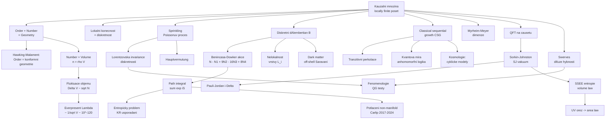

# Teorie kauzálních množin (Causal Set Theory)

> **TL;DR** — Teorie kauzálních množin (causal set theory, CST) navržená v roce 1987 Bombellim, Leem, Meyerem a Sorkinem postuluje, že prostoročas je fundamentálně **diskrétní** a jeho hlubokou strukturou je **lokálně konečná částečně uspořádaná množina** (locally finite poset) prvků, kde uspořádání kóduje kauzalitu a počet prvků kóduje objem. Heslem programu je *„Order + Number = Geometry“* — řád určuje konformní geometrii a počítání prvků dodává konformní (objemový) faktor. CST je jediný přístup ke kvantové gravitaci, který učinil **úspěšnou předpověď předem**: Sorkin v roce 1987 z fluktuací objemu odhadl řád velikosti kosmologické konstanty $\Lambda \sim 1/\sqrt{V} \sim 10^{-120}$ v Planckových jednotkách, což bylo potvrzeno objevem zrychlené expanze v roce 1998. Klíčovými výsledky jsou diskrétní Benincasa-Dowkerova akce, klasická sekvenční růstová dynamika (classical sequential growth) a kinematický odhad entropie černých děr. Hlavními otevřenými problémy zůstávají fundamentální kvantová dynamika a „entropický problém“ Kleitmanových-Rothschildových uspořádání.

## Přehled a historický kontext

Teorie kauzálních množin (causal set theory) vznikla syntézou několika hlubokých výsledků o kauzální struktuře prostoročasu. Matematickým východiskem jsou teorémy **Hawking-King-McCarthy** (1976) a **Malament** (1977): pro silně kauzální (strongly causal) Lorentzovský prostoročas určuje samotná **kauzální struktura** (causal order) metriku až na **konformní faktor**, tj. „9/10 metriky“ ve 4 dimenzích. Chybí pouze lokální měřítko objemu (volume element). Klíčová myšlenka CST je dodat tento chybějící objemový faktor **počítáním diskrétních prvků** — odtud Sorkinovo heslo:

> *„Order + Number = Geometry“* — řád (kauzální uspořádání) plus počet (počítání prvků) rovná se geometrie.

Program formálně zahájili **Luca Bombelli, Joohan Lee, David Meyer a Rafael D. Sorkin** článkem *„Space-time as a causal set“* v Physical Review Letters **59**, 521 (1987) [Bombelli et al. 1987](https://journals.aps.org/prl/abstract/10.1103/PhysRevLett.59.521). Idea diskrétního kauzálního prostoročasu má starší kořeny — u Riemanna (rozlišení diskrétního a spojitého), u **Robba** (1914, axiomatizace Minkowského prostoročasu kauzalitou), u **'t Hoofta** a **Myrheima** (1978, nezávislý návrh „statistické geometrie z uspořádání“). Hlavním a nepřetržitým propagátorem programu je Sorkin; aktivními skupinami jsou dnes Imperial College London (Fay Dowker), Raman Research Institute / ICTS (Sumati Surya), University of Edinburgh (Petros Wallden), Perimeter Institute a University of California Davis (Steven Carlip).

Filozofická motivace CST je radikálně **minimalistická a background-independentní**: fundamentální realitou je čistě řád a počet; metrika, topologie i diferencovatelná struktura jsou **emergentní** aproximace platné pouze na makroskopických škálách. Diskrétnost je zde **fundamentální a fyzikální** (na rozdíl od CDT, kde je pouze regularizačním nástrojem). Lorentzovský charakter prostoročasu je vestavěn od počátku — CST je vnitřně Lorentzovská teorie, což ji odlišuje od euklidovských mřížkových přístupů a poskytuje jí klíčovou vlastnost: diskrétnost **neporušuje lokální Lorentzovskou invarianci**.

Proč právě kauzální struktura? Ve čtyřrozměrné Lorentzovské geometrii nese kauzální (světelný) kužel v každém bodě **konformní** informaci — úhly a kauzální vztahy, nikoli však absolutní měřítka. Hawking-King-McCarthy (1976) a nezávisle Malament (1977) ukázali, že tato konformní struktura je ekvivalentní množině všech kauzálních vztahů mezi body a že určuje metriku až na lokální konformní faktor $\Omega(x)$. Ve čtyřech rozměrech tak kauzalita fixuje 9 z 10 nezávislých komponent metriky $g_{\mu\nu}$; chybějící desátá komponenta je právě lokální měřítko objemu. CST tedy stojí na hluboké asymetrii: **kauzalita je téměř všechno, objem je zbytek**. Diskrétní řád zachytí kauzalitu přesně, zatímco počítání diskrétních atomů dodá objem — a teprve dohromady, *„Order + Number = Geometry“*, rekonstruují plnou Lorentzovskou geometrii. Tato dvojí role řádu a počtu je koncepčním jádrem celé teorie a odlišuje CST od přístupů, které diskretizují prostor (LQG) nebo prostoročasovou triangulaci (CDT).

Program se metodologicky člení na **kinematiku** (kinematics) a **dynamiku** (dynamics). Kinematika studuje, jak jednotlivá pevná kauzální množina kóduje geometrii: vnořování (sprinkling), odhady dimenze, geodetické vzdálenosti, lokality, křivosti a Hauptvermutung. Dynamika hledá zákon, který určuje pravděpodobnost (klasicky) nebo kvantovou amplitudu (kvantově) každé kauzální množiny — tedy „jak vesmír vybírá svou kauzální množinu“. Kinematika je dnes relativně dobře vyvinutá; **dynamika zůstává hlavní otevřenou frontou** (zejména plně kvantová dynamika z prvních principů).

CST lze shrnout do čtyř zakládajících principů: (1) **diskrétnost** — konečný počet prvků v konečném objemu; (2) **kauzalita** — částečné uspořádání jako fundamentální (ne odvozená) struktura; (3) **kovariance** — žádné preferované značkování ani souřadnice, vše vyjádřeno řádem; (4) **Lorentzovská invariance** zachovaná Poissonovým rozsetím. Tyto principy jsou navzájem provázané: právě požadavek Lorentzovské invariance vynucuje Poissonovskou (nikoli mřížkovou) diskrétnost a zároveň nelokálnost všech kovariantních operátorů. Tato vnitřní konzistence je považována za hlavní estetickou přednost CST.

## Klíčové koncepty

**Kauzální množina (causal set, „causet“)** — Lokálně konečná částečně uspořádaná množina $(C, \preceq)$. Prvky reprezentují fundamentální prostoročasové události, relace $x \preceq y$ znamená „$x$ je v kauzální minulosti $y$“. Splňuje tři axiomy plus podmínku konečnosti (viz Matematický rámec).

**Lokální konečnost (local finiteness)** — Pro každou dvojici $x \preceq y$ je *order interval* (Alexandrovův interval) $I[x,y] = \mathrm{Fut}(x) \cap \mathrm{Past}(y)$ konečnou množinou. Toto je přesná formulace diskrétnosti: mezi libovolnými dvěma kauzálně souvisejícími událostmi leží jen konečně mnoho prvků.

**Hauptvermutung (hlavní domněnka, „fundamental conjecture“)** — Domněnka, že kauzální množina může být „věrně vnořena“ (faithfully embedded) při dané hustotě do dvou různých prostoročasů $(M,g)$ a $(M',g')$ právě tehdy, když jsou tyto **přibližně izometrické** (approximately isometric). Jinými slovy: kauzální množina určuje svůj spojitý prostoročas jednoznačně až na aproximativní izometrii. Není dosud plně dokázána; klíčová obtíž je definovat „blízkost“ Lorentzovských geometrií.

**Sprinkling (rozsetí)** — Procedura generování kauzální množiny vnořené do daného prostoročasu pomocí **Poissonova procesu**: prvky se náhodně rozmístí s konstantní hustotou $\rho$ vůči objemu, uspořádání zdědí z kauzální struktury manifoldu. Poissonovo rozsetí je jediný způsob diskretizace **zachovávající Lorentzovskou invarianci** (na rozdíl od pravidelné mřížky, která vždy zavádí preferovaný směr).

**Order + Number = Geometry** — Centrální princip; viz výše.

**Hawkingův-Malamentův teorém** — Kauzální (konformní) struktura určuje metriku až na lokální konformní faktor; CST dodává tento faktor počítáním prvků (number-volume correspondence $\langle n\rangle = \rho V$).

**Benincasa-Dowkerova akce (Benincasa-Dowker action)** — Diskrétní analog Einstein-Hilbertovy akce, zkonstruovaný z **diskrétního d'Alembertiánu** $B$, který aproximuje $\Box - \tfrac{1}{2}R$. Akce je čistě kombinatorická — počítá výskyty malých *order intervalů* různých velikostí (abundance of order intervals).

**Diskrétní d'Alembertián (discrete d'Alembertian)** — Lorentzovsky invariantní, ale **nelokální** retardovaný operátor na skalárních polích na causetu, parametrizovaný škálou nelokality, aproximující spojitý $\Box$ na polích pomalu se měnících na této škále.

**Nelokálnost (nonlocality)** — Inherentní rys CST: Lorentzovská invariance znemožňuje existenci konečného počtu „nejbližších sousedů“ (nearest neighbours), protože hyperbola konstantního vlastního času protíná nekonečně mnoho bodů. Každý lokální operátor proto musí být nahrazen nelokálním sčítáním přes vrstvy (layers).

**Klasická sekvenční růstová dynamika (classical sequential growth, CSG)** — Stochastická dynamika Rideouta a Sorkina (1999), v níž kauzální množina „roste“ přidáváním prvků jeden po druhém, řízená podmínkami **diskrétní obecné kovariance** (discrete general covariance) a **Bellovou kauzalitou** (Bell causality). Nejjednodušším případem je **tranzitivní perkolace** (transitive percolation).

**Sorkinova předpověď $\Lambda$ („everpresent lambda“)** — Heuristická předpověď fluktuující kosmologické konstanty o velikosti $\Lambda \sim \pm 1/\sqrt{V} \sim \pm 10^{-120}$ z relace neurčitosti mezi $\Lambda$ a objemem $V$ (konjugované veličiny v unimodulární gravitaci).

**Myrheim-Meyerova dimenze (Myrheim-Meyer dimension)** — Estimátor rozměru prostoročasu z **ordering fraction** (podílu kauzálně souvisejících párů); čím vyšší dimenze, tím méně uspořádání.

**Sorkin-Johnstonův vakuový stav (Sorkin-Johnston / SJ vacuum)** — Kovariantně a jednoznačně definovaný vakuový stav skalárního pole v ohraničené globálně hyperbolické oblasti, zkonstruovaný ze spektra **Pauli-Jordanova operátoru** $i\Delta$. Nevyžaduje volbu časového řezu ani modu.

**Prostoročasová entanglementová entropie (spacetime entanglement entropy, SSEE)** — Sorkinova kovariantní definice entanglementové entropie z Wightmanovy a Pauli-Jordanovy funkce; na causetech splňuje **objemový zákon** (volume law) místo plošného, plošný zákon (area law) se obnoví až po UV oříznutí spektra.

**Swerves (zákmity)** — Fenomenologický efekt: masivní částice na causetu nekopírují přesně geodetiky, ale podléhají **Lorentzovsky invariantní difúzi** v prostoru hybností (pojmenováno podle Lucretiova *clinamen*).

**Peierlsova závorka (Peierls bracket)** — Kovariantní, manifestně Lorentzovsky invariantní definice Poissonovy závorky pole pomocí retardovaného minus advancovaného propagátoru, tj. přímo Pauli-Jordanovy funkce $i\Delta$. Umožňuje kvantovat pole na causetu bez volby časového řezu — přirozený formalismus pro SJ vakuum a QFT na causetu.

**Off-shell temná hmota (off-shell dark matter)** — Saravani-Aslanbeigi-Afshordiho návrh: kontinuální limita nelokálního d'Alembertiánu obsahuje kontinuum masivních off-shell módů navíc k obvyklému bezhmotnému poli — kandidát na studenou temnou hmotu jakožto relikt prostoročasové nelokálnosti/diskrétnosti.

**Kvantová míra a anhomomorfní logika (quantum measure, anhomomorphic logic / coevents)** — Sorkinův histories-based formalismus pro kvantovou dynamiku bez vlnové funkce, založený na dekoherenčním funkcionálu $D(A,A')$ a kvantové míře $\mu(A)=D(A,A)$.

**Kleitmanovo-Rothschildovo uspořádání (Kleitman-Rothschild order, KR poset)** — Typická náhodná kauzální množina: třívrstvá struktura s ~$n/4$ prvky v dolní a horní vrstvě a ~$n/2$ uprostřed. Dominuje sample space, ale není manifold-like — jádro **entropického problému**.

**Path-sum / path integral (causal set path-sum)** — Kvantová dynamika jako součet přes všechny kauzální množiny vážený $e^{iS_{BD}/\hbar}$. Lorentzovský (oscilující) charakter bez Wickovy rotace; studuje se komplexními a Monte Carlo metodami. Hlavní aréna pro entropický problém a emergenci kontinua.

**Antichain a řez (antichain / spatial slice)** — Maximální antichain je diskrétní analog Cauchyho prostorupodobné hyperplochy; jeho velikost odhaduje „prostorový objem“ v daném okamžiku. Klíčový pro pokusy o Hamiltonovskou/kanonickou formulaci.

**Linky a řetězce (links and chains)** — *Link* je nepokrytá relace (irreducible relation): dvojice $x \prec y$, mezi nimiž neleží žádný prvek ($|I(x,y)|=0$). *Chain* (řetězec) je totálně uspořádaná podmnožina (diskrétní analog časupodobné křivky), *antichain* je množina vzájemně nesouvisejících prvků (diskrétní analog prostorupodobného řezu). Délka nejdelšího řetězce mezi dvěma prvky aproximuje jejich **geodetickou (vlastní časovou) vzdálenost** — to je základní rekonstrukce metriky z čistého řádu (Brightwell-Gregory).

**Kinematické estimátory geometrie** — Z čistě řádových dat lze rekonstruovat: **dimenzi** (Myrheim-Meyer z ordering fraction, midpoint-scaling, abundance $k$-řetězců), **geodetickou vzdálenost** (délka nejdelšího řetězce $\times$ konstanta), **prostorovou topologii** (z antichainů/řezů), **lokalitu** (z linků a malých intervalů) a **křivost** (z d'Alembertiánu / BD akce). Tyto estimátory fungují dobře pro manifold-like causety, selhávají však u KR uspořádání — což je samo o sobě diagnostický nástroj manifoldovosti.

## Matematický rámec

### Axiomy kauzální množiny

$$ (C,\preceq):\quad \text{(i) } x \preceq x;\quad \text{(ii) } x \preceq y \preceq x \Rightarrow x=y;\quad \text{(iii) } x \preceq y \preceq z \Rightarrow x \preceq z;\quad \text{(iv) } |I[x,y]| < \infty $$

**Vysvětlení symbolů:** $C$ je nosná množina (prvky = události), $\preceq$ je relace částečného uspořádání. (i) **reflexivita**, (ii) **acykličnost/antisymetrie** (žádné uzavřené kauzální křivky), (iii) **tranzitivita** (kauzalita se propaguje), (iv) **lokální konečnost**, kde $I[x,y]=\mathrm{Fut}(x)\cap\mathrm{Past}(y)$ je Alexandrovův interval. **Význam:** axiomy (i)–(iii) definují poset = diskrétní analog kauzální struktury; axiom (iv) kóduje fundamentální diskrétnost. Toto je celý kinematický základ teorie — žádná metrika, topologie ani diferencovatelná struktura.

### Poissonovo rozsetí (sprinkling)

$$ P_v(n) = \frac{(\rho\, v)^n}{n!}\, e^{-\rho\, v},\qquad \langle n \rangle = \rho\, v $$

**Vysvětlení symbolů:** $P_v(n)$ je pravděpodobnost, že do prostoročasového objemu $v$ padne právě $n$ prvků, $\rho$ je hustota rozsetí (typicky $\rho = \ell_p^{-4}$, tj. jeden prvek na Planckovský 4-objem). **Význam:** rozptyl $\sqrt{\langle n\rangle}$ kvantifikuje **Poissonovské fluktuace** počtu — právě tyto fluktuace pohánějí Sorkinovu předpověď $\Lambda$. Poissonovský proces je jediná diskretizace zachovávající průměrem Lorentzovskou symetrii (number-to-volume korespondence je v průměru invariantní vůči Lorentzovým transformacím).

### Number-volume korespondence a fundamentální vztah

$$ \langle n \rangle = \rho\, V \quad\Longleftrightarrow\quad V = \frac{\langle n\rangle}{\rho} = N \, \ell_p^{\,4} $$

**Vysvětlení symbolů:** $N$ je počet prvků v oblasti, $V$ její 4-objem, $\ell_p$ Planckova délka. **Význam:** matematické vyjádření „Number = Volume“ poloviny Sorkinova hesla; spolu s Hawking-Malamentovým teorémem (Order = konformní geometrie) rekonstruuje plnou metriku.

### Diskrétní d'Alembertián v 4D (Benincasa-Dowker)

$$ B\phi(x) = \frac{4}{\sqrt{6}\,\ell^2}\left[ -\phi(x) + \Big(\sum_{y\in L_1} -\,9\!\sum_{y\in L_2} +\,16\!\sum_{y\in L_3} -\,8\!\sum_{y\in L_4}\Big)\phi(y) \right] $$

**Vysvětlení symbolů:** $\phi$ je skalární pole na causetu, $\ell$ je škála diskrétnosti, $L_i = \{y \prec x : |I(x,y)| = i\!-\!1\}$ jsou *vrstvy* prvků v minulosti $x$ podle počtu prvků mezi $x$ a $y$ (první, druhá, třetí, čtvrtá vrstva). Koeficienty $(1,-9,16,-8)$ jsou specifické pro 4 dimenze (v jiných dimenzích jiné, viz Dowker & Glaser 2013). **Význam:** $B$ je Lorentzovsky invariantní nelokální operátor; jeho střední hodnota přes rozsetí konverguje (Benincasa & Dowker 2010):

$$ \lim_{\ell\to 0} \langle B\phi(x)\rangle = \Big(\Box - \tfrac{1}{2}R(x)\Big)\phi(x) $$

kde $R$ je Ricciho skalár. Aplikace na konstantní pole $\phi \equiv 1$ extrahuje křivost $-\tfrac12 R$ — odtud akce.

### Benincasa-Dowkerova akce (4D)

$$ \frac{1}{\hbar}\, S^{(4)}[C] = N - N_1 + 9\,N_2 - 16\,N_3 + 8\,N_4 $$

**Vysvětlení symbolů:** $N$ je celkový počet prvků, $N_i$ je počet *order intervalů* obsahujících právě $i$ prvků (tj. počet dvojic $x\succ y$ s $|I(x,y)|=i$). **Význam:** čistě kombinatorická veličina (žádná souřadnice, žádná metrika!) konvergující ke kontinuální Einstein-Hilbertově akci $S_{EH} = \tfrac{1}{2}\int R\sqrt{-g}\,d^4x$ (až na konstantu a hraniční členy). Nejdůležitější dynamický vstup CST. Existuje „tlumená“ (mesoscale) verze s parametrem nelokality $\varepsilon$ snižujícím fluktuace.

### Sorkinova předpověď kosmologické konstanty

$$ \Lambda \sim \Delta\Lambda \sim \frac{1}{\Delta V} \sim \frac{1}{\sqrt{V}} \sim \pm\,10^{-120}\ (\text{Planck. jedn.}) \quad\Longleftrightarrow\quad \Lambda \sim \frac{1}{\sqrt{N}} $$

**Vysvětlení symbolů:** $V$ je 4-objem pozorovatelného vesmíru ($\sim 10^{240}\,\ell_p^4$), $N \sim V/\ell_p^4 \sim 10^{240}$ počet prvků, $\Delta V \sim \sqrt{N}\,\ell_p^4$ je Poissonovská fluktuace objemu. **Význam:** v unimodulární gravitaci jsou $\Lambda$ a $V$ kanonicky konjugované; relace neurčitosti $\Delta\Lambda\,\Delta V \sim \hbar$ při $\Delta V \sim \sqrt{V}$ dává $\Delta\Lambda \sim 1/\sqrt{V}$. Numericky $1/\sqrt{10^{240}} = 10^{-120}$, což řádově odpovídá pozorované $\Lambda \approx 10^{-122}$ v Planckových jednotkách. Předpověď z roku 1987, **deset let před** objevem zrychlené expanze.

**Klíčové vlastnosti everpresent $\Lambda$:** (i) $\Lambda$ **fluktuuje kolem nuly** s nulovou střední hodnotou — řeší tak „starý“ problém kosmologické konstanty (proč není $\Lambda$ obrovská); (ii) její velikost **sleduje kritickou hustotu** v každé epoše ($\Lambda(t) \sim \rho_{crit}(t) \sim 1/\sqrt{V(t)}$) — přirozeně vysvětluje „problém koincidence“ (proč právě teď $\Omega_\Lambda \sim \Omega_m$); (iii) jde o **fenomenologickou, nikoli odvozenou** předpověď — plný mechanismus z kvantové dynamiky CST chybí. Dynamické realizace (Ahmed et al. 2004; Zwane et al. 2018) modelují $\Lambda(t)$ jako stochastický proces a konfrontují jej s daty supernov, CMB a BAO; současná data model nevyvracejí, ale ani jednoznačně nepreferují oproti $\Lambda$CDM.

### Myrheim-Meyerova dimenze

$$ \frac{\langle R \rangle}{\binom{N}{2}} = f_0(d) = \frac{\Gamma(d+1)\,\Gamma(d/2)}{4\,\Gamma(3d/2)} $$

**Vysvětlení symbolů:** $R$ je počet *relations* (kauzálně souvisejících párů, tj. počet 2-řetězců), $\binom{N}{2}$ celkový počet párů, levá strana je *ordering fraction* $r$. **Význam:** pravá strana závisí **pouze na dimenzi** $d$ Minkowského prostoročasu; inverze rovnice dává odhad rozměru z čistě kombinatorického invariantu. Pro KR uspořádání $d_{MM} \approx 2.38$. Existují vyšší estimátory z abundancí $k$-řetězců.

### Geodetická vzdálenost z nejdelšího řetězce

$$ d(x,y) = m_d \cdot \ell \cdot L(x,y) \quad\text{pro } \ell \to 0, \qquad m_2 = 2,\ m_4 \approx 1.77 $$

**Vysvětlení symbolů:** $L(x,y)$ je délka (počet relací) nejdelšího řetězce mezi $x \prec y$, $\ell$ škála diskrétnosti, $m_d$ dimenzionálně závislá konstanta. **Význam:** časupodobná **geodetická vzdálenost** (vlastní čas) je rekonstruována z čistě kombinatorického invariantu — nejdelšího řetězce; klíčový důkaz, že metrické pojmy emergují z řádu. Prostorupodobné vzdálenosti jsou naopak obtížné (vyžadují „spojení přes budoucnost/minulost“) — otevřený technický problém.

### Sorkin-Johnstonův vakuový stav

$$ i\Delta(x,x') = G_R(x,x') - G_A(x,x'),\qquad i\Delta\,u_k = \lambda_k\, u_k,\qquad W_{SJ}(x,x') = \sum_{\lambda_k>0} \lambda_k\, u_k(x)\,u_k^*(x') $$

**Vysvětlení symbolů:** $\Delta$ je **Pauli-Jordanova funkce** (rozdíl retardovaného $G_R$ a advancovaného $G_A$ propagátoru), $u_k, \lambda_k$ jsou vlastní funkce a vlastní hodnoty operátoru $i\Delta$, $W_{SJ}$ je dvoubodová (Wightmanova) funkce SJ stavu — *positive part* spektra Pauli-Jordanova operátoru. **Význam:** definuje jednoznačné kovariantní vakuum bez volby modu — klíčové pro QFT na causetu, kde neexistuje preferovaný čas. Na causetu se $i\Delta$ stává konečnou maticí.

### Prostoročasová entanglementová entropie (SSEE)

$$ W\, v_i = \mu_i\, (i\Delta)\, v_i,\qquad S = \sum_i \mu_i \ln|\mu_i| $$

**Vysvětlení symbolů:** $W$ je Wightmanova funkce omezená na podoblast, $i\Delta$ Pauli-Jordanova funkce, $\mu_i$ řeší **zobecněný vlastní problém**, $S$ je SSEE. **Význam:** plně kovariantní (prostoročasová, nikoli prostorová) definice entanglementové entropie. Na causetu dává **objemový zákon** $S \propto V$; **plošný zákon** $S \propto A$ se obnoví jen po UV oříznutí spektra v škálovacím režimu (Sorkin & Yazdi 2018) — což naznačuje, že diskrétnost samotná entropii nereguluje a je třeba dodatečné fyziky.

### Lorentzovsky invariantní difúze (swerves)

$$ \frac{\partial \rho}{\partial \tau} = k\, \nabla^2_{p}\, \rho \quad\text{na hmotnostní slupce } p^2 = -m^2 $$

**Vysvětlení symbolů:** $\rho(x,p,\tau)$ je hustota částic ve fázovém prostoru, $\tau$ vlastní čas, $\nabla^2_p$ Laplacián na hmotnostní hyperbole v prostoru hybností, $k$ jediný difúzní parametr. **Význam:** mikroskopické „zákmity“ způsobené diskrétností se makroskopicky projeví jako Lorentzovsky invariantní difúze hybnosti; pozorovací omezení (např. z protonů kosmického záření, mlhovinových plynů) shora omezují $k$, a tedy škálu diskrétnosti.

## Klíčové výsledky a milníky

1. **Zformulování teorie (1987).** [Bombelli, Lee, Meyer & Sorkin 1987](https://journals.aps.org/prl/abstract/10.1103/PhysRevLett.59.521) — čtyřstránkový PRL zakládá CST: axiomy, sprinkling, návrh, že vhodná akce reprodukuje obecnou relativitu v klasické limitě.

2. **Předpověď kosmologické konstanty (1987–1990).** Sorkin z Poissonovských fluktuací objemu odhadl $\Lambda \sim 1/\sqrt{V} \sim 10^{-120}$. Po objevu zrychlené expanze (1998) označováno jako jediná úspěšná **předpověď předem** z kvantové gravitace. Dynamické modely: *„Everpresent Lambda“* [Ahmed, Dodelson, Greene & Sorkin 2004](https://arxiv.org/abs/astro-ph/0209274), kosmologické testy [Zwane, Afshordi & Sorkin 2018](https://arxiv.org/abs/1703.06265), nové aspekty [2023](https://arxiv.org/abs/2304.03819).

3. **Klasická sekvenční růstová dynamika (1999).** [Rideout & Sorkin 1999/2000](https://arxiv.org/abs/gr-qc/9904062), PRD **61**, 024002 — obecná rodina stochastických růstových dynamik z diskrétní kovariance a Bellovy kauzality; tranzitivní perkolace jako nejjednodušší model; možnost vzniku negravitační hmoty z causetu.

4. **Diskrétní d'Alembertián a akce (2007–2010).** Sorkin (2007) zavedl nelokální $\Box$; [Benincasa & Dowker 2010](https://arxiv.org/abs/1001.2725), PRL **104**, 181301 — *„The Scalar Curvature of a Causal Set“*, operátor aproximující $\Box - \tfrac12 R$ a kombinatorická Einstein-Hilbertova akce. Rozšíření na všechny dimenze: [Dowker & Glaser 2013](https://arxiv.org/abs/1305.2588).

5. **Lorentzovská invariance diskrétnosti (2006–2009).** [Bombelli, Henson & Sorkin 2009](https://arxiv.org/abs/gr-qc/0605006) — teorém, že Poissonovo rozsetí neumožňuje konstrukci preferovaného směru pro typická rozsetí; diskrétnost CST neporušuje lokální Lorentzovskou invarianci (klíčová výhoda oproti mřížkám).

6. **Entropie černých děr z kauzálních linků (2003).** [Dou & Sorkin 2003](https://arxiv.org/abs/gr-qc/0302009), Found. Phys. **33**, 279 — počet kauzálních linků protínajících horizont $\propto$ ploše horizontu; každý „horizontový molekul“ nese ~1 bit entropie na Planckovskou plochu. Recentní rozpracování [2023–2024](https://arxiv.org/abs/2404.11670).

7. **Swerves a fenomenologie (2004).** [Dowker, Henson & Sorkin 2004](https://arxiv.org/abs/gr-qc/0311055) — Lorentzovsky invariantní difúze ve fázovém prostoru z diskrétnosti; pojmenováno podle Lucretiova *clinamen*.

8. **QFT na causetu a SJ vakuum (2009).** Johnston (2009, disertace + PRL) — kovariantní vakuum z Pauli-Jordanova operátoru. SSEE: [Sorkin 2014](https://iopscience.iop.org/article/10.1088/0264-9381/31/21/214006), [Sorkin & Yazdi 2018](https://arxiv.org/abs/1611.10281).

9. **Potlačení non-manifold-like causetů (2017–2024).** [Loomis & Carlip 2017](https://arxiv.org/abs/1709.00064), [Carlip 2022/2023](https://arxiv.org/abs/2209.00327) — KR uspořádání silně potlačena v gravitačním path integralu; velký krok k pochopení emergence kontinua.

10. **Spektrální dimenze (2014).** [Eichhorn & Mizera 2014](https://arxiv.org/abs/1311.2530) — výpočet spektrální dimenze na causetu pomocí náhodné procházky; pokles na malých škálách, paralela k dimenzionální redukci v CDT a asymptotické bezpečnosti.

11. **Nelokální QFT a temná hmota (2014–2015).** [Aslanbeigi, Saravani & Sorkin 2014](https://arxiv.org/abs/1403.1622) zobecnili nelokální d'Alembertián do kontinua; [Saravani & Aslanbeigi 2015](https://arxiv.org/abs/1502.01655) navrhli, že kontinuum off-shell masivních módů z nelokálnosti je kandidátem na temnou hmotu.

12. **Living Reviews přehled (2019).** [Surya 2019](https://arxiv.org/abs/1903.11544), Living Rev. Relativ. **22**, 5 — autoritativní moderní přehled celého programu, dnes standardní reference.

## Současný stav (2024-2026)

Pole se posunulo do fáze, kde jsou možné **rozsáhlé simulace, zpřesněné teorémy o obnovení kontinua a ostřejší fenomenologické předpovědi**:

- **Emergence kontinua / entropický problém.** [Carlip 2024 *„Causal Sets and an Emerging Continuum“*](https://arxiv.org/abs/2405.14059) ukazuje, že **téměř všechny non-manifold-like causety jsou silně potlačeny** v gravitačním path integralu — ale „dosud nerozumíme zbývajícím nepotlačeným causetům dostatečně dobře“ (*„we do not yet understand the remaining unsuppressed causal sets well enough“*). Navazuje práce P. Carlip, S. Carlip & Surya (2024) o Einstein-Hilbertově akci pro entropicky dominantní causety.

- **Kvantové algoritmy.** [Adamson & Wallden 2025 *„Benincasa-Dowker-Glaser causal set actions by quantum counting”*](https://arxiv.org/abs/2505.22217) — kvantový algoritmus počítající BD-G akci pomocí **Groverova kvantového počítání** abundancí order intervalů (polynomiální zrychlení oproti klasickému přístupu), publikováno v Phys. Rev. Research **8**, 023188 (2026). [Ferguson, Nasiri & Wallden 2025 *„Dynamics of discrete spacetimes with Quantum-enhanced Markov Chain Monte Carlo”*](https://arxiv.org/abs/2506.19538) staví na Layden et al. (Nature 619, 282, 2023).

- **QFT na causetech a amplitudy.** Rozpracování in-in/in-out korelátorů, diagramatické expanze a analogonu S-matice na diskrétní kauzální mřížce; cíl: pozorovatelné raného vesmíru za hypotézy diskrétnosti. Pokračuje studium Sorkin-Johnstonova vakua včetně masivního pole ve 2D kauzálním diamantu (2019) a entropie de Sitterových horizontů (2020–2021).

- **Entropie černých děr — nové počítání stavů.** [Boltzmannovské počítání stavů pro entropii černé díry v CST (2024)](https://arxiv.org/abs/2404.11670) a přehledy „horizontových molekul“ (2023) zpřesňují kinematický odhad $S = A/4$ a jeho statistický původ.

- **Hauptvermutung — formální pokrok.** [Müller 2025 *„On the Hauptvermutung of Causal Set Theory“*](https://arxiv.org/abs/2503.01719) ukazuje, že ze dvou přesných formulací je jedna nesprávná a druhá správná, a že domněnka platí pro **spočetné** (nikoli jen konečné) množiny.

- **Entanglementová entropie.** Pokračující práce na SSEE a UV oříznutí (2022–2024) pro obnovení plošného zákona; principy pro distinguished vacuum [2024](https://arxiv.org/abs/2412.07832).

- **Výpočetní pokrok.** Simulace causetů s ~$10^6$ prvky na HPC CPU/GPU architekturách s efektivními algoritmy pro generování sprinklingů, výpočet BD akce a Markovovy řetězce na prostoru causetů; tyto nástroje teprve umožňují systematicky zkoumat fázovou strukturu path integralu.

- **Hauptvermutung a matematická stránka.** Vedle Müllera (2025) pokračuje práce na rekonstrukci Minkowského geometrie z kauzálních separací a na zpřesnění pojmu „přibližné izometrie“ (Lorentzovské Gromov-Hausdorffovy vzdálenosti à la Noldus).

- **Komunita.** Souhrnná monografie *„The Causal Set Approach to Quantum Gravity: An Introduction“* (Springer 2025). Připravované setkání Royal Society Theo Murphy *„The path to quantum gravity with causal sets“* (Manchester, září 2026, Yasaman Yazdi & Stav Zalel). Aktivní propojení s kvantovým počítáním (Wallden, Edinburgh) otevírá nový metodologický směr.

## Otevřené problémy

1. **Fundamentální kvantová dynamika.** CST stále postrádá uspokojivou kvantovou dynamiku odvozenou z prvních principů. CSG je pouze klasická/stochastická; kvantová verze (quantum sequential growth) vyžaduje **dekoherenční funkcionál** a interpretaci platnou pro jediný, neopakovatelný systém (vesmír). *Proč je to těžké:* path integral $\sum_C e^{iS[C]/\hbar}$ přes komplexní fáze diverguje/osciluje; chybí kovariantní pojem „pozorovatelné“ a Wick-rotace není dostupná u Lorentzovské, nesimpliciální struktury.

2. **Entropický problém (Kleitman-Rothschild dominance).** Typická náhodná kauzální množina je třívrstvé KR uspořádání s obrovským prostorovým rozsahem, ale jen „třemi okamžiky času“ — naprosto nepodobné manifoldu. *Proč je to těžké:* počet KR uspořádání roste jako $2^{n^2/4}$, takže entropie přebíjí akci; je třeba ukázat, že **dynamika (path integral) je potlačí**. Carlip (2024) to ukázal pro velkou třídu, ne pro všechny.

3. **Výběr dimenze $d=4$.** Proč by kontinuální limita měla vybrat čtyři rozměry? *Proč je to těžké:* žádný známý mechanismus v kinematice ani v BD akci nepreferuje $d=4$; úzce souvisí s entropickým problémem.

4. **Hauptvermutung (plný důkaz).** Není dokázáno, že causet určuje svůj prostoročas až na aproximativní izometrii. *Proč je to těžké:* chybí kanonická metrika (distance function) na prostoru Lorentzovských geometrií; „blízkost“ dvou Lorentzovských metrik je sama o sobě otevřený matematický problém. Müller (2025) udělal formální krok pro spočetný případ.

5. **Lokalita a fenomenologie nelokálnosti.** Inherentní nelokálnost diskrétního $\Box$ vede k problémům s ne-Lorentzovsky-invariantními příspěvky, nestabilitami a obtížnou renormalizací QFT. *Proč je to těžké:* nelokální člen je nutný (jinak by se porušila Lorentzovská invariance), ale dělá teorii pole obtížně kontrolovatelnou.

6. **Obnovení Hamiltonovské/spojité geometrie a hraniční členy.** Konstrukce Gibbons-Hawkingova hraničního členu a spojité geometrie z čistě řádových dat zůstává nedořešená.

7. **Lokalizace pozorovatelných (covariant observables).** V kovariantní teorii bez souřadnic je obtížné definovat měřitelné veličiny; u komplexních dynamik (perkolace) zůstává konstrukce kovariantních pozorovatelných neúplná.

8. **Spektrální dimenze a dimenzionální redukce.** Numericky se na malých škálách objevuje pokles spektrální dimenze (k ~2), ale interpretace a souvislost s jinými přístupy (CDT, asymptotická bezpečnost) je jen částečně pochopena.

9. **Prostorupodobné vzdálenosti a hyperplochy.** Zatímco časupodobná vzdálenost je dobře definovaná (nejdelší řetězec), prostorupodobná vzdálenost a pojem „okamžitého prostorového řezu“ jsou na causetu notoricky obtížné. *Proč je to těžké:* antichain (kandidát na řez) může mít obrovský prostorový rozsah a žádnou kanonickou „tloušťku času“; rekonstrukce prostorové geometrie a Hamiltonovské evoluce proto pokulhává.

10. **Coupling hmoty a Standardní model.** Jak na causetu žijí fermiony, kalibrační pole a celý Standardní model? *Proč je to těžké:* spinory a kalibrační konexe vyžadují diferencovatelnou/vláknovou strukturu, kterou causet nemá; existují jen dílčí návrhy (Dirac na causetu, „matter from order“ v CSG), nikoli úplná teorie.

## Vztahy k ostatním přístupům

### Kauzální dynamické triangulace (causal-dynamical-triangulations) — **částečně prozkoumáno**
Nejbližší příbuzný: oba jsou **Lorentzovské, background-independentní, kauzální, neperturbativní** path-integralové přístupy, oba reprodukují OR v klasické limitě. **Sdílená struktura:** primát kauzální struktury, diskrétnost, path integral přes geometrie. **Klíčový rozdíl:** v CDT je diskrétnost jen *regularizace* (odstraní se kontinuální limitou), v CST je *fundamentální a fyzikální*; CDT má foliaci a fixní topologii simplexů, CST má pouze čistý řád (více volnosti v akci). Sdílí fenomén **dimenzionální redukce / spektrální dimenze ~2** na krátkých škálách. Přímé porovnání obou path integralů a jejich fází je otevřené.

### Asymptotická bezpečnost (asymptotic-safety) — **sotva prozkoumáno**
Spojení přes **spektrální dimenzi** (spectral-dimension): obě teorie nezávisle predikují dimenzionální redukci k ~2 v UV. Zda BD akce na causetu definuje fixní bod RG toku analogický asymptoticky bezpečnému, je nezkoumané. Potenciálně bohatý, dosud nevyužitý most.

### Smyčková kvantová gravitace (loop-quantum-gravity) — **sotva prozkoumáno**
Obě teorie predikují fundamentální diskrétnost prostoročasu, ale **diametrálně odlišně**: v LQG je diskrétnost *odvozená* (diskrétní spektra geometrických operátorů ploch/objemů na spin networks), v CST *postulovaná*. LQG diskretizuje prostor (spin networks), CST prostoročas (poset). Spin foam dynamika a CSG sdílejí myšlenku „kauzálního růstu“, ale formálně nepropojeno. Most prakticky neprozkoumán.

### Group field theory (group-field-theory) — **sotva prozkoumáno**
GFT generuje simpliciální komplexy s kombinatorickou strukturou; sdílí s CST kombinatorický/diskrétní charakter a path-integralové sčítání přes diskrétní struktury. Žádné přímé formální propojení, ale oba sdílejí pojem emergentní geometrie z kombinatoriky.

### Holografie a AdS/CFT (holography-adscft) — **sotva prozkoumáno**
SSEE na causetu dává **objemový zákon** místo plošného — v napětí s holografickým/Bekensteinovým plošným škálováním. Dou-Sorkinovy „horizontové molekuly“ ale dávají plošný zákon pro entropii černé díry. Zda je holografický princip kompatibilní s fundamentální diskrétností a jak vzniká area law z volume law (přes UV oříznutí), je otevřená a potenciálně klíčová otázka.

### Entanglement a prostoročas (entanglement-spacetime) — **částečně prozkoumáno**
CST má vlastní kovariantní (prostoročasovou) definici entanglementové entropie (SSEE) a SJ vakuum — alternativu k programu „entanglement builds geometry“ (Van Raamsdonk, ER=EPR). Odlišnost: v CST je geometrie z *řádu+počtu*, nikoli primárně z entanglementu. Vzájemný vztah definic SSEE a RT/holografické entropie je jen částečně prozkoumán.

### Černé díry a informace (black-holes-information) — **částečně prozkoumáno**
Dou-Sorkinův kinematický odhad entropie černé díry z kauzálních linků; recentní práce na „horizontových molekulech“ a Boltzmannovském počítání stavů (2023–2024). Informační paradox a Page curve v CST nejsou systematicky zpracovány — otevřené pole.

### Emergentní gravitace (emergent-gravity) — **částečně prozkoumáno**
CST je par excellence teorie emergentní geometrie (metrika, topologie, dimenze vznikají z řádu+počtu). Souvislost s termodynamickou/entropickou emergencí gravitace (Jacobson, Verlinde) a s tím, že BD akce emerguje z počítání, je konceptuálně blízká, ale technicky málo propojená.

### Nekomutativní geometrie (noncommutative-geometry) — **sotva prozkoumáno**
Sdílená motivace „prostoročas není hladká varieta v UV“. Spektrální tripl a Diracův operátor vs. Pauli-Jordanův operátor a SJ spektrum — strukturální analogie spektrálního přístupu k geometrii. Přímý most nezkoumán.

### Kvantová kosmologie (quantum-cosmology) — **částečně prozkoumáno**
CSG poskytuje kosmologickou dynamiku (cyklické modely bounce, „kosmologická renormalizace“ parametrů při Big Crunch-Big Bang odrazu); Everpresent Lambda je přímo kosmologická předpověď. Souvislost s Hartle-Hawking / no-boundary je nezpracovaná.

### Experimentální testy (experimental-tests) — **částečně prozkoumáno**
Swerves (difúze hybnosti) dávají horní meze na škálu diskrétnosti z pozorování kosmického záření a mlhovinových plynů — pozorovaná absence rozmazání hybností omezuje difúzní parametr $k$ a tedy hustotu rozsetí. Everpresent $\Lambda$ je testovatelná kosmologicky (CMB, supernovy, BAO — Zwane et al. 2018), což z CST činí jeden z mála QG přístupů s konkrétní kosmologickou předpovědí. Zásadní rys: protože diskrétnost CST **nezavádí preferovaný směr** (Bombelli-Henson-Sorkin 2009), CST **nepředpovídá** energeticky závislé porušení Lorentzovy invariance (žádnou modifikovanou disperzní relaci $E^2 = p^2 + m^2 + \alpha\, p^3/E_{Pl}$) — tím se zásadně liší od mnoha jiných QG modelů a činí ji robustní vůči přísným mezím z gama záblesků (Fermi/MAGIC).

### Strunová teorie (string-theory) — **sotva prozkoumáno (konflikt)**
Filozoficky protichůdné: struny předpokládají hladkou (super)varietu a spojitou kontinuální strukturu, CST fundamentální diskrétnost bez pozadí. Žádný formální most; potenciální konceptuální konflikt ohledně povahy UV prostoročasu.

### Spektrální dimenze (spectral-dimension) — **částečně prozkoumáno**
Sdílený diagnostický nástroj napříč přístupy: náhodná procházka / nelokální d'Alembertián na causetu dává škálově závislou spektrální dimenzi padající na krátkých škálách (někdy k ~2), v rezonanci s CDT, asymptotickou bezpečností a Hořava-Lifšicovou gravitací. Přesný tvar toku a UV hodnota v CST jsou stále diskutované a citlivé na volbu operátoru (nelokalita).

### Twistory a amplitudy (twistors-amplitudes) — **sotva prozkoumáno**
Spekulativní, ale podnětné: nedávné práce na S-matici a rozptylových amplitudách na diskrétním kauzálním pozadí (2024–2025) a kvantové počítání akce by mohly mít strukturální souvislost s amplitudovými metodami a pozitivitou v twistorech (oba programy stojí na kauzální/pozitivní struktuře). Žádné konkrétní propojení dosud neexistuje — typický kandidát na „barely explored“ most, který tento projekt hledá.

## Mapa konceptů

## Reference

1. [Bombelli, L., Lee, J., Meyer, D., Sorkin, R. D. (1987)](https://journals.aps.org/prl/abstract/10.1103/PhysRevLett.59.521) — *„Space-time as a causal set“*, Phys. Rev. Lett. **59**, 521. DOI: 10.1103/PhysRevLett.59.521. Zakládající článek programu.

2. [Surya, S. (2019)](https://arxiv.org/abs/1903.11544) — *„The causal set approach to quantum gravity“*, Living Rev. Relativ. **22**, 5. arXiv:1903.11544. DOI: 10.1007/s41114-019-0023-1. Autoritativní moderní přehled.

3. [Rideout, D. P., Sorkin, R. D. (1999/2000)](https://arxiv.org/abs/gr-qc/9904062) — *„A Classical Sequential Growth Dynamics for Causal Sets“*, Phys. Rev. D **61**, 024002. arXiv:gr-qc/9904062. Klasická stochastická dynamika.

4. [Benincasa, D. M. T., Dowker, F. (2010)](https://arxiv.org/abs/1001.2725) — *„The Scalar Curvature of a Causal Set“*, Phys. Rev. Lett. **104**, 181301. arXiv:1001.2725. Diskrétní d'Alembertián a BD akce.

5. [Dowker, F., Glaser, L. (2013)](https://arxiv.org/abs/1305.2588) — *„Causal set d'Alembertians for various dimensions“*, Class. Quantum Grav. **30**, 195016. arXiv:1305.2588. Dimenzionálně závislé koeficienty.

6. [Sorkin, R. D. (2007)](https://arxiv.org/abs/0710.1675) — *„Is the cosmological 'constant' a nonlocal quantum residue of discreteness of the causal set type?“*, AIP Conf. Proc. **957**, 142. arXiv:0710.1675. Argument pro everpresent $\Lambda$.

7. [Ahmed, M., Dodelson, S., Greene, P. B., Sorkin, R. D. (2004)](https://arxiv.org/abs/astro-ph/0209274) — *„Everpresent Lambda“*, Phys. Rev. D **69**, 103523. arXiv:astro-ph/0209274. Dynamický model fluktuující $\Lambda$.

8. [Zwane, N., Afshordi, N., Sorkin, R. D. (2018)](https://arxiv.org/abs/1703.06265) — *„Cosmological tests of Everpresent Lambda“*, Class. Quantum Grav. **35**, 194002. arXiv:1703.06265. Observační testy.

9. [Dou, D., Sorkin, R. D. (2003)](https://arxiv.org/abs/gr-qc/0302009) — *„Black Hole Entropy as Causal Links“*, Found. Phys. **33**, 279. arXiv:gr-qc/0302009. Kinematický odhad entropie černé díry.

10. [Dowker, F., Henson, J., Sorkin, R. D. (2004)](https://arxiv.org/abs/gr-qc/0311055) — *„Quantum Gravity Phenomenology, Lorentz Invariance and Discreteness“*, Mod. Phys. Lett. A **19**, 1829. arXiv:gr-qc/0311055. Swerves a fenomenologie.

11. [Bombelli, L., Henson, J., Sorkin, R. D. (2009)](https://arxiv.org/abs/gr-qc/0605006) — *„Discreteness without symmetry breaking: a theorem“*, Mod. Phys. Lett. A **24**, 2579. arXiv:gr-qc/0605006. Lorentzovská invariance Poissonova rozsetí.

12. [Sorkin, R. D. (2003/2005)](https://arxiv.org/abs/gr-qc/0309009) — *„Causal Sets: Discrete Gravity“* (Valdivia lectures). arXiv:gr-qc/0309009. Pedagogický úvod a kvantová míra.

13. [Henson, J. (2006)](https://arxiv.org/abs/gr-qc/0601121) — *„The causal set approach to quantum gravity“*. arXiv:gr-qc/0601121. Starší přehled.

14. [Loomis, S. P., Carlip, S. (2017)](https://arxiv.org/abs/1709.00064) — *„Suppression of non-manifold-like sets in the causal set path integral“*, Class. Quantum Grav. **35**, 024002. arXiv:1709.00064. Potlačení KR uspořádání.

15. [Carlip, S. (2022/2023)](https://arxiv.org/abs/2209.00327) — *„Path integral suppression of badly behaved causal sets“*, Class. Quantum Grav. **40**, 095004. arXiv:2209.00327. Rozšíření potlačení.

16. [Carlip, S. (2024)](https://arxiv.org/abs/2405.14059) — *„Causal Sets and an Emerging Continuum“*. arXiv:2405.14059. Aktuální stav emergence kontinua.

17. [Sorkin, R. D. (2014)](https://iopscience.iop.org/article/10.1088/0264-9381/31/21/214006) — *„Expressing entropy globally in terms of (4D) field-correlations“* / Spacetime entanglement entropy v 1+1D, Class. Quantum Grav. **31**, 214006. Prostoročasová entanglementová entropie.

18. [Aslanbeigi, S., Saravani, M., Sorkin, R. D. (2014)](https://arxiv.org/abs/1403.1622) — *„Generalized causal set d'Alembertians“* / Nonlocal scalar QFT, JHEP **06** (2014) 024. arXiv:1403.1622. Kontinuální nelokální QFT.

19. [Saravani, M., Aslanbeigi, S. (2015)](https://arxiv.org/abs/1502.01655) — *„Dark Matter From Spacetime Nonlocality”*, Phys. Rev. D **92**, 103504. arXiv:1502.01655. Temná hmota z nelokálnosti (off-shell dark matter).

20. [Sorkin, R. D., Yazdi, Y. K. (2018)](https://arxiv.org/abs/1611.10281) — *„Entanglement Entropy in Causal Set Theory“*, Class. Quantum Grav. **35**, 074004. arXiv:1611.10281. SSEE na causetech, area vs volume law.

21. [Eichhorn, A., Mizera, S. (2014)](https://arxiv.org/abs/1311.2530) — *„Spectral dimension in causal set quantum gravity“*, Class. Quantum Grav. **31**, 125007. arXiv:1311.2530. Spektrální dimenze.

22. [Glaser, L., Surya, S. (2013)](https://arxiv.org/abs/1309.3403) — *„Towards a Definition of Locality in a Manifoldlike Causal Set“*, Phys. Rev. D **88**, 124026. arXiv:1309.3403. Lokalita na causetech.

23. [Adamson, S. A., Wallden, P. (2025)](https://arxiv.org/abs/2505.22217) — *„Benincasa-Dowker-Glaser causal set actions by quantum counting”*. arXiv:2505.22217, Phys. Rev. Research **8**, 023188 (2026). Kvantový algoritmus pro BD-G akci.

24. [Müller, O. (2025)](https://arxiv.org/abs/2503.01719) — *„On the Hauptvermutung of Causal Set Theory”*. arXiv:2503.01719. Formalizace Hauptvermutung.

25. [Ferguson, S., Nasiri, A., Wallden, P. (2025)](https://arxiv.org/abs/2506.19538) — *„Dynamics of discrete spacetimes with Quantum-enhanced Markov Chain Monte Carlo”*. arXiv:2506.19538. Kvantově vylepšené vzorkování causetů.

26. Meyer, D. A. (1988) — *„The dimension of causal sets“*, PhD thesis, MIT. Myrheim-Meyerova dimenze (ordering fraction).

27. Malament, D. B. (1977) — *„The class of continuous timelike curves determines the topology of spacetime“*, J. Math. Phys. **18**, 1399. DOI: 10.1063/1.523436. Kauzalita určuje konformní geometrii.

28. [Wallden, P. (2013)](https://arxiv.org/abs/1305.6557) — *„Causal Sets Dynamics: Review & Outlook“*, J. Phys. Conf. Ser. **453**, 012023. arXiv:1305.6557. Přehled dynamiky.

29. [Ahmed, M., Sorkin, R. D. (2013)](https://arxiv.org/abs/1210.4030) — *„Everpresent Lambda II: Structural stability“*, Phys. Rev. D **87**, 063515. arXiv:1210.4030. Strukturální stabilita modelu $\Lambda$.

30. [Surya, S. (ed.) (2025)](https://link.springer.com/book/10.1007/978-3-031-84420-1) — *„The Causal Set Approach to Quantum Gravity: An Introduction“*, Springer. DOI: 10.1007/978-3-031-84420-1. Aktuální monografie.
