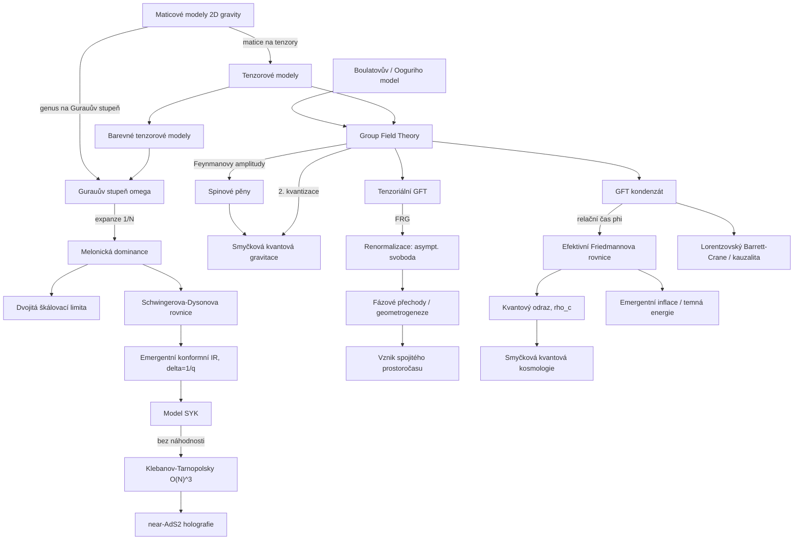

# Group field theory a tenzorové modely (Group Field Theory & Tensor Models)

> **TL;DR** — Group field theory (GFT) je kvantová teorie pole definovaná na grupové varietě (typicky $G^d$, kde $G=SU(2)$ nebo $SL(2,\mathbb{C})$), jejíž Feynmanovy diagramy jsou duální simpliciálním komplexům (triangulacím) prostoročasu a jejíž amplitudy reprodukují **spinopěnové (spin foam)** amplitudy. GFT je tak současně (i) kovariantní definicí dynamiky smyčkové kvantové gravitace (LQG) — přesněji její **druhou kvantizací (second quantization)** ve Fockově prostoru spinových sítí, a (ii) vícerozměrným zobecněním **maticových modelů (matrix models)** 2D gravity přes **tenzorové modely (tensor models)**. Klíčovým technickým průlomem byla Gurauova **expanze $1/N$** (Gurau 2010) pro barevné tenzorové modely (colored tensor models) s **melonickou dominancí (melonic dominance)**, která dodala řídicí parametr analogický genusu maticových modelů. Tatáž melonická struktura propojuje GFT s **modelem SYK (Sachdev-Ye-Kitaev)** přes Witten-Gurauovy a Klebanov-Tarnopolského tenzorové modely. Fenomenologicky nejaktivnější větví je **GFT kondenzátová kosmologie (condensate cosmology)**: makroskopický vesmír jako Boseho-Einsteinův kondenzát kvant geometrie, z něhož plyne efektivní Friedmannova rovnice s kvantovým **odrazem (bounce)** podobným LQC. Obor dnes (2024-2026) řeší renormalizaci, fázové přechody a **vznik (emergence)** spojitého prostoročasu kondenzací či při kritickém bodě, včetně plně lorentzovského Barrett-Craneova modelu a emergentní temné energie.

## Přehled a historický kontext

Skupinová polní teorie (group field theory) vznikla syntézou dvou nezávislých výzkumných linií.

**Linie 1: maticové a tenzorové modely.** V letech 1989-1990 ukázali 't Hooft, Brézin, Kazakov, Douglas, Shenker, Gross a Migdal, že **maticové modely (matrix models)** — integrály přes $N\times N$ hermitovské matice — generují náhodné triangulované plochy a v tzv. **dvojité škálovací limitě (double scaling limit)** poskytují neporuchovou definici **2D kvantové gravity** (a 2D strunové teorie). Genusový rozvoj volné energie $F\sim\sum_g N^{2-2g}F_g$ organizuje sumu přes topologie ploch; pro čistou gravitaci je neporuchové řešení dáno rovnicí typu Painlevé I [Brézin & Kazakov 1990](https://www.sciencedirect.com/science/article/abs/pii/037026939090818Q). Vícerozměrné zobecnění (matice → tenzory) zformulovali Ambjørn, Durhuus, Jónsson a nezávisle Sasakura (1991), avšak po dvě desetiletí chyběl řídicí parametr — analog genusu — který by umožnil kontrolovanou aproximaci.

**Linie 2: spinové pěny a 3. kvantizace.** Boulatov (1992) zformuloval první GFT jako polní teorii na třech kopiích $SU(2)$, jejíž Feynmanovy amplitudy reprodukují **Ponzano-Reggeho model** 3D gravity; Ooguri (1992) ji rozšířil na 4D BF teorii na $SU(2)^4$ [Boulatov 1992](https://arxiv.org/abs/hep-th/9202074). Reisenberger a Rovelli (1997, 2000) ukázali, že **každý lokální spinopěnový model lze interpretovat jako Feynmanův graf nějaké GFT** — GFT je tak „generujícím funkcionálem" spinových pěn, který automaticky předepisuje váhy triangulací a sčítá přes topologie. De Pietri, Freidel, Krasnov a Rovelli (2000) odvodili z GFT na $SO(4)/SO(3)$ Barrett-Craneův model 4D gravity [De Pietri et al. 1999](https://arxiv.org/abs/hep-th/9907154).

Razvan **Gurau** dosáhl v letech 2009-2011 rozhodujícího průlomu: pro **barevné tenzorové modely (colored tensor models)** zkonstruoval **rozvoj $1/N$** řízený kombinatorickým invariantem zvaným **Gurauův stupeň (Gurau degree)** $\omega$, přičemž vedoucí řád dominují **melonické grafy (melons)** odpovídající sférám $S^d$ [Gurau 2010](https://arxiv.org/abs/1011.2726). Tenzorové modely tak získaly svůj „genus" a obor renormalizace GFT (Ben Geloun & Rivasseau 2011 a další) prudce vzrostl.

Od roku 2013 Oriti reinterpretoval GFT jako **druhou kvantizaci LQG** (Fockův prostor spinových sítí) [Oriti 2013](https://arxiv.org/abs/1310.7786) a Gielen, Oriti a Sindoni zahájili **kondenzátovou kosmologii** [Gielen, Oriti & Sindoni 2013](https://arxiv.org/abs/1303.3576). Od roku 2016 (Witten, Klebanov-Tarnopolsky) propojily tenzorové modely obor s **modelem SYK** a holografií. Standardní reference: review tenzorových modelů [Gurau & Ryan 2012](https://arxiv.org/abs/1109.4812), monografie Gurau *Random Tensors* (OUP 2016), nedávné review [Gurau & Rivasseau 2024](https://arxiv.org/abs/2401.13510) a kapitoly *Handbook of Quantum Gravity* (2023-2024).

## Klíčové koncepty

- **Group field theory (GFT)** — kvantová teorie pole pro pole $\varphi:G^d\to\mathbb{C}$ (resp. $\mathbb{R}$) nad $d$ kopiemi Lieovy grupy $G$. Argumenty $g_1,\dots,g_d$ reprezentují paralelní transporty na $d$ stěnách elementárního simplexu (pro 4D: tetraedr = 3-simplex se 4 trojúhelníky). Interakční vrchol „lepí" $d{+}1$ polí do $d$-simplexu, propagátor identifikuje sdílené stěny — Feynmanův graf je tak duální triangulaci.

- **Tenzorový model (tensor model)** — GFT bez grupové struktury: pole je tenzor $T_{a_1\dots a_d}$ s indexy $a_i\in\{1,\dots,N\}$. Generuje stejnou kombinatoriku triangulací jako GFT, ale bez geometrických (grupových) dat; je „kosterní" kombinatorickou částí GFT.

- **Barevný tenzorový model (colored tensor model)** — Gurauova varianta s $d{+}1$ různými poli (barvami) $\psi^{(0)},\dots,\psi^{(d)}$, kde každý vrchol obsahuje právě jedno pole každé barvy. Barvení zaručuje, že duální komplexy jsou **simpliciální pseudovariety (simplicial pseudomanifolds)** a umožňuje definici Gurauova stupně.

- **Gurauův stupeň (Gurau degree) $\omega(\mathcal{G})$** — nezáporné celé číslo přiřazené barevnému grafu, definované jako součet genusů tzv. **jacketů (jackets)** — globálně vnořených stužkových (ribbon) podgrafů. Řídí expanzi $1/N$ ($N^{d-\frac{2}{(d-1)!}\omega}$); není to topologický invariant variety, nýbrž kombinatorický invariant grafu.

- **Melonické grafy (melons) / melonická dominance** — grafy s $\omega=0$, duální triangulacím sféry $S^d$. Vznikají iterovaným vkládáním „melounových" inzercí (dvojice vrcholů spojených $d$ paralelními hranami). Dominují vedoucímu řádu $1/N$; jejich sumace je řešitelná a vede na uzavřené Schwingerovy-Dysonovy rovnice.

- **Spinová pěna (spin foam)** — 2-komplex se stěnami nesoucími ireducibilní reprezentace grupy a hranami nesoucími intertwinery; historie spinové sítě. GFT Feynmanovy amplitudy = spinopěnové amplitudy; GFT „sčítá přes spinové pěny i jejich podkladové komplexy".

- **Druhá kvantizace LQG (second quantization of LQG)** — GFT pole jako kreační/anihilační operátor pro „atom prostoru" (otevřený uzel spinové sítě, dual $d$-simplexu). Fockův prostor mnoha takových kvant = kinematický prostor LQG; GFT akce kóduje kanonickou dynamiku.

- **GFT kondenzát (condensate)** — koherentní/squeezed stav $|\sigma\rangle$ velkého počtu kvant geometrie ve stejné jednočásticové konfiguraci; analogie Boseho-Einsteinova kondenzátu. Makroskopicky homogenní geometrie → kosmologie.

- **Relační čas (relational time / clock field)** — bezhmotné skalární pole $\phi$ minimálně vázané ke GFT slouží jako fyzikální „hodiny"; dynamika kondenzátu se vyjadřuje v relaci k $\phi$, čímž se obchází problém času.

- **Tenzoriální GFT (tensorial GFT, TGFT)** — GFT s tenzoriální (kombinatoricky netriviální, nemelonicky vázanou) interakcí, vhodná pro renormalizaci; zahrnuje grupové i nelokální stupně volnosti.

- **Model SYK (Sachdev-Ye-Kitaev)** — kvantová mechanika $N$ Majoranových fermionů s náhodnou $q$-tělesovou interakcí; v limitě velkého $N$ dominovaná melony, s emergentní konformní symetrií a maximálním chaosem. Tenzorové modely reprodukují tutéž melonickou strukturu **bez náhodnosti**.

- **Geometrogeneze / vznik prostoročasu (geometrogenesis / emergence)** — hypotéza, že spojitý prostoročas je fázový stav (kondenzát či kritický bod) podkladového systému ne-prostoročasových GFT kvant.

- **Podmínky jednoduchosti (simplicity constraints)** — geometrická omezení, jež redukují topologickou BF teorii na gravitaci tím, že vybírají „geometrické" reprezentace (bivektory plochy = simpliciální stěny). Implementace ve GFT odlišuje Barrett-Craneův od EPRL/FK modelu a je zdrojem nejednoznačnosti modelu.

- **EPRL/FK model (Engle-Pereira-Rovelli-Livine / Freidel-Krasnov)** — moderní 4D lorentzovský spinopěnový/GFT model na $SL(2,\mathbb{C})$ s Immirziho parametrem $\gamma$; aktuální „pracovní" spinopěnový model LQG, jemuž odpovídá příslušná GFT.

- **Reprezentace mezilehlého pole (intermediate field representation)** — Hubbard-Stratonovichova transformace tenzorové interakce zavádějící pomocné maticové/tenzorové pole; klíčový nástroj konstruktivní (Borelovsky sumovatelné) tenzorové teorie pole ($T^4_3$, $T^4_4$).

- **Gross-Pitaevskiiho aproximace (Gross-Pitaevskii approximation)** — hydrodynamický režim GFT kondenzátu, v němž interakce jsou subdominantní a dynamika kondenzátové vlnové funkce $\sigma$ je popsána nelineární rovnicí typu GP; základ odvození efektivní Friedmannovy rovnice.

- **Atom prostoru (atom of space / quantum of geometry)** — elementární kvantum GFT: otevřený uzel spinové sítě duální $d$-simplexu, nesoucí $d$ reprezentací (plochy) a intertwiner (objem); excitace GFT pole nad „no-space" vakuem.

## Matematický rámec

**Akce GFT (rank-$d$).** Základní tvar akce pro reálné/komplexní pole $\varphi$ nad $G^d$ je

$$
S[\varphi]=\frac{1}{2}\int \prod_{i=1}^{d}dg_i\; \varphi(g_1,\dots,g_d)\,\mathcal{K}(g_i)\,\varphi(g_1,\dots,g_d)
\;+\;\frac{\lambda}{d+1}\int \prod dg\; \mathcal{V}\big[\varphi^{\,d+1}\big].
$$

Zde $g_i\in G$ jsou grupové elementy na $d$ stěnách simplexu, $\mathcal{K}$ je kinetické jádro (často $\mathcal{K}=1$, případně Laplacián $-\Delta+m^2$ na $G^d$), $\lambda$ vazbová konstanta a $\mathcal{V}$ interakční jádro „lepící" $d{+}1$ polí do $d$-simplexu kontrakcí jejich argumentů. Význam: Feynmanův graf této akce je duální $d$-rozměrné triangulaci; amplituda = spinopěnová amplituda; sumace přes grafy = neporuchová suma přes geometrie i topologie.

**Boulatovův model (3D).** Pro $d=3$, $G=SU(2)$, s podmínkou grupové invariance (gauge) $\varphi(g_1,g_2,g_3)=\varphi(g_1h,g_2h,g_3h)\;\forall h$:

$$
S[\varphi]=\frac{1}{2}\!\int [dg]^3\,\varphi(g_1,g_2,g_3)^2
+\frac{\lambda}{4!}\!\int [dg]^6\,\varphi(g_1,g_2,g_3)\varphi(g_3,g_4,g_5)\varphi(g_5,g_2,g_6)\varphi(g_6,g_4,g_1).
$$

Vrchol je tetraedrický (4 pole, 6 sdílených argumentů = 6 hran tetraedru). Amplitudy reprodukují **Ponzano-Reggeho model**: každé hraně přiřazen $6j$-symbol. Význam: GFT „dynamicky" generuje 3D triangulace s ponzano-reggeovskými vahami a sčítá přes ně.

**Expanze $1/N$ barevných tenzorových modelů.** Volná energie barevného modelu má rozvoj

$$
F(N,\lambda)=\sum_{\mathcal{G}} N^{\,d-\frac{2}{(d-1)!}\,\omega(\mathcal{G})}\;C_{\mathcal{G}}(\lambda),
$$

kde součet jde přes spojené barevné grafy $\mathcal{G}$, $\omega(\mathcal{G})\geq 0$ je **Gurauův stupeň** a $C_{\mathcal{G}}$ kombinatorický faktor. Význam: roli genusu maticových modelů zde hraje $\omega$; vedoucí řád $\omega=0$ (melony, sféry $S^d$), vyšší $\omega$ exponenciálně potlačeny. Toto je formální analog 't Hooftova $1/N$ rozvoje a klíč k řiditelnosti vícerozměrných modelů [Gurau 2010](https://arxiv.org/abs/1011.2726).

**Definice Gurauova stupně přes jackety.** Gurauův stupeň je definován jako součet genusů všech **jacketů (jackets)** grafu — globálně vnořených stužkových (ribbon) povrchů odpovídajících cyklickým permutacím barev:

$$
\omega(\mathcal{G})=\sum_{J\subset\mathcal{G}} g_J,
$$

kde $J$ probíhá $\frac{d!}{2}$ jacketů a $g_J\geq0$ je genus jacketu (orientovatelný případ). Význam: $\omega$ není topologickým invariantem duální pseudovariety, nýbrž kombinatorickým invariantem grafu; meloni ($\omega=0$) mají všechny jackety rodu nula (sféry). Tato definice je přesnou vícerozměrnou náhradou za genus jediné ribbonové plochy maticového modelu a umožnila celý program renormalizace TGFT.

**Melonická Schwingerova-Dysonova (gap) rovnice.** Pro 2-bodovou funkci $G$ v melonicky dominovaném modelu s vlastní energií $\Sigma$:

$$
G(\omega)=\frac{1}{\;\mathcal{K}(\omega)-\Sigma(\omega)\;},\qquad
\Sigma(\tau_1,\tau_2)=g^2\,\big[G(\tau_1,\tau_2)\big]^{\,q-1}.
$$

Význam: melonová suma je samokonzistentní (jednoduchá iterovaná melounová inzerce), což vede na uzavřenou integrální rovnici. V IR (zanedbání kinetického členu) má konformní řešení $G(\tau)\sim |\tau|^{-2\Delta}$ s $\Delta=1/q$ — odtud emergentní konformní symetrie, sdílená s modelem SYK.

**SYK hamiltonián.** Model SYK $N$ Majoranových fermionů $\chi_i$ ($\{\chi_i,\chi_j\}=\delta_{ij}$) s $q$-tělesovou náhodnou interakcí:

$$
H=\frac{(i)^{q/2}}{q!}\sum_{i_1<\dots<i_q} J_{i_1\dots i_q}\,\chi_{i_1}\cdots\chi_{i_q},
\qquad \overline{J_{i_1\dots i_q}^2}=\frac{(q-1)!\,J^2}{N^{q-1}}.
$$

Význam: v limitě velkého $N$ je systém dominován týmiž melonickými diagramy jako tenzorové modely; tenzorový model Klebanova-Tarnopolského tutéž fyziku reprodukuje **bez náhodného průměru** $J$ (deterministická teorie), což byla Wittenova motivace [Witten 2016](https://arxiv.org/abs/1610.09758).

**G-Σ bilokální efektivní akce SYK.** Po vystředování přes $J$ a zavedení bilokálních polí $G(\tau_1,\tau_2)=\frac1N\sum_i\chi_i(\tau_1)\chi_i(\tau_2)$ a self-energie $\Sigma$:

$$
\frac{S_{\text{eff}}}{N}=-\frac12\log\det(\partial_\tau-\Sigma)
+\frac12\int d\tau_1 d\tau_2\Big[\Sigma\,G-\frac{J^2}{q}\,G^{\,q}\Big].
$$

Význam: sedlová rovnice této akce je výše uvedená gap rovnice; nízkoenergetická fluktuace kolem konformního sedla je popsána **Schwarzovou (Schwarzian) akcí** reparametrizačního módu $f(\tau)$, $S_{\text{Sch}}=-\frac{N\alpha_S}{\mathcal{J}}\int d\tau\,\{f,\tau\}$, s maximálním Ljapunovovým exponentem $\lambda_L=2\pi/\beta$.

**Klebanov-Tarnopolského tenzorový model.** Reálný rank-3 tenzor $\psi^{abc}$ se symetrií $O(N)^3$ (trifundamentální reprezentace), kvantová mechanika s „tetraedrickou" interakcí:

$$
S=\int d\tau\Big[\tfrac12\,\psi^{abc}\partial_\tau\psi^{abc}
+\tfrac14\,g\,\psi^{a_1 b_1 c_1}\psi^{a_1 b_2 c_2}\psi^{a_2 b_1 c_2}\psi^{a_2 b_2 c_1}\Big],
\qquad \lambda\equiv g^2 N^3=\text{fix}.
$$

Význam: nový velký-$N$ limit s pevným $g^2N^3$ je dominován melony, takže model má **stejný velký-$N$ limit jako SYK**, avšak je to skutečná kvantová teorie bez náhodnosti. Negaugovaná verze má však mnoho nesingletních stavů („nezdravé" spektrum) — otevřený problém pro holografii [Klebanov & Tarnopolsky 2016](https://arxiv.org/abs/1611.08915).

**Maticový genusový rozvoj a dvojitá škálovací limita.** Pro srovnání s tenzorovým případem: volná energie hermitovského maticového modelu je organizována podle genusu plochy

$$
F=\sum_{g\ge 0} N^{2-2g}\,F_g(\lambda),
$$

kde $g$ je genus (rod) triangulované plochy a $N$ velikost matice. V **dvojité škálovací limitě (double scaling limit)** se současně $N\to\infty$ a $\lambda\to\lambda_c$ tak, aby kombinace $\kappa^{-1}=N(\lambda_c-\lambda)^{(2-\gamma)/2}$ zůstala konečná; tehdy přežijí všechny řády $g$ a vznikne neporuchová 2D gravity, jejíž specifická tepelná kapacita splňuje pro čistou gravitaci Painlevého rovnici I, $u^2-\frac13 u''=t$. Význam: $\kappa$ hraje roli „strunové vazby" (genus = počet uší = mocnina $\kappa$). U **tenzorových modelů** je analogický rozvoj řízen Gurauovým stupněm $\omega$ a — na rozdíl od matic — je dvojitá škálovací limita pro $D<6$ **stabilní** (sčítá meloni i subleading „třešňové stromy"), což je strukturně bohatší než planární limita matic a jednodušší než limita vektorových modelů [Gurau & Schaeffer 2014](https://arxiv.org/abs/1404.7517).

**Efektivní Friedmannova rovnice z GFT kondenzátu (jednospinová).** Pro izotropní kondenzát s podporou na jediném spinu $j_o$ (relační čas = bezhmotné skalární pole $\phi$, čárka $=d/d\phi$) plyne

$$
\left(\frac{V'}{3V}\right)^{2}=\frac{4\pi G}{3}\left(1-\frac{\rho}{\rho_c}\right)+\frac{4V_{j_o}E_{j_o}}{9V},
\qquad
\rho_c=\frac{3\pi G\hbar^2}{2V_{j_o}^{2}}.
$$

Zde $V$ je objem vesmíru (úměrný počtu kvant), $\rho$ hustota energie skalárního pole, $\rho_c$ kritická hustota (řádu Planckovy), $E_{j_o}$ konzervovaný náboj GFT dynamiky. Význam: klasická Friedmannova rovnice $(V'/3V)^2\to 4\pi G\rho/3$ je obnovena při $\rho\ll\rho_c$; v $\rho=\rho_c$ nastane **odraz (bounce)** $V'=0$ — singularita velkého třesku je nahrazena odrazem, kvalitativně shodným s **smyčkovou kvantovou kosmologií (LQC)** [Oriti, Sindoni & Wilson-Ewing 2016](https://arxiv.org/abs/1602.05881).

**Obecná víceřespinová Friedmannova rovnice.** Pro kondenzát se support na více spinech $j$ (s $\rho_j=|\sigma_j|$, fází $\theta_j$):

$$
\left(\frac{V'}{3V}\right)^{2}=\left(\frac{2\sum_j V_j\,\rho_j\,\mathrm{sgn}(\rho_j')\sqrt{E_j-Q_j^2/\rho_j^2+m_j^2\rho_j^2}}{3\sum_j V_j\,\rho_j^2}\right)^{2},
$$

s konzervovanými veličinami $E_j=(\rho_j')^2+\rho_j^2(\theta_j')^2-m_j^2\rho_j^2$ a $Q_j=\rho_j^2\theta_j'$. Význam: „odpudivý" člen $-Q_j^2/\rho_j^3$ brání $\rho_j\to0$, čímž zajišťuje generický odraz; $E_j,Q_j$ jsou Noetherovy náboje plynoucí z GFT akce [Oriti, Sindoni & Wilson-Ewing 2016](https://arxiv.org/abs/1602.08271).

**Power-counting / renormalizovatelnost TGFT.** Pro abelovské $U(1)$ TGFT s podmínkou gauge ve 4D je stupeň divergence omezen tak, že model je **superrenormalizovatelný** pro libovolnou polynomiální interakci; rank-4 model generující 4D simpliciální variety je renormalizovatelný do všech řádů [Carrozza, Oriti & Rivasseau 2012](https://arxiv.org/abs/1207.6734), [Ben Geloun & Rivasseau 2011](https://arxiv.org/abs/1111.4997). Beta funkce vedoucí (melonové) vazby má tvar $\beta(\lambda)\propto -\lambda^3$, což implikuje **asymptotickou svobodu (asymptotic freedom)** — generický rys renormalizovatelných TGFT [Ben Geloun 2012](https://arxiv.org/abs/1205.5513).

## Klíčové výsledky a milníky

1. **Boulatovův model (1992):** první GFT — polní teorie na $SU(2)^3$ reprodukující Ponzano-Reggeho 3D gravity jako Feynmanovy diagramy; Ooguri (1992) rozšíření na 4D $SU(2)^4$ BF [Boulatov 1992](https://arxiv.org/abs/hep-th/9202074).

2. **Barrett-Crane z GFT (1999-2000):** De Pietri, Freidel, Krasnov, Rovelli odvodili 4D Barrett-Craneův spinopěnový model z GFT na $SO(4)/SO(3)$; potvrzeno, že GFT je generujícím funkcionálem spinových pěn [De Pietri et al. 1999](https://arxiv.org/abs/hep-th/9907154).

3. **Gurauova expanze $1/N$ (2010-2011):** systematický topologický rozvoj barevných tenzorových modelů řízený stupněm $\omega$; vedoucí řád = meloni = sféry $S^d$. Poskytl chybějící řídicí parametr, „genus" tenzorových modelů [Gurau 2010](https://arxiv.org/abs/1011.2726).

4. **Melonová dominance a kritické chování (2011-2013):** sumace melonů, melonický fázový přechod, kontinuální limita; tenzorové modely jako kandidát vícerozměrné kvantové gravity [Bonzom, Gurau, Rivasseau 2011](https://arxiv.org/abs/1105.3122).

5. **Renormalizace TGFT (2011-2015):** Ben Geloun & Rivasseau dokázali renormalizovatelnost rank-4 tenzorové teorie; Carrozza-Oriti-Rivasseau superrenormalizovatelnost $U(1)$ ve 4D; objev **asymptotické svobody** jako generického rysu [Ben Geloun 2012](https://arxiv.org/abs/1205.5513), [Carrozza, Oriti & Rivasseau 2012](https://arxiv.org/abs/1207.6734).

6. **Dvojitá škálovací limita tenzorů (2013-2014):** Dartois-Gurau-Rivasseau a Gurau-Schaeffer ukázali, že některé tenzorové modely mají **stabilní** dvojitou škálovací limitu (na rozdíl od maticových modelů); subleading „třešňové stromy (cherry trees)" pro $D<6$ [Gurau & Schaeffer 2014](https://arxiv.org/abs/1404.7517).

7. **GFT jako 2. kvantizace LQG (2013):** Oriti zkonstruoval Fockův prostor spinových sítí, jehož kreační/anihilační operátory jsou GFT pole; přímá korespondence kanonické dynamiky LQG ↔ GFT akce [Oriti 2013](https://arxiv.org/abs/1310.7786).

8. **GFT kondenzátová kosmologie (2013-2016):** Gielen-Oriti-Sindoni zavedli kondenzátové stavy → homogenní kosmologie; Oriti-Sindoni-Wilson-Ewing odvodili efektivní Friedmannovu rovnici s **kvantovým odrazem** podobným LQC, $\rho_c\sim\rho_{\rm Pl}$ [Gielen, Oriti & Sindoni 2013](https://arxiv.org/abs/1303.3576), [Oriti, Sindoni & Wilson-Ewing 2016](https://arxiv.org/abs/1602.05881).

9. **SYK ↔ tenzorové modely (2016-2017):** Witten ukázal, že Gurau-Wittenův barevný tenzorový model má stejný velký-$N$ limit jako SYK bez náhodnosti; Klebanov-Tarnopolsky zjednodušili na nebarvený $O(N)^3$ model. Most mezi GFT/tenzory a holografií near-AdS₂ [Witten 2016](https://arxiv.org/abs/1610.09758), [Klebanov & Tarnopolsky 2016](https://arxiv.org/abs/1611.08915).

10. **Fázové přechody a Landau-Ginzburg (2018-2025):** Pithis, Thürigen, Marchetti, Oriti, Steinhaus aplikovali funkční renormalizační grupu a Landau-Ginzburgovu střední pole na realistické TGFT; podmínky pro spojitý fázový přechod (geometrogenezi), kritická dimenze [Pithis & Thürigen 2018](https://arxiv.org/abs/1808.09765), [Marchetti et al. 2022](https://arxiv.org/abs/2209.04297).

11. **Lorentzovský Barrett-Crane / kauzální struktura (2022-2025):** plnohodnotný model lorentzovské kvantové geometrie s prostorupodobnými, světelnými i časupodobnými tetraedry; Landau-Ginzburgova analýza ukazuje, že časupodobné stěny nepřispívají ke kritickému chování [Jercher, Oriti, Pithis 2022](https://arxiv.org/abs/2206.15442), [PRD 111, 026014 (2025)](https://journals.aps.org/prd/abstract/10.1103/PhysRevD.111.026014).

12. **Emergentní temná energie a inflace (2025):** Marchetti, Ladstätter, Oriti odvodili z GFT střední pole pozdně-časový atraktor dynamické temné energie s fantomovým chováním, případně rané pomalu-rolující inflační období [Marchetti, Ladstätter & Oriti 2025](https://arxiv.org/abs/2512.11712).

## Současný stav (2024-2026)

Obor se dnes soustředí na **čtyři aktivní fronty**:

**(a) Vznik spojitého prostoročasu (emergence) přes fázové přechody.** Hlavní paradigma: spojitá geometrie odpovídá netriviální fázi GFT (kondenzát či kritický bod), do níž se přechází „geometrogenezí". Funkční renormalizační grupa (FRG) a Landau-Ginzburgova střední-polní analýza se postupně aplikují na stále realističtější modely. Klíčový výsledek: v cyklicky-melonové aproximaci je TGFT na $U(1)$ ekvivalentní efektivnímu $O(N)$ modelu a vykazuje spojitý fázový přechod; pro realistické modely s lokálními (skalárními) i nelokálními (grupovými) stupni volnosti je střední pole sebekonzistentní nad kritickou dimenzí [Marchetti et al. 2022](https://arxiv.org/abs/2209.04297).

**(b) Lorentzovská kvantová geometrie a kauzalita.** Plně lorentzovský **kompletní Barrett-Craneův (CBC) model** zahrnuje prostorupodobné, časupodobné i světelné tetraedry; Landau-Ginzburgova analýza (2025) ukázala, že mean-field je genericky sebekonzistentní a časupodobné stěny nepřispívají ke kritickému chování. Práce o **emergentních lorentzovských geometriích** ze spinových pěn a GFT (Jercher 2025, doktorská práce) zkoumá vznik kauzální struktury a dynamické dimenze prostoročasu [arXiv:2506.20340](https://arxiv.org/abs/2506.20340).

**(c) Kondenzátová kosmologie — perturbace a fenomenologie.** Po homogenním pozadí se přechází k **nehomogenitám a perturbacím**: Gielen-Mickel (2025) rekonstruují efektivní metriku z GFT a definují gauge-invariantní kosmologické skalární perturbace z GFT tenzoru energie-hybnosti [arXiv:2505.07951](https://arxiv.org/abs/2505.07951). Marchetti, Ladstätter a Oriti (2025) ukazují **emergentní inflaci a dynamickou temnou energii** s fantomovým chováním přímo z GFT interakcí [arXiv:2512.11712](https://arxiv.org/abs/2512.11712). Cílem je predikce odlišitelná od LQC/CDM (např. trans-Planckovská dynamika, modifikace spektra).

**(d) Tenzorové modely, SYK a holografie.** Pokračuje studium melonických CFT v $\mathbb{R}^d$ (Klebanov-Tarnopolsky, prismatic models), linie pevných bodů, supersymetrických tenzorových modelů a vztahu k near-AdS₂. Review [Gurau & Rivasseau 2024](https://arxiv.org/abs/2401.13510) výslovně staví tenzorové polní teorie jako „novou rodinu velkých-$N$ konformních teorií relevantních pro AdS/CFT". Kombinovaný přehled kombinatoriky, velkého $N$ a renormalizace [arXiv:2404.07834](https://arxiv.org/abs/2404.07834).

Obor zůstává menší a teoretičtější než LQG či CDT, ale je „lepidlem" mezi LQG/spinopěnami, maticovými/tenzorovými modely a SYK/holografií.

### Kvantitativní orientační hodnoty

Pro orientaci v řádech a klíčových číslech, která se v oboru opakují:

- **Rank / dimenze:** GFT pro $d$-rozměrnou kvantovou gravitaci má pole s $d$ argumenty; 3D Boulatov $d=3$ (na $SU(2)^3$), 4D Ooguri/EPRL/Barrett-Crane $d=4$. Barevný model má $d{+}1$ barev.
- **Gurauův stupeň:** vedoucí řád $\omega=0$ (meloni, $S^d$); mocnina $N$ ve volné energii klesá jako $N^{d-\frac{2}{(d-1)!}\omega}$.
- **Melonická limita SYK/tenzorů:** pevné $g^2N^3$ (rank-3, $O(N)^3$); konformní rozměr 2-bodové funkce $\Delta=1/q$ (pro $q=4$ tedy $\Delta=1/4$); maximální Ljapunovův exponent $\lambda_L=2\pi/\beta$ (saturace chaosové meze Maldaceny-Shenkera-Stanforda).
- **Kritická hustota odrazu:** $\rho_c=\dfrac{3\pi G\hbar^2}{2V_{j_o}^2}$ řádu Planckovy hustoty; pro jednospinový kondenzát s $m_{j_o}^2=3\pi G$ Friedmann obnovuje GR při $\rho\ll\rho_c$.
- **Renormalizace:** rank-4 TGFT renormalizovatelná do všech řádů; 4D $U(1)$ s gauge superrenormalizovatelná; beta funkce $\beta\propto-\lambda^3$ → asymptotická svoboda.
- **Dvojitá škálovací limita:** stabilní pro $D<6$; mez stability $D=6$ je analogem $c=1$ bariéry maticových modelů.

## Otevřené problémy

1. **Existence a charakter geometrogenezního fázového přechodu.** Otázka: existuje v realistickém 4D lorentzovském GFT spojitý fázový přechod, jehož kritická fáze je makroskopicky 4D prostoročas s Einsteinovou dynamikou? Proč těžké: nutná neporuchová kontrola FRG mimo melonovou aproximaci, na nekompaktní grupě $SL(2,\mathbb{C})$, s tenzoriálně nelokálními interakcemi; mean-field může selhat (existují modely **bez** přechodu). Pokrok: Landau-Ginzburg + FRG pro stále realističtější modely (2018-2025), zatím bez definitivního důkazu.

2. **Vztah mikroskopické GFT dynamiky a Einsteinových rovnic v kontinuální limitě.** Otázka: reprodukuje kondenzátová (hydrodynamická) limita GFT plnou Einsteinovu gravitaci, nejen Friedmann/homogenní sektor? Proč těžké: odvození efektivní dynamiky vyžaduje neperturbativní sumaci a kontrolu nehomogenit; rekonstrukce metriky z GFT dat je nejednoznačná. Pokrok: rekonstrukce metriky a skalárních perturbací (Gielen-Mickel 2025), zatím jen linearizovaně.

3. **Volba „správného" GFT modelu (kinetický člen, interakce, grupa).** Otázka: který GFT model odpovídá 4D obecné relativitě? Kinetické jádro, interakce ani grupa nejsou jednoznačně určeny; EPRL/FK i Barrett-Crane mají různé GFT formulace. Proč těžké: chybí prvotní princip fixující akci; renormalizovatelnost jen některé modely vybírá. Pokrok: renormalizační kritéria a požadavek kauzální úplnosti zužují prostor.

4. **Renormalizace plně geometrických 4D modelů.** Otázka: jsou EPRL/Barrett-Crane GFT renormalizovatelné, a jaký je jejich UV/IR tok? Proč těžké: nekompaktní grupa, simpliciální gravitační omezení (simplicity constraints) komplikují power-counting; melonová aproximace nemusí stačit. Pokrok: renormalizovatelnost a asymptotická svoboda prokázány jen pro abelovské/zjednodušené TGFT.

5. **Neporuchová suma a problém topologií.** Otázka: jak ovládnout sumu přes **všechny** topologie (včetně neorientovatelných a singulárních pseudovariet)? Proč těžké: tenzorové modely generují i pseudovariety, ne jen variety; suma je divergentní (faktoriální růst) a vyžaduje Borelovu sumaci či dvojité škálování. Pokrok: stabilní dvojitá škálovací limita pro $D<6$ (Gurau-Schaeffer), ale ne pro plně geometrické modely.

6. **Spektrum a holografie tenzorových modelů.** Otázka: má (negaugovaný) tenzorový model zdravé spektrum a gravitační duál podobně jako SYK? Proč těžké: negaugované modely mají velké množství nesingletních stavů a „complex/tachyonic" operátory; gaugování odstraňuje nesinglety, ale komplikuje výpočty. Pokrok: studovány gaugované verze a linie pevných bodů, plný duál stále chybí.

7. **Lorentzovská kauzální struktura na mikroskopické úrovni.** Otázka: jak vložit lokální kauzální strukturu (světelné kužely, orientaci času) do GFT amplitud? Proč těžké: standardní spinopěny pracují se speciálními třídami lorentzovských triangulací; časupodobné/světelné stěny vyžadují nové reprezentační teorie $SL(2,\mathbb{C})$. Pokrok: kompletní Barrett-Crane model (2022-2025) zavádí všechny typy tetraedrů.

8. **Spojení relačního času s plnou kovariancí.** Otázka: je relační čas (bezhmotné skalární pole) dostatečný pro plnou difeomorfní invarianci, nebo jen pro homogenní/perturbativní sektor? Proč těžké: čtyři skalární „hodiny" definují souřadnice jen lokálně; gauge-invariance perturbací není automatická. Pokrok: relační pozorovatelné a perturbace (Marchetti-Oriti, Gielen-Mickel 2024-2025).

## Vztahy k ostatním přístupům

### Smyčková kvantová gravitace (loop-quantum-gravity) — **dobře prozkoumáno**
Nejtěsnější vazba. GFT je **druhou kvantizací LQG**: GFT pole jsou kreační/anihilační operátory pro otevřené uzly spinových sítí, Fockův prostor mnoha kvant = kinematický prostor LQG, GFT akce kóduje kanonickou dynamiku [Oriti 2013](https://arxiv.org/abs/1310.7786). Spektrum geometrických operátorů (objem, plocha) sdílí s LQG. Otevřené: zda GFT dynamika přesně reprodukuje hamiltonovskou vazbu LQG ve 4D (ověřeno v 3D).

### Spinové pěny (loop-quantum-gravity / spin-foam) — **dobře prozkoumáno**
GFT je **generujícím funkcionálem spinových pěn**: Feynmanovy amplitudy GFT = spinopěnové amplitudy, a navíc GFT předepisuje váhy triangulací a **sčítá přes podkladové komplexy i topologie** [De Pietri et al. 1999](https://arxiv.org/abs/hep-th/9907154). EPRL/FK i Barrett-Crane mají svou GFT formulaci. Otevřené: kontrola sumy přes komplexy (refinement/continuum limit).

### Maticové modely 2D gravity (string-theory / 2D gravity) — **dobře prozkoumáno**
GFT a tenzorové modely jsou **přímým vícerozměrným zobecněním** maticových modelů: matice→tenzory, genus→Gurauův stupeň, dvojitá škálovací limita přenesena (a v $D<6$ stabilnější) [Gurau & Schaeffer 2014](https://arxiv.org/abs/1404.7517). Sdílená matematika: ortogonální polynomy, loop/Schwinger-Dyson rovnice, Painlevé. Otevřené: zda 4D analog dvojité škálovací limity existuje pro geometrické modely.

### Model SYK a holografie (holography-adscft / black-holes-information) — **částečně prozkoumáno**
Tenzorové modely (Witten, Gurau-Witten, Klebanov-Tarnopolsky) reprodukují **melonickou dominanci a emergentní konformní symetrii SYK bez náhodnosti**; sdílejí gap rovnici, $\Delta=1/q$, Schwarzovu akci a near-AdS₂ holografii [Witten 2016](https://arxiv.org/abs/1610.09758), [Klebanov & Tarnopolsky 2016](https://arxiv.org/abs/1611.08915). Most je však na úrovni **kombinatoriky velkého $N$**, ne plné gravitační GFT — propojení melonické struktury kvantověgravitačních GFT s holografií zůstává otevřené a je „skoro neprozkoumanou" zlatou žílou.

### Smyčková kvantová kosmologie / kvantová kosmologie (quantum-cosmology) — **částečně prozkoumáno**
GFT kondenzátová kosmologie reprodukuje **efektivní Friedmannovu rovnici s odrazem** kvalitativně shodnou s LQC, $\rho_c\sim\rho_{\rm Pl}$; LQC je interpretována jako efektivní hydrodynamika GFT (2. kvantizovaná LQG) [Oriti, Sindoni & Wilson-Ewing 2016](https://arxiv.org/abs/1602.05881). Odvození „improved dynamics" LQC z první principů GFT je částečné. Otevřené: perturbace, predikce pro CMB, role interakcí (emergentní inflace/temná energie 2025).

### Kauzální dynamické triangulace (causal-dynamical-triangulations) — **částečně prozkoumáno**
Sdílí myšlenku **náhodných triangulací jako mikroskopické struktury prostoročasu** a sumace přes geometrie; CDT je „pevně-grupová" lorentzovská verze, GFT/tenzory poskytují generující polní teorii a kontrolu topologií. Vazba: tenzorové modely lze chápat jako grand-canonickou verzi DT; CDT kauzalita ↔ lorentzovský GFT. Otevřené: zda existuje GFT, jejíž kontinuální limita reprodukuje CDT fáze (de Sitter fáze, spektrální dimenze) — málo prozkoumáno.

### Asymptotická bezpečnost (asymptotic-safety) — **částečně prozkoumáno**
Sdílená **funkční renormalizační grupa**: TGFT mají Wilson-Fisherovy pevné body i asymptotickou svobodu; otázka, zda existuje netriviální UV pevný bod (analog asymptotické bezpečnosti) v GFT teorii prostoru [Benedetti, Ben Geloun, Oriti 2015](https://arxiv.org/abs/1411.3180). Otevřené: vztah mezi UV pevným bodem TGFT a asymptoticky bezpečnou gravitací — sdílí FRG techniku, ne výsledek.

### Nekomutativní geometrie (noncommutative-geometry) — **sotva prozkoumáno**
GFT mají přirozenou nekomutativní reprezentaci ve „flux/Lie algebra" proměnných (nekomutativní Fourierova transformace na grupě); efektivní matter z GFT je popsán nekomutativní teorií pole (např. $\kappa$-Minkowski v 3D). Vazba existuje technicky, ale systematicky neprobádána [Oriti 2006](https://arxiv.org/abs/gr-qc/0512069). Otevřené: zda emergentní geometrie GFT je genericky nekomutativní.

### Strunová teorie (string-theory) — **sotva prozkoumáno**
Kromě sdíleného původu v maticových modelech 2D gravity/2D strun je přímá vazba slabá. Melonické CFT z tenzorových polních teorií se nabízejí jako možní hráči AdS/CFT [Gurau & Rivasseau 2024](https://arxiv.org/abs/2401.13510), ale gravitační duál tenzorové GFT v $D>2$ není znám. Téměř neprobádáno.

### Entanglement a prostoročas (entanglement-spacetime) — **sotva prozkoumáno**
Nedávno naznačeno, že **kvantověgravitační entanglement** mezi GFT kvanty může „zasít" kosmologické nehomogenity a modifikovat trans-Planckovskou dynamiku. Vazba na ER=EPR/„it-from-qubit" je spekulativní a převážně neprobádaná. Otevřené: role entanglementu GFT kvant při vzniku geometrie.

## Mapa konceptů

## Reference

1. **Boulatov, D.V.** (1992). *A Model of Three-Dimensional Lattice Gravity.* Mod. Phys. Lett. A7, 1629-1646. arXiv: [hep-th/9202074](https://arxiv.org/abs/hep-th/9202074). — První GFT; $SU(2)^3$ reprodukuje Ponzano-Reggeho 3D gravity.

2. **Ooguri, H.** (1992). *Topological Lattice Models in Four Dimensions.* Mod. Phys. Lett. A7, 2799-2810. — 4D rozšíření Boulatova (BF teorie na $SU(2)^4$).

3. **Brézin, É. & Kazakov, V.A.** (1990). *Exactly Solvable Field Theories of Closed Strings.* Phys. Lett. B236, 144. [link](https://www.sciencedirect.com/science/article/abs/pii/037026939090818Q). — Dvojitá škálovací limita maticových modelů; neporuchová 2D gravity.

4. **De Pietri, R., Freidel, L., Krasnov, K. & Rovelli, C.** (2000). *Barrett-Crane model from a Boulatov-Ooguri field theory over a homogeneous space.* Nucl. Phys. B574, 785. arXiv: [hep-th/9907154](https://arxiv.org/abs/hep-th/9907154). — Odvození 4D spinopěnového modelu z GFT.

5. **Freidel, L.** (2005). *Group Field Theory: An Overview.* Int. J. Theor. Phys. 44, 1769. arXiv: [hep-th/0505016](https://arxiv.org/abs/hep-th/0505016). — Standardní raný přehled.

6. **Oriti, D.** (2006). *The group field theory approach to quantum gravity.* arXiv: [gr-qc/0607032](https://arxiv.org/abs/gr-qc/0607032). — Konceptuální přehled, 3. kvantizace, nekomutativní reprezentace.

7. **Gurau, R.** (2011). *The 1/N expansion of colored tensor models.* Annales Henri Poincaré 12, 829. arXiv: [1011.2726](https://arxiv.org/abs/1011.2726). — Klíčový průlom: topologická expanze řízená Gurauovým stupněm; meloni = sféry.

8. **Bonzom, V., Gurau, R., Riello, A. & Rivasseau, V.** (2011). *Critical behavior of colored tensor models in the large N limit.* Nucl. Phys. B853, 174. arXiv: [1105.3122](https://arxiv.org/abs/1105.3122). — Melonová sumace, kritické chování, kontinuální limita.

9. **Ben Geloun, J. & Rivasseau, V.** (2013). *A Renormalizable 4-Dimensional Tensor Field Theory.* Commun. Math. Phys. 318, 69. arXiv: [1111.4997](https://arxiv.org/abs/1111.4997). — První renormalizovatelná rank-4 tenzorová teorie.

10. **Ben Geloun, J.** (2012). *Asymptotic Freedom of Rank 4 Tensor Group Field Theory.* arXiv: [1205.5513](https://arxiv.org/abs/1205.5513). — Asymptotická svoboda jako generický rys TGFT.

11. **Carrozza, S., Oriti, D. & Rivasseau, V.** (2014). *Renormalization of Tensorial Group Field Theories: Abelian U(1) Models in Four Dimensions.* Commun. Math. Phys. 327, 603. arXiv: [1207.6734](https://arxiv.org/abs/1207.6734). — Superrenormalizovatelnost 4D $U(1)$ TGFT s gauge.

12. **Gurau, R. & Ryan, J.P.** (2012). *Colored Tensor Models — a review.* SIGMA 8, 020. arXiv: [1109.4812](https://arxiv.org/abs/1109.4812). — Standardní review barevných tenzorových modelů.

13. **Oriti, D.** (2016). *Group field theory as the 2nd quantization of Loop Quantum Gravity.* Class. Quantum Grav. 33, 085005. arXiv: [1310.7786](https://arxiv.org/abs/1310.7786). — Fockův prostor spinových sítí; korespondence LQG↔GFT.

14. **Gielen, S., Oriti, D. & Sindoni, L.** (2013). *Cosmology from Group Field Theory Formalism for Quantum Gravity.* Phys. Rev. Lett. 111, 031301. arXiv: [1303.3576](https://arxiv.org/abs/1303.3576). — Zahájení kondenzátové kosmologie.

15. **Oriti, D., Sindoni, L. & Wilson-Ewing, E.** (2016). *Emergent Friedmann dynamics with a quantum bounce from quantum gravity condensates.* Class. Quantum Grav. 33, 224001. arXiv: [1602.05881](https://arxiv.org/abs/1602.05881). — Efektivní Friedmannova rovnice s kvantovým odrazem, kritická hustota $\rho_c$.

16. **Oriti, D., Sindoni, L. & Wilson-Ewing, E.** (2017). *Bouncing cosmologies from quantum gravity condensates.* Class. Quantum Grav. 34, 04LT01. arXiv: [1602.08271](https://arxiv.org/abs/1602.08271). — Víceřespinová Friedmannova rovnice, konzervované náboje $E_j,Q_j$.

17. **Gurau, R. & Schaeffer, G.** (2016). *The double scaling limit of random tensor models.* JHEP 09 (2014) 051. arXiv: [1404.7517](https://arxiv.org/abs/1404.7517). — Stabilní dvojitá škálovací limita, třešňové stromy pro $D<6$.

18. **Witten, E.** (2019). *An SYK-Like Model Without Disorder.* J. Phys. A52, 474002. arXiv: [1610.09758](https://arxiv.org/abs/1610.09758). — Gurau-Wittenův tenzorový model se stejným velkým-$N$ limitem jako SYK, bez náhodnosti.

19. **Klebanov, I.R. & Tarnopolsky, G.** (2017). *Uncolored Random Tensors, Melon Diagrams, and the Sachdev-Ye-Kitaev Models.* Phys. Rev. D95, 046004. arXiv: [1611.08915](https://arxiv.org/abs/1611.08915). — $O(N)^3$ nebarvený tenzorový model, $g^2N^3$ fix, melonová dominance, IR $\Delta=1/q$.

20. **Maldacena, J. & Stanford, D.** (2016). *Comments on the Sachdev-Ye-Kitaev model.* Phys. Rev. D94, 106002. arXiv: [1604.07818](https://arxiv.org/abs/1604.07818). — G-Σ akce, Schwarzova akce, maximální chaos $\lambda_L=2\pi/\beta$.

21. **Pithis, A.G.A. & Thürigen, J.** (2018). *Phase transitions in group field theory: The Landau perspective.* Phys. Rev. D98, 126006. arXiv: [1808.09765](https://arxiv.org/abs/1808.09765). — Landau-Ginzburgova analýza fázových přechodů v GFT.

22. **Benedetti, D., Ben Geloun, J. & Oriti, D.** (2015). *Functional Renormalisation Group Approach for Tensorial Group Field Theory.* JHEP 03 (2015) 084. arXiv: [1411.3180](https://arxiv.org/abs/1411.3180). — FRG pro TGFT, fixní body.

23. **Marchetti, L., Oriti, D., Pithis, A.G.A. & Thürigen, J.** (2022). *Phase transitions in tensorial group field theories: Landau-Ginzburg analysis of models with both local and non-local degrees of freedom.* JHEP 12 (2021) 201. arXiv: [2110.15336](https://arxiv.org/abs/2110.15336). — Realistické modely s lokálními i nelokálními stupni volnosti.

24. **Jercher, A.F., Oriti, D. & Pithis, A.G.A.** (2022). *Complete Barrett-Crane model and its causal structure.* Phys. Rev. D106, 066019. arXiv: [2206.15442](https://arxiv.org/abs/2206.15442). — Lorentzovský model s prostorupodobnými, časupodobnými i světelnými tetraedry.

25. **Gurau, R. & Rivasseau, V.** (2024). *Quantum Gravity and Random Tensors.* (Poincaré Seminar, prosinec 2023). arXiv: [2401.13510](https://arxiv.org/abs/2401.13510). — Moderní přehled; tenzorové polní teorie jako velké-$N$ CFT pro AdS/CFT.

26. **Carrozza, S. et al.** (2024). *Tensor models and group field theories: combinatorics, large N and renormalization.* arXiv: [2404.07834](https://arxiv.org/abs/2404.07834). — Kombinovaný přehled kombinatoriky, $1/N$ a renormalizace.

27. **Gielen, S. & Mickel, L.** (2025). *Cosmological scalar perturbations for a metric reconstructed from group field theory.* Class. Quantum Grav. (2025). arXiv: [2505.07951](https://arxiv.org/abs/2505.07951). — Rekonstrukce metriky a gauge-invariantní perturbace z GFT.

28. **Marchetti, L., Ladstätter, T. & Oriti, D.** (2025). *Cosmic Acceleration from Quantum Gravity: Emergent Inflation and Dynamical Dark Energy.* arXiv: [2512.11712](https://arxiv.org/abs/2512.11712). — Emergentní inflace a fantomová dynamická temná energie z GFT střední pole.

29. **Jercher, A.F.** (2025). *Emergent Lorentzian Geometries from Spin-Foams and Group Field Theories.* (PhD thesis). arXiv: [2506.20340](https://arxiv.org/abs/2506.20340). — Doktorská práce: spektrální dimenze, lorentzovský Regge kalkulus, kauzální doplnění Barrett-Craneova modelu GFT, kvantové korekce k perturbacím.

30. **Oriti, D.** (2007). *Group field theory as the microscopic description of the quantum spacetime fluid.* arXiv: [0710.3276](https://arxiv.org/abs/0710.3276). — Koncepce kvantového prostoročasu jako kondenzované látky, geometrogeneze.
