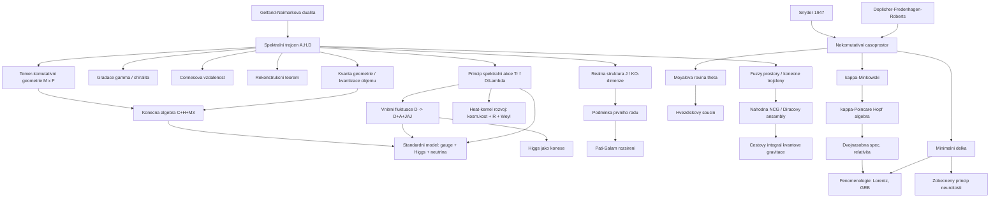

# Nekomutativní geometrie (Noncommutative Geometry)

> **TL;DR** — Nekomutativní geometrie (NCG) Alaina Connese kóduje veškerou geometrickou informaci do spektrálního trojčlenu (spectral triple) $(\mathcal{A}, \mathcal{H}, D)$ — algebry operátorů, Hilbertova prostoru a Diracova operátoru — a zobecňuje Riemannovu geometrii do prostorů, kde souřadnice nekomutují. Spektrální akce (spectral action) Chamseddina a Connese odvozuje z čistě geometrického principu Standardní model částicové fyziky minimálně svázaný s gravitací (Einstein–Hilbert + Weyl + kosmologická konstanta), přičemž Higgsovo pole vystupuje jako konexe v diskrétním vnitřním směru. NCG zahrnuje rovněž nekomutativní časoprostory (Moyalova rovina, $\kappa$-Minkowski), deformovanou speciální relativitu (DSR), scénáře minimální délky a zobecněný princip neurčitosti (GUP) a fuzzy prostory. Současný výzkum (2023–2026) se soustředí na náhodnou NCG (Diracovy ansámbly jako cesta ke kvantové gravitaci), Pati–Salam rozšíření, spektrální torzi a fenomenologii Lorentzovy invariance.

## Přehled a historický kontext

Nekomutativní geometrie je matematicko-fyzikální program, jehož základní myšlenkou je, že geometrii prostoru lze plně rekonstruovat z algebry funkcí na něm — a pokud této algebře dovolíme být **nekomutativní**, dostaneme „prostory", které nemají body v klasickém smyslu, ale přesto mají dobře definovanou geometrii, metriku a dimenzi.

Kořeny sahají k Gelfandově–Naimarkově dualitě (Gelfand–Naimark duality): komutativní $C^*$-algebry odpovídají jedna ku jedné lokálně kompaktním Hausdorffovým prostorům. Connesovým programem je „odbourat komutativitu" a studovat nekomutativní $C^*$-algebry jako „prostory funkcí na neexistujících nekomutativních prostorech".

Historické milníky:

- **1947** — Hartland Snyder navrhuje první model kvantovaného (nekomutativního) časoprostoru s diskrétním spektrem souřadnic, motivovaný odstraněním UV divergencí v QFT, přitom zachovává Lorentzovu invarianci [Snyder 1947](https://doi.org/10.1103/PhysRev.71.38). Hybnostní variéta má geometrii de Sitterova prostoru.
- **70.–80. léta** — Alain Connes rozvíjí nekomutativní geometrii jako rozšíření Atiyahovy K-teorie a indexové teorie; klíčová je jeho cyklická kohomologie a klasifikace faktorů von Neumannových algeber (Fieldsova medaile 1982).
- **1994** — Connesova monografie *Noncommutative Geometry* formuluje axiomy spektrálního trojčlenu.
- **1995** — Doplicher, Fredenhagen, Roberts (DFR) odvozují nekomutativitu časoprostoru z kombinace Heisenbergova principu a klasické gravitace: lokalizace události s přesností lepší než Planckova délka by vytvořila černou díru [DFR 1995](https://arxiv.org/abs/hep-th/0303037).
- **1996–1997** — Chamseddine a Connes formulují **princip spektrální akce** [Chamseddine & Connes 1996](https://arxiv.org/abs/hep-th/9606001).
- **2006–2007** — Plný Standardní model s mícháním neutrin a gravitací z NCG [Chamseddine, Connes & Marcolli 2007](https://arxiv.org/abs/hep-th/0610241).
- **2008** — Connes dokazuje **rekonstrukční teorém** (reconstruction theorem) pro komutativní spektrální trojčleny [Connes 2008](https://arxiv.org/abs/0810.2088).
- **2014–2015** — „Quanta of geometry": kvantizace objemu z vyšší Heisenbergovy komutační relace [Chamseddine, Connes & Mukhanov 2014](https://arxiv.org/abs/1409.2471).
- **2020–2026** — Náhodná NCG (Diracovy ansámbly, fuzzy geometrie) jako přístup k cestovému integrálu kvantové gravitace [Barrett & Glaser 2016](https://arxiv.org/abs/1510.01377).

Paralelně se rozvinula druhá větev programu — **nekomutativní časoprostory** (Moyalova rovina, $\kappa$-Minkowski) a jejich Hopfovo-algebraické symetrie ($\kappa$-Poincaré), které motivovaly **deformovanou/dvojnásobnou speciální relativitu** (DSR) Amelino-Cameliy. Tyto směry jsou matematicky odlišné od Connesova spektrálního přístupu, ale sdílejí fundamentální ideu nekomutativity souřadnic.

Je užitečné rozlišovat **tři typy nekomutativity souřadnic**, podle struktury komutátoru $[\hat{x}^\mu, \hat{x}^\nu]$:

- **kanonický (konstantní)** — $[\hat{x}^\mu, \hat{x}^\nu] = i\theta^{\mu\nu}$ s konstantní maticí (Moyalova rovina, DFR); typický pro D-brány v $B$-poli;
- **Lieovsky-algebraický** — $[\hat{x}^\mu, \hat{x}^\nu] = i\, C^{\mu\nu}_\rho\, \hat{x}^\rho$ se strukturními konstantami ($\kappa$-Minkowski, fuzzy sféra);
- **kvadratický (kvantové grupy)** — $[\hat{x}^\mu, \hat{x}^\nu] = i\, R^{\mu\nu}_{\rho\sigma}\, \hat{x}^\rho \hat{x}^\sigma$ (Snyderův typ, $q$-deformace).

Connesův spektrální přístup je naproti tomu **operátorově-geometrický**: nekomutativita nemusí být přímo v souřadnicích, ale v celé algebře $\mathcal{A}$ (u Standardního modelu konkrétně v konečné maticové algebře $\mathcal{A}_F$), zatímco spojitý prostor zůstává komutativní.

## Klíčové koncepty

- **Spektrální trojčlen (spectral triple)** $(\mathcal{A}, \mathcal{H}, D)$ — trojice: $*$-algebra $\mathcal{A}$ reprezentovaná jako ohraničené operátory na Hilbertově prostoru $\mathcal{H}$, a samosdružený (obecně neohraničený) Diracův operátor $D$ s kompaktní rezolventou, takový že komutátor $[D, a]$ je ohraničený pro všechna $a \in \mathcal{A}$. Toto je nekomutativní zobecnění hladké spinové Riemannovy variety.
- **Reálná struktura (real structure)** $J$ — antiunitární operátor (charge conjugation), který činí trojček „reálným" a kóduje **KO-dimenzi** modulo 8.
- **Gradace (grading)** $\gamma$ — pro sudé trojčleny, $\gamma^2 = 1$, $[\gamma, a] = 0$, $D\gamma = -\gamma D$; odpovídá chiralitě.
- **Connesova vzdálenostní formule (Connes distance formula)** — metrika rekonstruovaná z $D$ jako supremum; pro komutativní případ dává geodetickou vzdálenost, pro smíšené stavy Wassersteinovu vzdálenost řádu 1.
- **Rekonstrukční teorém (reconstruction theorem)** — komutativní spektrální trojček splňující 7 axiomů (dimenze, regularita, konečnost, reálnost, podmínka prvního řádu, orientovatelnost, Poincarého dualita) **nutně** pochází z kompaktní orientované Riemannovy spinové variety [Connes 2008](https://arxiv.org/abs/0810.2088).
- **Téměř-komutativní geometrie (almost-commutative geometry)** — součin spojité variety $M$ a konečného nekomutativního prostoru $F$: $\mathcal{A} = C^\infty(M) \otimes \mathcal{A}_F$. Konečný prostor kóduje vnitřní (kalibrační) stupně volnosti.
- **Konečná algebra Standardního modelu (finite SM algebra)** $\mathcal{A}_F = \mathbb{C} \oplus \mathbb{H} \oplus M_3(\mathbb{C})$ — komplexní čísla, kvaterniony, matice $3\times3$; její grupa unitárních prvků dává po unimodulární redukci kalibrační grupu $U(1) \times SU(2) \times SU(3)$.
- **Vnitřní fluktuace metriky (inner fluctuations)** — fluktuace $D \to D_A = D + A + JAJ^{-1}$, kde $A = \sum_i a_i [D, b_i]$; generují kalibrační pole (spojitý směr) a Higgsovo pole (diskrétní směr).
- **Higgs jako konexe (Higgs as connection)** — Higgsovo pole pochází z off-diagonálních komponent konečného Diracova operátoru, je to „paralelní přenos v diskrétním směru".
- **Princip spektrální akce (spectral action principle)** — fyzika závisí pouze na spektru $D$: $S = \mathrm{Tr}\, f(D/\Lambda) + \langle \psi, D \psi\rangle$.
- **Fermionové zdvojení (fermion doubling)** a jeho řešení přes KO-dimenzi 6 mod 8 a reálnou strukturu $J$.
- **Kvanta geometrie (quanta of geometry)** — kvantizace objemu z vyšší Heisenbergovy relace; varieta se rozpadá na „kvanta" (sféry).
- **Nekomutativní časoprostor (noncommutative spacetime)** — souřadnice jako operátory: $[\hat{x}^\mu, \hat{x}^\nu] = i\theta^{\mu\nu}$ (Moyal) nebo $[\hat{x}^0, \hat{x}^i] = \tfrac{i}{\kappa}\hat{x}^i$ ($\kappa$-Minkowski).
- **Hvězdičkový součin (star product / Moyal product)** $\star$ — nahrazuje obyčejný součin funkcí, kóduje nekomutativitu na úrovni komutativní algebry funkcí.
- **$\kappa$-Poincarého algebra (Hopf algebra)** — kvantová deformace Poincarého algebry, symetrie $\kappa$-Minkowského prostoru.
- **Dvojnásobná/deformovaná speciální relativita (DSR)** — relativita se dvěma invariantními škálami: rychlostí světla $c$ a délkou/energií Planckovou.
- **Zobecněný princip neurčitosti (GUP)** a **minimální délka (minimal length)** — modifikovaná komutační relace $[\hat{x}, \hat{p}] = i\hbar(1 + \beta p^2)$ implikuje $\Delta x_{\min} \sim \ell_P$.
- **Fuzzy prostory (fuzzy spaces)** — maticové aproximace variet (fuzzy sféra $S^2_N$), kde algebra funkcí je $M_N(\mathbb{C})$; konečné spektrální trojčleny.
- **Spektrální dimenze (spectral dimension)** — efektivní dimenze definovaná z difuze/heat kernelu, může se lišit od topologické a v deformovaných modelech klesat ke 2 v UV.

## Matematický rámec

### Spektrální trojček a axiomy

$$\big(\mathcal{A}, \mathcal{H}, D, J, \gamma\big), \qquad [D, a] \in \mathcal{B}(\mathcal{H}) \ \forall a \in \mathcal{A}, \qquad (D - \lambda)^{-1} \in \mathcal{K}(\mathcal{H})$$

$\mathcal{A}$ je $*$-algebra reprezentovaná na Hilbertově prostoru $\mathcal{H}$; $D$ je samosdružený Diracův operátor; podmínka $[D,a]$ ohraničený zaručuje, že prvky algebry jsou „Lipschitzovy funkce"; kompaktnost rezolventy $(D-\lambda)^{-1}$ (tj. $D$ má diskrétní spektrum s vlastními hodnotami $\to \infty$) odpovídá kompaktnosti prostoru. To je jádro celého programu: **všechna geometrie je v $D$**.

### Reálná struktura a KO-dimenze

$$J^2 = \varepsilon, \qquad JD = \varepsilon' DJ, \qquad J\gamma = \varepsilon'' \gamma J$$

Antiunitární operátor $J$ (analogie nábojové konjugace) splňuje tři znaménkové podmínky, kde $\varepsilon, \varepsilon', \varepsilon'' \in \{+1, -1\}$ závisí na **KO-dimenzi** $n \bmod 8$ (Bottova periodicita reálných Cliffordových algeber). Tabulka znamének:

| $n \bmod 8$ | 0 | 1 | 2 | 3 | 4 | 5 | 6 | 7 |
|---|---|---|---|---|---|---|---|---|
| $\varepsilon$ | $+$ | $+$ | $-$ | $-$ | $-$ | $-$ | $+$ | $+$ |
| $\varepsilon'$ | $+$ | $-$ | $+$ | $+$ | $+$ | $-$ | $+$ | $+$ |
| $\varepsilon''$ | $+$ | | $-$ | | $+$ | | $-$ | |

Konečný prostor Standardního modelu má KO-dimenzi $6 \bmod 8$; tato volba (nikoli 0) řeší problém **fermionového zdvojení** a zajišťuje správné párování s nábojově konjugovanými stavy. Celkový časoprostor má KO-dimenzi $4 + 6 = 10 \equiv 2 \bmod 8$ [Connes 1995](https://doi.org/10.1063/1.531241).

### Podmínka prvního řádu (first-order condition)

$$\big[[D, a], J b^* J^{-1}\big] = 0 \qquad \forall a, b \in \mathcal{A}$$

Tato podmínka říká, že $D$ je diferenciální operátor řádu jedna; je analogem podmínky, že Diracův operátor je first-order. V novějších pracích (po 2013) se tato podmínka **uvolňuje**, což otevírá Pati–Salam rozšíření [Chamseddine & Connes 2013](https://arxiv.org/abs/1304.7583).

### Connesova vzdálenostní formule

$$d(\phi, \psi) = \sup_{a \in \mathcal{A}} \Big\{ |\phi(a) - \psi(a)| \ : \ \|[D, a]\| \leq 1 \Big\}$$

Vzdálenost mezi dvěma stavy (body, pokud jde o čisté stavy) $\phi, \psi$ je supremem rozdílu středních hodnot přes všechny prvky algebry s ohraničeným komutátorem s $D$. V klasickém případě dává **geodetickou vzdálenost** na varietě; pro nečisté stavy odpovídá **Wassersteinově vzdálenosti řádu 1** (optimální transport). Klíčové: metrika je odvozena, nikoli postulována.

### Princip spektrální akce

$$S[D] = \mathrm{Tr}\, f\!\left(\frac{D}{\Lambda}\right) + \big\langle \psi, D \psi \big\rangle$$

$f$ je kladná oříznutá funkce (cutoff), $\Lambda$ je energetická škála (cutoff scale), $\psi$ je fermionové pole (Graßmannova proměnná). Bosonová část $\mathrm{Tr}\, f(D/\Lambda)$ závisí jen na spektru $D$ — odtud „spektrální". Fermionová část $\langle \psi, D\psi\rangle$ je Diracova akce. Tento jediný funkcionál generuje **veškerou** dynamiku včetně gravitace.

### Asymptotický rozvoj spektrální akce (heat-kernel expansion)

$$\mathrm{Tr}\, f\!\left(\frac{D}{\Lambda}\right) \sim \sum_{k} f_k\, \Lambda^{4-k}\, a_k(D^2) = f_4 \Lambda^4 a_0 + f_2 \Lambda^2 a_2 + f_0 a_4 + \mathcal{O}(\Lambda^{-2})$$

Momenty $f_k = \int_0^\infty f(u)\, u^{k-1}\, du$ (pro $k > 0$) a $f_0 = f(0)$; $a_k$ jsou Seeleyovy–DeWittovy (Gilkeyovy) koeficienty heat kernelu operátoru $D^2$. Pro téměř-komutativní geometrii dimenze 4 tento rozvoj produkuje, v geometrické části:

$$S_{\text{grav}} = \int_M \left( \frac{\Lambda_c}{8\pi G} + \frac{1}{16\pi G} R + \alpha_0 C_{\mu\nu\rho\sigma} C^{\mu\nu\rho\sigma} + \dots \right) \sqrt{g}\, d^4x$$

kde se objevuje **kosmologická konstanta** ($\propto f_4 \Lambda^4$), **Einsteinův–Hilbertův člen** $R$ (Newtonova konstanta $G \propto 1/(f_2 \Lambda^2)$) a kvadratický **Weylův člen** $C^2$ ($\propto f_0$). V maticové (konečné) části vznikají Yangovy–Millsovy členy kalibračních polí, Higgsův potenciál $|\Phi|^4$ a Yukawovy vazby. Význam: gravitace i částicová fyzika vyplývají z jediného spektrálního funkcionálu [Chamseddine & Connes 1997](https://arxiv.org/abs/hep-th/9606001).

### Vnitřní fluktuace a kalibrační pole

$$D_A = D + A + \varepsilon' J A J^{-1}, \qquad A = \sum_i a_i\, [D, b_i], \quad a_i, b_i \in \mathcal{A}$$

Fluktuovaný Diracův operátor $D_A$ vzniká „vnitřními" symetriemi (vnitřní automorfismy algebry). Člen $A$ ze spojité části dává kalibrační pole, z diskrétní části **Higgsovo pole**. Člen $\varepsilon' JAJ^{-1}$ zajišťuje správné nábojové konjugace. Toto je geometrický původ Higgse jako konexe.

### Vyšší Heisenbergova relace a kvantizace objemu

$$\frac{1}{n!}\,\big\langle Y\, [D, Y]\, \cdots\, [D, Y] \big\rangle = \gamma \qquad (n \text{ komutátorů}, \ Y^2 = 1, \ Y = Y^*)$$

Zde $Y$ je „Feynmanovsky pomlčkovaná" souřadnice (kombinace Cliffordových matic a skalárních polí). Tato relace v dimenzi 4 (oboustranná verze) implikuje **kvantizaci objemu** variety v Planckových jednotkách a — pozoruhodně — **vynucuje** algebry $M_2(\mathbb{H})$ a $M_4(\mathbb{C})$, které jsou algebraickými stavebními bloky Standardního modelu [Chamseddine, Connes & Mukhanov 2014](https://arxiv.org/abs/1409.2471).

### Nekomutativní časoprostory

$$[\hat{x}^\mu, \hat{x}^\nu] = i\theta^{\mu\nu} \quad (\text{Moyal/kanonický}), \qquad [\hat{x}^0, \hat{x}^i] = \frac{i}{\kappa}\hat{x}^i,\ \ [\hat{x}^i, \hat{x}^j] = 0 \quad (\kappa\text{-Minkowski})$$

Moyalův (kanonický) případ má konstantní antisymetrickou matici $\theta^{\mu\nu}$ (rozměr délka$^2$); $\kappa$-Minkowski je Lieovsky-algebraický typ, kde $\kappa$ je škála Planckovy energie. Funkce se násobí **hvězdičkovým součinem**:

$$(f \star g)(x) = \exp\!\left(\frac{i}{2}\theta^{\mu\nu}\partial^x_\mu \partial^y_\nu\right) f(x) g(y)\Big|_{y=x}$$

Tento Moyalův součin nahrazuje obyčejné násobení a kóduje nekomutativitu; rozvinut do prvního řádu dává $f\star g = fg + \tfrac{i}{2}\theta^{\mu\nu}\partial_\mu f\, \partial_\nu g + \dots$. $\kappa$-Minkowski je dualní k hybnostnímu sektoru $\kappa$-Poincarého Hopfovy algebry.

### Generalizovaný princip neurčitosti (GUP)

$$[\hat{x}_i, \hat{p}_j] = i\hbar\big(1 + \beta\, p^2\big)\delta_{ij} \ \Rightarrow\ \Delta x\, \Delta p \geq \frac{\hbar}{2}\big(1 + \beta (\Delta p)^2 + \dots\big) \ \Rightarrow\ \Delta x_{\min} = \hbar\sqrt{\beta}$$

Modifikovaná komutační relace (Kempf–Mangano–Mann) s parametrem $\beta \sim \ell_P^2/\hbar^2$ vede k **nenulové minimální neurčitosti polohy** $\Delta x_{\min} = \hbar\sqrt{\beta}$, tj. minimální měřitelné délce řádu Planckovy délky. Tento rys sdílí s teorií strun, smyčkovou gravitací i DSR [Kempf, Mangano & Mann 1995](https://arxiv.org/abs/hep-th/9412167).

### DFR komutátor a uncertainty relations

$$[\hat{x}^\mu, \hat{x}^\nu] = i\, \ell_P^2\, Q^{\mu\nu}, \qquad \Delta x^0 (\Delta x^1 + \Delta x^2 + \Delta x^3) \gtrsim \ell_P^2, \quad \Delta x^1 \Delta x^2 + \dots \gtrsim \ell_P^2$$

Doplicher–Fredenhagen–Roberts odvozují tyto relace z požadavku, že lokalizace s přesností lepší než $\ell_P$ vytvoří černou díru (stabilita pod gravitací). $Q^{\mu\nu}$ je centrální tenzor splňující dodatečné podmínky. Význam: nekomutativita časoprostoru je **vynucena** kombinací kvantové mechaniky a obecné relativity [DFR 1995](https://arxiv.org/abs/hep-th/0303037).

### Fuzzy sféra

$$[\hat{x}_i, \hat{x}_j] = \frac{i\, r}{\sqrt{j(j+1)}}\, \epsilon_{ijk}\, \hat{x}_k, \qquad \sum_{i=1}^{3}\hat{x}_i^2 = r^2, \qquad \hat{x}_i = \frac{r}{\sqrt{j(j+1)}}\, J_i$$

Souřadnice fuzzy sféry $S^2_N$ jsou úměrné generátorům $J_i$ ireducibilní reprezentace $su(2)$ spinu $j$; algebra funkcí je $M_N(\mathbb{C})$ s $N = 2j+1$. Sférické harmoniky jsou „uřezány" (truncated) na maximální spin $j$. V limitě $j \to \infty$ (tj. $N \to \infty$) se obnovuje obyčejná kulatá 2-sféra s Riemannovou metrikou. Fuzzy sféra je nejjednodušší netriviální **konečný spektrální trojček** a stavební kámen náhodné NCG. Význam: ukazuje, jak spojitá geometrie emerguje z konečně-rozměrných maticových dat.

### $\kappa$-Minkowski hvězdičkový součin a disperzní relace

$$E_\kappa^2(p) \neq p^2 + m^2 \quad\Rightarrow\quad v(E) = \frac{\partial E}{\partial p} \approx c\left(1 - \xi\, \frac{E}{E_P} + \dots\right)$$

V $\kappa$-deformovaných modelech je disperzní relace nelineární, takže rychlost fotonu **závisí na energii** ($\xi$ je řádu jedné, $E_P$ Planckova energie). To vede k pozorovatelnému časovému zpoždění mezi fotony různých energií ze vzdálených zdrojů (gamma záblesky) — hlavní fenomenologická předpověď deformované větve. Význam: jediný kvantitativně testovatelný most NCG/DSR k pozorování.

## Klíčové výsledky a milníky

1. **Princip spektrální akce** (1996) — fyzika závisí pouze na spektru $D$; jediný funkcionál $\mathrm{Tr}\,f(D/\Lambda)$ generuje gravitaci (Einstein + Weyl) i kalibrační teorie [Chamseddine & Connes 1996](https://arxiv.org/abs/hep-th/9606001).

2. **Standardní model z geometrie** (2006–2007) — konečná algebra $\mathcal{A}_F = \mathbb{C} \oplus \mathbb{H} \oplus M_3(\mathbb{C})$ a spektrální akce reprodukují **celý** Standardní model: kalibrační grupu, fermionové reprezentace, hypernáboje, Higgsovo pole a míchání neutrin, minimálně svázané s gravitací [Chamseddine, Connes & Marcolli 2007](https://arxiv.org/abs/hep-th/0610241).

3. **Predikce Higgsovy hmotnosti ~170 GeV a její oprava** — původní model predikoval $m_H \approx 170$ GeV na sjednocovací škále, vyloučeno Tevatronem 2008; objev Higgse při 125 GeV (2012). Connes a Chamseddine ukázali, že zanedbané reálné skalární pole $\sigma$ (singlet spojený s Majoranovou hmotností pravotočivých neutrin) modifikuje běh vazeb a obnovuje konzistenci s 125 GeV [Chamseddine & Connes 2012](https://arxiv.org/abs/1208.1030).

4. **Rekonstrukční teorém** (2008) — Connes dokázal (po pracích Rennieho a Várillyho), že komutativní spektrální trojček splňující 7 axiomů nutně pochází z hladké kompaktní orientované Riemannovy spinové variety. To je matematické jádro tvrzení „geometrie = algebra + Diracův operátor" [Connes 2008](https://arxiv.org/abs/0810.2088).

5. **Kvanta geometrie / kvantizace objemu** (2014–2015) — vyšší Heisenbergova relace implikuje kvantizaci objemu a **vynucuje** algebry Standardního modelu $M_2(\mathbb{H}) \oplus M_4(\mathbb{C})$ [Chamseddine, Connes & Mukhanov 2014](https://arxiv.org/abs/1409.2471).

6. **Spektrální Pati–Salam model** (2015) — uvolnění podmínky prvního řádu vede k Pati–Salam sjednocení $SU(2)_L \times SU(2)_R \times SU(4)$ s grand unifikací kalibračních vazeb, jako přirozenému rozšíření za Standardní model [Chamseddine, Connes & van Suijlekom 2015](https://arxiv.org/abs/1507.08161).

7. **String theory ↔ NCG most** (1999) — Seiberg a Witten ukázali, že efektivní teorie D-brán v konstantním $B$-poli žije na nekomutativním prostoru (Moyalově) a že existuje **Seiberg–Wittenova mapa** mezi komutativním a nekomutativním popisem [Seiberg & Witten 1999](https://arxiv.org/abs/hep-th/9908142).

8. **Spektrální kosmologie** (2010–2011) — Marcolli a Pierpaoli odvozují z neperturbativní spektrální akce modely inflace, variabilní kosmologickou konstantu a netriviální vazbu mezi kosmickou topologií a inflací [Marcolli & Pierpaoli 2010](https://arxiv.org/abs/1012.0780).

9. **Náhodná NCG / Diracovy ansámbly** (2016→) — Barrett a Glaser zavádějí cestový integrál přes konečné Diracovy operátory (fuzzy geometrie); to je nekomutativní analog integrace přes metriky v kvantové gravitaci. Monte Carlo simulace ukazují fázové přechody a spojení s Liouvilleovou kvantovou gravitací [Barrett & Glaser 2016](https://arxiv.org/abs/1510.01377).

10. **Spektrální torze SM** (2025) — výpočet nenulového funkcionálu spektrální torze vnitřní geometrie Standardního modelu, propojující Yukawovy vazby a Majoranovu matici s geometrickými invarianty [Dąbrowski et al. 2025](https://arxiv.org/abs/2511.08159).

11. **Snyderův model a hybnostní de Sitter** (1947) — historicky první nekomutativní časoprostor: souřadnice jako hermitovské operátory s diskrétním spektrem, přičemž hybnostní variéta má geometrii de Sitterova prostoru a Lorentzova invariance zůstává zachována. Nekomutativitu lze chápat jako důsledek zakřivení hybnostního prostoru [Snyder 1947](https://doi.org/10.1103/PhysRev.71.38).

12. **DFR kvantový časoprostor** (1995) — z kombinace Heisenbergova principu a klasické gravitace plyne, že přesná lokalizace události pod Planckovou délkou by vytvořila černou díru; odtud nutnost nekomutativity časoprostoru a konkrétní relace neurčitosti pro souřadnice [DFR 1995](https://arxiv.org/abs/hep-th/0303037).

## Současný stav (2024–2026)

Pole je aktivní na několika frontách:

- **Náhodná nekomutativní geometrie a kvantová gravitace.** Nejdynamičtější směr. Diracovy ansámbly (fluktuující konečné Diracovy operátory) se studují jako cestový integrál kvantové gravitace; cílem je rekonstruovat spojitou geometrii v limitě $N \to \infty$. Práce 2023–2026 nacházejí: dvojité škálovací limity spojené s **Liouvilleovou kvantovou gravitací** [Hessam, Khalkhali, Pagliaroli 2022](https://arxiv.org/abs/2204.14206), spojení s **multimaticovými modely**, barevnými kombinatorickými mapami a topologickou rekurzí [Khalkhali & Pagliaroli 2023](https://arxiv.org/abs/2312.10530), symetrie-narušující **fázové přechody** [D'Arcangelo & Gnutzmann 2026](https://arxiv.org/abs/2601.14141), a bootstrapping Diracových ansámblů [Khalkhali & Pagliaroli 2025](https://arxiv.org/abs/2512.08694). Schwingerovy–Dysonovy rovnice pro fuzzy geometrie svázané s hmotou byly odvozeny v [2026](https://arxiv.org/abs/2606.01343).

- **Spektrální Standardní model a jeho zpřesnění.** Van Suijlekomova monografie (2. vydání, Open Access, prosinec 2024) [van Suijlekom 2024](https://link.springer.com/book/10.1007/978-3-031-59120-4) je referenční text; obsahuje nová BSM rozšíření a kapitolu o nekomutativní kvantové teorii. V listopadu 2025 vyšel rozsáhlý přehled Chamseddina „Hearing the Shape of the Universe" (94 stran, EMS Lecture Series) [Chamseddine 2025](https://arxiv.org/abs/2511.05909), shrnující rekonstrukci SM, řešení fermionového zdvojení přes KO-dimenzi 6, kosmologickou konstantu a fenomenologii hmotností neutrin.

- **Spektrální torze a twistované trojčleny.** Nové geometrické funkcionály (spektrální torze) a „twistované" spektrální trojčleny vedou k ohraničeným fluktuačním členům a mechanismům narušení symetrie / emergence skalárních polí [Dąbrowski et al. 2025](https://arxiv.org/abs/2511.08159).

- **Fenomenologie nekomutativních časoprostorů.** $\kappa$-Minkowski / $\kappa$-Poincaré modely se testují proti datům o **Lorentzově invarianci** (energeticky závislá rychlost světla, časová zpoždění z gamma záblesků). Limity na škálu narušení $M > 10^{15}$–$10^{17}$ GeV; nejnovější polarimetrie GRB (2025) zpřesňuje meze [2025](https://arxiv.org/html/2503.18277v1). Aktivní je i $\kappa$-deformovaná QFT a kalibrační teorie (Lie–Poisson elektrodynamika, 2025).

- **GUP/minimální délka.** Pokračuje hledání nových mezí na parametr $\beta$ z laboratorních experimentů (kvantová optika, gravitační měření); přehledy 2025 [The Generalized Uncertainty Principle: New Bounds and Trends 2025](https://arxiv.org/abs/2505.06598). Diskutuje se subtilní bod, že stejný komutátor může a nemusí implikovat minimální délku podle volby reprezentace operátorů.

- **Mosty k von Neumannovým algebrám a holografii.** Connesova klasifikace faktorů (typ III$_1$ pro lokální QFT) se stala centrální v nedávné vlně prací o **algebrách pozorovatelných v holografii** a generalizované entropii černých děr (2023→), kde se ukazuje, že generalizovaná entropie černé díry je rovna von Neumannově entropii crossed-product algebry typu II v limitě $G \to 0$ [2023](https://arxiv.org/html/2309.15897v6). Divergence druhého členu generalizované entropie je charakteristická pro typ III$_1$. To je nečekaný a velmi živý most mezi NCG a programem AdS/CFT.

- **Nekomutativní kvantová teorie.** Nově se rozvíjí formulace **kvantové teorie přímo na nekomutativních prostorech** (Lizzi a spol., kapitola ve 2. vydání van Suijlekomovy učebnice 2024), která se snaží sjednotit spektrální formalismus s plnou kvantovou dynamikou polí — krok směrem k vyřešení otevřeného problému kvantizace.

- **Kvantitativní stav predikcí.** Spektrální SM po opravě $\sigma$-polem je konzistentní s $m_H \approx 125$ GeV a $m_t \approx 173$ GeV; sjednocovací škála vychází řádově $\sim 10^{16}$–$10^{17}$ GeV. Fenomenologické meze na Lorentzovo narušení z gamma záblesků dosahují $M_{\text{QG}} \gtrsim 10^{15}$–$10^{17}$ GeV (lineárně potlačené efekty řádu $E/E_P$), což už zasahuje pod Planckovu energii $\sim 1.22 \times 10^{19}$ GeV pro lineární modely.

## Otevřené problémy

1. **Lorentzovský/euklidovský problém a kvantizace.** Spektrální akce je formulována v euklidovském režimu (kompaktní varieta, kladný Diracův operátor s diskrétním spektrem). Přechod k Lorentzovskému časoprostoru (Wickova rotace) a **kvantizace** spektrální akce nejsou plně vyřešeny; fermionové zdvojení v lorentzovském podpisu zůstává delikátní [D'Andrea, Kurkov, Lizzi 2016](https://arxiv.org/abs/1605.03231). *Proč je to těžké:* nekompaktnost a indefinitní podpis ničí kompaktnost rezolventy a diskrétnost spektra, na nichž celý formalismus stojí.

2. **NCG není (zatím) kvantová teorie gravitace.** Spektrální akce je klasická/efektivní akce; chybí plnohodnotná kvantizace gravitačního pole. Náhodná NCG (Diracovy ansámbly) je pokus o cestový integrál, ale dosud funguje jen pro konečné/fuzzy geometrie a spojitá limita ($N\to\infty$ rekonstruující 4D varietu) není obecně kontrolovaná. *Proč je to těžké:* prostor Diracových operátorů je obrovský a neexistuje kanonická míra; kontinuální limita vyžaduje renormalizaci.

3. **Jednoznačnost konečné algebry SM.** Proč zrovna $\mathcal{A}_F = \mathbb{C} \oplus \mathbb{H} \oplus M_3(\mathbb{C})$? Klasifikační argumenty (přes axiomy a kvantizaci objemu) ji silně preferují, ale uvolnění podmínky prvního řádu otevírá Pati–Salam a další možnosti — jednoznačnost je tedy podmíněná volbou axiomů. *Proč je to těžké:* axiomy nejsou odvozeny z hlubšího principu, ale postulovány.

4. **Predikce hmotností a směšovacích úhlů.** Model dává relace mezi vazbami na sjednocovací škále, ale Yukawovy vazby (hmotnosti fermionů) a CKM/PMNS matice vstupují jako vstupní parametry konečného Diracova operátoru, nikoli jako predikce. *Proč je to těžké:* geometrie omezuje strukturu, ale ne konkrétní hodnoty Yukawových matic.

5. **Vztah mezi „spektrální" větví (Connes) a „deformovanou" větví (Moyal/$\kappa$).** Connesův spektrální přístup (Riemannova geometrie, kompaktní spinové variety) a deformované časoprostory ($\kappa$-Minkowski, DSR) jsou matematicky odlišné programy pod společným názvem NCG; jejich přesný vztah (lze $\kappa$-Minkowski popsat spektrálním trojčlenem?) je jen částečně objasněn. *Proč je to těžké:* lorentzovský podpis a Hopfova-algebraická symetrie neodpovídají standardním axiomům spektrálního trojčlenu.

6. **Empirická testovatelnost.** Predikce NCG (kosmologická konstanta, Higgs, neutrina) jsou buď post-diktivní, nebo na škálách mimo dosah. Fenomenologie nekomutativních časoprostorů (Lorentzova invariance) dává meze, ale žádný pozitivní signál. *Proč je to těžké:* charakteristické efekty jsou Planckovsky potlačené ($\sim E/E_P$).

7. **Problém znaménka a stability Diracových ansámblů.** V náhodné NCG mohou mít maticové integrály problémy s konvergencí/znaménkem a fyzikální interpretace fázových přechodů (vůči geometrické rekonstrukci) není plně pochopena. *Proč je to těžké:* chybí slovník mezi maticovou fází a spojitou geometrií.

## Vztahy k ostatním přístupům

### Teorie strun (string-theory) — **dobře prozkoumáno**
Nejsilnější a nejlépe zdokumentovaný most. Efektivní teorie D-brán v konstantním NS–NS $B$-poli žije na **Moyalově nekomutativním prostoru** s $\theta^{\mu\nu} \propto (B^{-1})^{\mu\nu}$; **Seiberg–Wittenova mapa** dává explicitní ekvivalenci komutativního a nekomutativního popisu kalibrační teorie [Seiberg & Witten 1999](https://arxiv.org/abs/hep-th/9908142). Maticové modely typu IKKT/BFSS produkují fuzzy prostory a nekomutativní kalibrační teorie. Connesova spektrální větev má naopak se strunami slabší přímý vztah.

### Smyčková kvantová gravitace (loop-quantum-gravity) — **částečně prozkoumáno**
Aastrup, Grimstrup a Nest zkonstruovali **semikonečný spektrální trojček nad prostorem konexí**, jehož algebra holonomních smyček a Diracův operátor reprodukují (až na symetrii) difeomorfismově-invariantní Hilbertův prostor LQG; komutátor $[D, \cdot]$ kóduje Poissonovu závorku obecné relativity [Aastrup, Grimstrup, Nest 2009](https://arxiv.org/abs/0802.1783). Tzv. *Quantum Holonomy Theory* je rozvinutím. Most je zajímavý, ale technicky náročný a komunita LQG jej adoptovala jen okrajově.

### Asymptotická bezpečnost (asymptotic-safety) — **sotva prozkoumáno**
Sdílený rys: **spektrální dimenze** klesající ke 2 v UV se objevuje v některých formulacích NCG (deformovaný Laplacián / Moyal) stejně jako v asymptotické bezpečnosti, CDT a LQG [Carlip 2017](https://arxiv.org/abs/1705.05417). Hlubší vztah (zda nekomutativita je projevem UV fixního bodu) je otevřený a explicitně málo studovaný.

### Kauzální množiny (causal-sets) — **sotva prozkoumáno**
Sdílí ideu **diskrétnosti / minimální délky** a fundamentální zrnitosti časoprostoru. Spektrální dimenze v kauzálních množinách naopak v UV roste (na rozdíl od NCG). Přímé technické mosty jsou vzácné; oba programy lze chápat jako různé matematické realizace „nebodového" časoprostoru.

### Kauzální dynamické triangulace (causal-dynamical-triangulations) — **sotva prozkoumáno**
Náhodná NCG (Diracovy ansámbly) realizuje cestový integrál přes konečné (fuzzy) geometrie, což je koncepčně paralelní k sumě CDT přes triangulace; oba vykazují **fázové přechody** a **dynamicky redukovanou spektrální dimenzi ~2** v UV [Carlip 2017](https://arxiv.org/abs/1705.05417). Dvojité škálovací limity Diracových ansámblů vedou k Liouvilleově/2D gravitaci a stejným univerzálním třídám minimálních modelů, jaké se objevují v dynamických triangulacích [Hessam, Khalkhali, Pagliaroli 2022](https://arxiv.org/abs/2204.14206); explicitní mapa mezi oběma diskrétními cestovými integrály ale chybí.

### Holografie a AdS/CFT (holography-adscft) — **částečně prozkoumáno**
Nečekaně živý a rostoucí most přes **von Neumannovy algebry**: Connesova klasifikace faktorů (lokální QFT = typ III$_1$) se stala centrální v nedávných pracích o algebrách pozorovatelných v holografii, kde **generalizovaná entropie černé díry = von Neumannova entropie** crossed-product algebry typu II [2023](https://arxiv.org/html/2309.15897v6). NCG zde dodává matematický jazyk; explicitní využití Connesova spektrálního formalismu je zatím omezené, ale potenciál velký.

### Entanglement a časoprostor (entanglement-spacetime) — **sotva prozkoumáno**
Connesova **Tomita–Takesakiho modulární teorie** a klasifikace faktorů (lokální QFT = typ III$_1$) — jádrové výsledky NCG — leží v základech nedávné modulární / crossed-product reformulace generalizované entropie a programu „gravitace z entanglementu" (2023→). Crossed product podle modulárního toku převede algebru typu III$_1$ na typ II, čímž se stopa (a tedy von Neumannova entropie) stane dobře definovanou a rovnou generalizované entropii v limitě $G \to 0$ [2023](https://arxiv.org/html/2309.15897v6). NCG dodává operátorově-algebraickou kostru, ale specifický aparát spektrálních trojčlenů zde zatím není explicitně využit — slibný neprobádaný most.

### Swampland (swampland) — **sotva prozkoumáno**
Oba programy formulují, které nízkoenergetické efektivní teorie jsou přípustné: spektrální akce „téměř jednoznačně" vybírá konečnou algebru SM $\mathbb{C} \oplus \mathbb{H} \oplus M_3(\mathbb{C})$ a její reprezentační obsah — algebraický analog swampland výběrových kritérií ze strun. Explicitní slovník mezi geometrickými omezeními NCG (KO-dimenze, podmínka prvního řádu, Poincarého dualita) a swampland domněnkami (distance, weak gravity) neexistuje; koncepčně paralelní, ale téměř nedotčený most výběrových principů.

### Černé díry a informace (black-holes-information) — **částečně prozkoumáno**
Nekomutativita časoprostoru reguluje singularity a vede ke **kvantizaci plochy** horizontu (plocha v násobcích minimální plochy), což rezonuje s Bekensteinovou–Hawkingovou entropií ⚠️ neověřeno. „Noncommutative-inspired black holes" mají regulární jádro místo singularity. Spojení s problémem informace je nepřímé.

### Twistory a amplitudy (twistors-amplitudes) — **sotva prozkoumáno**
Společným jmenovatelem je algebraicko-geometrický popis prostoročasu a deformace (kvantové grupy, Hopfovy algebry). Přímé mosty mezi Connesovou NCG a twistorovým/amplitudovým programem jsou téměř neexistující — slibná, ale neprobádaná oblast.

### Emergentní gravitace (emergent-gravity) — **částečně prozkoumáno**
V maticových modelech (IKKT) a fuzzy prostorech **emerguje** efektivní Riemannova geometrie a gravitace z nekomutativní algebry / fluktuací Diracova operátoru [Steinacker 2010](https://arxiv.org/abs/1003.4134). Náhodná NCG (Diracovy ansámbly) je v témže duchu: geometrie emerguje z maticových stupňů volnosti. Most ke „klasickému" entropickému/emergentnímu přístupu (Verlinde) je slabší.

### Skupinová teorie pole (group-field-theory) — **sotva prozkoumáno**
GFT i náhodná NCG používají maticové/tenzorové modely jako mikroskopické stupně volnosti, z nichž má emergovat geometrie. Formální podobnost (kombinatorické mapy, multimaticové integrály) je nápadná, ale explicitní propojení (zda Diracovy ansámbly jsou speciální GFT) chybí — to je přesně typ neobjeveného mostu, který tento projekt hledá.

### Kvantová kosmologie (quantum-cosmology) — **částečně prozkoumáno**
Neperturbativní spektrální akce dává modely raného vesmíru: potenciály pomalého kotálení (slow-roll) inflace citlivé na **kosmickou topologii**, variabilní kosmologickou konstantu a netriviální vazbu mezi topologií a inflací; studovány byly i anizotropní kosmologie (mixmaster, Bianchi IX) [Marcolli & Pierpaoli 2010](https://arxiv.org/abs/1012.0780). Rozvinutý, ale úzce specializovaný směr.

### Supergravitace a UV (supergravity-uv) — **sotva prozkoumáno**
Existují pokusy o **supergravitační spektrální akci** (toward a supergravity spectral action), které hledají zakódování supergravitace do spektrálních dat; konstrukce je neúplná a most převážně spekulativní. Toto je přesně typ neprobádaného propojení, na který se projekt zaměřuje.

### Experimentální testy (experimental-tests) — **dobře prozkoumáno (jako program)**
Nekomutativní časoprostory a DSR dávají konkrétní fenomenologii: **energeticky závislou rychlost světla**, časová zpoždění z gamma záblesků, modifikované disperzní relace. Meze na škálu narušení Lorentzovy invariance $M \gtrsim 10^{15}$–$10^{17}$ GeV; GUP dává laboratorní meze na $\beta$. Pozitivní signál zatím žádný.

### DSR / minimální délka jako sdílené pojivo — **dobře prozkoumáno uvnitř pillaru, mosty ven částečně**
GUP a minimální délka se objevují **napříč** přístupy (struny, LQG, NCG, DSR, fyzika černých děr); jsou společným fenomenologickým jmenovatelem. To z NCG činí přirozený jazyk pro „model-independentní" Planckovskou fenomenologii.

## Mapa konceptů

## Reference

1. Snyder, H. S. (1947). *Quantized Space-Time*. Phys. Rev. **71**, 38. DOI: [10.1103/PhysRev.71.38](https://doi.org/10.1103/PhysRev.71.38). — První model nekomutativního časoprostoru.

2. Doplicher, S., Fredenhagen, K., Roberts, J. E. (1995). *The quantum structure of spacetime at the Planck scale and quantum fields*. Commun. Math. Phys. **172**, 187–220. arXiv: [hep-th/0303037](https://arxiv.org/abs/hep-th/0303037). DOI: [10.1007/BF02104515](https://doi.org/10.1007/BF02104515). — Odvození nekomutativity z gravitace + QM.

3. Connes, A. (1994). *Noncommutative Geometry*. Academic Press. — Zakládající monografie; axiomy spektrálního trojčlenu.

4. Connes, A. (1995). *Noncommutative geometry and reality*. J. Math. Phys. **36**, 6194. DOI: [10.1063/1.531241](https://doi.org/10.1063/1.531241). — Reálná struktura $J$, KO-dimenze.

5. Chamseddine, A. H., Connes, A. (1996). *The Spectral Action Principle*. Commun. Math. Phys. **186**, 731. arXiv: [hep-th/9606001](https://arxiv.org/abs/hep-th/9606001). DOI: [10.1007/s002200050126](https://doi.org/10.1007/s002200050126). — Princip spektrální akce.

6. Kempf, A., Mangano, G., Mann, R. B. (1995). *Hilbert space representation of the minimal length uncertainty relation*. Phys. Rev. D **52**, 1108. arXiv: [hep-th/9412167](https://arxiv.org/abs/hep-th/9412167). — Formalismus GUP / minimální délky.

7. Seiberg, N., Witten, E. (1999). *String Theory and Noncommutative Geometry*. JHEP **09**, 032. arXiv: [hep-th/9908142](https://arxiv.org/abs/hep-th/9908142). DOI: [10.1088/1126-6708/1999/09/032](https://doi.org/10.1088/1126-6708/1999/09/032). — Most struny↔NCG, Seiberg–Wittenova mapa.

8. Amelino-Camelia, G. (2010). *Doubly-Special Relativity: facts, myths and some key open issues*. Symmetry **2**, 230. arXiv: [1003.3942](https://arxiv.org/abs/1003.3942). — Přehled DSR.

9. Chamseddine, A. H., Connes, A., Marcolli, M. (2007). *Gravity and the standard model with neutrino mixing*. Adv. Theor. Math. Phys. **11**, 991. arXiv: [hep-th/0610241](https://arxiv.org/abs/hep-th/0610241). — Plný SM s neutriny + gravitace z NCG.

10. Connes, A. (2008). *On the spectral characterization of manifolds*. arXiv: [0810.2088](https://arxiv.org/abs/0810.2088). J. Noncommut. Geom. **7** (2013) 1. — Rekonstrukční teorém.

11. Aastrup, J., Grimstrup, J. M., Nest, R. (2009). *On Spectral Triples in Quantum Gravity I*. Class. Quantum Grav. **26**, 065011. arXiv: [0802.1783](https://arxiv.org/abs/0802.1783). — Spektrální trojček nad prostorem konexí (LQG↔NCG).

12. Chamseddine, A. H., Connes, A. (2012). *Resilience of the Spectral Standard Model*. JHEP **09**, 104. arXiv: [1208.1030](https://arxiv.org/abs/1208.1030). — Skalární pole $\sigma$ a oprava predikce Higgse na 125 GeV.

13. Chamseddine, A. H., Connes, A., van Suijlekom, W. D. (2013). *Inner Fluctuations in NCG without the first order condition*. J. Geom. Phys. arXiv: [1304.7583](https://arxiv.org/abs/1304.7583). — Uvolnění podmínky prvního řádu.

14. Chamseddine, A. H., Connes, A., Mukhanov, V. (2014). *Quanta of Geometry: Noncommutative Aspects*. Phys. Rev. Lett. **114**, 091302. arXiv: [1409.2471](https://arxiv.org/abs/1409.2471). — Vyšší Heisenbergova relace, kvantizace objemu.

15. Chamseddine, A. H., Connes, A., Mukhanov, V. (2014). *Geometry and the Quantum: Basics*. JHEP **12**, 098. arXiv: [1411.0977](https://arxiv.org/abs/1411.0977). — Algebry $M_2(\mathbb{H})$, $M_4(\mathbb{C})$ z kvantizace.

16. Chamseddine, A. H., Connes, A., van Suijlekom, W. D. (2015). *Grand Unification in the Spectral Pati-Salam Model*. JHEP **11**, 011. arXiv: [1507.08161](https://arxiv.org/abs/1507.08161). — Pati–Salam rozšíření a grand unifikace.

17. Barrett, J. W., Glaser, L. (2016). *Monte Carlo simulations of random non-commutative geometries*. J. Phys. A **49**, 245001. arXiv: [1510.01377](https://arxiv.org/abs/1510.01377). — Diracovy ansámbly, numerická NCG kvantové gravitace.

18. D'Andrea, F., Kurkov, M. A., Lizzi, F. (2016). *Wick Rotation and Fermion Doubling in Noncommutative Geometry*. Phys. Rev. D **94**, 025030. arXiv: [1605.03231](https://arxiv.org/abs/1605.03231). — Lorentzovský problém a fermionové zdvojení.

19. Lizzi, F. (2018). *Noncommutative Geometry and Particle Physics*. PoS CORFU2017, 133. arXiv: [1805.00411](https://arxiv.org/abs/1805.00411). — Pedagogický přehled spektrálního SM.

20. Marcolli, M., Pierpaoli, E., Teh, K. (2010). *The coupling of topology and inflation in Noncommutative Cosmology*. Commun. Math. Phys. **309**, 341. arXiv: [1012.0780](https://arxiv.org/abs/1012.0780). DOI: [10.1007/s00220-011-1352-4](https://doi.org/10.1007/s00220-011-1352-4). — Spektrální kosmologie, inflace, kosmická topologie.

21. Hessam, H., Khalkhali, M., Pagliaroli, N. (2022). *Double scaling limits of Dirac ensembles and Liouville quantum gravity*. J. Phys. A **56**, 195401. arXiv: [2204.14206](https://arxiv.org/abs/2204.14206). — Spojení Diracových ansámblů s Liouvilleovou kvantovou gravitací.

22. Khalkhali, M., Pagliaroli, N. (2023). *Coloured combinatorial maps and quartic bi-tracial 2-matrix ensembles from noncommutative geometry*. arXiv: [2312.10530](https://arxiv.org/abs/2312.10530). — Multimaticové modely, kombinatorické mapy.

23. van Suijlekom, W. D. (2024). *Noncommutative Geometry and Particle Physics*, 2. vydání (Open Access). Springer, Mathematical Physics Studies. DOI: [10.1007/978-3-031-59120-4](https://link.springer.com/book/10.1007/978-3-031-59120-4). — Referenční učebnice.

24. Chamseddine, A. H. (2025). *Hearing the Shape of the Universe: A Personal Journey in Noncommutative Geometry*. arXiv: [2511.05909](https://arxiv.org/abs/2511.05909). EMS Lecture Series in Mathematics (forthcoming, 94 stran). — Rozsáhlý současný přehled celého programu.

25. Dąbrowski, L. et al. (2025). *Spectral torsion of the internal noncommutative geometry of the Standard Model*. arXiv: [2511.08159](https://arxiv.org/abs/2511.08159). — Spektrální torze, vazba na Yukawovy a Majoranovy členy.

26. D'Arcangelo, M., Gnutzmann, S. (2026). *Symmetry Breaking and Phase Transitions in Random Non-Commutative Geometries and Related Random-Matrix Ensembles*. arXiv: [2601.14141](https://arxiv.org/abs/2601.14141). — Fázové přechody v náhodné NCG.

27. (Authors) (2025). *Bootstrapping Noncommutative Geometry with Dirac Ensembles*. arXiv: [2512.08694](https://arxiv.org/html/2512.08694). — Bootstrap metody pro Diracovy ansámbly.

28. (Authors) (2026). *The Schwinger-Dyson equations for random fuzzy geometries coupled to matter*. arXiv: [2606.01343](https://arxiv.org/html/2606.01343). — SD rovnice pro fuzzy geometrie + hmota.

29. Carlip, S. (2017). *Dimension and Dimensional Reduction in Quantum Gravity*. Class. Quantum Grav. **34**, 193001. arXiv: [1705.05417](https://arxiv.org/abs/1705.05417). — Spektrální dimenze napříč přístupy (NCG, AS, CDT...).

30. Steinacker, H. (2010). *Emergent Geometry and Gravity from Matrix Models: an Introduction*. Class. Quantum Grav. **27**, 133001. arXiv: [1003.4134](https://arxiv.org/abs/1003.4134). — Emergentní gravitace z fuzzy/maticových modelů.
