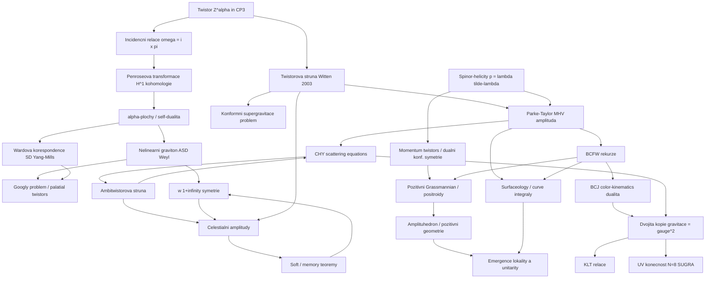

# Twistory a teorie amplitud (Twistor Theory & the Amplitudes Program)

> **TL;DR** — Twistorová teorie (Penrose, 1967) překódovává geometrii prostoročasu do komplexní geometrie *twistorového prostoru* $\mathbb{PT} = \mathbb{CP}^3$, kde body prostoročasu odpovídají přímkám a kde se bezhmotná pole popisují holomorfní kohomologií. Z této tradice a paralelního *programu amplitud* (spinor-helicity, BCFW rekurze, on-shell metody) vyrostl pohled, podle něhož jsou kauzalita, lokalita a unitarita prostoročasu *odvozené* vlastnosti hlubších matematických struktur — twistorového strunového modelu (Witten 2003), amplituhedronu a pozitivních geometrií (Arkani-Hamed–Trnka 2013), dvojité kopie (BCJ: *gravitace = (kalibrační teorie)²*) a celestiálních amplitud s nekonečnědimenzionální symetrií $w_{1+\infty}$. Self-duální sektor gravitace a Yang–Millsovy teorie je *přesně integrabilní* a twistorově plně uchopený; plný (non-self-duální) sektor zůstává otevřeným „googly" problémem. Tento pilíř je primárně perturbativní a v plochém prostoru, ale jeho struktury — emergence prostoročasu, kosmologické polytopy, vztah k AdS/CFT a self-dualitě v Ashtekarových proměnných — tvoří husté mosty k ostatním přístupům ke kvantové gravitaci.

---

## Přehled a historický kontext

Twistorová teorie vznikla v roce 1967, kdy Roger Penrose publikoval „Twistor Algebra" ([Penrose 1967](https://pubs.aip.org/aip/jmp/article/8/2/345/233824/Twistor-Algebra), *J. Math. Phys.* **8**, 345). Motivací bylo nahradit *bod* prostoročasu (lokální, spojitý objekt) *světelným paprskem* / nulovou přímkou jako fundamentálním elementem — twistor kóduje současně směr i polohu (moment) nulové přímky čtyřmi komplexními složkami. Hlubším programem bylo sjednotit kvantovou mechaniku (komplexní čísla, holomorfie) a obecnou relativitu (kauzální/konformní struktura) v jednom komplexně-geometrickém rámci, kde komplexní struktura $\mathbb{CP}^1$ Riemannovy sféry světelných směrů je totožná se sférou stavů spinu (*Riemannova sféra = sféra spinu*).

Twistorová teorie je výjimečně účinná **právě ve čtyřech dimenzích** kvůli souhře tří izomorfismů ([Atiyah, Dunajski & Mason 2017](https://arxiv.org/abs/1704.07464), „Twistor theory at fifty"): (1) Hodgeova dekompozice 2-forem na self-duální a anti-self-duální část, závisející jen na konformní třídě metriky; (2) rozklad komplexifikovaného tečného bandlu $T_{\mathbb{C}}M \cong \mathbb{S}\otimes\mathbb{S}'$ na spinorové bandly; (3) izomorfismus $SO(4,\mathbb{C})\cong (SL(2,\mathbb{C})\times \widetilde{SL}(2,\mathbb{C}))/\mathbb{Z}_2$.

Klíčové milníky: **Penroseova transformace** (holomorfní kohomologie ↔ bezhmotná pole), **nelineární graviton** ([Penrose 1976](https://link.springer.com/article/10.1007/BF00763433)) překódovávající anti-self-duální (ASD) Einsteinovy metriky do deformací komplexní struktury twistorového prostoru, a **Wardova konstrukce** (1977) pro self-duální Yang–Millsovo pole.

Paralelně vznikl od 80. let *program amplitud*: [Parkeova–Taylorova formule](https://en.wikipedia.org/wiki/MHV_amplitudes) (1986) pro MHV amplitudy gluonů a její twistorové vysvětlení ([Nair 1988](https://www.sciencedirect.com/science/article/abs/pii/0370269388914427), proud-algebraický popis MHV jako stavů na supertwistorovém prostoru). Oba proudy se dramaticky spojily v roce 2003, kdy [Witten](https://arxiv.org/abs/hep-th/0312171) ukázal, že perturbativní $\mathcal{N}=4$ super-Yang–Millsova teorie (SYM) je duální topologickému B-modelu strun na super-Calabi–Yauově prostoru $\mathbb{CP}^{3|4}$ — *twistorová strunová teorie*. Následovaly BCFW rekurze (2005), Grassmannova/pozitivní-Grassmannova formulace (2012), amplituhedron (2013), ambitwistorové struny a CHY formule (2013–2014), dvojitá kopie (BCJ 2008–2010), celestiální holografie a $w_{1+\infty}$ (Strominger 2021), a „surfaceology"/curve-integrály (Arkani-Hamed et al. 2023–2025).

---

## Klíčové koncepty

- **Twistor (twistor)** — element $Z^\alpha=(\omega^A,\pi_{A'})\in\mathbb{C}^4$, fundamentální reprezentace konformní grupy $SU(2,2)$. Projektivní twistorový prostor $\mathbb{PT}=\mathbb{CP}^3$ (resp. otevřená podmnožina $\mathbb{PT}^+$ pro pozitivní helicitu). Twistor s $Z^\alpha\bar Z_\alpha=0$ kóduje nulovou přímku v Minkowského prostoru.

- **Incidenční relace (incidence relation)** — bod $x^{AA'}$ prostoročasu odpovídá projektivní přímce $\mathbb{CP}^1\subset\mathbb{PT}$; vztah $\omega^A = i\,x^{AA'}\pi_{A'}$. Body prostoročasu ↔ přímky $\mathbb{CP}^1$; body twistorového prostoru ↔ self-duální nulové 2-roviny (α-roviny).

- **α-roviny / α-plochy (alpha-surfaces)** — totálně nulové self-duální 2-roviny; jejich existence jako 3-parametrické rodiny je ekvivalentní anti-self-dualitě Weylova tenzoru (Penroseova věta o nelineárním gravitonu).

- **Penroseova transformace (Penrose transform)** — izomorfismus mezi snopovou kohomologií na $\mathbb{PT}$ a řešeními bezhmotných polních rovnic helicity $h$: $H^1(\mathbb{PT},\mathcal{O}(-2h-2))\cong\{$řešení rovnice helicity $h\}$.

- **Nelineární graviton (nonlinear graviton)** — Penroseova konstrukce kódující ASD vakuové Einsteinovy metriky do deformací komplexní struktury (vyšší poloviny) twistorového prostoru. Self-duální sektor je integrabilní.

- **Wardova konstrukce (Ward correspondence)** — 1:1 mezi self-duálními Yang–Millsovými řešeními a holomorfními vektorovými bandly nad $\mathbb{PT}$, triviálními na každé přímce $\mathbb{CP}^1$.

- **Googly problém (googly problem)** — neřešený ~40 let: twistorový popis *pravotočivých* (positive-helicity), interagujících bezhmotných polí stejnými konvencemi, jakými ASD konstrukce popisuje levotočivá. Penroseův návrh řešení: *palatial twistor theory* (nekomutativní kvantovaná „Heisenbergova algebra" twistorů).

- **Spinor-helicity formalismus (spinor-helicity)** — bezhmotný impuls jako $p_{A\dot A}=\lambda_A\tilde\lambda_{\dot A}$ (rozklad na součin holomorfního a antiholomorfního spinoru); invarianty $\langle ij\rangle=\epsilon_{AB}\lambda_i^A\lambda_j^B$, $[ij]=\epsilon_{\dot A\dot B}\tilde\lambda_i^{\dot A}\tilde\lambda_j^{\dot B}$.

- **MHV amplituda (maximally helicity violating)** — amplituda s $n-2$ gluony jedné helicity a 2 opačné; Parkeova–Taylorova formule. Holomorfie MHV v twistorovém prostoru (lokalizace na přímky) byla Wittenovým výchozím pozorováním.

- **BCFW rekurze (BCFW recursion)** — konstrukce vyšších stromových (tree-level) amplitud z nižších on-shell stavebních bloků pomocí komplexního posunu impulsů $\lambda$/$\tilde\lambda$ a Cauchyho věty; obchází Feynmanovy diagramy.

- **Momentum twistors (momentum twistors)** — Hodgesovy proměnné činící *duální konformní symetrii* planárního $\mathcal{N}=4$ SYM manifestní; eliminují omezení zachování impulsu.

- **Pozitivní Grassmannian (positive Grassmannian)** — $G_+(k,n)$; on-shell diagramy/positroidy parametrizují integrand všech řádů smyček planárního $\mathcal{N}=4$ SYM.

- **Amplituhedron (amplituhedron)** — pozitivní geometrie, jejíž kanonická forma dává integrand planárních $\mathcal{N}=4$ SYM amplitud; lokalita a unitarita *emergují* z pozitivity.

- **Dvojitá kopie / BCJ dualita (double copy, color-kinematics duality)** — *gravitace = (kalibrační teorie)²*; když barevné faktory splňují Jacobiho identitu, kinematické čitatele lze zvolit tak, aby ji splňovaly také, a gravitační amplituda vznikne náhradou barevného faktoru druhou kopií kinematického čitatele. Bezhmotná verze KLT relací.

- **CHY formule / ambitwistorová struna (scattering equations, ambitwistor string)** — amplitudy bezhmotných částic jako integrál přes moduli sféry lokalizovaný na *scattering equations*; geometricky holomorfní mapy do ambitwistorového prostoru (prostoru komplexních nulových geodetik).

- **Celestiální amplitudy a $w_{1+\infty}$ (celestial amplitudes)** — amplitudy v asymptoticky plochém prostoru přepsané jako korelátory 2D CFT na nebeské sféře; nekonečná věž měkkých (soft) teorémů gravitonů se organizuje do algebry $w_{1+\infty}$, jež je přirozenou symetrií twistorového prostoru.

---

## Matematický rámec

### Incidenční relace

$$\omega^A = i\,x^{AA'}\,\pi_{A'},\qquad Z^\alpha=(\omega^A,\pi_{A'})\in\mathbb{C}^4$$

Symboly: $Z^\alpha$ je twistor (4 komplexní složky), rozložený na dvojici 2-spinorů $\omega^A$ (typu „polohového") a $\pi_{A'}$ (typu „směrového"); $x^{AA'}$ je bod komplexifikovaného Minkowského prostoru zapsaný jako $2\times2$ matice (spinorové indexy $A,A'=0,1$); $i$ je imaginární jednotka. **Význam:** pevné $x$ dává lineární vztah mezi $\omega$ a $\pi$ — tj. přímku $\mathbb{CP}^1$ v projektivním $\mathbb{PT}$. Pevný twistor $Z$ naopak vymezuje v prostoročasu α-rovinu. Toto je jádro twistorové korespondence: **body ↔ přímky**.

### Penroseova transformace

$$\phi_{A'_1\cdots A'_{2h}}(x) = \oint_{\Gamma\subset\mathbb{CP}^1} \pi_{A'_1}\cdots\pi_{A'_{2h}}\, f(\omega^A,\pi_{A'})\big|_{\omega=ix\pi}\;\pi_{B'}d\pi^{B'}$$

a kohomologická formulace pro helicitu $h$:

$$\{\text{řešení rovnice helicity } h\}\;\cong\;H^1\!\big(\mathbb{PT},\,\mathcal{O}(-2h-2)\big)$$

Symboly: $\phi_{A'_1\cdots A'_{2h}}$ je pole helicity $h$ (symetrický spinor), $f$ je homogenní holomorfní funkce na twistorovém prostoru (reprezentující kohomologickou třídu), $\Gamma$ je kontura na sféře přímky $x$, $\mathcal{O}(k)$ je svazek holomorfních funkcí homogenity $k$. **Význam:** řešení (v principu komplikovaných) bezhmotných polních rovnic se převádějí na *volnou* holomorfní data na $\mathbb{PT}$. Speciálně pro skalár ($h=0$): $\square\phi=0\Leftrightarrow$ třída v $H^1(\mathbb{PT},\mathcal{O}(-2))$. Linearizace nelineárního gravitonu odpovídá $h=2$, $\mathcal{O}(-6)$.

### Věta o nelineárním gravitonu (anti-self-dualita)

$$C_{abcd} = -\tfrac{1}{2}\,\epsilon_{ab}{}^{pq}\,C_{cdpq}$$

Symboly: $C_{abcd}$ je Weylův (konformní) tenzor křivosti, $\epsilon_{ab}{}^{pq}$ je Levi-Civitův tenzor. **Význam:** 3-parametrická rodina α-ploch existuje právě tehdy, je-li Weylův tenzor anti-self-duální. ASD konformní křivost se kompletně kóduje do twistorové kohomologie (deformací komplexní struktury $\mathbb{PT}$) — to je „integrabilní polovina" Einsteinových rovnic. Plný (non-ASD) tenzor není integrabilní → googly problém.

### Spinor-helicity a Parkeova–Taylorova formule

$$p_{A\dot A}=\lambda_A\tilde\lambda_{\dot A},\qquad \langle ij\rangle=\epsilon_{AB}\lambda_i^A\lambda_j^B,\qquad [ij]=\epsilon_{\dot A\dot B}\tilde\lambda_i^{\dot A}\tilde\lambda_j^{\dot B},\qquad \langle ij\rangle[ji]=2\,p_i\!\cdot\! p_j=s_{ij}$$

$$A_n^{\text{MHV}}(1^+,\dots,i^-,\dots,j^-,\dots,n^+) = \frac{\langle ij\rangle^4}{\langle 12\rangle\langle 23\rangle\cdots\langle n1\rangle}$$

Symboly: $\lambda,\tilde\lambda$ jsou helicitní spinory rozkládající bezhmotný impuls $p$; $\langle\cdot\rangle$, $[\cdot]$ jsou Lorentzovsky invariantní hranoly; $s_{ij}$ Mandelstamova proměnná; $i,j$ jsou dva gluony záporné helicity, ostatní jsou kladné. **Význam:** $n$-bodová amplituda, jejíž Feynmanovský výpočet zahrnuje exponenciálně mnoho diagramů, je *jeden* zlomek. Jednoduchost je odrazem holomorfie (lokalizace na přímku v twistorovém prostoru) — Wittenovo zakládající pozorování.

### BCFW rekurze

$$A_n = \sum_{\text{rozdělení } I} \sum_{h} A_L(z_I)\,\frac{1}{P_I^2}\,A_R(z_I),\qquad \hat\lambda_i=\lambda_i,\ \hat{\tilde\lambda}_i=\tilde\lambda_i+z\tilde\lambda_j,\ \hat\lambda_j=\lambda_j-z\lambda_i$$

Symboly: amplitudu posuneme komplexním parametrem $z$ (deformace páru spinorů $i,j$), $A_L,A_R$ jsou on-shell subamplitudy na pólu $z_I$ daném $\hat P_I^2(z_I)=0$, $h$ probíhá přes helicity vnitřní částice. **Význam:** Cauchyho věta vyjadřuje plnou amplitudu jen přes rezidua na faktorizačních pólech — tj. přes nižší on-shell amplitudy. Funguje, pokud $A_n(z)\to0$ pro $z\to\infty$ (splněno pro YM i gravitaci při vhodné volbě posunu).

### KLT relace a dvojitá kopie

$$M_n^{\text{grav}} = \sum_{\sigma,\tau} A_n(\sigma)\,S[\sigma|\tau]\,\tilde A_n(\tau),\qquad M^{\text{grav}}=\sum_{\text{trivalentní }i}\frac{n_i\,\tilde n_i}{D_i}$$

Symboly: $A_n,\tilde A_n$ jsou barevně-uspořádané (color-ordered) amplitudy dvou kalibračních teorií, $S[\sigma|\tau]$ je KLT „momentum kernel", $\sigma,\tau$ permutace; v BCJ formě jsou $n_i$ kinematické čitatele splňující stejnou Jacobiho identitu jako barevné faktory $c_i$, $D_i$ jsou propagátory. **Význam:** gravitační amplituda = „čtverec" kalibrační. Náhrada $c_i\to \tilde n_i$ přepíná $\text{(kalibrační)}\to\text{(gravitační)}$. Platí na stromové úrovni a (ověřeně do více smyček, konjekturálně obecně) i ve smyčkách.

### CHY scattering equations

$$\sum_{j\neq i}\frac{p_i\!\cdot\! p_j}{\sigma_i-\sigma_j}=0\quad(i=1,\dots,n),\qquad A_n=\int \frac{d^n\sigma}{\text{vol}\,SL(2,\mathbb{C})}\;\prod_i{}'\delta\!\Big(\sum_{j\neq i}\tfrac{p_i\cdot p_j}{\sigma_{ij}}\Big)\,\mathcal{I}_n$$

Symboly: $\sigma_i\in\mathbb{CP}^1$ jsou polohy bodů na Riemannově sféře, $p_i$ impulsy, $\mathcal{I}_n$ je integrand (Parke–Taylor pro YM, kvadrát pro gravitaci, Pfaffian $\text{Pf}'\Psi$), čárka značí faktorizaci kvůli Möbiově invarianci. **Význam:** stromová $S$-matice bezhmotných částic v *libovolné dimenzi* jako integrál přes moduli sféry lokalizovaný na $(n-3)!$ řešení scattering equations. Sjednocuje YM, gravitaci a skalár; přirozeně vzniká z kvantování ambitwistorové struny.

### Kanonická forma amplituhedronu

$$\mathcal{A}_{n,k,L} \subset Gr(k,k+4;L),\qquad \text{integrand} = \Omega(\mathcal{A}_{n,k,L})$$

Symboly: $\mathcal{A}_{n,k,L}$ je amplituhedron pro $n$ částic, helicitní stupeň $k$ (N$^k$MHV) a $L$ smyček, žijící v (zobecněném) Grassmannianu; $\Omega$ je jeho kanonická diferenciální forma s logaritmickými póly *jen* na hranicích geometrie. **Význam:** integrand planárního $\mathcal{N}=4$ SYM = kanonická forma pozitivní geometrie. Lokalita (póly = faktorizace) a unitarita (rezidua = produkty) jsou geometrické důsledky pozitivity, nikoli axiomy.

### $w_{1+\infty}$ algebra na nebeské sféře

$$\big[w^p_m,\,w^q_n\big]=\big[m(q-1)-n(p-1)\big]\,w^{p+q-2}_{m+n}$$

Symboly: $w^p_m$ jsou generátory wedge subalgebry $w_{1+\infty}$ vzniklé Mellinovou/měkkou expanzí konformně měkkých (conformally soft) gravitonů; $p$ souvisí s konformní vahou, $m,n$ jsou módy na nebeské sféře. **Význam:** nekonečná věž stromových měkkých teorémů gravitonů (Weinberg, sub-, sub-sub-…) se organizuje do jediné chirální $w_{1+\infty}$ symetrie. Tato algebra je *přirozenou holomorfní symetrií twistorového prostoru* (Poissonovy difeomorfismy roviny) — most mezi celestiální a twistorovou stránkou self-duální gravitace.

---

## Klíčové výsledky a milníky

- **1967 — Twistorová algebra.** Penrose zavádí twistory jako fundamentální geometrii konformně kovariantního Minkowského prostoru ([Penrose 1967](https://pubs.aip.org/aip/jmp/article/8/2/345/233824/Twistor-Algebra)).

- **1969–1972 — Penroseova transformace.** Kontuúrní integrály $H^1$ tříd dávají řešení bezhmotných polních rovnic libovolné helicity; konformní invariance manifestní.

- **1976 — Nelineární graviton.** Penrose ukazuje, že ASD vakuové Einsteinovy metriky ↔ deformace komplexní struktury twistorového prostoru; self-duální gravitace je integrabilní ([Penrose 1976](https://link.springer.com/article/10.1007/BF00763433)).

- **1977 — Wardova korespondence.** Self-duální YM ↔ holomorfní bandly nad $\mathbb{PT}$ (twistorový zdroj integrability instantonů, monopólů, solitonů).

- **1986 — Parkeova–Taylorova formule.** Konjektura jednořádkové MHV $n$-gluonové amplitudy, později dokázána Berendsem–Gielem ([MHV amplitudes](https://en.wikipedia.org/wiki/MHV_amplitudes)).

- **1988 — Nairova proud-algebra.** MHV amplitudy $\mathcal{N}=4$ SYM jako korelátory na supertwistorovém prostoru — předzvěst twistorové struny ([Nair 1988](https://www.sciencedirect.com/science/article/abs/pii/0370269388914427)).

- **2003 — Twistorová strunová teorie.** [Witten](https://arxiv.org/abs/hep-th/0312171) dokazuje, že perturbativní $\mathcal{N}=4$ SYM = D-instantonová expanze B-modelu na $\mathbb{CP}^{3|4}$; amplitudy lokalizovány na holomorfní křivky v twistorovém prostoru.

- **2004 — Problém konformní supergravitace.** [Berkovits & Witten](https://arxiv.org/abs/hep-th/0406051) ukazují, že twistorová struna obsahuje *konformní supergravitaci*, jež se nedekupluje od YM ve smyčkách — fundamentální překážka.

- **2004 — CSW pravidla.** Cachazo–Svrček–Witten: MHV amplitudy jako efektivní vrcholy pro vyšší amplitudy ([hep-th/0403047](https://arxiv.org/abs/hep-th/0403047)).

- **2005 — BCFW rekurze.** [Britto, Cachazo, Feng & Witten](https://arxiv.org/abs/hep-th/0501052) dávají přímý důkaz stromové rekurze; revoluce ve výpočtu amplitud bez Feynmanových diagramů.

- **2008 — BCJ dualita.** [Bern, Carrasco & Johansson](https://arxiv.org/abs/0805.3993) formulují color-kinematics dualitu: kinematické čitatele splňují Jacobiho identity. „New relations for gauge-theory amplitudes."

- **2009 — Momentum twistors a duální konformní symetrie.** [Mason & Skinner](https://arxiv.org/abs/0909.0250), Hodges; manifestace skryté duální superkonformní symetrie planárního $\mathcal{N}=4$ SYM.

- **2010 — Perturbativní gravitace jako dvojitá kopie.** [Bern, Carrasco & Johansson](https://arxiv.org/abs/1004.0476) rozšiřují dvojitou kopii na smyčky.

- **2012 — Pozitivní Grassmannian.** [Arkani-Hamed et al.](https://arxiv.org/abs/1212.5605) reprezentují celosmyčkový integrand $\mathcal{N}=4$ SYM pomocí on-shell diagramů a positroidů.

- **2013 — Amplituhedron.** [Arkani-Hamed & Trnka](https://arxiv.org/abs/1312.2007) zavádějí geometrický objekt, jehož kanonická forma dává planární amplitudy; lokalita a unitarita emergují z pozitivity.

- **2013–2014 — CHY a ambitwistorové struny.** [Cachazo, He & Yuan](https://arxiv.org/abs/1307.2199); [Mason & Skinner](https://arxiv.org/abs/1311.2564) odvozují CHY formule z kvantování ambitwistorové struny.

- **2021 — $w_{1+\infty}$ a nebeská sféra.** [Strominger](https://arxiv.org/abs/2105.14346) ukazuje, že věž měkkých gravitonových symetrií = wedge algebra $w_{1+\infty}$; *Phys. Rev. Lett.*

- **2021 — $w_{1+\infty}$ z twistorového prostoru.** [Adamo, Mason & Sharma](https://arxiv.org/abs/2110.06066) ukazují, že celestiální $w_{1+\infty}$ je přirozená geometrická symetrie twistorového prostoru / twistorových sigma modelů.

- **2023–2025 — Surfaceology / curve integrály.** Arkani-Hamed, Frost, Salvatori a spol. ([All loop scattering for all multiplicity](https://arxiv.org/abs/2311.09284)), s navazujícími pracemi dalších skupin (De, Pokraka, Skowronek, Spradlin, Volovich pro [Surfaceology for colored Yukawa](https://arxiv.org/abs/2406.04411)): všesmyčkové, všemultiplicitní integrandy barevných teorií jako tropikalizované „global Schwinger" integrály přes plochy.

**Kvantitativní výsledky UV chování gravitace:** $\mathcal{N}=8$ supergravitace je v $D=4$ UV-konečná do **4 smyček** včetně (čtyř-gravitonová amplituda), což je překvapivě stejné chování jako konečná $\mathcal{N}=4$ SYM; očekává se logaritmická divergence až na **7 smyčkách** s counterterm $\partial^8 R^4$ ([Bern–Dixon–Roiban 2006](https://arxiv.org/abs/hep-th/0611086)). Analogické „enhanced cancellations" byly explicitně ověřeny i v $\mathcal{N}=5$ supergravitaci na 4 smyčkách ([Bern et al. 2014, arXiv:1409.3089](https://arxiv.org/abs/1409.3089) — $\mathcal{N}=5$). Tyto výsledky byly objeveny právě moderními amplitudovými/dvojitě-kopírovacími metodami a nelze je vysvětlit standardní supersymetrií ani $E_{7(7)}$ symetrií samotnou.

---

## Současný stav (2024–2026)

Pole je dnes velmi aktivní a rozprostírá se do několika front:

1. **Surfaceology a curve-integrály.** Arkani-Hamed a Figueiredo rozvíjejí „povrchologii" — amplitudy barevných (colored) teorií (skaláry $\text{Tr}\,\phi^3$, Yukawa, později YM) jako integrály přes kombinatoriku ploch dekorovaných kinematickými daty. Klíčový výsledek 2023–2025: *kompaktní vzorec pro všesmyčkový, všegenusový, všemultiplicitní integrand*, kde se závislost na počtu částic $n$ a řádu smyček $L$ efektivně „odpojí" ([All loop scattering for all multiplicity](https://arxiv.org/abs/2311.09284), Arkani-Hamed, Frost, Salvatori, Plamondon, Thomas, JHEP 09 (2025) 033; navazující [Surfaceology for colored Yukawa theory](https://arxiv.org/abs/2406.04411), De et al., JHEP 09 (2024) 160). Objevují se „hidden zeros" amplitud, z nichž emerguje unitarita a lokalita i na jedné smyčce ([2503.03805](https://arxiv.org/abs/2503.03805)).

2. **Celestiální holografie z twistorů.** Aktivně se zkoumá, že celestiální symetrie ($w_{1+\infty}$, $Lw_{1+\infty}$) jsou přesně geometrické symetrie twistorového prostoru. Studuje se $w_{1+\infty}$ *s kosmologickou konstantou* ([2312.00876](https://arxiv.org/abs/2312.00876), PRL 2024), celestiální chirální algebry a self-duální gravitace ([2507.00772](https://arxiv.org/abs/2507.00772)), infračervené struktury rozptylu na self-duálních radiačních pozadích ([2309.01810](https://arxiv.org/abs/2309.01810)). Simons Collaboration on Celestial Holography (vedená Stromingerem) je organizační páteří.

3. **Dvojitá kopie pro gravitační vlny a klasickou gravitaci.** Klasická dvojitá kopie (Kerr–Schild, Weyl) se aplikuje na binární srážky černých děr a generování waveforms pro LIGO/Virgo/LISA (PM/PN expanze). Rozšiřuje se do bigravitace, multigravitace, časově závislých a trapped Kerr–Schild interiérů ([2602.16905](https://arxiv.org/abs/2602.16905); [Taub-NUT, PRD 111, L021703](https://journals.aps.org/prd/abstract/10.1103/PhysRevD.111.L021703)).

4. **Amplituhedron, cluster algebry, pozitivní geometrie.** Dokázána *BCFW tiling* konjektura (každá BCFW rekurze = triangulace amplituhedronu) pomocí cluster algeber a positroidů ([BCFW tilings, PNAS 2025](https://www.pnas.org/doi/10.1073/pnas.2408572122); [2310.17727](https://arxiv.org/abs/2310.17727)). Paradigma „pozitivních geometrií" se rozšiřuje na *kosmologické polytopy* (Bunch–Davies vlnová funkce), associahedra a kinematic flow pro kosmologické korelátory.

5. **Twistorová akce a non-self-duální sektor.** Twistorová akce pro plnou obecnou relativitu ([2104.07031](https://arxiv.org/abs/2104.07031)) a pro vyšší-spinová self-duální YM/gravitaci ([2210.06209](https://arxiv.org/abs/2210.06209)) jsou předmětem aktivního výzkumu; dvojitá kopie self-duální YM → self-duální gravitace přímo na twistorovém prostoru ([2307.10383](https://arxiv.org/abs/2307.10383)).

6. **Anomálie integrability.** Self-duální YM a gravitace mají na jedné smyčce „integrability anomaly", interpretovanou jako kvantové nezachování věže proudů ([2312.13267](https://arxiv.org/abs/2312.13267)) — propojuje twistorovou stránku s celestiálními algebrami.

---

## Otevřené problémy

1. **Googly problém (twistorový popis pravotočivých polí).** Najít twistorovou konstrukci pro *positive-helicity* (non-ASD) interagující bezhmotná pole stejnými konvencemi jako ASD nelineární graviton/Ward. *Proč je to těžké:* plné Einsteinovy a Yang–Millsovy rovnice **nejsou integrabilní**, takže neexistuje analogická holomorfní data-struktura; deformace komplexní struktury kódují jen ASD polovinu. *Pokusy:* Penroseova *palatial twistor theory* (nekomutativní kvantovaná twistorová algebra, [Penrose 2015](https://royalsocietypublishing.org/doi/10.1098/rsta.2014.0237)); twistorové akce s perturbativní expanzí kolem self-duálního sektoru.

2. **Neperturbativní definice twistorové/ambitwistorové struny.** Twistorové struny dávají perturbativní amplitudy, ale postrádají neperturbativní (background-independent) formulaci. *Proč těžké:* model je chirální/topologický, target je super-Calabi–Yau bez standardní worldsheet dynamiky; problém konformní supergravitace ([Berkovits–Witten 2004](https://arxiv.org/abs/hep-th/0406051)) brání čistě YM/gravitační interpretaci ve smyčkách.

3. **Smyčková úroveň amplituhedronu a non-planární sektor.** Amplituhedron dává *integrand* planárního $\mathcal{N}=4$ SYM; zbývá kanonicky provést integraci (transcendentální funkce, symboly) a najít geometrii pro **non-planární** amplitudy a pro teorie s méně supersymetrie / reálnou QCD. *Proč těžké:* mimo planární limitu chybí cyklické uspořádání a pojem pozitivity; integrace zavádí IR divergence mimo geometrii.

4. **Geometrizace gravitačních amplitud (gravituhedron).** Existuje pozitivní geometrie pro *gravitační* (nikoli jen YM) amplitudy? *Proč těžké:* gravitace nemá barevné uspořádání ani jednoduchou cyklickou strukturu; dvojitá kopie je algebraická, ne (zatím) geometrická.

5. **UV osud $\mathcal{N}=8$ supergravitace.** Diverguje čtyř-gravitonová amplituda na 7 smyčkách v $D=4$ (counterterm $\partial^8R^4$), nebo zasáhne další „enhanced cancellation"? *Proč těžké:* 7-smyčkový výpočet je výpočetně extrémní; teoretické argumenty ($E_{7(7)}$, light-cone superprostor) nedávají jednoznačnou predikci. Otázka, zda existuje *perturbativně konečná* teorie kvantové gravitace (bez strun), zůstává otevřená.

6. **Plná celestiální CFT (holografický duál ploché gravitace).** $w_{1+\infty}$ a BMS symetrie silně omezují, ale úplná 2D CFT na nebeské sféře, jejíž korelátory reprodukují $\mathcal{S}$-matici 4D kvantové gravitace, není zkonstruována. *Proč těžké:* celestiální korelátory mají distribučně-singulární kinematiku; chybí kontrola nad masivními stavy, smyčkami a non-self-duálním sektorem; vztah k $w_{1+\infty}$ je zatím hlavně stromový/self-duální.

7. **Emergence prostoročasu z amplitud.** Pokud lokalita a unitarita emergují z pozitivních geometrií, jaká je *fundamentální* formulace, z níž prostoročas vzniká? *Proč těžké:* amplituhedron je definován kinematicky (vyžaduje impuls = vnější data prostoročasu); skutečně background-independent „kombinatorická" definice fyziky bez prostoročasu zatím chybí.

8. **Vyšší dimenze a masivní stavy.** Twistorová magie je vázána na 4D (tři izomorfismy); rozšíření do $D>4$ (hypertwistory, ambitwistory) a systematické zahrnutí masivních polí (a tudíž Standardního modelu) zůstává neúplné. *Proč těžké:* $SO(D)$ obecně nefaktorizuje na chirální poloviny; masivní spinor-helicity ([Arkani-Hamed–Huang–Huang 2017](https://arxiv.org/abs/1709.04891)) existuje, ale twistorová geometrie je méně rigidní.

---

## Vztahy k ostatním přístupům

### Strunová teorie (string-theory) — **dobře prozkoumáno**
Twistorová a ambitwistorová struna *jsou* strunové teorie (chirální, infinite-tension limit); KLT relace pochází z uzavřené struny jako kvadrátu otevřené. Dvojitá kopie je „field-theory" stínem strunové faktorizace. AdS/CFT a $\mathcal{N}=4$ SYM amplitudy jsou společným územím obou. Problém konformní supergravitace v twistorové struně je přímo strunový jev. Most je velmi hustý a oboustranně využívaný.

### Holografie a AdS/CFT (holography-adscft) — **dobře / částečně**
Planární $\mathcal{N}=4$ SYM (boundary AdS$_5$/CFT$_4$) je hlavní laboratoří amplitudového programu (duální konformní symetrie, Wilsonovy smyčky = amplitudy, integrabilita). *Celestiální* holografie je naopak pokus o *plochou* holografii (codim-2 nebeská sféra), strukturně odlišnou od AdS/CFT. Vztah celestiální CFT ↔ standardní AdS/CFT (přes flat-space limit) je aktivně, ale jen částečně prozkoumán.

### Supergravitace a UV chování (supergravity-uv) — **dobře prozkoumáno**
Dvojitá kopie a unitaritní/on-shell metody jsou *primárním nástrojem* pro výpočet UV divergencí supergravitace ($\mathcal{N}=8$ do 4 smyček konečná, $\partial^8R^4$ na 7 smyčkách). Tento pilíř a supergravitační UV program sdílejí výpočetní jádro; rozdíl je v důrazu (struktura vs. fenomenologie divergencí).

### Entanglement a prostoročas (entanglement-spacetime) — **sotva prozkoumáno**
Amplitudový pohled „lokalita emerguje z pozitivity" a entanglementový pohled „prostoročas = entanglement" (ER=EPR, tensor networks) jsou *dva nezávislé* návrhy emergence prostoročasu, které spolu téměř nekomunikují. Konjekturální most: pozitivní geometrie (amplituhedron) vs. pozitivita modular Hamiltonianu / entropie. Téměř neprobádané — *zlatý důl pro hledání nových spojů*.

### Asymptotická bezpečnost (asymptotic-safety) — **sotva prozkoumáno**
Oba se zabývají UV chováním gravitace, ale opačnými metodami: asymptotic safety hledá interagující UV fixní bod v efektivní akci (off-shell, euklidovsky), zatímco amplitudy zkoumají on-shell konečnost konkrétních teorií. Žádný systematický most; otevřená otázka, zda „enhanced cancellations" $\mathcal{N}=8$ mají interpretaci ve fixním bodě.

### Smyčková kvantová gravitace (loop-quantum-gravity) — **sotva prozkoumáno**
Sdílená matematika: spinory, self-dualita, **Ashtekarovy proměnné** (self-duální spojení). Existuje práce odvozující nelineární gravitony z initial-value constraints v Ashtekarových proměnných ([0706.2702](https://arxiv.org/pdf/0706.2702)). Penroseovy α-plochy a self-duální sektor jsou společné s LQG self-duální formulací, ale propojení twistorové kohomologie se spinovými sítěmi / spin-foam amplitudami je téměř neprobádané — potenciálně plodný most.

### Nekomutativní geometrie (noncommutative-geometry) — **částečně**
Penroseova *palatial twistor theory* zavádí nekomutativní holomorfní kvantovanou twistorovou algebru (Heisenbergova algebra twistorů); kvantování twistorového prostoru cocycle-twistem ([math/0701893](https://arxiv.org/pdf/math/0701893)). Sdílí ideu „fuzzy" prostoročasu, ale formalismy (Connesova spektrální trojice vs. twistorová deformace) se zatím nesetkaly.

### Emergentní gravitace (emergent-gravity) — **částečně**
Klíčová sdílená teze: prostoročasová lokalita/kauzalita jsou *odvozené*, nikoli fundamentální (amplituhedron, surfaceology). Liší se mechanismus (geometrická pozitivita vs. termodynamika/entropická síla). Konceptuální překryv silný, technický most slabý.

### Černé díry a informace (black-holes-information) — **částečně**
Amplitudy a dvojitá kopie počítají klasické černoděrové waveforms (binární inspiraly) a Kerrova řešení (Kerr = $\sqrt{\text{Kerr}}$ v dvojité kopii). Celestiální holografie cílí na $\mathcal{S}$-matici plochého prostoru včetně černoděrového rozptylu. Vztah k informačnímu paradoxu a Pageově křivce je nepřímý a slabě prozkoumaný.

### Semiklasická gravitace (semiclassical-gravity) — **sotva prozkoumáno**
Self-duální/ASD štěpení křivosti a měkké teorémy mají semiklasický (paměťový, memory-effect) protějšek; Stromingerova trojice soft-teorém ↔ memory ↔ asymptotická symetrie tvoří most, ale jeho twistorová strana je nově otevíraná.

### Kosmologie a Swampland (quantum-cosmology, swampland) — **sotva prozkoumáno**
Pozitivní geometrie se rozšiřuje na *kosmologické korelátory* (kosmologické polytopy, kinematic flow, Bunch–Davies vlnová funkce) — nový most k rané kosmologii. Vztah pozitivity/lokality amplitud k swampland positivity bounds (na EFT koeficienty) je rozpracován jen částečně.

---

## Mapa konceptů

---

## Reference

1. Penrose, R. (1967). *Twistor Algebra.* J. Math. Phys. **8**, 345. DOI: [10.1063/1.1705200](https://pubs.aip.org/aip/jmp/article/8/2/345/233824/Twistor-Algebra). — Zakládající práce twistorové teorie; twistory jako fundamentální geometrie konformního Minkowského prostoru.

2. Penrose, R. (1976). *Nonlinear gravitons and curved twistor theory.* Gen. Rel. Grav. **7**, 31–52. DOI: [10.1007/BF00763433](https://link.springer.com/article/10.1007/BF00763433). — Nelineární graviton: ASD Einsteinovy metriky ↔ deformace komplexní struktury twistorového prostoru.

3. Ward, R. S. (1977). *On self-dual gauge fields.* Phys. Lett. A **61**, 81. DOI: [10.1016/0375-9601(77)90842-8](https://doi.org/10.1016/0375-9601(77)90842-8). — Wardova korespondence: self-duální YM ↔ holomorfní bandly nad $\mathbb{PT}$.

4. Parke, S. J. & Taylor, T. R. (1986). *Amplitude for n-gluon scattering.* Phys. Rev. Lett. **56**, 2459. DOI: [10.1103/PhysRevLett.56.2459](https://doi.org/10.1103/PhysRevLett.56.2459). — Parkeova–Taylorova MHV formule. (Přehled: [MHV amplitudes](https://en.wikipedia.org/wiki/MHV_amplitudes).)

5. Nair, V. P. (1988). *A current algebra for some gauge theory amplitudes.* Phys. Lett. B **214**, 215. DOI: [10.1016/0370-2693(88)91471-2](https://www.sciencedirect.com/science/article/abs/pii/0370269388914427). — MHV amplitudy jako korelátory na supertwistorovém prostoru; předzvěst twistorové struny.

6. Witten, E. (2003). *Perturbative Gauge Theory As A String Theory In Twistor Space.* Commun. Math. Phys. **252**, 189. arXiv: [hep-th/0312171](https://arxiv.org/abs/hep-th/0312171). — Twistorová strunová teorie: $\mathcal{N}=4$ SYM = B-model na $\mathbb{CP}^{3|4}$; spustila moderní amplitudovou revoluci.

7. Cachazo, F., Svrček, P. & Witten, E. (2004). *MHV vertices and tree amplitudes in gauge theory.* JHEP 09 (2004) 006. arXiv: [hep-th/0403047](https://arxiv.org/abs/hep-th/0403047). — CSW pravidla: MHV jako efektivní vrcholy.

8. Berkovits, N. & Witten, E. (2004). *Conformal Supergravity in Twistor-String Theory.* JHEP 08 (2004) 009. arXiv: [hep-th/0406051](https://arxiv.org/abs/hep-th/0406051). — Konformní supergravitace se v twistorové struně nedekupluje od YM ve smyčkách.

9. Britto, R., Cachazo, F., Feng, B. & Witten, E. (2005). *Direct Proof of Tree-Level Recursion Relation in Yang-Mills Theory.* Phys. Rev. Lett. **94**, 181602. arXiv: [hep-th/0501052](https://arxiv.org/abs/hep-th/0501052). — BCFW rekurze; amplitudy z on-shell stavebních bloků.

10. Bern, Z., Carrasco, J. J. M. & Johansson, H. (2008). *New Relations for Gauge-Theory Amplitudes.* Phys. Rev. D **78**, 085011. arXiv: [0805.3993](https://arxiv.org/abs/0805.3993). — BCJ color-kinematics dualita.

11. Bern, Z., Carrasco, J. J. M. & Johansson, H. (2010). *Perturbative Quantum Gravity as a Double Copy of Gauge Theory.* Phys. Rev. Lett. **105**, 061602. arXiv: [1004.0476](https://arxiv.org/abs/1004.0476). — Dvojitá kopie na smyčkové úrovni: gravitace = (gauge)².

12. Mason, L. & Skinner, D. (2009). *Dual Superconformal Invariance, Momentum Twistors and Grassmannians.* JHEP 11 (2009) 045. arXiv: [0909.0250](https://arxiv.org/abs/0909.0250). — Momentum twistors a manifestní duální konformní symetrie planárního $\mathcal{N}=4$ SYM.

13. Arkani-Hamed, N., Bourjaily, J., Cachazo, F., Goncharov, A., Postnikov, A. & Trnka, J. (2012). *Scattering Amplitudes and the Positive Grassmannian.* arXiv: [1212.5605](https://arxiv.org/abs/1212.5605). — On-shell diagramy, positroidy a celosmyčkový integrand $\mathcal{N}=4$ SYM.

14. Arkani-Hamed, N. & Trnka, J. (2013). *The Amplituhedron.* JHEP 10 (2014) 030. arXiv: [1312.2007](https://arxiv.org/abs/1312.2007). — Amplituhedron: pozitivní geometrie, z níž emergují lokalita a unitarita.

15. Cachazo, F., He, S. & Yuan, E. Y. (2013). *Scattering of Massless Particles in Arbitrary Dimensions.* Phys. Rev. Lett. **113**, 171601. arXiv: [1307.2199](https://arxiv.org/abs/1307.2199). — CHY scattering equations; sjednocení YM, gravitace, skaláru.

16. Mason, L. & Skinner, D. (2013). *Ambitwistor strings and the scattering equations.* JHEP 07 (2014) 048. arXiv: [1311.2564](https://arxiv.org/abs/1311.2564). — Odvození CHY formulí z kvantování ambitwistorové struny.

17. Penrose, R. (2015). *Palatial twistor theory and the twistor googly problem.* Phil. Trans. R. Soc. A **373**, 20140237. DOI: [10.1098/rsta.2014.0237](https://royalsocietypublishing.org/doi/10.1098/rsta.2014.0237). — Nekomutativní twistorová algebra jako návrh řešení googly problému.

18. Atiyah, M., Dunajski, M. & Mason, L. (2017). *Twistor theory at fifty: from contour integrals to twistor strings.* Proc. R. Soc. A **473**, 20170530. arXiv: [1704.07464](https://arxiv.org/abs/1704.07464). — Autoritativní moderní přehled twistorové teorie; tři izomorfismy, incidence, nelineární graviton, googly.

19. Adamo, T. (2017). *Lectures on twistor theory.* arXiv: [1712.02196](https://arxiv.org/abs/1712.02196). — Pedagogické přednášky: incidence, Penroseova transformace, twistorová akce, amplitudy.

20. Elvang, H. & Huang, Y.-t. (2013). *Scattering Amplitudes in Gauge Theory and Gravity.* Cambridge Univ. Press (2015). arXiv: [1308.1697](https://arxiv.org/abs/1308.1697). — Standardní učebnice moderního programu amplitud.

21. Arkani-Hamed, N., Huang, T.-C. & Huang, Y.-t. (2017). *Scattering Amplitudes For All Masses and Spins.* JHEP 11 (2021) 070. arXiv: [1709.04891](https://arxiv.org/abs/1709.04891). — Masivní spinor-helicity formalismus; little-group kovariance pro libovolnou hmotu/spin.

22. Strominger, A. (2021). *$w_{1+\infty}$ and the Celestial Sphere.* Phys. Rev. Lett. arXiv: [2105.14346](https://arxiv.org/abs/2105.14346). — Věž měkkých gravitonových symetrií = wedge algebra $w_{1+\infty}$.

23. Adamo, T., Mason, L. & Sharma, A. (2021). *Celestial $w_{1+\infty}$ Symmetries from Twistor Space.* SIGMA 18 (2022) 016. arXiv: [2110.06066](https://arxiv.org/abs/2110.06066). — Celestiální $w_{1+\infty}$ jako přirozená geometrická symetrie twistorového prostoru / twistorových sigma modelů.

24. Strominger, A. (2017). *Lectures on the Infrared Structure of Gravity and Gauge Theory.* Princeton Univ. Press. arXiv: [1703.05448](https://arxiv.org/abs/1703.05448). — Trojice soft-teorém ↔ memory ↔ asymptotická symetrie; základ celestiální holografie.

25. Travaglini, G. et al. (eds.) (2022). *The SAGEX Review on Scattering Amplitudes.* J. Phys. A **55**, 443001. arXiv: [2203.13011](https://arxiv.org/abs/2203.13011) (Kap. 2: [2203.13013](https://arxiv.org/abs/2203.13013), dvojitá kopie; Kap. 6: [2203.13017](https://arxiv.org/abs/2203.13017), ambitwistorové struny). — Komplexní moderní přehled celého programu amplitud.

26. Bern, Z., Davies, S., Dennen, T. et al. (2014). *Enhanced Ultraviolet Cancellations in $\mathcal{N}=5$ Supergravity at Four Loops.* arXiv: [1409.3089](https://arxiv.org/abs/1409.3089). — Čtyřsmyčkové výpočty a enhanced cancellations v rozšířené supergravitaci.

27. Bern, Z., Dixon, L. J. & Roiban, R. (2006). *Is N=8 Supergravity Ultraviolet Finite?* Phys. Lett. B **644**, 265. arXiv: [hep-th/0611086](https://arxiv.org/abs/hep-th/0611086). — Otázka UV konečnosti $\mathcal{N}=8$ SUGRA; očekávaná 7-smyčková divergence $\partial^8R^4$.

28. Arkani-Hamed, N., Figueiredo, C. et al. (2024). *Surfaceology for Colored Yukawa Theory.* JHEP 09 (2024) 160. arXiv: [2406.04411](https://arxiv.org/abs/2406.04411). — Curve-integrály / surfaceology: všesmyčkové, všemultiplicitní integrandy barevných teorií.

29. Arkani-Hamed, N., Cao, Q., Dong, J., Figueiredo, C. & He, S. (2025). *All Loop Scattering For All Multiplicity.* JHEP 09 (2025) 033. [Springer](https://link.springer.com/article/10.1007/JHEP09(2025)033). — Kompaktní vzorec, kde se odpojuje závislost na $n$ a $L$; pokrok v surfaceologii.

30. Adamo, T., Mason, L. & Sharma, A. (2021). *Twistor sigma models for quaternionic geometry and graviton scattering.* arXiv: [2103.16984](https://arxiv.org/abs/2103.16984). — Twistorové sigma modely; Poissonova struktura twistorového prostoru a celestiální realizace $Lw_{1+\infty}$.

31. Costello, K. & Paquette, N. M. (2022). *Celestial holography meets twisted holography: 4d amplitudes from chiral correlators.* arXiv: [2201.02595](https://arxiv.org/abs/2201.02595). — Most mezi celestiální a tzv. „twisted" holografií; 4D amplitudy z chirálních korelátorů.

32. Sharma, A. (2021). *Twistor action for general relativity.* arXiv: [2104.07031](https://arxiv.org/abs/2104.07031). — Twistorová akce pro plnou obecnou relativitu; pokus o uchopení non-self-duálního sektoru.

33. Doran, G., Monteiro, R. & Wikeley, S. (2023). *On the anomaly interpretation of amplitudes in self-dual Yang-Mills and gravity.* arXiv: [2312.13267](https://arxiv.org/abs/2312.13267). — Integrability anomaly na 1 smyčce; kvantové nezachování věže proudů self-duálního sektoru.

34. Even-Zohar, C., Lakrec, T., Parisi, M., Sherman-Bennett, M., Tessler, R. & Williams, L. (2025). *BCFW tilings and cluster adjacency for the amplituhedron.* PNAS 122. [DOI](https://www.pnas.org/doi/10.1073/pnas.2408572122). — Důkaz BCFW tiling konjektury amplituhedronu pomocí cluster algeber.
