# Emergentní a entropická gravitace (Emergent & Entropic Gravity)

> **TL;DR** — Emergentní gravitace tvrdí, že gravitace a samotný prostoročas nejsou fundamentální, nýbrž vznikají (emergují) jako kolektivní, termodynamicko-statistický jev z mnoha mikroskopických stupňů volnosti — analogicky tomu, jak hydrodynamika a pružnost emergují z molekulární fyziky. Programem prochází červená nit Jacobsonovy věty z roku 1995: Einsteinova rovnice je *rovnicí stavu* (equation of state), kterou lze odvodit z Clausiovy relace $\delta Q = T\,dS$ na lokálních Rindlerových horizontech, kde $S \propto A$. Linie pokračuje Sacharovovou indukovanou gravitací (1967), Padmanabhanovým termodynamickým programem, Verlindeho entropickou silou (2010) a jeho „temným vesmírem" (2016, MOND-podobné efekty z entropie de Sitterova prostoru), Jacobsonovou „entanglement equilibrium" (2015) a analogovou gravitací (akustické černé díry, BEC, Steinhauerovy experimenty s Hawkingovým zářením). Hlavní spor: tyto výsledky jsou působivě robustní jako *konzistenční podmínky*, ale neposkytují (zatím) mikroskopickou teorii „atomů prostoročasu" ani úplnou kovariantní akci pro Verlindeho 2016 model; observačně je entropická gravitace v napětí s daty galaktických kup a sluneční soustavy.

## Přehled a historický kontext

Idea, že gravitace nemusí být fundamentální silou, je stará. **Andrei Sacharov** (Sakharov) ji formuloval roku 1967 v třístránkovém článku se čtyřmi vzorci: gravitace je „metrická pružnost" (metric elasticity) prostoru, indukovaná kvantovými fluktuacemi vakua matérie na zakřiveném pozadí — Einstein–Hilbertova akce vzniká jako jeden člen v rozvoji efektivní akce $\langle W \rangle$ získané integrací (proškrtnutím) matérie [Sakharov 1967]. Tento „induced gravity" program detailně zrevidoval Visser [Visser 2002].

Zlomem byl rok 1995, kdy **Ted Jacobson** ukázal, že úplnou Einsteinovu rovnici lze *odvodit* z termodynamiky: připíšeme-li každému lokálnímu Rindlerovu horizontu entropii úměrnou jeho ploše a Unruhovu teplotu, pak požadavek platnosti Clausiovy relace $\delta Q = T\,dS$ pro *všechny* lokální kauzální horizonty vynutí Einsteinovy rovnice [Jacobson 1995]. Tím se otevřela otázka, již Jacobson sám formuloval: „the Einstein equation is an equation of state" (Einsteinova rovnice je rovnicí stavu) — a stavová rovnice nevypovídá o mikroskopické struktuře, stejně jako stavová rovnice ideálního plynu nevypovídá o molekulách.

Na tuto linii navázal **Thanu Padmanabhan** rozsáhlým termodynamickým programem (2002–2021): polení rovnice gravitace v široké třídě teorií (včetně Lanczos–Lovelockových) lze interpretovat jako termodynamickou identitu, akce má „holografickou" strukturu (povrchový člen kóduje objemový) a expanze vesmíru je „úsilím o holografickou ekvipartici" [Padmanabhan 2010, 2012].

Mediálně nejviditelnější byl **Erik Verlinde**, který roku 2010 navrhl, že gravitace je *entropická síla* (entropic force) plynoucí ze změn informace asociované s polohou těles na holografických stěnách [Verlinde 2010], a roku 2016 rozšířil ideu na „emergentní gravitaci a temný vesmír", kde objemový (volume law) příspěvek k entropii de Sitterova prostoru generuje dodatečnou „temnou" gravitační sílu napodobující temnou hmotu a MOND [Verlinde 2016].

Paralelní, experimentálně dostupnou větví je **analogová gravitace** (analogue gravity): Unruh roku 1981 ukázal, že zvuk v proudící kapalině s nadzvukovým přechodem („dumb hole", němá díra) splňuje stejnou vlnovou rovnici jako pole na pozadí černé díry a měl by tedy emitovat Hawkingovo záření [Unruh 1981]. Tuto linii rozvinuli Visser, Barceló a Liberati [Barceló, Liberati & Visser 2011] a experimentálně Steinhauer v Boseových–Einsteinových kondenzátech [Steinhauer 2016, 2019]. Kondenzovaně-látkový pohled prosazuje Volovik (vesmír v kapce helia, Fermiho bod) [Volovik 2003] a Bei-Lok Hu (geometro-hydrodynamika, kinetická teorie) [Hu 1996].

## Klíčové koncepty

- **Emergentní gravitace (emergent gravity)** — teze, že metrika $g_{\mu\nu}$ a její dynamika nejsou fundamentální proměnné, nýbrž kolektivní/efektivní popis nějaké hlubší mikroteorie. Stojí proti programu „kvantování gravitace" (kvantovat $g_{\mu\nu}$ přímo).
- **Indukovaná gravitace (induced gravity, Sakharov)** — Einstein–Hilbertův člen $\frac{1}{16\pi G}\int R\sqrt{-g}$ vzniká z jednosmyčkové efektivní akce kvantových polí na zakřiveném pozadí; $G$ a $\Lambda$ jsou určeny UV cutoffem a spektrem polí.
- **Metrická pružnost (metric/metrical elasticity)** — Sacharovova analogie: zakřivení posouvá zero-point energii vakua, vzniká „tuhost" prostoru úměrná $R$, jako napětí v pružném kontinuu.
- **Einsteinova rovnice jako rovnice stavu (Einstein equation of state)** — Jacobsonův závěr: $G_{\mu\nu}=8\pi G\,T_{\mu\nu}$ je makroskopická konzistenční podmínka termodynamiky horizontů, nikoli fundamentální pohybová rovnice.
- **Lokální Rindlerův/kauzální horizont (local Rindler/causal horizon)** — pro každý bod a směr existuje lokální accelerující pozorovatel s horizontem; jemu se připíše Unruhova teplota $T=\hbar a/2\pi c k_B$ a entropie $S=\eta A$.
- **Clausiova relace (Clausius relation)** — $\delta Q = T\,dS$; tok energie přes horizont = teplota × změna entropie. Jádro Jacobsonovy derivace.
- **Bekensteinova–Hawkingova entropie (Bekenstein–Hawking entropy)** — $S=\frac{k_B c^3 A}{4 G\hbar}=\frac{A}{4\ell_P^2}$; vstupní předpoklad „$S\propto A$" celého programu.
- **Unruhova teplota (Unruh temperature)** — $T=\frac{\hbar a}{2\pi c k_B}$; teplota vakua viděná pozorovatelem se zrychlením $a$. Dodává „$T$" do $\delta Q=T\,dS$.
- **Entropická síla (entropic force)** — makroskopická síla $F=T\,\frac{\partial S}{\partial x}$ směřující ke stavům vyšší entropie (jako elasticita polymeru); Verlindeho mechanismus gravitace.
- **Holografická stěna / princip (holographic screen / principle)** — informace o objemu je uložena na ploše hranice, $N=Ac^3/G\hbar$ bitů. Páteř Verlindeho i Padmanabhanovy konstrukce.
- **Ekvipartiční zákon (equipartition law)** — $E=\frac{1}{2}N k_B T$; každý povrchový stupeň volnosti nese $\frac{1}{2}k_B T$ energie.
- **Holografická ekvipartice (holographic equipartition, Padmanabhan)** — ve statickém prostoročase $N_{sur}=N_{bulk}$; odchylka pohání časový vývoj/expanzi vesmíru: $\frac{dV}{dt}=N_{sur}-N_{bulk}$.
- **Entanglementová rovnováha (entanglement equilibrium, Jacobson 2015)** — entanglementová entropie malé geodetické koule je v lokálně maximálně symetrickém vakuu maximální při pevném objemu; stacionarita ⇔ Einsteinova rovnice.
- **Objemový zákon entropie de Sitter (volume law entropy)** — v de Sitterově prostoru tepelná entropie horizontu, rozprostřená v objemu, dává člen $\propto V$, který nad Hubblovou škálou přebíjí plošný zákon — zdroj „temné" gravitace u Verlindeho 2016.
- **Zdánlivá temná hmota (apparent dark matter)** — u Verlindeho 2016 elastická odezva entropie temné energie na baryony; není to částice, ale „paměťový efekt" média.
- **Analogová gravitace (analogue gravity)** — emergentní akustická metrika v proudící kapalině/BEC; perturbace „vidí" zakřivený prostoročas, sonický horizont emituje analogové Hawkingovo záření.
- **Akustická metrika / němá díra (acoustic metric / dumb hole)** — efektivní metrika pro zvuk: $ds^2 \propto -(c_s^2-v^2)dt^2 - 2\,\vec v\cdot d\vec x\,dt + d\vec x^2$; horizont tam, kde $|v|=c_s$.
- **Fermiho bod (Fermi point, Volovik)** — topologicky stabilní defekt v impulzním prostoru; v jeho okolí emergují relativistická pole, kalibrační symetrie a efektivní gravitace (3He-A).

## Matematický rámec

### Jacobsonova derivace Einsteinovy rovnice (1995)

$$\delta Q = T\,dS, \qquad T = \frac{\hbar a}{2\pi c k_B}, \qquad dS = \eta\, \delta A, \qquad \eta = \frac{k_B c^3}{4 G\hbar}$$

$\delta Q$ je tok energie–hybnosti přes lokální Rindlerův horizont, $T$ je Unruhova teplota přidruženého zrychleného pozorovatele, $dS=\eta\,\delta A$ je předpokládaná úměra entropie a změny plochy horizontu, $\eta$ je univerzální hustota entropie na plochu (z Bekensteinova–Hawkingova vzorce). Vyjádříme-li tok tepla pomocí tenzoru energie–hybnosti $T_{\mu\nu}$ a změnu plochy pomocí Raychaudhuriho rovnice (expanze, smyk $\theta,\sigma$), požadavek $\delta Q=T\,dS$ pro každý bod a každý nulový směr $k^\mu$ vynutí

$$T_{\mu\nu}k^\mu k^\nu = \frac{\hbar\eta}{2\pi} R_{\mu\nu}k^\mu k^\nu \;\Rightarrow\; G_{\mu\nu}+\Lambda g_{\mu\nu}=\frac{2\pi}{\hbar\eta}T_{\mu\nu}=8\pi G\, T_{\mu\nu}.$$

Význam: Einsteinova rovnice s kosmologickou konstantou $\Lambda$ (integrační konstanta) vzniká *bez* postulátu pohybové rovnice — jako termodynamická stavová rovnice. Identifikace $G=1/(4\hbar\eta)$ spojuje Newtonovu konstantu s hustotou entropie horizontu.

### Nerovnovážné zobecnění (Eling–Guedens–Jacobson 2006)

$$dS = \frac{\delta Q}{T} + d_i S, \qquad d_i S \;\propto\; \int \zeta\,\theta^2 \,(\dots) \;+\; \text{(shear)}$$

$d_i S$ je člen vnitřní produkce entropie (objemová/smyková viskozita horizontu), nutný k získání $f(R)$ teorií a v plné GR interpretovaný jako slapové ohřívání (smyk horizontu). Význam: čistá rovnovážná termodynamika dává jen Einsteina; obecnější teorie vyžadují *disipativní* prostoročas, což je silný koncepční náznak „prostoročasu jako kontinua s viskozitou".

### Sacharovova indukovaná gravitace

$$\Gamma_{\text{eff}}[g] = \Lambda_0 \int\!\sqrt{-g}\,d^4x + \frac{1}{16\pi G_{\text{ind}}}\int\!\sqrt{-g}\,R\,d^4x + \dots, \qquad \frac{1}{G_{\text{ind}}}\sim \Lambda_{\text{UV}}^2$$

Integrací matérie vzniká efektivní akce pro metriku; koeficient u $R$ je indukovaná Newtonova konstanta, kvadraticky divergentní v UV cutoffu $\Lambda_{\text{UV}}$. Význam: $G_{\text{ind}}\sim 1/\Lambda_{\text{UV}}^2$ vede k cutoffu řádu Planckovy hmotnosti; gravitace „není fundamentální", ale problém je znaménko a kosmologická konstanta (viz Otevřené problémy).

### Verlindeho entropická síla (2010)

$$\Delta S = 2\pi k_B \,\frac{m c}{\hbar}\,\Delta x, \qquad N = \frac{A c^3}{G\hbar}, \qquad E = \frac{1}{2}N k_B T, \qquad E=Mc^2$$

$\Delta S$ je změna entropie holografické stěny, když se hmotnost $m$ posune o Comptonovu vlnovou délku ($\Delta x=\hbar/mc$ dává $\Delta S=2\pi k_B$ — Bekensteinův argument). $N$ je počet bitů na stěně o ploše $A$. Ekvipartice rozdělí celkovou energii $E=Mc^2$ uzavřené hmoty $M$ mezi $N$ bitů, čímž definuje teplotu. Kombinací $F\Delta x=T\Delta S$, $T$ z ekvipartice a $A=4\pi r^2$ vyjde

$$F = T\,\frac{\Delta S}{\Delta x} = \frac{G M m}{r^2},$$

tj. Newtonův zákon jako entropická síla. Relativisticky vede stejný postup s Unruhovou/Tolmanovou teplotou na Einsteinovy rovnice. Význam: gravitace zde *není* fundamentální interakce, ale statistická tendence k vyšší entropii.

### Padmanabhanova holografická ekvipartice a emergence prostoru

$$N_{sur} = \frac{4\pi}{L_P^2 H^2}, \qquad N_{bulk} = \frac{|E|}{\tfrac12 k_B T}=\frac{2|\rho+3p|V}{T}, \qquad T=\frac{H}{2\pi}$$

$$\boxed{\;\frac{dV}{dt} = L_P^2\,(N_{sur}-N_{bulk})\;}$$

$N_{sur}$ je počet povrchových stupňů volnosti na Hubblově sféře o poloměru $H^{-1}$, $N_{bulk}$ objemových (s Komarovou energií $\rho+3p$), $T$ de Sitterova/Hubblova teplota. Rovnice pro $dV/dt$ ($V$ Hubblův objem v Planckových jednotkách) reprodukuje standardní Friedmannovu rovnici. Význam: expanze vesmíru = pohyb k holografické ekvipartici $N_{sur}=N_{bulk}$; ve statickém prostoročase platí rovnost identicky, což je ekvivalent Einsteinovy rovnice. Padmanabhan rovněž odvodil Newtonův zákon z ekvipartice horizontu plus relace $S=E/2T$.

### Padmanabhanův vztah pro kosmologickou konstantu (CosMIn)

$$N_{\text{CosMIn}} = 4\pi \;\;\Longrightarrow\;\; \Lambda L_P^2 \approx 3.4\times10^{-122}$$

CosMIn $N$ je bezrozměrný, zachovávající se počet módů procházejících Hubblovým poloměrem za tři fáze vývoje vesmíru; kvantová gravitace mu připisuje hodnotu $4\pi$ (bity na jednotkové sféře). Význam: jediný postulát $N=4\pi$ dává pozorovanou hodnotu $\Lambda$ ($\approx 3.4\times10^{-122}$ v Planckových jednotkách) — vzácný kvantitativní výstup programu.

### Jacobsonova entanglementová rovnováha (2015)

$$\delta S_{tot} = \delta S_{UV} + \delta S_{IR} = \eta\,\delta A\big|_V + \delta\langle K \rangle = 0, \qquad \eta=\frac{1}{4\hbar G}$$

$$\delta A\big|_V = -\frac{\Omega_{d-2}\,\ell^d}{d^2-1}\,G_{00}, \qquad \delta\langle K\rangle = \frac{2\pi}{\hbar}\,\delta\langle T_{00}\rangle\cdot(\dots)$$

$\delta S_{UV}=\eta\,\delta A$ je UV (plošný) příspěvek k entanglementové entropii malé geodetické koule poloměru $\ell$ při pevném objemu $V$; $\delta A|_V$ je deficit plochy úměrný $G_{00}$ (skrze prostorový Ricciho skalár $\mathcal R = 2G_{00}$); $\delta S_{IR}=\delta\langle K\rangle$ je variace modulárního hamiltoniánu (matérie), pro konformní pole rovná $\frac{2\pi}{\hbar}\delta\langle T_{00}\rangle$. Stacionarita $\delta S_{tot}=0$ vynutí

$$G_{ab}+\Lambda g_{ab}=\frac{2\pi}{\hbar\eta}\,\delta\langle T_{ab}\rangle = 8\pi G\,\delta\langle T_{ab}\rangle.$$

Význam: poloklasická Einsteinova rovnice ⇔ vakuová entanglementová entropie je maximální/stacionární v malých kauzálních diamantech. Spojuje gravitaci s kvantovou informací bez horizontů a Clausiovy relace; jako konformní Killingův vektor diamantu generuje modulární hamiltonián $K$.

### Verlindeho zdánlivá temná hmota (2016)

$$a_0 = c H_0, \qquad \int_0^r \frac{G\,M_D^2(r')}{r'^2}\,dr' = \frac{a_0}{6}\,M_B(r)\,r$$

$a_0=cH_0$ je Hubblova škála zrychlení, $M_B(r)$ baryonová hmota uvnitř poloměru $r$, $M_D(r)$ zdánlivá temná hmota plynoucí z elastické odezvy entropie temné energie. Pro bodovou hmotu (či vně sféricky symetrického zdroje) se redukuje na

$$M_D(r)=\sqrt{\frac{c H_0}{6 G}\,M_B\,r}\;\;\Rightarrow\;\; g_D=\sqrt{\frac{a_0\,g_B}{6}},\qquad a_{\text{tot}}\to \sqrt{a_0\, a_N}\;(\text{MOND-podobný limit}).$$

Význam: rovnice predikuje galaktické rotační křivky a galaxy–galaxy lensing *bez volných parametrů*, jen z $M_B$ a $H_0$; odlišuje se od MOND faktorem 2 ve středu rozšířeného tělesa.

### Akustická (Unruhova) metrika analogové gravitace

$$ds^2 = \frac{\rho}{c_s}\Big[-(c_s^2 - v^2)\,dt^2 - 2\,\vec v\cdot d\vec x\,dt + d\vec x\cdot d\vec x\Big]$$

$\rho$ je hustota kapaliny, $c_s$ rychlost zvuku, $\vec v$ rychlost proudění. Perturbace (zvuk/fonony) se šíří po nulových geodetikách této *efektivní* metriky; sonický horizont je tam, kde $|\vec v|=c_s$. Analogová Hawkingova teplota je

$$T_H = \frac{\hbar}{2\pi k_B}\,\frac{\partial (c_s - v)}{\partial x}\Big|_{\text{horizon}} = \frac{\hbar\,\kappa}{2\pi k_B},$$

kde $\kappa$ je analogová povrchová gravita (gradient rychlosti na horizontu). Význam: kinematika Hawkingova efektu (mode mixing, párová produkce) je reprodukovatelná v laboratoři; *dynamika* (Einsteinovy rovnice pro pozadí) nikoli.

## Klíčové výsledky a milníky

- **1967 — Sacharovova indukovaná gravitace.** Gravitace jako metrická pružnost vakua; EH člen z jednosmyčkové efektivní akce [Sakharov 1967](https://doi.org/10.1070/PU1991v034n05ABEH002498); moderní revize [Visser 2002](https://arxiv.org/abs/gr-qc/0204062).
- **1981 — Unruhova „němá díra".** Zvuk v proudící kapalině s nadzvukovým přechodem vidí horizont a má emitovat Hawkingovo záření; zrod analogové gravitace [Unruh 1981](https://doi.org/10.1103/PhysRevLett.46.1351).
- **1995 — Jacobsonova „Thermodynamics of Spacetime".** Einsteinova rovnice odvozena z $\delta Q=T\,dS$ na lokálních Rindlerových horizontech; „the Einstein equation is an equation of state" (Einsteinova rovnice je rovnicí stavu) [Jacobson 1995](https://arxiv.org/abs/gr-qc/9504004).
- **2006 — Nerovnovážná termodynamika prostoročasu.** Eling, Guedens & Jacobson: $f(R)$ a smyková viskozita horizontu vyžadují produkci entropie $d_iS$ [Eling, Guedens & Jacobson 2006](https://arxiv.org/abs/gr-qc/0602001).
- **2010 — Verlindeho entropická gravitace.** Newtonův zákon a Einsteinovy rovnice jako entropická síla z holografických stěn + ekvipartice [Verlinde 2010](https://arxiv.org/abs/1001.0785); 2000+ citací.
- **2010–2012 — Padmanabhanova holografická ekvipartice.** $dV/dt = N_{sur}-N_{bulk}$ reprodukuje Friedmannovu rovnici; expanze jako úsilí o ekvipartici [Padmanabhan 2012](https://arxiv.org/abs/1206.4916).
- **2013 — CosMIn.** Padmanabhan: postulát $N=4\pi$ dává $\Lambda\approx 3.4\times10^{-122}$ [Padmanabhan & Padmanabhan 2013](https://arxiv.org/abs/1302.3226).
- **2015/2016 — Entanglement equilibrium.** Jacobson: poloklasická Einsteinova rovnice ⇔ maximální vakuová entanglementová entropie malých geodetických koulí [Jacobson 2015](https://arxiv.org/abs/1505.04753), PRL 116, 201101.
- **2016 — Steinhauerova Hawkingova radiace v BEC.** Pozorování spontánního Hawkingova záření a jeho entanglementu v analogové černé díře [Steinhauer 2016](https://arxiv.org/abs/1510.00621), Nature Physics 12, 959.
- **2016 — Verlindeho „temný vesmír".** Objemový zákon entropie de Sitter → „temná" gravitační síla, MOND-podobné rotační křivky bez volných parametrů, $a_0=cH_0$ [Verlinde 2016](https://arxiv.org/abs/1611.02269).
- **2016/2017 — První observační test (lensing).** Brouwer et al.: galaxy–galaxy lensing 33 613 galaxií (KiDS+GAMA) v souladu s Verlinde bez fitovaných parametrů [Brouwer et al. 2017](https://arxiv.org/abs/1612.03034).
- **2017 — Napětí s daty.** Lelli et al.: Verlinde nekonzistentní s radiální akcelerační relací (intrinsická tloušťka, korelace residuí s $r$); Hodson & Zhao, dwarf spheroidals [Lelli et al. 2017](https://arxiv.org/abs/1702.04355).
- **2018 — Bulk entanglement gravity.** Cao & Carroll: prostor z Hilbertova prostoru, Einsteinova rovnice ve slabém poli z modifikované entanglement equilibrium [Cao & Carroll 2018](https://arxiv.org/abs/1712.02803).
- **2019 — Steinhauerova Hawkingova teplota.** Změřené spektrum analogového Hawkingova záření *je tepelné* při teplotě dané (analogovou) povrchovou gravitou [Muñoz de Nova et al. 2019](https://arxiv.org/abs/1809.00913), Nature 569, 688.
- **2021 — Decoherence-free entropic gravity.** TU Wien: model otevřeného kvantového systému kompatibilní s qBounce (ultrachladné neutrony) [Schimmoller et al. 2021](https://arxiv.org/abs/2012.10626).
- **2024 — Obří kvantový vír.** Švančara, Weinfurtner et al.: stacionární obří kvantový vír v supratekutém 4He simuluje ringdown rotující černé díry [Švančara et al. 2024](https://arxiv.org/abs/2308.10773), Nature 628, 66.
- **2025 — Gravity from entropy.** Bianconi: gravitace z kvantové relativní entropie mezi metrikou prostoročasu a metrikou indukovanou matérií; G-pole, emergentní malá kladná $\Lambda$ [Bianconi 2025](https://arxiv.org/abs/2408.14391), PRD 111, 066001.

## Současný stav (2024–2026)

- **Entanglementová linie dominuje.** Po roce 2015 se těžiště přesunulo od horizontů (Jacobson 1995) k *entanglementu* (Jacobson 2015, Cao–Carroll). Einsteinova rovnice se odvozuje z první variace vakuové entanglementové entropie; aktivně se zkoumá vztah k Ryu–Takayanagiho vzorci, kvantové korekci entanglement equilibrium a k „first law of entanglement" v AdS/CFT (Faulkner, Lashkari, Van Raamsdonk).
- **Verlindeho 2016 model observačně pod tlakem.** Lensing (Brouwer) je v souladu, ale radiální akcelerační relace (Lelli), dwarf spheroidals (Hodson–Zhao), early-type galaxie a zejména *galaktické kupy* (chybí faktor ~2–3 v jádrech) jsou problematické. Sluneční soustava a perihéliové precese kladou přísné meze na modifikace zákona $S\propto A$. Chybí plně kovariantní, Lagrangeova formulace; model je „kinematický náčrt", ne teorie.
- **Analogová gravitace vzkvétá experimentálně.** Po Steinhauerově 2019 měření tepelnosti Hawkingova spektra přibyly: ringdown a kvazinormální módy rotujících analogů (Weinfurtner, obří vír 2024), studium superradiace, pseudospektra a „island prescription" v analogu. Steinhauer (2022+) navrhuje, že Hawkingovo záření je vyzařováno *kvazinormálními módy* horizontu.
- **Epistemická debata o tom, co analogy dokazují.** Dardashti–Hartmann–Thébault–Winsberg argumentují bayesovsky, že analogy *konfirmují* Hawkingovo záření přes „universality arguments"; Crowther–Linnemann–Wüthrich namítají, že jde o kruh (musí se předpokládat adekvátnost modelu nedostupného cíle). Konsenzus: analogy potvrzují *kinematiku* (mode conversion), nikoli *existenci* astrofyzikálního Hawkingova záření ani trans-Planckovskou robustnost.
- **Nové entropické akce.** Bianconi (2024/2025) „gravity from entropy" — kvantová relativní entropie metrik jako akce, G-pole jako Lagrangeovy multiplikátory, emergentní malá $\Lambda$, možný vhled do temné hmoty. Transakční interpretace (Schlatter–Kastner 2022+) „naplňuje entropický program" a generuje $\Lambda$ i MOND.
- **Padmanabhanův odkaz.** Po jeho úmrtí (2021) program rozvíjejí Volovik (de Sitter termodynamika jako termodynamika nerelativistické Fermiho kapaliny, tribut 2024), Padmanabhanovi spolupracovníci (Sanved Kolekar, Sumanta Chakraborty) a komunita kolem holografické ekvipartice ve FRW.

## Otevřené problémy

1. **Co jsou „atomy prostoročasu"?** Termodynamická derivace (Jacobson, Padmanabhan) dává *stavovou rovnici*, ale stejně jako stavová rovnice plynu neprozradí mikroskopické stupně volnosti. Chybí konkrétní mikroteorie, jejíž statistika by reprodukovala $S=A/4\ell_P^2$ a Einsteinovu rovnici. *Proč těžké:* entropie horizontu je univerzální (nezávisí na detailech matérie), takže ji nelze snadno „rozluštit" zpět na mikrostavy; navíc je závislá na pozorovateli (Rindler).

2. **Znaménko a velikost indukované $G$ (Sakharov).** Pro realistický obsah polí vychází $1/G_{\text{ind}}\sim \Lambda_{\text{UV}}^2$, ale znaménko a koeficient závisí citlivě na spektru polí; lze dostat i špatné (záporné) znaménko. *Proč těžké:* výsledek je dán jemnou bilancí příspěvků bosonů a fermionů u UV cutoffu, kde efektivní teorie selhává.

3. **Kosmologická konstanta.** Tatáž jednosmyčková integrace, jež indukuje $G$, generuje obří vakuovou energii $\Lambda_0\sim\Lambda_{\text{UV}}^4$, o ~120 řádů větší než pozorovaná. Padmanabhanův CosMIn ($N=4\pi$) i Bianconiho G-pole nabízejí kvantitativní hodnoty, ale jako *postulát*, ne odvození. *Proč těžké:* je to celý problém kosmologické konstanty, přeformulovaný v emergentním jazyce.

4. **Reverzibilita vs. produkce entropie.** Jacobsonova 1995 derivace předpokládá rovnováhu (reverzibilní $\delta Q=T\,dS$), ale Eling–Guedens (2006) ukázali, že obecnější teorie a smyk horizontu *vyžadují* produkci entropie $d_iS$. Kdy je prostoročas „v rovnováze"? *Proč těžké:* hranice mezi rovnovážnou (Einstein) a nerovnovážnou (f(R), viskozita) termodynamikou není mikroskopicky podložena.

5. **Verlindeho 2016: kovariantní teorie a galaktické kupy.** Model nemá Lagrangeovu/kovariantní formulaci, predikce pro kupy chybí faktorem ~2–3, je v napětí s radiální akcelerační relací a sluneční soustavou. *Proč těžké:* objemový zákon entropie de Sitter je heuristický; „elastická" odezva entropie temné energie nemá rigorózní odvození a derivace mísí relativistické ($Mc^2$) a nerelativistické pojmy.

6. **Decoherence/jednání s kvantovou koherencí.** Jsou-li entropické síly „šumové", měly by vést k dekoherenci, kterou experimenty s ultrachladnými neutrony (qBounce) a neutronovou interferometrií nevidí (Kobakhidze). Model „decoherence-free entropic gravity" to obchází, ale za cenu dodatečných předpokladů. *Proč těžké:* spojit termodynamický (statistický) původ s pozorovanou kvantovou koherencí gravitačně vázaných stavů.

7. **Co analogy skutečně dokazují (trans-Planckovský problém).** Analogová Hawkingova radiace je robustní vůči mikroskopické struktuře kapaliny (disperse na UV škále), což *sugeruje* robustnost astrofyzikálního Hawkingova efektu vůči trans-Planckovské fyzice — ale to je analogie, ne důkaz. *Proč těžké:* astrofyzikální cíl je experimentálně nedostupný; konfirmace přes „universality" je předmětem nevyřešeného filosofického sporu (Crowther–Linnemann–Wüthrich vs. Dardashti et al.).

8. **Vztah k plné kvantové gravitaci.** Termodynamika horizontů funguje *poloklasicky*; není jasné, zda emergentní obraz přežije do hluboce kvantového režimu, ani jak se slučuje s teoriemi, které $g_{\mu\nu}$ kvantují (LQG, string). *Proč těžké:* emergentní program a kvantizační program činí opačné předpoklady o tom, co je fundamentální.

## Vztahy k ostatním přístupům

### Holografie a AdS/CFT (holography-adscft)
**Dobře prozkoumáno.** Toto je nejtěsnější a nejlépe rozvinutá vazba. Verlinde i Jacobson 2015 stojí na entropii entanglementu a plošném zákonu, jež AdS/CFT činí přesnými (Ryu–Takayanagi). „First law of entanglement entropy" v AdS/CFT (Faulkner–Guica–Hartman–Myers–Van Raamsdonk 2013) reprodukuje *linearizované* Einsteinovy rovnice v bulku — to je holografická verze Jacobsonovy věty. Verlinde 2016 explicitně staví na AdS area law a jeho selhání v de Sitter. Rozdíl: AdS/CFT je *konkrétní* (mikroteorie = CFT), emergentní gravitace je *generická*.

### Entanglement a prostoročas (entanglement-spacetime)
**Dobře až částečně prozkoumáno.** „Entanglement equilibrium" (Jacobson 2015) a Cao–Carroll (2018) přímo odvozují geometrii a Einsteinovu rovnici z entanglementové entropie — sdílejí celý matematický aparát s programem „it from qubit" / „spacetime from entanglement" (Van Raamsdonk, Swingle). Mostem je modulární hamiltonián a RT vzorec. Méně prozkoumané: jak entanglement equilibrium funguje *mimo* lineární řád a bez AdS hranice (Cao–Carroll „bulk entanglement gravity" je první krok).

### Černé díry a informace (black-holes-information)
**Částečně prozkoumáno.** Celý program stojí na Bekensteinově–Hawkingově entropii $S=A/4$ a Hawkingově teplotě jako *vstupech*. Emergentní pohled nabízí, že informační paradox je artefaktem poloklasiky a „atomy prostoročasu" jej řeší — ale konkrétní mechanismus (Page křivka, ostrovy) emergentní gravitace sama neposkytuje. Analogové černé díry (Steinhauer) testují *kinematiku* Hawkingova záření a jeho entanglement (partner-mode), což se dotýká informačního paradoxu, ale neřeší ho.

### Asymptotická bezpečnost (asymptotic-safety)
**Sotva prozkoumáno.** Sacharovova indukovaná gravitace a asymptotická bezpečnost sdílejí ideu, že $G$ a $\Lambda$ jsou „běžící" / efektivní veličiny určené UV fyzikou. Naznačený most: pokud je gravitace emergentní/indukovaná, mohl by UV fixní bod AS odpovídat mikroskopické teorii, jejíž efektivní popis je EH akce. Tato vazba ale prakticky nikdo systematicky nerozpracoval — kandidát na „barely explored gold".

### Kauzální množiny (causal-sets)
**Sotva prozkoumáno.** Sdílejí termodynamicko-statistický étos (entropie z počítání diskrétních elementů; $S\propto A$ z počtu kauzálních vazeb přes horizont — Dou–Sorkin „causal set horizon entropy"). Jacobsonovy lokální kauzální horizonty mají přirozený diskrétní protějšek v kauzálních množinách. Most existuje pojmově (oba dávají $S\propto A$), ale kvantitativní spojení (reprodukuje causal-set počítání Jacobsonovu derivaci?) je otevřené.

### Smyčková kvantová gravitace (loop-quantum-gravity)
**Sotva prozkoumáno, koncepčně napjaté.** LQG *kvantuje* geometrii (plocha, objem mají diskrétní spektrum) — to je opačná filozofie než „gravitace není fundamentální". Přesto: LQG reprodukuje $S=A/4$ z počítání spinových sítí (Barbero–Immirziho parametr) a nabízí kandidáta na „atomy prostoročasu" pro emergentní program. Vazba je tedy potenciálně komplementární (LQG dodává mikrostavy, emergentní program termodynamický limit), ale prakticky neprozkoumaná.

### Group field theory / kondenzace (group-field-theory)
**Sotva prozkoumáno.** GFT „kondenzát" interpretuje kosmologii jako kvantovou kapalinu atomů prostoru — to je doslovná realizace „gravitace jako hydrodynamika" (Hu, Volovik). Most: emergentní Friedmannova rovnice z GFT kondenzátu vs. Padmanabhanova $dV/dt=N_{sur}-N_{bulk}$. Pojmově blízké, kvantitativně nespojené.

### Analogová gravitace / kondenzovaná látka (Volovik, Hu) — *interní*, ale klíčový most
**Dobře prozkoumáno experimentálně, částečně koncepčně.** Akustické metriky a BEC analogy jsou nejpřímější laboratorní realizací emergentního obrazu (metrika emerguje z hydrodynamiky). Volovikův Fermiho bod ukazuje, jak relativistická pole, kalibrační symetrie *a gravitace* emergují z topologie kvantového vakua (3He-A). Otevřené: analogy reprodukují *kinematiku* polí na pozadí, ale ne *dynamiku* (Einsteinovy rovnice), takže most ke gravitaci jako takové zůstává neúplný.

### Semiklasická gravitace (semiclassical-gravity)
**Dobře prozkoumáno.** Jacobson 2015 dává *poloklasickou* $G_{ab}=8\pi G\langle T_{ab}\rangle$; celý program žije v režimu QFT na zakřiveném pozadí (Unruhova teplota, Hawkingovo záření). Emergentní gravitace v podstatě tvrdí, že poloklasická gravitace *je* termodynamickým limitem — semiclassical gravity je tedy její domovský režim, nikoli vzdálená vazba.

### Swampland (swampland)
**Sotva prozkoumáno.** Verlinde 2016 i Padmanabhanův CosMIn vážou $\Lambda$ na ostatní škály; swampland dohady (de Sitter conjecture, distance conjecture) rovněž tvrdí, že malá kladná $\Lambda$ je „na hraně" konzistence. Pokud je $\Lambda$ emergentní (Bianconi G-pole), mohlo by to osvětlit de Sitter swampland problém — spekulativní, nezpracované.

### Experimentální testy (experimental-tests)
**Částečně prozkoumáno.** Verlindeho model je přímo testovatelný galaxy–galaxy lensingem (Brouwer), rotačními křivkami a RAR (Lelli); entropická gravitace neutronovou interferometrií a qBounce (Kobakhidze). Analogová gravitace je *jediná* laboratorně dostupná část (Steinhauer, Weinfurtner). To z emergentní gravitace činí jeden z observačně/laboratorně nejbohatších programů kvantové gravitace.

### Kvantová kosmologie (quantum-cosmology)
**Částečně prozkoumáno.** Padmanabhanova emergence kosmického prostoru ($dV/dt=N_{sur}-N_{bulk}$) je emergentní reformulací Friedmannovy rovnice a aktivně se zobecňuje (FRW, Lanczos–Lovelock, kvantově-deformovaná entropie). Vazba na hlubší kvantovou kosmologii (Wheeler–DeWitt) je ale slabá.

## Mapa konceptů

```mermaid
graph TD
    EG[Emergentni/entropicka gravitace]
    EG --> IND[Sakharov: indukovana gravitace 1967]
    EG --> JAC[Jacobson: rovnice stavu 1995]
    EG --> PAD[Padmanabhan: termodynamicky program]
    EG --> VER[Verlinde: entropicka sila 2010/2016]
    EG --> ANA[Analogova gravitace]
    EG --> ENT[Entanglementova rovnovaha 2015]

    IND -->|metricka pruznost| ELAST[Metricka elasticita vakua]
    IND -->|jednosmyckova efektivni akce| LAMBDA[Problem kosm. konstanty]

    JAC -->|delta Q = T dS| CLAUS[Clausiova relace]
    JAC --> RINDLER[Lokalni Rindleruv horizont]
    RINDLER --> UNRUH[Unruhova teplota]
    JAC --> SAREA[S = A/4 Bekenstein-Hawking]
    CLAUS --> EINEQ[Einsteinova rovnice]
    JAC -->|f R, smyk| NONEQ[Nerovnovazna termodyn. 2006]

    PAD --> HOLOEQ[Holograficka ekvipartice N_sur = N_bulk]
    HOLOEQ -->|dV/dt = N_sur - N_bulk| FRIED[Friedmannova rovnice]
    PAD --> COSMIN[CosMIn: Lambda ~ 3.4e-122]
    HOLOEQ --> SAREA

    VER --> SCREEN[Holograficka stena, N = Ac3/Ghbar]
    SCREEN --> EQUI[Ekvipartice E = N kT/2]
    VER --> EFORCE[Entropicka sila F = T dS/dx]
    EFORCE --> NEWTON[Newtonuv zakon]
    VER --> DESITTER[Objemovy zakon entropie de Sitter]
    DESITTER --> ADM[Zdanliva temna hmota a0 = cH0]
    ADM --> MOND[MOND-podobny limit]
    ADM --> LENS[Test: lensing Brouwer 2017]
    ADM --> RAR[Napeti: rad. akceleracni relace Lelli]

    ANA --> ACMET[Akusticka metrika]
    ACMET --> DUMB[Nema dira, sonicky horizont]
    DUMB --> AHAWK[Analogove Hawkingovo zareni]
    AHAWK --> STEIN[Steinhauer BEC 2016/2019]
    ANA --> VORTEX[Obri kvantovy vir 2024]
    ANA --> VOLOVIK[Volovik: Fermiho bod, 3He-A]
    AHAWK --> EPIST[Co analogy dokazuji? epistemika]

    ENT -->|modularni hamiltonian| MODHAM[Variace K]
    ENT --> SAREA
    ENT -->|delta S = 0| EINEQ
    ENT --> CAOCAR[Cao-Carroll: prostor z Hilbert. prostoru]

    UNRUH --> EQUI
    UNRUH --> AHAWK
    EINEQ --> HOLO[Holografie / AdS-CFT]
    MODHAM --> HOLO
    SAREA --> BH[Cerne diry a informace]
    EG --> BIANCONI[Bianconi: gravity from entropy 2025]
    BIANCONI --> LAMBDA
```

## Reference

1. **A. D. Sakharov**, „Vacuum quantum fluctuations in curved space and the theory of gravitation", Dokl. Akad. Nauk SSSR 177 (1967) 70; reprint Gen. Rel. Grav. 32 (2000) 365. DOI: [10.1070/PU1991v034n05ABEH002498](https://doi.org/10.1070/PU1991v034n05ABEH002498). *Zakládající idea indukované gravitace.*
2. **W. G. Unruh**, „Experimental Black-Hole Evaporation?", Phys. Rev. Lett. 46 (1981) 1351. DOI: [10.1103/PhysRevLett.46.1351](https://doi.org/10.1103/PhysRevLett.46.1351). *Zrod analogové gravitace, němá díra.*
3. **T. Jacobson**, „Thermodynamics of Spacetime: The Einstein Equation of State", Phys. Rev. Lett. 75 (1995) 1260. arXiv: [gr-qc/9504004](https://arxiv.org/abs/gr-qc/9504004). *Einsteinova rovnice z delta Q = T dS; klíčový článek programu.*
4. **M. Visser**, „Sakharov's induced gravity: a modern perspective", Mod. Phys. Lett. A 17 (2002) 977. arXiv: [gr-qc/0204062](https://arxiv.org/abs/gr-qc/0204062). *Moderní revize indukované gravitace, problémy se znaménkem a Lambda.*
5. **G. E. Volovik**, *The Universe in a Helium Droplet*, Oxford University Press (2003). ISBN 9780199564842. *Fermiho bod, emergence relativistických polí a gravitace z kvantového vakua.*
6. **C. Eling, R. Guedens, T. Jacobson**, „Non-equilibrium Thermodynamics of Spacetime", Phys. Rev. Lett. 96 (2006) 121301. arXiv: [gr-qc/0602001](https://arxiv.org/abs/gr-qc/0602001). *Produkce entropie, f(R), smyková viskozita horizontu.*
7. **E. P. Verlinde**, „On the Origin of Gravity and the Laws of Newton", JHEP 04 (2011) 029. arXiv: [1001.0785](https://arxiv.org/abs/1001.0785). *Entropická síla, holografické stěny, ekvipartice → Newton & Einstein.*
8. **A. Kobakhidze**, „Gravity is not an entropic force", Phys. Rev. D 83 (2011) 021502. arXiv: [1009.5414](https://arxiv.org/abs/1009.5414). *Námitka z neutronových experimentů (qBounce).*
9. **C. Barceló, S. Liberati, M. Visser**, „Analogue Gravity", Living Rev. Relativity 14 (2011) 3. DOI: [10.12942/lrr-2011-3](https://doi.org/10.12942/lrr-2011-3). *Standardní přehled analogové gravitace.*
10. **T. Padmanabhan**, *Gravitation: Foundations and Frontiers*, Cambridge University Press (2010). ISBN 9780521882231. *Učebnicové zpracování termodynamického/emergentního programu.*
11. **T. Padmanabhan**, „Emergence and Expansion of Cosmic Space as due to the Quest for Holographic Equipartition", arXiv: [1206.4916](https://arxiv.org/abs/1206.4916) (2012). *dV/dt = N_sur − N_bulk → Friedmann.*
12. **H. Padmanabhan & T. Padmanabhan**, „CosMIn: The Solution to the Cosmological Constant Problem", Int. J. Mod. Phys. D 22 (2013) 1342001. arXiv: [1302.3226](https://arxiv.org/abs/1302.3226). *Postulát N = 4π → Lambda ≈ 3.4e−122.*
13. **T. Faulkner, M. Guica, T. Hartman, R. C. Myers, M. Van Raamsdonk**, „Gravitation from Entanglement in Holographic CFTs", JHEP 03 (2014) 051. arXiv: [1312.7856](https://arxiv.org/abs/1312.7856). *Linearizovaná Einsteinova rovnice z first law of entanglement; holografická verze Jacobsona.*
14. **T. Jacobson**, „Entanglement Equilibrium and the Einstein Equation", Phys. Rev. Lett. 116 (2016) 201101. arXiv: [1505.04753](https://arxiv.org/abs/1505.04753). *Maximální vakuová entanglementová entropie ⇔ Einsteinova rovnice.*
15. **J. Steinhauer**, „Observation of quantum Hawking radiation and its entanglement in an analogue black hole", Nat. Phys. 12 (2016) 959. arXiv: [1510.00621](https://arxiv.org/abs/1510.00621). *První pozorování spontánního Hawkingova záření v BEC.*
16. **E. P. Verlinde**, „Emergent Gravity and the Dark Universe", SciPost Phys. 2 (2017) 016. arXiv: [1611.02269](https://arxiv.org/abs/1611.02269). *Objemový zákon entropie de Sitter → zdánlivá temná hmota, a0 = cH0.*
17. **M. M. Brouwer et al.**, „First test of Verlinde's theory of Emergent Gravity using Weak Gravitational Lensing measurements", MNRAS 466 (2017) 2547. arXiv: [1612.03034](https://arxiv.org/abs/1612.03034). *Lensing 33 613 galaxií v souladu s Verlinde bez fitů.*
18. **F. Lelli, S. McGaugh, J. Schombert, M. Pawlowski**, „Testing Verlinde's Emergent Gravity with the Radial Acceleration Relation", MNRAS Lett. 468 (2017) L68. arXiv: [1702.04355](https://arxiv.org/abs/1702.04355). *Napětí: RAR nemá predikovaný rozptyl.*
19. **R. Dardashti, S. Hartmann, K. P. Y. Thébault, E. Winsberg**, „Hawking radiation and analogue experiments: A Bayesian analysis", Stud. Hist. Phil. Mod. Phys. (2019). arXiv: [1604.05932](https://arxiv.org/abs/1604.05932). *Universality arguments: analogy konfirmují Hawkinga.*
20. **K. Crowther, N. S. Linnemann, C. Wüthrich**, „What we cannot learn from analogue experiments", Synthese 198 (2021) 3701. arXiv: [1811.03859](https://arxiv.org/abs/1811.03859). *Protiargument: konfirmace přes analogy je kruh.*
21. **C. Cao, S. M. Carroll**, „Bulk Entanglement Gravity without a Boundary: Towards Finding Einstein's Equation in Hilbert Space", Phys. Rev. D 97 (2018) 086003. arXiv: [1712.02803](https://arxiv.org/abs/1712.02803). *Prostor z Hilbertova prostoru, Einstein ve slabém poli z entanglement equilibrium.*
22. **J. R. Muñoz de Nova, K. Golubkov, V. I. Kolobov, J. Steinhauer**, „Observation of thermal Hawking radiation at the Hawking temperature in an analogue black hole", Nature 569 (2019) 688. arXiv: [1809.00913](https://arxiv.org/abs/1809.00913). *Tepelnost spektra při analogové Hawkingově teplotě.*
23. **A. Hodson, H. Zhao**, „Verlinde's emergent gravity versus MOND and the case of dwarf spheroidals", MNRAS 477 (2018) 1285. arXiv: [1612.06282](https://arxiv.org/abs/1612.06282). *EG = MOND pro bodovou hmotu, liší se faktorem 2 v jádrech.*
24. **N. Huggett, C. Wüthrich**, *Out of Nowhere: The Emergence of Spacetime in Quantum Theories of Gravity*, Oxford University Press (2025). arXiv: [2101.06955](https://arxiv.org/abs/2101.06955). *Filosofie emergence prostoročasu, empirická koherence.*
25. **P. Švančara, S. Patrick, R. Gregory, C. F. Barenghi, S. Weinfurtner et al.**, „Rotating curved spacetime signatures from a giant quantum vortex", Nature 628 (2024) 66. arXiv: [2308.10773](https://arxiv.org/abs/2308.10773). *Ringdown rotující černé díry v supratekutém 4He.*
26. **G. Bianconi**, „Gravity from entropy", Phys. Rev. D 111 (2025) 066001. arXiv: [2408.14391](https://arxiv.org/abs/2408.14391). *Kvantová relativní entropie metrik jako akce; G-pole; emergentní malá kladná Lambda.*
27. **G. E. Volovik**, „Gravity and thermodynamics. In Memory of Thanu Padmanabhan", (2024). *De Sitter termodynamika jako termodynamika nerelativistické Fermiho kapaliny; podpora Padmanabhanových dohadů. (Vyšlo 2024; přesný arXiv ID neověřen.)*
28. **M. Visser**, „Conservative entropic forces" / „Comments on Verlinde", JHEP 10 (2011) 140. arXiv: [1108.5240](https://arxiv.org/abs/1108.5240). *Kritika: konzervativní síly vyžadují nefyzikální entropii a lázně teplot.*
29. **A. J. Schimmoller, G. McCaul, H. Abele, D. I. Bondar (TU Wien)**, „Decoherence-Free Entropic Gravity: Model and Experimental Tests", Phys. Rev. Research 3 (2021) 033065. arXiv: [2012.10626](https://arxiv.org/abs/2012.10626). *Model otevřeného systému kompatibilní s qBounce.*
30. **B. L. Hu**, „General Relativity as Geometro-Hydrodynamics", arXiv: [gr-qc/9607070](https://arxiv.org/abs/gr-qc/9607070) (1996). *Kinetická/hydrodynamická perspektiva emergence GR.*
