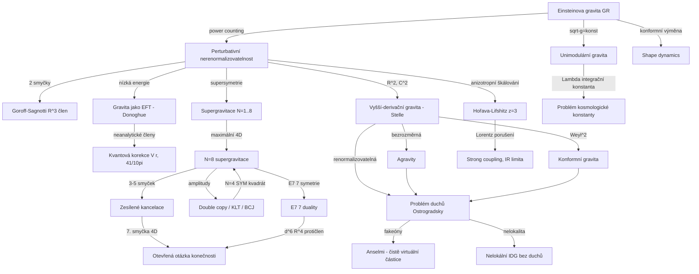

# Supergravitace a UV chování kvantové gravitace (Supergravity & UV Behavior of Perturbative Gravity)

> **TL;DR** — Perturbativní kvantování Einsteinovy gravitace selhává: je nerenormalizovatelné, což Goroff a Sagnotti (1986) dokázali výpočtem nenulové dvousmyčkové divergence úměrné krychli Riemannova tenzoru ($R^3$). Přesto je obecná relativita jako **efektivní teorie pole** (Donoghue) plně prediktivní v nízkých energiích — dává spočítatelné kvantové korekce k Newtonovu potenciálu. Nadějí na perturbativně konečnou teorii je **maximální supergravitace $\mathcal{N}=8$**, kde explicitní amplitudové výpočty (Bern, Dixon, Roiban a spol.) ukazují "zesílené kanceace" (enhanced cancellations) přesahující předpovědi symetrií; otázka konečnosti ve čtyřech rozměrech (kritická je 7. smyčka) zůstává otevřená. Alternativy obcházející nerenormalizovatelnost — Stelleova kvadratická gravitace, agravity, Hořava-Lifshitzova gravita, nelokální gravita bez duchů, konformní a unimodulární gravita — platí cenou buď duchů (ghosts), porušení Lorentzovy invariance, nebo nelokality.

---

## Přehled a historický kontext

Klasická obecná relativita (general relativity, GR) je z hlediska kvantové teorie pole **nerenormalizovatelná**, protože Newtonova konstanta $G$ má zápornou hmotnostní dimenzi ($[G] = M^{-2}$ v jednotkách $\hbar = c = 1$). Mocninné počítání (power counting) předpovídá, že na každé smyčce roste superficiální stupeň divergence, takže k absorpci divergencí je třeba nekonečně mnoho protičlenů (counterterms) s nezávislými koeficienty, čímž teorie ztrácí prediktivní sílu.

Historická naděje, že **supersymetrie** by mohla zachránit perturbativní gravity, vychází ze dvou pozorování: (1) supersymetrie spojuje bosony a fermiony, jejichž smyčkové příspěvky mají opačné znaménko, takže se mohou navzájem rušit; (2) supersymetrie omezuje povolené protičleny na supersymetrické invarianty, kterých je málo. Maximální supergravitace $\mathcal{N}=8$ má nejvíce supersymetrie (32 supernábojů) a tudíž nejsilnější omezení. Po objevu, že $\mathcal{N}=4$ super-Yang-Millsova teorie je *konečná* (UV finite), vznikla domněnka, že $\mathcal{N}=8$ supergravitace by mohla být jejím gravitačním protějškem — perturbativně konečnou bodovou teorií kvantové gravity bez nutnosti strun. Tato domněnka pohání celý moderní amplitudový program.

Historická posloupnost klíčových výsledků:

- **1974** — 't Hooft & Veltman: jednosmyčková (one-loop) čistá gravita je *on-shell* konečná, protože jediný divergentní protičlen ($\sim R^2$, $R_{\mu\nu}^2$) mizí na hmotnostní slupce díky vakuovým pohybovým rovnicím $R_{\mu\nu}=0$. Gravita s hmotou ovšem diverguje již na jedné smyčce.
- **1976** — Freedman, van Nieuwenhuizen & Ferrara: konstrukce první **supergravitace** $\mathcal{N}=1$ ve čtyřech dimenzích, lokálně supersymetrické rozšíření GR s gravitinem (spin 3/2). (Breakthrough Prize 2019.)
- **1977** — Stelle: gravita s členy kvadratickými v křivosti ($R^2$, $C^2$) je **renormalizovatelná** — ale za cenu duchů (ghost).
- **1978** — Cremmer, Julia & Scherk: jedinečná **11-rozměrná supergravitace**, maximální dimenze pro supergravitaci se spinem $\le 2$; její redukce na torusu/sféře $S^7$ dává 4D $\mathcal{N}=8$ supergravitaci.
- **1986** — Goroff & Sagnotti (a nezávisle van de Ven 1992): **dvousmyčková** divergence čisté gravity je nenulová, čímž je perturbativní nerenormalizovatelnost definitivně dokázána.
- **1994** — Donoghue: **efektivní teorie pole gravity** (effective field theory, EFT) dává spolehlivé nízkoenergetické kvantové předpovědi nezávislé na UV doplnění.
- **2007–2018** — Bern, Carrasco, Dixon, Johansson, Roiban a spol.: explicitní mnohasmyčkové amplitudové výpočty v $\mathcal{N}=8$ supergravitaci pomocí **double copy** a zobecněné unitarity; objev "zesílených kancelací".

Klíčová pojmová distinkce, která prostupuje celým oborem, zní: **UV-konečnost (UV finiteness) není totéž co UV-úplnost (UV completeness)**. Teorie může být perturbativně konečná (žádné divergence smyček), a přesto nemusí být konzistentní úplnou teorií kvantové gravity (neperturbativní efekty, černé díry, swampland). Naopak nerenormalizovatelná teorie (čistá GR) může být dokonale prediktivní v IR jako EFT. Tato dvojí role — "nerenormalizovatelnost jako technický fakt" vs. "prediktivnost jako fyzikální realita" — je leitmotivem celého pilíře.

Druhým leitmotivem je **trade-off (kompromis)**: každý pokus o vylepšení UV chování perturbativní gravity platí nějakou cenou. Vyšší derivace zlepšují konvergenci propagátoru ($1/p^4$ místo $1/p^2$), ale zavádějí duchy. Supersymetrie přidává kancelující diagramy, ale vyžaduje maximální $\mathcal{N}=8$ a nepozorované superpartnery. Anizotropní škálování (Hořava) získá renormalizovatelnost, ale poruší Lorentzovu invarianci. Nelokalita (IDG) odstraní duchy i divergence, ale obětuje lokalitu a jasnou kauzalitu. Žádný známý přístup neuniká tomuto kompromisu zadarmo.

Tabulka strategií a jejich cen:

| Strategie | Mechanismus UV zlepšení | Cena |
|---|---|---|
| EFT (Donoghue) | žádné — přijetí nerenormalizovatelnosti | platí jen v IR, nepredikuje UV |
| Supergravitace $\mathcal{N}=8$ | SUSY kancelace diagramů | nepozorovaní superpartneři, otevřená konečnost |
| Vyšší derivace (Stelle) | propagátor $1/p^4$ | masivní spin-2 duch |
| Agravity | bezrozměrnost + asympt. volnost | fyzikální duch |
| Hořava-Lifshitz | anizotropní škálování $z=3$ | porušení Lorentzovy invariance |
| Nelokální IDG | celistvý faktor $e^{-\Box/M_s^2}$ | nelokalita, kauzalita |
| Konformní gravita | Weylova invariance | Ostrogradského duch |
| Unimodulární | — (jen $\Lambda$ jako int. konst.) | neřeší nerenormalizovatelnost |
| Fakeóny (Anselmi) | čistě virtuální kvantizace ducha | nestandardní Feynmanova pravidla |

---

## Klíčové koncepty

- **Perturbativní nerenormalizovatelnost (perturbative non-renormalizability)** — protože $[G]=M^{-2}$, $L$-smyčkové divergence vyžadují protičleny dimenze $2L+2$ v křivosti; jejich nekonečné množství znamená ztrátu prediktivnosti bez znalosti UV fyziky.
- **Goroffův-Sagnottiho člen (Goroff–Sagnotti term)** — nenulový dvousmyčkový protičlen $\propto C_{\mu\nu}{}^{\rho\sigma}C_{\rho\sigma}{}^{\kappa\lambda}C_{\kappa\lambda}{}^{\mu\nu}$ (krychle Weylova/Riemannova tenzoru), který nelze odstranit redefinicí pole — "smoking gun" nerenormalizovatelnosti.
- **Efektivní teorie pole gravity (gravity as EFT)** — GR jako nízkoenergetická EFT: nepoznané UV efekty se vstřebají do renormalizace koeficientů lokálního lagrangiánu, zatímco **neanalytické** (nonanalytic) části (např. $\sqrt{-q^2}$, $\ln(-q^2)$) dávají univerzální, parametricky nezávislé předpovědi.
- **Supergravitace $\mathcal{N}$ (supergravity)** — lokálně supersymetrická teorie s $\mathcal{N}$ supernáboji; $\mathcal{N}=8$ je maximální ve 4D (více supernábojů by vynutilo spiny $>2$). Více supersymetrie = silnější UV kancelace.
- **$\mathcal{N}=8$ supergravitace** — redukce 11D supergravitace, obsahuje 1 graviton, 8 gravitin, 28 vektorů, 56 fermionů, 70 skalárů; má skrytou globální $E_{7(7)}$ symetrii a lokální $SU(8)$.
- **$E_{7(7)}$ symetrie (E7(7) duality)** — výjimečná spojitá duální symetrie $\mathcal{N}=8$ supergravity, omezující povolené protičleny; F-termové protičleny nemohou být $E_{7(7)}$-invariantní pod 7. smyčkou.
- **Zesílené kancelace (enhanced cancellations)** — UV kancelace přesahující předpovědi všech známých symetrií a superprostorového počítání mocnin (např. $\mathcal{N}=5$ konečná na 4 smyčkách, $\mathcal{N}=8$ na 3 a 4 smyčkách lepší než bezpečné meze). Postrádají symetrické vysvětlení.
- **Double copy / KLT** — gravitační amplitudy = "kvadrát" gauge-teoretických; $\mathcal{N}=8$ SUGRA = (dvojnásobná kopie) $\mathcal{N}=4$ super-Yang-Millse. Color-kinematika dualita (Bern-Carrasco-Johansson, BCJ).
- **Vyšší derivační gravita (higher-derivative gravity)** — akce s $R^2$, $C^2$ ($C$ = Weylův tenzor): renormalizovatelná, ale s masivním spin-2 duchem.
- **Ostrogradského duch (Ostrogradsky ghost)** — teorie s více než druhými časovými derivacemi mají hamiltonián neomezený zdola; po kvantování vede na negativní normy/porušení unitarity.
- **Agravity (adimensional gravity)** — Salvio & Strumia: čistě bezrozměrné konstanty, 4-derivační graviton, renormalizovatelná a asymptoticky volná teorie bez vstupní hmotnostní škály.
- **Hořava-Lifshitzova gravita (Hořava–Lifshitz gravity)** — anizotropní (Lifshitzovo) škálování $t\to b^z t$, $\vec{x}\to b\vec{x}$ s $z=3$ v UV; power-counting renormalizovatelná za cenu porušení Lorentzovy invariance.
- **Nelokální gravita bez duchů (nonlocal ghost-free / infinite-derivative gravity, IDG)** — nekonečně mnoho derivací zabaleno do celistvé (entire) funkce $\sim e^{-\Box/M^2}$, která exponenciálně tlumí propagátor v UV a nezavádí nové póly (žádné duchy).
- **Konformní gravita (conformal/Weyl gravity)** — akce $\propto C_{\mu\nu\rho\sigma}^2$, invariantní vůči lokálnímu škálování (Weyl); renormalizovatelná, ale s duchem.
- **Unimodulární gravita (unimodular gravity)** — omezení $\sqrt{-g}=\text{konst}$; kosmologická konstanta je integrační konstanta, ne parametr lagrangiánu (nový pohled na problém kosmologické konstanty).
- **Shape dynamics** — Barbour, Gomes, Koslowski: GR přeformulovaná výměnou invariance vůči refoliaci časoprostoru za 3D lokální konformní (škálovou) invarianci.
- **Fakeóny / čistě virtuální částice (fakeons / purely virtual particles)** — Anselmi: kvantizace duchů jako čistě off-shell stupňů volnosti, které nikdy nevstupují do asymptotických stavů, čímž se zachová unitarita.
- **No-triangle hypotéza (no-triangle hypothesis)** — v jednosmyčkových $\mathcal{N}=8$ amplitudách se ruší trojúhelníkové (triangle) a bublinové (bubble) skalární integrály, takže zůstávají jen krabicové (box) integrály — důsledkem je, že $\mathcal{N}=8$ SUGRA a $\mathcal{N}=4$ SYM mají v $D$ dimenzích identický superficiální UV stupeň pro libovolný počet vnějších nohou.
- **Generalized unitarity (zobecněná unitarita)** — metoda rekonstrukce smyčkového integrandu sešíváním stromových amplitud na vícenásobných řezech (cuts); spolu s BCJ a double copy páteř moderních supergravitačních UV výpočtů.
- **Superprostorové počítání mocnin (superspace power counting)** — odhad nejnižší smyčky, na níž se může objevit supersymetrický protičlen, z dimenze nejnižšího plně-superprostorového ($\int d^{4\mathcal{N}}\theta$) invariantu; pro $\mathcal{N}=8$ ve 4D dává naivně $R^4$ na 3 smyčkách, ale explicitní výpočty ukazují *lepší* chování (zesílené kancelace).
- **Spektrální dimenze (spectral dimension)** — efektivní dimenze "viděná" difuzním procesem na časoprostoru; v Hořava-Lifshitz teče od $d_s=4$ v IR k $d_s=2$ v UV — stejný podpis dimenzionální redukce jako v CDT a asymptotické bezpečnosti.

---

## Matematický rámec

### Mocninné počítání divergencí v gravitaci

$$ D = (d-2)L + 2 $$

V $d=4$ dimenzích je superficiální stupeň divergence $L$-smyčkové amplitudy $D = 2L + 2$. **Význam symbolů:** $L$ = počet smyček, $d$ = počet časoprostorových dimenzí. Protože $D$ roste s $L$, vyžaduje každá smyčka protičleny stále vyšší dimenze v křivosti (dimenze $2L+2$), a teorie je nerenormalizovatelná — k odstranění divergencí potřebuje nekonečně mnoho nezávislých členů.

### Goroffův-Sagnottiho dvousmyčkový protičlen

$$ \Gamma_{\rm GS}^{(2)} = \frac{1}{\varepsilon}\,\frac{209}{2880}\,\frac{1}{(16\pi^2)^2}\int d^4x\,\sqrt{-g}\;C_{\mu\nu}{}^{\rho\sigma}\,C_{\rho\sigma}{}^{\kappa\lambda}\,C_{\kappa\lambda}{}^{\mu\nu} $$

**Význam symbolů:** $\varepsilon = 4-d$ (dimenzionální regularizace), $C_{\mu\nu\rho\sigma}$ = Weylův tenzor (na slupce roven Riemannovu, $R_{\mu\nu}=0$), koeficient $\tfrac{209}{2880}$ je přesná hodnota spočtená Goroffem a Sagnottim. **Význam:** Tento člen je *nenulový* a nelze ho odstranit redefinicí pole ani pohybovými rovnicemi, takže čistá Einsteinova gravita diverguje na dvou smyčkách — definitivní důkaz perturbativní nerenormalizovatelnosti.

### Kvantová korekce Newtonova potenciálu (Donoghue, EFT)

$$ V(r) = -\frac{G\,m_1 m_2}{r}\left[\,1 + 3\,\frac{G(m_1+m_2)}{r\,c^2} + \frac{41}{10\pi}\,\frac{G\,\hbar}{r^2\,c^3}\,\right] $$

**Význam symbolů:** $G$ = Newtonova konstanta, $m_1,m_2$ = hmotnosti, $r$ = vzdálenost, $\hbar$ = Planckova konstanta, $c$ = rychlost světla. Druhý člen $\propto G(m_1+m_2)/rc^2$ je **klasická** post-newtonovská korekce z GR; třetí člen $\propto \tfrac{41}{10\pi}\,G\hbar/r^2c^3$ je **skutečná kvantová** korekce ($\propto\hbar$). **Význam:** Koeficient $\tfrac{41}{10\pi}$ je univerzální, nezávislý na UV doplnění gravity — pochází z neanalytických částí jednosmyčkových diagramů. Jakákoli korektní teorie kvantové gravity musí tuto hodnotu v IR reprodukovat. Korekce je však experimentálně nepozorovatelná (řádu $(\ell_{\rm Pl}/r)^2$).

### Efektivní akce gravity (EFT rozvoj)

$$ S_{\rm eff} = \int d^4x\,\sqrt{-g}\left[\,\Lambda + \frac{1}{16\pi G}R + c_1 R^2 + c_2 R_{\mu\nu}R^{\mu\nu} + \frac{d_1}{M^2}R^3 + \dots\,\right] $$

**Význam symbolů:** $\Lambda$ = kosmologická konstanta, $1/16\pi G$ = Einsteinův člen, $c_1,c_2,d_1$ = bezrozměrné/dimenzionální Wilsonovy koeficienty, $M$ = škála nové fyziky. **Význam:** Lagrangián se uspořádá podle počtu derivací (mocnin energie $E/M$); v nízkých energiích dominují členy s nejméně derivacemi. Neznámé UV efekty se vstřebají do $c_i,d_i$, zatímco *neanalytické* příspěvky smyček jsou predikcí. Toto je systematický rámec, který činí GR prediktivní navzdory nerenormalizovatelnosti — predikce platí do škály $\sim M_{\rm Pl}$ (nebo nižší, pokud nová fyzika přijde dřív).

### Stelleova kvadratická gravita

$$ S = \int d^4x\,\sqrt{-g}\left[\,\gamma\,R + \alpha\,C_{\mu\nu\rho\sigma}^2 - \beta\,R^2\,\right] $$

**Význam symbolů:** $\gamma \sim M_{\rm Pl}^2$ (Einsteinův člen), $\alpha,\beta$ = bezrozměrné konstanty u kvadratických členů, $C^2$ = kvadrát Weylova tenzoru, $R^2$ = kvadrát Ricciho skaláru. **Význam:** Propagátor $\sim 1/(p^2(p^2+M^2))$ klesá v UV jako $1/p^4$, takže teorie je **renormalizovatelná** (Stelle 1977). Cena: $C^2$ člen zavádí masivní spin-2 stav s "nesprávným" znaménkem kinetického členu — Ostrogradského **duch** (ghost), porušující unitaritu.

### Propagátor v Stelleově/4-derivační gravitaci (rozklad na póly)

$$ \frac{1}{p^2(p^2+M^2)} = \frac{1}{M^2}\left(\frac{1}{p^2} - \frac{1}{p^2+M^2}\right) $$

**Význam symbolů:** $M$ = hmotnost těžkého spin-2 stavu $\sim M_{\rm Pl}/\sqrt{\alpha}$. **Význam:** Záporné znaménko u druhého pólu signalizuje ducha (záporné reziduum) — částici s negativní normou/energií. Toto je jádro "problému duchů" celé vyšší-derivační gravity.

### Hořava-Lifshitzova akce (anizotropní škálování $z=3$)

$$ S_{\rm HL} = \frac{1}{2\kappa^2}\int dt\,d^3x\,\sqrt{g}\,N\left[\,K_{ij}K^{ij} - \lambda K^2 - \mathcal{V}[g_{ij}]\,\right],\qquad \mathcal{V}\supset M^{-4}(\nabla R)^2,\; M^{-4}R^3 $$

**Význam symbolů:** $K_{ij}$ = vnější křivost (extrinsic curvature) prostorových řezů, $K=K^i_i$, $N$ = lapse, $\lambda$ = parametr deformující prostorovou difeo-symetrii, $\mathcal{V}$ = potenciál obsahující prostorové derivace až 6. řádu ($z=3$). **Význam:** Anizotropní škálování $t\to b^3 t$, $\vec x\to b\vec x$ dává propagátoru UV chování $\sim 1/(\omega^2 - k^6)$, čímž teorie získává **power-counting renormalizovatelnost** za cenu **porušení Lorentzovy invariance** v UV (která se má obnovit v IR jako emergentní symetrie).

### Nelokální (celistvá) forma faktoru ghost-free gravity

$$ \mathcal{L} \supset \tfrac{1}{2}\,h_{\mu\nu}\,\Box\,a(\Box)\,h^{\mu\nu} + \dots,\qquad a(\Box) = e^{-\Box/M_s^2} $$

**Význam symbolů:** $h_{\mu\nu}$ = fluktuace metriky, $a(\Box)$ = **celistvá** (entire) funkce d'Alembertova operátoru bez nul (kořenů), $M_s$ = škála nelokality. **Význam:** Volba $a(\Box)=e^{-\Box/M_s^2}$ exponenciálně tlumí propagátor $\sim e^{-p^2/M_s^2}/p^2$ v UV (zlepšuje konvergenci smyček), aniž by zavedla nové póly — proto **bez nových duchů**. Cena: nelokalita (nekonečně mnoho derivací).

### Kritická dimenze prvních UV divergencí v $\mathcal{N}=8$ supergravitaci

$$ D_c(L) = 4 + \frac{6}{L}\quad(L\ge 2),\qquad \text{přičemž explicitně: } D_c(3)=6,\;\; D_c(4)=\tfrac{11}{2},\;\; D_c(5)=\tfrac{24}{5} $$

**Význam symbolů:** $L$ = počet smyček, $D_c$ = počet dimenzí, pod nímž je $L$-smyčková 4-bodová amplituda konečná. **Význam:** Vztah $D_c = 4 + 6/L$ (shodný s chováním $\mathcal{N}=4$ super-Yang-Millse) platí *do 4 smyček*: na 3 smyčkách diverguje až od $D_c=6$ ($D^0R^4 = R^4$ protičlen), na 4 smyčkách od $D_c=11/2$. Na 5 smyčkách formule naivně dává $26/5$, avšak [Bern et al. 2018](https://arxiv.org/abs/1804.09311) změřili $D_c=24/5$ (nižší!) s protičlenem $D^8R^4$ — tedy na 5 smyčkách $\mathcal{N}=8$ *žádnou* zesílenou kancelaci nevykazuje a chová se přesně podle standardních $E_{7(7)}$/SUSY argumentů. Ve $D=4$ se konečnost poprvé ohrožuje až na $L=7$, kde se objeví nejnižší $E_{7(7)}$-invariantní protičlen $\partial^6 R^4$ ($D^6R^4$), proto je **7. smyčka kritická** pro otázku konečnosti.

### KLT/double-copy struktura amplitudy

$$ M_n^{\rm tree}(1,\dots,n) = \sum_{\sigma,\tau} A_n^{\rm tree}(\sigma)\,S[\sigma|\tau]\,\tilde A_n^{\rm tree}(\tau) $$

**Význam symbolů:** $M_n$ = gravitační amplituda, $A_n,\tilde A_n$ = barevně-uspořádané (color-ordered) gauge-teoretické amplitudy, $S[\sigma|\tau]$ = KLT jádro (momentum kernel). **Význam:** Gravitační amplituda je "double copy" dvou gauge-teoretických; pro $\mathcal{N}=8$ je $M = (\mathcal{N}=4\,\text{SYM})\otimes(\mathcal{N}=4\,\text{SYM})$. Color-kinematika dualita (BCJ) tuto strukturu rozšiřuje na smyčky, což umožnilo dosud nedostupné mnohasmyčkové výpočty.

### BCJ color-kinematika dualita

$$ c_i + c_j + c_k = 0 \;\Longrightarrow\; n_i + n_j + n_k = 0,\qquad M_n^{\rm loop} = \sum_i \int \prod_l \frac{d^D\ell_l}{(2\pi)^D}\,\frac{1}{S_i}\,\frac{n_i\,\tilde n_i}{\prod_{\alpha} p_{\alpha}^2} $$

**Význam symbolů:** $c_i$ = barevné faktory, $n_i,\tilde n_i$ = kinematické numerátory, $S_i$ = symetrický faktor, $p_\alpha^2$ = propagátory. **Význam:** Numerátory lze uspořádat tak, aby splňovaly stejné Jacobiho identity jako barevné faktory; nahrazením barvy druhým kinematickým faktorem ($c_i\to\tilde n_i$) získáme gravitační integrand. To je technologie, která umožnila 4- a 5-smyčkové $\mathcal{N}=8$ výpočty (generalized double copy).

### $E_{7(7)}$ omezení na protičleny (single-soft-scalar limita)

$$ \lim_{p\to 0}\,M_{n+1}(\dots,\phi(p)) = 0 \quad\Longleftrightarrow\quad \text{kandidát je }E_{7(7)}\text{-invariantní} $$

**Význam symbolů:** $\phi(p)$ = jeden z 70 skalárů (Goldstoneovské pole spontánně narušené $E_{7(7)}$), $M_{n+1}$ = amplituda s jedním měkkým (soft) skalárem. **Význam:** Operátory $D^4R^4$ a $D^6R^4$ mají *nenulovou* single-soft limitu na 6-bodové úrovni, a proto **porušují** $E_{7(7)}$ — což přímo dokazuje, že žádný $E_{7(7)}$-invariantní protičlen neexistuje pod 7. smyčkou. Toto je hlavní symetrický argument pro konečnost $\mathcal{N}=8$ až do 6 smyček.

### Spinový obsah $\mathcal{N}=8$ multipletu

$$ \#(\text{spin } s) = \binom{8}{4-2s},\qquad (2,\tfrac32,1,\tfrac12,0):\; (1,8,28,56,70) $$

**Význam symbolů:** $\binom{8}{k}$ = binomický koeficient (Pascalův trojúhelník), $s$ = spin. **Význam:** $\mathcal{N}=8$ supermultiplet obsahuje $\binom{8}{0}=1$ graviton, $\binom{8}{1}=8$ gravitin, $\binom{8}{2}=28$ vektorů, $\binom{8}{3}=56$ fermionů a $\binom{8}{4}=70$ skalárů (celkem $2^8=256$ stavů). 70 skalárů parametrizuje kvocient $E_{7(7)}/SU(8)$ (dim $133-63=70$), což je geometrický původ duální symetrie.

---

## Klíčové výsledky a milníky

- **Konečnost na 1 smyčce (čistá gravita)** — [\\'t Hooft & Veltman 1974](https://doi.org/10.1016/0003-4916(74)90232-9): jednosmyčkový protičlen čisté gravity je $\propto R^2, R_{\mu\nu}^2$, který mizí na hmotnostní slupce. Gravita + hmota však diverguje již na 1 smyčce.
- **První supergravitace** — [Freedman, van Nieuwenhuizen & Ferrara 1976](https://doi.org/10.1103/PhysRevD.13.3214): $\mathcal{N}=1$ SUGRA ve 4D, "Progress Toward a Theory of Supergravity".
- **11D supergravitace** — Cremmer, Julia & Scherk 1978, Phys. Lett. B76, 409: jedinečná maximální supergravitace, kořen M-teorie.
- **Stelleova renormalizovatelnost** — [Stelle 1977](https://doi.org/10.1103/PhysRevD.16.953): "Renormalization of higher-derivative quantum gravity", Phys. Rev. D 16, 953. Kvadratická gravita je renormalizovatelná, ale s duchem.
- **Dvousmyčková divergence** — [Goroff & Sagnotti 1986](https://doi.org/10.1016/0550-3213(86)90193-8): nenulový koeficient $\tfrac{209}{2880}$ u $R^3$ protičlenu; perturbativní nerenormalizovatelnost dokázána. (Potvrzeno [van de Ven 1992](https://doi.org/10.1016/0550-3213(92)90011-Y).)
- **Gravita jako EFT** — [Donoghue 1994](https://arxiv.org/abs/gr-qc/9405057): "General Relativity as an Effective Field Theory", spolehlivá kvantová korekce Newtonova potenciálu.
- **Přesná kvantová korekce potenciálu** — [Bjerrum-Bohr, Donoghue & Holstein 2003](https://arxiv.org/abs/hep-th/0211072): úplný neanalytický příspěvek, koeficient $\tfrac{41}{10\pi}$.
- **Trojsmyčková "superkonečnost" $\mathcal{N}=8$** — [Bern, Carrasco, Dixon, Johansson, Roiban 2007](https://arxiv.org/abs/hep-th/0702112) ("Three-Loop Superfiniteness"), explicitní výpočet [Bern et al. 2008](https://arxiv.org/abs/0808.4112): 3-smyčková amplituda konečná pro $D<6$ — lepší než superprostorové meze.
- **Otázka "Is $\mathcal{N}=8$ UV finite?"** — [Bern, Dixon, Roiban 2006](https://arxiv.org/abs/hep-th/0611086): no-triangle hypotéza, $\mathcal{N}=8$ SUGRA a $\mathcal{N}=4$ SYM mají na 1 smyčce stejné UV chování.
- **Čtyřsmyčková konečnost $\mathcal{N}=8$** — Bern et al. 2009: 4-smyčková 4-bodová amplituda konečná v $D=4$ i $D=5$ ($D_c=11/2$).
- **Nedekuplování od strun** — [Green, Ooguri & Schwarz 2007](https://arxiv.org/abs/0704.0777): perturbativní $\mathcal{N}=8$ SUGRA *nelze* oddělit od superstrun pro $d>3$ — i kdyby byla UV-konečná, není to konzistentní samostatná teorie.
- **$\mathcal{N}=4$ diverguje na 4 smyčkách** — [Bern, Davies, Dennen, Smirnov, Smirnov 2013](https://arxiv.org/abs/1309.2498): první UV divergence v čisté negaugeované 4D supergravitaci, způsobená U(1) anomálií duality.
- **$\mathcal{N}=5$ konečná na 4 smyčkách (zesílená kancelace)** — [Bern, Davies, Dennen 2014](https://arxiv.org/abs/1409.3089): $\mathcal{N}=5$ konečná navzdory očekávané divergenci — "enhanced cancellation".
- **Pětismyčková $\mathcal{N}=8$** — [Bern, Carrasco, Chen, Edison, Johansson, Parra-Martinez, Roiban, Zeng 2018](https://arxiv.org/abs/1804.09311): kritická dimenze $D_c=24/5$, protičlen $D^8R^4$; v $D=4$ stále konečná, otázka 7. smyčky neuzavřena.
- **Renormalizovatelnost Hořava-Lifshitz** — [Barvinsky, Blas, Herrero-Valea, Sibiryakov, Steinwachs 2016](https://arxiv.org/abs/1512.02250): důkaz perturbativní renormalizovatelnosti projektabilní Hořavovy gravity.
- **Agravity** — [Salvio & Strumia 2014](https://arxiv.org/abs/1403.4226): renormalizovatelná, asymptoticky volná, bezrozměrná teorie gravity.
- **Dvousmyčkový protičlen je asymptoticky bezpečný** — [Gies, Knorr, Lippoldt, Saueressig 2016](https://arxiv.org/abs/1601.01800): Goroff-Sagnottiho člen má v asymptotické bezpečnosti netriviální fixní bod.
- **Stelleova teorie je asymptoticky volná** — kvadratické konstanty $\alpha,\beta$ tečou k nule v UV (asymptotic freedom), takže UV chování řídí volná fixní teorie; to byl historicky hlavní motivační argument pro vyšší-derivační gravity navzdory problému duchů.
- **$E_{7(7)}$ vylučuje protičleny pod 7 smyčkami** — [Beisert, Elvang, Freedman, Kiermaier, Morales, Stieberger 2010](https://arxiv.org/abs/1009.1643): single-soft-scalar limity ukazují, že $D^4R^4$ i $D^6R^4$ porušují $E_{7(7)}$, takže žádný F-termový invariant neexistuje pod $L=7$. Symetrický základ pro konečnost do 6 smyček.
- **Maldacenova konformní gravita** — [Maldacena 2011](https://arxiv.org/abs/1105.5632): čistá Weylova ($C^2$) gravita se redukuje na Einsteinovu gravitaci s $\Lambda$, pokud se masivní duch odstraní vhodnými okrajovými podmínkami (Neumann + positive-frequency) — most ke kritické gravitě a holografii.
- **Nelokální IDG bez duchů a singularit** — [Biswas, Gerwick, Koivisto, Mazumdar 2012](https://arxiv.org/abs/1110.5249): nejobecnější nekonečně-derivační akce kolem konstantní křivosti; propagátor $\sim e^{-\Box/M_s^2}/\Box$ bez nových pólů, regularizující jak UV divergence, tak klasické singularity (bounce místo Big Bangu). Historicky předchůdci Krasnikov (1987) a Tomboulis (1997).
- **BCJ color-kinematika dualita** — [Bern, Carrasco, Johansson 2008](https://arxiv.org/abs/0805.3993): kinematický analog Jacobiho identity; klíč k double copy a všem mnohasmyčkovým výpočtům. Loop-level verze [Bern, Carrasco, Johansson 2010](https://arxiv.org/abs/1004.0476).
- **Souhrnný review UV chování** — [Bern, Carrasco, Chiodaroli, Johansson, Roiban 2023](https://arxiv.org/abs/2304.07392): moderní syntéza amplitudového přístupu; konstatuje, že přes 4 smyčky má $\mathcal{N}=8$ UV chování ne horší než konečný $\mathcal{N}=4$ SYM a že "puzzling enhanced ultraviolet cancellations" zůstávají bez symetrického vysvětlení.

### Souhrnná tabulka UV chování supergravity (4D, 4-bodová amplituda)

| Teorie | Smyčka první možné divergence | Kritická dimenze $D_c$ | Stav ve $D=4$ |
|---|---|---|---|
| $\mathcal{N}=8$ | 3 smyčky (naivně $R^4$) | $D_c=6$ na 3 sm. | konečná |
| $\mathcal{N}=8$ | 4 smyčky | $D_c=11/2$ | konečná (i $D=5$) |
| $\mathcal{N}=8$ | 5 smyček | $D_c=24/5$ ($D^8R^4$) | konečná |
| $\mathcal{N}=8$ | **7 smyček** ($E_{7(7)}$-invariant $\partial^6R^4$) | $D_c=4$ | **OTEVŘENO** |
| $\mathcal{N}=5$ | 4 smyčky (očekávána divergence) | — | **konečná** (zesílená kancelace) |
| $\mathcal{N}=4$ | 3 smyčky | — | konečná |
| $\mathcal{N}=4$ | 4 smyčky | — | **diverguje** (U(1) anomálie duality) |

Tabulka shrnuje "anomálii": méně supersymetrický $\mathcal{N}=4$ diverguje na 4 smyčkách, zatímco *více* supersymetrický $\mathcal{N}=5$ na téže smyčce zůstává konečný díky zesílené kancelaci — což ukazuje, že naivní pravidlo "více SUSY = lepší UV" má jemné výjimky vázané na duální anomálie.

---

## Současný stav (2024–2026)

- **Amplitudový program $\mathcal{N}=8$**: Souhrnný review [Bern, Carrasco, Chiodaroli, Johansson, Roiban 2023](https://arxiv.org/abs/2304.07392) ("Supergravity amplitudes, the double copy and ultraviolet behavior") shrnuje stav: přes 4 smyčky má $\mathcal{N}=8$ SUGRA UV chování *ne horší* než konečný $\mathcal{N}=4$ SYM; argumenty ze supersymetrie a duality naznačují konečnost minimálně do 6 smyček. **Klíčová nevyřešená otázka zůstává 7. smyčka ve 4D** — předpokládaný protičlen je $E_{7(7)}$-invariantní $\partial^6 R^4$, nejnižší přípustný invariant. Explicitní 7-smyčkový výpočet je technologicky mimo dosah; "zesílené kancelace" nemají symetrické vysvětlení.
- **Konflikt pure-spinor předpovědí**: [Kallosh 2014/2023](https://arxiv.org/abs/1412.7117) tvrdí, že čistá-spinorová analýza nedává divergentní 1PI struktury za 6 smyčkami, což by mohlo implikovat all-loop konečnost — naopak dřívější pure-spinor argumenty předpovídaly divergenci na 7 smyčkách. Konsensus chybí; potřeba nezávislého explicitního výpočtu.
- **Návrat vyšší-derivační/kvadratické gravity**: Quanta Magazine (listopad 2025, "Old 'Ghost' Theory of Quantum Gravity Makes a Comeback") dokumentuje renesanci. **Donoghue & Menezes** argumentují, že duchové se projevují jen "fleetingly, over short distances" a makroskopická kauzalita vzniká statisticky; **Buoninfante** (Radboud) tvrdí "Mathematically, they make sense now"; **Salvio** a **Holdom** modifikují pravidla pravděpodobnosti; **Anselmi** používá fakeóny. Skeptici (**Platania**, Kodaň) namítají, že otázka kauzality/unitarity zůstává otevřená.
- **Fakeóny / čistě virtuální částice**: Anselmi pokračuje (2024, "Quantum gravity with purely virtual particles from asymptotically local quantum field theory") — duch kvadratické gravity se kvantuje jako čistě off-shell fakeón, čímž se obejde porušení unitarity; unitarita platí v limitě mizející kosmologické konstanty.
- **Nelokální IDG**: aktivní výpočty kancelace UV divergencí v ghost-free infinite-derivative gravity (např. prosinec 2025), a "asymptoticky nelokální" teorie (Frampton-školy) jako posloupnost vyšší-derivačních teorií konvergující k IDG.
- **EFT gravity jako konsensuální spodní hranice**: Donoghueho rámec ([review 2022, arXiv:2211.09902](https://arxiv.org/abs/2211.09902)) je dnes standardem — jakákoli UV teorie musí reprodukovat IR predikce; aktivně se počítají kvantové korekce k ohybu světla, časovému zpoždění, gravitačním vlnám.
- **Kvantitativní stav predikcí EFT**: kvantová korekce Newtonova potenciálu (koeficient $41/10\pi$) je řádu $G\hbar/r^2c^3 \sim (\ell_{\rm Pl}/r)^2$, tedy $\sim 10^{-70}$ na laboratorních škálách — experimentálně nedosažitelné, ale konceptuálně klíčové jako jediný *přesný* kvantově-gravitační výpočet. Aktivně se počítají analogické univerzální korekce k ohybu světla, Shapirově zpoždění a post-newtonovským koeficientům gravitačních vln (light-bending, EFT amplitudy pro inspiraci binárek přes klasickou limitu kvantových amplitud).
- **Hořava-Lifshitz**: po důkazu renormalizovatelnosti projektabilní verze (2016) se výzkum soustředí na neprojektabilní verzi a na **problém silné vazby** (strong coupling) skalárního módu a obnovení Lorentzovy invariance v IR (jemné ladění je problematické). Barvinsky a spol. (2024, konference QGC) označují Hořavovy modely za "palladium of unitarity and renormalizability" — jediný známý příklad gravitační teorie, která je současně unitární *i* perturbativně renormalizovatelná (bez duchů), ovšem za cenu Lorentzova porušení.

### Taxonomie navrhovaných řešení problému duchů (2025)

Vyšší-derivační gravity jsou renormalizovatelné, ale obsahují masivní spin-2 Ostrogradského duch. Současné návrhy, jak duch "zachránit", lze rozdělit na:

1. **Fakeóny (Anselmi)** — duch se kvantuje jako čistě virtuální (off-shell) částice, nikdy ne jako asymptotický stav; unitarita platí v limitě $\Lambda\to 0$. Cena: nestandardní Feynmanova pravidla (ne Feynman, ne Wheeler-Feynman propagátor).
2. **Modifikovaná pravidla pravděpodobnosti (Salvio, Holdom)** — úprava výpočtu pravděpodobností tak, aby zůstaly kladné navzdory záporným normám.
3. **Krátko-dosahová nestabilita (Donoghue & Menezes)** — duch se projevuje jen "fleetingly, over short distances" (krátkodobě, na malých vzdálenostech), je dost nestabilní, aby zmizel dřív, než napáchá škodu; makroskopická kauzalita vzniká statisticky, mikroskopické porušení časového uspořádání je tolerováno.
4. **PT-symetrie / invertovaný harmonický oscilátor** — masivní tenzorový duch nahrazen nestabilitou typu invertovaného harmonického oscilátoru (Quanta 2025, arXiv 2603.07150).
5. **Skeptická pozice (Platania)** — "it's still open as a question", zda tyto opravy skutečně řeší fundamentální problémy s kauzalitou a unitaritou.

Klíčový citát (Buoninfante, 2025): *"So far there is no hint telling us that we should throw quantum field theory away; actually, it's the opposite."* (Zatím nic nenaznačuje, že bychom měli kvantovou teorii pole zahodit; spíš naopak.)

---

## Otevřené problémy

1. **Je $\mathcal{N}=8$ supergravitace UV-konečná ve $D=4$ ke všem řádům?** Kritická je 7. smyčka, kde existuje $E_{7(7)}$-invariantní kandidátní protičlen $\partial^6 R^4$. *Proč je to těžké:* explicitní 7-smyčkový 4-bodový výpočet je daleko za současnými výpočetními možnostmi (i 5-smyčkový vyžadoval generalized double copy a state-of-the-art redukci integrálů); "zesílené kancelace" nemají symetrické vysvětlení, takže ani teoreticky nelze rozhodnout.
2. **Co je mechanismus zesílených kancelací (enhanced cancellations)?** Kancelace pozorované v $\mathcal{N}=5$ (4 smyčky) a $\mathcal{N}=8$ (3–5 smyček) přesahují všechny známé symetrie a superprostorové počítání mocnin. *Proč je to těžké:* zdá se, že chybí nějaká dosud neidentifikovaná symetrie nebo nelokální struktura; bez ní nelze extrapolovat na vyšší smyčky.
3. **Problém duchů ve vyšší-derivační gravitě.** Stelleova/konformní/agravity teorie jsou renormalizovatelné, ale obsahují masivní spin-2 Ostrogradského duch. *Proč je to těžké:* unitarita a stabilita jsou v napětí s renormalizovatelností; navrhovaná řešení (fakeóny, PT-symetrie, modifikovaná pravidla pravděpodobnosti, IR-only nestabilita) jsou kontroverzní a chybí konsensus, zda zachovávají mikrokauzalitu.
4. **Obnovení Lorentzovy invariance v Hořava-Lifshitz.** Lorentzova symetrie je v UV porušena a má vzniknout jako emergentní v IR. *Proč je to těžké:* radiativní korekce přenášejí Lorentzovo porušení do nízkých energií (experimentálně silně omezeno), což vyžaduje extrémní jemné ladění; navíc skalární mód trpí silnou vazbou.
5. **Kvantová ekvivalence unimodulární gravity a GR.** Klasicky ekvivalentní, ale řeší unimodulární gravita problém kosmologické konstanty kvantově? *Proč je to těžké:* argumenty o (ne)renormalizaci $\Lambda$ jako integrační konstanty vs. couplingu jsou subtilní; výsledky závisí na měřítku/regularizaci.
6. **Lokalita a kauzalita nelokální gravity.** IDG je ghost-free a UV-zlepšená, ale nekonečně mnoho derivací ohrožuje kauzalitu a vyžaduje nestandardní definici počáteční úlohy. *Proč je to těžké:* fyzikální interpretace nelokálních propagátorů (analytické pokračování, výběr kontury) není jednoznačná; konzistence S-matice není plně dokázána.
7. **Patří perturbativní $\mathcal{N}=8$ do swamplandu?** Green-Ooguri-Schwarz argumentují, že ji nelze oddělit od strun pro $d>3$. *Proč je to těžké:* i kdyby byla perturbativně konečná, neperturbativní efekty (instantony, černé díry) mohou zničit konzistenci; vztah ke swamplandovým kritériím není formálně dokázán.
8. **Implikuje UV-konečnost UV-úplnost?** Pokud je $\mathcal{N}=8$ perturbativně konečná, je to konzistentní úplná kvantová gravita? *Proč je to těžké:* konečnost a úplnost jsou logicky nezávislé pojmy; černé díry a neperturbativní fyzika mohou bránit konzistenci i u perturbativně konečné teorie, a neexistuje teorém spojující oba pojmy. Tato distinkce je konceptuálně otevřená a podtrhuje, že "konečnost" nemusí být cílem, který si naivně myslíme.

---

## Vztahy k ostatním přístupům

### Teorie strun (string theory) — **dobře prozkoumáno**
$\mathcal{N}=8$ SUGRA je nízkoenergetická limita typu II superstrun na $T^6$; 11D SUGRA je nízkoenergetická limita M-teorie. Double copy spojuje uzavřené struny (gravitace) s otevřenými (gauge) přes KLT. Green-Ooguri-Schwarz (2007) ukázali, že perturbativní $\mathcal{N}=8$ SUGRA *nelze* dekuplovat od strun pro $d>3$ — i konečná SUGRA by tedy nebyla samostatnou kvantovou gravitou. Vztah je intenzivně studovaný a kvantitativně pochopený.

### Twistory a amplitudy (twistors-amplitudes) — **dobře prozkoumáno**
Celý mnohasmyčkový pokrok v $\mathcal{N}=8$ SUGRA stojí na amplitudových metodách: zobecněná unitarita, BCJ color-kinematika dualita, double copy, no-triangle hypotéza. Sdílená matematická struktura (KLT jádro, kinematické numerátory) je explicitní a hluboce prozkoumaná. Twistorové metody a on-shell rekurze (BCFW) jsou přímo aplikovány na stromové supergravitační amplitudy, které pak slouží jako stavební bloky smyčkových integrandů přes unitaritu. Toto je jediný most v pilíři, kde matematika je *zcela* sdílená s jiným přístupem.

### Asymptotická bezpečnost (asymptotic-safety) — **částečně prozkoumáno**
Obě řeší nerenormalizovatelnost, ale různě: AS hledá netriviální UV fixní bod (neperturbativně, Reuterův fixní bod), zatímco SUGRA spoléhá na perturbativní kancelace. Gies et al. (2016) ukázali, že Goroff-Sagnottiho dvousmyčkový člen má v AS fixní bod. Vyšší-derivační gravita (Stelle) je perturbativně asymptoticky volná a její koeficienty vstupují do AS truncací; existuje napětí, zda jsou duchy AS fixního bodu fyzikální nebo artefakt truncace. Vícesmyčkové supergravitační výsledky by mohly testovat AS predikce v supersymetrickém kontextu — to je dosud nevyužitá příležitost. Most existuje, ale není systematicky propojen.

### Konceptuální problémy / efektivní teorie pole (conceptual-problems, semiclassical-gravity) — **dobře prozkoumáno**
Donoghueho EFT je dnes standardní "spodní hranice": jakákoli kvantová gravita musí v IR reprodukovat koeficient $\tfrac{41}{10\pi}$ a další neanalytické členy. To poskytuje univerzální kontrolní bod pro *všechny* přístupy. Velmi dobře pochopeno.

### Kauzální dynamické triangulace (causal-dynamical-triangulations) — **sotva prozkoumáno**
Sdílí s Hořava-Lifshitz preferenci foliace (causal = preferovaný čas) a dimenzionální redukci spektrální dimenze ($d_s\to 2$ v UV). CDT i HL vykazují $d_s\approx 2$ v UV, což naznačuje hlubší společnou strukturu, ale formální vztah mezi CDT kontinuální limitou a HL fixním bodem není prozkoumán.

### Swampland (swampland) — **sotva prozkoumáno**
Green-Ooguri-Schwarz konjektura, že perturbativní $\mathcal{N}=8$ SUGRA je ve swamplandu, je explicitní most, ale formální důkaz pomocí moderních swamplandových kritérií (distance conjecture, weak gravity) chybí. Otevřené pole pro propojení UV-konečnosti a swamplandových omezení.

### Nekomutativní geometrie (noncommutative-geometry) — **sotva prozkoumáno**
Nelokální/IDG gravita sdílí s nekomutativní geometrií myšlenku UV regularizace skrze fundamentální škálu nelokality $M_s$. Exponenciální tlumení $e^{-\Box/M_s^2}$ připomíná nekomutativní "smearing". Vztah je spíše analogický a téměř neprozkoumaný.

### Holografie / AdS/CFT (holography-adscft) — **částečně prozkoumáno**
Konformní (Weyl) gravita a kritická gravita vznikají jako duální popisy na hranici AdS; renormalizovaná AdS akce souvisí s kritickou gravitou. Maldacenova interpretace konformní gravity (odstranění duchů okrajovými podmínkami) je holografická. Double copy se zkoumá i v zakřivených pozadích (color-kinematika v AdS). Most existuje, ale není systematicky vytěžen.

### Kvantová kosmologie (quantum-cosmology) — **částečně prozkoumáno**
Hořava-Lifshitz dává scale-invariantní spektrum perturbací bez inflace (díky $z=3$ škálování — kvantové fluktuace volného skaláru jsou necitlivé na Hubbleovu expanzi); agravity dává inflaci s $n_s\approx 0.967$, $r\approx 0.13$ z $\beta$-funkcí, je-li inflaton ztotožněn s "Higgsem gravity". Unimodulární gravita mění status $\Lambda$ v kosmologii (integrační konstanta). Nelokální/IDG gravita dává nesingulární bounce kosmologie. Vztahy jsou explicitní pro každou teorii zvlášť, ale ne sjednoceny do jednoho rámce.

### Twistory, ohyb světla a gravitační vlny (experimental-tests) — **částečně prozkoumáno**
EFT amplitudy v klasické limitě dávají post-newtonovské/post-minkowskovské koeficienty pro inspiraci binárek (gravitační vlny) — moderní program "amplitudy pro LIGO/LISA". Univerzální kvantové korekce (ohyb světla, Shapirovo zpoždění) jsou spočítané, ale daleko pod experimentální citlivostí. Most ke skutečnému měření kvantové gravity přes EFT je konceptuálně jasný, prakticky nedosažitelný.

### Loop quantum gravity (loop-quantum-gravity) — **sotva prozkoumáno**
Téměř bez přímého mostu: LQG je neperturbativní a pozaďově nezávislá, supergravitace/EFT perturbativní a pozaďově závislá. Shape dynamics (konformní přeformulování GR) má vzdálenou příbuznost s LQG přístupy k problému času, ale konkrétní propojení k UV chování chybí.

### Spektrální dimenze a dimenzionální redukce (spectral-dimension) — **sotva prozkoumáno**
Hořava-Lifshitz vykazuje UV redukci spektrální dimenze $d_s\to 2$ (od $d_s=4$ v IR) — *stejný* podpis jako v CDT, asymptotické bezpečnosti a dalších přístupech. Tato univerzální UV vlastnost je kandidát na hlubokou meziteoretickou strukturu, ale není kvantitativně propojena s mechanismem supergravitačních kancelací. Možný "skrytý společný jmenovatel" mnoha přístupů — vysoce hodnotné, téměř neprozkoumané pole.

### Emergentní gravita (emergent-gravity) — **sotva prozkoumáno**
Některé Lifshitz/Hořava modely byly navrženy jako "Fermi-point scenario of emergent gravity" (Fermiho bod jako zdroj emergentní Lorentzovy symetrie). Agravity a Stelleova gravity zase nabízejí Einsteinovu gravitaci jako IR-emergentní z bezrozměrné UV teorie (Newtonova konstanta vzniká dimenzionální transmutací z $\beta$-funkcí). Konceptuální most existuje, formalizace chybí.

### Černé díry a informace (black-holes-information) — **sotva prozkoumáno**
UV-konečná či úplná teorie kvantové gravity musí konzistentně popsat černé díry a vyřešit informační paradox; nedekuplování $\mathcal{N}=8$ od strun (Green-Ooguri-Schwarz) se opírá právě o existenci stavů typu černých děr/bran. Zda perturbativní konečnost cokoli říká o mikrostavech černých děr, je otevřené a téměř neprozkoumané. Double copy se nedávno zkoumá i pro klasická řešení (Kerr-Schild, gravitační vlny), což může spojit perturbativní amplitudy s fyzikou černých děr.

---

### Nejcennější sotva prozkoumané mosty (gold pro projekt)

Pro hledání dosud neobjevených souvislostí jsou nejhodnotnější tyto **sotva prozkoumané** (barely explored) vazby, kde existuje jen indicie, nikoli systematické spojení:

- **Spektrální dimenze $d_s\to 2$ jako univerzální UV podpis** — sdílí Hořava-Lifshitz, CDT, asymptotická bezpečnost, group field theory a další. Je to náhoda, nebo hluboká společná struktura UV gravity? Kvantitativní propojení s mechanismem supergravitačních kancelací zcela chybí. **Nejslibnější kandidát na meziteoretický most.**
- **Zesílené kancelace vs. skrytá symetrie** — neidentifikovaná struktura za zesílenými kancelacemi by mohla mít obdobu v jiných přístupech (např. hidden symmetries v amplitudách, asymptotické symetrie na hranici, dualní gravity). Neprozkoumáno.
- **Double copy v zakřivených pozadích a černé díry** — klasický double copy (Kerr-Schild) spojuje perturbativní amplitudy s přesnými řešeními; most k fyzice černých děr a informačnímu paradoxu je v plenkách.
- **Nelokalita IDG vs. nekomutativní geometrie** — fundamentální škála nelokality $M_s$ vs. nekomutativní $\theta$; pouze analogická příbuznost, formálně nepropojeno.
- **Emergentní Lorentzova symetrie (Fermi-point) vs. emergentní gravita** — Hořava-Lifshitz a emergentní přístupy sdílejí ideu IR-emergentních symetrií, ale konkrétní vazba chybí.

## Mapa konceptů

---

## Reference

1. **'t Hooft, G. & Veltman, M.** (1974). *One-loop divergencies in the theory of gravitation.* Ann. Inst. H. Poincaré A 20, 69. DOI: [10.1016/0003-4916(74)90232-9](https://doi.org/10.1016/0003-4916(74)90232-9). — Jednosmyčková konečnost čisté gravity, divergence s hmotou.
2. **Freedman, D.Z., van Nieuwenhuizen, P. & Ferrara, S.** (1976). *Progress toward a theory of supergravity.* Phys. Rev. D 13, 3214. DOI: [10.1103/PhysRevD.13.3214](https://doi.org/10.1103/PhysRevD.13.3214). — První $\mathcal{N}=1$ supergravitace ve 4D.
3. **Stelle, K.S.** (1977). *Renormalization of higher-derivative quantum gravity.* Phys. Rev. D 16, 953. DOI: [10.1103/PhysRevD.16.953](https://doi.org/10.1103/PhysRevD.16.953). — Renormalizovatelnost kvadratické gravity za cenu duchů.
4. **Cremmer, E., Julia, B. & Scherk, J.** (1978). *Supergravity theory in eleven dimensions.* Phys. Lett. B 76, 409. DOI: [10.1016/0370-2693(78)90894-8](https://doi.org/10.1016/0370-2693(78)90894-8). — Jedinečná 11D supergravitace, kořen M-teorie.
5. **Goroff, M.H. & Sagnotti, A.** (1986). *The ultraviolet behavior of Einstein gravity.* Nucl. Phys. B 266, 709. DOI: [10.1016/0550-3213(86)90193-8](https://doi.org/10.1016/0550-3213(86)90193-8). — Dvousmyčková divergence, koeficient $209/2880$, nerenormalizovatelnost.
6. **van de Ven, A.E.M.** (1992). *Two-loop quantum gravity.* Nucl. Phys. B 378, 309. DOI: [10.1016/0550-3213(92)90011-Y](https://doi.org/10.1016/0550-3213(92)90011-Y). — Nezávislé potvrzení Goroff-Sagnotti.
7. **Donoghue, J.F.** (1994). *General relativity as an effective field theory: The leading quantum corrections.* Phys. Rev. D 50, 3874. arXiv: [gr-qc/9405057](https://arxiv.org/abs/gr-qc/9405057). — Gravita jako EFT, spolehlivé nízkoenergetické předpovědi.
8. **Bjerrum-Bohr, N.E.J., Donoghue, J.F. & Holstein, B.R.** (2003). *Quantum gravitational corrections to the nonrelativistic scattering potential of two masses.* Phys. Rev. D 67, 084033. arXiv: [hep-th/0211072](https://arxiv.org/abs/hep-th/0211072). — Přesný koeficient $41/10\pi$ kvantové korekce potenciálu.
9. **Bern, Z., Dixon, L.J. & Roiban, R.** (2007). *Is $\mathcal{N}=8$ supergravity ultraviolet finite?* Phys. Lett. B 644, 265. arXiv: [hep-th/0611086](https://arxiv.org/abs/hep-th/0611086). — No-triangle hypotéza, otázka konečnosti.
10. **Bern, Z., Carrasco, J.J.M., Dixon, L.J., Johansson, H., Kosower, D.A. & Roiban, R.** (2007). *Three-loop superfiniteness of $\mathcal{N}=8$ supergravity.* Phys. Rev. Lett. 98, 161303. arXiv: [hep-th/0702112](https://arxiv.org/abs/hep-th/0702112). — Trojsmyčková konečnost lepší než superprostorové meze.
11. **Green, M.B., Ooguri, H. & Schwarz, J.H.** (2007). *Decoupling Supergravity from the Superstring.* Phys. Rev. Lett. 99, 041601. arXiv: [0704.0777](https://arxiv.org/abs/0704.0777). — $\mathcal{N}=8$ SUGRA nelze oddělit od strun pro $d>3$ (autoři konjekturují, že je ve swamplandu).
12. **Bern, Z., Carrasco, J.J.M. & Johansson, H.** (2008). *New relations for gauge-theory amplitudes.* Phys. Rev. D 78, 085011. arXiv: [0805.3993](https://arxiv.org/abs/0805.3993). — BCJ color-kinematika dualita.
13. **Bern, Z., Carrasco, J.J.M., Dixon, L.J., Johansson, H. & Roiban, R.** (2008). *Manifest ultraviolet behavior for the three-loop four-point amplitude of $\mathcal{N}=8$ supergravity.* Phys. Rev. D 78, 105019. arXiv: [0808.4112](https://arxiv.org/abs/0808.4112). — Explicitní 3-smyčkový integrand, $D_c=6$.
14. **Bern, Z., Carrasco, J.J.M. & Johansson, H.** (2010). *Perturbative quantum gravity as a double copy of gauge theory.* Phys. Rev. Lett. 105, 061602. arXiv: [1004.0476](https://arxiv.org/abs/1004.0476). — Double copy ke všem smyčkám.
15. **Beisert, N., Elvang, H., Freedman, D.Z., Kiermaier, M., Morales, A. & Stieberger, S.** (2010). *$E_{7(7)}$ constraints on counterterms in $\mathcal{N}=8$ supergravity.* Phys. Lett. B 694, 265. arXiv: [1009.1643](https://arxiv.org/abs/1009.1643). — $E_{7(7)}$ vylučuje invariantní protičleny pod 7 smyčkami.
16. **Bern, Z., Davies, S., Dennen, T. & Huang, Y.-t.** (2012). *Absence of three-loop four-point divergences in $\mathcal{N}=4$ supergravity.* Phys. Rev. Lett. 108, 201301. arXiv: [1202.3423](https://arxiv.org/abs/1202.3423). — $\mathcal{N}=4$ konečná na 3 smyčkách.
17. **Bern, Z., Davies, S., Dennen, T., Smirnov, A.V. & Smirnov, V.A.** (2013). *Ultraviolet properties of $\mathcal{N}=4$ supergravity at four loops.* Phys. Rev. Lett. 112, 131601. arXiv: [1309.2498](https://arxiv.org/abs/1309.2498). — $\mathcal{N}=4$ diverguje na 4 smyčkách (U(1) anomálie).
18. **Bern, Z., Davies, S. & Dennen, T.** (2014). *Enhanced ultraviolet cancellations in $\mathcal{N}=5$ supergravity at four loops.* Phys. Rev. D 90, 105011. arXiv: [1409.3089](https://arxiv.org/abs/1409.3089). — $\mathcal{N}=5$ konečná díky zesílené kancelaci.
19. **Salvio, A. & Strumia, A.** (2014). *Agravity.* JHEP 06, 080. arXiv: [1403.4226](https://arxiv.org/abs/1403.4226). — Bezrozměrná renormalizovatelná asymptoticky volná gravita.
20. **Kallosh, R.** (2014). *An update on perturbative $\mathcal{N}=8$ supergravity.* arXiv: [1412.7117](https://arxiv.org/abs/1412.7117). — Pure-spinor argument pro all-loop konečnost, konflikt předpovědí.
21. **Barvinsky, A.O., Blas, D., Herrero-Valea, M., Sibiryakov, S.M. & Steinwachs, C.F.** (2016). *Renormalization of Hořava gravity.* Phys. Rev. D 93, 064022. arXiv: [1512.02250](https://arxiv.org/abs/1512.02250). — Důkaz perturbativní renormalizovatelnosti projektabilní HL gravity.
22. **Gies, H., Knorr, B., Lippoldt, S. & Saueressig, F.** (2016). *Gravitational two-loop counterterm is asymptotically safe.* Phys. Rev. Lett. 116, 211302. arXiv: [1601.01800](https://arxiv.org/abs/1601.01800). — Goroff-Sagnottiho člen má fixní bod v AS.
23. **Bern, Z., Carrasco, J.J., Chen, W.-M., Edison, A., Johansson, H., Parra-Martinez, J., Roiban, R. & Zeng, M.** (2018). *Ultraviolet properties of $\mathcal{N}=8$ supergravity at five loops.* Phys. Rev. D 98, 086021. arXiv: [1804.09311](https://arxiv.org/abs/1804.09311). — Kritická dimenze $D_c=24/5$, protičlen $D^8R^4$.
24. **Hořava, P.** (2009). *Quantum gravity at a Lifshitz point.* Phys. Rev. D 79, 084008. arXiv: [0901.3775](https://arxiv.org/abs/0901.3775). — Anizotropní $z=3$ gravita, power-counting renormalizovatelná.
25. **Biswas, T., Gerwick, E., Koivisto, T. & Mazumdar, A.** (2012). *Towards singularity- and ghost-free theories of gravity.* Phys. Rev. Lett. 108, 031101. arXiv: [1110.5249](https://arxiv.org/abs/1110.5249). — Nelokální IDG bez duchů a singularit.
26. **Donoghue, J.F.** (2022). *Quantum general relativity and effective field theory.* arXiv: [2211.09902](https://arxiv.org/abs/2211.09902). — Moderní review EFT gravity.
27. **Bern, Z., Carrasco, J.J., Chiodaroli, M., Johansson, H. & Roiban, R.** (2023). *Supergravity amplitudes, the double copy and ultraviolet behavior.* arXiv: [2304.07392](https://arxiv.org/abs/2304.07392). — Souhrnný moderní review UV chování supergravity.
28. **Anselmi, D.** (2024). *Quantum gravity with purely virtual particles from asymptotically local quantum field theory.* renormalization.com/24a2. — Fakeónová kvantizace duchů kvadratické gravity.
29. **Maldacena, J.** (2011). *Einstein gravity from conformal gravity.* arXiv: [1105.5632](https://arxiv.org/abs/1105.5632). — Odstranění duchů konformní gravity okrajovými podmínkami.
30. **Quanta Magazine** (17. 11. 2025). *Old "ghost" theory of quantum gravity makes a comeback.* [URL](https://www.quantamagazine.org/old-ghost-theory-of-quantum-gravity-makes-a-comeback-20251117/). — Renesance kvadratické gravity, debata o duších (Donoghue, Buoninfante, Salvio, Holdom, Anselmi, Platania).
