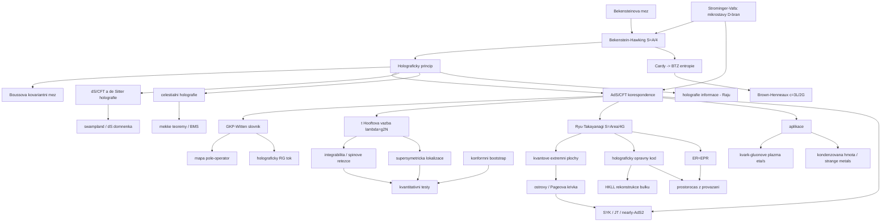

# Holografický princip a AdS/CFT (Holographic Principle & AdS/CFT)

> **TL;DR** — Holografický princip (holographic principle) tvrdí, že počet fundamentálních stupňů volnosti v oblasti prostoru roste s plochou jejího okraje, nikoli s objemem — kořeny má v Bekensteinově–Hawkingově entropii černé díry $S = A/4G$. Nejpřesnější realizací je AdS/CFT korespondence (Maldacena 1997): kvantová gravitace (resp. teorie strun typu IIB) na $(d+1)$-rozměrném anti-de Sitterově prostoru je *přesně ekvivalentní* (duální) konformní teorii pole (CFT) bez gravitace na jeho $d$-rozměrné hranici. Korespondence dala vznik konkrétnímu „slovníku" (GKP–Witten), prošla obrovským množstvím netriviálních testů (integrabilita, supersymetrická lokalizace, konformní bootstrap), poskytla aplikace v silně vázaných systémech (kvark-gluonové plazma, kondenzovaná hmota) a vedla k myšlence, že **prostoročas a gravitace emergují z kvantového provázání** (Ryu–Takayanagi, ER=EPR, ostrovy/Pageova křivka). Otevřeným problémem zůstává holografie *mimo* AdS: de Sitterův prostor (dS/CFT), plochý prostor (celestiální holografie, holografie informace) a realistická kosmologie.

## Přehled a historický kontext

Holografický princip vyrostl z termodynamiky černých děr. Bekenstein (1973) navrhl, že černá díra nese entropii úměrnou ploše horizontu, Hawking (1974–75) tuto úměru fixoval na $S = A/4$. To znamená, že **maximální entropie (a tedy informace) v dané oblasti je dána plochou jejího okraje, nikoli objemem** — což je v rozporu s naivním očekáváním lokální kvantové teorie pole, kde entropie škáluje s objemem.

- **1981** — Jacob Bekenstein formuluje univerzální mez (Bekenstein bound) na entropii systému s danou energií a rozměrem [Bekenstein 1981].
- **1993** — Gerard ’t Hooft, *Dimensional Reduction in Quantum Gravity* (gr-qc/9310026): kvantová gravitace musí mít popis na hranici, počet stupňů volnosti je „2D" [’t Hooft 1993].
- **1994** — Leonard Susskind, *The World as a Hologram* (hep-th/9409089): stringově-teoretická interpretace, slovo „holografie" [Susskind 1994].
- **1996** — Strominger a Vafa: mikroskopické odvození $S=A/4$ pro extrémní 5D černé díry počítáním D-bránových stavů [Strominger & Vafa 1996].
- **1997** — Juan Maldacena, *The Large N Limit of Superconformal Field Theories and Supergravity* (hep-th/9711200): konkrétní příklad holografie — AdS/CFT korespondence [Maldacena 1997]. Nejcitovanější článek teoretické fyziky vysokých energií.
- **1998** — Gubser–Klebanov–Polyakov (hep-th/9802109) a Witten (hep-th/9802150): GKP–Witten slovník, který činí korespondenci výpočetně přesnou [GKP 1998; Witten 1998].
- **1999** — Raphael Bousso: kovariantní entropická mez (covariant entropy bound) zobecňující holografický princip na obecné prostoročasy [Bousso 1999].
- **2006** — Ryu a Takayanagi: holografická entropie provázání jako plocha minimální plochy v bulku — most mezi geometrií a kvantovou informací [Ryu & Takayanagi 2006].
- **2013** — Maldacena a Susskind: ER=EPR, provázání = červí díra [Maldacena & Susskind 2013].
- **2019–2020** — Ostrovy (islands), replikové červí díry, Pageova křivka z polo-klasické gravitace [Penington 2019; Almheiri et al. 2019].

Klíčový posun: zatímco původně byla AdS/CFT „nástrojem na výpočty silné vazby", postupně se stala **paradigmatem, že gravitace a prostoročas jsou emergentní** z kvantové informace pohraniční teorie.

## Klíčové koncepty

- **Holografický princip (holographic principle)** — Maximální počet stupňů volnosti popisujících fyziku v oblasti prostoru je $N \sim A / 4 \ell_P^2$, tj. úměrný ploše $A$ okraje v Planckových jednotkách, ne objemu. Fundamentální teorie kvantové gravitace připouští popis na hranici o jednu dimenzi nižší.

- **Bekensteinova mez (Bekenstein bound)** — Univerzální horní mez entropie $S \le 2\pi k R E / \hbar c$ pro systém o energii $E$ uzavřený v kouli poloměru $R$. Saturuje se pro černou díru.

- **Bekensteinova–Hawkingova entropie (Bekenstein–Hawking entropy)** — $S_{BH} = k c^3 A / 4 G \hbar = A/4$ (v Planckových jednotkách). Entropie černé díry úměrná ploše horizontu, nikoli objemu.

- **Kovariantní entropická mez (covariant entropy bound, Bousso bound)** — Entropie procházející „světelným listem" (light sheet) — kongruencí neexpandujících světelných paprsků ortogonálních k ploše $B$ o ploše $A$ — splňuje $S \le A/4G$. Funguje i v kosmologii, kde selhává prostorová (spacelike) mez.

- **AdS/CFT korespondence (AdS/CFT correspondence)** — Dualita: teorie strun / kvantová gravitace na $\text{AdS}_{d+1}$ je ekvivalentní konformní teorii pole (CFT) na $d$-rozměrné konformní hranici. Prototyp: IIB struny na $\text{AdS}_5 \times S^5$ ↔ $\mathcal{N}=4$ super-Yang–Mills (SYM) s grupou $SU(N)$.

- **GKP–Witten slovník (GKP–Witten dictionary)** — Generující funkcionál CFT s okrajovým zdrojem $\phi_0$ se rovná partiční funkci gravitace s odpovídající okrajovou podmínkou: $Z_{\text{CFT}}[\phi_0] = Z_{\text{grav}}[\phi \to \phi_0]$. Každý operátor $\mathcal{O}$ v CFT odpovídá poli $\phi$ v bulku.

- **Mapa pole–operátor (field–operator map)** — Hmotnost $m$ bulkového pole určuje konformní rozměr $\Delta$ duálního operátoru: $\Delta(\Delta-d) = m^2 L^2$.

- **’t Hooftův limit a vazba (’t Hooft limit / coupling)** — $\lambda = g_{YM}^2 N$ při $N \to \infty$ s pevným $\lambda$. Planární (rod nula) limita. Silná vazba CFT ($\lambda \gg 1$) ↔ klasická gravitace; slabá vazba ↔ vysoce zakřivená strunová geometrie.

- **Holografický renormalizační tok (holographic RG flow)** — Radiální souřadnice bulku $\leftrightarrow$ energetická škála CFT; pohyb do nitra AdS = tok k IR. Doménové stěny (domain walls) interpolující mezi AdS vakui = RG tok mezi fixními body.

- **Entropie provázání a Ryu–Takayanagi (entanglement entropy / RT)** — Entropie provázání oblasti $A$ na hranici = plocha minimální plochy $\gamma_A$ v bulku homotopické k $A$, dělená $4G$. Kovariantně: HRT extrémní plocha.

- **Kvantová extrémní plocha a ostrovy (quantum extremal surface / islands)** — Jemnozrnná (fine-grained) entropie zahrnuje kvantové korekce: $S = \min\,\text{ext}\,[\text{Area}/4G + S_{\text{bulk}}]$. Ostrovy v interiéru černé díry vysvětlují Pageovu křivku.

- **Rekonstrukce bulku (bulk reconstruction, HKLL)** — Lokální bulkový operátor se vyjádří jako integrál okrajových operátorů přes „rozmazávací funkci" (smearing function) s podporou na bodech prostorupodobně oddělených od bulkového bodu.

- **Holografie jako kvantový opravný kód (holographic quantum error correction)** — Bulková informace je v hranici uložena redundantně jako logické qubity opravného kódu; chrání před výmazem velkých částí hranice (Almheiri–Dong–Harlow). Tensorové sítě (HaPPY kód) jako modely.

- **ER=EPR** — Provázání (EPR) dvou systémů je ekvivalentní (geometrickému) Einstein–Rosenovu mostu (ER, červí díra). Termofield-double stav ↔ věčná černá díra (eternal black hole).

- **dS/CFT a de Sitterova holografie (dS/CFT)** — Domnělá dualita mezi gravitací na de Sitterově prostoru a (neunitární) euklidovskou CFT na budoucí prostorupodobné hranici. Alternativa: statická záplata (static patch) na natažený horizont.

- **Celestiální holografie (celestial holography)** — Holografie plochého (Minkowského) prostoru: $\mathcal{S}$-matice 4D gravitace přepsaná jako korelátory 2D CFT na „nebeské sféře" (celestial sphere). Asymptotické (BMS) symetrie ↔ měkké (soft) teorémy.

- **Holografie informace (holography of information, Raju)** — V kvantové gravitaci je všechna informace z bulku asymptoticky plochého (či dS/AdS) prostoru dostupná i z malého okolí hranice. Radikální odchylka od lokální QFT.

## Matematický rámec

**Bekensteinova mez:**
$$ S \le \frac{2\pi k R E}{\hbar c} $$
$S$ je entropie (termodynamická nebo Shannonova), $k$ Boltzmannova konstanta, $R$ poloměr koule obklopující systém, $E$ celková energie (včetně klidové hmoty), $\hbar$ redukovaná Planckova konstanta, $c$ rychlost světla. **Význam:** informace v konečné oblasti s konečnou energií je konečná a omezená; saturace nastává pro černou díru, čímž černá díra představuje nejhustší možné informační „úložiště".

**Bekensteinova–Hawkingova entropie:**
$$ S_{BH} = \frac{k c^3 A}{4 G \hbar} = \frac{A}{4 \ell_P^2}\,k $$
$A$ je plocha horizontu událostí, $G$ Newtonova konstanta, $\ell_P = \sqrt{\hbar G/c^3}$ Planckova délka. **Význam:** entropie černé díry škáluje s **plochou**, ne objemem — kvantitativní jádro holografie. Maximální entropie v oblasti je $A/4$ v Planckových jednotkách.

**Kovariantní (Boussova) entropická mez:**
$$ S[\mathcal{L}] \le \frac{A(B)}{4 G \hbar} $$
$\mathcal{L}$ je světelný list generovaný z plochy $B$ o ploše $A(B)$ neexpandujícími světelnými paprsky (expanze $\theta \le 0$). **Význam:** zobecňuje holografický princip na libovolný prostoročas; ve slabě gravitujícím režimu implikuje Bekensteinovu mez a lze jej dokázat v relativistické QFT.

**Geometrie AdS$_{d+1}$ (Poincarého souřadnice):**
$$ ds^2 = \frac{L^2}{z^2}\left( dz^2 + \eta_{\mu\nu}\, dx^\mu dx^\nu \right) $$
$L$ je poloměr AdS, $z$ radiální (holografická) souřadnice — hranice je v $z \to 0$, $\eta_{\mu\nu}$ Minkowského metrika na $d$-rozměrné hranici. **Význam:** konformní hranice ($z\to0$) je domovem CFT; konformní faktor $L^2/z^2$ realizuje „warpování" a vztah $z \leftrightarrow$ energetická škála.

**Slovník $\text{AdS}_5 \times S^5$ ↔ $\mathcal{N}=4$ SYM (poloměr–vazba):**
$$ \frac{L^4}{\alpha'^2} = 4\pi g_s N = g_{YM}^2 N = \lambda, \qquad g_s = \frac{g_{YM}^2}{4\pi} $$
$L$ je poloměr AdS (i sféry $S^5$), $\alpha' = \ell_s^2$ čtverec strunové délky, $g_s$ strunová vazba, $N$ rank kalibrační grupy $SU(N)$, $g_{YM}$ Yang–Millsova vazba, $\lambda = g_{YM}^2 N$ ’t Hooftova vazba. **Význam:** klasická (supergravitační) limita gravitace ($L \gg \ell_s$) odpovídá **silné** vazbě CFT ($\lambda \gg 1$); to je zdroj výpočetní síly i obtížnosti přímého důkazu — obě strany jsou počítatelné v *opačných* režimech vazby.

**Vztah hmotnost–rozměr (mass–dimension relation):**
$$ \Delta = \frac{d}{2} + \sqrt{\frac{d^2}{4} + m^2 L^2}, \qquad \Leftrightarrow \qquad \Delta(\Delta - d) = m^2 L^2 $$
$\Delta$ je konformní rozměr operátoru $\mathcal{O}$ v $d$-rozměrné CFT, $m$ hmotnost duálního skalárního pole v bulku, $L$ poloměr AdS. **Význam:** lehká pole ↔ nízkorozměrné (relevantní) operátory; Breitenlohnerova–Freedmanova mez $m^2 L^2 \ge -d^2/4$ povoluje i tachyonická pole, dokud $\Delta$ zůstává reálné.

**GKP–Witten formule (generující funkcionál):**
$$ \left\langle \exp\!\left( \int_{\partial} d^d x\, \phi_0(x)\, \mathcal{O}(x) \right) \right\rangle_{\text{CFT}} = Z_{\text{grav}}\big[\phi(z\to0) \to z^{d-\Delta}\phi_0\big] \approx e^{-S_{\text{grav}}^{\text{on-shell}}[\phi_0]} $$
$\phi_0$ je okrajová hodnota (zdroj) bulkového pole $\phi$, $\mathcal{O}$ duální operátor, $S_{\text{grav}}^{\text{on-shell}}$ klasická (sedlový bod) gravitační akce vyhodnocená na řešení s danou okrajovou podmínkou. **Význam:** jádro slovníku — korelační funkce CFT se počítají jako derivace gravitační akce podle okrajových zdrojů (Wittenovy diagramy).

**Centrální náboj / stupně volnosti:**
$$ c_{\text{AdS}_3} = \frac{3L}{2 G_3} \quad (\text{Brown–Henneaux}), \qquad a = c = \frac{N^2 - 1}{4} \xrightarrow{N\to\infty} \frac{N^2}{4} \quad (\mathcal{N}=4\ \text{SYM}) $$
$G_3$ je 3D Newtonova konstanta, $L$ poloměr $\text{AdS}_3$; $a,c$ jsou koeficienty konformní anomálie 4D CFT. **Význam:** Brownův–Henneauxův centrální náboj (1986) předznamenal AdS/CFT o dekádu; $c \sim N^2$ je počet stupňů volnosti adjungované reprezentace — kontroluje velikost kvantových oprav ($1/N \sim G_N$).

**Cardyho formule a BTZ entropie:**
$$ S_{\text{Cardy}} = 2\pi \sqrt{\frac{c}{6}\left(L_0 - \frac{c}{24}\right)} \;\Longrightarrow\; S_{\text{BTZ}} = \frac{A}{4 G_3} $$
$c$ je centrální náboj 2D CFT, $L_0$ vlastní hodnota Virasorova generátoru. **Význam:** počítání stavů v CFT$_2$ reprodukuje Bekensteinovu–Hawkingovu entropii BTZ černé díry — mikroskopické odvození entropie z holografie.

**Ryu–Takayanagiho formule:**
$$ S_A = \frac{\text{Area}(\gamma_A)}{4 G_N} $$
$S_A$ je entropie provázání oblasti $A$ na hranici, $\gamma_A$ minimální plocha (kodimenze 2) v bulku homotopická k $A$ a ukotvená na $\partial A$, $G_N$ Newtonova konstanta. **Význam:** geometrizuje entropii provázání — most mezi kvantovou informací a geometrií prostoročasu; respektuje silnou subaditivitu.

**Kvantová extrémní plocha / formule ostrova:**
$$ S(\text{rad}) = \min_{\mathcal{I}}\,\text{ext}_{\mathcal{I}}\left[ \frac{\text{Area}(\partial \mathcal{I})}{4 G_N} + S_{\text{bulk}}(\mathcal{I} \cup \text{rad}) \right] $$
$\mathcal{I}$ je ostrov (oblast v interiéru), $\partial\mathcal{I}$ jeho kvantová extrémní plocha, $S_{\text{bulk}}$ semiklasická entropie polí. **Význam:** po Pageově čase (Page time) dominuje saddle s ostrovem, entropie záření klesá → **Pageova křivka** → zachování unitarity vypařování černé díry.

**Poměr viskozita/entropie (KSS):**
$$ \frac{\eta}{s} \ge \frac{\hbar}{4\pi k_B} \approx 0{,}08\,\frac{\hbar}{k_B} $$
$\eta$ je smyková viskozita, $s$ hustota entropie. **Význam:** univerzální dolní mez (Kovtun–Son–Starinets) z holografie pro silně vázané plazma; saturuje se v Einsteinově gravitaci a kvalitativně odpovídá kvark-gluonovému plazmatu na RHIC/LHC ($\eta/s \approx 0{,}1$–$0{,}3$).

## Klíčové výsledky a milníky

1. **Mikroskopická entropie černé díry** — [Strominger & Vafa 1996](https://arxiv.org/abs/hep-th/9601029) odvodili $S_{BH} = A/4$ pro třídu 5D extrémních černých děr počítáním degenerace BPS vázaných stavů D-brán. První statisticko-mechanické vysvětlení Bekensteinovy–Hawkingovy entropie.

2. **AdS/CFT korespondence** — [Maldacena 1997](https://arxiv.org/abs/hep-th/9711200) navrhl, že velkonábojová limita jistých CFT obsahuje supergravitaci na AdS. Hlavní příklad: IIB struny na $\text{AdS}_5\times S^5$ ↔ 4D $\mathcal{N}=4$ SYM. Publikováno v *Adv. Theor. Math. Phys.* 2 (1998) 231; přes 20 000 citací.

3. **GKP–Witten slovník** — [Gubser, Klebanov & Polyakov 1998](https://arxiv.org/abs/hep-th/9802109) a [Witten 1998](https://arxiv.org/abs/hep-th/9802150) zpřesnili korespondenci: korelátory CFT = závislost klasické gravitační akce na okrajových hodnotách; rozměry operátorů = hmotnosti částic. Witten navíc spojil Hawkingovu–Pageovu fázovou tranzici v AdS s deconfinement–confinement přechodem.

4. **Holografická entropie provázání** — [Ryu & Takayanagi 2006](https://arxiv.org/abs/hep-th/0603001) navrhli $S_A = \text{Area}(\gamma_A)/4G_N$; kovariantní zobecnění [Hubeny, Rangamani & Takayanagi 2007](https://arxiv.org/abs/0705.0016). Odstartovalo program „prostoročas z provázání".

5. **KSS mez viskozity** — [Kovtun, Son & Starinets 2004](https://arxiv.org/abs/hep-th/0405231) odvodili $\eta/s = 1/4\pi$ z holografie; aplikace na kvark-gluonové plazma — „nejdokonalejší kapalina".

6. **Integrabilita** — [Beisert et al. 2010](https://arxiv.org/abs/1012.3982) — kompletní přehled. Planární $\mathcal{N}=4$ SYM je integrabilní; dilatační operátor = hamiltonián integrabilního spinového řetězce; Kvantová spektrální křivka (Quantum Spectral Curve) dává *přesné* anomální rozměry pro libovolnou vazbu — nejpřesnější kvantitativní testy AdS/CFT.

7. **Supersymetrická lokalizace** — [Pestun 2007](https://arxiv.org/abs/0712.2824) redukoval $S^4$ partiční funkci na maticový model; umožnilo exaktní testy AdS/CFT i při konečné vazbě (Wilsonovy smyčky, volná energie $\sim N^{3/2}$ pro ABJM).

8. **Holografie jako opravný kód** — [Almheiri, Dong & Harlow 2015](https://arxiv.org/abs/1411.7041) ukázali, že rekonstrukce bulku je kvantový opravný kód; [Pastawski et al. (HaPPY) 2015](https://arxiv.org/abs/1503.06237) postavili explicitní tensorovou síť reprodukující RT.

9. **ER=EPR** — [Maldacena & Susskind 2013](https://arxiv.org/abs/1306.0533): provázání = červí díra; termofield-double ↔ věčná černá díra.

10. **Ostrovy a Pageova křivka** — [Penington 2019](https://arxiv.org/abs/1905.08255) a [Almheiri, Engelhardt, Marolf & Maxfield 2019](https://arxiv.org/abs/1905.08762) odvodili Pageovu křivku z kvantových extrémních ploch; [replikové červí díry, Penington et al. 2019](https://arxiv.org/abs/1911.11977) a [Almheiri et al. 2019](https://arxiv.org/abs/1911.12333) ji potvrdily z gravitačního integrálu po drahách.

11. **Celestiální holografie** — program přepisu 4D $\mathcal{S}$-matice jako 2D CFT korelátorů; přehled [Pasterski, Pate & Raclariu 2021](https://arxiv.org/abs/2111.11392) a [Donnay 2023](https://arxiv.org/abs/2310.12922). Měkké teorémy = Wardovy identity asymptotických symetrií.

12. **Holografie informace** — [Laddha, Prabhu, Raju & Shrivastava 2020](https://arxiv.org/abs/2002.02448): informace o bulku je dostupná z okolí hranice; aplikováno na AdS, plochý i dS prostor.

## Současný stav (2024–2026)

- **Holografie mimo AdS je hlavním frontem.** Aktivní programy: celestiální holografie (Simons Collaboration on Celestial Holography), dS holografie (statická záplata, dS/CFT, TT̄+Λ deformace), holografie informace. V letech 2025–2026 vznikají mosty mezi nimi: *„Bridging dS/CFT and Celestial Holography via Ward-Takahashi Identities"* [2512.10367] ukazuje, že extrapolované operátory v dS lze reprezentovat operátory na nebeské sféře; *„Celestial holography meets dS/CFT"*.

- **dS holografie a Carrollova geometrie.** Carrollovy CFT (limita $c\to0$) se ukazují jako přirozený rámec pro hranice plochého i dS prostoru; *„Carroll Geometry Meets De Sitter Space via Holography"* [2506.19720]. Toy modely: dS JT gravitace z dvojnásobně škálovaného SYK (double-scaled SYK) [2505.08116].

- **Holografie a swampland se sbližují.** *„Holography and the Swampland"* [2512.14389, prosinec 2025]: holografický princip dává geometrickou realizaci swampland mezí (konvexita CFT spektra, averaged null energy condition ↔ omezení na skalární potenciály a absenci dlouhožijících dS vakui).

- **Wedge / double holografie a braneworldy.** Karch–Randallovy bránové světy s ostrovy; *„Wedge Holographic Complexity in Karch-Randall Braneworld"* [2412.00852, 2025]. „Komunikující multivesmíry" v dS braneworldu [2404.00763].

- **Holografie informace v konečném poloměru.** [2410.17316, 2025] rozšiřuje princip na kouli konečného poloměru; [2512.18912, prosinec 2025] „The Fate of Information Localizability and Holography in Quantum Gravity".

- **Přesné testy pokračují.** Quantum Spectral Curve, analytický bootstrap (Lorentzova inverzní formule), termální bootstrap pro holografické korelátory [2508.08373; *„Analytic thermal bootstrap meets holography"*, JHEP 2026]. Lokalizace pro subleading $S^3$ partiční funkce holografických SCFT [2405.00845].

- **Emergentní gravitace z kvantové informace** zůstává konceptuálním leitmotivem; *„Essay: Emergent Holographic Spacetime from Quantum Information"* (PRL 2025). Diskuse, zda je gravitace fundamentální, nebo emerguje RG tokem hranice.

## Otevřené problémy

1. **Holografie pro de Sitter / realistickou kosmologii.** Náš vesmír má $\Lambda > 0$. dS/CFT vyžaduje *neunitární* euklidovskou CFT na prostorupodobné hranici; statická záplata má konečnou entropii horizontu, ale není jasné, kde „žijí" stupně volnosti. **Proč je to těžké:** chybí asymptotická bezčasová hranice typu AdS, S-matice neexistuje, pozorovatel je uvnitř kauzální záplaty s horizontem; není znám žádný kontrolovaný UV-úplný dS příklad. Souvisí se swampland domněnkou $|\nabla V| \ge cV/M_{pl}$, jež by dS vakuum zakazovala.

2. **Důkaz AdS/CFT.** Korespondence je *domněnka*, byť masivně testovaná. **Proč je to těžké:** obě strany jsou počítatelné v opačných režimech ’t Hooftovy vazby ($\lambda \gg 1$ vs $\lambda \ll 1$); chybí neperturbativní definice strunové teorie na AdS, kterou by šlo nezávisle srovnat. Integrabilita a lokalizace dávají interpolaci, ale ne plný důkaz.

3. **Rekonstrukce za horizontem a interiér černé díry.** HKLL funguje vně horizontu; rekonstrukce *interiéru* (zejména po Pageově čase) vyžaduje stavově závislé (state-dependent) operátory a je v napětí s linearitou kvantové mechaniky (Papadodimas–Raju). **Proč je to těžké:** firewall paradox (AMPS), monogamie provázání, nesoulad mezi efektivní teorií pole a unitaritou.

4. **Lokalita bulku a sub-AdS škála.** Slovník přirozeně rekonstruuje fyziku na škálách $\sim L$; jak emerguje *lokální* bulková fyzika hluboko pod poloměrem AdS (sub-AdS locality) z CFT, je nejasné. **Proč je to těžké:** vyžaduje pochopení strunových/$1/N$ korekcí a nelokálního charakteru holografické mapy (opravný kód).

5. **Holografie plochého prostoru bez supersymetrie/AdS.** Celestiální CFT je exotická (Carrollova, nestandardní reprezentace, komplexní rozměry); není znám její explicitní lagranžián ani zda je to skutečná lokální CFT. **Proč je to těžké:** plochý prostor je dvojí singulární limita AdS ($L\to\infty$), nemá normovatelný vakuový stav obvyklého typu, asymptotické symetrie (BMS) jsou nekonečnědimenzionální.

6. **Faktorizace a baby vesmíry / α-stavy.** Gravitační integrál po drahách zahrnuje červí díry, které způsobují, že partiční funkce dvou kopií *nefaktorizuje* — v rozporu s jasně faktorizující duální QFT. **Proč je to těžké:** vyžaduje průměrování přes ansámbl teorií (jako v JT/SYK) nebo „α-stavy"; není jasné, zda platí i pro $\mathcal{N}=4$ SYM (jediná teorie, ne ansámbl).

7. **Emergence času.** Radiální (prostorová) emergence v RG toku je dobře pochopena; emergence *časové* dimenze a kauzality z čistě kvantově-informačních dat hranice (zejména v kosmologii) je otevřená. **Proč je to těžké:** problém času v kvantové gravitaci, chybějící hranicová „hodina".

8. **Mikrostavy obecných (ne-extrémních, astrofyzikálních) černých děr.** Strominger–Vafa funguje pro BPS/extrémní; přesné počítání mikrostavů pro Schwarzschildovu/Kerrovu černou díru zůstává nevyřešené. **Proč je to těžké:** ztráta supersymetrie, žádná ochrana před kvantovými korekcemi, fuzzball program neúplný.

## Vztahy k ostatním přístupům

### Teorie strun (string-theory) — **dobře prozkoumáno**
AdS/CFT *je* tvrzení teorie strun: IIB struny na $\text{AdS}_5\times S^5$, M-teorie na $\text{AdS}_4\times S^7$ (ABJM) a $\text{AdS}_7\times S^4$. Holografie poskytuje neperturbativní definici strunové teorie na AdS pozadích. Strominger–Vafa propojuje D-brány s entropií. Toto je nejtěsnější a nejlépe rozpracovaná vazba — holografie je „dceřinou disciplínou" strunové teorie, ale stala se autonomní.

### Černé díry a informace (black-holes-information) — **dobře prozkoumáno**
Holografie je dnes hlavním rámcem pro informační paradox: ostrovy/Pageova křivka, replikové červí díry, ER=EPR, opravný kód. AdS/CFT garantuje unitaritu (CFT je manifestně unitární), takže vypařování *musí* být unitární. Mnohé výsledky (island formula) byly odvozeny v AdS a pak přeneseny.

### Provázání a prostoročas (entanglement-spacetime) — **dobře prozkoumáno**
„Prostoročas z provázání": Ryu–Takayanagi, ER=EPR, „It from Qubit", tensorové sítě, Van Raamsdonkův argument (rozpletení provázání = roztržení prostoročasu). Holografie je *konstruktivní laboratoří* této myšlenky. First law of entanglement → linearizované Einsteinovy rovnice [Faulkner et al. 2013].

### Swampland (swampland) — **částečně prozkoumáno**
Swampland kritéria (distance, de Sitter, weak gravity) jsou často motivována/testována holograficky; CFT konzistence (unitarita, konvexita spektra, ANEC) ↔ omezení na efektivní teorii v bulku. dS swampland domněnka úzce souvisí s nemožností dS holografie. Vazba sílí (2025), ale systematický slovník swampland ↔ CFT data zatím chybí.

### Twistory a amplitudy (twistors-amplitudes) — **částečně prozkoumáno**
Celestiální holografie sdílí s amplitudovým programem měkké teorémy, BMS symetrie a strukturu kolineárních limit; celestiální amplitudy = Mellinova transformace běžných amplitud. Twistorové struny a self-duální gravitace se objevují v top-down celestiálních duálech [2025]. Most je aktivní, ale neúplný — chybí plná slovníková korespondence.

### Asymptotická bezpečnost (asymptotic-safety) — **sotva prozkoumáno**
Obě teorie zahrnují RG tok a fixní body, ale jazyky jsou různé: holografický RG je *geometrický* (radiální), asymptotická bezpečnost hledá UV fixní bod v prostoru gravitačních couplingů. Spekulativní most: holografický c-teorém ↔ monotónní funkce v ASG. Konkrétní vazba prakticky neexistuje — **zlatá žíla** pro hledání skrytých souvislostí.

### Smyčková kvantová gravitace (loop-quantum-gravity) — **sotva prozkoumáno**
Spinové sítě (spin networks) a tensorové sítě sdílejí myšlenku kvantové geometrie z provázání/grafů; obě dávají $S \sim A$. Ale LQG je background-independentní a kanonická, AdS/CFT je background-dependentní (fixní AdS asymptotika). Vazba téměř neexistuje; izolované pokusy spojit spinpěny s holografickými kódy. Vysoce spekulativní, ale potenciálně plodná oblast.

### Skupinová teorie pole / GFT (group-field-theory) — **sotva prozkoumáno**
GFT generuje prostoročas jako kondenzát; holografie generuje prostoročas z provázání. Sdílená myšlenka emergence, ale žádný explicitní slovník. Spekulativně: GFT kondenzát ↔ holografický stav s geometrickým bulkem.

### Kauzální množiny / CDT (causal-sets, causal-dynamical-triangulations) — **sotva prozkoumáno**
Sdílí holografické škálování entropie ($S\sim A$) a důraz na kauzální strukturu (Boussova mez je kauzální). CDT i kauzální množiny by mohly testovat holografické meze numericky, ale přímá vazba k AdS/CFT chybí. Boussova kovariantní mez je nejbližší koncepční most.

### Nekomutativní geometrie (noncommutative-geometry) — **sotva prozkoumáno**
Holografické kódy a fuzzy sféry (fuzzy spheres) v bránových konstrukcích zavádějí nekomutativitu; matrixové modely (BFSS, IKKT) jsou příbuzné holografii. TT̄ deformace zavádí nelokalitu. Slovník je fragmentární.

### Emergentní gravitace (emergent-gravity) — **dobře/částečně prozkoumáno**
Holografie je *par excellence* příklad emergentní gravitace: gravitace v bulku emerguje z negravitační CFT. Jacobsonovo termodynamické odvození Einsteinových rovnic a Verlindeova entropická gravitace rezonují s RT/first-law argumenty. Konkrétní AdS realizace je dobře pochopena; obecná (ne-AdS, kosmologická) emergentní gravitace méně.

### Supergravitace a UV (supergravity-uv) — **dobře prozkoumáno**
Nízkoenergetická limita gravitační strany AdS/CFT *je* gauged supergravita (např. $\mathcal{N}=8$ na $\text{AdS}_4$). Holografická renormalizace, doménové stěny a c-teorém jsou formulovány v supergravitaci. Lokalizace propojuje supergravitační akce s CFT partičními funkcemi.

### Semiklasická gravitace (semiclassical-gravity) — **dobře prozkoumáno**
Island formula a Pageova křivka jsou odvozeny *v rámci semiklasické gravitace* (gravitační integrál po drahách na sedlovém bodě). Holografie ukazuje, kdy semiklasika selhává (po Pageově čase) a jak ji opravit (replikové červí díry).

### Konceptuální problémy (conceptual-problems) — **částečně prozkoumáno**
Holografie ostře staví otázky: lokalita (její selhání), individualita prostoročasových bodů, faktorizace, emergence času, status pozorovatele v dS. Filozoficky bohatá, ale konceptuální analýza (např. de Haro et al.) je mladá.

### Experimentální testy (experimental-tests) — **částečně prozkoumáno**
Nejsilnější „experimentální" otisk je $\eta/s$ kvark-gluonového plazmatu na RHIC/LHC (blízko KSS mezi). AdS/CMT predikuje (kvalitativně) strange-metal transport. Přímý test *gravitační* holografie chybí — jde o testy *aplikací*, ne principu.

### Kvantová kosmologie (quantum-cosmology) — **sotva/částečně prozkoumáno**
Hartle–Hawking–Maldacena dS/CFT návrh počítá vlnovou funkci vesmíru jako CFT partiční funkci; holografie informace v dS (kosmologické korelátory) je aktivní. Ale absence kontrolované dS holografie brzdí kvantitativní kosmologii. Hlavní úzké hrdlo.

## Mapa konceptů

## Reference

1. **J. D. Bekenstein** (1981), *Universal upper bound on the entropy-to-energy ratio for bounded systems*, Phys. Rev. D 23, 287. DOI: [10.1103/PhysRevD.23.287](https://doi.org/10.1103/PhysRevD.23.287). — Bekensteinova mez, kořeny holografie.

2. **G. ’t Hooft** (1993), *Dimensional Reduction in Quantum Gravity*, arXiv: [gr-qc/9310026](https://arxiv.org/abs/gr-qc/9310026). — První formulace holografického principu.

3. **L. Susskind** (1994), *The World as a Hologram*, J. Math. Phys. 36 (1995) 6377, arXiv: [hep-th/9409089](https://arxiv.org/abs/hep-th/9409089). — Stringově-teoretická holografie, název „holografie".

4. **A. Strominger, C. Vafa** (1996), *Microscopic Origin of the Bekenstein-Hawking Entropy*, Phys. Lett. B 379, 99, arXiv: [hep-th/9601029](https://arxiv.org/abs/hep-th/9601029). — Mikroskopické odvození $S=A/4$ z D-brán.

5. **J. M. Maldacena** (1997), *The Large N Limit of Superconformal Field Theories and Supergravity*, Adv. Theor. Math. Phys. 2 (1998) 231, arXiv: [hep-th/9711200](https://arxiv.org/abs/hep-th/9711200). — Zrod AdS/CFT korespondence.

6. **S. S. Gubser, I. R. Klebanov, A. M. Polyakov** (1998), *Gauge Theory Correlators from Non-Critical String Theory*, Phys. Lett. B 428, 105, arXiv: [hep-th/9802109](https://arxiv.org/abs/hep-th/9802109). — GKP část slovníku.

7. **E. Witten** (1998), *Anti De Sitter Space And Holography*, Adv. Theor. Math. Phys. 2, 253, arXiv: [hep-th/9802150](https://arxiv.org/abs/hep-th/9802150). — Wittenova část slovníku; Hawking–Page = deconfinement.

8. **R. Bousso** (1999), *A Covariant Entropy Conjecture*, JHEP 9907, 004, arXiv: [hep-th/9905177](https://arxiv.org/abs/hep-th/9905177). — Kovariantní entropická mez (light sheet).

9. **O. Aharony, S. S. Gubser, J. Maldacena, H. Ooguri, Y. Oz** (1999), *Large N Field Theories, String Theory and Gravity*, Phys. Rept. 323, 183, arXiv: [hep-th/9905111](https://arxiv.org/abs/hep-th/9905111). — Kanonický velký přehled (MAGOO).

10. **P. Kovtun, D. T. Son, A. O. Starinets** (2004), *Viscosity in Strongly Interacting Quantum Field Theories from Black Hole Physics*, Phys. Rev. Lett. 94, 111601, arXiv: [hep-th/0405231](https://arxiv.org/abs/hep-th/0405231). — KSS mez $\eta/s \ge 1/4\pi$.

11. **A. Hamilton, D. Kabat, G. Lifschytz, D. A. Lowe** (2006), *Local bulk operators in AdS/CFT: A boundary view of horizons and locality*, Phys. Rev. D 73, 086003, arXiv: [hep-th/0506118](https://arxiv.org/abs/hep-th/0506118). — HKLL rekonstrukce bulku.

12. **S. Ryu, T. Takayanagi** (2006), *Holographic Derivation of Entanglement Entropy from AdS/CFT*, Phys. Rev. Lett. 96, 181602, arXiv: [hep-th/0603001](https://arxiv.org/abs/hep-th/0603001). — RT formule.

13. **V. E. Hubeny, M. Rangamani, T. Takayanagi** (2007), *A Covariant Holographic Entanglement Entropy Proposal*, JHEP 0707, 062, arXiv: [0705.0016](https://arxiv.org/abs/0705.0016). — HRT (kovariantní) formule.

14. **V. Pestun** (2007), *Localization of gauge theory on a four-sphere and supersymmetric Wilson loops*, Commun. Math. Phys. 313 (2012) 71, arXiv: [0712.2824](https://arxiv.org/abs/0712.2824). — Supersymetrická lokalizace na $S^4$.

15. **N. Beisert et al.** (2010), *Review of AdS/CFT Integrability: An Overview*, Lett. Math. Phys. 99, 3, arXiv: [1012.3982](https://arxiv.org/abs/1012.3982). — Kompletní přehled integrability.

16. **J. Maldacena, L. Susskind** (2013), *Cool horizons for entangled black holes*, Fortsch. Phys. 61, 781, arXiv: [1306.0533](https://arxiv.org/abs/1306.0533). — ER=EPR.

17. **A. Almheiri, X. Dong, D. Harlow** (2015), *Bulk Locality and Quantum Error Correction in AdS/CFT*, JHEP 04, 163, arXiv: [1411.7041](https://arxiv.org/abs/1411.7041). — Holografie jako opravný kód.

18. **F. Pastawski, B. Yoshida, D. Harlow, J. Preskill** (2015), *Holographic quantum error-correcting codes (HaPPY)*, JHEP 06, 149, arXiv: [1503.06237](https://arxiv.org/abs/1503.06237). — Tensorová síť realizující RT.

19. **L. McGough, M. Mezei, H. Verlinde** (2016), *Moving the CFT into the bulk with $T\bar T$*, JHEP 04 (2018) 010, arXiv: [1611.03470](https://arxiv.org/abs/1611.03470). — TT̄ deformace = konečný cutoff v bulku.

20. **G. Penington** (2019), *Entanglement Wedge Reconstruction and the Information Paradox*, JHEP 09 (2020) 002, arXiv: [1905.08255](https://arxiv.org/abs/1905.08255). — Kvantové extrémní plochy a Pageova křivka.

21. **A. Almheiri, N. Engelhardt, D. Marolf, H. Maxfield** (2019), *The entropy of bulk quantum fields and the entanglement wedge of an evaporating black hole*, JHEP 12, 063, arXiv: [1905.08762](https://arxiv.org/abs/1905.08762). — Ostrovy.

22. **G. Penington, S. Shenker, D. Stanford, Z. Yang** (2019), *Replica wormholes and the black hole interior*, JHEP 03 (2022) 205, arXiv: [1911.11977](https://arxiv.org/abs/1911.11977). — Replikové červí díry.

23. **A. Almheiri, T. Hartman, J. Maldacena, E. Shaghoulian, A. Tajdini** (2019), *Replica Wormholes and the Entropy of Hawking Radiation*, JHEP 05 (2020) 013, arXiv: [1911.12333](https://arxiv.org/abs/1911.12333). — Pageova křivka z gravitačního integrálu po drahách.

24. **G. Obied, H. Ooguri, L. Spodyneiko, C. Vafa** (2018), *De Sitter Space and the Swampland*, arXiv: [1806.08362](https://arxiv.org/abs/1806.08362). — dS swampland domněnka $|\nabla V| \ge cV$.

25. **A. Laddha, S. G. Prabhu, S. Raju, P. Shrivastava** (2020), *The Holographic Nature of Null Infinity*, SciPost Phys. 10, 041, arXiv: [2002.02448](https://arxiv.org/abs/2002.02448). — Princip holografie informace.

26. **S. Pasterski, M. Pate, A.-M. Raclariu** (2021), *Celestial Holography*, arXiv: [2111.11392](https://arxiv.org/abs/2111.11392). — Snowmass přehled celestiální holografie.

27. **L. Donnay** (2023), *Celestial holography: An asymptotic symmetry perspective*, Phys. Rept., arXiv: [2310.12922](https://arxiv.org/abs/2310.12922). — Moderní přehled (asymptotické symetrie).

28. **A. Strominger** (2001), *The dS/CFT Correspondence*, JHEP 0110, 034, arXiv: [hep-th/0106113](https://arxiv.org/abs/hep-th/0106113). — Původní dS/CFT návrh.

29. **H. Huang** (2024), *AdS/CFT Duality and Holographic Renormalization Group: A Review*, arXiv: [2412.05446](https://arxiv.org/abs/2412.05446). — Moderní přehled holografického RG a c-teorému.

30. **S. A. Hartnoll, A. Lucas, S. Sachdev** (2018), *Holographic Quantum Matter*, MIT Press, arXiv: [1612.07324](https://arxiv.org/abs/1612.07324). — Kanonická monografie AdS/CMT.

31. **V. E. Hubeny** (2015), *The AdS/CFT Correspondence*, Class. Quant. Grav. 32, 124010, arXiv: [1501.00007](https://arxiv.org/abs/1501.00007). — Přístupný moderní přehled.

32. *(2025)* *Holography and the Swampland: Constraints on Quantum Gravity from Holographic Principles*, arXiv: [2512.14389](https://arxiv.org/abs/2512.14389). — Holografie ↔ swampland (2025).

33. *(2025)* *Bridging dS/CFT and Celestial Holography via Ward-Takahashi Identities*, arXiv: [2512.10367](https://arxiv.org/abs/2512.10367). — Most dS/CFT ↔ celestiální (2025).
