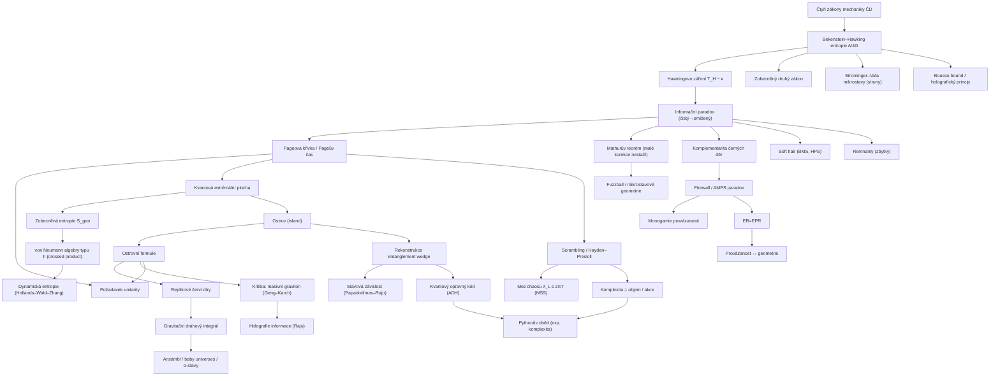

# Černé díry a informační paradox (Black Hole Thermodynamics & the Information Paradox)

> **TL;DR** — Černé díry mají termodynamiku: entropii úměrnou ploše horizontu (Bekenstein–Hawking, $S = A/4G\hbar$) a teplotu úměrnou povrchové gravitaci (Hawking). Hawkingovo poloklasické odpaření vede k tepelnému záření a zdánlivému přechodu čistého stavu na smíšený — to je **informační paradox**: konflikt s unitaritou kvantové mechaniky. Don Page ukázal, že unitární odpaření vyžaduje, aby entropie záření sledovala **Pageovu křivku** (růst pak pokles k nule). V letech 2019–2020 přinesly **kvantové extrémální plochy, ostrovy (islands) a replikové červí díry** poloklasický výpočet, který Pageovu křivku reprodukuje pomocí gravitačního dráhového integrálu. Tento průlom ukazuje, že entropie záření je unitární, ale **nevysvětluje mechanismus** úniku informace ani přesný kvantový stav záření; stále se vede debata o stavové závislosti, masivních vs. nehmotných gravitonech a o tom, zda je paradox skutečně vyřešen v plochém prostoru.

## Přehled a historický kontext

Informační paradox je nejostřejší známý konflikt mezi **kvantovou mechanikou** (unitární evoluce, zachování informace) a **obecnou relativitou** (kauzální struktura s horizontem) a slouží jako klíčové testovací pole pro každou teorii kvantové gravitace.

Časová osa:

- **1972–1974** — Jacob Bekenstein navrhuje, že černá díra nese entropii úměrnou ploše horizontu, a formuluje **zobecněný druhý zákon** (generalized second law), aby zachránil druhý termodynamický zákon při pádu hmoty za horizont [Bekenstein 1973](https://blackholes.tecnico.ulisboa.pt/gritting/pdf/gravity_and_general_relativity/Bekenstein_Generalized-second-law-of-thermodynamics-in-black-hole-physics.pdf).
- **1973** — Bardeen, Carter a Hawking formulují **čtyři zákony mechaniky černých děr** jako matematické analogie termodynamiky [Bardeen, Carter & Hawking 1973](https://link.springer.com/article/10.1007/BF01645742).
- **1974–1975** — Stephen Hawking pomocí kvantové teorie pole v zakřiveném prostoročase odvozuje, že černé díry vyzařují tepelné záření o teplotě $T_H = \kappa/2\pi$, čímž potvrzuje Bekensteinovu intuici a dodává přesný koeficient $1/4$ [Hawking 1975](https://link.springer.com/article/10.1007/BF02345020).
- **1976** — Hawking ve „Breakdown of predictability in gravitational collapse" tvrdí, že čistý stav kolabující do černé díry skončí jako **smíšený** stav tepelného záření — to je explicitní formulace informačního paradoxu a ztráty predikovatelnosti [Hawking 1976](https://link.aps.org/doi/10.1103/PhysRevD.14.2460).
- **1993** — Don Page ukazuje (statistikou náhodných podsystémů), že pro unitární odpaření musí entropie záření růst jen do **Pageova času** a pak klesat k nule — **Pageova křivka** [Page 1993a](https://arxiv.org/abs/gr-qc/9305007), [Page 1993b](https://arxiv.org/abs/hep-th/9306083).
- **1993** — Susskind, Thorlacius a Uglum navrhují **komplementaritu černých děr** (black hole complementarity) [Susskind, Thorlacius & Uglum 1993](https://arxiv.org/abs/hep-th/9306069).
- **1996** — Strominger a Vafa mikroskopicky spočtou entropii BPS černé díry v teorii strun a získají přesně $S = A/4G$ [Strominger & Vafa 1996](https://arxiv.org/abs/hep-th/9601029).
- **2003–2009** — Mathur rozvíjí **fuzzball** program a dokazuje teorém, že malé korekce nemohou vyřešit paradox [Mathur 2009](http://export.arxiv.org/abs/0909.1038).
- **2007** — Hayden a Preskill: černá díra jako „zrcadlo", informace vyletí po čase rozprostření (scrambling) [Hayden & Preskill 2007](https://arxiv.org/abs/0708.4025).
- **2012** — AMPS (Almheiri, Marolf, Polchinski, Sully): **firewall** — ostrá nekonzistence komplementarity [AMPS 2013](https://arxiv.org/abs/1207.3123).
- **2013** — Maldacena a Susskind: **ER=EPR** jako možná záchrana komplementarity [Maldacena & Susskind 2013](https://arxiv.org/abs/1306.0533).
- **2016** — Hawking, Perry, Strominger: **soft hair** [HPS 2016](https://arxiv.org/abs/1601.00921).
- **2019–2020** — **Průlom**: kvantové extrémální plochy, ostrovy a replikové červí díry dávají Pageovu křivku z gravitačního dráhového integrálu [Penington 2020](https://arxiv.org/abs/1905.08255); [AEMM 2019](https://arxiv.org/abs/1905.08762); [AMMZ 2020](https://arxiv.org/abs/1908.10996); [Penington, Shenker, Stanford & Yang 2022](https://arxiv.org/abs/1911.11977).
- **2020–2026** — Konsolidace, kritika (Geng–Karch, Raju), algebraické přístupy (crossed product, von Neumann algebry typu II/III) a živá debata o tom, co bylo a nebylo vyřešeno.

## Klíčové koncepty

- **Bekensteinova–Hawkingova entropie (Bekenstein–Hawking entropy)** — entropie černé díry je čtvrtina plochy horizontu v Planckových jednotkách, $S_{BH} = A/4G\hbar$. Je úměrná ploše, ne objemu — zárodek **holografického principu**.
- **Hawkingovo záření (Hawking radiation)** — tepelné záření o teplotě $T_H = \hbar\kappa/2\pi k_B c$ emitované horizontem v důsledku kvantové teorie pole v zakřiveném prostoročase; spektrum je (téměř) přesně černotělesné.
- **Čtyři zákony mechaniky černých děr (four laws of black hole mechanics)** — nultý zákon (povrchová gravitace $\kappa$ konstantní na horizontu), první zákon ($dM = \frac{\kappa}{8\pi}dA + \Omega\,dJ + \Phi\,dQ$), druhý zákon (plocha neklesá, $dA \geq 0$ — Hawkingův teorém o ploše), třetí zákon (nelze dosáhnout $\kappa = 0$).
- **Zobecněný druhý zákon (generalized second law, GSL)** — součet entropie černé díry a běžné entropie vně horizontu nikdy neklesá: $d(S_{BH} + S_{out}) \geq 0$.
- **Informační paradox (information paradox)** — pokud je Hawkingovo záření přesně tepelné a černá díra se zcela odpaří, čistý počáteční stav přejde na smíšený, což porušuje unitaritu. Ostřejší formulace (Mathur, Wallace): rostoucí provázanost mezi zářením a černou dírou nemůže klesnout bez korekcí řádu jedna na horizontu.
- **Pageova křivka (Page curve)** — graf jemnozrnné (von Neumannovy) entropie záření v čase: pro unitární evoluci roste do **Pageova času** (polovina maximální entropie / poloviny entropie černé díry vyzářena) a pak klesá k nule. Hawkingův výpočet dává monotónní růst — to je rozpor.
- **Pageův čas (Page time)** — okamžik, kdy entropie záření dosáhne maxima a začne klesat; nastává přibližně v polovině životnosti odpařování, kdy se vyzářila zhruba polovina počáteční entropie.
- **Komplementarita černých děr (black hole complementarity)** — informace je z pohledu vnějšího pozorovatele zakódována v záření na rozprostřeném horizontu (stretched horizon), zatímco padající pozorovatel projde horizontem bez dramatu; oba popisy si nikdy nemohou „porovnat poznámky", takže není operacionální rozpor.
- **Firewall / AMPS paradox** — tvrzení, že tři předpoklady — (i) čistota záření, (ii) platnost efektivní teorie pole vně horizontu, (iii) hladký horizont — nelze splnit současně kvůli **monogamii provázanosti** (monogamy of entanglement); nejkonzervativnější řešení je, že padající pozorovatel „shoří" na zdi z ohně na horizontu.
- **Fuzzball** — v teorii strun je každý ze $e^{S}$ mikrostavů černé díry bezhorizontové a nesingulární řešení, které se navenek podobá černé díře, ale liší se až na škále horizontu; struktura „houby" nahrazuje horizont, takže záření z povrchu nese informaci.
- **Soft hair (měkké vlasy)** — supertranslační/superrotační BMS náboje na horizontu; nekonečně mnoho zachovávajících se veličin (měkkých gravitonů/fotonů) uložených na „holografické desce" na horizontu.
- **Kvantová extrémální plocha (quantum extremal surface, QES)** — plocha extremalizující **zobecněnou entropii** $S_{gen} = \mathrm{Area}(X)/4G + S_{semi\text{-}cl}$; nahrazuje Ryuovu–Takayanagiho plochu v případech, kdy je kvantová korekce důležitá.
- **Ostrov (island)** — oblast $I$ v interiéru černé díry, která se zahrnuje do výpočtu entropie záření; po Pageově čase entanglement wedge záření obsahuje ostrov uvnitř horizontu, což sráží entropii podle Pageovy křivky.
- **Replikové červí díry (replica wormholes)** — nové sedlové body gravitačního dráhového integrálu při replikovém triku ($n$-té mocnině hustotní matice), které spojují různé kopie/repliky prostoročasu a dominují po Pageově čase, čímž generují ostrovní příspěvek.
- **Rekonstrukce entanglement wedge (entanglement wedge reconstruction)** — operátory v interiéru lze rekonstruovat z rané Hawkingovy radiace, jakmile je interiér součástí jejího entanglement wedge.
- **Stavová závislost (state dependence)** — Papadodimas–Raju: operátory popisující interiér za horizontem závisí na (mikro)stavu černé díry, nejsou to univerzální operátory CFT.
- **Holografie informace (holography of information)** — Raju: v kvantové gravitaci je kopie veškeré informace na Cauchyho řezu dostupná i poblíž jeho hranice; informace nelze lokalizovat do kompaktní oblasti.
- **ER=EPR** — provázanost (EPR) je ekvivalentní existenci Einsteinova–Rosenova můstku (ER); provázané černé díry jsou spojeny červí dírou.
- **Komplexita (complexity)** — kvantová výpočetní komplexita stavu duální geometrii interiéru: **complexity = volume** (objem maximálního řezu) nebo **complexity = action** (akce Wheelerova–DeWittova obrazce); roste lineárně exponenciálně dlouho i poté, co entropie nasytí.
- **Rozprostírání / scrambling** — rychlé rozmazání lokální informace po stupních volnosti; černé díry jsou nejrychlejší „scramblery" s časem $t_* \sim \frac{\beta}{2\pi}\ln S$.
- **Remnant (zbytek)** — hypotetický stabilní/dlouhožijící Planckův zbytek na konci odpaření, který by uchoval informaci; trpí problémem nekonečné produkce a problémem nekonečné degenerace.
- **Centrální dogma (central dogma)** — z vnějšku se černá díra chová jako kvantový systém s $A/4G$ stupni volnosti, který se vyvíjí unitárně; toto je pracovní předpoklad moderního programu.
- **Kvantový opravný kód (quantum error correction, QEC)** — Almheiri–Dong–Harlow: bulk lokalita v AdS/CFT je realizována jako opravný kód, kde se bulk operátor rekonstruuje na hraniční podsystém; interiér ČD je „zakódován" v záření a chráněn před lokálními chybami. Klíč k rekonstrukci entanglement wedge a k Pythonově obědu.
- **Pythonův oběd (Python's lunch)** — nemninimální QES (sevření „úzkým hrdlem") implikuje **exponenciální výpočetní komplexitu** rekonstrukce interiéru z radiace; geometrizuje stavovou závislost a typický-stav firewall.
- **Greybody factors / šedotělesné faktory** — odchylky Hawkingova spektra od ideálního černého tělesa kvůli rozptylu na potenciálové bariéře vně horizontu; přesně spočteno Pageem (1976) a klíčové pro rychlost odpaření a pro emisi z fuzzballů.
- **Bousso bound / kovariantní entropická mez** — entropie na světelném listu (light-sheet) je $\leq A/4G$; kovariantní zobecnění Bekensteinovy meze a přesné tvrzení **holografického principu** (’t Hooft, Susskind, Bousso).
- **Mezní hodnota chaosu (chaos bound)** — Lyapunovův exponent $\lambda_L \leq 2\pi T/\hbar$ (MSS 2016); černé díry ji saturují, jsou maximálně chaotické — dynamický základ scramblingu, vazba na SYK/Schwarzian.
- **Thermofield double (TFD)** — provázaný stav dvou kopií systému $|\text{TFD}\rangle = \sum_n e^{-\beta E_n/2}|n\rangle_L|n\rangle_R$; duální k věčné AdS černé díře (Maldacena), jejíž dva exteriéry spojuje Einsteinův–Rosenův můstek. Prototyp ER=EPR a SYK/JT modelů.
- **Petzova mapa (Petz map)** — explicitní rekonstrukční mapa kvantové informace z radiace zpět na interiérový operátor; realizuje entanglement wedge rekonstrukci a souvisí s Pythonovým obědem (kdy je mapa snadná vs. exponenciálně těžká).
- **Monogamie provázanosti (monogamy of entanglement)** — kvantový mód nemůže být maximálně provázán současně se dvěma jinými systémy; jádro AMPS firewall argumentu (rané záření vs. partnerský mód za horizontem).
- **Faktorizační hádanka (factorization puzzle)** — gravitační dráhový integrál pro dvě nespojené hranice dává nenulový červí-díra příspěvek, takže partiční funkce nefaktorizuje, ač duální CFT je součin nezávislých teorií; centrální technický problém ansámblové interpretace.

## Matematický rámec

$$ S_{BH} = \frac{k_B c^3 A}{4 G \hbar} = \frac{A}{4 G \hbar} \quad (\text{v jednotkách } k_B = c = 1) $$

Bekensteinova–Hawkingova entropie. $A$ je plocha horizontu událostí, $G$ Newtonova konstanta, $\hbar$ redukovaná Planckova konstanta, $k_B$ Boltzmannova konstanta. Entropie roste s **plochou** (ne objemem) — to je matematický zárodek holografického principu a jednotka je Planckova plocha $\ell_P^2 = G\hbar/c^3$.

$$ T_H = \frac{\hbar \kappa}{2\pi k_B c} = \frac{\hbar c^3}{8\pi G M k_B} \quad (\text{Schwarzschild}) $$

Hawkingova teplota. $\kappa$ je povrchová gravitace horizontu; pro Schwarzschildovu díru $\kappa = c^4/4GM$. Teplota je **nepřímo úměrná hmotnosti** — malé černé díry jsou horké, mají zápornou tepelnou kapacitu a odpařují se stále rychleji.

$$ dM = \frac{\kappa}{8\pi G} \, dA + \Omega \, dJ + \Phi \, dQ $$

První zákon mechaniky černých děr. $M$ hmotnost, $\Omega$ úhlová rychlost horizontu, $J$ moment hybnosti, $\Phi$ elektrostatický potenciál, $Q$ náboj. Porovnáním s $dE = T\,dS + \dots$ identifikujeme $T \leftrightarrow \kappa/2\pi$ a $S \leftrightarrow A/4G$ — to dává termodynamickou interpretaci.

$$ \frac{d}{dt}\left( S_{BH} + S_{\text{matter, out}} \right) \geq 0 $$

Zobecněný druhý zákon (GSL). Součet plošné entropie černé díry a obyčejné (von Neumannovy) entropie hmoty a záření vně horizontu nikdy neklesá. Zachraňuje druhý zákon termodynamiky, když hmota mizí za horizontem. Wall (2012) jej dokázal pro libovolný Killingův horizont v poloklasice.

$$ S \leq \frac{2\pi k_B R E}{\hbar c} \qquad (\text{Bekensteinova mez}) $$

Bekensteinova entropická mez. Maximální entropie obsažená v oblasti o poloměru $R$ a energii $E$ je omezena — vede k myšlence, že entropie je úměrná **ploše**, ne objemu. Kovariantní zobecnění je Boussova mez (entropie na světelném listu $\leq A/4G$), což je přesné tvrzení holografického principu [Bousso 2002](https://arxiv.org/abs/hep-th/0203101).

$$ S_{\text{rad}}(t) \approx \min\!\Big( \underbrace{s\, t}_{\text{Hawking, roste}},\ \underbrace{S_{BH}(t) = \tfrac{A(t)}{4G}}_{\text{plocha, klesá}} \Big) $$

Pageova křivka jako minimum dvou sedel QES. Před Pageovým časem dominuje „Hawkingovo" sedlo (prázdný ostrov), entropie záření lineárně roste rychlostí $s$ (tok entropie). Po Pageově čase dominuje ostrovní sedlo a entropie sleduje *klesající* Bekensteinovu–Hawkingovu entropii zbývající díry. Přechod (Pageův čas) je v okamžiku rovnosti — fázový přechod mezi QES.

$$ S_{\text{gen}}(X) = \frac{\mathrm{Area}(X)}{4 G_N} + S_{\text{semi-cl}}\big(\Sigma_X\big) $$

Zobecněná entropie pro plochu $X$. První člen je geometrický (plocha v Planckových jednotkách), druhý je von Neumannova entropie kvantových polí v oblasti $\Sigma_X$ ohraničené $X$. Tato veličina se extremalizuje a minimalizuje.

$$ S = \min_{X}\, \underset{X}{\mathrm{ext}} \left[ \frac{\mathrm{Area}(X)}{4 G_N} + S_{\text{semi-cl}}\big(\Sigma_X\big) \right] $$

Pravidlo kvantové extrémální plochy (QES, Engelhardt–Wall). Entropie se počítá tak, že se přes všechny kandidátní plochy $X$ nejprve extremalizuje (stacionarita $S_{gen}$) a poté vybere minimum. Toto je kvantové zobecnění Ryuovy–Takayanagiho a Hubeny–Rangamani–Takayanagiho (HRT) formule a v leading orderu se shoduje s Faulkner–Lewkowycz–Maldacena, ale za leading orderem se liší [Engelhardt & Wall 2015](https://arxiv.org/abs/1408.3203).

$$ S(\text{Rad}) = \min\, \mathrm{ext}_{\,I} \left[ \frac{\mathrm{Area}(\partial I)}{4 G_N} + S_{\text{semi-cl}}\big( \Sigma_{\text{Rad}} \cup \Sigma_{I} \big) \right] $$

**Ostrovní formule (island formula)** pro entropii Hawkingova záření. $\text{Rad}$ je oblast záření daleko od díry, $I$ je **ostrov** uvnitř černé díry, $\partial I$ jeho hranice (QES). Před Pageovým časem je optimální $I = \emptyset$ a entropie roste; po Pageově čase netriviální ostrov uvnitř horizontu srazí entropii — to reprodukuje Pageovu křivku [AMMZ 2020](https://arxiv.org/abs/1908.10996), [AHMST 2021](https://arxiv.org/abs/2006.06872).

$$ S_n = -\frac{1}{n-1}\ln \mathrm{Tr}\,\rho^n, \qquad S = \lim_{n\to 1} S_n = -\mathrm{Tr}\,\rho\ln\rho $$

Rényiho entropie a replikový trik. $n$-tá mocnina hustotní matice $\rho^n$ se v gravitaci počítá dráhovým integrálem přes $n$ replik prostoročasu; **replikové červí díry** jsou sedla spojující repliky, jejichž zahrnutí dává ostrovní příspěvek po analytickém prodloužení $n \to 1$.

$$ t_* \sim \frac{\beta}{2\pi}\ln S_{BH} = \frac{1}{2\pi T_H}\ln S_{BH} $$

Čas rozprostření (scrambling time). $\beta = 1/T_H$. Po vhození informace do staré černé díry (za Pageovým časem) trvá jen logaritmicky krátký čas, než informace znovu vyletí v záření [Hayden & Preskill 2007](https://arxiv.org/abs/0708.4025); černé díry saturují **chaos bound** $\lambda_L \leq 2\pi T/\hbar$.

$$ S_{\text{Strominger-Vafa}} = 2\pi\sqrt{Q_1 Q_5 N} = \frac{A}{4G} $$

Mikroskopická entropie BPS černé díry (D1-D5-P systém, near-horizon $AdS_3\times S^3 \times T^4$). $Q_1, Q_5$ jsou náboje D1/D5 bran, $N$ impuls. Počítání degenerace BPS vázaných stavů při slabé vazbě dává **přesně** Bekensteinovu–Hawkingovu entropii při silné vazbě [Strominger & Vafa 1996](https://arxiv.org/abs/hep-th/9601029).

$$ \frac{dM}{dt} = -\frac{\hbar c^4}{15360\,\pi\, G^2 M^2} \quad\Longrightarrow\quad t_{\text{evap}} \sim \frac{5120\,\pi\, G^2 M^3}{\hbar c^4} \sim \left(\frac{M}{M_\odot}\right)^3 \cdot 10^{67}\ \text{let} $$

Rychlost ztráty hmotnosti a doba odpaření. Stefanův–Boltzmannův zákon aplikovaný na Hawkingovo záření (numerický koeficient pro bezhmotné pole). Protože $T_H \propto 1/M$, je $dM/dt \propto -1/M^2$ a životnost roste jako $M^3$. Primordiální černá díra o hmotnosti $\lesssim 10^{15}$ g by se do dneška odpařila [Hawking 1975](https://link.springer.com/article/10.1007/BF02345020). Záporná tepelná kapacita znamená, že odpaření **akceleruje** — koncový bod je mimo poloklasický popis.

$$ \lambda_L \leq \frac{2\pi k_B T}{\hbar} $$

Mezní hodnota chaosu (chaos bound, MSS). Lyapunovův exponent OTOC (out-of-time-order correlator) je shora omezen teplotou; **černé díry tuto mez saturují** (jsou maximálně chaotické), což je dynamický základ rychlého scramblingu a souvisí s SYK modelem a Schwarzianem [Maldacena, Shenker & Stanford 2016](https://arxiv.org/abs/1503.01409).

$$ S_{N+1} > S_N + \ln 2 - 2\epsilon $$

Mathurův teorém o „malých korekcích". Pokud korekce k Hawkingovu výpočtu jsou parametricky malé ($\epsilon$), entropie provázanosti monotónně roste s počtem emitovaných kvant $N$ a nemůže klesnout — důsledek **silné subaditivity**. Závěr: paradox vyžaduje korekce řádu jedna na horizontu [Mathur 2009](http://export.arxiv.org/abs/0909.1038).

$$ \mathcal{C}_V = \max \frac{V(\Sigma)}{G_N \ell}, \qquad \mathcal{C}_A = \frac{I_{\text{WdW}}}{\pi \hbar} $$

Holografická komplexita. „Complexity = volume": komplexita úměrná objemu maximálního prostorupodobného řezu $\Sigma$. „Complexity = action": komplexita úměrná gravitační akci Wheelerova–DeWittova obrazce. Roste lineárně po čas $\sim e^{S}$ i poté, co entropie nasytila, a popisuje růst objemu interiéru [Brown, Roberts, Susskind, Swingle & Zhao 2016](https://arxiv.org/abs/1512.04993).

## Klíčové výsledky a milníky

1. **Termodynamika černých děr** — analogie čtyř zákonů (Bardeen–Carter–Hawking), entropie $\propto$ plocha (Bekenstein), tepelné záření $T_H \propto \kappa$ (Hawking). To etabluje černé díry jako termodynamické objekty se skutečnou entropií a teplotou [Bardeen, Carter & Hawking 1973](https://link.springer.com/article/10.1007/BF01645742); [Hawking 1975](https://link.springer.com/article/10.1007/BF02345020).

2. **Formulace paradoxu** — Hawking (1976): čistý stav → smíšený stav, ztráta predikovatelnosti [Hawking 1976](https://link.aps.org/doi/10.1103/PhysRevD.14.2460). Filozoficky vyostřeno Wallacem, který rozlišuje slabou verzi (globální nehyperbolicita) a silnou statisticko-mechanickou verzi, jež je „genuinely paradoxical" a nastává dávno před úplným odpařením [Wallace 2020](https://arxiv.org/abs/1710.03783).

3. **Pageova křivka** — Page (1993): průměrná entropie podsystému roste a klesá symetricky; pro unitární odpaření musí entropie záření kulminovat v Pageově čase. „The entropy of the radiation then typically increases until ... the Page time ... then decreases to zero." [Page 1993a](https://arxiv.org/abs/gr-qc/9305007); [Page 1993b](https://arxiv.org/abs/hep-th/9306083).

4. **Mikroskopická entropie ze strun** — Strominger–Vafa: počítání BPS stavů 5D extrémní černé díry (D1-D5-P) při slabé vazbě pomocí degenerace bran dává $S_{\text{micro}} = 2\pi\sqrt{Q_1 Q_5 N}$, což se **přesně** shoduje s $A/4G$ při silné vazbě — první mikrofyzikální „odvození" Bekensteinovy–Hawkingovy entropie. Pozdější práce (Maldacena–Strominger–Witten, Sen) rozšířily na near-extremální díry a logaritmické korekce $-\frac{3}{2}\ln S$ [Strominger & Vafa 1996](https://arxiv.org/abs/hep-th/9601029).

5. **Komplementarita** — Susskind–Thorlacius–Uglum: žádný jednotlivý pozorovatel nevidí rozpor; informace je na rozprostřeném horizontu i padá dovnitř, podle referenčního rámce [Susskind, Thorlacius & Uglum 1993](https://arxiv.org/abs/hep-th/9306069).

6. **Hayden–Preskill** — informace vhozená do staré (za Pageovým časem) černé díry vyletí po času $\sim \frac{\beta}{2\pi}\ln S$; černá díra je „zrcadlo" [Hayden & Preskill 2007](https://arxiv.org/abs/0708.4025).

7. **Mathurův teorém** — žádné malé korekce nemohou odstranit provázanost; nutné korekce řádu jedna na horizontu [Mathur 2009](http://export.arxiv.org/abs/0909.1038).

8. **Firewall (AMPS)** — „the most conservative resolution is that the infalling observer burns up at the horizon"; tři postuláty komplementarity jsou vzájemně nekonzistentní kvůli monogamii provázanosti [AMPS 2013](https://arxiv.org/abs/1207.3123).

9. **Eternal black hole = thermofield double** — Maldacena (2001): věčná AdS černá díra je duální k **thermofield-double** stavu dvou kopií CFT; její dva exteriéry jsou spojeny Einsteinovým–Rosenovým můstkem. Toto je prototyp ER=EPR a klíčový testovací případ pro provázanost ↔ geometrii. Hawking sám v roce 2004/2005 „připustil prohru sázky" s Preskillem a argumentoval pro unitaritu přes Euklidovský dráhový integrál [Maldacena 2003](https://arxiv.org/abs/hep-th/0106112).

10. **ER=EPR** — Maldacena–Susskind: provázanost ↔ geometrická spojitost (červí díra); možná záchrana před firewallem [Maldacena & Susskind 2013](https://arxiv.org/abs/1306.0533).

11. **Soft hair** — Hawking–Perry–Strominger: BMS supertranslace dávají nekonečně mnoho měkkých nábojů na horizontu; „complete information about their quantum state is stored on a holographic plate at the future boundary of the horizon" (úplná informace o jejich kvantovém stavu je uložena na holografické desce na budoucí hranici horizontu) [HPS 2016](https://arxiv.org/abs/1601.00921). *Omezení:* Bousso–Porrati a Mirbabayi–Porrati ukázali, že supertranslační soft hair je **triviální** (lze ho odstranit dressing transformací) a samo o sobě nestačí na vyřešení paradoxu — vazba na celestial holography a amplitudy zůstává aktivní.

12. **Průlom 2019–2020 — QES, ostrovy, replikové červí díry**:
    - Penington a nezávisle AEMM (2019): fázový přechod polohy QES přesně v Pageově čase, nová plocha leží mírně uvnitř horizontu; reprodukuje Pageovu křivku [Penington 2020](https://arxiv.org/abs/1905.08255); [AEMM 2019](https://arxiv.org/abs/1905.08762).
    - AMMZ (2020): „ostrovní pravidlo" pro entropii systémů provázaných s gravitací; v doubly-holographic / brane-world modelu jsou QES ekvivalentní RT plochám ve vyšší dimenzi [AMMZ 2020](https://arxiv.org/abs/1908.10996).
    - Replikové červí díry: ostrovní příspěvek odvozen z gravitačního dráhového integrálu — „geometries with a spacetime wormhole connecting the different replicas" [Penington, Shenker, Stanford & Yang 2022](https://arxiv.org/abs/1911.11977); [Almheiri, Hartman, Maldacena, Shaghoulian & Tajdini 2020](https://arxiv.org/abs/2006.06872).

13. **Kvantový opravný kód a rekonstrukce interiéru** — Almheiri–Dong–Harlow: AdS/CFT realizuje bulk lokalitu jako QEC; bulk operátor lze rekonstruovat na různé hraniční podsystémy (radial commutativity). Interiér ČD je „zakódován" v rané radiaci, jakmile je v jejím entanglement wedge. Pythonův oběd (Penington a kol.) vysvětluje, proč je dekódování interiéru **exponenciálně komplexní** [Almheiri, Dong & Harlow 2015](https://arxiv.org/abs/1411.7041).

14. **Ansámbl, JT gravitace a matice (transcending the ensemble)** — Saad–Shenker–Stanford ukázali, že 2D JT gravitace s topologiemi (červími dírami) se rovná **maticovému integrálu** — explicitní příklad, že gravitační dráhový integrál počítá ansámblové průměry. Marolf–Maxfield to formalizují přes α-stavy v Hilbertově prostoru baby universes; dráhový integrál s červími dírami popisuje **ansámbl** teorií, což vede k **faktorizační hádance** [Saad, Shenker & Stanford 2019](https://arxiv.org/abs/1903.11115); [Marolf & Maxfield 2020](https://arxiv.org/abs/2002.08950).

15. **Algebraický přístup** — Chandrasekaran–Penington–Witten a Hollands–Wald–Zhang: zobecněná entropie = von Neumannova entropie algebry pozorovatelných typu II (crossed product s modulární grupou); dynamická entropie černé díry [Chandrasekaran, Penington & Witten 2023](https://arxiv.org/abs/2206.10780); [Hollands, Wald & Zhang 2024](https://link.aps.org/doi/10.1103/PhysRevD.110.024070).

16. **Logaritmické korekce a kvantová entropie** — Sen a kol.: $S = \frac{A}{4G} + c\ln\frac{A}{G} + \dots$, kde koeficient $c$ je univerzální (závisí na obsahu polí a centrálním náboji) a testuje jednosmyčkovou kvantovou gravitaci. Shoda string/SUGRA výpočtu s mikrostavovým počítáním je netriviální test [Sen 2013](https://arxiv.org/abs/1108.3842).

17. **Fuzzbally vs. červí díry (Mathurova kritika 2022).** Mathur a kol. tvrdí, že každá verze „wormhole" přístupu (efektivně prázdná díra s hmotou v centru) je nekonzistentní s jeho teorémem, zatímco fuzzbally (struktura na škále horizontu) splňují korekce řádu jedna. Debata „fuzzball or wormhole" zůstává otevřená; klíčový rozdíl je, **kde** je informace (na horizontu vs. nelokálně v záření) [Bena, Mathur, Warner et al. 2022](https://arxiv.org/abs/2204.13113).

## Současný stav (2024–2026)

Pole se po průlomu 2019–2020 přesunulo od „dosáhnout Pageovy křivky" k otázce **co přesně to znamená a co zbývá**:

- **Konsolidace ostrovů a obrana proti kritice.** Klíčová kritika (Geng–Karch 2020) tvrdí, že všechny spolehlivé výpočty Pageovy křivky ve více než 2+1 dimenzích používají systémy s **masivním gravitonem** (kvůli vázání na nedynamickou lázeň/bath); v limitě nulové hmotnosti gravitonu příspěvek ostrovů mizí — **„massive islands conjecture"** [Geng & Karch 2020](https://link.springer.com/article/10.1007/JHEP09(2020)121). Geng, Karch, Raju a spol. to vyostřili: ostrovy jsou nekonzistentní v teoriích s gravitací dlouhého dosahu, protože porušují holografii informace a split-property [Geng, Karch et al. 2022 „Inconsistency of islands"](https://link.springer.com/article/10.1007/JHEP01(2022)182). V červnu 2025 vyšla „An apologia for islands" (Antonini, Chen, Maxfield, Penington), která tvrdí, že ostrovy se objevují i s **nehmotnými gravitony bez vnější lázně** (entanglement wedges hraničních CFT oblastí, záření na null infinity v asymptoticky plochém prostoru) a že Pageova křivka je „physically observable" [Antonini, Chen, Maxfield & Penington 2025](https://arxiv.org/abs/2506.04311). Debata stále trvá.

- **Algebraická / von Neumannova revoluce.** Crossed-product konstrukce (Chandrasekaran–Penington–Witten) ukazuje, že algebra pozorovatelných u horizontu je typu II$_\infty$ a její von Neumannova entropie se rovná zobecněné entropii modulo konstanta. Hollands–Wald–Zhang (2024) odvozují **dynamickou** entropii černé díry s netriviálním korekčním členem v nestacionárních érách; „Generalized black hole entropy is von Neumann entropy" (PRD 2025) tuto identifikaci dále upevňuje [Hollands, Wald & Zhang 2024](https://link.aps.org/doi/10.1103/PhysRevD.110.024070).

- **Co ostrovy NEvysvětlují.** Konsensuální stav: ostrovní formule správně počítá **entropii** (jemnozrnnou) záření a potvrzuje unitaritu, ale „we have discussed how to compute the entropy of Hawking radiation, but not how to compute its precise quantum state" — nedává jednotlivé maticové elementy hustotní matice, nevysvětluje **mechanismus** úniku informace v lokální fyzice, a opírá se o ne zcela definovaný gravitační dráhový integrál (která sedla? jaký kontur?) [AHMST 2021](https://arxiv.org/abs/2006.06872).

- **Stavová závislost a interiér.** Pokračuje debata Papadodimas–Raju o stavově závislých operátorech interiéru; novější práce ukazují, že informace v ostrově lze neporuchově rekonstruovat ze vzdáleného záření a hranice ostrova (QES) může ležet mírně vně horizontu (kvantitativní odhad $\sim \ell_P\sqrt{r_h}$ ⚠️ neověřeno — bez dohledatelné citace).

- **Fuzzbally a mikrostavové geometrie** zůstávají aktivním strunovým programem; přehled Mathur–Bena–Warner shrnuje, že „horizons and singularities only arise if one tries to describe gravity using a theory that has too few degrees of freedom" [Bena, Mathur, Warner et al. 2022](https://arxiv.org/abs/2204.13113).

- **50 let paradoxu (2025).** Na podzim 2025 proběhlo na SCGP (Stony Brook) sympozium „50 years of the black hole information paradox" (organizátoři Afshordi, Martinec, Mathur) — připomínka Hawkingova článku z roku 1975/1976. Explicitně konstatováno, že „different parts of the physics community hold very disparate views on the resolution of the paradox" (různé části komunity zastávají velmi rozdílné názory na řešení paradoxu) — ostrovy/dráhový integrál vs. fuzzbally vs. nelokalita/holografie informace.

- **Spekulativní okraj 2026.** Objevují se izolované návrhy (např. G2-manifold s torzí, 7D Einstein–Cartan geometrie spojující černé díry s Higgsovým polem, predikující stabilní Planckův remnant ~$9\times10^{-41}$ kg) — zatím nepotvrzené, mimo hlavní proud [Pinčák, Pigazzini, Pudlák & Bartoš 2026](https://doi.org/10.1007/s10714-026-03528-z). Mainstreamový postoj: paradox je formálně **nevyřešen**, ale Pageova-křivka / dráhově-integrální rámec je vedoucí kandidát na řešení a centrální dogma (unitarita z vnějšku) je pracovní předpoklad.

## Otevřené problémy

1. **Mechanismus úniku informace.** Ostrovní formule dává *entropii* záření, ne *stav*. Jak konkrétně informace o nitru opouští černou díru v lokální poloklasické fyzice? *Proč je to těžké:* poloklasická efektivní teorie pole u horizontu nevidí žádný kanál pro únik; replikové červí díry žijí v dráhovém integrálu, ne v jednotlivém prostoročase. *Pokusy:* entanglement wedge rekonstrukce, Hayden–Preskill dekódování, stavová závislost.

2. **Status replikových červích děr a faktorizace.** Gravitační dráhový integrál s červími dírami implikuje **ansámblové průměrování** (Marolf–Maxfield), ale skutečná CFT (např. v AdS/CFT) je jediná teorie, ne ansámbl. *Proč je to těžké:* „faktorizační hádanka" — jak může jednotná teorie reprodukovat výsledky vypadající jako průměr přes ansámbl? *Pokusy:* α-stavy, baby-universe Hilbertův prostor, half-wormholes.

3. **Masivní vs. nehmotný graviton (Geng–Karch / Raju vs. apologia).** Vyžadují ostrovy/Pageova křivka masivní graviton nebo nedynamickou lázeň, nebo platí i v asymptoticky plochém prostoru s nehmotnou gravitací? *Proč je to těžké:* holografie informace a split-property naznačují, že informaci nelze lokalizovat do kompaktního ostrova v gravitaci dlouhého dosahu. *Pokusy:* „An apologia for islands" 2025, výpočty na null infinity.

4. **Stavová závislost interiéru.** Jsou operátory za horizontem nutně stavově závislé (Papadodimas–Raju)? *Proč je to těžké:* stavová závislost se zdá porušovat běžnou kvantovou mechaniku (měření není unitární proces, stavy nemají definitní interpretaci). *Pokusy:* Papadodimas–Raju mirror operators, kritiky (Marolf–Polchinski).

5. **Singularita a koncový bod odpaření.** Co se stane na samém konci odpaření a u singularity? Existuje remnant, úplné odpaření, nebo přechod k Planckově fyzice? *Proč je to těžké:* vyžaduje plnou kvantovou gravitaci; remnanty trpí nekonečnou produkcí a degenerací (Susskind), ale úplné zmizení potřebuje vysvětlit, kam šla informace v posledních kvantech.

6. **Přesný kvantový stav záření a unitární S-matice.** Lze explicitně sestrojit unitární S-matici formace+odpaření? *Proč je to těžké:* žádný kontrolovaný výpočet mimo poloklasiku / nízkodimenzionální (JT) modely; nevíme, jak superponovat geometrie.

7. **Firewall vs. hladký horizont.** Je horizont staré černé díry hladký, nebo tam je firewall/„fuzz"? *Proč je to těžké:* monogamie provázanosti (AMPS) vs. ER=EPR / ostrovy, které tvrdí, že interiér NENÍ nezávislý na záření. *Pokusy:* ER=EPR, „A = R_B" identifikace, ostrovní rekonstrukce bez firewallu.

8. **Univerzalita napříč dimenzemi a typy černých děr.** Většina přesných výsledků je ve 2D (JT gravitace) nebo doubly-holographic; platí stejný obrázek pro realistické 4D astrofyzikální (nesymetrické, nenabité, rotující) černé díry? *Proč je to těžké:* QES a ostrovy se obtížně počítají bez vysoké symetrie nebo holografického duálu. *Pokusy:* ostrovy v Kerr/Schwarzschild, eternal black holes v AdS$_{d}$.

9. **Fyzikální status gravitačního dráhového integrálu.** Která sedla (topologie, kontur, replikové červí díry) se mají zahrnout a proč? Je červí-díra příspěvek skutečná fyzika jediné teorie, nebo artefakt průměrování? *Proč je to těžké:* dráhový integrál v gravitaci není rigorózně definován; výběr kontur (Kontsevich–Segal, Lorentzovský vs. Euklidovský) je nejednoznačný. *Pokusy:* half-wormholes, allowable complex metrics (Witten), constrained instantons.

10. **Interpretace entropie: kdo měří?** Algebraický přístup dává von Neumannovu entropii typu II až po **volbu pozorovatele** (crossed product s jeho hodinami). Co je „správná" jemnozrnná entropie a jak souvisí s počítáním mikrostavů (Strominger–Vafa, LQG)? *Proč je to těžké:* různé observers vidí různé algebry; vztah dynamické entropie (Wald) a mikrostavového počítání není uzavřen.

## Vztahy k ostatním přístupům

### Holografie / AdS-CFT (holography-adscft) — **dobře prozkoumáno**
Nejtěsnější vazba. Pageova křivka, ostrovy a replikové červí díry jsou odvozeny *uvnitř* AdS/CFT (RT/HRT, QES, entanglement wedge). Centrální dogma = boundary CFT je unitární. Doubly-holographic / brane-world setupy (AMMZ) převádějí QES na RT plochy ve vyšší dimenzi. Strominger–Vafa entropie je near-horizon $AdS_3$/CFT$_2$. Otevřená je faktorizační hádanka (ansámbl vs. jediná teorie).

### Provázanost a prostoročas (entanglement-spacetime) — **dobře prozkoumáno**
„Entanglement builds geometry" (Van Raamsdonk, Ryu–Takayanagi). ER=EPR přímo identifikuje provázanost s červími dírami. Ostrovy a entanglement wedge jsou jazyk provázanosti. Generalized entropy = von Neumannova entropie (algebraický přístup). Hluboce propojeno, ale mechanismus „jak provázanost ušívá interiér" zůstává konceptuálně otevřený.

### Teorie strun (string-theory) — **dobře (entropie) / částečně (paradox)**
Strominger–Vafa dává mikrostavy a $A/4G$ — robustní úspěch. Fuzzball/mikrostavové geometrie (Mathur, Bena, Warner) navrhují konkrétní strunové řešení paradoxu (bezhorizontové mikrostavy). Vazba mezi fuzzbally a ostrovy/replikovými červími dírami je však **jen částečně** prozkoumána — jsou to dvě různá tvrzení o tomtéž (struktura na horizontu vs. nelokální provázanost) a jejich vzájemný vztah není plně vyjasněn.

### Semiklasická gravitace (semiclassical-gravity) — **dobře prozkoumáno**
Paradox vzniká *právě* v poloklasickém režimu (QFT v zakřiveném prostoročase). Ostrovní formule je poloklasický výpočet (gravitační dráhový integrál + QFT entropie). Klíčová otázka: jak daleko poloklasika sahá a kde selhává (trans-Planckovský problém). Mathurův teorém vymezuje, že poloklasické malé korekce nestačí.

### Smyčková kvantová gravitace (loop-quantum-gravity) — **sotva prozkoumáno**
LQG počítá entropii černé díry z mikrostavů spinové sítě na horizontu (Barbero–Immirzi parametr laděný na $A/4G$). Ale **propojení s Pageovou křivkou, ostrovy a unitárním odpařením v LQG prakticky chybí** — LQG nemá hotový poloklasický popis odpaření ani holografický slovník. Velká příležitost: srovnat LQG entropii horizontu se zobecněnou entropií / von Neumannovou algebrou. Evidence: pouze sdílený cíl $S = A/4$, žádný společný výpočet odpaření.

### Asymptotická bezpečnost (asymptotic-safety) — **sotva prozkoumáno**
AS dává běžící $G(k)$ a možné regulární „kvantově vylepšené" černé díry bez singularity, případně remnanty. Propojení s informačním paradoxem a Pageovou křivkou je téměř neprozkoumané; otevřená otázka, zda RG-vylepšený horizont mění strukturu provázanosti. Evidence: jen kvalitativní (regulární jádra, možné remnanty).

### Kauzální množiny (causal-sets) — **sotva prozkoumáno**
Causal set teorie predikuje fluktuace entropie horizontu a „order-by-disorder" počítání kauzálních spojení přes horizont (Sorkinova spacetime entropie). Vazba na informační paradox, Hawkingovo záření a Pageovu křivku je minimální. Evidence: sdílené téma „entropie z diskrétní struktury horizontu".

### Nekomutativní geometrie (noncommutative-geometry) — **sotva prozkoumáno**
NC deformace horizontu/prostoročasu mění Hawkingovo spektrum a může produkovat remnanty (NC-inspirované regulární černé díry). Žádné propojení s ostrovy/replikovými červími dírami. Evidence: modifikované odpaření v NC modelech.

### Soft hair / asymptotické symetrie & amplitudy (twistors-amplitudes, emergent-gravity) — **částečně prozkoumáno**
Soft hair (HPS) využívá BMS asymptotické symetrie a soft teorémy (vazba na celestial holography a amplitudy). Raju–Chakraborty ukázali, že soft hair samo o sobě nestačí na vyřešení paradoxu. Holografie informace (Raju) je úzce spjata s asymptotickými symetriemi v plochém prostoru. Aktivní, ale ne uzavřené.

### Swampland (swampland) — **sotva prozkoumáno**
Swampland kritéria (slabá gravitace, distance conjecture) omezují spektrum a mohou vylučovat určité remnanty / nekonečné degenerace (souvisí s argumenty proti remnantům). Přímá vazba na Pageovu křivku je řídká. Evidence: argumenty proti stabilním remnantům jsou „swampland-like".

### Kvantová kosmologie / de Sitter (quantum-cosmology) — **částečně prozkoumáno**
Ostrovní konstrukce se rozšiřuje na kosmologické horizonty a de Sitter; baby universes (Marolf–Maxfield) propojují s kvantovou kosmologií. Otevřené: zda existuje analog Pageovy křivky pro de Sitter / kosmologický horizont a co znamená pro informaci v kosmologii.

### Komplexita a výpočet (concept: holographic-complexity) — **dobře (uvnitř pilíře) / částečně (jinam)**
Complexity=volume/action popisuje růst interiéru poté, co entropie nasytila; „complexity = volume" puzzle a firewall z výpočetně-komplexitního hlediska (Bouland–Fefferman–Vazirani, Susskind) — dekódování interiéru je výpočetně těžké (Pythonův oběd, QEC). Druhý zákon komplexity (Brown–Susskind) je termodynamika komplexity paralelní s entropií. Propojení s konkrétními teoriemi kvantové gravitace mimo holografii je slabé.

### Konceptuální / filozofické problémy (conceptual-problems) — **částečně prozkoumáno**
Wallace rozlišuje slabou (globální nehyperbolicita prostoročasu) a silnou (statisticko-mechanickou) verzi paradoxu, přičemž silná je „genuinely paradoxical" a nastává dávno před úplným odpařením. Otázky: co je „informace", zda je unitarita postulát nebo odvoditelná, status pozorovatele, role měření v interiéru. Ostrovní program tyto konceptuální otázky spíše obchází než řeší.

### Experimentální testy (experimental-tests) — **sotva prozkoumáno**
Hawkingovo záření je u astrofyzikálních ČD nepozorovatelně slabé ($T_H \sim 10^{-8}$ K pro $M_\odot$). Analogové „dumb holes" (Unruh) v BEC, vodě a optických systémech (Steinhauer 2016 a další) měří analog Hawkingovy teploty a korelace, ale netestují informační paradox ani Pageovu křivku. Primordiální ČD v posledních záblescích odpaření jsou hledány (γ-záblesky), zatím bez detekce. Přímá zkouška paradoxu je mimo dosah; vazba je tedy minimální, ale konceptuálně důležitá (jediná „experimentální" stopa kvantové gravitace).

### Kvantová informace a kódy (concept: quantum-error-correction) — **dobře prozkoumáno**
Interiér jako kvantový opravný kód (Almheiri–Dong–Harlow); Hayden–Preskill dekódování; tensorové sítě (HaPPY kód, random tensor networks); SYK model jako řešitelný „holografický" systém saturující chaos bound. Hluboce propojeno; mostem je provázanost a rekonstrukce.

### Supergravita a UV-úplnost (supergravity-uv) — **částečně prozkoumáno**
Fuzzbally a mikrostavové geometrie jsou hladká bezhorizontová řešení **supergravitace** (BPS i non-BPS superstrata/microstrata); jejich existence a počet jsou omezeny obsahem polí a SUSY 10/11D SUGRA. Logaritmické korekce k entropii (Sen) testují jednosmyčkovou SUGRA. Vazba na ostrovy je nepřímá. Evidence: explicitní SUGRA řešení reprodukující část $e^S$ mikrostavů.

### Emergentní gravita (emergent-gravity) — **částečně prozkoumáno**
Jacobson (1995): Einsteinovy rovnice jako „stavová rovnice" odvozená z $\delta Q = T\,dS$ aplikovaného na Rindlerovy horizonty — gravitace jako termodynamika/entropie. Verlinde: entropická gravitace. Informační paradox je testem, zda je gravitace skutečně emergentní z provázanosti (entanglement-spacetime). Evidence: termodynamické odvození EFE, ale mechanismus emergence interiéru z radiace je otevřený.

### Šum-Planckovský problém a Unruhův efekt (semiclassical, conceptual) — **dobře prozkoumáno (lokálně)**
Hawkingovy mody pocházejí z trans-Planckovských frekvencí blízko horizontu (trans-Planckian problem); robustnost Hawkingova spektra vůči UV fyzice byla testována analogovými modely (Unruh, Jacobson) a disperzními relacemi. Unruhův efekt ($T = a/2\pi$) je lokální verze Hawkingova jevu. Dobře prozkoumáno na úrovni spektra, ale ne na úrovni informace.

## Mapa konceptů

## Reference

1. **Bekenstein, J. D.** (1973). *Black Holes and Entropy*. Phys. Rev. D **7**, 2333. DOI: [10.1103/PhysRevD.7.2333](https://doi.org/10.1103/PhysRevD.7.2333). — Zavádí entropii ČD úměrnou ploše a zobecněný druhý zákon.
2. **Bardeen, J. M., Carter, B., Hawking, S. W.** (1973). *The Four Laws of Black Hole Mechanics*. Commun. Math. Phys. **31**, 161. DOI: [10.1007/BF01645742](https://link.springer.com/article/10.1007/BF01645742). — Formuluje čtyři zákony jako analogie termodynamiky.
3. **Hawking, S. W.** (1975). *Particle Creation by Black Holes*. Commun. Math. Phys. **43**, 199. DOI: [10.1007/BF02345020](https://link.springer.com/article/10.1007/BF02345020). — Odvození Hawkingova záření a teploty.
4. **Hawking, S. W.** (1976). *Breakdown of Predictability in Gravitational Collapse*. Phys. Rev. D **14**, 2460. DOI: [10.1103/PhysRevD.14.2460](https://link.aps.org/doi/10.1103/PhysRevD.14.2460). — Originální formulace informačního paradoxu (čistý → smíšený stav).
5. **Page, D. N.** (1993). *Average Entropy of a Subsystem*. Phys. Rev. Lett. **71**, 1291. arXiv: [gr-qc/9305007](https://arxiv.org/abs/gr-qc/9305007). — Statistika entropie podsystému; základ Pageovy křivky.
6. **Page, D. N.** (1993). *Information in Black Hole Radiation*. Phys. Rev. Lett. **71**, 3743. arXiv: [hep-th/9306083](https://arxiv.org/abs/hep-th/9306083). — Pageova křivka pro záření; Pageův čas.
7. **Susskind, L., Thorlacius, L., Uglum, J.** (1993). *The Stretched Horizon and Black Hole Complementarity*. Phys. Rev. D **48**, 3743. arXiv: [hep-th/9306069](https://arxiv.org/abs/hep-th/9306069). — Komplementarita černých děr.
8. **Strominger, A., Vafa, C.** (1996). *Microscopic Origin of the Bekenstein-Hawking Entropy*. Phys. Lett. B **379**, 99. arXiv: [hep-th/9601029](https://arxiv.org/abs/hep-th/9601029). — Mikroskopické počítání entropie BPS ČD ve strunách.
9. **Hayden, P., Preskill, J.** (2007). *Black Holes as Mirrors: Quantum Information in Random Subsystems*. JHEP **09**, 120. arXiv: [0708.4025](https://arxiv.org/abs/0708.4025). — Scrambling, rychlé vyzáření vhozené informace.
10. **Mathur, S. D.** (2009). *The Information Paradox: A Pedagogical Introduction*. Class. Quantum Grav. **26**, 224001. arXiv: [0909.1038](http://export.arxiv.org/abs/0909.1038). — Teorém o „malých korekcích", silná subaditivita.
11. **Mathur, S. D.** (2008). *Fuzzballs and the Information Paradox: A Summary and Conjectures*. arXiv: [0810.4525](https://arxiv.org/abs/0810.4525). — Přehled fuzzball programu.
12. **Almheiri, A., Marolf, D., Polchinski, J., Sully, J.** (2013). *Black Holes: Complementarity or Firewalls?*. JHEP **02**, 062. arXiv: [1207.3123](https://arxiv.org/abs/1207.3123). — Firewall / AMPS paradox.
13. **Maldacena, J., Susskind, L.** (2013). *Cool Horizons for Entangled Black Holes*. Fortsch. Phys. **61**, 781. arXiv: [1306.0533](https://arxiv.org/abs/1306.0533). — ER=EPR.
14. **Hawking, S. W., Perry, M. J., Strominger, A.** (2016). *Soft Hair on Black Holes*. Phys. Rev. Lett. **116**, 231301. arXiv: [1601.00921](https://arxiv.org/abs/1601.00921). — Měkké vlasy (BMS supertranslace).
15. **Brown, A. R., Roberts, D. A., Susskind, L., Swingle, B., Zhao, Y.** (2016). *Complexity, Action, and Black Holes*. Phys. Rev. D **93**, 086006. arXiv: [1512.04993](https://arxiv.org/abs/1512.04993). — Complexity = action, růst interiéru.
16. **Penington, G.** (2020). *Entanglement Wedge Reconstruction and the Information Paradox*. JHEP **09**, 002. arXiv: [1905.08255](https://arxiv.org/abs/1905.08255). — Fázový přechod QES v Pageově čase; Pageova křivka bez firewallu.
17. **Almheiri, A., Engelhardt, N., Marolf, D., Maxfield, H.** (2019). *The Entropy of Bulk Quantum Fields and the Entanglement Wedge of an Evaporating Black Hole*. JHEP **12**, 063. arXiv: [1905.08762](https://arxiv.org/abs/1905.08762). — QES fázový přechod, scrambling time.
18. **Almheiri, A., Mahajan, R., Maldacena, J., Zhao, Y.** (2020). *The Page Curve of Hawking Radiation from Semiclassical Geometry*. JHEP **03**, 149. arXiv: [1908.10996](https://arxiv.org/abs/1908.10996). — Ostrovní pravidlo, doubly-holographic odvození Pageovy křivky.
19. **Penington, G., Shenker, S. H., Stanford, D., Yang, Z.** (2022). *Replica Wormholes and the Black Hole Interior*. JHEP **03**, 205. arXiv: [1911.11977](https://arxiv.org/abs/1911.11977). — Replikové červí díry, gravitační odvození ostrovů.
20. **Almheiri, A., Hartman, T., Maldacena, J., Shaghoulian, E., Tajdini, A.** (2021). *The Entropy of Hawking Radiation*. Rev. Mod. Phys. **93**, 035002. arXiv: [2006.06872](https://arxiv.org/abs/2006.06872). — Autoritativní přehled ostrovů a Pageovy křivky.
21. **Marolf, D., Maxfield, H.** (2020). *Transcending the Ensemble: Baby Universes, Spacetime Wormholes, and the Order and Disorder of Black Hole Information*. JHEP **08**, 044. arXiv: [2002.08950](https://arxiv.org/abs/2002.08950). — Ansámblová interpretace, α-stavy, baby universes.
22. **Geng, H., Karch, A.** (2020). *Massive Islands*. JHEP **09**, 121. arXiv: [2006.02438](https://arxiv.org/abs/2006.02438). — Massive islands conjecture; kritika role hmotnosti gravitonu.
23. **Raju, S.** (2022). *Lessons from the Information Paradox*. Phys. Rept. **943**, 1. arXiv: [2012.05770](https://arxiv.org/abs/2012.05770). — Holografie informace, kritika ostrovů, přehled.
24. **Geng, H., Karch, A., Perez-Pardavila, C., Raju, S., Randall, L., Riojas, M., Shashi, S.** (2022). *Inconsistency of Islands in Theories with Long-Range Gravity*. JHEP **01**, 182. arXiv: [2107.03390](https://arxiv.org/abs/2107.03390). — Argument o nekonzistenci ostrovů v gravitaci dlouhého dosahu.
25. **Antonini, S., Chen, C.-H., Maxfield, H., Penington, G.** (2025). *An Apologia for Islands*. JHEP **10**, 034. arXiv: [2506.04311](https://arxiv.org/abs/2506.04311). — Obrana ostrovů pro nehmotné gravitony bez vnější lázně.
26. **Chandrasekaran, V., Penington, G., Witten, E.** (2023). *Large N Algebras and Generalized Entropy*. JHEP **04**, 009. arXiv: [2209.10454](https://arxiv.org/abs/2209.10454). — Crossed product, von Neumann algebry typu II, zobecněná entropie.
27. **Hollands, S., Wald, R. M., Zhang, V. G.** (2024). *Entropy of Dynamical Black Holes*. Phys. Rev. D **110**, 024070. DOI: [10.1103/PhysRevD.110.024070](https://journals.aps.org/prd/abstract/10.1103/PhysRevD.110.024070). — Dynamická entropie ČD s korekčním členem.
28. **Wallace, D.** (2020). *Why Black Hole Information Loss is Paradoxical*. In *Beyond Spacetime*, CUP. arXiv: [1710.03783](https://arxiv.org/abs/1710.03783). — Filozofická analýza: slabá vs. silná (statisticko-mechanická) verze paradoxu.
29. **Bena, I., Mathur, S. D., Warner, N. P. et al.** (2022). *Fuzzballs and Microstate Geometries: Black-Hole Structure in String Theory*. arXiv: [2204.13113](https://arxiv.org/abs/2204.13113). — Moderní přehled fuzzballů a mikrostavových geometrií.
30. **Susskind, L.** (1995). *Trouble for Remnants*. arXiv: [hep-th/9501106](https://arxiv.org/abs/hep-th/9501106). — Argument proti stabilním remnantům.
31. **Wald, R. M.** (2001). *The Thermodynamics of Black Holes*. Living Rev. Relativity **4**, 6. DOI: [10.12942/lrr-2001-6](https://link.springer.com/article/10.12942/lrr-2001-6). — Referenční přehled termodynamiky ČD.
32. **Engelhardt, N., Wall, A. C.** (2015). *Quantum Extremal Surfaces: Holographic Entanglement Entropy beyond the Classical Regime*. JHEP **01**, 073. arXiv: [1408.3203](https://arxiv.org/abs/1408.3203). — Definice kvantové extrémální plochy.
33. **Maldacena, J., Shenker, S. H., Stanford, D.** (2016). *A Bound on Chaos*. JHEP **08**, 106. arXiv: [1503.01409](https://arxiv.org/abs/1503.01409). — Mez chaosu $\lambda_L \leq 2\pi T/\hbar$; černé díry ji saturují.
34. **Almheiri, A., Dong, X., Harlow, D.** (2015). *Bulk Locality and Quantum Error Correction in AdS/CFT*. JHEP **04**, 163. arXiv: [1411.7041](https://arxiv.org/abs/1411.7041). — Interiér jako kvantový opravný kód; základ rekonstrukce.
35. **Papadodimas, K., Raju, S.** (2013). *An Infalling Observer in AdS/CFT*. JHEP **10**, 212. arXiv: [1211.6767](https://arxiv.org/abs/1211.6767). — Stavově závislé operátory interiéru, mirror operators.
36. **Bousso, R.** (2002). *The Holographic Principle*. Rev. Mod. Phys. **74**, 825. arXiv: [hep-th/0203101](https://arxiv.org/abs/hep-th/0203101). — Kovariantní entropická mez (Bousso bound); zobecnění Bekensteinovy meze.
37. **Page, D. N.** (1976). *Particle Emission Rates from a Black Hole*. Phys. Rev. D **13**, 198. DOI: [10.1103/PhysRevD.13.198](https://doi.org/10.1103/PhysRevD.13.198). — Šedá tělesa (greybody factors), přesná rychlost odpaření.
38. **Saad, P., Shenker, S. H., Stanford, D.** (2019). *JT Gravity as a Matrix Integral*. arXiv: [1903.11115](https://arxiv.org/abs/1903.11115). — JT gravitace = maticový integrál; ansámblové průměrování explicitně.
39. **Jacobson, T.** (1995). *Thermodynamics of Spacetime: The Einstein Equation of State*. Phys. Rev. Lett. **75**, 1260. arXiv: [gr-qc/9504004](https://arxiv.org/abs/gr-qc/9504004). — Einsteinovy rovnice odvozené z $\delta Q = T\,dS$; emergentní gravitace.
40. **Wall, A. C.** (2012). *A Proof of the Generalized Second Law for Rapidly Changing Fields and Arbitrary Horizon Slices*. Phys. Rev. D **85**, 104049. arXiv: [1105.3445](https://arxiv.org/abs/1105.3445). — Důkaz GSL pro poloklasická pole.
41. **Unruh, W. G.** (1981). *Experimental Black-Hole Evaporation?*. Phys. Rev. Lett. **46**, 1351. DOI: [10.1103/PhysRevLett.46.1351](https://doi.org/10.1103/PhysRevLett.46.1351). — Analogová gravitace, „dumb holes", trans-Planckovský problém.
42. **Sen, A.** (2013). *Logarithmic Corrections to N=2 Black Hole Entropy: An Infrared Window into the Microstates*. Gen. Rel. Grav. **44**, 1207. arXiv: [1108.3842](https://arxiv.org/abs/1108.3842). — Logaritmické korekce k entropii ČD; test mikrostavů.
43. **Maldacena, J.** (2003). *Eternal Black Holes in Anti-de-Sitter*. JHEP **04**, 021. arXiv: [hep-th/0106112](https://arxiv.org/abs/hep-th/0106112). — Věčná AdS ČD = thermofield double; prototyp ER=EPR.
