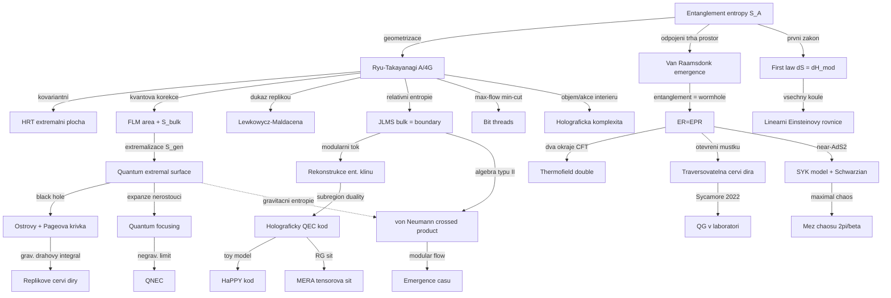

# Entanglement a emergence prostoročasu (Entanglement & Emergence of Spacetime (It from Qubit))

> **TL;DR** — Program „It from Qubit" tvrdí, že geometrie prostoročasu — a tím i gravitace — je *emergentní* a vyrůstá z kvantového entanglementu (quantum entanglement) podkladových mikroskopických stupňů volnosti. Hlavní oporou je holografie: Ryuova–Takayanagiho formule $S = A/4G_N$ identifikuje entanglementovou entropii okrajové oblasti s plochou minimální plochy v bulku, **Van Raamsdonk** (2010) ukázal, že rozpojení entanglementu trhá prostoročas na dvě části, a **Faulkner et al.** (2014) odvodili *linearizované Einsteinovy rovnice* z prvního zákona entanglementu. Souběžně **ER=EPR** (Maldacena–Susskind 2013) ztotožňuje entanglement s červími dírami, **tensorové sítě** (MERA, HaPPY kód) realizují holografii jako kvantový samoopravný kód, a kvantové extremální plochy (QES) s ostrovy reprodukují Pageovu křivku. Otevřené fronty 2024–2026: emergence *času* (na rozdíl od prostoru), von Neumannovy algebry typu II a crossed product jako exaktní jazyk pro gravitační entropii, holografie mimo AdS (de Sitter, kosmologie) a laboratorní simulace na kvantových procesorech.

## Přehled a historický kontext

Myšlenka, že prostoročas není fundamentální, ale emergentní, má kořeny v termodynamice černých děr (Bekenstein–Hawking, $S_{BH}=A/4G$) a v Maldacenově korespondenci AdS/CFT (1997). Pilíř „Entanglement & Emergence of Spacetime" — programově nazývaný **It from Qubit** (parafráze Wheelerova „It from Bit"; pod tímto názvem běží i velký kolaborativní program financovaný Simons Foundation od r. 2015) — se zformoval ve třech vlnách.

Intelektuální předpoklady jsou tři. (i) **Bekenstein–Hawking** ukázali, že entropie černé díry škáluje s *plochou* horizontu, ne objemem, což naznačuje, že informace v gravitaci je „holografická" a žije na hranici. (ii) **Bombelli–Koul–Lee–Sorkin** (1986) a později **Srednicki** (1993) zjistili, že entanglementová entropie kvantového pole v základním stavu se řídí **area law** $S \sim A/\epsilon^{d-1}$ s UV cutoffem $\epsilon$ — táž plošná struktura jako $S_{BH}$. To je první náznak, že entropie černé díry *je* entanglementová entropie. (iii) **Maldacena** (1997) dal exaktní dualitu, v níž lze tuto domněnku kvantitativně testovat. Klíčovým technickým nástrojem napříč všemi vlnami je **replikový trik** (replica trick): $S_A = -\partial_n \mathrm{Tr}\,\rho_A^n |_{n=1}$, kde $\mathrm{Tr}\,\rho_A^n$ se počítá na $n$-násobném větvovém krytu (branched cover) sešitém podél $A$.

**První vlna (2006–2010): geometrizace entanglementu.** **Ryu a Takayanagi** (2006) navrhli, že entanglementová entropie (entanglement entropy) podoblasti okrajové CFT se rovná ploše minimální plochy v bulku AdS — geometrický překlad čistě kvantově-informační veličiny. Pro interval délky $\ell$ v 2D CFT s centrálním nábojem $c$ reprodukuje formule přesný výsledek $S = \tfrac{c}{3}\ln(\ell/\epsilon)$, čímž identifikuje $c = 3L/2G_N$ (Brownova–Henneauxova centrální náboj). **Hubeny, Rangamani a Takayanagi** (2007, „HRT") rozšířili formuli na časově závislé prostoročasy přechodem od minimálních k *extremálním* plochám (minimum plochy podél prostoru, maximum podél času). **Van Raamsdonk** (2010) v eseji oceněné Gravity Research Foundation formuloval ústřední tezi: *„the emergence of classically connected spacetimes is intimately related to the quantum entanglement of degrees of freedom"* (emergence klasicky propojených prostoročasů je úzce spjata s kvantovým entanglementem stupňů volnosti). Rozpojení entanglementu mezi dvěma oblastmi vede k jejich „odtržení a odštípnutí" (pulling apart and pinching off); kvantitativně: redukce mutuální informace $I(A{:}B)=S_A+S_B-S_{AB}$ na nulu odpovídá rozpadu prostoročasu na dva nepropojené kusy. Na téže myšlenkové linii **Casini–Huerta** (2011) konformně zobrazili kulovou oblast na Rindlerův klín a ukázali, že modulární Hamiltonián je generátorem boostu — což později umožnilo odvození Einsteinových rovnic.

**Druhá vlna (2013–2016): gravitace z informace.** **Maldacena a Susskind** (2013) vyslovili **ER=EPR**: každý entanglovaný pár je propojen Einsteinovým–Rosenovým můstkem. **Faulkner, Guica, Hartman, Myers a Van Raamsdonk** (2014) odvodili linearizované Einsteinovy rovnice kolem AdS z *prvního zákona entanglementu*. **Swingle** (2012) a **Pastawski–Yoshida–Harlow–Preskill** (2015, „HaPPY") propojili holografii s tensorovými sítěmi a kvantovou error-correction. **Faulkner–Lewkowycz–Maldacena** (2013, „FLM") přidali kvantové korekce k RT, **Jafferis–Lewkowycz–Maldacena–Suh** (2016, „JLMS") dokázali rovnost relativních entropií, a **Engelhardt–Wall** (2014) definovali **kvantovou extremální plochu (QES)**.

Mezi druhou a třetí vlnou se rozvinula i **komplexitní větev**: Susskind (2014) navrhl, že *růst objemu interiéru* věčné černé díry (který pokračuje dlouho po termalizaci) je dual *výpočetní komplexity* okrajového stavu — „complexity = volume" (CV), záhy zostřené na „complexity = action" (CA, Brown et al. 2015). Tato linie propojuje emergenci prostoročasu *za horizontem* s kvantovým výpočtem a s tenzorovými sítěmi (komplexita = počet hradel). Paralelně Gao–Jafferis–Wall (2017) a Maldacena–Qi (2018) ukázali, že entanglovaný (TFD) můstek lze učinit *traversovatelným* zápornou nulovou energií — konkrétní, dynamická realizace ER=EPR a most ke kvantové teleportaci.

**Třetí vlna (2019–2026): Pageova křivka a algebraický jazyk.** V roce 2019 **Penington** a nezávisle **Almheiri–Engelhardt–Marolf–Maxfield** odvodili Pageovu křivku vypařující se černé díry pomocí QES a **ostrovů (islands)**: před Pageovým časem $t_{Page}$ dominuje triviální (prázdný) QES a entropie záření roste, po něm převezme vládu netriviální QES těsně uvnitř horizontu, který srazí entropii dolů — celkový průběh sleduje **Pageovu křivku** s vrcholem v $S_{BH}/2$. **Replikové červí díry** (replica wormholes, Penington–Shenker–Stanford–Yang a Almheiri et al. 2019/2020) tuto ostrovní formuli odvodily z gravitačního dráhového integrálu: nové sedlové body, kde se repliky propojí bulkovým můstkem, dominují právě po Pageově čase. Vedlejším produktem je **faktorizační hádanka** (factorization puzzle) — gravitační dráhový integrál zřejmě počítá *ansámblový průměr*, ne jedinou teorii. Od ~2022 se těžiště přesouvá k **von Neumannovým algebrám typu II** a **crossed product** konstrukci (Witten 2021; Chandrasekaran–Penington–Witten 2022; Chandrasekaran–Longo–Penington–Witten 2022 pro de Sitter), které dávají algebraicky přesné renderování gravitační entropie ($S_{gen}$ jako *přesná* entropie algebry, ne jen aproximace) a otevírají cestu k „emergenci času" přes modulární tok. Současně se idea „kvantové gravitace v laboratoři" materializovala v simulaci traversovatelné červí díry na procesoru Google Sycamore (2022), byť s ostrou metodologickou diskusí, zda jde o gravitaci nebo generický scrambling.

## Klíčové koncepty

- **Entanglementová entropie (entanglement entropy).** $S_A = -\mathrm{Tr}(\rho_A \ln \rho_A)$ pro redukovanou matici hustoty $\rho_A = \mathrm{Tr}_{\bar A}\,|\psi\rangle\langle\psi|$. Míra kvantových korelací mezi oblastí $A$ a jejím doplňkem. V QFT divergentní, řídí se „area law" (plošný zákon) s UV cutoffem.
- **Ryuova–Takayanagiho formule (Ryu–Takayanagi, RT).** $S_A = \mathrm{Area}(\gamma_A)/4G_N$, kde $\gamma_A$ je minimální plocha v bulku kotvící na $\partial A$ a homologní k $A$. Geometrizuje entanglement.
- **HRT (Hubeny–Rangamani–Takayanagi).** Kovariantní zobecnění RT: $\gamma_A$ je *extremální* (ne minimální) codim-2 plocha v plné Lorentzovské geometrii; pro statické prostoročasy splývá s RT.
- **Generalizovaná entropie (generalized entropy).** $S_{gen} = \mathrm{Area}(\Sigma)/4G_N + S_{bulk}(\Sigma)$. Součet geometrického plošného členu a entanglementové entropie bulkových kvantových polí; konečná, UV-renormalizovaná veličina.
- **Kvantová extremální plocha (quantum extremal surface, QES).** Plocha extremizující $S_{gen}$ (ne jen plochu); Engelhardt–Wall 2014. Při degeneraci se bere minimum. Klíč k Pageově křivce.
- **FLM korekce (Faulkner–Lewkowycz–Maldacena).** Jednosmyčková kvantová korekce RT: $S_A = \mathrm{Area}/4G_N + S_{bulk} + \dots$; bulkový člen je entanglement bulkových polí přes RT plochu.
- **Ostrovy (islands).** Odpojené gravitující oblasti $I$ v nitru černé díry, jež po Pageově čase patří do entanglementového klínu záření; bez nich roste entropie záření neomezeně. Hranice ostrova $\partial I$ je QES těsně uvnitř (Penington) nebo vně horizontu.
- **Replikové červí díry (replica wormholes).** Nové sedlové body gravitačního dráhového integrálu, kde se $n$ replik propojí bulkovým můstkem; reprodukují ostrovní formuli a unitární Pageovu křivku. Dominují právě po Pageově čase a implikují ansámblovou interpretaci (faktorizační hádanka).
- **ER=EPR.** Entanglement (EPR) dvou systémů $\equiv$ Einsteinův–Rosenův můstek (ER, červí díra) mezi nimi. Maximálně entanglovaný pár černých děr = wormhole. Můstek *není* traversovatelný klasicky (chrání kauzalitu), ale stává se jím při vhodné nelokální vazbě (Gao–Jafferis–Wall). Konjekturní řešení AMPS firewallu: za horizontem nesedí „zeď energie", ale druhá strana entanglovaného páru.
- **Termofield double (TFD).** $|\mathrm{TFD}\rangle = Z^{-1/2}\sum_n e^{-\beta E_n/2}|n\rangle_L|n\rangle_R$; čistý entanglovaný stav dvou kopií CFT duální *věčné* černé díře v AdS (Maldacena 2001).
- **Rekonstrukce entanglementového klínu (entanglement wedge reconstruction).** Bulkový operátor v entanglementovém klínu okrajové oblasti $A$ je rekonstruovatelný z operátorů na $A$ (Petzova mapa, modulární tok). Subregionová dualita (subregion duality).
- **JLMS relace.** Okrajová relativní entropie = bulková relativní entropie; okrajový modulární Hamiltonián = plošný operátor RT plochy + bulkový modulární Hamiltonián.
- **Holografický kvantový error-correcting kód (holographic QEC).** Bulkové logické qubity redundantně zakódované do okrajových fyzických qubitů; vysvětluje subregionovou dualitu a radial commutativity.
- **HaPPY kód.** Tensorová síť z „perfektních tensorů" (pentagony/hexagony) na hyperbolické mřížce; toy model AdS/CFT splňující RT a zápornost tripartitní informace.
- **MERA (multiscale entanglement renormalization ansatz).** Tensorová síť pro kritické stavy; emergentní radiální rozměr = RG škála $\to$ diskrétní AdS řez (Swingle 2012).
- **Bit threads (bitová vlákna).** Reformulace RT přes max-flow/min-cut: $S_A = \max$ tok diverzence-prostého, normou omezeného pole z $A$; vlákna Planckovy tloušťky.
- **První zákon entanglementu (first law of entanglement).** $\delta S_A = \delta \langle H_A\rangle$ pro malé perturbace, kde $H_A$ je modulární Hamiltonián; přesný kvantový analog $dE = TdS$.
- **Holografická komplexita (holographic complexity).** Výpočetní komplexita okrajového stavu = objem maximálního řezu (CV) nebo akce Wheelerovy–DeWittovy oblasti (CA); popisuje růst interiéru za horizontem.
- **Kvantová fokusační dohada (quantum focusing conjecture, QFC).** Kvantová expanze $\Theta = \frac{4G_N}{\sqrt{h}}\frac{\delta S_{gen}}{\delta\lambda}$ neroste podél nulové kongruence; implikuje Boussovu mez a QNEC.
- **Kvantová nulová energetická podmínka (quantum null energy condition, QNEC).** $\langle T_{kk}\rangle \ge \frac{1}{2\pi\sqrt{h}}S''_A$; dolní mez stresového tenzoru přes druhou variaci entropie. Negravitační limit QFC.
- **SYK model (Sachdev–Ye–Kitaev).** $N$ Majoranových fermionů s náhodnými all-to-all vazbami; maximální chaos, emergentní reparametrizační symetrie, Schwarzianova akce $\to$ near-AdS$_2$ holografie.
- **Schwarzian.** Efektivní akce $\propto -\int \mathrm{Sch}(f,t)$ řídící nízkoenergetickou dynamiku JT gravitace a SYK; pseudo-Goldstone narušené reparametrizační symetrie.
- **Pseudoentropie / timelike entanglement (pseudo-entropy).** Zobecnění entanglementové entropie na nehermitovské „přechodové" matice hustoty; komplexní hodnota, nástroj pro emergenci *času* v kosmologické holografii.
- **Von Neumannova algebra typu II / crossed product.** Po zahrnutí gravitace se algebra observable v podoblasti mění z typu III$_1$ na typ II; připouští dobře definovanou (renormalizovanou) entropii — algebraický původ $A/4G$.
- **Modulární tok (modular flow) a half-sided modular flow.** Tok generovaný modulárním Hamiltoniánem $\rho_A^{it}$ (Tomita–Takesaki); pro Rindler je to boost. Half-sided modular inclusion generuje translace a je kandidátem na *emergenci času*.
- **Mutuální informace a monogamie (mutual information, monogamy).** $I(A{:}B)=S_A+S_B-S_{AB}\ge 0$; holografické stavy splňují *monogamii mutuální informace* (negativní tripartitní informace $I_3\le 0$) — silné omezení odlišující holografické stavy.
- **Holografická entropy cone.** Soubor lineárních nerovností (subadditivita, strong subadditivity, monogamie, a vyšší) charakterizující, které vektory entropií jsou realizovatelné geometrickou (RT) plochou; kovariantní (HRT) verze je předmětem výzkumu 2026.
- **Mez chaosu (chaos bound, MSS).** Maldacena–Shenker–Stanford: Lyapunovův exponent OTOC korelátoru $\lambda_L \le 2\pi/\beta$; saturace = maximální chaos, vlastnost černých děr a SYK.
- **Code subspace a aproximativní QEC.** Bulková nízkoenergetická pole = logický podprostor (code subspace) redundantně zakódovaný do okrajových stupňů volnosti; rekonstrukce je *aproximativní* error correction (Petzova mapa, twirled Petz).
- **Pythonova obědová domněnka (Python's lunch).** Geometrie s neminimálním („obědovým") QES indikuje exponenciálně těžkou rekonstrukci bulkové oblasti; spojuje komplexitu s geometrií entanglementového klínu.
- **Generalized second law (GSL).** Zobecněný druhý zákon: $\delta S_{gen}\ge 0$ podél kauzálního horizontu; mostí termodynamiku černých děr s entanglementem a je důsledkem QFC.
- **Relativní entropie (relative entropy).** $S(\rho\|\sigma) = \mathrm{Tr}(\rho\ln\rho) - \mathrm{Tr}(\rho\ln\sigma)\ge 0$; míra rozlišitelnosti stavů, monotónní pod parciální stopou. Pozitivita + monotonie dávají energetické nerovnosti (ANEC, QNEC) a jsou *přesnou* kontrolou RT (JLMS).
- **Rychlé scramblování a butterfly velocity (fast scrambling, butterfly velocity).** Černé díry jsou *nejrychlejší scramblery* — informace se rozprostře za čas $t_* \sim \beta\ln S$; butterfly velocity $v_B$ měří prostorové šíření poruchy. SYK a holografické modely sdílejí tyto signatury.
- **Pseudoentropie (pseudo-entropy).** Zobecnění $S_A$ na nehermitovskou přechodovou matici $\rho^{1\to 2} = |\psi_1\rangle\langle\psi_2| / \langle\psi_2|\psi_1\rangle$; komplexní hodnota, holograficky daná plochou v *euklidovsky* pokračované geometrii. Nástroj pro emergenci času.
- **Exact holographic mapping (EHM).** Unitární zobrazení (Qi 2013) z bulkové na okrajovou Hilbertovu prostor realizující tensorovou síť; použito i jako most LQG ↔ holografie (Han–Hung).
- **It from BC-bit.** Van Raamsdonk II (2018): emergence prostoročasu nejen z entanglementu „bitů", ale z entanglementu *okrajových podmínek* (boundary-condition bits) — pokus o background-independentnější formulaci.

## Matematický rámec

$$ S_A = -\mathrm{Tr}\big(\rho_A \ln \rho_A\big), \qquad \rho_A = \mathrm{Tr}_{\bar A}\,|\psi\rangle\langle\psi| $$

Definice **entanglementové entropie**. $\rho_A$ je redukovaná matice hustoty oblasti $A$ získaná částečnou stopou přes doplněk $\bar A$; $S_A$ je von Neumannova entropie této matice. Měří kvantové korelace mezi $A$ a $\bar A$ v čistém stavu $|\psi\rangle$. Je to ústřední veličina celého pilíře — to, co se v holografii „překládá" na geometrii.

$$ S_A = \frac{\mathrm{Area}(\gamma_A)}{4 G_N} $$

**Ryuova–Takayanagiho formule.** $\gamma_A$ je minimální plocha v $(d{+}1)$-rozměrném bulku AdS, jejíž hranice splývá s $\partial A$ na okraji ($\partial\gamma_A = \partial A$) a která je homologní k $A$. $G_N$ je Newtonova konstanta v bulku. Význam: entanglementová entropie okrajové QFT je *geometrická* veličina — plocha v jedné dimenzi navíc. Stejná struktura jako Bekensteinova–Hawkingova entropie $S=A/4G$, ale pro libovolnou oblast, ne jen horizont.

$$ S_A = \underset{\gamma_A}{\mathrm{ext}}\,\Big[\frac{\mathrm{Area}(\gamma_A)}{4 G_N}\Big] \quad\text{(HRT, extremalizace v Lorentzovské geometrii)} $$

**HRT formule.** Pro časově závislé stavy se minimalizace nahradí *extremalizací* plochy přes všechny codim-2 spacelike plochy v plné Lorentzovské geometrii; při více extrémech se bere ta s nejmenší plochou. Obecně kovariantní vůči bulkovým i okrajovým difeomorfismům. Pro statické prostoročasy $\gamma_A$ leží na konstantním časovém řezu a HRT $=$ RT.

$$ S_{gen}(\Sigma) = \frac{\mathrm{Area}(\Sigma)}{4 G_N} + S_{bulk}(\Sigma) + (\text{counterterms}) $$

**Generalizovaná entropie.** Součet plošného členu a entanglementové entropie kvantových polí v bulku na jedné straně $\Sigma$. Plošný i bulkový člen jsou jednotlivě UV-divergentní, ale jejich součet je konečný (renormalizace $G_N$ pohlcuje divergence $S_{bulk}$). Veličina, kterou QES extremizuje a kterou QFC monitoruje.

$$ S_A = \min_{\Sigma}\,\underset{\Sigma}{\mathrm{ext}}\,\Big[\frac{\mathrm{Area}(\Sigma)}{4 G_N} + S_{bulk}(\Sigma)\Big] \quad\text{(QES / FLM-rozšířená RT)} $$

**Prescription kvantové extremální plochy (Engelhardt–Wall).** Entropie se počítá extremalizací *generalizované* entropie přes všechny plochy $\Sigma$ (ne jen plochy) a následným minimem přes řešení. Na vedoucím řádu (FLM 2013) je oprava $S_{bulk}$ jednosmyčková; QES je platná do všech řádů v $\hbar_{bulk}$. QES leží mimo kauzální vliv $A$ i $\bar A$ — to umožňuje rekonstrukci entanglementového klínu.

$$ S(\mathrm{rad}) = \min\,\mathrm{ext}_{I}\,\Big[\frac{\mathrm{Area}(\partial I)}{4 G_N} + S_{bulk}\big(\mathrm{rad}\cup I\big)\Big] $$

**Ostrovní formule (island formula).** Entropie Hawkingova záření (rad) je minimum přes „ostrovy" $I$ — odpojené oblasti v nitru černé díry — z plochy hranice ostrova $\partial I$ plus entanglementu polí na sjednocení záření a ostrova. Po Pageově čase netriviální ostrov srazí rostoucí entropii dolů a vznikne unitární **Pageova křivka**. Replikové červí díry tuto formuli odvozují z gravitačního dráhového integrálu.

$$ \delta S_A = \delta \langle H_A \rangle, \qquad H_A = -\ln \rho_A^{(0)} \quad\text{(první zákon entanglementu)} $$

**První zákon entanglementu.** Pro první řád perturbace stavu kolem reference $\rho_A^{(0)}$ se změna entanglementové entropie rovná změně očekávané hodnoty *modulárního Hamiltoniánu* $H_A$. Pro kulovou oblast poloměru $R$ v CFT vakuu je $H_A$ díky Casini–Huerta–Myers (2011) *explicitně lokální*: $H_A = 2\pi\int_A d^{d-1}x\,\frac{R^2 - r^2}{2R}\,T_{00}(x)$ — integrál energetické hustoty vážený konformním Killingovým vektorem (generátorem boostu). Tato lokalita je důvod, proč se z prvního zákona dají odvodit *lokální* (Einsteinovy) rovnice. Aplikováním na všechny kulové oblasti se z této rovnosti odvodí gravitační dynamika.

$$ \delta S_A^{(grav)} = \delta\langle H_A\rangle \;\Longleftrightarrow\; \delta G_{\mu\nu} = 8\pi G_N\,\delta T_{\mu\nu}\big|_{\text{lin. kolem AdS}} $$

**Linearizované Einsteinovy rovnice z entanglementu (Faulkner et al. 2014).** Pro malé perturbace AdS vakua je *množina prvních zákonů entanglementu pro všechny kulové oblasti* ekvivalentní *linearizovaným Einsteinovým rovnicím* kolem čistého AdS. Geometrický překlad: $\delta S_A = \delta\langle H_A\rangle$ na okraji se přes RT formuli rovná lineární Einsteinově rovnici v bulku. Gravitace zde *vyplývá* z termodynamiky entanglementu, nikoli se postuluje. Nelineární rozšíření (Faulkner et al. 2017) dává plné Einsteinovy rovnice na druhém řádu.

$$ S_{rel}(\rho\,\|\,\sigma)_{\partial} = S_{rel}(\rho\,\|\,\sigma)_{bulk}, \qquad H_A^{CFT} = \frac{\hat{A}}{4G_N} + H_{bulk}^{wedge} \quad\text{(JLMS)} $$

**JLMS relace.** Relativní entropie dvou blízkých stavů na okrajové podoblasti se rovná relativní entropii odpovídajících bulkových stavů v entanglementovém klínu. Ekvivalentně: okrajový modulární Hamiltonián se rozkládá na operátor plochy RT plochy $\hat A/4G_N$ plus bulkový modulární Hamiltonián. Klíčové pro rekonstrukci klínu a pro odvození rovnosti relativních entropií jako přesné kontroly RT.

$$ S_A = \max_{v}\int_A \sqrt{h}\,\,v_\mu n^\mu, \qquad \nabla_\mu v^\mu = 0,\;\; |v|\le \frac{1}{4G_N} \quad\text{(bit threads)} $$

**Bit threads / max-flow.** Reformulace RT přes Riemannovskou verzi věty max-flow/min-cut: $S_A$ = maximální tok diverzence-prostého vektorového pole $v$ s normou omezenou $1/4G_N$ skrz $A$. Maximální tok = plocha minimálního řezu = RT plocha. „Vlákna" $v$ reprezentují bilaterální entanglement; přirozeně implementují monogamii a nesting.

$$ \langle T_{kk}\rangle \;\ge\; \frac{1}{2\pi\sqrt{h}}\,\frac{\partial^2 S_{out}}{\partial \lambda^2} \quad\text{(QNEC)}, \qquad \Theta'_{quantum} \le 0 \quad\text{(QFC)} $$

**QNEC a QFC.** Kvantová fokusační dohada: kvantová expanze $\Theta = \frac{4G_N}{\sqrt{h}}\frac{\delta S_{gen}}{\delta\lambda}$ je nerostoucí podél nulové kongruence (kvantové zostření Raychaudhuriho). V negravitačním limitu se redukuje na QNEC: lokální nulová energie je zdola omezená *druhou* variací entropie podle nulového posunu $\lambda$. QNEC je dokázána pro volné, holografické i obecné Poincaré-invariantní QFT.

$$ H_A^{\text{ball}} = 2\pi\!\int_A d^{d-1}x\,\frac{R^2 - |\vec{x}-\vec{x}_0|^2}{2R}\,T_{00}(\vec{x}) $$

**Explicitní modulární Hamiltonián koule.** Pro kulovou oblast poloměru $R$ se středem $\vec{x}_0$ v CFT vakuu je modulární Hamiltonián *lokální* integrál energetické hustoty $T_{00}$ vážený konformním Killingovým vektorem (Casini–Huerta–Myers 2011). Tato lokalita je technické jádro odvození Einsteinových rovnic z entanglementu — bez ní by $H_A$ byl nelokální a překlad na bulkovou rovnici by selhal. Pro obecné (ne kulové) oblasti je $H_A$ nelokální.

$$ \frac{d\mathcal{C}_A}{dt}\;\xrightarrow{\,t\to\infty\,}\;\frac{2M}{\pi\hbar} \quad\text{(Lloydova mez)}, \qquad \mathcal{C}_{\max}\sim e^{S} $$

**Růst komplexity.** Pozdní rychlost růstu komplexity = akce dosahuje Lloydovy meze $2M/\pi\hbar$ (maximální rychlost výpočtu při energii $M$); komplexita roste lineárně po exponenciálně dlouhou dobu $\sim e^S$, než nasytí na maximu $\sim e^S$. Geometricky to popisuje lineární růst objemu Einsteinova–Rosenova můstku „za horizontem" — emergenci prostoru, který *není* zachycen entanglementovou entropií (ta nasytí mnohem dříve, v termalizačním čase). Komplexita je tak komplementární sondou emergence interiéru.

$$ \mathcal{C}_V = \max\frac{\mathrm{Vol}(\Sigma)}{G_N L}, \qquad \mathcal{C}_A = \frac{I_{WDW}}{\pi\hbar} \quad\text{(komplexita = objem / akce)} $$

**Holografická komplexita.** Komplexita = objem (CV): maximální objem codim-1 řezu $\Sigma$ kotvícího na okrajovém řezu, dělený $G_N L$ ($L$ = AdS poloměr). Komplexita = akce (CA): gravitační akce Wheelerovy–DeWittovy oblasti. Obě rostou lineárně v čase ($d\mathcal{C}/dt \sim 2M/\pi\hbar$ pro CA), dlouho po dosažení tepelné rovnováhy — popisují růst objemu interiéru černé díry „za horizontem".

$$ I_{SYK}^{IR} \;\supset\; -N\,\alpha_S\!\int dt\,\mathrm{Sch}\!\Big(f(t),t\Big), \qquad \lambda_L = \frac{2\pi}{\beta}\;(\text{maximal chaos}) $$

**SYK / Schwarzian.** V nízkoenergetickém (IR) limitu SYK modelu dominuje **Schwarzianova akce** $\mathrm{Sch}(f,t) = f'''/f' - \tfrac{3}{2}(f''/f')^2$, popisující měkký mód narušené reparametrizační symetrie. SYK saturuje Maldacena–Shenker–Stanfordovu mez chaosu $\lambda_L = 2\pi/\beta$ (maximální chaos), což je vlastnost černých děr. Schwarzianov sektor je duální near-AdS$_2$ (JT) gravitaci — nejjednodušší mikroskopický model holografie.

$$ S(\ell) = \frac{c}{3}\ln\!\Big(\frac{\ell}{\epsilon}\Big) \quad\text{(2D CFT interval)}, \qquad c = \frac{3 L}{2 G_N} \quad\text{(Brown–Henneaux)} $$

**Entanglement intervalu v 2D CFT a centrální náboj.** Pro interval délky $\ell$ v 2D CFT s centrálním nábojem $c$ a UV cutoffem $\epsilon$ je entanglementová entropie logaritmická. RT formule v AdS$_3$ reprodukuje přesně tento výsledek, čímž ztotožní centrální náboj $c$ s geometrickými veličinami $L$ (AdS poloměr) a $G_N$. Je to nejostřejší kvantitativní test RT, kde obě strany lze spočítat nezávisle.

$$ S_A = \frac{\mathrm{Area}(\gamma_A)}{4 G_N}\Big[\,1 + a_1\,\alpha' + \dots\,\Big], \qquad I(A{:}B) = S_A + S_B - S_{A\cup B} \ge 0 $$

**Korekce vyššího řádu a mutuální informace.** Vlevo: stringové ($\alpha'$) a vyšší-derivativní korekce k RT (Wald-podobné členy, Dong 2014) modifikují plošný funkcionál. Vpravo: **mutuální informace** $I(A{:}B)$ je UV-konečná míra korelací; její vymizení signalizuje rozpojení (Van Raamsdonk). Holografické stavy navíc splňují **monogamii** $I_3 = I(A{:}B)+I(A{:}C)-I(A{:}BC)\le 0$ (zápornost tripartitní informace), což je nutná podmínka existence klasického geometrického dualu.

$$ t_{\mathrm{Page}} \sim \frac{1}{2}\,t_{\mathrm{evap}}, \qquad S_{\mathrm{rad}}(t) = \min\Big[\,S_{\mathrm{Hawking}}(t),\ S_{BH}(t)\,\Big] $$

**Pageova křivka.** Entropie záření roste podle Hawkinga, dokud nedosáhne (klesající) entropie černé díry $S_{BH}(t)$ v Pageově čase $t_{Page}$ (zhruba polovina doby vypařování); poté klesá s $S_{BH}$ k nule. Ostrovní/QES formule tuto křivku reprodukuje přepnutím z triviálního na netriviální QES. Je to kvantitativní podpis *unitarity* vypařování — informace neuniká, jen se přemísťuje.

## Kvantitativní výsledky a testy

Síla programu spočívá v tom, že obě strany dualit lze v řadě případů spočítat nezávisle a porovnat. Vybrané ostré výsledky:

- **2D CFT / AdS$_3$.** Pro jeden interval délky $\ell$: $S = \tfrac{c}{3}\ln(\ell/\epsilon)$ z CFT (Holzhey–Larsen–Wilczek 1994; Calabrese–Cardy 2004) přesně reprodukováno RT plochou v AdS$_3$, s $c = 3L/2G_N$ (Brown–Henneaux 1986). Pro *dva* intervaly RT predikuje **fázový přechod** mezi „spojenou" a „rozpojenou" plochou při kritickém křížovém poměru — potvrzeno v CFT.
- **Vrchol Pageovy křivky.** Maximum entropie záření $= S_{BH}(t_{Page})$; pro Schwarzschild $S_{BH} = A/4G_N = 4\pi G_N M^2/\hbar c$ (v jednotkách $k_B$). Pageův čas $t_{Page} \approx \tfrac{1}{2} t_{evap}$ s $t_{evap}\sim G_N^2 M^3/\hbar c^4$.
- **Mez chaosu.** SYK i černé díry saturují $\lambda_L = 2\pi k_B T/\hbar$ (MSS 2015); jde o nejostřejší kvantitativní „signaturu gravitace" v many-body systému, ověřenou numericky pro SYK i v Sycamore experimentu.
- **Tripartitní informace.** Holografické stavy mají $I_3 \le 0$ (monogamie); HaPPY kód ji splňuje *exaktně*, což je netriviální test, že tensorová síť zachycuje holografickou strukturu entanglementu.
- **Lineární růst komplexity.** $d\mathcal{C}_A/dt \to 2M/\pi\hbar$ (Lloydova mez) v pozdním čase; objem interiéru roste lineárně po dobu $\sim e^{S}$, dokud komplexita nenasytí — testovatelné v explicitních AdS-Schwarzschild geometriích.
- **Relativní entropie jako kontrola RT.** Pozitivita a monotonie relativní entropie (JLMS) dávají energetické nerovnosti (averaged null energy, QNEC), které byly nezávisle ověřeny v holografických i volných QFT.

## Klíčové výsledky a milníky

- **Bombelli–Koul–Lee–Sorkin (1986) a Srednicki (1993).** Entanglementová entropie kvantového pole se řídí area law $S\sim A/\epsilon^{d-1}$ — táž plošná struktura jako $S_{BH}$; první náznak, že entropie černé díry je entanglementová. [Srednicki 1993](https://arxiv.org/abs/hep-th/9303048)
- **Maldacena, věčné černé díry v AdS (2001).** Maximálně rozšířený Schwarzschild-AdS je duální dvěma kopiím CFT v entanglovaném termofield double stavu; horizont = entanglement. Zárodek ER=EPR a TFD jazyka. [Maldacena 2001](https://arxiv.org/abs/hep-th/0106112)
- **Ryu–Takayanagi (2006).** $S_A = \mathrm{Area}(\gamma_A)/4G_N$ — entanglementová entropie = minimální plocha. Breakthrough Prize 2015, Diracova medaile ICTP 2024. [Ryu & Takayanagi 2006](https://arxiv.org/abs/hep-th/0603001)
- **HRT (2007).** Kovariantní zobecnění RT extremálními plochami pro dynamické prostoročasy. [Hubeny, Rangamani & Takayanagi 2007](https://arxiv.org/abs/0705.0016)
- **Van Raamsdonk, „Building up spacetime with quantum entanglement" (2010).** Teze, že rozpojení entanglementu trhá prostoročas; *„disentangling the degrees of freedom ... results in these regions pulling apart and pinching off"*. 1. cena Gravity Research Foundation. [Van Raamsdonk 2010](https://arxiv.org/abs/1005.3035)
- **Swingle, MERA jako geometrie (2012).** Tensorová síť MERA = diskrétní řez AdS; entanglementová renormalizace generuje emergentní radiální rozměr. [Swingle 2012](https://arxiv.org/abs/0905.1317)
- **Lewkowycz–Maldacena, generalizovaná gravitační entropie (2013).** Důkaz RT formule rozšířením replikového triku do bulku ($n\to 1$ analytické pokračování kónické singularity). [Lewkowycz & Maldacena 2013](https://arxiv.org/abs/1304.4926)
- **FLM, kvantové korekce k RT (2013).** $S_A = \mathrm{Area}/4G_N + S_{bulk}$ — jednosmyčková oprava bulkovým entanglementem. [Faulkner, Lewkowycz & Maldacena 2013](https://arxiv.org/abs/1307.2892)
- **Maldacena–Susskind, ER=EPR (2013).** *„Cool horizons for entangled black holes"*: entanglovaný pár ČD = Einsteinův–Rosenův můstek; konjekturní řešení AMPS firewallu. [Maldacena & Susskind 2013](https://arxiv.org/abs/1306.0533)
- **Faulkner–Guica–Hartman–Myers–Van Raamsdonk (2014).** Linearizované Einsteinovy rovnice z prvního zákona entanglementu pro všechny kulové oblasti. [Faulkner et al. 2014](https://arxiv.org/abs/1312.7856)
- **Engelhardt–Wall, QES (2014).** Extremalizace generalizované entropie $S_{gen}=A/4G_N+S_{bulk}$; platná do všech řádů v $\hbar_{bulk}$. [Engelhardt & Wall 2014](https://arxiv.org/abs/1408.3203)
- **Dong, holografická entropie pro higher-derivative gravitaci (2013).** Zobecnění RT mimo Einsteinovu gravitaci: plošný funkcionál = Waldova entropie + opravy extrinzické křivosti (Jacobson–Myers v Lovelocku). Klíčové pro $\alpha'$/stringové korekce. [Dong 2013](https://arxiv.org/abs/1310.5713)
- **Pastawski–Yoshida–Harlow–Preskill, HaPPY kód (2015).** Holografický QEC z perfektních tensorů; exaktní RT a subregionová dualita v toy modelu. [Pastawski et al. 2015](https://arxiv.org/abs/1503.06237)
- **Brown–Roberts–Susskind–Swingle–Zhao, komplexita = akce (2015/2016).** $\mathcal{C}_A = I_{WDW}/\pi\hbar$; černé díry jako nejrychlejší počítače v přírodě (Lloydova mez). [Brown et al. 2015](https://arxiv.org/abs/1509.07876)
- **Bousso–Fisher–Leichenauer–Wall, QFC (2015).** Kvantová expanze nerostoucí; sjednocuje Boussovu mez, QNEC, konzistenci QES. [Bousso et al. 2015](https://arxiv.org/abs/1506.02669)
- **Maldacena–Stanford, SYK (2016).** Řešení SYK v limitu velkého $N$; Schwarzianova akce, maximální chaos, near-AdS$_2$. [Maldacena & Stanford 2016](https://arxiv.org/abs/1604.07818)
- **Jafferis–Lewkowycz–Maldacena–Suh, JLMS (2016).** Okrajová relativní entropie = bulková; $H_A^{CFT}=\hat A/4G_N + H_{bulk}$. [Jafferis et al. 2015](https://arxiv.org/abs/1512.06431)
- **Dong–Harlow–Wall, rekonstrukce entanglementového klínu (2016).** Bulkový operátor v klínu $A$ rekonstruovatelný z $A$; modulární tok / relativní entropie. [Dong, Harlow & Wall 2016](https://arxiv.org/abs/1601.05416)
- **Freedman–Headrick, bit threads (2016).** Max-flow/min-cut reformulace RT bez explicitní minimální plochy. [Freedman & Headrick 2016](https://arxiv.org/abs/1604.00354)
- **Gao–Jafferis–Wall, traversovatelná červí díra (2017).** Double-trace deformace spojující dva okraje BTZ generuje zápornou nulovou energii a otevírá ER můstek. [Gao, Jafferis & Wall 2017](https://arxiv.org/abs/1608.05687)
- **Maldacena–Qi, věčná traversovatelná červí díra (2018).** Dva SYK systémy spojené relevantní interakcí dávají near-AdS$_2$ věčnou traversovatelnou červí díru; základní stav je blízký TFD a má Hawking–Page přechod při konečné teplotě. [Maldacena & Qi 2018](https://arxiv.org/abs/1804.00491)
- **Casini–Huerta–Myers (2011).** Modulární Hamiltonián kulové oblasti = generátor boostu (konformní mapa na Rindler); klíčový stavební kámen pro odvození Einsteinových rovnic z entanglementu. [Casini, Huerta & Myers 2011](https://arxiv.org/abs/1102.0440)
- **Penington / Almheiri–Engelhardt–Marolf–Maxfield, Pageova křivka (2019).** QES + ostrovy reprodukují unitární Pageovu křivku vypařující se ČD. [Almheiri, Engelhardt, Marolf & Maxfield 2019](https://arxiv.org/abs/1905.08762); [Penington 2019](https://arxiv.org/abs/1905.08255)
- **Almheiri–Mahajan–Maldacena–Zhao, Pageova křivka ze semiklasické geometrie (2019).** Ostrovy v modelu 2D gravitace + holografická hmota; QES = RT plocha vyšší dimenze; explicitní Pageova křivka v duchu ER=EPR. [Almheiri et al. 2019](https://arxiv.org/abs/1908.10996)
- **Penington–Shenker–Stanford–Yang / Almheiri et al., replikové červí díry (2019/2020).** Ostrovní formuli odvozují přímo z gravitačního dráhového integrálu novými replikovými sedly; vede k faktorizační hádance a ansámblové interpretaci. [Penington et al. 2019](https://arxiv.org/abs/1911.11977)
- **Traversovatelná červí díra na Sycamore (2022).** Simulace sparsifikovaného SYK na 9 qubitech (164 dvouqubitových hradel) reprodukuje teleportaci „skrz červí díru". *Nature* 612, 51–55. [Jafferis et al. 2022](https://www.nature.com/articles/s41586-022-05424-3)
- **Crossed product / von Neumann typ II (2022–2023).** Witten a Chandrasekaran–Penington–Witten ukazují, že zahrnutí gravitační vazby mění algebru observable z typu III$_1$ na typ II, čímž dává algebraicky přesnou (renormalizovanou) gravitační entropii. [Chandrasekaran, Penington & Witten 2022](https://arxiv.org/abs/2209.10454)

## Současný stav (2024–2026)

Pole se po „islands revolution" (2019–2021) přesunulo od kvalitativních obrázků k *přesnému matematickému jazyku*. Dominantním trendem je **operátorově-algebraická formulace**: generalizovaná entropie přestala být jen geometrickým odhadem a stala se *přesnou* von Neumannovou entropií algebry typu II, kterou gravitace vytváří z původně „bezstopé" algebry typu III$_1$. Druhým velkým směrem je *posun za AdS* — k de Sitterovi, kosmologii a k otázce emergence *času*, kde dosavadní nástroje (RT, JLMS) selhávají. Třetím je *materializace v laboratoři* (kvantové procesory, studené atomy) a čtvrtým *sebereflexe a kritika* — výzkum toho, kdy RT-podobné chování *neznamená* emergentní geometrii.

- **Von Neumannovy algebry a crossed product jako hlavní jazyk.** Rozsáhlý přehled Hong Liua *„Lectures on entanglement, von Neumann algebras, and emergence of spacetime"* (TASI 2023, publikováno 10/2025) kodifikuje program: typy I/II/III, modulární a half-sided modular flow, crossed product, subregion–subalgebra dualita, algebraická formulace ostrovů a firewallů. Generalizovaná entropie je zde *přesná* entropie algebry typu II, nikoli jen geometrický odhad. [Liu 2025](https://arxiv.org/abs/2510.07017)
- **Emergence času (ne jen prostoru).** Klíčová otevřená fronta: RT/QES vysvětlují emergenci *prostorových* rozměrů, ale jak emerguje *čas*? Pokroky přes half-sided modulární tok (Connes cocycle, kink transformace) a přes **pseudoentropii / timelike entanglement** v kosmologické a de Sitter holografii. Takayanagiho esej v PRL (2025) explicitně formuluje, zda časová souřadnice „emerguje z kvantové informace" a které kvantové obvody odpovídají holografickému prostoročasu. [Takayanagi 2025](https://arxiv.org/abs/2506.06595)
- **Holografie mimo AdS.** De Sitter konektivita z holografického entanglementu (2024); dS/CFT je obtížnější, neboť duální CFT je *neunitární* a čas má emergovat z euklidovské CFT. Práce o „de Sitter connectivity from holographic entanglement" a kvantových korekcích ke kosmologické konstantě. [de Sitter connectivity 2024](https://arxiv.org/abs/2403.14889)
- **Laboratorní program „QG v laboratoři".** Po Sycamore (2022) pokračují simulace SYK a traversovatelných červích děr na kvantových procesorech a v optických dutinách; intenzivní debata o tom, nakolik jde o „skutečnou" gravitaci (komentáře a kritiky 2023).
- **Přesné testy bulkového entanglementu a JLMS v error-correcting kódech.** Práce 2024–2026 zpřesňují FLM/JLMS formuli v aproximativních QEC kódech (např. „JLMS formula in a large code with approximate error correction", 2026) a v hyperinvariantních / holografických tensorových sítích.
- **Covariant holographic entropy cone — vyřešeno (2025–2026).** Aktivní program klasifikace nerovností mezi entanglementovými entropiemi (entropy cone) dosáhl v kovariantní (HRT) verzi zlomu: konstrukcí grafového modelu přímo z kauzální struktury entanglementových klínů a důkazem „no-short-cut" teorému byla ukázána *ekvivalence kovariantního a statického* entropy cone (2026) — všechny základní výsledky (polyedralita, konečnost soustavy nerovností) se přenášejí na obecné holografické stavy (za podmínky existence „exposed regions"). [Zhao, Graph models for covariant holographic entropy I, 2026](https://arxiv.org/abs/2602.04888). Nezávisle nová charakterizace přes Markovovy stavy (majorizační test) potvrzuje, že HRT a RT cone splývají [Grimaldi, Headrick & Hubeny 2025](https://arxiv.org/abs/2508.21823).
- **Kritika a meze programu.** Belin–Bintanja–Castro–Knop, „Symmetric product orbifold universality and the mirage of an emergent spacetime" (JHEP 2025), ukazují, že symmetrické orbifoldy reprodukují BTZ-podobné termální korelátory při velkém $N$, *aniž* by byly duální semiklasické gravitaci — varování, že RT-podobné chování není dostatečnou podmínkou pro klasický bulk. [Belin et al. 2025](https://arxiv.org/abs/2502.01734). Teorém, že *maximálně* entanglované stavy nemají rekonstruovatelný prostoročas, ukazuje, že geometrie vyžaduje *intermediate* (ne maximální) entanglement.
- **Pseudoentropie a timelike entanglement jako sondy času.** Roste literatura používající nehermitovské „přechodové" matice hustoty (transition matrices) a *timelike* entanglementovou entropii (komplexní hodnota) jako diagnostiku emergence časové souřadnice v dS/CFT a kosmologii; interpretace imaginární části je explicitně otevřená. Práce 2025–2026 ukazují, že holografická timelike EE v BTZ pozadí se skládá z *prostoročasových i časupodobných* úseků extremální plochy, jež sahají z interiéru do exteriéru černé díry — explicitní geometrická realizace „časupodobného" entanglementu za horizontem.
- **De Sitter konektivita a static-patch holografie (Franken 2024).** Pro dva antipodální pozorovatele v de Sitteru emerguje propojenost prostoročasu mezi holografickými „screeny" na (natažených) horizontech z entanglementu jejich kauzálních klínů; rekonstrukce entanglementového klínu rozšiřuje static-patch holografii o exteriérovou oblast spojující oba klíny. [Franken 2024](https://arxiv.org/abs/2403.14889). Jde o jeden z mála kontrolovaných pokusů přenést RT/EWR slovník mimo AdS.
- **Holografie informace a split property.** Rajuova škola (holography of information) tvrdí, že v gravitaci je veškerá informace na Cauchyho řezu zakódována i u jeho okraje — gravitace porušuje *split property* QFT. Toto napětí mezi lokalitou a holografií je aktivně diskutováno ve vztahu k rekonstrukci entanglementového klínu.
- **Aproximativní QEC a Petzova mapa v realistických kódech.** Práce 2024–2026 (např. „The JLMS formula in a large code with approximate error correction", 2026) zpřesňují, jak přesně platí JLMS/FLM v kódech s konečnou přesností; klíčové pro pochopení, kde rekonstrukce klínu selhává (Pythonova obědová komplexita).

## Otevřené problémy

1. **Emergence času.** RT/QES geometrizují *prostorový* entanglement, ale chybí stejně ostrá formulace emergence *časové* souřadnice. Půlstranný modulární tok a pseudoentropie dávají vodítka, ale ne úplný slovník. *Proč těžké:* čas v kvantové gravitaci je spjat s problémem času (Wheeler–DeWitt, $H|\psi\rangle=0$); modulární „čas" není totožný s geometrickým časem a v Lorentzovské signatuře chybí pozitivně definitní matice hustoty. *Pokusy:* half-sided modular inclusion, Connes cocycle a kink transformace; timelike entanglement a pseudoentropie v dS/CFT.
2. **Emergence prostoročasu mimo AdS.** Celá konstrukce (RT, FLM, JLMS) je nejostřejší v AdS s konformní hranicí. Pro de Sitter (kosmologie) a plochý prostor chybí unitární okrajová teorie, RT plochy a slovník. *Proč těžké:* dS/CFT duál je neunitární; v kosmologii není asymptotická hranice typu AdS, kam by se entanglement „připnul". *Pokusy:* dS/CFT (Strominger), de Sitter connectivity from holographic entanglement (2024), celestiální/Carrollovská holografie, crossed product pro dS observery (CLPW 2022).
3. **Mikroskopický původ replikových červích děr a faktorizace.** Replikové červí díry reprodukují Pageovu křivku, ale jejich započtení implikuje, že gravitační dráhový integrál počítá *ansámblový průměr*, ne jedinou teorii (faktorizační puzzle). *Proč těžké:* v $d>2$ není znám mikroskopický (single-theory) výklad; rozpor mezi „wormholes" a faktorizací partiční funkce produktu CFT. *Pokusy:* ansámblová interpretace v JT gravitaci (Saad–Shenker–Stanford), half-wormholes, baby universes a alpha-stavy.
4. **Která entanglementová struktura dává klasickou geometrii?** Ne každý entanglovaný stav má geometrický dual; maximální entanglement geometrii ničí, holografická entropy cone vymezuje nutné nerovnosti. *Proč těžké:* chybí postačující kritérium (konvexita kódu, „large-$N$ factorization", entropy-cone příslušnost) odlišující geometrické stavy od „mirage" stavů (symmetric product orbifold). *Pokusy:* holografická entropy cone (kovariantní verze 2026), code-subspace kritéria, mirage kritiky (JHEP 2025).
5. **Background independence a dynamická emergence.** Holografická emergence je *kinematická* (geometrie kolem pevného AdS pozadí); jak emerguje *celé* pozadí, včetně topologie a kosmologie, z čistě informačních principů? *Proč těžké:* AdS/CFT předpokládá asymptotiku; chybí formulace bez fixní hranice (na rozdíl od LQG/spin-foam, kde je background independence vestavěná). *Pokusy:* tensor-network a algebraické (subregion–subalgebra) konstrukce; spekulativní „It from BC-bit" (Van Raamsdonk II 2018).
6. **Přesná definice komplexity a jednoznačnost CV vs. CA.** Komplexita = objem i = akce trpí ambiguitami (volba reference state, normalizace null hranic, „complexity = anything"). *Proč těžké:* neexistuje jednoznačná definice kvantové výpočetní komplexity nezávislá na volbě bran/tolerance; různé proposaly se liší o členy řádu objemu. *Pokusy:* complexity=anything rodina, Nielsenova geometrická komplexita, Krylov/spread complexity, první zákon komplexity.
7. **Status QFC jako axiomu vs. teorému.** QFC je dokázána jen v omezených případech (holografie, volná pole); obecný důkaz chybí, přesto se z ní odvozují Boussova mez, QNEC, generalized second law. *Proč těžké:* vyžaduje kontrolu nad $S_{gen}$ v plně dynamické gravitaci, kde $S_{bulk}$ není výpočetně dostupné. *Pokusy:* holografický důkaz QNEC (2016), důkazy pro volná pole, perturbativní QFC kolem AdS.
8. **Realismus „QG v laboratoři".** Sycamore experiment simuluje *sparsifikovaný* SYK; debatuje se, zda zachovává gravitační rysy nebo jen dynamiku rozptylu. *Proč těžké:* odlišit „opravdovou" emergentní gravitační dynamiku od generického chaotického scramblingu vyžaduje robustní, na implementaci nezávislé signatury (size winding, Shapiro delay). *Pokusy:* Sycamore experiment (2022) a navazující kritické komentáře (2023); návrhy ostřejších pozorovatelných a škálování k většímu $N$.

## Vztahy k ostatním přístupům

Tento pilíř je *spojkou* mezi kvantovou informací a geometrií, a proto má mimořádně mnoho mostů k ostatním přístupům. U každého uvádíme, jak dobře je vztah prozkoumán — to je pro projekt nejdůležitější metadatum, neboť řídí, kde hledat dosud neobjevená spojení.

### Holografie a AdS/CFT (holography-adscft) — **dobře prozkoumáno**
Tento pilíř je *vnitřní motor* holografie: RT, FLM, QES, JLMS, ostrovy jsou všechny formulovány v AdS/CFT. Vztah je obousměrný a hluboce zmapovaný — entanglement dává holografii kvantově-informační čtení (geometrie = entanglement) a holografie dává entanglementu konkrétní bulkový dual. Hranice mezi pilíři je spíše dělba práce než neprozkoumaná mezera.

### Černé díry a informace (black-holes-information) — **dobře prozkoumáno**
QES + ostrovy + replikové červí díry řeší paradox informace reprodukcí Pageovy křivky; ER=EPR řeší firewall (AMPS). Bekensteinova–Hawkingova entropie je speciální případ RT/generalizované entropie pro horizont, a generalized second law je entanglementová verze zákona rostoucí plochy. Strominger–Vafa mikroskopické počítání stavů a entanglementová entropie horizontu jsou dva pohledy na tutéž $A/4G$. Vztah je extrémně dobře prozkoumaný (2019–2024); zbývající mezery jsou *mikroskopický* výklad replikových sedel, faktorizační hádanka a status interiéru po Pageově čase (firewall vs. hladký horizont).

### Strunová teorie (string-theory) — **dobře prozkoumáno**
Mateřský rámec: AdS/CFT vyrůstá z dynamiky D-bran, Strominger–Vafa entropie z degenerace strunových BPS stavů. Entanglementová geometrie je nízkoenergetický, „informační" pohled na tutéž strukturu; $\alpha'$ (stringové) korekce k RT plošnému funkcionálu jsou explicitně dány Dongovou higher-derivative formulí. SYK/JT model je *nestrunový* mikroskopický příklad holografie, což ukazuje, že emergence z entanglementu nepotřebuje plný strunový aparát. Dobře prozkoumané; otevřená je otázka, zda emergence prostoročasu z entanglementu platí i mimo strunové konstrukce a co přesně z holografie je „strunové" a co univerzálně informační.

### Loop quantum gravity (loop-quantum-gravity) — **částečně prozkoumáno**
Existují explicitní mosty: spin-network stavy LQG jako *exact holographic mapping* a jako tensorové sítě (Han–Hung 2017; „holographic entanglement in spin network states", 2022; „From SU(2) holonomies to holographic duality via tensor networks", 2024). Obě strany sdílejí: entanglement → area law, diskrétní geometrie z kvantových korelací. *Mezera:* LQG má background independence a žádný preferovaný AdS dual; sladění RT plošného zákona s LQG spektrem plochy ($A \sim 8\pi\gamma\ell_P^2\sum\sqrt{j(j+1)}$) je jen ilustrativní, ne odvozené. Bohatá, ale ne uzavřená oblast — kandidát na hlubší most.

### Causal sets (causal-sets) — **sotva prozkoumáno**
Sdílená intuice: entanglementová entropie a area law jako most ke kauzální struktuře; Sorkinova–Yazdiho „spacetime entanglement entropy" v causal setu dává area-law výsledek. Ale propojení s RT/QES je téměř nezmapované. *Mezera:* causal sets mají fundamentální Lorentzovskou kauzalitu (přirozeně by mohly osvětlit emergenci času, kterou RT řeší špatně) — potenciálně cenný, ale sotva prozkoumaný směr.

### Asymptotická bezpečnost (asymptotic-safety) — **sotva prozkoumáno**
Téměř žádné přímé mosty. Hypotetický kontakt: holografický RG tok (radiální souřadnice = energetická škála) vs. UV fixed point asymptotic safety; entanglementová entropie jako probe fixed-pointu (její log-koeficient = konformní anomálie, jež na fixed-pointu monotónně klesá — c-/a-teorém). Obě strany sdílejí jazyk renormalizační grupy, ale různá východiska: holografie je geometrická realizace RG, AS je funkcionální RG v UV. *Mezera:* prakticky neexistující literatura propojující entanglementovou emergenci s funkcionální renormalizační grupou — neprozkoumané, ale strukturně lákavé pole (RG monotony ↔ holografický c-teorém).

### Emergentní gravitace / entropická gravitace (emergent-gravity) — **částečně prozkoumáno**
Přímý ideový předchůdce: **Jacobson** (1995) odvodil Einsteinovy rovnice z $\delta Q = T\delta S$ aplikovaného na lokální Rindlerovy horizonty — termodynamika implikuje geometrodynamiku. Faulkner et al. (2014) je holografická, kvantově přesná a *entanglementová* verze téhož ($\delta S_{ent} = \delta\langle H\rangle$ místo Clausiova $\delta Q/T$). Jacobsonova „entanglement equilibrium" reformulace (2015) tuto linii sjednocuje: Einsteinovy rovnice = podmínka, že vakuum maximalizuje entanglementovou entropii malých kauzálních kosočtverců. Verlindeho entropická gravitace (2010, 2016) sdílí motto „gravitace z entropie/informace". *Mezera:* zda entropická a entanglementová odvození popisují tutéž fyziku nebo jen analogii, není plně vyjasněno; Verlindeho přístup je kontroverzní a hůře propojený s RT/QES. Sladění Jacobsonova lokálního obrázku s globální holografickou rekonstrukcí je otevřené.

### Semiklasická gravitace (semiclassical-gravity) — **dobře prozkoumáno**
QFC, QNEC, generalized second law a $S_{gen}$ žijí přesně na rozhraní semiklasické gravitace (QFT na zakřiveném pozadí + jednosmyčková gravitace) a entanglementu; QNEC je čistě QFT tvrzení odvozené z gravitační QFC, a generalized second law je semiklasické zostření druhého zákona termodynamiky černých děr. Ostrovní formule a replikové červí díry jsou semiklasické (sedlové) výpočty gravitačního dráhového integrálu. Velmi dobře prozkoumané; otevřené je rozšíření QFC na plně dynamické pozadí a přesný status semiklasické aproximace u replikových sedel.

### Twistory a amplitudy (twistors-amplitudes) — **sotva prozkoumáno**
Nepřímý kontakt přes celestiální holografii (4D amplitudy = 2D nebeské korelátory, kde by entanglement nebeské sféry mohl kódovat radiální emergenci) a přes komplexitu/geometrii prostoru stavů. Objevuje se i otázka *entanglementu rozptylových stavů* (entanglement entropy generovaná samotným rozptylem, vztah ke konformní symetrii amplitud). *Mezera:* zda existuje entanglementová struktura v prostoru amplitud propojitelná s emergentním prostoročasem, je téměř nezmapováno — spekulativní, ale podnětný směr, zvláště ve světle celestiální holografie.

### Nekomutativní geometrie (noncommutative-geometry) — **sotva prozkoumáno**
Sdílený jazyk: von Neumannovy algebry, modulární teorie (Tomita–Takesaki), typy faktorů. Crossed-product program přivádí entanglement do téhož operátorově-algebraického světa jako NCG. *Mezera:* explicitní mosty (např. spektrální trojice ↔ entanglementová entropie) chybějí, ač sdílená matematika (algebry typu III/II) je nápadná — slibný, sotva využitý průnik.

### Kvantová kosmologie (quantum-cosmology) — **sotva prozkoumáno**
Emergence času, pseudoentropie a dS holografie směřují ke kosmologickým aplikacím (entanglement napříč kosmologickým horizontem, kosmologická konstanta z kvantových korekcí). *Mezera:* chybí kontrolovaný holografický dual kosmologie; vztah RT-podobných konstrukcí k problému počátečních podmínek a šipky času je otevřený.

### Supergravitace a UV (supergravity-uv) — **částečně prozkoumáno**
Klasický RT/HRT režim je supergravitační (large-$N$, silná vazba) limit bulku; FLM/QES přidávají jednosmyčkové a vyšší kvantové korekce nad supergravitační sedlo. Supergravitační akce je přesně to, co komplexita = akce vyhodnocuje na WDW oblasti. *Mezera:* role $\alpha'$ a stringových (vyšší-derivativních) oprav plošného funkcionálu (Wald/Dong členy) v emergenci je jen částečně rozpracována.

### Konceptuální problémy (conceptual-problems) — **částečně prozkoumáno**
Program ostře naráží na filozofické otázky: co znamená „emergence" prostoru a zvláště *času*; zda RT-podobné chování je *postačující* pro klasickou geometrii. Práce o „mirage" emergentního prostoročasu (symmetric product orbifold, JHEP 2025) a teorém o nerekonstruovatelnosti maximálně entanglovaných stavů ukazují, že RT chování *není* dostatečná podmínka. *Mezera:* sladění s problémem času, background independence a otázkou, zda je gravitace fundamentálně informační.

### Experimentální testy (experimental-tests) — **částečně prozkoumáno**
Simulace sparsifikovaného SYK na procesoru Sycamore (2022) a v optických dutinách reprodukují signatury traversovatelné červí díry (size winding, Shapiro delay, kauzální pořadí signálů). Jde o program „QG v laboratoři". *Mezera:* sporné, zda experiment testuje gravitaci nebo generický kvantový scrambling; chybějí na implementaci nezávislé signatury a škálování k většímu $N$.

### Group field theory (group-field-theory) — **sotva prozkoumáno**
GFT a kondenzáty spin-sítí budují emergentní geometrii z mnoha kvant; entanglement GFT/tensor-network stavů a area-law škálování paralelně rezonují s holografickým programem. *Mezera:* explicitní GFT↔RT slovníky prakticky chybějí — neprozkoumané, ale strukturně příbuzné pole.

**Syntéza pro projekt.** Nejcennější „zlato" pro hledání nových spojení leží v relacích označených *sotva prozkoumáno*: (a) **causal sets** — jejich fundamentální Lorentzovská kauzalita by mohla osvětlit právě tu emergenci *času*, kterou RT/QES neumí; (b) **nekomutativní geometrie** — sdílí s crossed-product programem celý operátorově-algebraický aparát (Tomita–Takesaki, faktory typu II/III), a přesto nemá explicitní most přes spektrální trojice; (c) **asymptotická bezpečnost** — RG monotony vs. holografický c-teorém; (d) **twistory/amplitudy** a (e) **group field theory** jako tensor-network příbuzní. Tyto mezery jsou strukturně podložené (sdílená matematika nebo sdílená intuice), ale literaturně prázdné — ideální cíle pro automatizované hledání spojení.

## Mapa konceptů

## Reference

1. Maldacena, J. — *Eternal black holes in anti-de Sitter*. JHEP 04 (2003) 021 (2001). arXiv: [hep-th/0106112](https://arxiv.org/abs/hep-th/0106112). Termofield double; věčná ČD = entanglovaný pár dvou CFT — kořen ER=EPR.
2. Ryu, S.; Takayanagi, T. — *Holographic derivation of entanglement entropy from AdS/CFT*. PRL 96, 181602 (2006). arXiv: [hep-th/0603001](https://arxiv.org/abs/hep-th/0603001). DOI: 10.1103/PhysRevLett.96.181602. Zakládající RT formule.
3. Hubeny, V.; Rangamani, M.; Takayanagi, T. — *A covariant holographic entanglement entropy proposal*. JHEP 07 (2007) 062. arXiv: [0705.0016](https://arxiv.org/abs/0705.0016). Kovariantní (HRT) zobecnění RT pro dynamické prostoročasy.
4. Van Raamsdonk, M. — *Building up spacetime with quantum entanglement*. GRG 42, 2323 (2010). arXiv: [1005.3035](https://arxiv.org/abs/1005.3035). DOI: 10.1007/s10714-010-1034-0. Manifest pilíře: entanglement = lepidlo prostoročasu.
5. Swingle, B. — *Entanglement renormalization and holography*. PRD 86, 065007 (2012). arXiv: [0905.1317](https://arxiv.org/abs/0905.1317). MERA jako diskrétní AdS řez.
6. Lewkowycz, A.; Maldacena, J. — *Generalized gravitational entropy*. JHEP 08 (2013) 090. arXiv: [1304.4926](https://arxiv.org/abs/1304.4926). Důkaz RT bulkovým replikovým trikem.
7. Faulkner, T.; Lewkowycz, A.; Maldacena, J. — *Quantum corrections to holographic entanglement entropy*. JHEP 11 (2013) 074. arXiv: [1307.2892](https://arxiv.org/abs/1307.2892). FLM: $S=A/4G+S_{bulk}$.
8. Maldacena, J.; Susskind, L. — *Cool horizons for entangled black holes*. Fortsch. Phys. 61, 781 (2013). arXiv: [1306.0533](https://arxiv.org/abs/1306.0533). ER=EPR konjektura.
9. Faulkner, T.; Guica, M.; Hartman, T.; Myers, R. C.; Van Raamsdonk, M. — *Gravitation from entanglement in holographic CFTs*. JHEP 03 (2014) 051. arXiv: [1312.7856](https://arxiv.org/abs/1312.7856). Linearizované Einsteinovy rovnice z prvního zákona entanglementu.
10. Engelhardt, N.; Wall, A. C. — *Quantum extremal surfaces: holographic entanglement entropy beyond the classical regime*. JHEP 01 (2015) 073. arXiv: [1408.3203](https://arxiv.org/abs/1408.3203). Definice QES (extremalizace $S_{gen}$).
11. Pastawski, F.; Yoshida, B.; Harlow, D.; Preskill, J. — *Holographic quantum error-correcting codes*. JHEP 06 (2015) 149. arXiv: [1503.06237](https://arxiv.org/abs/1503.06237). HaPPY kód; holografie = QEC.
12. Bousso, R.; Fisher, Z.; Leichenauer, S.; Wall, A. C. — *A quantum focusing conjecture*. PRD 93, 064044 (2016). arXiv: [1506.02669](https://arxiv.org/abs/1506.02669). QFC; sjednocuje Boussovu mez a QNEC.
13. Brown, A. R.; Roberts, D. A.; Susskind, L.; Swingle, B.; Zhao, Y. — *Complexity equals action*. PRD 93, 086006 (2016) / PRL 116, 191301. arXiv: [1509.07876](https://arxiv.org/abs/1509.07876). Komplexita = akce WDW oblasti.
14. Jafferis, D.; Lewkowycz, A.; Maldacena, J.; Suh, S. J. — *Relative entropy equals bulk relative entropy*. JHEP 06 (2016) 004. arXiv: [1512.06431](https://arxiv.org/abs/1512.06431). JLMS relace; modulární Hamiltonián.
15. Dong, X.; Harlow, D.; Wall, A. C. — *Reconstruction of bulk operators within the entanglement wedge*. PRL 117, 021601 (2016). arXiv: [1601.05416](https://arxiv.org/abs/1601.05416). Rekonstrukce entanglementového klínu.
16. Freedman, M.; Headrick, M. — *Bit threads and holographic entanglement*. Commun. Math. Phys. 352, 407 (2017). arXiv: [1604.00354](https://arxiv.org/abs/1604.00354). Max-flow/min-cut reformulace RT.
17. Maldacena, J.; Stanford, D. — *Remarks on the Sachdev-Ye-Kitaev model*. PRD 94, 106002 (2016). arXiv: [1604.07818](https://arxiv.org/abs/1604.07818). Řešení SYK; Schwarzian, maximální chaos.
18. Gao, P.; Jafferis, D. L.; Wall, A. C. — *Traversable wormholes via a double trace deformation*. JHEP 12 (2017) 151. arXiv: [1608.05687](https://arxiv.org/abs/1608.05687). Záporná nulová energie otevírá ER můstek.
19. Almheiri, A.; Engelhardt, N.; Marolf, D.; Maxfield, H. — *The entropy of bulk quantum fields and the entanglement wedge of an evaporating black hole*. JHEP 12 (2019) 063. arXiv: [1905.08762](https://arxiv.org/abs/1905.08762). Ostrovy a Pageova křivka z QES.
20. Penington, G. — *Entanglement wedge reconstruction and the information paradox*. JHEP 09 (2020) 002. arXiv: [1905.08255](https://arxiv.org/abs/1905.08255). Nezávislá QES/ostrovní derivace Pageovy křivky.
21. Chandrasekaran, V.; Penington, G.; Witten, E. — *Large N algebras and generalized entropy*. JHEP 04 (2023) 009 (2022). arXiv: [2209.10454](https://arxiv.org/abs/2209.10454). Crossed product; algebra typu II a $S_{gen}$.
22. Jafferis, D.; Zlokapa, A.; Lykken, J. D.; Kolchmeyer, D. K.; Davis, S. I.; Lauk, N.; Neven, H.; Spiropulu, M. — *Traversable wormhole dynamics on a quantum processor*. Nature 612, 51 (2022). [DOI: 10.1038/s41586-022-05424-3](https://www.nature.com/articles/s41586-022-05424-3). Simulace SYK červí díry na Sycamore.
23. Liu, H. — *Lectures on entanglement, von Neumann algebras, and emergence of spacetime*. (2025). arXiv: [2510.07017](https://arxiv.org/abs/2510.07017). Moderní přehled algebraického programu emergence prostoročasu (TASI 2023).
24. Almheiri, A.; Hartman, T.; Maldacena, J.; Shaghoulian, E.; Tajdini, A. — *The entropy of Hawking radiation*. Rev. Mod. Phys. 93, 035002 (2021). arXiv: [2006.06872](https://arxiv.org/abs/2006.06872). Přehled ostrovů a replikových červích děr.
25. Rangamani, M.; Takayanagi, T. — *Holographic entanglement entropy*. Lect. Notes Phys. 931 (2017). arXiv: [1609.01287](https://arxiv.org/abs/1609.01287). Standardní monografie/přehled HEE.
26. Harlow, D. — *TASI lectures on the emergence of bulk physics in AdS/CFT*. PoS TASI2017 (2018) 002. arXiv: [1802.01040](https://arxiv.org/abs/1802.01040). Holografie jako QEC, rekonstrukce, modulární teorie.
27. Bousso, R.; Fisher, Z.; Koeller, J.; Leichenauer, S.; Wall, A. C. — *Proof of the quantum null energy condition*. PRD 93, 024017 (2016). arXiv: [1509.02542](https://arxiv.org/abs/1509.02542). Důkaz QNEC pro holografické QFT.
28. Franken, V. — *de Sitter connectivity from holographic entanglement* (2024). arXiv: [2403.14889](https://arxiv.org/abs/2403.14889). Konektivita dS emerguje z entanglementu kauzálních klínů dvou antipodálních pozorovatelů; kovariantní HEE prescription pro dS.
29. Takayanagi, T. — *Essay: Emergent holographic spacetime from quantum information*. PRL (2025). arXiv: [2506.06595](https://arxiv.org/abs/2506.06595). Přehled otevřených problémů emergence; otázka emergence času z kvantové informace.
30. Han, M.; Hung, L.-Y. — *Loop quantum gravity, exact holographic mapping, and holographic entanglement entropy*. PRD 95, 024011 (2017). arXiv: [1610.02134](https://arxiv.org/abs/1610.02134). Most LQG ↔ tensorové sítě ↔ HEE.
31. *Quantum gravity* — Stanford Encyclopedia of Philosophy, Spring 2024. [plato.stanford.edu/entries/quantum-gravity](https://plato.stanford.edu/entries/quantum-gravity/). Filozofický rámec emergentního prostoročasu.
32. Belin, A.; Bintanja, S.; Castro, A.; Knop, W. — *Symmetric product orbifold universality and the mirage of an emergent spacetime*. JHEP 05 (2025) 190. arXiv: [2502.01734](https://arxiv.org/abs/2502.01734). Kritika: symmetrické orbifoldy reprodukují BTZ-podobné korelátory při velkém $N$, aniž by byly duální semiklasické gravitaci — holografické rysy bez skutečné emergentní geometrie.
33. Srednicki, M. — *Entropy and area*. PRL 71, 666 (1993). arXiv: [hep-th/9303048](https://arxiv.org/abs/hep-th/9303048). DOI: 10.1103/PhysRevLett.71.666. Area law entanglementové entropie — most k Bekensteinově–Hawkingově entropii.
34. Casini, H.; Huerta, M.; Myers, R. C. — *Towards a derivation of holographic entanglement entropy*. JHEP 05 (2011) 036. arXiv: [1102.0440](https://arxiv.org/abs/1102.0440). Modulární Hamiltonián koule = boost; klíč k odvození Einsteinových rovnic.
35. Penington, G.; Shenker, S. H.; Stanford, D.; Yang, Z. — *Replica wormholes and the black hole interior*. JHEP 03 (2022) 205. arXiv: [1911.11977](https://arxiv.org/abs/1911.11977). Replikové červí díry odvozují ostrovní formuli z gravitačního dráhového integrálu.
36. Almheiri, A.; Mahajan, R.; Maldacena, J.; Zhao, Y. — *The Page curve of Hawking radiation from semiclassical geometry*. JHEP 03 (2020) 149. arXiv: [1908.10996](https://arxiv.org/abs/1908.10996). Ostrovy v polovičně-redukovaném modelu; explicitní Pageova křivka.
37. Maldacena, J.; Qi, X.-L. — *Eternal traversable wormhole*. (2018). arXiv: [1804.00491](https://arxiv.org/abs/1804.00491). Dva spojené SYK modely jako věčná traversovatelná near-AdS$_2$ červí díra; základní stav blízký TFD.
38. Calabrese, P.; Cardy, J. — *Entanglement entropy and quantum field theory*. J. Stat. Mech. (2004) P06002. arXiv: [hep-th/0405152](https://arxiv.org/abs/hep-th/0405152). Odvození $S=\tfrac{c}{3}\ln\ell$ (Holzhey–Larsen–Wilczek) replikovým trikem — CFT strana testu RT.
39. Dong, X. — *Holographic entanglement entropy for general higher derivative gravity*. JHEP 01 (2014) 044. arXiv: [1310.5713](https://arxiv.org/abs/1310.5713). Plošný funkcionál mimo Einsteinovu gravitaci (Wald + extrinzická křivost); $\alpha'$ korekce RT.
40. Zhao, B. — *Graph models for covariant holographic entropy I*. (2026). arXiv: [2602.04888](https://arxiv.org/abs/2602.04888). Podmíněný „no-short-cut" teorém; ekvivalence kovariantního (HRT) a statického (RT) entropy cone (za existence „exposed regions") — grafový model se přenáší na časově závislé holografické stavy.
41. Grimaldi, G.; Headrick, M.; Hubeny, V. E. — *A new characterization of the holographic entropy cone*. (2025). arXiv: [2508.21823](https://arxiv.org/abs/2508.21823). Markovovy stavy a majorizační test; nezávislá charakterizace holografického entropy cone.
