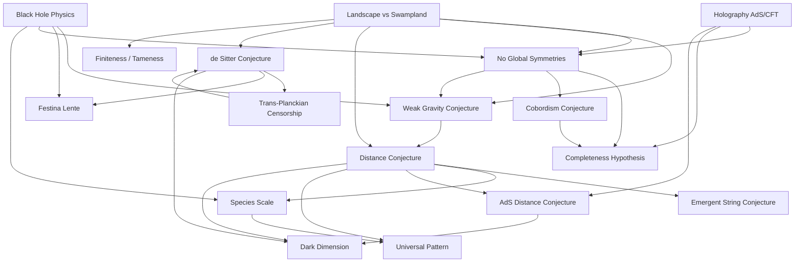

# Swampland a krajina teorie strun (Swampland Program & the String Landscape)

> **TL;DR** — Krajina (landscape) je obrovský prostor konzistentních nízkoenergetických efektivních teorií pole (EFT), které lze doplnit do kvantové gravitace, zatímco bažina (swampland) je ještě větší prostor zdánlivě konzistentních EFT, které takovou UV-úplnost **nemají**. Swampland program se snaží formulovat ostrá kritéria (conjectures) oddělující obě množiny: slabou gravitační hypotézu (Weak Gravity Conjecture), hypotézu vzdálenosti (Distance Conjecture), de Sitterovy hypotézy, absenci globálních symetrií, úplnost spektra, kobordismus aj. Tyto hypotézy mají fenomenologické dopady na inflaci, temnou energii, hmotnosti neutrin a scénář "temné dimenze" (dark dimension). Stav 2024–2026 je vyhrocený: status de Sitterových vakuí KKLT zůstává sporný, data DESI o dynamické temné energii oživila kvintesenciální modely a celý program balancuje mezi "zostřováním" (sharpening) a "falsifikací".

## Přehled a historický kontext

Termín **swampland** (bažina) zavedl Cumrun Vafa v roce 2005 v reakci na debatu o **krajině teorie strun** (string landscape) a antropickém principu, kterou rozvířil Leonard Susskind ([Vafa 2005](https://arxiv.org/abs/hep-th/0509212)). Susskind argumentoval, že flux kompaktifikace teorie strun produkují astronomický počet vakuí (odhad ~$10^{500}$, novější dolní hranice až $10^{272000}$ pro F-teorii), a že náš svět vybírá antropický princip. Vafovou pointou bylo obrátit problém: i kdyby krajina byla obrovská, **ještě větší je bažina** — prostor EFT, které vypadají konzistentně jako klasické teorie pole spřažené s gravitací, ale nemají žádné UV-doplnění do kvantové gravitace. Cílem programu je tedy najít **univerzální omezení** (constraints), která musí splnit každá EFT pocházející z kvantové gravitace, nezávisle na detailech kompaktifikace.

Program staví na starších myšlenkách o kvantové gravitaci: na hypotéze, že v kvantové gravitaci **nesmí existovat přesné globální symetrie** (no global symmetries; argumenty z fyziky černých děr od 70.–90. let), a na **hypotéze úplnosti spektra** (completeness hypothesis, [Polchinski 2003](https://arxiv.org/abs/hep-th/0304042)). Klíčovým prvním kvantitativním kritériem byla **slabá gravitační hypotéza** (Weak Gravity Conjecture, WGC) z roku 2006 ([Arkani-Hamed, Motl, Nicolis & Vafa 2006](https://arxiv.org/abs/hep-th/0601001)). Po relativně tichém období program explodoval po roce 2015 (oživení WGC) a zejména po roce 2018, kdy de Sitterova hypotéza ([Obied, Ooguri, Spodyneiko & Vafa 2018](https://arxiv.org/abs/1806.08362)) propojila abstraktní program s pozorovatelnou kosmologií. Standardními referencemi jsou přehledy [Brennan, Carta & Vafa 2017](https://arxiv.org/abs/1711.00864), monumentální [Palti 2019](https://arxiv.org/abs/1903.06239) (198 stran, >600 referencí) a [van Beest, Calderón-Infante, Mirfendereski & Valenzuela 2021](https://arxiv.org/abs/2102.01111).

Filosoficky je program zakotven v napětí mezi **antropickou krajinou** (která činí teorii strun obtížně testovatelnou) a snahou o **prediktivnost**: pokud bažina vylučuje velkou část naivních EFT (např. metastabilní de Sitter), získává teorie strun zpět falsifikovatelný obsah. Kritici (Tom Banks, Peter Woit ad.) namítají, že hypotézy nejsou dokázány, mají nejisté konstanty $O(1)$ a jejich falsifikace by nemusela falsifikovat teorii strun jako takovou.

### Statistika krajiny a antropická debata

Krajina vzniká z **flux kompaktifikací** (flux compactifications): na Calabi–Yauově (CY) varietě či F-teorii se přes homologické cykly zapínají kvantované toky generalizovaných magnetických polí, jejichž volba diskretizuje moduly a fixuje vakuum. Počet kombinací roste kombinatoricky s počtem cyklů (Hodgeova čísla $h^{1,1}, h^{2,1}$ mohou dosahovat stovek), odtud Susskindův odhad ~$10^{500}$. Novější systematické sčítání (geometrie F-teorie) dává dolní hranice typu $\sim 10^{272000}$ a "discretuum" hustě pokrytých hodnot kosmologické konstanty. Statistický program ([Douglas, Denef, Kachru](https://arxiv.org/abs/hep-th/0701050)) studuje rozdělení vakuí podle $\Lambda$, narušení SUSY a počtu generací místo hledání jediného vakua. **Antropický argument** (Weinbergova predikce $\Lambda$ z roku 1987, později Bousso–Polchinski "discretuum") vysvětluje malost $\Lambda \sim 10^{-122} M_{\text{Pl}}^4$ výběrem z hustého spektra vakuí podmíněným existencí pozorovatelů. Swampland program je v jistém smyslu **opačnou strategií**: místo statistického výběru hledá tvrdá *vylučovací* kritéria. Klíčové filosofické pnutí — zda je antropický landscape vědou (Susskind) nebo "ne dokonce ani špatně" (Banks, Woit) — zůstává otevřené i v roce 2026, posunuté však kosmologickými daty (DESI).

## Klíčové koncepty

- **Krajina vs. bažina (Landscape vs. Swampland)** — Krajina = množina EFT, jež jsou nízkoenergetickými limitami kvantové gravitace (teorie strun). Bažina = doplněk: zdánlivě konzistentní EFT bez UV-úplnosti. Hranice mezi nimi je předmětem programu.

- **Slabá gravitační hypotéza (Weak Gravity Conjecture, WGC)** — V každé konzistentní teorii s gravitací a kalibračním polem $U(1)$ musí existovat alespoň jedna nabitá částice, pro niž je gravitace slabší než kalibrační síla; ekvivalentně její poměr náboje k hmotnosti přesahuje hodnotu extremální černé díry ("gravitace je nejslabší síla"). Motivace: extremální černé díry musejí být schopny se rozpadnout. Varianty: **elektrická**, **magnetická** (dává cutoff $\Lambda \lesssim g M_{\text{Pl}}$), **konvexní obal** (convex hull) pro více $U(1)$, **mřížková** (lattice WGC) a **podmřížková/věžová** (sublattice/tower WGC).

- **Hypotéza vzdálenosti (Swampland Distance Conjecture, SDC)** — Při pohybu na velkou geodetickou vzdálenost $\Delta\phi$ v prostoru modulů zlehkne nekonečná **věž stavů** (tower of states) exponenciálně rychle: $m \sim m_0\, e^{-\alpha\,\Delta\phi/M_{\text{Pl}}}$ s $\alpha\sim O(1)$. Vede k rozpadu EFT v limitě nekonečné vzdálenosti. Refinace: **hypotéza emergentní struny** (Emergent String Conjecture) — každá limita nekonečné vzdálenosti je buď dekompaktifikace, nebo limita slabě vázané (asymptoticky beztenzní) struny.

- **De Sitterova hypotéza (de Sitter Conjecture)** — Skalární potenciál konzistentní teorie kvantové gravitace splňuje $|\nabla V| \ge c\,V/M_{\text{Pl}}$ (zakazuje metastabilní de Sitter). **Refinovaná verze**: buď tento gradientní vztah, **nebo** $\min(\nabla_i\nabla_j V) \le -c'\,V/M_{\text{Pl}}^2$ (povoluje maxima/sedla).

- **Trans-Planckovská cenzura (Trans-Planckian Censorship Conjecture, TCC)** — Subplanckovské kvantové fluktuace nesmějí být inflací roztaženy nad Hubbleův horizont a "zmrznout". Přes monotónní úsek dává $|\nabla V|/V \ge 2/\sqrt{(d-1)(d-2)}$, asymptoticky (pro velké pole) se zostřuje na $|\nabla V|/V \ge 2/\sqrt{d-2}$.

- **Žádné globální symetrie (No Global Symmetries)** — Kvantová gravitace nepřipouští žádnou přesnou globální symetrii (spojitou ani diskrétní). Holograficky dokázáno v AdS/CFT ([Harlow & Ooguri 2018](https://arxiv.org/abs/1810.05337)) přes kvantovou korekci chyb.

- **Úplnost spektra (Completeness Hypothesis)** — Spektrum musí obsahovat objekt (částici/branu) pro **každý** přípustný kalibrační náboj v mřížce nábojů ([Polchinski 2003](https://arxiv.org/abs/hep-th/0304042)). Souvisí s absencí (neinvertibilních) globálních symetrií.

- **Kobordismová hypotéza (Cobordism Conjecture)** — Všechny kobordismové třídy v kvantové gravitaci musejí být triviální; to vynucuje existenci defektů (branes, end-of-the-world branes) a domain walls mezi konfiguracemi ([McNamara & Vafa 2019](https://arxiv.org/abs/1909.10355)).

- **Měřítko druhů (Species Scale)** — Cutoff gravitace v přítomnosti $N$ lehkých druhů: $\Lambda_{\text{sp}} \sim M_{\text{Pl}}/\sqrt{N}$ ([Dvali 2007]; [Dvali & Lüst]). Pod tímto měřítkem selhává EFT popis gravitace; spojeno s entropií černých děr.

- **Festina lente (FL)** — V kvazi-de Sitterově prostoru musí každá nabitá částice splnit dolní mez hmotnosti $m^2 \gtrsim g q\, M_{\text{Pl}} H$ (přesněji $m^2 \ge \sqrt{6}\,g q\, M_{\text{Pl}} H$), aby velké nabité černé díry mohly vyzářit zpět do prázdného de Sitteru bez "big crunche".

- **AdS hypotéza vzdálenosti (AdS Distance Conjecture)** — Limita $\Lambda \to 0^-$ v AdS leží v bažině; je provázena věží stavů s $m \sim |\Lambda|^{\alpha}$, kde $\alpha = 1/2$ pro supersymetrický případ. Silná verze zakazuje separaci měřítek (scale separation) v AdS.

- **Hypotéza konečnosti / krocení (Finiteness / Tameness Conjecture)** — Počet flux vakuí je konečný; skalární prostory a couplingy jsou definovatelné v o-minimální (tame) geometrii ([Grimm 2021](https://arxiv.org/abs/2112.08383); [Grimm, Monnee]; dokázáno pro F-teorii).

- **Scénář temné dimenze (Dark Dimension)** — Z malosti temné energie + SDC plyne **jedna** mezoskopická extra dimenze velikosti $\ell \sim \Lambda^{-1/4} \sim 1\text{–}10\,\mu\text{m}$ s KK věží a vyšším-dimenzionálním Planckovým měřítkem $\sim 10^{9}\text{–}10^{10}$ GeV ([Montero, Vafa & Valenzuela 2022](https://arxiv.org/abs/2205.12293)).

- **Tower / sublattice / lattice WGC** — Zostření WGC: **tower WGC** požaduje nekonečně mnoho superextremálních nábojů; **sublattice WGC** superextremální stav v každém bodě podmřížky mřížky nábojů (s konečným indexem); **lattice WGC** superextremální stav pro *každý* náboj mřížky. Tyto formy implikují (a jsou implikovány) SDC: věž, která lehkne na nekonečné vzdálenosti, je často právě WGC věží.

- **Separace měřítek (Scale Separation)** — Schopnost oddělit měřítko vakua (AdS/dS) od KK měřítka kompaktifikace tak, aby nízkodimenzionální popis byl efektivní. Silná AdS-DC ji v supersymetrickém případě zakazuje; relevantní pro fenomenologickou použitelnost strunových vakuí (DGKT typ IIA).

- **Emergence proposal** — Návrh, že kinetické členy polí (a tedy konečnost prostoru modulů) **emergují** z kvantových smyček věží stavů integrovaných až po měřítko druhů; vysvětluje SDC z UV strany místo jejího postulování. Spojuje swampland s emergentní gravitací.

- **Refinovaná TCC (Refined TCC)** — Novější (2024–2026) zostření TCC svazující měřítko druhů ($\Lambda_{\text{sp}}$) s fundamentálním cutoffem místo Planckovy délky; implikuje **kratší životnost** zrychlujících se (kvazi-de Sitterových) vesmírů, dolní mez na kosmologickou konstantu a nekompatibilitu s big-bang singularitou ([Moradpouri 2025](https://arxiv.org/abs/2512.22694)). Historicky existuje i starší "refined TCC" ([Cai & Wang 2019](https://arxiv.org/abs/1912.00607)) odvozená ze silné scalar-WGC a entropických bounds.

## Matematický rámec

**Slabá gravitační hypotéza (elektrická forma).** Pro $U(1)$ s kalibrační konstantou $g$ existuje částice s hmotností $m$ a celočíselným nábojem $q$ taková, že

$$ q\, g\, M_{\text{Pl}} \;\ge\; m \qquad\Longleftrightarrow\qquad \frac{q\,g}{m/M_{\text{Pl}}} \;\ge\; 1 . $$

Zde $q g$ je efektivní náboj, $m/M_{\text{Pl}}$ "gravitační náboj". Nerovnost říká, že odpudivá kalibrační síla mezi dvěma takovými částicemi je $\ge$ přitažlivé gravitaci, tedy poměr je $\ge$ poměru extremální černé díry $|Q/M|_{\text{ext}}$. Význam: extremální nabitá černá díra se může rozpadnout (jinak by existovaly stabilní remnanty a nekonečně mnoho stavů → rozpor s entropií).

**Slabá gravitační hypotéza (magnetická forma).** Existence magnetického monopólu s hmotností $\sim \Lambda/g^2$ implikuje cutoff EFT

$$ \Lambda \;\lesssim\; g\, M_{\text{Pl}} . $$

$\Lambda$ je horní mez platnosti EFT, $g$ kalibrační konstanta. V limitě $g\to 0$ (globální symetrie) cutoff $\to 0$ — kvantová gravitace tedy zakazuje přesné globální symetrie. Nad $\Lambda$ se objeví věž stavů.

**Podmínka konvexního obalu (Convex Hull Condition).** Pro $n$ polí $U(1)$ s vektory náboj/hmotnost $\vec{z}_i = \vec{q}_i\, g\, M_{\text{Pl}}/m_i$ musí konvexní obal bodů $\{\pm\vec{z}_i\}$ obsahovat jednotkovou kouli:

$$ \mathbf{0}\ \text{leží v jádru a}\quad B_{\text{unit}} \subseteq \text{ConvHull}(\{\pm \vec{z}_i\}) . $$

Zaručuje, že libovolná extremální vícenabitá černá díra má kanál rozpadu.

**Hypotéza vzdálenosti (SDC).** Pro dva body $P, Q$ v prostoru modulů s geodetickou vzdáleností $d(P,Q)$ klesá hmotnostní měřítko lehké věže

$$ m(Q) \;\sim\; m(P)\; e^{-\alpha\, d(P,Q)/M_{\text{Pl}}},\qquad \alpha \sim O(1). $$

$d(P,Q)$ je geodetická vzdálenost v metrice na prostoru modulů, $\alpha$ je řádově jednotkový exponent (pro KK věž z dekompaktifikace $n$ extra dimenzí je $\alpha = \sqrt{(d+n-2)/(n(d-2))}$; pro jednu extra dimenzi $n=1$ tedy $\alpha = \sqrt{(d-1)/(d-2)}$, v $d=4$ rovno $\sqrt{3/2}$). Ostrá dolní mez je $\alpha \ge 1/\sqrt{d-2}$ (saturovaná oscilátorovou věží fundamentální struny). Význam: nelze se libovolně daleko vzdálit v prostoru polí bez kolapsu EFT cutoffu.

**Univerzální vzorec na nekonečné vzdálenosti.** Empirický vztah mezi věží a měřítkem druhů ([Castellano, Ruiz & Valenzuela 2023](https://arxiv.org/abs/2311.01536)):

$$ \frac{\vec{\nabla} m}{m}\cdot\frac{\vec{\nabla}\Lambda_{\text{sp}}}{\Lambda_{\text{sp}}} \;=\; \frac{1}{d-2} \quad\text{v } d \text{ rozměrech.} $$

$m$ je hmotnost věže, $\Lambda_{\text{sp}}$ měřítko druhů, $\nabla$ gradient v prostoru modulů. Vzorec zostřuje SDC a fixuje dolní meze rychlostí exponenciálního poklesu.

**Měřítko druhů (Species Scale).** Pro $N$ lehkých druhů hmotnosti $\ll \Lambda_{\text{sp}}$ je gravitační cutoff

$$ \Lambda_{\text{sp}} \;\sim\; \frac{M_{\text{Pl}}}{\sqrt{N}} . $$

$M_{\text{Pl}}$ je Planckova hmotnost, $N$ počet druhů. Pod $\Lambda_{\text{sp}}$ jsou kvantově-gravitační efekty (nejmenší černá díra) silné. Souvisí s Bekensteinovou–Hawkingovou entropií: $S_{\text{BH}}(\Lambda_{\text{sp}}^{-1}) \sim N$.

**De Sitterova hypotéza (refinovaná).** Skalární potenciál splňuje alespoň jednu z podmínek

$$ |\nabla V| \;\ge\; \frac{c}{M_{\text{Pl}}}\, V \qquad\text{nebo}\qquad \min(\nabla_i\nabla_j V) \;\le\; -\frac{c'}{M_{\text{Pl}}^2}\, V, $$

s $c, c' \sim O(1) > 0$. $|\nabla V|$ je norma gradientu v metrice polí, $\min(\nabla_i\nabla_j V)$ nejmenší vlastní hodnota Hessiánu. Význam: zakazuje metastabilní de Sitter (minimum s $V>0$), ale připouští nestabilní maxima/sedla (kvintesenci).

**Trans-Planckovská cenzura (TCC).** V rozpínajícím se vesmíru po dobu $t$ s počátečním a koncovým Hubbleovým parametrem $H_i, H_f$ platí

$$ \frac{a(t_f)}{a(t_i)}\; l_{\text{Pl}} \;<\; \frac{1}{H_f}, $$

odkud pro skalární potenciál přes monotónní úsek

$$ \frac{|\nabla V|}{V} \;\ge\; \frac{2}{\sqrt{(d-1)(d-2)}}\,\frac{1}{M_{\text{Pl}}}, \qquad\text{asymptoticky}\qquad \frac{|\nabla V|}{V} \;\ge\; \frac{2}{\sqrt{d-2}}\,\frac{1}{M_{\text{Pl}}}. $$

$a(t)$ je škálový faktor, $l_{\text{Pl}}$ Planckova délka. (Koeficient $2/\sqrt{(d-1)(d-2)}$ je mez přes monotónní úsek dle Bedroya–Vafa; ostřejší mez $2/\sqrt{d-2}$ platí asymptoticky pro velké pole.) Důsledek: maximální energetické měřítko inflace $V^{1/4} \lesssim 10^{9}\,\text{GeV}$ a slow-roll parametr $\epsilon < 10^{-31}$ pro správnou amplitudu fluktuací.

**Festina lente (FL).** Každá částice s nábojem $q$ a hmotností $m$ v kvazi-de Sitteru s Hubbleovým $H$ splňuje

$$ m^2 \;\ge\; \sqrt{6}\; g\, q\, M_{\text{Pl}}\, H \qquad\Longleftrightarrow\qquad m^4 \;\ge\; 6\,(g q\, M_{\text{Pl}} H)^2 \;=\; 2\,(g q)^2\, V . $$

$V = 3 M_{\text{Pl}}^2 H^2$ je vakuová energie (odtud koeficient $2$, nikoli $6$, ve formě s $V$). Vynucuje narušení elektroslabé symetrie a konfinement/Higgs nasazení neabelovských sil nad $H$.

**AdS hypotéza vzdálenosti.** V limitě plochého AdS ($\Lambda \to 0^-$) existuje věž s

$$ m \;\sim\; M_{\text{Pl}}\,|\Lambda/M_{\text{Pl}}^2|^{\alpha},\qquad \alpha = \tfrac{1}{2}\ \text{(SUSY)} . $$

Význam: separace měřítek mezi měřítkem AdS a hmotnostmi je obtížná; silná verze ji zakazuje (relevantní pro KKLT-typ AdS).

**Temná dimenze (Dark Dimension).** Z $\Lambda \sim m^4$ a SDC s $\alpha = 1/d = 1/4$ pro $d=4$:

$$ \ell \;\sim\; \lambda\,\Lambda^{-1/4} \;\sim\; 0.1\text{–}10\,\mu\text{m},\qquad \hat{M} = m^{1/3} M_{\text{Pl}}^{2/3} \sim 10^{9}\text{–}10^{10}\,\text{GeV}, $$

kde $\ell$ je velikost extra dimenze, $m = 1/\ell \sim \Lambda^{1/4} \sim$ meV je měřítko KK věže, $\hat{M}$ vyšší-dimenzionální Planckova hmotnost (= měřítko druhů), $\lambda \sim 10^{-1}\text{–}10^{-3}$. Aktivní neutrino: $m_\nu \approx y^2\langle H\rangle^2/\hat{M}$ s Yukawou $y \sim 10^{-2}\text{–}10^{-3}$; Higgsovo vev $\langle H\rangle \sim \Lambda^{1/6} M_{\text{Pl}}^{1/3}/(y\lambda^{2/3}) \sim 10\text{–}10^3$ GeV.

**TCC mez na měřítko inflace.** Z TCC plyne pro maximální energii inflace a slow-roll parametr

$$ V^{1/4} \;\lesssim\; 6\times 10^{8}\,\text{GeV} \;\approx\; 10^{9}\,\text{GeV},\qquad \epsilon \;<\; 10^{-31}, $$

z požadavku na správnou amplitudu skalárních fluktuací $A_s \sim 2\times 10^{-9}$. To prakticky vylučuje vysokoškálovou inflaci a předpovídá nepozorovatelně malý tenzor-skalár poměr $r$.

**Bousso–Polchinski discretuum.** Pro $J$ tokových polí s náboji $q_i$ a fluxy $n_i \in \mathbb{Z}$ je efektivní kosmologická konstanta

$$ \Lambda_{\text{eff}} \;=\; \Lambda_0 \;+\; \tfrac{1}{2}\sum_{i=1}^{J} n_i^2\, q_i^2 , $$

a hustota hodnot blízko nuly je dostatečná ($\sim 10^{-120}$ rozteč) pro antropický výběr, pokud $J \gtrsim$ stovky. Vzorec ilustruje původ "discretua" v krajině, vůči němuž swampland staví vylučovací kritéria.

## Klíčové výsledky a milníky

- **Žádné globální symetrie z fyziky černých děr** — Argument, že globální náboj spadlý do černé díry "zmizí" při vypaření (porušení zachování), vede k závěru, že přesné globální symetrie jsou v kvantové gravitaci zakázané; formalizováno přes remnanty a entropii.

- **Úplnost spektra** — [Polchinski 2003](https://arxiv.org/abs/hep-th/0304042) formuloval, že každý kalibrační náboj musí být obsazen; rozšířeno na neinvertibilní symetrie ([Heidenreich, McNamara, Montero, Reece, Rudelius & Valenzuela 2021](https://arxiv.org/abs/2104.07036)), kde absence neinvertibilních topologických operátorů garantuje úplnost spektra.

- **Slabá gravitační hypotéza** — [Arkani-Hamed, Motl, Nicolis & Vafa 2006](https://arxiv.org/abs/hep-th/0601001) zavedli WGC; motivace z fyziky černých děr, holografie a absence remnantů. Tower/sublattice varianty ([Heidenreich, Reece & Rudelius]) propojily WGC s SDC.

- **Hypotéza vzdálenosti** — [Ooguri & Vafa 2006](https://arxiv.org/abs/hep-th/0605264) ("On the Geometry of the String Landscape and the Swampland") formulovali, že moduly mají nekonečný průměr a věže stavů lehknou exponenciálně.

- **Holografický důkaz no-global-symmetries** — [Harlow & Ooguri 2018](https://arxiv.org/abs/1810.05337), [1810.05338] dokázali absenci globálních symetrií, kompaktnost kalibračních grup a úplnost spektra **uvnitř AdS/CFT** pomocí kvantové korekce chyb. Citace: *"the way quantum error correction works is not compatible with any symmetry"*. (Český gloss: kvantová korekce chyb v holografii je nekompatibilní s libovolnou symetrií.)

- **De Sitterova hypotéza** — [Obied, Ooguri, Spodyneiko & Vafa 2018](https://arxiv.org/abs/1806.08362) navrhli $|\nabla V| \ge cV$; refinace [Ooguri, Palti, Shiu & Vafa 2018](https://arxiv.org/abs/1810.05506) přidala Hessián-podmínku a propojila ji se SDC přes Boussův kovariantní entropický bound.

- **WGC z unitarity a kauzality** — [Hamada, Noumi & Shiu 2018](https://arxiv.org/abs/1810.03637) dali "existenční důkaz" WGC v široké třídě teorií z pozitivních bounds na vyšší-derivační korekce poměru náboj/hmotnost extremálních černých děr (gravitační positivity, Regge-omezenost). Související: [Hamada, Noumi & Shiu] o modulární invarianci a entropii.

- **Trans-Planckovská cenzura** — [Bedroya & Vafa 2019](https://arxiv.org/abs/1909.11063) formulovali TCC; aplikace na inflaci ([Bedroya, Brandenberger, Loverde & Vafa 2019](https://arxiv.org/abs/1909.11106)) dala $V^{1/4} \lesssim 10^9$ GeV.

- **Festina lente** — [Montero, Van Riet & Venken 2019](https://arxiv.org/abs/1910.01648) odvodili FL bound; fenomenologie ([Montero, Van Riet & Venken 2021](https://arxiv.org/abs/2106.07650)) ukázala, že SM bound splňuje a vynucuje rozbití EW symetrie.

- **Kobordismová hypotéza** — [McNamara & Vafa 2019](https://arxiv.org/abs/1909.10355) spojili triviálnost kobordismových tříd s absencí globálních symetrií; predikce end-of-the-world bran a domain walls.

- **Emergentní struna** — [Lee, Lerche & Weigand 2019](https://arxiv.org/abs/1910.01135) klasifikovali limity nekonečné vzdálenosti v Kählerově prostoru modulů CY3: buď dekompaktifikace, nebo emergentní beztenzní heterotická struna (K3-fibrace).

- **Konečnost / krocení** — [Grimm 2021](https://arxiv.org/abs/2112.08383) zavedl Tameness Conjecture (o-minimální geometrie); konečnost self-duálních flux vakuí F-teorie dokázána díky průlomům v tame Hodgeově teorii (Bakker–Klingler–Tsimerman).

- **Univerzální vzorec** — [Castellano, Ruiz & Valenzuela 2023](https://arxiv.org/abs/2311.01536) objevili $\frac{\nabla m}{m}\cdot\frac{\nabla\Lambda_{\text{sp}}}{\Lambda_{\text{sp}}} = \frac{1}{d-2}$ ve všech známých strunových limitách; vzorec přetrvává i v interiéru prostorů modulů ([Persistence of the Pattern 2023](https://arxiv.org/abs/2312.00120)).

- **WGC přehled** — [Harlow, Heidenreich, Reece & Rudelius 2022](https://arxiv.org/abs/2201.08380) (Rev. Mod. Phys. 95 (2023) 035003) sjednotili evidenci pro WGC: stringové příklady, positivity bounds, entropie, modulární invariance a vztah k SDC; standardní moderní reference.

- **Tři měřítka** — [van de Heisteeg et al. 2024](https://arxiv.org/abs/2403.18005) upřesnili hierarchii $\Lambda_{\text{BH}} \le \Lambda_{\text{sp}} \le M_{\text{Pl}}$: měřítko černé díry (nejmenší dobře popsaná černá díra) leží pod měřítkem druhů, které leží pod Planckovým.

- **DESI a kvintesence** — Data **DESI DR1 (2024)** a **DR2 (2025)** naznačila dynamickou temnou energii (přechod fantóm → kvintesence, "quintom-B"); swampland-konzistentní modely (S-duální kvintesence [2503.19428](https://arxiv.org/abs/2503.19428)) jsou téměř nerozlišitelné od DESI axion-like potenciálu a slučitelné se SDC, dS i TCC.

- **Temná dimenze** — [Montero, Vafa & Valenzuela 2022](https://arxiv.org/abs/2205.12293) predikovali jednu extra dimenzi $\sim\mu$m, věž sterilních neutrin a měřítko druhů $10^{9\text{–}10}$ GeV; rozšířeno na gauged $B$–$L$ a sjednocení neutrinových hmotností s měřítkem temné energie ([Montero et al. 2025](https://arxiv.org/abs/2512.09052)). Centrální hodnota velikosti dimenze z Casimirovy energie vychází $\ell \approx 7.42\,\mu$m, KK měřítko $m \approx 2.31$ meV, exponent SDC fixovaný do $1/d \le \alpha \le 1/2$ s preferovaným $\alpha = 1/4$.

- **WGC z entropie a modulární invariance** — [Hamada, Noumi & Shiu] a navazující práce ukázaly, že **vyšší-derivační korekce** posouvají poměr náboj/hmotnost extremálních černých děr nad hranici $1$ ($\delta(Q/M)>0$), takže velké extremální díry samy slouží jako WGC stavy; pro 2D CFT plyne z modulární invariance.

- **Kosmologické důsledky de Sitterovy hypotézy** — [Agrawal, Obied, Steinhardt & Vafa 2018](https://arxiv.org/abs/1806.09718) ukázali, že hypotéza vylučuje pravou kosmologickou konstantu a vyžaduje **kvintesenci** s $w \ne -1$, čímž svázala swampland s pozorovatelnou dynamikou temné energie a parametrem $1+w$.

- **AdS-DC a separace měřítek** — z [Lüst, Palti & Vafa 2019](https://arxiv.org/abs/1906.05225): silná verze zakazuje cenzuru neomezeného počtu bezhmotných polí a omezuje KKLT/DGKT-typové AdS vakua (separace mezi AdS a KK měřítkem).

## Současný stav (2024–2026)

Program je dnes velmi aktivní a posunul se od formulace izolovaných hypotéz k hledání **jednotící struktury** a **kvantitativní fenomenologie**:

1. **Měřítko druhů a "univerzální vzorec".** Centrem zájmu je vztah mezi věží stavů, měřítkem druhů $\Lambda_{\text{sp}}$ a Planckovým měřítkem. Vzorec $\frac{\nabla m}{m}\cdot\frac{\nabla\Lambda_{\text{sp}}}{\Lambda_{\text{sp}}} = \frac{1}{d-2}$ ([Castellano, Ruiz & Valenzuela 2023/2024](https://arxiv.org/abs/2311.01536)) byl testován v interiéru prostorů modulů ([Persistence of the Pattern, 2023](https://arxiv.org/abs/2312.00120)) a vedl k "taxonomii limit nekonečné vzdálenosti" (JHEP 2025). Diskutuje se "Species Quantum Mechanics" ([2510.25846, 2025](https://arxiv.org/abs/2510.25846)) a "Tale of Three Scales" ([2403.18005, 2024](https://arxiv.org/abs/2403.18005)) — Planck, druhy, černá díra.

2. **De Sitter / KKLT válka pokračuje.** Spor o existenci metastabilního de Sitteru v teorii strun "neutuchá od roku 2003". Kritici KKLT (Gao, Hebecker, Junghans [2009.03914]; Bena, Graña, Van Riet, Sethi ad.) poukazují na "singular-bulk problem", 10D tadpole konflikty a "Crisis on Infinite Earths" (krátká životnost vakuí, [Bernardo, Brahma, Dasgupta & Tatar 2020](https://arxiv.org/abs/2009.04504)). Obhájci (Kachru, Linde, McAllister, Kallosh) odpovídají vylepšenými konstrukcemi (racetrack, anti-D3 v nilpotentním superpoli, explicitní LVS konstrukce s malou $W_0$). V letech 2025–2026 práce o "refinované TCC" propojené s měřítkem druhů argumentují pro **kratší životnost** zrychlujících se vesmírů a nekompatibilitu jak s big-bang singularitou, tak s věčnou inflací ([Moradpouri 2025](https://arxiv.org/abs/2512.22694)).

3. **Kosmologie a DESI.** Data **DESI DR1 (2024) a DR2 (2025)** naznačují **dynamickou temnou energii** (preference před $\Lambda$CDM, přechod z fantómového do kvintesenciálního režimu — "quintom-B"). To je v souladu s de Sitterovou hypotézou a TCC, které $\Lambda$ jako pravé vakuum zakazují. Vznikla vlna kvintesenciálních modelů kompatibilních se swamplandem: "S-duální kvintesence" ([2503.19428, 2025](https://arxiv.org/abs/2503.19428)), rekonstrukce hypotéz z DESI BAO ([2409.14990]) a "Quantum gravity meets DESI" (JCAP 2025) testující TCC proti datům.

4. **Temná dimenze jako vlajkový fenomenologický scénář.** Predikce extra dimenze $\sim\mu$m je testovatelná torzními vahami (gravitace na krátkých vzdálenostech), KK gravitony jako temná hmota a měřítko druhů $10^{9\text{–}10}$ GeV. Pokračuje propojení s neutrinovou fyzikou a $B$–$L$ ([2512.09052, prosinec 2025](https://arxiv.org/abs/2512.09052)).

5. **Matematizace (finiteness/tameness).** Důkazy konečnosti flux vakuí přes o-minimální geometrii a tame Hodgeovu teorii ([Grimm 2021](https://arxiv.org/abs/2112.08383); "Finiteness Theorems and Counting Conjectures", [2311.09295, 2023](https://arxiv.org/abs/2311.09295)) dávají programu poprvé **rigorózní** matematické jádro.

6. **Generalizované symetrie.** Propojení swamplandu s moderní teorií **generalizovaných (vyšších a neinvertibilních) symetrií** — completeness ze zákazu neinvertibilních operátorů ([Heidenreich et al. 2021](https://arxiv.org/abs/2104.07036)), "Generalized symmetries, gravity, and the swampland" (PRD 2024).

### Zostřování (sharpening) vs. falsifikace

Metodologicky se program pohybuje mezi dvěma póly. **Zostřování** znamená převod kvalitativní hypotézy na ostrou, kvantitativní a ideálně dokazatelnou formu: např. přechod od WGC k tower/sublattice/lattice WGC, od SDC k univerzálnímu vzorci $\frac{\nabla m}{m}\cdot\frac{\nabla\Lambda_{\text{sp}}}{\Lambda_{\text{sp}}}=\frac{1}{d-2}$, nebo od heuristické konečnosti k tameness conjecture s důkazem pro F-teorii. **Falsifikace** je opačný směr — hledání protipříkladu (např. kontrolovaného de Sitter vakua, separovaného AdS, či SM-konzistentního porušení FL). Hierarchie důvěry: nejlépe podepřené jsou no-global-symmetries (holografický důkaz), úplnost a WGC (důkaz z positivity); střední jsou SDC a emergentní struna (rozsáhlá strunová evidence); nejspekulativnější de Sitterova hypotéza a její $O(1)$ konstanty. Pozorovatelná sázka: kdyby DESI/CMB potvrdily $w = -1$ (čistá kosmologická konstanta) s vysokou přesností, byla by de Sitterova hypotéza (resp. TCC) ve vážném napětí; naopak dynamická temná energie ji podporuje.

## Otevřené problémy

1. **Hodnoty $O(1)$ konstant $c, c', \alpha$.** De Sitterova a vzdálenostní hypotéza obsahují nefixované konstanty řádu jedné. Bez jejich přesných hodnot (a důkazu, že nejsou např. exponenciálně malé) zůstává falsifikovatelnost slabá. *Proč těžké:* konstanty závisí na detailech kompaktifikace a asymptotik; chybí univerzální dolní mez nezávislá na příkladu. Univerzální vzorec [2311.01536] je pokus o jejich fixaci, ale jen asymptoticky.

2. **Existuje metastabilní de Sitter v teorii strun?** Status KKLT a LVS zůstává nerozhodnut. *Proč těžké:* vyžaduje plně 10D kontrolovaný výpočet zahrnující kvantové korekce, anti-bránu, warping a backreaction; všechny známé konstrukce mají buď problém s kontrolou (singular bulk, malá objemová moduly), nebo zůstávají AdS.

3. **Důkaz WGC v neabelovských / gravitačních teoriích a jeho přesná silná verze.** Tower/sublattice/lattice formy nejsou ekvivalentní a nejsou obecně dokázané. *Proč těžké:* pozitivní bounds [1810.03637] platí jen za předpokladů (Regge-omezenost, gravity subdominance); protipříklady v specifických setupech a otázka, která verze je "ta správná".

4. **Odvození hypotéz z prvních principů.** Většina hypotéz je motivována příklady a fyzikou černých děr, ne dokázána. *Proč těžké:* chybí neperturbativní definice kvantové gravitace mimo holografii; "missing corner" (de Sitter, kosmologie) nemá holografický duál.

5. **Scale separation v AdS.** Lze v plně kontrolované teorii strun oddělit měřítko AdS od KK měřítka (nutné pro fenomenologii)? *Proč těžké:* všechny kontrolované příklady (DGKT) jsou ve smearovaném/parametricky sporném režimu; silná AdS-DC by separaci zakázala, ale důkaz chybí.

6. **Kosmologická konzistence TCC a de Sitterovy hypotézy s pozorováním.** Lze sladit zrychlenou expanzi (DESI) s TCC, která zakazuje věčnou akceleraci, a s amplitudou CMB fluktuací? *Proč těžké:* TCC tlačí $V^{1/4}<10^9$ GeV a $\epsilon<10^{-31}$, což je v napětí s jednoduchými inflačními modely; vyžaduje multipolní/nekanonické trajektorie.

7. **Status úplnosti a kobordismu mimo známé příklady.** Je kobordismová hypotéza (triviálnost všech bordismových grup) skutečně univerzální, a co přesně predikuje pro novou fyziku (jaké branes)? *Proč těžké:* výpočet relevantních bordismových grup pro realistické kompaktifikace je technicky náročný; interpretace nových generátorů jako fyzikálních defektů je nejistá.

8. **Vztah swamplandu k samotné definici teorie strun.** Je bažina vlastnost teorie strun, nebo univerzální vlastnost jakékoli kvantové gravitace? Falsifikace hypotézy ≠ falsifikace teorie strun. *Proč těžké:* nemáme nezávislou definici "kvantové gravitace", vůči níž bychom hypotézy ověřovali.

## Vztahy k ostatním přístupům

### Teorie strun (string-theory) — **dobře prozkoumáno**
Swampland je doslova produktem teorie strun: krajina jsou strunové kompaktifikace, hypotézy jsou destilovány z příkladů (CY kompaktifikace, F-teorie, heterotická struna). WGC, SDC, emergentní struna i finiteness jsou formulovány a testovány přímo ve strunových modelech. Otevřená je otázka, zda hypotézy platí i mimo teorii strun (tj. zda jsou vlastností *každé* kvantové gravitace). Toto je **nejtěsnější** a nejlépe rozpracovaný vztah.

### Holografie a AdS/CFT (holography-adscft) — **dobře prozkoumáno**
Jediný známý **důkaz** swampland hypotézy (no global symmetries, kompaktnost gauge grup, úplnost spektra) je holografický ([Harlow & Ooguri 2018](https://arxiv.org/abs/1810.05337)) přes kvantovou korekci chyb. AdS hypotéza vzdálenosti přímo omezuje AdS/CFT vakua a separaci měřítek. Boussův entropický bound vstupuje do odvození refinované de Sitterovy hypotézy. Slabinou je, že holografie nepokrývá de Sitter a kosmologii ("missing corner").

### Fyzika černých děr a informace (black-holes-information) — **dobře prozkoumáno**
WGC je odvozena z **rozpadatelnosti extremálních černých děr** a absence remnantů; FL bound z evaporace nabitých Nariai černých děr v de Sitteru; species scale je svázáno s Bekensteinovou–Hawkingovou entropií nejmenší černé díry ($S_{\text{BH}} \sim N$). No-global-symmetries plyne z toho, že globální náboj černé díry není měřitelný/zachovaný. Vztah je hluboce kvantitativní a stále produktivní (positivity bounds, entropie a modulární invariance).

### Supergravitace a UV (supergravity-uv) — **dobře prozkoumáno**
Hypotézy se testují v efektivních supergravitačních teoriích vzniklých kompaktifikací; de Sitterova a AdS-DC hypotéza přímo omezují strukturu potenciálu a F-členů ve 4D $\mathcal{N}=1$ SUGRA. KKLT je SUGRA konstrukce. No-go teorémy pro de Sitter (Maldacena–Nuñez) jsou SUGRA výsledky vstupující do programu.

### Kvantová kosmologie (quantum-cosmology) — **částečně prozkoumáno**
De Sitterova hypotéza, TCC a FL mají přímé kosmologické dopady (inflace, temná energie, kvintesence, $V^{1/4}<10^9$ GeV). DESI data je propojují s pozorováním. Avšak vznik vesmíru "z ničeho", věčná inflace a wave-function-of-the-universe jsou jen heuristicky propojené (Banksova kritika: eternal inflation sama je v bažině). Chybí kontrolovaný kvantově-kosmologický rámec pro de Sitterův "missing corner".

### Emergentní gravitace (emergent-gravity) — **částečně prozkoumáno**
"Emergence proposal" tvrdí, že kinetické členy (a tím konečnost prostoru modulů) **emergují** z integrace věží stavů — gravitace/měřítka jsou IR-emergentní z UV věží ([Heidenreich, Reece & Rudelius; Grimm, Palti, Valenzuela]). Toto je most ke gravitaci jako emergentnímu/termodynamickému jevu, ale formálně omezený na výpočty smyček ve specifických limitách. Species scale jako emergentní cutoff je dalším vláknem.

### Nekomutativní geometrie (noncommutative-geometry) — **sotva prozkoumáno**
Přímé spojení je řídké. Spektrální akce a konečnost spektra by mohly rezonovat s finiteness/tameness conjecture a s úplností spektra, ale literatura propojující Connesův formalismus se swamplandem prakticky chybí. Potenciální most: o-minimální/tame struktury vs. spektrální triple. **Lovná zóna.**

### Asymptotická bezpečnost (asymptotic-safety) — **sotva prozkoumáno**
Obě řeší UV-konzistenci gravitace, ale z opačných stran: AS hledá UV fixed point čistě v QFT, swampland tvrdí, že čistá QFT gravitace je v bažině (musí přijít struny/věže). Existuje napětí i možná komplementarita (např. zda AS-konzistentní teorie splňují WGC). Téměř žádná přímá literatura — **silná lovná zóna** pro hledání rozporů či mostů (např. WGC bounds vs. predikce škálování AS).

### Smyčková kvantová gravitace (loop-quantum-gravity) — **sotva prozkoumáno**
LQG nemá přirozenou krajinu modulů ani strunové věže, takže SDC/WGC se obtížně formulují. Otázka, zda LQG (či spinové pěny) splňuje no-global-symmetries a completeness, je téměř nedotčená. Možný most: diskrétnost spektra plochy vs. úplnost spektra nábojů; kobordismus vs. spin-foam amplitudy. **Lovná zóna.**

### Twistory a amplitudy (twistors-amplitudes) — **částečně prozkoumáno**
WGC z pozitivních bounds ([1810.03637]) leží na rozhraní s programem positivity/amplitud (EFT-hedron, Regge-omezenost, kauzalita). Toto je nejslibnější most: swampland constraints jako stínítka v prostoru S-matic. Zatím **částečně** rozpracováno přes positivity, ale spojení s twistorovými metodami a celočíselnou geometrií amplitud je řídké.

### Příčinné dynamické triangulace (causal-dynamical-triangulations) — **sotva prozkoumáno**
CDT generuje vlastní **fázový diagram** (fáze A, B, C, bifurkační fáze C_b) parametrizovaný vazbami $\kappa_0, \Delta$ — strukturně analogický ke krajině/bažině (které fáze mají rozumný kontinuální limit?). Zda kontinuální limit CDT splňuje swampland kritéria (no-global-symmetries, WGC, finiteness) není zkoumáno. **Lovná zóna**: spektrální dimenze CDT ($d_s \to 2$ v UV) by mohla rezonovat s "minimální dimenzí" swamplandu a s emergentní strunou.

### Příčinné množiny (causal-sets) — **sotva prozkoumáno**
Sorkinova predikce **fluktuující** kosmologické konstanty $\Lambda \sim \pm 1/\sqrt{V} \sim \pm H^2 M_{\text{Pl}}^2$ (z kvantové fluktuace počtu elementů) dává *dynamickou* temnou energii bez pravého de Sitter minima — nápadně souznící s de Sitterovou hypotézou a TCC, jež čistou $\Lambda$ rovněž zakazují. Dva nezávislé mechanismy předpovídající dynamickou DE nikdo nesrovnal. **Silná lovná zóna** pro nový spoj.

### Grupová teorie pole (group-field-theory) — **sotva prozkoumáno**
GFT kondenzátová kosmologie generuje efektivní kosmologickou dynamiku (bounce, akcelerace) a vlastní parametrický prostor; zda její efektivní EFT splňují de Sitter/distance kritéria je nezkoumáno. Možná analogie mezi GFT fázovým prostorem a strunovou krajinou. **Lovná zóna.**

### Provázanost a prostoročas (entanglement-spacetime) — **částečně prozkoumáno**
No-global-symmetries je dokázáno přes kvantovou korekci chyb, která je jádrem programu "entanglement builds geometry" (Ryu–Takayanagi, ER=EPR). Species scale a holografická entropie propojují počet druhů s provázaností. Most je reálný, ale kvantitativní propojení swampland bounds s entanglement entropií zůstává otevřené.

## Mapa konceptů

## Reference

1. [Vafa 2005](https://arxiv.org/abs/hep-th/0509212) — *The String Landscape and the Swampland*, arXiv:hep-th/0509212. Zakládající práce zavádějící pojem bažina.
2. [Arkani-Hamed, Motl, Nicolis & Vafa 2006](https://arxiv.org/abs/hep-th/0601001) — *The String Landscape, Black Holes and Gravity as the Weakest Force*, JHEP 06 (2007) 060, arXiv:hep-th/0601001. Slabá gravitační hypotéza.
3. [Ooguri & Vafa 2006](https://arxiv.org/abs/hep-th/0605264) — *On the Geometry of the String Landscape and the Swampland*, Nucl. Phys. B766 (2007) 21, arXiv:hep-th/0605264. Hypotéza vzdálenosti a geometrie modulů.
4. [Polchinski 2003](https://arxiv.org/abs/hep-th/0304042) — *Monopoles, Duality, and String Theory*, arXiv:hep-th/0304042. Hypotéza úplnosti spektra.
5. [Brennan, Carta & Vafa 2017](https://arxiv.org/abs/1711.00864) — *The String Landscape, the Swampland, and the Missing Corner*, PoS TASI2017 (2017) 015, arXiv:1711.00864. Standardní přehled.
6. [Obied, Ooguri, Spodyneiko & Vafa 2018](https://arxiv.org/abs/1806.08362) — *De Sitter Space and the Swampland*, arXiv:1806.08362. De Sitterova hypotéza $|\nabla V|\ge cV$.
7. [Agrawal, Obied, Steinhardt & Vafa 2018](https://arxiv.org/abs/1806.09718) — *On the Cosmological Implications of the String Swampland*, Phys. Lett. B784 (2018) 271, arXiv:1806.09718. Důsledky pro temnou energii / kvintesenci.
8. [Ooguri, Palti, Shiu & Vafa 2018](https://arxiv.org/abs/1810.05506) — *Distance and de Sitter Conjectures on the Swampland*, Phys. Lett. B788 (2019) 180, arXiv:1810.05506. Refinovaná de Sitterova hypotéza.
9. [Harlow & Ooguri 2018](https://arxiv.org/abs/1810.05337) — *Constraints on Symmetry from Holography*, Phys. Rev. Lett. 122 (2019) 191601, arXiv:1810.05337. Holografický důkaz no-global-symmetries.
10. [Harlow & Ooguri 2018](https://arxiv.org/abs/1810.05338) — *Symmetries in Quantum Field Theory and Quantum Gravity*, Commun. Math. Phys. 383 (2021) 1669, arXiv:1810.05338. Detailní verze.
11. [Hamada, Noumi & Shiu 2018](https://arxiv.org/abs/1810.03637) — *Weak Gravity Conjecture from Unitarity and Causality*, Phys. Rev. Lett. 123 (2019) 051601, arXiv:1810.03637. Existenční důkaz WGC z positivity.
12. [Palti 2019](https://arxiv.org/abs/1903.06239) — *The Swampland: Introduction and Review*, Fortsch. Phys. 67 (2019) 1900037, arXiv:1903.06239. Komprehenzivní přehled (198 stran).
13. [Lüst, Palti & Vafa 2019](https://arxiv.org/abs/1906.05225) — *AdS and the Swampland*, Phys. Lett. B797 (2019) 134867, arXiv:1906.05225. AdS hypotéza vzdálenosti.
14. [McNamara & Vafa 2019](https://arxiv.org/abs/1909.10355) — *Cobordism Classes and the Swampland*, arXiv:1909.10355. Kobordismová hypotéza.
15. [Bedroya & Vafa 2019](https://arxiv.org/abs/1909.11063) — *Trans-Planckian Censorship and the Swampland*, JHEP 09 (2020) 123, arXiv:1909.11063. TCC.
16. [Bedroya, Brandenberger, Loverde & Vafa 2019](https://arxiv.org/abs/1909.11106) — *Trans-Planckian Censorship and Inflationary Cosmology*, Phys. Rev. D101 (2020) 103502, arXiv:1909.11106. TCC bound na inflaci.
17. [Lee, Lerche & Weigand 2019](https://arxiv.org/abs/1910.01135) — *Emergent Strings from Infinite Distance Limits*, JHEP 02 (2022) 190, arXiv:1910.01135. Hypotéza emergentní struny.
18. [Montero, Van Riet & Venken 2019](https://arxiv.org/abs/1910.01648) — *Festina Lente: EFT Constraints from Charged Black Hole Evaporation in de Sitter*, JHEP 01 (2020) 039, arXiv:1910.01648. FL bound.
19. [Gao, Hebecker & Junghans 2020](https://arxiv.org/abs/2009.03914) — *Control Issues of KKLT*, Fortsch. Phys. 68 (2020) 2000089, arXiv:2009.03914. Desetidimenzionální kritika KKLT (singular-bulk problem, znaménko warp faktoru).
20. [Bernardo, Brahma, Dasgupta & Tatar 2020](https://arxiv.org/abs/2009.04504) — *Crisis on Infinite Earths: Short-lived de Sitter Vacua in the String Theory Landscape*, JHEP 04 (2021) 037, arXiv:2009.04504. Neperturbativní dS uplifty s krátkou životností.
21. [van Beest, Calderón-Infante, Mirfendereski & Valenzuela 2021](https://arxiv.org/abs/2102.01111) — *Lectures on the Swampland Program in String Compactifications*, Phys. Rept. 989 (2022) 1, arXiv:2102.01111. Moderní přehled.
22. [Montero, Van Riet & Venken 2021](https://arxiv.org/abs/2106.07650) — *The FL Bound and its Phenomenological Implications*, JHEP 10 (2021) 009, arXiv:2106.07650. Přesný FL bound $m^2\ge\sqrt6\,gqM_{\rm Pl}H$.
23. [Heidenreich, McNamara, Montero, Reece, Rudelius & Valenzuela 2021](https://arxiv.org/abs/2104.07036) — *Non-Invertible Global Symmetries and Completeness of the Spectrum*, JHEP 09 (2021) 203, arXiv:2104.07036. Úplnost přes neinvertibilní symetrie.
24. [Grimm 2021](https://arxiv.org/abs/2112.08383) — *Taming the Landscape of Effective Theories*, JHEP 11 (2022) 003, arXiv:2112.08383. Tameness/finiteness conjecture.
25. [Harlow, Heidenreich, Reece & Rudelius 2022](https://arxiv.org/abs/2201.08380) — *The Weak Gravity Conjecture: A Review*, Rev. Mod. Phys. 95 (2023) 035003, arXiv:2201.08380. Přehled WGC.
26. [Montero, Vafa & Valenzuela 2022](https://arxiv.org/abs/2205.12293) — *The Dark Dimension and the Swampland*, JHEP 02 (2023) 022, arXiv:2205.12293. Scénář temné dimenze.
27. [Castellano, Ruiz & Valenzuela 2023](https://arxiv.org/abs/2311.01536) — *Stringy Evidence for a Universal Pattern at Infinite Distance*, JHEP 06 (2024) 037, arXiv:2311.01536. Univerzální vzorec věž–měřítko druhů.
28. [Grimm & Monnee 2023](https://arxiv.org/abs/2311.09295) — *Finiteness Theorems and Counting Conjectures for the Flux Landscape*, JHEP 08 (2024) 039, arXiv:2311.09295. Konečnost flux vakuí.
29. [Bedroya, Vafa & Wu 2024](https://arxiv.org/abs/2403.18005) — *The Tale of Three Scales: the Planck, the Species, and the Black Hole Scales*, Phys. Rev. D (2024), arXiv:2403.18005. Tři měřítka (Planck, druhy, černá díra).
30. [S-dual Quintessence 2025](https://arxiv.org/abs/2503.19428) — *S-dual Quintessence, the Swampland, and the DESI DR2 Results*, arXiv:2503.19428. Kvintesence a DESI DR2.
31. [Montero et al. 2025](https://arxiv.org/abs/2512.09052) — *Neutrinos, B-L Symmetry and the Dark Dimension*, arXiv:2512.09052. Neutrina a temná dimenze, $B$–$L$.
32. [Douglas, Denef & Kachru 2007](https://arxiv.org/abs/hep-th/0701050) — *Physics of String Flux Compactifications*, Ann. Rev. Nucl. Part. Sci. 57 (2007) 119, arXiv:hep-th/0701050. Statistika krajiny.
33. [van Beest, Calderón-Infante, Mirfendereski & Valenzuela 2021](https://arxiv.org/abs/2102.01111) — *Lectures on the Swampland Program in String Compactifications*, Phys. Rept. 989 (2022) 1, arXiv:2102.01111. Moderní pedagogický přehled (Physics Reports).
34. [Harlow, Heidenreich, Reece & Rudelius 2022](https://arxiv.org/abs/2201.08380) — *The Weak Gravity Conjecture: A Review*, Rev. Mod. Phys. 95 (2023) 035003, arXiv:2201.08380. Autoritativní přehled WGC.
35. [Rudelius 2023](https://arxiv.org/abs/2312.00120) — *Persistence of the Pattern in the Interior of 5d Moduli Spaces*, JHEP (2024), arXiv:2312.00120. Důkaz univerzálního vzorce i mimo asymptotiku (pro BPS stavy a struny v 5D SUGRA).
36. [Moradpouri 2025](https://arxiv.org/abs/2512.22694) — *The species scale and the refined TCC bound in time-dependent backgrounds of string theory*, arXiv:2512.22694. Refinovaná TCC vázající měřítko druhů na cutoff; kratší životnost dS, mez na $\Lambda$.
37. [Cai & Wang 2019](https://arxiv.org/abs/1912.00607) — *A refined trans-Planckian censorship conjecture*, arXiv:1912.00607. Starší refinace TCC ze silné scalar-WGC a entropických bounds.

> Pozn.: Bousso–Polchinski discretuum (hep-th/0004134) a Weinbergova antropická predikce $\Lambda$ (1987) jsou zmíněny v textu jako historický kontext; nejsou číslovány samostatně, aby nedošlo k uvedení neověřeného arXiv ID. Konvexní obal (convex hull) pochází od Cheung–Remmen (arXiv:1402.2287).
