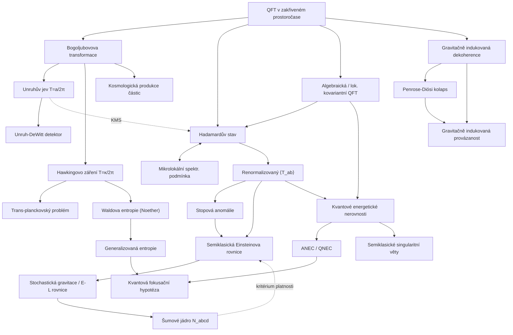

# Semiklasická gravitace a QFT v zakřiveném prostoročase (QFT in Curved Spacetime & Semiclassical Gravity)

> **TL;DR** — Kvantová teorie pole v zakřiveném prostoročase (QFT in curved spacetime, QFTCS) studuje kvantovaná pole na pevném klasickém pozadí a vede ke třem ikonickým predikcím: Unruhovu jevu (akcelerovaný pozorovatel vidí termální lázeň o teplotě $T=a/2\pi$), Hawkingovu záření ($T_H=\kappa/2\pi$) a kosmologické produkci částic. Semiklasická gravitace pak uzavírá zpětnou vazbu polosamokonzistentně: klasická metrika je buzena renormalizovanou střední hodnotou tenzoru energie-hybnosti $\langle T_{ab}\rangle$ přes semiklasickou Einsteinovu rovnici. Pilíř poskytuje *nejrobustnější* a experimentálně nejbližší rozhraní mezi kvantovou teorií a gravitací: zde žije stopová anomálie (trace anomaly), Waldova entropie, kvantové energetické nerovnosti, algebraická QFT s Hadamardovými stavy, stochastická gravitace (Hu-Verdaguer) a gravitačně indukovaná dekoherence. Jeho hranice (Planckova škála, Pageův čas, trans-planckovský problém) definují, kde *musí* nastoupit plná kvantová gravitace.

---

## Přehled a historický kontext

QFT v zakřiveném prostoročase vznikla z otázky, co se stane s kvantovým vakuem, jakmile prostoročas přestane být plochý a Poincarého invariantní. Klíčové milníky:

- **1939–1968:** Erwin Schrödinger (1939) jako první upozornil na „alarmující" produkci párů v rozpínajícím se vesmíru. Systematickou teorii však založil až **Leonard Parker** ve své harvardské disertaci *The Creation of Particles in an Expanding Universe* (1966, školitel S. Coleman) — první polně-teoretická analýza gravitační produkce částic, publikovaná posléze v ([Parker 1969](https://journals.aps.org/pr/abstract/10.1103/PhysRev.183.1057); historický přehled [Ferreiro, Navarro-Salas & Pla 2025](https://arxiv.org/abs/2511.13518)).
- **1973–1976:** Stephen **Fulling** (1973), Paul **Davies** (1975) a William **Unruh** (1976) odhalili, že pojem „částice" je závislý na pozorovateli a že rovnoměrně akcelerovaný detektor vnímá Minkowského vakuum jako termální lázeň — *Unruhův jev* ([Unruh 1976](https://journals.aps.org/prd/abstract/10.1103/PhysRevD.14.870)).
- **1974–1975:** Stephen **Hawking** ukázal, že černé díry emitují termální záření o teplotě úměrné povrchové gravitaci, což propojilo QFTCS s termodynamikou černých děr ([Hawking 1975](https://doi.org/10.1007/BF02345020)).
- **1977:** **Wald** zformuloval axiomy pro renormalizovaný $\langle T_{ab}\rangle$; **Christensen** rozvinul rozklad bodu (point-splitting); rozvíjí se stopová anomálie (Capper-Duff, Deser-Duff-Isham).
- **1991:** **Kay & Wald** — rigorózní definice Hadamardových stavů a věty o jednoznačnosti/termálnosti na prostoročasech s rozdvojeným Killingovým horizontem ([Kay & Wald 1991](https://doi.org/10.1016/0370-1573(91)90015-E)).
- **1993:** **Wald** — entropie černé díry je Noetherův náboj, zobecnění Bekensteinovy-Hawkingovy entropie na libovolnou difeomorfně invariantní teorii ([Wald 1993](https://arxiv.org/abs/gr-qc/9307038)).
- **1996:** **Radzikowski** — mikrolokální (microlocal) charakterizace Hadamardova stavu přes vlnoplochovou množinu (wavefront set), což odstartovalo rigorózní algebraickou QFTCS.
- **2001–2003:** **Brunetti, Fredenhagen & Verch** — lokálně kovariantní QFT (locally covariant QFT) jako funktor mezi kategorií globálně hyperbolických prostoročasů a *-algeber.
- **2004–2008:** **Hu & Verdaguer** — stochastická gravitace a Einsteinova-Langevinova rovnice ([Hu & Verdaguer 2008](https://arxiv.org/abs/0802.0658)).
- **2015–2026:** Kvantové energetické nerovnosti a semiklasické singularitní věty (Fewster-Kontou), kvantová fokusační hypotéza (Bousso-Wall), důkazy QNEC/ANEC z relativní entropie (Casini, Faulkner, Ceyhan-Faulkner), island formula/replikové červí díry pro Pageovu křivku, post-kvantová klasická gravitace (Oppenheim) a stolní testy gravitačně indukované provázanosti.

Klíčové paradigma celého pilíře vyjádřil Unruh: *„the notion of a particle is observer-dependent"* (pojem částice je závislý na pozorovateli) — bez specifikace módového rozkladu a trajektorie detektoru je počet částic nedefinovaný.

---

## Klíčové koncepty

- **QFT v zakřiveném prostoročase (QFT in curved spacetime, QFTCS):** Kvantované pole $\hat\phi$ na *pevné* klasické globálně hyperbolické varietě $(M,g_{ab})$; gravitace je klasická, neexistuje univerzální vakuum ani jednoznačný pojem částice. Aproximace $G_N \to$ konečné, ale $\hbar$-korekce v materii.

- **Bogoljubovova transformace (Bogoliubov transformation):** Lineární transformace mezi dvěma kompletními módovými soustavami $\{u_i\}$ a $\{\bar u_j\}$ rozvoje pole; koeficienty $\alpha_{ij},\beta_{ij}$. Nenulové $\beta_{ij}$ znamenají, že „in" vakuum obsahuje „out" částice — jádro produkce částic. Mísí kreační a anihilační operátory.

- **Unruhův jev (Unruh effect):** Rovnoměrně akcelerovaný (Rindlerův) pozorovatel s vlastním zrychlením $a$ vnímá Minkowského vakuum jako termální lázeň o **Unruhově teplotě** `unruh-temperature` $T_U=\hbar a/2\pi c k_B$. Bogoljubovovy koeficienty mezi Rindlerovými a Minkowského módy dávají Boseho-Einsteinovo rozdělení. Sdílený koncept s emergentní gravitací (lokální Rindlerovy horizonty).

- **Unruhův-DeWittův detektor (Unruh-DeWitt detector):** Bodový dvouhladinový systém lineárně vázaný na $\hat\phi$; jeho míra excitace (response function) je dána Fourierovou transformací Wightmanovy funkce podél trajektorie. Operacionalizuje „částici" jako klik detektoru.

- **Hadamardův stav (Hadamard state):** Stav, jehož dvoubodová funkce má krátkovzdálenou singulární strukturu shodnou s plochým prostorem (Hadamardova parametrix). Ekvivalentně (Radzikowski) splňuje **mikrolokální spektrální podmínku** (microlocal spectrum condition, µSC) — omezení na vlnoplochovou množinu $WF$ dvoubodové distribuce. Zajišťuje konečnost $\langle T_{ab}\rangle$ a hraje roli fyzikálně přípustného „vakua".

- **Renormalizovaný tenzor energie-hybnosti ($\langle T_{ab}\rangle_{\rm ren}$):** Střední hodnota $T_{ab}$ po odečtení Hadamardovy parametrix (point-splitting/Hadamard renormalizace). Splňuje Waldovy axiomy (kovariance, kauzalita, kontrakce s konzervací). Pro masivní pole je nejednoznačnost nekonečně-parametrická (lokální zakřivené protičleny), pro nehmotné pole dvouparametrická.

- **Stopová anomálie (trace anomaly / conformal anomaly):** Konformně invariantní klasická teorie ($T^a{}_a=0$) má kvantově nenulovou stopu $\langle T^a{}_a\rangle = c\,C_{abcd}C^{abcd} - a\,E_4 + \ldots$. Koeficienty $a,c$ jsou modelově závislé; $E_4$ je Eulerova hustota (Gaussův-Bonnetův invariant), $C$ Weylův tenzor. Generuje Hawkingovo záření přes anomálii a fixuje $\langle T_{ab}\rangle$ v konformně plochých prostoročasech.

- **Hawkingovo záření (Hawking radiation):** Černá díra emituje (téměř) termální záření o **Hawkingově teplotě** $T_H=\hbar\kappa/2\pi c k_B$, kde $\kappa$ je povrchová gravitace. Sdílený koncept s `black-holes-information`. Vede k vypařování a paradoxu informace.

- **Trans-planckovský problém (trans-Planckian problem):** V původním odvození Hawkingova záření mají módy poblíž horizontu při zpětném sledování libovolně vysoké (trans-planckovské) frekvence, ač ve výsledku nevystupují. Otázka robustnosti vůči UV modifikacím (disperzní relace, mřížky).

- **Kosmologická produkce částic (cosmological particle production / gravitational particle production, GPP):** Časově závislá metrika FLRW mísí pozitivní/negativní frekvence; adiabatické vakuum přechodem produkuje částice. Mechanismus pro temnou hmotu, reheating.

- **Semiklasická Einsteinova rovnice (semiclassical Einstein equation):** $G_{ab}+\Lambda g_{ab}=8\pi G_N\langle T_{ab}\rangle_\omega$ — gravitace buzena střední hodnotou kvantového tenzoru. Polosamokonzistentní (self-consistent) řešení vyžaduje Hadamardův stav $\omega$ na metrice, kterou sám budí.

- **Stochastická gravitace (stochastic gravity, Hu-Verdaguer):** Rozšíření o *fluktuace* $T_{ab}$ přes **šumové jádro** (noise kernel) $N_{abcd}$; Einsteinova-Langevinova rovnice se stochastickým zdrojem $\xi_{ab}$. Druhý moment $\langle T_{ab}T_{cd}\rangle$.

- **Waldova entropie (Wald entropy):** Entropie černé díry jako Noetherův náboj difeomorfní invariance; $S_W=-2\pi\oint (\partial L/\partial R_{abcd})\,\epsilon_{ab}\epsilon_{cd}$. Pro Einsteinovu-Hilbertovu akci redukuje na $A/4G$. Sdíleno s `black-holes-information`.

- **Gravitačně indukovaná dekoherence (gravitationally induced decoherence):** Vazba na (kvantované či klasické) gravitační pole ničí koherenci prostorových superpozic hmoty; spojeno s Penroseovým-Diósiho modelem kolapsu vlnové funkce s časem $\tau\sim\hbar/E_{\Delta}$.

- **Kvantové energetické nerovnosti (quantum energy inequalities, QEI):** Spodní meze na vážené časové průměry $\langle T_{ab}\rangle u^a u^b$; brání libovolně velké negativní energetické hustotě a vedou k ANEC/QNEC a semiklasickým singularitním větám.

- **Algebraická QFT v zakřiveném prostoročase (algebraic QFT, AQFT):** Formulace přes *-algebry pozorovatelných na globálně hyperbolických prostoročasech; **lokálně kovariantní QFT** jako funktor zajišťuje obecnou kovarianci bez preferovaného vakua.

---

## Matematický rámec

### Bogoljubovova transformace a produkce částic

$$
\hat\phi = \sum_i\left(a_i u_i + a_i^\dagger u_i^*\right) = \sum_j\left(\bar a_j \bar u_j + \bar a_j^\dagger \bar u_j^*\right),\qquad
\bar u_j = \sum_i\left(\alpha_{ji} u_i + \beta_{ji} u_i^*\right)
$$

Pole $\hat\phi$ rozvineme ve dvou různých kompletních ortonormálních módových bázích $\{u_i\}$ (např. „in", v dávné minulosti) a $\{\bar u_j\}$ („out", v budoucnosti). Matice $\alpha_{ji}$ (Bogoljubovův koeficient mísící pozitivní frekvence) a $\beta_{ji}$ (mísící pozitivní a negativní frekvence) splňují $\sum_k(\alpha_{ik}\alpha^*_{jk}-\beta_{ik}\beta^*_{jk})=\delta_{ij}$. **Význam:** počet „out" částic v „in" vakuu je

$$
\langle 0_{\rm in}|\,\bar N_j\,|0_{\rm in}\rangle = \sum_i |\beta_{ji}|^2.
$$

$\bar N_j$ je počet částic v out-módu $j$. Nenulové $\beta$ $\Rightarrow$ produkce částic. Toto je univerzální mechanismus za Unruhem, Hawkingem i kosmologickou produkcí.

### Unruhova teplota a termální spektrum

$$
T_U = \frac{\hbar a}{2\pi c\,k_B},\qquad
\langle N_\omega\rangle = \frac{1}{e^{2\pi\omega/a}-1}
$$

$a$ je vlastní zrychlení Rindlerova pozorovatele, $\omega$ frekvence Rindlerova módu. Bogoljubovovy koeficienty mezi Minkowského a Rindlerovými módy dávají $|\beta_\omega/\alpha_\omega|^2=e^{-2\pi\omega/a}$, tedy přesné **Planckovo (Boseho-Einsteinovo) rozdělení** o teplotě $T_U$. **Význam:** vakuum kvantového pole je termální stav vzhledem k Rindlerovu hamiltoniánu — formálně **KMS podmínka** (Kubo-Martin-Schwinger) při inverzní teplotě $\beta=2\pi/a$. Číselně $T_U\approx 4{,}0\times10^{-21}\,$K na $1\,$m/s² zrychlení.

### Hawkingova teplota a Hawkingův tok

$$
T_H = \frac{\hbar\kappa}{2\pi c\,k_B},\qquad
\kappa_{\rm Schw}=\frac{c^4}{4G_N M},\qquad
\langle N_\omega\rangle = \frac{\Gamma_\omega}{e^{\hbar\omega/k_B T_H}-1}
$$

$\kappa$ je povrchová gravitace horizontu (pro Schwarzschilda $\kappa=1/4GM$ v jednotkách $c=1$), $\Gamma_\omega$ je faktor šedého tělesa (greybody factor, transmise potenciálovou bariérou). **Význam:** černá díra září jako (téměř) černé těleso; pro $M=M_\odot$ je $T_H\approx 6\times10^{-8}\,$K. Spektrum je termální s opravou $\Gamma_\omega$. Vede k vypařování: $dM/dt\sim -1/M^2$, životnost $\sim M^3$.

### Stopová (konformní) anomálie ve 4D

$$
\langle T^a{}_a\rangle = \frac{1}{(4\pi)^2}\left( c\,C_{abcd}C^{abcd} - a\,E_4 + b\,\Box R \right),\qquad
E_4 = R_{abcd}R^{abcd}-4R_{ab}R^{ab}+R^2
$$

$C_{abcd}$ je Weylův tenzor, $E_4$ Eulerova/Gaussova-Bonnetova hustota (topologický invariant při integraci), $\Box R$ schematicky odvoditelný protičlen. Koeficienty $a,c$ jsou modelově závislé (počet skalárů, fermionů, vektorů). **Význam:** ač je teorie klasicky konformní ($T^a{}_a=0$), kvantově je stopa nenulová. Pevně určuje $\langle T_{ab}\rangle$ v konformně plochých prostoročasech (FLRW) a poskytuje alternativní odvození Hawkingova toku. $a$-koeficient řídí $a$-teorém (monotonie podél RG toku).

### Hadamardova parametrix a renormalizace $\langle T_{ab}\rangle$

$$
H_\ell(x,x') = \frac{1}{2(2\pi)^2}\left[\frac{\Delta^{1/2}(x,x')}{\sigma_\epsilon(x,x')} + v(x,x')\ln\!\left(\frac{\sigma_\epsilon(x,x')}{\ell^2}\right)\right],\qquad
\langle T_{ab}\rangle_{\rm ren}=\lim_{x'\to x}\mathcal D_{ab}\big[W(x,x')-H(x,x')\big]
$$

$\sigma$ je Syngeova světová funkce (polovina kvadrátu geodetické vzdálenosti), $\Delta$ Van Vleckův-Morettův determinant, $v$ hladká funkce daná Hadamardovou rekurzí, $\ell$ délková škála (renormalizační nejednoznačnost), $W$ Wightmanova dvoubodová funkce, $\mathcal D_{ab}$ diferenciální operátor odvozený z klasického $T_{ab}$. **Význam:** odečtení univerzální singulární části $H$ dává konečný, lokálně kovariantní tenzor; $\ell$-závislost generuje protičleny $\propto R^2,\, C^2$.

### Mikrolokální spektrální podmínka (Radzikowski)

$$
WF(W) = \big\{ (x,k;x',-k')\in T^*(M\times M)\setminus 0 :\ (x,k)\sim(x',k'),\ k\in \overline{V}^+_x \big\}
$$

$WF$ je vlnoplochová množina (wavefront set) dvoubodové distribuce $W$, $(x,k)\sim(x',k')$ značí, že body jsou spojeny nulovou geodetikou s kovektorem $k$ koparalelně přeneseným, $\overline V^+_x$ uzavřený budoucí světelný kužel. **Význam:** stav je Hadamardův $\iff$ singularity $W$ propagují jen vpřed po světelných kuželích (mikrolokální „pozitivní frekvence"). Tato podmínka nahrazuje globální spektrální podmínku z plochého prostoru, kde žádný globální časový vektor neexistuje.

### Semiklasická Einsteinova rovnice (úplná forma)

$$
R_{ab}-\tfrac12 R g_{ab}+\Lambda g_{ab} = 8\pi G_N\left(\langle T_{ab}\rangle_\omega + \alpha\,{}^{(1)}\!H_{ab} + \beta\,{}^{(2)}\!H_{ab}\right)
$$

$\langle T_{ab}\rangle_\omega$ je renormalizovaná střední hodnota ve stavu $\omega$, ${}^{(1)}\!H_{ab},{}^{(2)}\!H_{ab}$ jsou tenzory čtvrtého řádu v derivacích metriky (z variace $R^2$ a $R_{ab}R^{ab}$), $\alpha,\beta$ renormalizační konstanty. **Význam:** rovnice je *čtvrtého řádu*, vyžaduje 16 volných počátečních dat (vs. 4 vazby), což generuje runaway řešení (Horowitz); řeší se redukcí řádu (Parker-Simon). Hadamardova podmínka na $\omega$ musí být splněna na samé metrice, kterou rovnice určuje.

### Einsteinova-Langevinova rovnice (stochastická gravitace)

$$
G_{ab}^{(1)}[h] - 8\pi G_N\,\langle \hat T_{ab}^{(1)}[h]\rangle = 8\pi G_N\,\xi_{ab},\qquad
\langle \xi_{ab}(x)\,\xi_{cd}(x')\rangle = N_{abcd}(x,x') = \tfrac12\langle \{\,\hat t_{ab}(x),\hat t_{cd}(x')\,\}\rangle
$$

$h_{ab}$ je perturbace metriky, $\xi_{ab}$ gaussovský stochastický zdroj, $N_{abcd}$ **šumové jádro** (noise kernel) = symetrizovaný konektor fluktuací $\hat t_{ab}=\hat T_{ab}-\langle\hat T_{ab}\rangle$. **Význam:** rozšiřuje semiklasiku o fluktuace; dvoubodové korelace $\langle h h\rangle$ souhlasí (v large-$N$ limitě) s kvantovými korelacemi gravitonu vázaného na $N$ polí. Poskytuje **kritérium platnosti** semiklasické gravitace: malé indukované fluktuace metriky.

### Waldova entropie (Noetherův náboj)

$$
S_W = -2\pi \oint_{\mathcal H} \frac{\partial L}{\partial R_{abcd}}\,\epsilon_{ab}\,\epsilon_{cd}\,\sqrt{\gamma}\;d^{\,D-2}x
$$

$L$ je gravitační lagrangián, $R_{abcd}$ Riemannův tenzor, $\epsilon_{ab}$ binormála (antisymetrický tenzor normální k řezu horizontu) normalizovaná $\epsilon_{ab}\epsilon^{ab}=-2$, $\gamma$ indukovaná metrika na řezu. **Význam:** pro $L=R/16\pi G$ dává $\partial L/\partial R_{abcd}=\frac{1}{32\pi G}(g^{ac}g^{bd}-g^{ad}g^{bc})$, tedy $S_W=A/4G$ — Bekensteinova-Hawkingova entropie. Pro vyšší zakřivení (Gauss-Bonnet, Lovelock, $f(R)$) generuje korekce. Splňuje první zákon $\delta M=\tfrac{\kappa}{2\pi}\delta S_W+\Omega\,\delta J$.

### Generalizovaná entropie a kvantová fokusační hypotéza

$$
S_{\rm gen} = \frac{A[\Sigma]}{4G_N\hbar} + S_{\rm out}^{\rm vN}(\Sigma),\qquad
\frac{d}{d\lambda}\Theta \le 0,\quad \Theta \equiv \frac{4G\hbar}{\sqrt h}\frac{\delta S_{\rm gen}}{\delta\lambda}
$$

$A[\Sigma]$ je plocha Cauchyho řezu $\Sigma$, $S_{\rm out}^{\rm vN}$ von Neumannova entropie kvantových polí vně, $\Theta$ kvantová expanze nulové kongruence, $\lambda$ afinní parametr. **Význam:** generalizovaná entropie spojuje geometrii a kvantovou provázanost; **kvantová fokusační hypotéza** (Bousso-Wall) říká, že $\Theta$ podél nulové kongruence nemůže růst, sjednocuje Boussovu mez a klasickou fokusaci a *implikuje* QNEC. Sdíleno s `black-holes-information` (island formula, kvantové extremální plochy).

### Penroseův-Diósiho čas dekoherence

$$
\tau_{\rm DP} \sim \frac{\hbar}{E_G},\qquad
E_G = G\!\iint \frac{[\rho_1(\mathbf r)-\rho_2(\mathbf r)][\rho_1(\mathbf r')-\rho_2(\mathbf r')]}{|\mathbf r-\mathbf r'|}\,d^3r\,d^3r'
$$

$E_G$ je gravitační vlastní energie rozdílu hmotnostních rozdělení $\rho_1,\rho_2$ dvou větví superpozice. **Význam:** Penrose argumentuje, že superpozice dvou prostoročasů je nestabilní a kolabuje za čas $\tau_{\rm DP}$. Diósiho stochastická verze přidává fundamentální dekoherenci. Klíčový experimentálně testovatelný předpověď rozlišující scénáře (semiklasika vs. kvantovaná gravitace).

---

## Klíčové výsledky a milníky

- **Produkce částic v rozpínajícím se vesmíru** — [Parker 1968, 1969](https://journals.aps.org/pr/abstract/10.1103/PhysRev.183.1057): první polně-teoretický výpočet gravitační produkce; konformně vázané nehmotné pole *neprodukuje* částice v FLRW (konformní triviality), masivní a minimálně vázané pole ano.

- **Unruhův jev** — [Unruh 1976](https://journals.aps.org/prd/abstract/10.1103/PhysRevD.14.870): Minkowského vakuum je termální stav o $T_U=a/2\pi$ pro Rindlerova pozorovatele. Operacionalizováno Unruhovým-DeWittovým detektorem; ekvivalentní KMS podmínce.

- **Hawkingovo záření** — [Hawking 1975](https://doi.org/10.1007/BF02345020): černá díra emituje termálně o $T_H=\kappa/2\pi$; *„a black hole of mass less than about $10^{15}$ g would have evaporated by now"*. Spojilo QFTCS s termodynamikou ČD a zrodilo paradox informace.

- **Bekenstein-Hawkingova entropie a GSL** — z Hawkingova výsledku plyne $S_{BH}=A/4G$ a generalizovaný druhý zákon: $S_{\rm matter}+A/4$ neklesá. Sdíleno s `black-holes-information`.

- **Věty Kay-Wald** — [Kay & Wald 1991](https://doi.org/10.1016/0370-1573(91)90015-E): na prostoročase s rozdvojeným Killingovým horizontem existuje *nanejvýš jeden* kvazivolný stav invariantní vůči izometriím a Hadamardův na horizontu; pokud existuje, je termální o Hawkingově teplotě (Hartle-Hawking stav). Důkaz *neexistence* takového stavu na Kerrovi a Schwarzschild-de Sitter.

- **Waldova entropie** — [Wald 1993](https://arxiv.org/abs/gr-qc/9307038): *„black hole entropy is $2\pi$ times the integral over $\Sigma$ of the Noether charge $(n-2)$-form"*; první zákon platí pro libovolnou difeomorfně invariantní teorii.

- **Mikrolokální Hadamardova podmínka** — [Radzikowski 1996](https://doi.org/10.1007/BF02100096): ekvivalence geometrické Hadamardovy formy a podmínky na vlnoplochovou množinu; základ rigorózní AQFTCS. Rozšířeno na vektorová/Diracova pole (Sahlmann-Verch 2001).

- **Lokálně kovariantní QFT** — [Brunetti, Fredenhagen & Verch 2003](https://arxiv.org/abs/math-ph/0112041): QFTCS jako kovariantní funktor z kategorie globálně hyperbolických prostoročasů do *-algeber; obecná kovariance jako přirozená transformace.

- **Stochastická gravitace** — [Hu & Verdaguer 2008](https://arxiv.org/abs/0802.0658): Einsteinova-Langevinova rovnice se šumovým jádrem; aplikace na stabilitu Minkowského prostoru, formaci struktur a fluktuace metriky u vypařující se ČD.

- **Kvantové energetické nerovnosti a ANEC** — [Fewster & Smith 2007](https://arxiv.org/abs/gr-qc/0702056), [Kontou & Olum 2015](https://arxiv.org/abs/1507.00297): QEI omezuje negativní energii; nulově-projektovaná QEI dokazuje ANEC na achronální geodetice v zakřiveném prostoročase.

- **Kvantová fokusační hypotéza a QNEC** — [Bousso, Fisher, Leichenauer, Wall 2016](https://arxiv.org/abs/1506.02669): zobecnění fokusace na semiklasickou úroveň; implikuje QNEC. Obecný důkaz QNEC z relativní entropie ([Ceyhan & Faulkner 2018](https://arxiv.org/abs/1812.04683)) a Bekensteinovy meze (Casini).

- **Semiklasická singularitní věta** — [Fewster & Kontou 2022](https://arxiv.org/abs/2108.12668): pomocí QEI odvozena singularitní věta *přímo* z QFT; predikuje geodetickou neúplnost na rozumných škálách, mimo dosah klasických Penroseových-Hawkingových vět.

- **Island formula / Pageova křivka** — [Almheiri et al. 2020](https://arxiv.org/abs/1911.12333), [Penington et al. / Almheiri et al. 2020 (replica wormholes)](https://arxiv.org/abs/1911.11977): semiklasický gravitační integrál po cestě s replikovými červími dírami a kvantovými extremálními plochami reprodukuje unitární Pageovu křivku — semiklasika sama zná informaci. Sdíleno s `black-holes-information` a `holography-adscft`.

- **Post-kvantová klasická gravitace** — [Oppenheim 2023](https://arxiv.org/abs/1811.03116): konzistentní vazba *klasické* metriky na kvantovou hmotu nutně stochastická, s nevyhnutelnými fluktuacemi metriky; experimentálně omezitelná měřením difuze hmotnosti.

---

## Současný stav (2024–2026)

Pole je dnes mimořádně aktivní na několika frontách, jak shrnuje přehled [Juárez-Aubry 2025](https://arxiv.org/abs/2509.02051) (GR24 Glasgow):

1. **Počáteční hodnotová úloha semiklasiky.** Klíčový problém je čtvrtý řád, nelokálnost (dvoubodová funkce je bidistribuce), a Hadamardovská počáteční data. **Juárez-Aubry, Kay, Miramontes & Sudarsky** navrhli, že fyzikální řešení mají hladkou závislost na $\hbar$ v $\hbar=0$ a redukují se na druhý řád. **Meda, Pinamonti & Siemssen** dokázali lokální existenci a jednoznačnost v FLRW. Strukturální řešení existují na maximálně symetrických (de Sitter, AdS — [Juárez-Aubry & Mamani-Leque 2025](https://arxiv.org/abs/2509.02051)), statických a sféricky symetrických prostoročasech.

2. **Rigorózní AQFT a energetické podmínky.** Pokračuje program důkazů ANEC/QNEC z relativní entropie a modulární teorie (Tomita-Takesaki, Araki), Bekensteinovy meze v QFT (Casini, Hayden-Wang 2023), kovariantního regulátoru pro entropii provázanosti ([2025 PRD](https://journals.aps.org/prd/abstract/10.1103/PhysRevD.111.105001)). Konformní anomálie a renormalizované korelátory stresového tenzoru pro nekonformní teorie ([2024 PRD 110.045007](https://journals.aps.org/prd/abstract/10.1103/PhysRevD.110.045007)).

3. **Gravitačně indukovaná provázanost a dekoherence (GIE).** Po návrzích Bose et al. a Marletto-Vedral (2017) probíhá živá debata, zda GIE *dokazuje* kvantovou gravitaci. Klíčové výsledky 2024–2025: ukázalo se, že **i klasické/post-kvantové teorie gravitace mohou produkovat provázanost** ([Nature 2025](https://www.nature.com/articles/s41586-025-09595-7); [Diósi-Penrose entanglement, PRD 111 L121101](https://link.aps.org/doi/10.1103/PhysRevD.111.L121101)), což oslabuje „theory-independent" no-go argumenty. Experimentálně: 16 µg Schrödingerova kočka ([2023](https://arxiv.org/abs/2305.04780)), návrhy s diamantovými NV centry, optomechanickými rezonátory.

4. **Testy Unruhova jevu a analogová gravitace.** Návrhy na fluxon-antifluxon páry v Josephsonových junkcích (PRL 2025, $T_U$ řádu kelvinů), CERN-NA63 kanálovací záření s hyperbolickou rekoiлí (2025), iontové pasti simulující oscilující Unruhův detektor ([2510.23050](https://arxiv.org/abs/2510.23050)). Analogová Hawkingova radiace v BEC a optických systémech.

5. **Kosmologická produkce částic.** Velký přehled [Kolb & Long 2024 (Rev. Mod. Phys. 96.045005)](https://link.aps.org/doi/10.1103/RevModPhys.96.045005) systematizuje GPP jako zdroj temné hmoty, gravitačních vln, dark radiation. Aktivní výzkum spin-2 produkce, raného reheatingu, kosmologie buzené GPP ([2511.13392](https://arxiv.org/abs/2511.13392)).

6. **Konkurenční rámce.** Vedle standardní semiklasiky se rozvíjí (i) stochastická gravitace, (ii) Oppenheimova post-kvantová klasická gravitace, (iii) modely s dynamickým kolapsem (CSL/GRW vázané na Hadamardovu podmínku — Juárez-Aubry et al., Muciño et al. 2025). Sdílí cíl: konzistentní vazba kvantové hmoty a (možná klasické) gravitace.

7. **Trans-planckovská otázka.** Studie ukazují, že Hawkingovo záření je robustní vůči invariantnímu Planckovu cutoffu a monotónním disperzním relacím, ale *nemonotónní* disperze (odchylka jen v trans-planckovské doméně) modifikuje záření po scrambling time ([2411.01105](https://arxiv.org/abs/2411.01105), [2307.12831](https://arxiv.org/abs/2307.12831)).

---

## Otevřené problémy

1. **Korektní počáteční hodnotová úloha semiklasické Einsteinovy rovnice.** Rovnice je čtvrtého řádu s 16 volnými daty proti 4 vazbám, nelokálním zdrojem (bidistribuce) a Hadamardovskou podmínkou, která je *prostoročasovou* (ne počáteční) vlastností. *Proč je to těžké:* renormalizace $\langle T_{ab}\rangle$ se musí provádět *současně* s řešením pohybové rovnice; runaway řešení (Horowitz) rostou na Planckově škále. Pokrok: redukce řádu (Parker-Simon), Meda-Pinamonti-Siemssen v FLRW, ale obecný globální důkaz chybí.

2. **Charakterizace meze platnosti semiklasické gravitace.** Kdy je nahrazení $T_{ab}\to\langle T_{ab}\rangle$ oprávněné? *Proč je to těžké:* fluktuace $\Delta T_{ab}$ mohou být srovnatelné se střední hodnotou (např. „cat states", superpozice makroskopicky odlišných hmotností). Stochastická gravitace dává kritérium přes šumové jádro, ale univerzální, stavově nezávislé kritérium neexistuje. Selhání očekáváno u Pageova času a v near-horizon oblasti vypařující se ČD.

3. **Trans-planckovský problém Hawkingova záření.** Odvození formálně používá libovolně vysoké frekvence u horizontu. *Proč je to těžké:* nelze ho rozhodnout bez znalosti UV fyziky; robustnost je prokázána jen pro monotónní disperze a invariantní cutoff, nemonotónní disperze záření modifikují. Otevřené, zda existuje skutečně univerzální, na UV nezávislé odvození.

4. **Jednoznačnost $\langle T_{ab}\rangle$ pro masivní pole.** Waldovy axiomy ponechávají nekonečně-parametrickou volnost (lokální zakřivené protičleny) pro masivní pole (vs. dvouparametrickou pro nehmotné). *Proč je to těžké:* nejednoznačnost je fyzikálně reálná (renormalizace vazeb $\Lambda, G, \alpha, \beta$); fixovat ji vyžaduje další fyzikální vstup mimo QFTCS.

5. **Existence Hartle-Hawkingova stavu na rotujících a kosmologických ČD.** Kay-Wald dokázali *neexistenci* stacionárního Hadamardova stavu na Kerrovi a Schwarzschild-de Sitter. *Proč je to těžké:* superradiance a více horizontů s různými teplotami brání globálně termálnímu Hadamardovu stavu; otázka, jaký je správný stav pro astrofyzikální (rotující) ČD, zůstává otevřená.

6. **Dekohese vs. kolaps spacetime superpozic — co skutečně testuje GIE?** Pozorování gravitačně indukované provázanosti bylo navrženo jako důkaz kvantové gravitace, ale 2024–2025 ukázaly, že i klasické/stochastické modely mohou provázanost generovat. *Proč je to těžké:* „mediátor musí být kvantový" argument předpokládá lokalitu a reverzibilitu, které post-kvantové teorie porušují; rozlišit scénáře vyžaduje měřit *navíc* dekoherenci/difuzi, ne jen provázanost.

7. **Konec vypařování a osud informace v semiklasice.** *Proč je to těžké:* Pageův-časový paradox naznačuje selhání nízkoenergetické fyziky tam, kde „nemá co dělat". Juárez-Aubry navrhuje „kvantovou silnou kosmickou cenzuru" — Hadamardovy stavy nelze rozšířit přes Cauchyho horizonty, prostoročas končí finální singularitou, informace se neztrácí (žádná post-evaporační oblast). Konkurenční řešení (islands) přicházejí z holografie. Smíření semiklasického a holografického obrazu je otevřené.

8. **Renormalizovaný $\langle T_{ab}\rangle$ pro rotující ČD a realistické astrofyzikální situace.** *Proč je to těžké:* numericky náročné mode-sum/Hadamard výpočty na Kerrovi; nedávný pokrok (Casals, Thompson, Winstanley), ale úplná kontrola zpětné vazby chybí.

---

## Vztahy k ostatním přístupům

### Černé díry a informace (`black-holes-information`) — **dobře prozkoumáno**
Nejtěsnější vazba: Hawkingovo záření, Bekensteinova-Hawkingova/Waldova entropie, generalizovaný druhý zákon a generalizovaná entropie jsou *přímými* výstupy QFTCS. Paradox informace je formulován právě na rozhraní semiklasiky a unitarity. Pageova křivka, island formula a kvantové extremální plochy používají semiklasický gravitační integrál po cestě. Sdílené koncepty: `hawking-radiation`, `bekenstein-hawking-entropy`, `generalized-entropy`, `page-curve`, `quantum-extremal-surface`.

### Holografie a AdS/CFT (`holography-adscft`) — **dobře prozkoumáno**
Ryu-Takayanagiho/kvantová extremální plocha = $S_{\rm gen}$ minimalizovaná v bulku; semiklasický bulk je $1/N$ expanze CFT. QNEC, Bekensteinova mez, ANEC byly dokázány jak holograficky, tak rigorózně v QFTCS (Casini, Faulkner). Stopová anomálie CFT ($a,c$ koeficienty) má holografický duál (Henningson-Skenderis). Otevřená výzva: jak se semiklasická Hadamardova struktura kóduje v boundary algebře.

### Emergentní gravitace (`emergent-gravity`) — **dobře/částečně prozkoumáno**
Jacobsonovo odvození Einsteinových rovnic z $\delta Q=T\delta S$ na lokálních Rindlerových horizontech přímo užívá Unruhovu teplotu a Clausiovu relaci. Analogová Hawkingova radiace (`analogue-hawking-radiation`) v BEC/optice je experimentální platformou pro QFTCS. Sdílené: `unruh-temperature`, `local-rindler-horizon`, `analogue-hawking-radiation`. Otevřené: zda je $\langle T_{ab}\rangle$ skutečně termodynamicky emergentní nebo fundamentální.

### Entanglement a prostoročas (`entanglement-spacetime`) — **částečně prozkoumáno**
Entropie provázanosti kvantových polí (s plošným zákonem a UV divergencí $\sim A/\epsilon^2$) je semiklasickým zdrojem $S_{\rm gen}$. „Entanglement equilibrium" (Jacobson 2016) a první zákon provázanosti spojují modulární hamiltonián QFTCS s linearizovanou Einsteinovou rovnicí. Otevřené: jak přesně modulární tok zakřiveného QFTCS určuje geometrii mimo lineární řád.

### Asymptotická bezpečnost (`asymptotic-safety`) — **částečně/sotva prozkoumáno**
Semiklasická akce s protičleny $R^2, C^2$ je IR křídlem RG toku; asymptotická bezpečnost dodává UV fixní bod, který by mohl fixovat nejednoznačnosti $\alpha,\beta$ a stopovou anomálii. RG-improved $\langle T_{ab}\rangle$ s běžícím $G(k)$ je užíváno v kosmologii a u ČD. *Sotva* prozkoumáno: jak rigorózně propojit Hadamardovu renormalizaci v zakřiveném prostoru s funkcionálním RG fixním bodem. Potenciální zlatá žíla projektu.

### Strunová teorie (`string-theory`) — **částečně prozkoumáno**
Struny v zakřiveném pozadí jako 2D CFT (worldsheet), nulová $\beta$-funkce $\Rightarrow$ Einsteinovy rovnice s $\alpha'$ korekcemi (analogie semiklasických protičlenů vyšších derivací). Strominger-Vafa mikrostavy reprodukují $S_{BH}=A/4G$, kterou QFTCS dává makroskopicky. Otevřené: jak struny modifikují trans-planckovskou doménu Hawkingova záření a Hadamardovu strukturu.

### Smyčková kvantová gravitace (`loop-quantum-gravity`) — **sotva prozkoumáno**
LQG poskytuje kandidáta na UV completion, kde by trans-planckovský problém měl být regularizován diskrétností geometrie. Polymerní/loop QFTCS a výpočty Hawkingova/Unruhova jevu na spin-network pozadí existují, ale rozhraní je málo rozvinuté. Waldova entropie vs. LQG počítání mikrostavů horizontu (Barbero-Immirzi) je jen částečně srovnáno. *Sotva* prozkoumaná vazba — potenciálně cenná.

### Kauzální množiny (`causal-sets`) — **sotva prozkoumáno**
Kauzální množiny nabízejí Lorentzovsky invariantní diskretizaci, kde by trans-planckovské frekvence byly přirozeně omezeny. Sorkinův-Johnstonův (SJ) stav je kauzálně-množinová náhrada Hadamardova vakua a byl srovnáván s Hadamardovými stavy QFTCS. Benincasa-Dowker d'Alembertián a entropie provázanosti na causal setech přímo dialoguje se semiklasikou. Slibná, *sotva* prozkoumaná vazba.

### Kvantová kosmologie (`quantum-cosmology`) — **částečně prozkoumáno**
Kosmologická produkce částic, adiabatické vakuum a stopová anomálie jsou jádrem rané kosmologie (inflace, reheating, GPP temné hmoty). Semiklasická Einsteinova rovnice je standardním rámcem pro backreakci v de Sitteru. Otevřené: stabilita de Sitteru vůči $\langle T_{ab}\rangle$ a IR sekulární růst.

### Nekomutativní geometrie (`noncommutative-geometry`) — **sotva prozkoumáno**
NC prostoročas a kappa-Minkowski modifikují disperzní relace, což přímo zasahuje trans-planckovský problém a Unruhův jev. Existují výpočty Unruhova/Hawkingova jevu na NC pozadích, ale systematické propojení s Hadamardovým rámcem QFTCS chybí. *Sotva* prozkoumáno.

### Experimentální testy (`experimental-tests`) — **částečně prozkoumáno**
QFTCS je nejtestovatelnějším pilířem: analogové Hawkingovo/Unruhovo záření (BEC, optika, Josephson), GIE protokoly (Bose-Marletto-Vedral), Penrose-Diósi dekoherence (16 µg kočky, levitované nanočástice). Otevřené: žádná přímá detekce Unruhova/Hawkingova jevu zatím; rozlišení semiklasika vs. kvantovaná gravitace experimentem.

### Konceptuální problémy (`conceptual-problems`) — **částečně prozkoumáno**
Pozorovatelová závislost pojmu částice, problém vakua, role měření v gravitaci, a zda je gravitace fundamentálně klasická (semiklasika/Oppenheim) nebo kvantovaná. Møller-Rosenfeldova semiklasická rovnice a její konzistence s linearitou QM (Eppley-Hannah, Großardt 2022 paradoxy).

---

## Mapa konceptů

---

## Reference

1. **L. Parker**, *Quantized Fields and Particle Creation in Expanding Universes I*, Phys. Rev. **183**, 1057 (1969). DOI: [10.1103/PhysRev.183.1057](https://journals.aps.org/pr/abstract/10.1103/PhysRev.183.1057). — Zakladatelská práce o gravitační produkci částic; první polně-teoretická analýza.

2. **W. G. Unruh**, *Notes on black-hole evaporation*, Phys. Rev. D **14**, 870 (1976). DOI: [10.1103/PhysRevD.14.870](https://journals.aps.org/prd/abstract/10.1103/PhysRevD.14.870). — Definice Unruhova jevu, Unruhova teplota, detektorová interpretace.

3. **S. W. Hawking**, *Particle Creation by Black Holes*, Commun. Math. Phys. **43**, 199 (1975). DOI: [10.1007/BF02345020](https://doi.org/10.1007/BF02345020). — Hawkingovo záření $T_H=\kappa/2\pi$; zrod termodynamiky ČD a paradoxu informace.

4. **B. S. Kay & R. M. Wald**, *Theorems on the uniqueness and thermal properties of stationary, nonsingular, quasifree states on spacetimes with a bifurcate Killing horizon*, Phys. Rep. **207**, 49 (1991). DOI: [10.1016/0370-1573(91)90015-E](https://doi.org/10.1016/0370-1573(91)90015-E). — Rigorózní Hadamardovy stavy; jednoznačnost a termálnost na horizontech.

5. **R. M. Wald**, *Black Hole Entropy is Noether Charge*, Phys. Rev. D **48**, R3427 (1993). arXiv: [gr-qc/9307038](https://arxiv.org/abs/gr-qc/9307038). DOI: [10.1103/PhysRevD.48.R3427](https://doi.org/10.1103/PhysRevD.48.R3427). — Waldova entropie pro libovolnou difeomorfně invariantní teorii.

6. **M. J. Radzikowski**, *Micro-local approach to the Hadamard condition in quantum field theory on curved space-time*, Commun. Math. Phys. **179**, 529 (1996). DOI: [10.1007/BF02100096](https://doi.org/10.1007/BF02100096). — Ekvivalence Hadamardovy formy a mikrolokální spektrální podmínky.

7. **R. Brunetti, K. Fredenhagen & R. Verch**, *The generally covariant locality principle — a new paradigm for local quantum physics*, Commun. Math. Phys. **237**, 31 (2003). arXiv: [math-ph/0112041](https://arxiv.org/abs/math-ph/0112041). — Lokálně kovariantní QFT jako funktor.

8. **H. Sahlmann & R. Verch**, *Microlocal spectrum condition and Hadamard form for vector-valued quantum fields in curved spacetime*, Rev. Math. Phys. **13**, 1203 (2001). arXiv: [math-ph/0008029](https://arxiv.org/abs/math-ph/0008029). — Rozšíření µSC na vektorová/Diracova pole.

9. **B. L. Hu & E. Verdaguer**, *Stochastic Gravity: Theory and Applications*, Living Rev. Relativity **11**, 3 (2008). arXiv: [0802.0658](https://arxiv.org/abs/0802.0658). DOI: [10.12942/lrr-2008-3](https://doi.org/10.12942/lrr-2008-3). — Hlavní přehled stochastické gravitace; Einsteinova-Langevinova rovnice, šumové jádro.

10. **B.-L. B. Hu & E. Verdaguer**, *Semiclassical and Stochastic Gravity: Quantum Field Effects on Curved Spacetime*, Cambridge Univ. Press (2020). ISBN 9780521193573. — Standardní monografie pilíře.

11. **R. M. Wald**, *Quantum Field Theory in Curved Spacetime and Black Hole Thermodynamics*, Univ. of Chicago Press (1994); přehled arXiv: [gr-qc/0601008](https://arxiv.org/abs/gr-qc/0601008). — Klasický učebnicový a axiomatický rámec QFTCS.

12. **N. D. Birrell & P. C. W. Davies**, *Quantum Fields in Curved Space*, Cambridge Univ. Press (1982). DOI: [10.1017/CBO9780511622632](https://doi.org/10.1017/CBO9780511622632). — Standardní úvodní učebnice.

13. **L. C. B. Crispino, A. Higuchi & G. E. A. Matsas**, *The Unruh effect and its applications*, Rev. Mod. Phys. **80**, 787 (2008). arXiv: [0710.5373](https://arxiv.org/abs/0710.5373). — Autoritativní přehled Unruhova jevu.

14. **C. J. Fewster & R. Verch**, *Algebraic Quantum Field Theory in Curved Spacetimes*, in *Advances in AQFT* (2015). arXiv: [1504.00586](https://arxiv.org/abs/1504.00586). — Moderní přehled AQFT v zakřiveném prostoročase a Hadamardových stavů.

15. **S. Hollands & R. M. Wald**, *Quantum fields in curved spacetime*, Phys. Rep. **574**, 1 (2015). arXiv: [1401.2026](https://arxiv.org/abs/1401.2026). — Vlivný moderní přehled; lokální kovariance, Wickovy součiny, renormalizace.

16. **V. Moretti**, *Comments on the Stress-Energy Tensor Operator in Curved Spacetime*, Commun. Math. Phys. **232**, 189 (2003). arXiv: [gr-qc/0109048](https://arxiv.org/abs/gr-qc/0109048). — Rigorózní definice $T_{ab}$ operátoru přes Hadamardovu parametrix.

17. **C. J. Fewster & E. A. Kontou**, *A semiclassical singularity theorem*, Class. Quantum Grav. **39**, 075028 (2022). arXiv: [2108.12668](https://arxiv.org/abs/2108.12668). — Singularitní věta odvozená přímo z kvantové energetické nerovnosti.

18. **E.-A. Kontou & K. D. Olum**, *Averaged null energy condition and quantum inequalities in curved spacetime*, (2015). arXiv: [1507.06299](https://arxiv.org/abs/1507.06299). — Důkaz ANEC z nulově-projektované QEI v zakřiveném prostoru.

19. **R. Bousso, Z. Fisher, S. Leichenauer & A. C. Wall**, *A Quantum Focusing Conjecture*, Phys. Rev. D **93**, 064044 (2016). arXiv: [1506.02669](https://arxiv.org/abs/1506.02669). — Kvantová fokusační hypotéza; generalizovaná entropie, implikuje QNEC.

20. **T. A. Ceyhan & T. Faulkner**, *Recovering the QNEC from the ANEC*, Commun. Math. Phys. **377**, 999 (2020). arXiv: [1812.04683](https://arxiv.org/abs/1812.04683). — Důkaz QNEC z relativní entropie a modulárního toku.

21. **B. A. Juárez-Aubry**, *Recent developments in semiclassical gravity*, (2025), GR24 Glasgow. arXiv: [2509.02051](https://arxiv.org/abs/2509.02051). — Aktuální přehled: počáteční úloha, strukturální řešení, vypařování a informace.

22. **P. Meda, N. Pinamonti & D. Siemssen**, *Existence and uniqueness of solutions of the semiclassical Einstein equation in cosmological models*, Ann. Henri Poincaré **22**, 3965 (2021). arXiv: [2007.14665](https://arxiv.org/abs/2007.14665). — Lokální existence a jednoznačnost semiklasiky v FLRW.

23. **E. W. Kolb & A. J. Long**, *Cosmological gravitational particle production and its implications for cosmological relics*, Rev. Mod. Phys. **96**, 045005 (2024). arXiv: [2312.09042](https://arxiv.org/abs/2312.09042). DOI: [10.1103/RevModPhys.96.045005](https://link.aps.org/doi/10.1103/RevModPhys.96.045005). — Velký přehled GPP jako zdroje temné hmoty a relikvií.

24. **A. Almheiri, T. Hartman, J. Maldacena, E. Shaghoulian & A. Tajdini**, *Replica Wormholes and the Entropy of Hawking Radiation*, JHEP **05**, 013 (2020). arXiv: [1911.12333](https://arxiv.org/abs/1911.12333). — Pageova křivka ze semiklasického gravitačního integrálu (islands).

25. **G. Penington, S. H. Shenker, D. Stanford & Z. Yang**, *Replica wormholes and the black hole interior*, JHEP **03**, 205 (2022). arXiv: [1911.11977](https://arxiv.org/abs/1911.11977). — Replikové červí díry a unitární Pageova křivka.

26. **J. Oppenheim**, *A Postquantum Theory of Classical Gravity?*, Phys. Rev. X **13**, 041040 (2023). arXiv: [1811.03116](https://arxiv.org/abs/1811.03116). DOI: [10.1103/PhysRevX.13.041040](https://link.aps.org/doi/10.1103/PhysRevX.13.041040). — Stochastická vazba klasické metriky na kvantovou hmotu.

27. **S. Bose et al.**, *Spin Entanglement Witness for Quantum Gravity*, Phys. Rev. Lett. **119**, 240401 (2017). arXiv: [1707.06050](https://arxiv.org/abs/1707.06050). — Návrh testu kvantovosti gravitace přes GIE.

28. **C. Marletto & V. Vedral**, *Gravitationally Induced Entanglement between Two Massive Particles is Sufficient Evidence of Quantum Effects in Gravity*, Phys. Rev. Lett. **119**, 240402 (2017). arXiv: [1707.06036](https://arxiv.org/abs/1707.06036). — Souběžný argument k Bose et al.

29. **L. Diósi**, *A universal master equation for the gravitational violation of quantum mechanics*, Phys. Lett. A **120**, 377 (1987); **R. Penrose**, *On Gravity's role in Quantum State Reduction*, Gen. Rel. Grav. **28**, 581 (1996). DOI: [10.1007/BF02105068](https://doi.org/10.1007/BF02105068). — Diósi-Penroseův model gravitačně indukovaného kolapsu.

30. **M. Christodoulou et al.**, *Locally Mediated Entanglement through Gravity from First Principles*, a debata 2024–2025; **Nature** (2025), *Classical theories of gravity produce entanglement*. DOI: [10.1038/s41586-025-09595-7](https://www.nature.com/articles/s41586-025-09595-7). — Ukazuje, že GIE neimplikuje jednoznačně kvantovou gravitaci.

31. **The Diósi-Penrose model predicts gravitationally induced entanglement**, Phys. Rev. D **111**, L121101 (2025). DOI: [10.1103/PhysRevD.111.L121101](https://link.aps.org/doi/10.1103/PhysRevD.111.L121101). arXiv: [2411.02287](https://arxiv.org/abs/2411.02287). — Klasická gravitace v DP modelu provázanost generuje.

32. **Conformal anomalies and renormalized stress tensor correlators for nonconformal theories**, Phys. Rev. D **110**, 045007 (2024). arXiv: [2406.12464](https://arxiv.org/abs/2406.12464). — Moderní výpočet stopové anomálie a korelátorů $T_{ab}$.

33. **Covariant regulator for entanglement entropy: Proofs of the Bekenstein bound and the quantum null energy condition**, Phys. Rev. D **111**, 105001 (2025). DOI: [10.1103/PhysRevD.111.105001](https://journals.aps.org/prd/abstract/10.1103/PhysRevD.111.105001). — Rigorózní důkaz Bekensteinovy meze a QNEC.

34. **Probing gravity-related decoherence with a 16 µg Schrödinger cat state**, (2023). arXiv: [2305.04780](https://arxiv.org/abs/2305.04780). — Experimentální omezení gravitačně indukované dekoherence.

35. **On the Universality of Hawking Radiation**, (2018). arXiv: [1812.07078](https://arxiv.org/abs/1812.07078); a *Insensitivity of Hawking radiation to an invariant Planck-scale cutoff*, arXiv: [0906.5315](https://arxiv.org/abs/0906.5315). — Robustnost Hawkingova záření vůči trans-planckovským modifikacím.

36. **L. H. Ford**, *Cosmological particle production: a review*, Rep. Prog. Phys. **84**, 116901 (2021). arXiv: [2112.02444](https://arxiv.org/abs/2112.02444). — Přehled kosmologické produkce částic.

37. **S. M. Christensen**, *Vacuum expectation value of the stress tensor in an arbitrary curved background: The covariant point-separation method*, Phys. Rev. D **14**, 2490 (1976). DOI: [10.1103/PhysRevD.14.2490](https://doi.org/10.1103/PhysRevD.14.2490). — Bodově-rozdělující renormalizace $\langle T_{ab}\rangle$.

38. **L. Parker & D. J. Toms**, *Quantum Field Theory in Curved Spacetime: Quantized Fields and Gravity*, Cambridge Univ. Press (2009). — Komplexní moderní učebnice.

39. **A. Ferreiro, J. Navarro-Salas & S. Pla**, *The Birth of Gravitational Particle Creation: the Enduring Legacy of Leonard Parker's 1966 Thesis*, Eur. Phys. J. H (2026); (2025). arXiv: [2511.13518](https://arxiv.org/abs/2511.13518). — Historický a koncepční přehled zrodu QFTCS.

40. **Quantum Simulation of Oscillatory Unruh Effect with Superposed Trajectories**, (2025). arXiv: [2510.23050](https://arxiv.org/abs/2510.23050). — Iontová pasti simulace Unruhova jevu.
