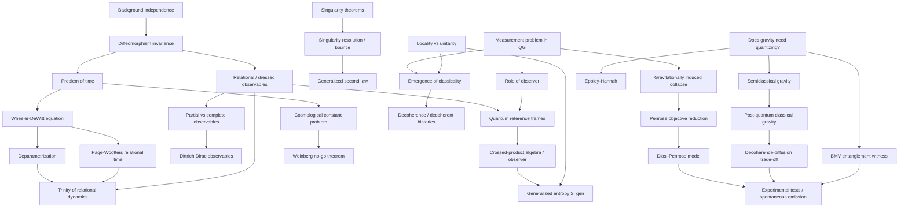

# Konceptuální problémy kvantové gravitace (Conceptual Problems of Quantum Gravity)

> **TL;DR** — Kvantová gravitace naráží na hlubší než jen technické překážky: na *problém času* (problem of time), kdy Hamiltonova vazba $\hat{H}\Psi=0$ ruší vnější časovou evoluci; na požadavek *nezávislosti na pozadí* (background independence) a s ním spjatou nutnost *relačních (dressed) pozorovatelných*; na *problém kosmologické konstanty* a Weinbergovu no-go větu; na *problém měření a role pozorovatele*; a na principiální otázku, **zda gravitaci vůbec kvantovat**. Moderní odpovědi (Page–Wootters, „trinity of relational dynamics", kvantové referenční rámce, crossed-product von Neumannovy algebry, Diósiho–Penroseův kolaps, Oppenheimova post-kvantová klasická gravitace) propojily tyto problémy s holografií, černými dírami a experimentem. Roky 2023–2026 přinesly **přímé experimentální vyloučení parametr-free Diósi–Penroseova modelu**, bouřlivou debatu o tom, **zda klasická gravitace může generovat entanglement** (Aziz–Howl 2025 vs. Marletto–Oppenheim–Vedral 2025/2026), a integraci pozorovatele do algebraické struktury gravitace.

---

## Přehled a historický kontext

Konceptuální problémy kvantové gravitace nejsou poruchové nebo výpočetní obtíže — jsou to **napětí mezi principy** obecné relativity (OTR) a kvantové mechaniky (QM), která přetrvávají napříč *všemi* přístupy (strunová teorie, smyčková gravitace, asymptotická bezpečnost, kauzální množiny, …). OTR je *plně vázaná* (totally constrained) reparametrizačně invariantní teorie bez kanonického Hamiltoniánu generujícího evoluci; QM naopak času privileguje jako vnější parametr Schrödingerovy rovnice. Jejich srážka definuje pole.

Historické milníky:

- **1949–1962** — P. A. M. Dirac formuluje kanonickou analýzu vázaných systémů (Diracovy vazby, Diracovy pozorovatelné). R. Arnowitt, S. Deser, C. Misner (ADM, 1962) zavádějí $3+1$ rozklad metriky, jenž odhaluje, že Hamiltonián OTR je *součtem vazeb* (super-Hamiltonova vazba $\mathcal{H}$ a difeomorfismová/momentová vazba $\mathcal{H}_a$).
- **1967** — B. DeWitt a (nezávisle) J. A. Wheeler napíší **Wheelerovu–DeWittovu rovnici** (Wheeler–DeWitt equation, WdW) $\hat{\mathcal{H}}\Psi[h_{ab}]=0$ na superprostoru (space of 3-geometrií). Vlnová funkce vesmíru „nezávisí na čase" — rodí se **problém času**.
- **1977** — K. Eppley a E. Hannah publikují myšlenkový experiment, jenž má dokázat, že gravitaci *je nutné* kvantovat (jinak buď porušení neurčitosti, nebo nadsvětelná signalizace).
- **1983** — D. N. Page a W. K. Wootters navrhují **relační (podmíněný) čas**: evoluce je zakódována v korelacích podsystému-hodin s ostatkem; J. Hartle a S. Hawking formulují *no-boundary* vlnovou funkci vesmíru.
- **1986–1996** — C. Rovelli zavádí **parciální vs. úplné pozorovatelné** (partial/complete observables) a relační interpretaci; L. Smolin a J. Stachel zdůrazňují *background independence*. R. Penrose (1996) navrhuje **gravitací indukovaný kolaps** vlnové funkce; L. Diósi (1987–89) k němu dospívá nezávisle.
- **2001–2008** — B. Dittrich rozpracovává matematicky robustní teorii úplných (Diracových) pozorovatelných pro plnou OTR (dust/scalar reference frames).
- **2017–2021** — F. Giacomini, E. Castro-Ruiz a Č. Brukner zakládají systematickou teorii **kvantových referenčních rámců** (quantum reference frames, QRF); A. Bose et al. a C. Marletto–V. Vedral (2017) navrhují **gravitací indukovaný entanglement** (BMV) jako test kvantovosti gravitace; P. Höhn, A. Smith, M. Lock formulují **„trinity of relational dynamics"**.
- **2004–2007** — B. Dittrich poskytuje matematicky robustní teorii úplných pozorovatelných pro plnou OTR; J. Brown a K. Kuchař (1995) zavádějí *prachové* referenční pole jako fyzikální hodiny. T. Thiemann formuluje *master constraint* program pro řešení Hamiltonovy vazby v LQG.
- **2018–2022** — A. Belenchia, R. Wald et al. (BWGCBA) zpřesňují argument pro kvantování linearizované gravitace; V. Chandrasekaran, R. Longo, G. Penington a E. Witten (CLPW) zavádějí *crossed-product* (type II) algebry pozorovatele v de Sitterově prostoru, čímž propojují pozorovatele s konečnou gravitační entropií.
- **2023–2026** — Diósi–Penroseův parametr-free model *experimentálně vyloučen* (Gran Sasso); J. Oppenheim publikuje konzistentní **post-kvantovou klasickou gravitaci** s testovatelným decoherence–diffusion trade-off; crossed-product algebry (CLPW 2022/23) propojují pozorovatele s holografickou entropií; Page–Wootters poprvé aplikován na neperturbativní QG (GFT, Calcinari–Gielen 2024); živá debata 2025/26 o tom, zda *klasická* gravitace přece jen entanglement generuje (Aziz–Howl vs. Marletto–Oppenheim–Vedral–Wilson).

---

## Klíčové koncepty

- **Problém času (problem of time).** V kanonické kvantové gravitaci Hamiltonián zmizí na fyzikálních stavech ($\hat{\mathcal{H}}\Psi=0$), takže „stav vesmíru" se nevyvíjí vůči žádnému vnějšímu času. Není pak jasné, co je dynamika, jak definovat skalární součin (inner product) a jak interpretovat pravděpodobnosti. Isham (1992) rozlišuje *tři tábory* řešení: (1) čas *před* kvantováním (deparametrizace), (2) čas *po* kvantování (Page–Wootters, podmíněné pravděpodobnosti), (3) *bezčasové* přístupy (timeless, decoherent histories).

- **Deparametrizace (deparametrization).** Volba fyzikálního pole (např. nehmotný skalár, prachové pole, objem vesmíru / faktor měřítka) jako „hodin"; vůči němu pak ostatní pozorovatelné evolvují. Skalární vazba se rozřeší vůči momentu hodin a získá se „pravý" Hamiltonián. Funguje výborně v minisuperprostoru, problematicky globálně (global time problem, Gribovovy nejednoznačnosti).

- **Page–Wootters formalismus (relational/conditional time).** Globální stav $|\Psi\rangle\rangle$ splňující $\hat{H}_{\text{tot}}|\Psi\rangle\rangle=0$ se podmíní na hodnotu hodinového pozorovatelného; podmíněný stav $|\psi(t)\rangle=\langle t|\Psi\rangle\rangle$ splňuje Schrödingerovu rovnici. Čas je *korelace, ne parametr*.

- **„Trinity of relational dynamics".** Höhn–Smith–Lock (2021) dokázali ekvivalenci tří formulací relační dynamiky: (i) relační Diracovy pozorovatelné v *clock-neutral* obrazu Diracovy kvantizace, (ii) Page–Wootters Schrödingerův obraz, (iii) relační Heisenbergův obraz získaný symetrickou redukcí. Tři tváře téže fyziky propojené *kvantovými redukčními mapami*.

- **Nezávislost na pozadí (background independence).** Žádná pevná, předem daná metrika; gauge grupou je $\mathrm{Diff}(M)$. Souvisí s *hole argument* (Einstein, Stachel): difeomorfně příbuzné metriky jsou fyzikálně totožné. Neexistuje shoda na *přesné* definici — to je samo o sobě problém (SEP: „there is no firm definition of background independence on the table").

- **Difeomorfismová invariance (diffeomorphism invariance).** Pozorovatelné musí mít nulové Poissonovy závorky se všemi vazbami; proto *nemohou být lokální* v bodech variety („any quantities defined at points or regions of the spacetime manifold will clearly fail to be diffeomorphism invariant").

- **Parciální vs. úplné pozorovatelné (partial vs. complete observables).** Rovelli: *parciální* pozorovatelné (metrika, souřadnicové vzdálenosti) nejsou gauge-invariantní, ale měříme je. *Úplné* (relační, Diracovy) kódují vztah „hodnota pole $f$, když pole $T$ nabývá hodnoty $\tau$". Dittrich poskytl matematicky robustní formu pro plnou OTR.

- **Oblečené / relační pozorovatelné (dressed/relational observables).** Pole „obléknuté" gravitačním (Wilsonova čára) nebo materiálním referenčním rámcem, aby bylo gauge-invariantní. Z konstrukce *nelokální*. V poslední době propojeno s *crossed-product* von Neumannovými algebrami a pozorovatelem.

- **Kvantové referenční rámce (quantum reference frames, QRF).** Referenční systém, který je sám kvantový (může být v superpozici). Změny QRF = „superpozice souřadnicových transformací". Klíčové pro relační kvantovou teorii a pro otázku, vůči čemu je gravitační entropie definována.

- **Problém kosmologické konstanty (cosmological constant problem).** QFT predikuje vakuovou energii o ~120 (po Lorentzově invarianci ~60) řádů větší než pozorovaná $\Lambda$. **Weinbergova no-go věta** (1989): žádná lokální polní teorie s gravitací nemá ploché řešení pro generické parametry bez jemného ladění.

- **Singularitní věty (singularity theorems).** Penrose (1965), Hawking, Penrose–Hawking: za generických energetických podmínek OTR predikuje *geodetickou neúplnost* (geodesic incompleteness). Otázka: rozřeší kvantová gravitace singularitu (bounce), nebo ji jen „rozmaže" do oblasti velké, ale konečné křivosti?

- **Gravitací indukovaný kolaps (gravitationally induced collapse).** Penrose (objective reduction, OR) a Diósi: superpozice odlišných hmotnostních rozložení = superpozice neslučitelných geometrií, jež je nestabilní a kolabuje za čas $\tau\approx\hbar/E_G$, kde $E_G$ je gravitační self-energie rozdílu rozložení.

- **Problém měření v KG a role pozorovatele.** Pokud je vesmír (včetně pozorovatele) plně kvantový a unitárně se vyvíjí, kdo provádí měření? Dekoherence pouze přesouvá problém (vyžaduje pre-definovaný pointer basis a vnější stopu přes prostředí), neřeší ho.

- **Lokalita vs. unitarita.** Černá díra: unitarita Hawkingova výparu vyžaduje korelace pozdního záření s raným, hladkost horizontu vyžaduje entanglement s vnitřními partnery — *monogamie entanglementu* je porušena (firewall). Řešení často obětuje lokalitu (ER=EPR, ostrovy/islands, holografie).

- **Vznik klasičnosti (emergence of classicality).** Jak z bezčasového, nelokálního, fundamentálně kvantového popisu vznikne klasický prostoročas s ostrými trajektoriemi? Dekoherence, decoherent histories, semiklasický limit, případně gravitační kolaps.

- **Zda gravitaci kvantovat (does gravity need quantizing).** Argumenty *pro*: Eppley–Hannah (1977), Belenchia–Wald et al. (BWGCBA 2018, causality+complementarity), nutnost konzistence. Argumenty *proti / agnostické*: semiklasická gravitace (Møller–Rosenfeld), Oppenheimova post-kvantová klasická gravitace, kritika Eppley–Hannah (Mattingly, Kent, Huggett–Callender).

---

## Matematický rámec

### Wheelerova–DeWittova rovnice

$$\hat{\mathcal{H}}\,\Psi[h_{ab}] = \left[-16\pi G\,\hbar^2\,G_{abcd}\frac{\delta^2}{\delta h_{ab}\,\delta h_{cd}} - \frac{\sqrt{h}}{16\pi G}\left({}^{(3)}R - 2\Lambda\right) + \hat{\mathcal{H}}_{\text{matter}}\right]\Psi[h_{ab}] = 0$$

**Vysvětlení symbolů.** $\Psi[h_{ab}]$ je vlnový *funkcionál* na superprostoru (prostoru 3-metrik $h_{ab}$). $G_{abcd}=\tfrac{1}{2}h^{-1/2}(h_{ac}h_{bd}+h_{ad}h_{bc}-h_{ab}h_{cd})$ je **DeWittova supermetrika** (signatura $(-,+,+,+,+,+)$ — má *jeden záporný směr*, faktor měřítka, jenž může hrát roli vnitřního času). ${}^{(3)}R$ je Ricciho skalár 3-geometrie, $\Lambda$ kosmologická konstanta, $\hat{\mathcal{H}}_{\text{matter}}$ příspěvek hmoty. **Význam:** rovnice nemá člen $i\hbar\,\partial_t$ — *není v ní vnější čas*. To je matematické jádro problému času. Trpí navíc nejednoznačností uspořádání operátorů (operator ordering), regularizací a otázkou, zda funkcionální diferenciální rovnice vůbec dává smysl.

### Hamiltonova vazba ve FLRW minisuperprostoru

$$\mathcal{H} = -\frac{p_a^2}{24\,V_0\,a} + \frac{p_\phi^2}{2\,V_0\,a^3} + V_0\,a^3\,V(\phi) - \frac{3\,V_0\,k\,a}{8\pi G} \approx 0$$

**Vysvětlení.** $a$ je faktor měřítka, $p_a$ jeho kanonický moment, $\phi$ homogenní skalární pole s momentem $p_\phi$, $V_0$ souřadnicový objem, $k\in\{-1,0,+1\}$ křivost, $V(\phi)$ potenciál. **Význam:** ve FLRW se nekonečně-dimenzionální WdW redukuje na *jednu* rovnici, kterou lze řešit. Po kanonické kvantizaci ($p\to-i\hbar\,\partial$) vznikne kvantová kosmologie; deparametrizace volí $\phi$ nebo $a$ za hodiny. Práce [Kaimakkamis, Partouche, Sil & Toumbas 2024](https://arxiv.org/abs/2412.18532) ukazuje, že pro každou volbu míry dráhového integrálu existuje správné uspořádání operátorů a že všechny tyto zdánlivě odlišné kvantové teorie splňují jednu *univerzální* WdW rovnici nezávislou na původní prescription.

### Relační (úplná) Diracova pozorovatelná

$$F_{[f,T]}(\tau) = \sum_{n=0}^{\infty}\frac{(\tau-T)^n}{n!}\,\{f,\mathcal{H}\}_{(n)}\,, \qquad \{f,\mathcal{H}\}_{(0)}:=f,\quad \{f,\mathcal{H}\}_{(n)}:=\{\{f,\mathcal{H}\}_{(n-1)},\mathcal{H}\}$$

**Vysvětlení.** $f$ je parciální pozorovatelná (gauge-závislé pole), $T$ je *clock* pole (jiná parciální pozorovatelná), $\tau$ je číselná hodnota, kterou hodiny nabývají, $\mathcal{H}$ je vazba (generátor gauge toku), $\{,\}$ Poissonova závorka, mocninná řada je opakovaný tok. **Význam:** $F_{[f,T]}(\tau)$ je gauge-invariantní (Diracova) pozorovatelná kódující „hodnotu $f$, když $T=\tau$". Tím se *relačně* obejde problém času — dynamika je posloupnost korelací. Zavedl Rovelli, robustně rozpracoval [Dittrich 2007](https://arxiv.org/abs/gr-qc/0411013) (review [Tambornino 2012](https://arxiv.org/abs/1109.0740)).

### Page–Wootters podmíněný stav

$$|\psi(t)\rangle_S = \langle t|_C\,|\Psi\rangle\rangle\,, \qquad \big(\hat{H}_C\otimes\mathbb{1}_S + \mathbb{1}_C\otimes\hat{H}_S\big)|\Psi\rangle\rangle = 0 \;\Longrightarrow\; i\hbar\,\frac{d}{dt}|\psi(t)\rangle_S = \hat{H}_S\,|\psi(t)\rangle_S$$

**Vysvětlení.** $|\Psi\rangle\rangle$ je *bezčasový* globální stav (řešení WdW-typu vazby), $C$ je hodinový podsystém s Hamiltoniánem $\hat{H}_C$, $S$ zbytek, $|t\rangle_C$ vlastní stav „časového" operátoru hodin. **Význam:** podmíněním na hodiny získá zbytek systému *zdánlivou* Schrödingerovu evoluci, ačkoli globálně je vše statické. Toto je „čas po kvantování" [Page & Wootters 1983](https://doi.org/10.1103/PhysRevD.27.2885).

### Penroseův čas objektivní redukce

$$\tau_{\text{OR}} \approx \frac{\hbar}{E_G}\,, \qquad E_G = -4\pi G\!\int\!\!\!\int \frac{\big[\rho_1(\mathbf{x})-\rho_2(\mathbf{x})\big]\big[\rho_1(\mathbf{y})-\rho_2(\mathbf{y})\big]}{|\mathbf{x}-\mathbf{y}|}\,d^3x\,d^3y$$

**Vysvětlení.** $E_G$ je **gravitační self-energie rozdílu** dvou hmotnostních rozložení $\rho_1,\rho_2$ v superpozici, $G$ Newtonova konstanta, $\hbar$ Planckova. **Význam:** superpozice se rozpadne za $\tau_{\text{OR}}$. Pro elektron $E_G$ nepatrné ($\tau\gg$ stáří vesmíru), pro zrnko prachu blízko Planckovy hmotnosti ($\sim10^{-8}$ kg) kolaps za ~sekundu. Diósiho stochastická realizace přidává difuzní šum a *emisi záření* z nabitých částic — to je experimentálně testovatelné.

### Decoherence–diffusion trade-off (Oppenheim)

$$2\,D_2 \succeq D_1^{\,\mathrm{br}}\,D_0^{-1}\,\big(D_1^{\,\mathrm{br}}\big)^{\dagger}$$

**Vysvětlení.** $D_0$ je matice **dekoherenčních (Lindbladových) koeficientů** kvantového systému, $D_2$ matice **difuzních koeficientů** klasické (gravitační) proměnné, $D_1^{\mathrm{br}}$ je **koeficient zpětné reakce (back-reaction)**, $\succeq$ značí pozitivní semidefinitnost. **Význam:** *jakákoli* konzistentní (CPTP, Markovovská) hybridní klasicko-kvantová dynamika musí splňovat tuto nerovnost — difuze metriky je zdola omezena vazbou $D_1$ dělenou dekoherencí, takže dlouhé koherenční časy (malá dekoherence) *vynucují* silnou difuzi metriky. (Opraveno proti Oppenheim et al. 2023, rov. 23; dříve uváděný tvar bez vazby $2D_2D_0\succeq\mathbb{1}$ byl nesprávný.) To dává **dvojí experimentální sevření**: zlepšení interferometrie (méně dekoherence) ⇒ více difuze ⇒ rozpor s měřením šumu (LISA Pathfinder, torzní váhy). [Oppenheim et al. 2023](https://arxiv.org/abs/2203.01982).

### Weinbergova no-go podmínka

$$\frac{\partial \mathcal{L}_{\text{eff}}}{\partial \phi_n}\bigg|_{\langle\phi\rangle} = 0 \quad \forall n \qquad\Longrightarrow\qquad \text{flat space jen pro fine-tuned parametry}$$

**Vysvětlení.** $\mathcal{L}_{\text{eff}}$ je efektivní Lagrangián včetně gravitace, $\phi_n$ pole (včetně metriky), $\langle\phi\rangle$ vakuum. **Význam:** aby existovalo ploché řešení s $\Lambda=0$, musí *všechny* polní rovnice být splněny současně — to obecně vyžaduje jemné ladění; přidání skalárního pole „adjustujícího" $\Lambda$ k nule selhává (pole uteče do nuly nebo žádné statické řešení neexistuje). [Weinberg 1989](https://doi.org/10.1103/RevModPhys.61.1).

### Semiklasická Einsteinova rovnice a Schrödinger–Newton

$$G_{\mu\nu}[g] + \Lambda g_{\mu\nu} = 8\pi G\,\langle\psi|\hat{T}_{\mu\nu}|\psi\rangle\,, \qquad i\hbar\,\partial_t\psi(\mathbf{r}) = \left[-\frac{\hbar^2}{2m}\nabla^2 - Gm^2\!\!\int\!\frac{|\psi(\mathbf{r}')|^2}{|\mathbf{r}-\mathbf{r}'|}d^3r'\right]\psi(\mathbf{r})$$

**Vysvětlení.** Levá rovnice (Møller–Rosenfeld): klasická metrika $g_{\mu\nu}$ je buzena *střední hodnotou* tenzoru energie-hybnosti kvantové hmoty. Pravá rovnice je její nerelativistický nelineární limit pro jednu částici (vlastní gravitační potenciál závisí na $|\psi|^2$). **Význam:** kandidát na *neku­vantovou* gravitaci. Naráží na nelinearitu (superluminální signály, porušení Bornova pravidla), pokud se bere doslova přes superpozice. Stochastická gravitace (Hu–Verdaguer) ji rozšiřuje **Einstein–Langevinovou rovnicí** přidáním šumu z fluktuací $\hat{T}_{\mu\nu}$.

### Crossed-product algebra a generalizovaná entropie

$$\mathcal{A}_{\text{obs}} = \mathcal{A}_{\text{QFT}} \rtimes \mathbb{R} \;\;(\text{type II})\,, \qquad S(\hat{\rho}) = \frac{\langle A\rangle}{4 G_N} + S_{\text{out}} + \text{const} = S_{\text{gen}}$$

**Vysvětlení.** $\mathcal{A}_{\text{QFT}}$ je (type III$_1$) algebra QFT v podoblasti, $\rtimes\mathbb{R}$ je *crossed product* s modulárním tokem (přidání pozorovatelových hodin s omezeným spektrem), $\langle A\rangle$ plocha horizontu, $S_{\text{out}}$ entanglementní entropie vně. **Význam:** přidání pozorovatele/hodin (kvantového referenčního rámce) převede type III algebru bez dobře definované entropie na type II s *renormalizovanou* hustotní maticí, jejíž entropie *je* zobecněná entropie $S_{\text{gen}}$. Most mezi *pozorovatelem v kvantové gravitaci* a *holografickou entropií* [CLPW 2022](https://arxiv.org/abs/2206.10780).

---

## Klíčové výsledky a milníky

- **Wheelerova–DeWittova rovnice (1967).** Definuje problém času. [DeWitt 1967](https://doi.org/10.1103/PhysRev.160.1113): „Quantum Theory of Gravity I". Statická vlnová funkce vesmíru; absence vnějšího času je strukturální, ne odstranitelná.

- **Page–Wootters relační čas (1983).** [Page & Wootters 1983](https://doi.org/10.1103/PhysRevD.27.2885): „Evolution without evolution". Čas jako korelace mezi hodinami a systémem. Dlouho kritizováno (Kuchař 1991: problémy s propagátory a více hodinami), revitalizováno 2015+ (Marletto–Vedral, Giovannetti et al.).

- **Eppley–Hannah (1977).** Argument, že gravitace *musí* být kvantová: klasická grav. vlna měřící kvantovou částici buď poruší neurčitost, nebo umožní nadsvětelnou signalizaci. Široce zpochybněno: [Mattingly 2006](https://arxiv.org/abs/gr-qc/0601127) (přístroj nelze postavit ani principiálně), [Kent 2018](https://arxiv.org/abs/1807.08708) (jednoduché vyvrácení), Huggett–Callender, Albers et al.

- **Rovelliho relační program (1991–2002).** Parciální/úplné pozorovatelné, relační QM [Rovelli 1996](https://arxiv.org/abs/quant-ph/9609002). Posun od „kde je čas?" k „co je gauge-invariantní fyzika?".

- **Dittrichovy úplné pozorovatelné (2004–2007).** [Dittrich 2007](https://arxiv.org/abs/gr-qc/0411013): robustní konstrukce Diracových pozorovatelných pro plnou OTR pomocí materiálních referenčních polí (prach – Brown–Kuchař 1995; skalár).

- **Penroseova objektivní redukce (1996).** [Penrose 1996](https://doi.org/10.1007/BF02105068): „On Gravity's Role in Quantum State Reduction". $\tau\approx\hbar/E_G$. Diósi (1987) dospěl k téže formuli z modelu lokalizace. Spojuje problém měření *přímo* s gravitací.

- **Weinbergova no-go věta (1989).** [Weinberg 1989](https://doi.org/10.1103/RevModPhys.61.1): „The cosmological constant problem". Klasifikuje pokusy o řešení (antropický, symetrie, adjustment) a ukazuje, proč selhávají. Rozšířeno na kvantovou gravitaci [2017](https://arxiv.org/abs/1706.05804).

- **BMV návrh (2017).** [Bose et al. 2017](https://arxiv.org/abs/1707.06050) a [Marletto & Vedral 2017](https://arxiv.org/abs/1707.06036): gravitací indukovaný entanglement dvou hmot ~$10^{-14}$ kg jako *witness* kvantovosti gravitace (lokální operace + klasická komunikace nemohou vytvořit entanglement ⇒ pokud gravitace entangluje, není LOCC-klasická).

- **BWGCBA argument (2018).** [Belenchia, Wald, Giacomini, Castro-Ruiz, Brukner, Aspelmeyer 2018](https://arxiv.org/abs/1807.07015): konzistence Gedankenexperimentu s grav. superpozicí vyžaduje *kvantování gravitačního záření* + vakuové fluktuace omezující lokalizaci na Planckovu délku. Silná podpora pro kvantovou (linearizovanou) gravitaci; opravuje dřívější Mari et al. a Baym–Ozawa.

- **„Trinity of relational dynamics" (2021).** [Höhn, Smith, Lock 2021](https://arxiv.org/abs/1912.00033): ekvivalence Page–Wootters ⇔ Diracovy relační pozorovatelné ⇔ symetrická redukce. Sjednocuje tábory řešení problému času.

- **Crossed-product / observer algebry (2022–2023).** [CLPW 2022](https://arxiv.org/abs/2206.10780) (de Sitter, type II$_1$), [Witten 2021](https://arxiv.org/abs/2112.12828) (gravity and the crossed product). Pozorovatel mění type III na type II; entropie = $S_{\text{gen}}$.

- **Diósi–Penrose model experimentálně vyloučen (2021).** [Donadi et al. 2021, Nature Physics](https://arxiv.org/abs/2111.13490): měření spontánní emise záření v Gran Sasso vylučuje *parametr-free* (Penroseovu, $R_0\to$ velikost jádra) verzi DP modelu; spodní mez na $R_0$ posunuta o ~3 řády. Nejcitlivější testy jsou *neinterferometrické* (difuze, emise), ne interferenční.

- **No-boundary a measure problem (1983).** [Hartle & Hawking 1983](https://doi.org/10.1103/PhysRevD.28.2960): vlnová funkce vesmíru jako euklidovský dráhový integrál přes kompaktní 4-geometrie bez hranice. Susskind a další: kosmologická konstanta favorizuje velkou euklidovskou 4-polokouli ⇒ predikce téměř prázdného de Sitterova vesmíru — *measure problem*. Konkurující *tunneling* návrh (Vilenkin) dává opačné váhy.

- **Post-kvantová klasická gravitace (2018–2026).** [Oppenheim 2023, Phys. Rev. X](https://arxiv.org/abs/1811.03116): konzistentní CPTP stochastická teorie klasické metriky + kvantové hmoty. Decoherence–diffusion trade-off $2D_2\succeq D_1^{\mathrm{br}}D_0^{-1}(D_1^{\mathrm{br}})^{\dagger}$ [Oppenheim et al. 2023](https://arxiv.org/abs/2203.01982) dává testovatelnou predikci. Linearizace kolem Minkowského ([2026](https://arxiv.org/abs/2605.05375)) odhaluje difuzní spin-2 a spin-0 módy; meze přes LISA Pathfinder a FLRW pozadí.

- **Meze na spacetime diffusion (2024).** [Janse, Uitenbroek et al. (Leiden) 2024](https://arxiv.org/abs/2403.08912): přehled experimentů s nízkým silovým šumem od jednotlivých atomů po kilogramové hmoty; atomová interferometrie zlepšuje figure of merit o 25 řádů vůči původnímu Cavendishově odhadu Oppenheima et al. a *padá pod* spodní mez ultralokálního diskrétního modelu; nelokální spojitý model přežívá o řád. Klasická gravitace je experimentálně tlačena ke zdi.

- **GFT relační dynamika (2024).** [Calcinari & Gielen 2024](https://arxiv.org/abs/2407.03432): deparametrizovaná GFT = clock-neutral kanonická GFT v Page–Wootters interpretaci ⇒ *první* aplikace Page–Wootters přímo na neperturbativní QG. Související efektivní relační kosmologii z GFT rozpracovali Marchetti & Oriti.

- **Singularity a species scale (2025).** [„Constraints on the resolution of spacetime singularities" 2025](https://arxiv.org/abs/2510.25927): Penroseova–Wallova věta s neperturbativně dokázaným GSL na *species scale* $cG$ (kde $c$ = počet polí, $G$ = Newtonova konstanta) ⇒ outer-trapped surface implikuje geodetickou neúplnost; klasická BTZ se *zhoršuje*, null singularita na Rindlerově horizontu se *rozřeší*. Ukazuje, že ne každá singularita se kvantově „uzdraví".

- **Brown–Kuchař a materiálové hodiny (1995).** Brown & Kuchař zavádějí prachové pole jako fyzikální referenční rámec, vůči němuž se deparametrizuje plná OTR — první analyticky řešitelný most mezi formálními úplnými pozorovatelnými a explicitní dynamikou.

- **Tabletop = test interpretace QM (2022).** [Adlam 2022](https://arxiv.org/abs/2204.08064): BMV-typu experimenty nejsou jen testy kvantovosti gravitace, ale *zároveň* testy interpretace kvantové mechaniky — $\psi$-úplné interpretace predikují pozitivní výsledek, $\psi$-nefyzikální nikoli; pozitivní výsledek by vyloučil třídu $\psi$-neúplné kvantové gravitace (PIQG). Konceptuální problémy se nedají od experimentu oddělit.

---

## Současný stav (2024–2026)

Pole se v současnosti soustředí na **operacionalizaci** dříve filosofických otázek do **testovatelných predikcí** a na **algebraické/relační sjednocení**:

1. **Živá debata: generuje klasická gravitace entanglement?** [Aziz & Howl 2025 (Nature)](https://arxiv.org/abs/2510.19714) tvrdí, že *klasická* gravitační interakce může přenášet kvantovou informaci a generovat entanglement „fyzikálně lokálními procesy", čímž zpochybňují interpretaci BMV jako jednoznačného testu kvantovosti. Okamžitá protireakce: [Marletto, Oppenheim, Vedral, Wilson, „Classical gravity cannot mediate entanglement" 2025](https://arxiv.org/abs/2511.07348) (model buď neentangluje, nebo entanglement zprostředkuje kvantovaná *hmota*, ne gravitace) a Gundhi et al. (zahozené amplitudy; po jejich započtení faktorizovaný stav zůstává faktorizovaný). Stav: nevyřešeno, jádro sporu je definice „lokálního mediátoru" a *local tomography*.

2. **Diósi–Penrose: doladění a rozšíření.** Po vyloučení parametr-free verze (2021) se zkoumá *modifikovaná* DP (nenulový $R_0$), atomistické výpočty $\tau$ pro molekuly až biostruktury [2024](https://pubs.rsc.org/en/content/articlepdf/2024/cp/d4cp02364a), neinterferometrické testy (difuze, emise) jako nejcitlivější cesta. Nejnovější teoretický směr: [Jusufi, Singleton & Lobo 2025](https://arxiv.org/abs/2512.15393) vkládají *nelokální* gravitační self-energii motivovanou strunově inspirovanou T-dualitou do Schrödinger–Newtonovy rovnice — prostoročas má vnitřní nelokalitu, lineární superpozice se stává jen aproximací a kolaps plyne z napětí mezi principem ekvivalence a principem superpozice. Přímý most ke strunové teorii.

3. **Spacetime diffusion bounds.** [Janse, Uitenbroek et al. (Leiden) 2024 (Phys. Rev. Research)](https://arxiv.org/abs/2403.08912): atomová interferometrie (Asenbaum et al.) zlepšuje figure of merit o 25 řádů vůči Cavendishovi a *pod* spodní mez ultralokálního diskrétního modelu; nelokální spojitý model přežívá o řád. Celkové sevření je nejméně o 15 řádů těsnější než původní meze Oppenheima et al. Klasická gravitace je *experimentálně tlačena ke zdi*.

4. **Page–Wootters jde do plné kvantové gravitace.** [Calcinari & Gielen 2024/25](https://arxiv.org/abs/2407.03432): *první* aplikace Page–Wootters přímo na neperturbativní kvantovou gravitaci (group field theory); ukazují, že clock-neutral GFT je *ekvivalentní* deparametrizované kanonické GFT interpretované přes Page–Wootters formalismus. Vesmír expandující vůči skalárním materiálním hodinám vystupuje z diskrétních „cihel" geometrie. Příbuznou efektivní relační kosmologii z GFT rozvíjejí Marchetti & Oriti.

5. **Pozorovatel a algebry.** Crossed-product konstrukce (CLPW, Witten, Gomez, Kudler-Flam–Leutheusser–Satishchandran) se prohlubují: gravitačně „obléknuté" algebry na libovolném Killingově horizontu jsou type II se stopou a jejich von Neumannova entropie *je* zobecněná entropie [Kudler-Flam–Leutheusser–Satishchandran 2023](https://arxiv.org/abs/2309.15897); volba různých QRF dává různé algebry, tedy gravitační entropie je *observer-dependent*, přičemž QRF a crossed product jsou tatáž věc [De Vuyst, Eccles, Höhn, Kirklin 2024](https://arxiv.org/abs/2412.15502). Most na holografii a entanglement-spacetime.

6. **QRF a equivalence principle.** Giacomini–Brukner: superpozice prostoročasů respektuje Einsteinův princip ekvivalence. Souběžně probíhá *kritická* revize základů QRF — [Lake & Miller 2023](https://arxiv.org/abs/2312.03811) zpochybňují mainstreamový přístup a *odmítají* reprezentovat transformace mezi QRF unitárními operátory, čímž otevírají spor o samotnou definici kvantového referenčního rámce.

7. **BMV experiment: inženýrská fronta.** Velkospinová Sternova–Gerlachova interferometrie [2023](https://arxiv.org/abs/2312.05170), nanodiamanty v Paulových pastích [2025](https://arxiv.org/abs/2508.14272); hlavní překážky: chlazení do základního stavu, diamagnetická odezva prodlužující splitting time. Realizace na roky.

---

## Kvantitativní fakta a čísla (pro rychlou orientaci)

- **Planckova škála:** $\ell_{\text{Pl}}=\sqrt{\hbar G/c^3}\approx1{,}616\times10^{-35}$ m, $t_{\text{Pl}}\approx5{,}39\times10^{-44}$ s, $m_{\text{Pl}}=\sqrt{\hbar c/G}\approx2{,}18\times10^{-8}$ kg ($\approx1{,}22\times10^{19}$ GeV). Zde se očekává selhání singularitních vět a kvantová geometrie.
- **Problém kosmologické konstanty:** naivní QFT odhad $\rho_{\text{vac}}\sim M_{\text{Pl}}^4$ vs. pozorované $\rho_\Lambda\sim10^{-122}\,M_{\text{Pl}}^4$ ⇒ rozdíl **~120 řádů** (po Lorentzově invarianci/SUSY argumentech ~60 řádů). Pozorováno $\Omega_\Lambda\approx0{,}69$.
- **Penroseův kolaps:** $\tau\approx\hbar/E_G$. Elektron: $\tau\gg$ stáří vesmíru ($\sim10^{17}$ s). Zrnko prachu $\sim m_{\text{Pl}}$ ($\sim10^{-8}$ kg): $\tau\sim1$ s. Mezi mezoskopickým a makroskopickým je quantum-to-classical přechod (Diósi–Penrose).
- **Diósi–Penrose vyloučení:** Gran Sasso (2021) měřením spontánní gama-emise z germania vyloučilo *parametr-free* DP model a posunulo spodní mez na $R_0$ o ~3 řády; $R_0\gtrsim0{,}5\times10^{-10}$ m je vyloučeno pro $R_0=$ velikost jádra.
- **Spacetime diffusion:** atomová interferometrie (Asenbaum et al.) zlepšuje figure of merit o **25 řádů** vůči Cavendishovi, padá pod spodní mez ultralokálního diskrétního modelu; nelokální spojitý model přežívá o **~1 řád**. LISA Pathfinder: zlepšení o **19 řádů** (relativní měření).
- **BMV:** hmotnosti $\sim10^{-14}$ kg, separace superpozice $\sim$ desítky µm až 100 µm, interakční čas $\sim$ s; vyžaduje koherenci řádu sekund pro detekci grav. fáze $\sim$ rad.
- **DeWittova supermetrika:** signatura $(-,+,+,+,+,+)$ — *jeden* záporný směr (konformní/scale mode), jenž slouží jako vnitřní čas; proto je WdW „klein-gordonovská", ne „schrödingerovská".
- **Algebry:** QFT v podoblasti = type III$_1$ (bez stopy, UV-divergentní entanglement); s pozorovatelem/QRF = type II (stopa, konečná relativní entropie); $S_{\text{gen}}=A/4G_N+S_{\text{out}}$.

---

## Otevřené problémy

1. **Globální problém času (global time problem).** I tam, kde lze lokálně deparametrizovat, neexistuje *globální* monotónní hodinová proměnná na celém vazebním povrchu (Gribovovy nejednoznačnosti, turning points, kde $\dot{T}=0$). *Proč je to těžké:* topologie superprostoru a nelineární vazba brání globálnímu Schrödingerovu obrazu; různé volby hodin dávají *neunitárně* příbuzné kvantizace.

2. **Vnitřní součin a interpretace pravděpodobností (Hilbert space problem).** Pro řešení WdW není kanonický, kladně definitní, gauge-invariantní skalární součin (induced/Rieffel, refined algebraic quantization jsou kandidáti, ne univerzální řešení). *Proč:* indefinitní DeWittova supermetrika; spektrum vazby často obsahuje nulu spojitě.

3. **Pozorovatelné v plné kvantové gravitaci (full observables).** Relační/Diracovy pozorovatelné jsou formálně definovány, ale prakticky nespočítatelné mimo minisuperprostor a deparametrizovatelné matériové modely. *Proč:* nekonečná mocninná řada vnořených Poissonových závorek s nelokální super-Hamiltonovou vazbou; v hlubokém kvantovém režimu chybí klasický referenční rámec.

4. **Definice nezávislosti na pozadí (background independence).** Neexistuje shoda na *přesné* definici (Anderson, Giulini, Pooley, Read 2023); spor LQG vs. strunová teorie možná „talks past each other". *Proč:* zaměňují se difeomorfismová invariance, absence absolutních objektů, a dynamičnost geometrie.

5. **Problém kosmologické konstanty.** Weinbergova no-go vylučuje generická lokální řešení; ani strunová krajina (landscape), unimodulární gravitace, sekvestrace (sequestering), nelokální gravitace nedávají *odvozenou* hodnotu $\Lambda\sim10^{-122}\,M_{\text{Pl}}^4$. *Proč:* spojuje UV (vakuová energie) s IR (kosmologie) a vyžaduje buď anthropiku, nebo dosud neznámou symetrii/mechanismus.

6. **Rozřeší kvantová gravitace singularity?** LQC dává robustní *bounce* v symetricky redukovaných modelech, ale není dokázáno, že platí v *plné* nehomogenní teorii; species-scale věty [2025](https://arxiv.org/abs/2510.25927) ukazují, že některé singularity se *zhoršují*. *Proč:* singularitní věty se opírají o klasické energetické podmínky a GSL; jejich kvantové analogy jsou jen částečně dokázány.

7. **Problém měření a pozorovatele.** Kdo/co kolabuje vlnovou funkci vesmíru, když je pozorovatel uvnitř? Dekoherence vyžaduje vnější stopu a pointer basis. *Proč:* uzavřený vesmír nemá vnější prostředí; many-worlds, relační QM, gravitační kolaps a QRF dávají *neslučitelné* ontologie.

8. **Je gravitace kvantová?** Žádný *bezesporný* teoretický argument (Eppley–Hannah vyvrácen, BWGCBA závisí na předpokladech) ani experiment zatím nerozhodl. *Proč:* konzistentní klasicko-kvantové teorie (Oppenheim) existují; rozhodne až pozorování entanglementu (BMV) nebo difuze — obojí na hranici technologie.

9. **Lokalita vs. unitarita.** Informační paradox černých děr: zachování unitarity (Page curve z ostrovů/replica wormholes) zřejmě vyžaduje *nelokalitu* (ER=EPR, holografie). *Proč:* monogamie entanglementu + hladkost horizontu + unitarita jsou neslučitelné bez obětování lokality nebo efektivní QFT.

10. **Emergence klasického prostoročasu.** Jak z bezčasového, fundamentálně diskrétního/algebraického popisu vznikne hladký lorentzovský prostoročas s ostrými geodetikami a šipkou času? *Proč:* dekoherence předpokládá rozdělení na podsystémy, které samo není background-independentně definováno.

---

## Vztahy k ostatním přístupům

### Smyčková kvantová gravitace (loop-quantum-gravity) — **dobře prozkoumáno**
Konceptuální problémy *vznikly* z kanonické (LQG) tradice: problém času, difeomorfismová invariance, relační pozorovatelné jsou centrální. LQG poskytuje konkrétní realizaci (spin-network stavy, Diracovy vazby), Thiemannův master constraint, materiálové referenční rámce (Brown–Kuchař dust, Rovelli–Smolin). LQC dává explicitní *bounce* (singularity resolution). Most je hustý a obousměrný.

### Group field theory (group-field-theory) — **částečně prozkoumáno**
Nejnovější most: Page–Wootters formalismus *přímo* aplikován na GFT [Calcinari & Gielen 2024/25](https://arxiv.org/abs/2407.03432), kde prostoročas je emergentní a čas je nutně relační (skalární materiální hodiny). Deparametrizovaná GFT = clock-neutral kanonická GFT v Page–Wootters interpretaci. Související efektivní relační kosmologii z GFT rozvíjejí Marchetti & Oriti. Konceptuálně klíčové, technicky čerstvé — prostor pro rozvoj.

### Kvantová kosmologie (quantum-cosmology) — **dobře prozkoumáno**
Minisuperprostor je *laboratoř* problému času: WdW ve FLRW, deparametrizace skalárem/objemem, no-boundary (Hartle–Hawking) a tunneling (Vilenkin) vlnové funkce, measure problem. Page–Wootters a decoherent histories se zde testují, stejně jako Bohmovská kvantová kosmologie (definite trajektorie obcházejí problém měření). Lorentzovský dráhový integrál (Picard–Lefschetz, Feldbrugge–Lehners–Turok) zpochybnil stabilitu no-boundary návrhu. Most je hustý a obousměrný.

### Holografie / AdS-CFT (holography-adscft) — **částečně prozkoumáno, rychle rostoucí**
Crossed-product algebry [CLPW 2022](https://arxiv.org/abs/2206.10780) propojily *pozorovatele a QRF* (jádro konceptuálních problémů) s *generalizovanou entropií* a type II/III von Neumannovými algebrami. Background independence vs. asymptoticky AdS pozadí je klasické napětí. Relační pozorovatelné ⇔ bulk reconstruction. Tento most je dnes nejaktivnější křižovatkou.

### Černé díry a informace (black-holes-information) — **dobře prozkoumáno**
Lokalita vs. unitarita, firewall, Page curve, monogamie entanglementu — to *jsou* konceptuální problémy v konkrétním kontextu. Generalized second law je sdílen se singularitními větami. Měření/pozorovatel u horizontu (komplementarita). Hustý, obousměrný most.

### Entanglement a prostoročas (entanglement-spacetime) — **částečně prozkoumáno**
QRF, dressed observables a crossed product ukazují, že entanglementní entropie podoblasti je *observer-dependent* a vyžaduje gravitační dressing. ER=EPR jako řešení lokalita-vs-unitarita. Spojení relačního času s emergencí prostoročasu z entanglementu je slibné, ale teprve se rozvíjí.

### Semiklasická gravitace (semiclassical-gravity) — **dobře prozkoumáno**
Møller–Rosenfeldova rovnice, Schrödinger–Newton, stochastická gravitace (Einstein–Langevin, Hu–Verdaguer) jsou *kandidáti na neku­vantovou gravitaci* a zároveň *aréna problému měření/backreakce*. Eppley–Hannah, BWGCBA a Oppenheimova teorie testují její konzistenci. Hustý most.

### Experimentální testy (experimental-tests) — **částečně prozkoumáno, rychle rostoucí**
BMV entanglement, Diósi–Penrose emise (Gran Sasso), spacetime diffusion bounds (LISA Pathfinder, atomová interferometrie) převádějí konceptuální spory na čísla. Decoherence–diffusion trade-off dává *falzifikovatelnou* predikci. Toto je nejdynamičtější frontier.

### Strunová teorie (string-theory) — **částečně prozkoumáno**
Napětí o background independence (LQG kritika); $\Lambda$-problém řešen krajinou + anthropikou (kontroverzní). Singularity rozřešeny T-dualitou/branami v některých případech. Holografie (z teorie strun) je most k pozorovateli. Spojení s *fundamentálním* problémem času je slabší — struna typicky pracuje na pevném pozadí.

### Asymptotická bezpečnost (asymptotic-safety) — **sotva prozkoumáno**
AS je pozaďově *závislá* fixní bod renormalizační grupy; otázka background independence a problému času je tam *latentní*, nedávno otevřená [„Asymptotic Safety and Canonical Quantum Gravity" 2025](https://arxiv.org/abs/2507.14296). Most přes kanonickou formulaci je nový a tenký — *kandidát na nové propojení*.

### Kauzální množiny (causal-sets) — **sotva prozkoumáno**
Kauzální množiny řeší problém času *kauzalitou* (částečné uspořádání = čas), nabízejí diskrétní původ $\Lambda$ (Sorkinova fluktuační predikce $\Lambda\sim\pm1/\sqrt{V}$, řádově správná!). Spojení s relačními pozorovatelnými a Page–Wootters téměř neprozkoumáno — *slibné, podceněné*.

### Twistory a amplitudy (twistors-amplitudes) — **sotva prozkoumáno**
Amplitudový program je radikálně bezčasový (S-matice, ne evoluce); jeho vztah k problému času, pozorovatelným a background independence je málo artikulovaný. Most prakticky chybí — *bílé místo*.

### Nekomutativní geometrie (noncommutative-geometry) — **sotva prozkoumáno**
Minimální délka / GUP (generalized uncertainty principle) a nekomutativní prostoročas mění lokalitu a difeomorfismovou invarianci; vztah ke crossed-product algebrám pozorovatele je strukturně příbuzný (oboje von Neumann/operátorové algebry), ale explicitně neprozkoumaný — *kandidát na sdílenou matematiku*. GUP navíc modifikuje WdW rovnici a tím i problém času v deformované kvantové kosmologii.

### Swampland — **sotva prozkoumáno**
Swampland kritéria (de Sitter conjecture, species-scale conjecture) se dotýkají problému kosmologické konstanty (zákaz metastabilního dS s malou $\Lambda$) i podmínek na rozřešení singularit na *species scale* $cG$ [2025](https://arxiv.org/abs/2510.25927). Průnik s Weinbergovou no-go a GSL-based singularitními větami je *sugestivní, ale jen částečně rozpracovaný* — bílé místo s potenciálem.

---

## Mapa konceptů

---

## Reference

1. DeWitt, B. S. (1967). *Quantum Theory of Gravity. I. The Canonical Theory.* Phys. Rev. 160, 1113. https://doi.org/10.1103/PhysRev.160.1113 — Wheelerova–DeWittova rovnice; vznik problému času.
2. Page, D. N. & Wootters, W. K. (1983). *Evolution without evolution.* Phys. Rev. D 27, 2885. https://doi.org/10.1103/PhysRevD.27.2885 — relační/podmíněný čas.
3. Wheeler, J. A. & DeWitt — viz též Isham, C. J. (1992). *Canonical Quantum Gravity and the Problem of Time.* arXiv:gr-qc/9210011. https://arxiv.org/abs/gr-qc/9210011 — kanonická klasifikace řešení problému času (tři tábory).
4. Kuchař, K. V. (1991/2011). *Time and interpretations of quantum gravity.* Int. J. Mod. Phys. D 20, 3. https://doi.org/10.1142/S0218271811019347 — kritika Page–Wootters a přehled.
5. Anderson, E. (2012). *The Problem of Time in Quantum Gravity.* arXiv:1009.2157. https://arxiv.org/abs/1009.2157 — komplexní přehled problému času.
6. Eppley, K. & Hannah, E. (1977). *The necessity of quantizing the gravitational field.* Found. Phys. 7, 51. https://doi.org/10.1007/BF00715241 — argument pro nutnost kvantování.
7. Mattingly, J. (2006). *Why Eppley and Hannah's Experiment Isn't.* arXiv:gr-qc/0601127. https://arxiv.org/abs/gr-qc/0601127 — vyvrácení Eppley–Hannah.
8. Kent, A. (2018). *Simple Refutation of the Eppley–Hannah argument.* arXiv:1807.08708. https://arxiv.org/abs/1807.08708 — další vyvrácení.
9. Rovelli, C. (1996). *Relational Quantum Mechanics.* arXiv:quant-ph/9609002. https://arxiv.org/abs/quant-ph/9609002 — relační QM, parciální pozorovatelné.
10. Dittrich, B. (2007). *Partial and Complete Observables for Hamiltonian Constrained Systems.* Gen. Rel. Grav. 39, 1891. arXiv:gr-qc/0411013. https://arxiv.org/abs/gr-qc/0411013 — robustní konstrukce Diracových pozorovatelných.
11. Tambornino, J. (2012). *Relational Observables in Gravity: a Review.* SIGMA 8, 017. arXiv:1109.0740. https://arxiv.org/abs/1109.0740 — přehled relačních pozorovatelných; formule $F_{[f,T]}(\tau)$.
12. Höhn, P. A., Smith, A. R. H. & Lock, M. P. E. (2021). *The Trinity of Relational Quantum Dynamics.* Phys. Rev. D 104, 066001. arXiv:1912.00033. https://arxiv.org/abs/1912.00033 — ekvivalence tří formulací relační dynamiky.
13. Calcinari, A. & Gielen, S. (2024). *Relational dynamics and Page–Wootters formalism in group field theory.* Quantum 9, 1610. arXiv:2407.03432. https://arxiv.org/abs/2407.03432 — Page–Wootters v neperturbativní QG (GFT); clock-neutral GFT = deparametrizovaná kanonická GFT.
14. Giacomini, F., Castro-Ruiz, E. & Brukner, Č. (2019). *Quantum mechanics and the covariance of physical laws in quantum reference frames.* Nat. Commun. 10, 494. arXiv:1712.07207. https://arxiv.org/abs/1712.07207 — založení teorie QRF.
15. Lake, M. J. & Miller, M. (2023). *Quantum reference frames, revisited.* arXiv:2312.03811. https://arxiv.org/abs/2312.03811 — kritická revize QRF; odmítnutí unitárních QRF transformací.
16. Chandrasekaran, V., Longo, R., Penington, G. & Witten, E. (2022). *An algebra of observables for de Sitter space.* JHEP 02 (2023) 082. arXiv:2206.10780. https://arxiv.org/abs/2206.10780 — crossed product, type II, pozorovatel a $S_{\text{gen}}$.
17. Witten, E. (2021). *Gravity and the crossed product.* JHEP 10 (2022) 008. arXiv:2112.12828. https://arxiv.org/abs/2112.12828 — type III → II přidáním pozorovatele.
18. Kudler-Flam, J., Leutheusser, S. & Satishchandran, G. (2023). *Generalized Black Hole Entropy is von Neumann Entropy.* Phys. Rev. D 111, 025013. arXiv:2309.15897. https://arxiv.org/abs/2309.15897 — type II algebry na Killingově horizontu, $S_{\text{vN}}=S_{\text{gen}}$, observer-dependence.
19. De Vuyst, J., Eccles, S., Höhn, P., Kirklin, J. (2024). *Crossed products and quantum reference frames.* arXiv:2412.15502. https://arxiv.org/abs/2412.15502 — QRF = crossed product.
20. Penrose, R. (1996). *On Gravity's Role in Quantum State Reduction.* Gen. Rel. Grav. 28, 581. https://doi.org/10.1007/BF02105068 — objektivní redukce $\tau\approx\hbar/E_G$.
21. Diósi, L. (1989). *Models for universal reduction of macroscopic quantum fluctuations.* Phys. Rev. A 40, 1165. https://doi.org/10.1103/PhysRevA.40.1165 — Diósiho model gravitačního kolapsu.
22. Donadi, S., Piscicchia, K., Bassi, A. et al. (2021). *Underground test of gravity-related wave function collapse.* Nat. Phys. 17, 74. arXiv:2111.13490. https://arxiv.org/abs/2111.13490 — vyloučení parametr-free Diósi–Penrose.
23. Weinberg, S. (1989). *The cosmological constant problem.* Rev. Mod. Phys. 61, 1. https://doi.org/10.1103/RevModPhys.61.1 — no-go věta a klasifikace pokusů.
24. Oda, I. (2017). *Weinberg's No Go Theorem in Quantum Gravity.* Phys. Rev. D 96, 124012. arXiv:1706.05804. https://arxiv.org/abs/1706.05804 — rozšíření no-go na kvantovou gravitaci.
25. Capozziello, S., Mazumdar, A. & Meluccio, G. (2025). *The Weinberg no-go theorem for cosmological constant and nonlocal gravity.* Phys. Lett. B. arXiv:2502.07321. https://arxiv.org/abs/2502.07321 — obejití no-go nelokální (infinite-derivative) gravitací.
26. Bose, S., Mazumdar, A., Morley, G. W. et al. (2017). *A Spin Entanglement Witness for Quantum Gravity.* Phys. Rev. Lett. 119, 240401. arXiv:1707.06050. https://arxiv.org/abs/1707.06050 — BMV návrh (spin witness).
27. Marletto, C. & Vedral, V. (2017). *Gravitationally Induced Entanglement between Two Massive Particles is Sufficient Evidence of Quantum Effects in Gravity.* Phys. Rev. Lett. 119, 240402. arXiv:1707.06036. https://arxiv.org/abs/1707.06036 — BMV návrh (LOCC argument).
28. Belenchia, A., Wald, R. M., Giacomini, F., Castro-Ruiz, E., Brukner, Č., Aspelmeyer, M. (2018). *Quantum Superposition of Massive Objects and the Quantization of Gravity.* Phys. Rev. D 98, 126009. arXiv:1807.07015. https://arxiv.org/abs/1807.07015 — argument pro kvantování (causality+complementarity).
29. Oppenheim, J. (2023). *A Postquantum Theory of Classical Gravity?* Phys. Rev. X 13, 041040. arXiv:1811.03116. https://arxiv.org/abs/1811.03116 — konzistentní klasicko-kvantová gravitace.
30. Oppenheim, J., Sparaciari, C., Šoda, B., Weller-Davies, Z. (2023). *Gravitationally induced decoherence vs spacetime diffusion: testing the quantum nature of gravity.* Nat. Commun. 14, 7910. arXiv:2203.01982. https://arxiv.org/abs/2203.01982 — trade-off $2D_2\succeq D_1^{\mathrm{br}}D_0^{-1}(D_1^{\mathrm{br}})^{\dagger}$.
31. Janse, M., Uitenbroek, D. G., van Everdingen, L., Plugge, J., Hensen, B. & Oosterkamp, T. H. (2024). *Current experimental upper bounds on spacetime diffusion.* Phys. Rev. Research 6, 033076. arXiv:2403.08912. https://arxiv.org/abs/2403.08912 — meze na difuzi metriky (atomy až kg hmoty); 25 řádů zlepšení figure of merit, pod ultralokální mezí.
32. Oppenheim, J. & Sajjad, M. (2026). *Stochastic modes in postquantum classical gravity.* arXiv:2605.05375. https://arxiv.org/abs/2605.05375 — klasické spin-2 a spin-0 difuzní stochastické módy z linearizace kolem Minkowského, pozitivně-semidefinitní akce.
33. Li, B.-F. & Singh, P. (2023). *Loop Quantum Cosmology: Physics of Singularity Resolution and its Implications.* arXiv:2304.05426. https://arxiv.org/abs/2304.05426 — big bounce, robustnost.
34. Shahbazi-Moghaddam, A. (2025). *Constraints on the resolution of spacetime singularities.* arXiv:2510.25927. https://arxiv.org/abs/2510.25927 — Penrose–Wall věta, neperturbativní GSL na species scale $cG$, BTZ vs. null singularita.
35. Hu, B.-L. & Verdaguer, E. (2008/2020). *Stochastic Gravity: Theory and Applications.* Living Rev. Relativity 11, 3. https://doi.org/10.12942/lrr-2008-3 — semiklasická a stochastická gravitace, Einstein–Langevin.
36. Hartle, J. B. & Hawking, S. W. (1983). *Wave function of the Universe.* Phys. Rev. D 28, 2960. https://doi.org/10.1103/PhysRevD.28.2960 — no-boundary proposal, measure problem.
37. Aziz, J. & Howl, R. (2025). *Classical theories of gravity produce entanglement.* Nature 646, 813. arXiv:2510.19714. https://arxiv.org/abs/2510.19714 — kontroverzní tvrzení o klasickém entanglementu.
38. Marletto, C., Oppenheim, J., Vedral, V., Wilson, E. (2025). *Classical gravity cannot mediate entanglement.* arXiv:2511.07348. https://arxiv.org/abs/2511.07348 — protireakce na Aziz–Howl.
39. Kaimakkamis, E., Partouche, H., Sil, K. & Toumbas, N. (2024). *The exact Wheeler–DeWitt equation for the scale-factor minisuperspace model.* arXiv:2412.18532. https://arxiv.org/abs/2412.18532 — uspořádání operátorů / míra dráhového integrálu, univerzální WdW rovnice.
40. Halliwell, J. J. & Yearsley, J. M. (2007). *Spacetime Coarse Grainings in the Decoherent Histories Approach to Quantum Theory.* arXiv:gr-qc/0607072. https://arxiv.org/abs/gr-qc/0607072 — bezčasový (decoherent histories) přístup k pravděpodobnostem v reparametrizačně invariantních teoriích.
41. Adlam, E. (2022). *Tabletop Experiments for Quantum Gravity Are Also Tests of the Interpretation of Quantum Mechanics.* Found. Phys. 52, 115. arXiv:2204.08064. https://arxiv.org/abs/2204.08064 — BMV testy jako testy interpretace QM; $\psi$-neúplná kvantová gravitace.
42. Stanford Encyclopedia of Philosophy: *Quantum Gravity.* https://plato.stanford.edu/entries/quantum-gravity/ — filosofický přehled problému času, background independence, observables, Eppley–Hannah.
43. Jusufi, K., Singleton, D. & Lobo, F. S. N. (2025). *Spontaneous wave function collapse from non-local gravitational self-energy.* arXiv:2512.15393. https://arxiv.org/abs/2512.15393 — nelokální (T-duality) self-energie v Schrödinger–Newtonově rovnici; kolaps z napětí ekvivalence vs. superpozice. Most kolaps ↔ strunová T-dualita.
