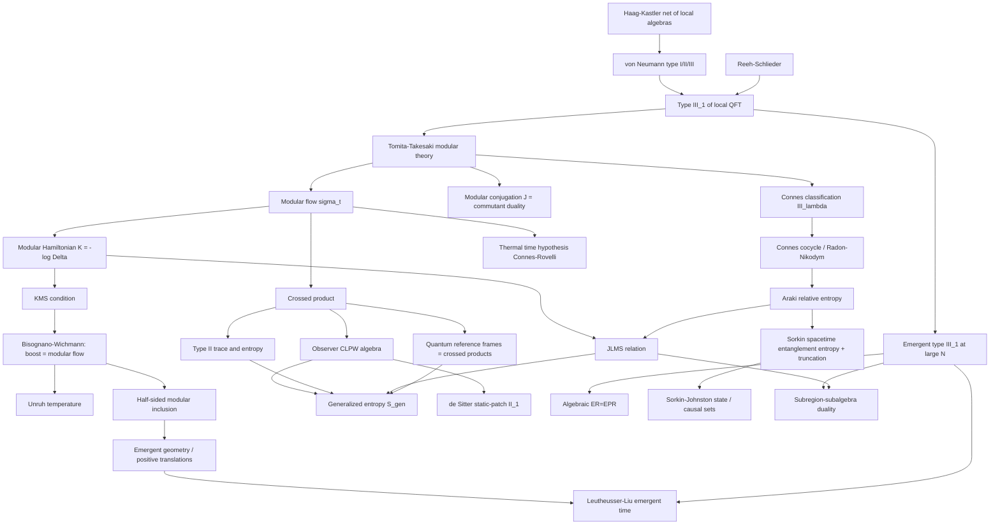

# Von Neumannovy algebry a modulární teorie v kvantové gravitaci (Von Neumann Algebras & Modular Theory in Quantum Gravity)

> **TL;DR** — Pozorovatelné lokální kvantové teorie pole netvoří obyčejnou algebru operátorů na Hilbertově prostoru (typ I), nýbrž **von Neumannovu algebru typu III$_1$** (Araki; Buchholz–Fredenhagen–Haag; Bisognano–Wichmann): nemá stopu, nemá hustotní matice a entanglementní entropie podoblasti je *principiálně UV-divergentní*. **Tomitova–Takesakiho modulární teorie** z jediného stavu kanonicky extrahuje časový tok (modulární tok $\sigma_t=\Delta^{it}(\cdot)\Delta^{-it}$), modulární Hamiltonián $K=-\log\Delta$ a dualitu algebra–komutant — bez jakéhokoli vnějšího Hamiltoniánu. Revoluce let **2022+** (Witten, Chandrasekaran–Longo–Penington–Witten, Chandrasekaran–Penington–Witten, Kudler-Flam–Leutheusser–Satishchandran) ukázala, že přidání **pozorovatele s hodinami** = **zkřížený součin (crossed product)** převádí typ III$_1$ na **typ II**, který *má* stopu a renormalizovanou entropii — a tato entropie **je zobecněná entropie** $S_{\text{gen}}=A/4G_N+S_{\text{out}}$. Modulární inkluze (Borchers–Wiesbrock) rekonstruují z čistě algebraických dat **prostoročas a kauzální strukturu** (Leutheusser–Liu: vznik horizontu, vnitřku a infalling času z modulárních dat na hranici). **Connesova–Rovelliho hypotéza termálního času** činí z modulárního toku odpověď na problém času; **kvantové referenční rámce jsou zkřížené součiny** (De Vuyst–Eccles–Höhn–Kirklin 2024), takže gravitační entropie je *závislá na pozorovateli*. Most ke třem živým hypotézám: SSEE-truncation (Sorkin), SJ stavy, generalizovaná entropie.

---

## Přehled a historický kontext

Algebraický pohled na kvantovou teorii pole (Haag–Kastler 1964) klade do popředí **síť lokálních algeber** $\mathcal{O}\mapsto\mathcal{A}(\mathcal{O})$, ne pole v bodě. Klíčové zjištění je strukturální: zatímco kvantová mechanika konečně mnoha stupňů volnosti žije v algebře typu I ($\mathcal{B}(\mathcal{H})$, ostré stavy, hustotní matice, „bity"), **lokální algebry relativistické QFT jsou typu III$_1$** — nejdivočejší třída v klasifikaci. To není technický detail: znamená to, že entanglement *není vlastnost stavů, ale algebry* (Witten 2018), že žádný stav není faktorizovatelný přes hranici (Reeh–Schlieder), a že entropie podoblasti je nutně nekonečná. Gravitace (resp. pozorovatel) musí tuto divergenci regulovat.

Modulární (Tomitova–Takesakiho) teorie je matematický motor celého oboru: z dvojice (algebra $M$, cyklický a separující vektor $|\Omega\rangle$) extrahuje *kanonický* jednoparametrický tok a dualitu $JMJ=M'$. Connes (1973) jí pomocí *modulárního spektra* klasifikoval faktory typu III na kontinuum III$_\lambda$. Connes–Rovelli (1994) z ní učinili fyzikální čas obecně kovariantní teorie. A roky 2021–2026 ji proměnily v hlavní nástroj pro **gravitační entropii, černé díry, de Sitter a holografii**.

Historické milníky:

- **1964** — R. Haag a D. Kastler zakládají **algebraickou QFT**: fyzika je v síti lokálních von Neumannových algeber.
- **1967–1970** — M. Tomita formuluje (a M. Takesaki rigorózně rozpracuje) **modulární teorii**: polární rozklad $S=J\Delta^{1/2}$, modulární tok, $JMJ=M'$.
- **1973** — A. Connes ve své thesi **klasifikuje faktory typu III** na III$_\lambda$ ($0\le\lambda\le1$) pomocí modulárního spektra $S(M)$; III$_1$ je „maximálně nekomutativní".
- **1975–1976** — J. Bisognano a E. Wichmann dokazují, že **modulární tok Rindlerova klínu je Lorentzův boost** a modulární konjugace je CPT; vakuum omezené na klín je **KMS-termální** (Unruhova teplota). Most modulární teorie ↔ geometrie.
- **1976** — H. Araki definuje **relativní entropii** stavů von Neumannovy algebry přes relativní modulární operátor — UV-konečnou i pro typ III.
- **1985, 1995** — K. Fredenhagen (a Buchholz–Verch přes *scaling algebras*) dokazují, že lokální algebry jsou **typu III$_1$**, kdykoli má teorie netriviální škálovací limitu.
- **1992–1993** — H.-J. Borchers a H.-W. Wiesbrock zavádějí **polostranné modulární inkluze (half-sided modular inclusions)**: z dvou algeber a vektoru vznikne translace s *kladným* generátorem — zárodek emergentní geometrie.
- **1994** — A. Connes a C. Rovelli: **hypotéza termálního času** — fyzikální čas obecně kovariantní teorie je modulární tok jejího (termálního) stavu.
- **2015** — D. Jafferis, A. Lewkowycz, J. Maldacena, S. J. Suh: **JLMS relace** $\hat{K}_{\text{bdy}}=\hat{A}/4G+\hat{K}_{\text{bulk}}$ — hraniční modulární tok je duální bulkovému; algebraický zárodek „$S_{\text{gen}}=$ von Neumannova entropie".
- **2018** — E. Witten popularizuje modulární teorii a typ III v review pro vysokoenergetickou komunitu.
- **2021** — S. Leutheusser a H. Liu odvozují **emergentní typ III$_1$** a infalling čas věčné AdS černé díry z modulárních dat hraniční CFT (vznik horizontu, vnitřku, kauzální struktury).
- **2021–2023** — **Revoluce zkřížených součinů.** E. Witten („Gravity and the crossed product"): typ III$_1$ černé díry → typ II$_\infty$ jako zkřížený součin s modulárním tokem. CLPW („An algebra of observables for de Sitter space"): pozorovatel v dS → typ II$_1$, entropie = $S_{\text{gen}}$, maximální stav = prázdný de Sitter. Chandrasekaran–Penington–Witten: typ II$_\infty$ na velkém $N$, entropie = $S_{\text{gen}}$, *Lorentzovské, replica-free* odvození speciálního případu QES.
- **2023–2026** — Kudler-Flam–Leutheusser–Satishchandran: **„Generalized Black Hole Entropy is von Neumann Entropy"** na *libovolném* Killingově horizontu (mimo KMS případ). Engelhardt–Liu: **algebraické ER=EPR**, přenos emergentní podalgebry typu III$_1$ v Page time. De Vuyst–Eccles–Höhn–Kirklin (2412.15502): **kvantové referenční rámce = zkřížené součiny**, gravitační entropie je závislá na pozorovateli. Rozšíření na obecné podoblasti (Jensen–Sorce–Speranza; Ali Ahmad–Jefferson), generalizovaný druhý zákon z monotonie relativní entropie, pedagogické přehledy (Leutheusser 2025).

---

## Klíčové koncepty

- **Typy von Neumannových algeber (I / II / III).** Murrayova–von Neumannova klasifikace faktorů podle rozsahu „dimenzí" projekcí. **Typ I** = $\mathcal{B}(\mathcal{H})$ (obyčejná QM, ostré stavy, hustotní matice, minimální projekce/„bity"). **Typ II** má spojitou stopu, ale *žádné* minimální projekce — má hustotní matice a relativní entropii, ale žádné čisté stavy ani bity; entropie je definována *až na aditivní konstantu*. **Typ III** nemá stopu ani hustotní matice — entanglementní entropie je principiálně UV-divergentní. Typ je *přesný matematický otisk* toho, jak se v systému chová entanglement.

- **Typ III$_1$ lokální QFT.** Centrální věta algebraické QFT: algebra pozorovatelných v libovolné ohraničené oblasti či klínu relativistické QFT je faktor **typu III$_1$**. Důsledky: žádný stav není nekorelovaný přes hranici, každý vektor je cyklický a separující (Reeh–Schlieder), neexistují lokální hustotní matice a entropie podoblasti je UV-divergentní. Gravitace/pozorovatel ji musí regulovat.

- **Tomitova–Takesakiho modulární teorie.** Pro $M$ s cyklickým a separujícím $|\Omega\rangle$ má uzávěr antilineární mapy $S\,a|\Omega\rangle=a^\dagger|\Omega\rangle$ polární rozklad $S=J\Delta^{1/2}$. Modulární operátor $\Delta$ a konjugace $J$ splňují $\Delta^{it}M\Delta^{-it}=M$ (modulární tok) a $JMJ=M'$ (komutant). Z *jediného stavu* tak vznikne kanonický čas a dualita algebra–komutant bez vnějšího Hamiltoniánu.

- **Modulární Hamiltonián.** Samosdružený generátor $K=-\log\Delta$ modulárního toku. Pro termální/redukovaný stav je to entanglementní Hamiltonián; obecně nelokální, ale pro Rindlerův klín ve vakuu (Bisognano–Wichmann) je to *lokální boost*, $K=2\pi\hat{B}$, což dává Unruhovu teplotu. Variace $\langle K\rangle$ řídí první zákon entanglementu a relativní entropii.

- **Modulární tok (modulární automorfismová grupa).** Jednoparametrická grupa $\sigma_t^\omega$ automorfismů $M$ generovaná modulárním Hamiltoniánem stavu $\omega$. Vnitřní pro pár $(M,\omega)$, nezávislá na volbě cyklicko-separujícího reprezentanta. Geometrická ve speciálních případech (boost u klínů), obecně nelokální. Její status jako algebraicky vnitřní „čas" je základem hypotézy termálního času a polostranných inkluzí.

- **KMS podmínka.** Kubo–Martin–Schwingerova analyticita $\langle A\,\sigma_t(B)\rangle=\langle\sigma_{t-i\beta}(B)\,A\rangle$ charakterizující termální rovnováhu vůči toku při inverzní teplotě $\beta$. Tomita–Takesaki: každý cyklicko-separující stav je KMS při $\beta=1$ vůči *svému vlastnímu* modulárnímu toku — rovnováha a modulární čas jsou dva pohledy na touž strukturu.

- **Connesova klasifikace typu III.** Connes (1973) zjemnil typ III na kontinuum III$_\lambda$ pomocí *modulárního spektra* $S(M)=\bigcap_\phi\mathrm{Sp}(\Delta_\phi)$ (průnik Arvesonových spekter přes všechny věrné normální stavy), modulárního invariantu nezávislého na stavu. **Typ III$_1$** (případ QFT) je nejchaotičtější: $S(M)=[0,\infty)$, „flow of weights" je triviální. Společně s větou o jednoznačnosti injektivního faktoru jde o pilíře nekomutativní geometrie.

- **Connesův kocyklus (Radonova–Nikodymova derivace).** Pro dva stavy $\psi,\phi$ je $[D\psi:D\phi]_t=\Delta_{\psi|\phi}^{it}\Delta_\phi^{-it}\in M$ jednoparametrická rodina unitárů *uvnitř* $M$ — nekomutativní Radonova–Nikodymova derivace vztahující modulární toky. Arakiho relativní entropie je její derivace v $t=0$. Kocyklový tok figuruje v důkazech QNEC, ANEC a algebraické Bekensteinovy meze.

- **Arakiho relativní entropie.** $S(\psi\|\phi)=-\langle\psi|\log\Delta_{\psi|\phi}|\psi\rangle$, definovaná přes *relativní* modulární operátor bez hustotních matic. Vždy nezáporná, monotónní pod inkluzemi (data processing) a *konečná* i pro typ III, kde obyčejná entanglementní entropie diverguje. Stavově nezávislá, UV-konečná veličina, jež přežívá v QFT a podpírá první zákon entanglementu, JLMS a energetické nerovnosti.

- **Zkřížený součin (crossed product).** Algebra $M\rtimes_\sigma\mathbb{R}$ vzniklá přidáním unitárů implementujících automorfismovou grupu (např. modulární tok) na $\mathcal{H}\otimes L^2(\mathbb{R})$. **Zkřížený součin typu III$_1$ s jeho modulárním tokem je typu II** (II$_\infty$, nebo II$_1$ má-li přidané hodiny zdola omezený Hamiltonián). To je *algebraický mechanismus*, jímž přidání pozorovatele/hodin s Hamiltoniánem převede bezstopovou algebru typu III na typ II se stopou a konečnou entropií.

- **Pozorovatelova (CLPW) zkřížená algebra.** Oblečením QFT pozorovatelných na světočáru pozorovatele s hodinami (zdola omezený Hamiltonián) v gravitačním pozadí vznikne **typ II** zkřížený součin $\mathcal{A}_{\text{QFT}}\rtimes\mathbb{R}$. Energetická vazba pozorovatele + modulární tok pozadí jsou *přesně* daty zkříženého součinu. Pro statickou záplatu de Sitteru: typ II$_1$ s maximálně-entropickým stavem (prázdný dS); pro černou díru/Killingův horizont: typ II$_\infty$.

- **Stopa typu II a renormalizovaná entropie.** Faktor typu II má (až na škálu jednoznačnou) věrnou semikonečnou stopu $\mathrm{Tr}$, tedy hustotní matice $\rho_\psi$ definované přes $\langle\psi|a|\psi\rangle=\mathrm{Tr}(\rho_\psi a)$ a entropii $S(\psi)=-\mathrm{Tr}(\rho_\psi\log\rho_\psi)$. Protože stopa fixuje libovolnou aditivní škálu, je entropie definována *jen až na aditivní konstantu* — což je přesně regularizačně závislá konstanta v zobecněné entropii.

- **Zobecněná entropie jako von Neumannova entropie.** $S_{\text{gen}}=\langle A\rangle/4G_N+S_{\text{out}}$. V zkřížené (typu II) algebře oblečených pozorovatelných je *renormalizovaná von Neumannova entropie* semiklasického stavu rovna $S_{\text{gen}}$ až na aditivní konstantu. Jednotlivě člen plochy diverguje pro $G\to0$ a $S_{\text{out}}$ diverguje z horizontového entanglementu (typ III), ale jejich *součet* je konečný. Centrální mostní objekt mezi modulární teorií, termodynamikou černých děr a holografií.

- **QES / operátor plochy z velko-$N$ algebry.** Chandrasekaran–Penington–Witten: velko-$N$ single-trace algebra holografické CFT v mikrokanonickém souboru je faktor **typu II$_\infty$**, jehož centrálním operátorem je (renormalizovaná) plocha bifurkační plochy černé díry. Von Neumannova entropie semiklasických stavů *je* zobecněná entropie — Lorentzovské, replica-free odvození speciálního případu QES a kvantově korigovaného Bekensteinova–Hawkingova vzorce.

- **JLMS relace.** $\hat{K}_{\text{bdy}}=\hat{A}/4G+\hat{K}_{\text{bulk}}$ — hraniční modulární Hamiltonián = operátor plochy přes $4G$ + bulkový (entanglement-wedge) modulární Hamiltonián; hraniční modulární tok je duální bulkovému. Algebraicky: operátor plochy je centrální operátor odlišující entropii typu II zkříženého součinu od bulkové relativní entropie typu III.

- **Bisognanova–Wichmannova věta.** Pro algebru Rindlerova klínu ve vakuu je modulární tok geometrický Lorentzův boost a modulární konjugace je CPT odraz klínu. Vakuum omezené na klín je tedy KMS-termální při Unruhově teplotě a modulární Hamiltonián je generátor boostu. Prototyp propojení abstraktní modulární teorie s fyzikální geometrií a zárodek polostranných inkluzí.

- **Polostranná modulární inkluze (half-sided modular inclusion).** Inkluze $N\subset M$ se společným cyklicko-separujícím vektorem tak, že modulární tok $M$ zobrazuje $N$ do sebe pro jedno znaménko parametru ($\Delta_M^{it}N\Delta_M^{-it}\subset N$ pro $t\le0$). Borchers a Wiesbrock dokázali, že to vynucuje *jedinečnou* translační grupu s **kladným generátorem** splňující komutační relace [boost, translace] — kus Poincarého/konformní grupy, tedy emergentní geometrie a kladná „energie", rekonstruovaný z dvou algeber a stavu.

- **Emergentní čas z modulárních inkluzí (Leutheusser–Liu).** Na velkém $N$ holografické CFT v thermofield-double stavu hraniční typ I degeneruje na emergentní typ III$_1$ s polostrannou modulární translací. Horizont, vnitřek, infalling čas a kauzální struktura černé díry jsou *důsledky* této struktury typu III$_1$ — kauzální spojitelnost za horizontem emerguje z modulárních dat na hranici.

- **Emergentní typ III$_1$ na velkém $N$.** Při konečném $N$ je hraniční algebra typu I; ve striktní velko-$N$ ($G\to0$) limitě single-trace operátorů emerguje **typ III$_1$**, signalizující ostrý horizont a rozpad globální tenzorové faktorizace. Zahrnutí první $1/N$ (gravitační) korekce + modulárního/ADM Hamiltoniánu povýší algebru na typ II zkřížený součin s konečnou entropií. Přechod typu **I → III$_1$ → II** kóduje vznik bulkové lokality, horizontů a gravitační entropie.

- **Hypotéza termálního času (Connes–Rovelli).** V obecně kovariantní teorii není preferovaný vnější čas; fyzikální časový tok *je* modulární tok skutečného (termálního) stavu. Modulární Hamiltonián stavu je dle Tomity–Takesakiho vnitřně definovaný a KMS při $\beta=1$, takže termodynamický stav „vylučuje" svůj vlastní čas. Reprodukuje Unruhovu/Hawkingovu teplotu a Tolmanův–Ehrenfestův vztah; propojuje modulární teorii s problémem času.

- **Algebra pozorovatele statické záplaty de Sitteru.** Pozorovatelné pozorovatele ve statické záplatě dS, oblečené na jeho světočáru, tvoří **typ II$_1$** zkřížený součin. Má maximálně-entropický stav odpovídající prázdnému de Sitteru (Gibbonsova–Hawkingova entropie kosmologického horizontu $A/4G$) a entropie každého semiklasického stavu je jeho zobecněná entropie. Nejčistší aréna uzavřeného vesmíru, kde je pozorovatel *nutný* už pro definici gravitační entropie.

- **Kvantové referenční rámce jako zkřížené součiny.** De Vuyst–Eccles–Höhn–Kirklin: kvantový referenční rámec (pozorovatel, jenž může být v superpozici) implementující gauge invarianci *je* matematicky zkřížený součin. Různé QRF (různé hodiny, případně s degenerovaným spektrem, případně více pozorovatelů) dávají různé algebry typu II, tedy různé entropie — gravitační entropie je **závislá na pozorovateli/rámci**. Sjednocuje obraz relačních pozorovatelných / problému času s modulárně-algebraickým obrazem gravitační entropie.

- **Reeh–Schliederova věta.** V QFT je vakuum (i každý konečně-energetický stav) cyklické a separující pro algebru libovolné otevřené oblasti: lokálními operátory v libovolně malé oblasti lze aproximovat každý globální stav. Algebraický výraz vakuového entanglementu a předpoklad pro aplikaci Tomity–Takesakiho; podpírá typ III$_1$ lokálních algeber.

- **Algebraické ER=EPR.** Engelhardt–Liu: algebraická formulace ER=EPR v limitě $G\to0$, kde bulková propojenost prostoročasu je kódována ne pouze v *množství*, ale ve *struktuře* (typu a komutantu) hraničního entanglementu. V Page time se emergentní podalgebra typu III$_1$ vysoce-komplexních operátorů přenese z černé díry do záření — informační přechod jako přechod typu algebry.

- **Sorkinova prostoročasová entanglementní entropie / SJ stav (vztah k živým hypotézám).** Sorkinova SSEE se počítá z Pauliho–Jordanovy a Wightmanovy dvoubodové funkce a dává plošný zákon (area law) *teprve po geometrické truncaci* módů blízkých nule (jinak objemový/volume law). Obchází absenci Cauchyho plochy a je blízce spřízněna s algebraickým, oblastním pohledem na entropii ve von Neumannových algebrách; Sorkinův–Johnstonův (SJ) stav je kovariantní vakuum, na němž konstrukce stojí — diskrétní (causal-set) cesta k regulované, typu II podobné entropii.

- **Emergentní geometrie z modulárních dat.** Program rekonstrukce prostoročasové struktury — kauzálního uspořádání, horizontů, radiálního/holografického směru, ba i kusu Poincarého či konformní grupy — z čistě algebraických modulárních dat (toky, inkluze, kocykly). Polostranné inkluze dávají translace s kladnou energií; modulární Berryho fáze a modulární chaos zkoumají geometrii operátorové algebry; vznik radiálního směru souvisí s nekompaktním nosičem spektrálních funkcí.

- **Dualita podoblast–podalgebra.** Holografická korespondence mezi algebrou hraniční podoblasti a bulkovou algebrou jejího entanglement wedge: bulkové operátory se rekonstruují jako prvky hraniční podalgebry (entanglement-wedge reconstruction) a modulární toky se shodují (JLMS). Algebraicky činí von Neumannův *typ a centrum* podalgebry nositelem bulkové geometrické informace (klín, horizont, operátor plochy).

---

## Matematický rámec

### Tomitův–Takesakiho polární rozklad

$$S\,a|\Omega\rangle = a^\dagger|\Omega\rangle,\qquad S = J\,\Delta^{1/2},\qquad \Delta^{it}\,M\,\Delta^{-it} = M,\quad J\,M\,J = M'$$

**Vysvětlení symbolů.** $M$ je von Neumannova algebra, $|\Omega\rangle$ cyklický (lze aproximovat každý stav) a separující (žádný nenulový $a\in M$ neanihiluje $|\Omega\rangle$) vektor, $S$ Tomitův (antilineární, neomezený) operátor, $J$ **modulární konjugace** (antiunitární, $J^2=1$), $\Delta\ge0$ **modulární operátor**, $M'$ komutant. **Význam:** z *jediné* dvojice (algebra, stav) vznikne kanonický jednoparametrický tok $\sigma_t$ a involutivní dualita $JMJ=M'$. Celá modulární teorie plyne z tohoto rozkladu. Toto je matematické jádro, proč „čas" a „termálnost" mohou vzejít z algebry samé.

### Modulární tok a modulární Hamiltonián

$$\sigma_t(a) = \Delta^{it}\,a\,\Delta^{-it},\qquad \Delta = e^{-K},\qquad K = -\log\Delta$$

**Vysvětlení.** $\sigma_t$ je modulární automorfismová grupa, $K$ **modulární (entanglementní) Hamiltonián**. **Význam:** $K$ generuje vnitřní „čas", jejž stav definuje na své algebře. Pro redukovaný stav $\rho$ konečného systému je $K=-\log\rho$ (entanglementní Hamiltonián); v QFT typu III takové $\rho$ neexistuje, ale $K$ a $\sigma_t$ ano. Variace $\langle K\rangle$ řídí *první zákon entanglementu* $\delta\langle K\rangle=\delta S$.

### KMS podmínka

$$\langle A\,\sigma_t(B)\rangle_\omega = \langle \sigma_{t-i\beta}(B)\,A\rangle_\omega$$

**Vysvětlení.** $\sigma_t$ je tok, $\beta$ inverzní teplota, $\omega$ stav. **Význam:** analyticita v komplexním čase charakterizující rovnováhu. Tomitova–Takesakiho věta: *každý* cyklicko-separující stav je KMS při $\beta=1$ vůči svému modulárnímu toku. Proto je vakuum omezené na klín Unruhovsky termální a *rovnováha = modulární čas*.

### Bisognanův–Wichmannův modulární Hamiltonián

$$\Delta_W^{it} = U(\Lambda_W(2\pi t)),\qquad K_W = 2\pi\,\hat{B}_W,\qquad T_U = \frac{\hbar a}{2\pi c\,k_B}$$

**Vysvětlení.** $\Lambda_W(s)$ je boost zachovávající klín $W$, $\hat{B}_W$ jeho generátor, $a$ vlastní zrychlení, $T_U$ Unruhova teplota. **Význam:** abstraktní modulární tok klínu *je* geometrický boost; modulární Hamiltonián = $2\pi\times$ boost. Most modulární teorie ↔ prostoročasová geometrie a Unruhův jev. Spektrum $\Delta_W$ je $\mathbb{R}_+$, což přímo dává **typ III$_1$**.

### Connesův kocyklus a Arakiho relativní entropie

$$[D\psi:D\phi]_t = \Delta_{\psi|\phi}^{it}\,\Delta_\phi^{-it}\in M,\qquad S(\psi\|\phi) = -\langle\psi|\log\Delta_{\psi|\phi}|\psi\rangle$$

**Vysvětlení.** $\Delta_{\psi|\phi}$ je *relativní* modulární operátor dvojice stavů, $[D\psi:D\phi]_t$ Connesův (Radonův–Nikodymův) kocyklus, $S(\psi\|\phi)$ Arakiho relativní entropie. **Význam:** kocyklus žije *uvnitř* $M$ (netriviální výsledek) a relativní entropie je jeho derivace v nule. Tato veličina je **konečná i pro typ III**, kde obyčejná $S=-\mathrm{Tr}\rho\log\rho$ diverguje — proto je páteří energetických nerovností (QNEC, ANEC) a Bekensteinovy meze.

### Zkřížený součin převádí III$_1$ na II

$$\mathcal{N} = M \rtimes_{\sigma} \mathbb{R} \;\text{ na } \mathcal{H}\otimes L^2(\mathbb{R}),\qquad M\ \text{typ III}_1 \;\Rightarrow\; \mathcal{N}\ \text{typ II}$$

**Vysvětlení.** $\mathcal{N}$ je generována $M$ a unitáry $e^{is\hat{p}}$ implementujícími modulární tok $\sigma$; $L^2(\mathbb{R})$ je Hilbertův prostor přidaných „hodin" pozorovatele s operátorem energie $\hat{p}$. **Význam:** přidání pozorovatele/hodin s Hamiltoniánem *regularizuje* algebru — vznikne stopa, tedy hustotní matice a konečná entropie. Toto je technické jádro revoluce 2022+: $\hat{p}\ge0$ (zdola omezená energie) → typ II$_1$; jinak typ II$_\infty$.

### Stopa typu II a renormalizovaná entropie

$$\langle\psi|a|\psi\rangle = \mathrm{Tr}(\rho_\psi\,a),\qquad S(\psi) = -\mathrm{Tr}(\rho_\psi\log\rho_\psi)\ \ (\text{až na aditivní konstantu})$$

**Vysvětlení.** $\mathrm{Tr}$ je (až na škálu jednoznačná) semikonečná stopa typu II, $\rho_\psi$ hustotní matice. **Význam:** stopa fixuje libovolnou škálu, takže entropie je definována *jen relativně* — aditivní konstanta je přesně regularizačně závislá konstanta v $S_{\text{gen}}$. Entropie *rozdílů* a relativní entropie jsou ale dobře definované a invariantní.

### Pozorovatelova zkřížená entropie = zobecněná entropie

$$\mathcal{A}_{\text{obs}} = \mathcal{A}_{\text{QFT}}\rtimes\mathbb{R}\ (\text{typ II}),\qquad S(\hat\rho) = \frac{\langle A\rangle}{4G_N} + S_{\text{out}} + \text{const} = S_{\text{gen}}$$

**Vysvětlení.** $\langle A\rangle$ plocha horizontu, $S_{\text{out}}$ entanglementní entropie vně. **Význam:** renormalizovaná von Neumannova entropie typu II zkříženého součinu *je* zobecněná entropie. Jednotlivé členy divergují (plocha jako $G\to0$, $S_{\text{out}}$ z horizontového entanglementu typu III), ale jejich součet je konečný. Pozorovatel/QRF je *struktura*, jež činí gravitační entropii konečnou. [CLPW 2022](https://arxiv.org/abs/2206.10780), [Witten 2021](https://arxiv.org/abs/2112.12828).

### JLMS relace

$$\hat{K}_{\text{bdy}} = \frac{\hat{A}}{4G_N} + \hat{K}_{\text{bulk}},\qquad S_{\text{rel}}^{\text{bdy}} = S_{\text{rel}}^{\text{bulk}}$$

**Vysvětlení.** $\hat{K}_{\text{bdy}}$ hraniční (CFT) modulární Hamiltonián oblasti, $\hat{K}_{\text{bulk}}$ bulkový modulární Hamiltonián entanglement wedge, $\hat{A}$ operátor plochy QES. **Význam:** hraniční modulární tok je duální bulkovému; relativní entropie se shodují. Algebraicky je operátor plochy *centrální operátor*, jenž povyšuje bulkovou relativní entropii typu III na entropii typu II — to činí $S_{\text{gen}}$ von Neumannovou entropií hraniční algebry. [JLMS 2015](https://arxiv.org/abs/1512.06431).

### Polostranná modulární inkluze / kladná translace

$$\Delta_M^{it}\,N\,\Delta_M^{-it}\subset N\ (t\le 0)\;\Rightarrow\; \exists\,U(s)=e^{iPs},\ P\ge 0,\quad \Delta_M^{it}U(s)\Delta_M^{-it} = U(e^{-2\pi t}s)$$

**Vysvětlení.** $N\subset M$ je inkluze, $\Delta_M$ modulární operátor většího $M$, $U(s)$ translační grupa, $P$ její generátor. **Význam:** Borchersova–Wiesbrockova věta — z inkluze a stavu vznikne *jedinečná* translace s **kladným** generátorem (kladná energie!) splňující boost-translační komutaci. Geometrie a kladná energie rekonstruovány z čistě algebraických dat — motor emergentního času a emergentních horizontů. [Leutheusser–Liu 2021](https://arxiv.org/abs/2110.05497).

### Connesův modulární spektrální invariant

$$S(M) = \bigcap_{\phi}\,\mathrm{Sp}(\Delta_\phi),\qquad \text{typ III}_1 \iff S(M)=[0,\infty)$$

**Vysvětlení.** Průnik přes všechny věrné normální stavy $\phi$ modulárních spekter. **Význam:** stavově nezávislý invariant; **typ III$_1$** (případ QFT) je charakterizován $S(M)=\mathbb{R}_+$ — maximálně chaotická třída. [Connes 1973](https://www.numdam.org/item/ASENS_1973_4_6_2_133_0/).

### Sorkinova prostoročasová entanglementní entropie

$$S = \sum_\lambda \mu_\lambda \log|\mu_\lambda|,\qquad W\,v_\lambda = \mu_\lambda\,\Delta_{PJ}\,v_\lambda$$

**Vysvětlení.** $W$ Wightmanova funkce, $\Delta_{PJ}$ Pauliho–Jordanův (komutátorový) operátor, $\mu_\lambda$ zobecněné vlastní hodnoty. **Význam:** SSEE z dvoubodových funkcí *bez* Cauchyho plochy. Plošný zákon nastane teprve po **geometrické truncaci** módů s $\mu$ blízkými nule (jinak objemový zákon) — prescription, jejíž fyzikální původ a vztah ke zkříženému-součinu regularizaci je otevřený. Diskrétní causal-set/SJ cesta k regulované entropii. [Sorkin–Yazdi 2016](https://arxiv.org/abs/1611.10281).

### Přechod typu velko-$N$ algebry

$$\text{typ I}\ \xrightarrow[\ N\to\infty\ ]{}\ \text{typ III}_1\ \xrightarrow[\ +1/N,\ \text{pozorovatel}\ ]{}\ \text{typ II}$$

**Vysvětlení.** **Význam:** hraniční algebra běží z typu I (konečné $N$) na emergentní III$_1$ (striktní velké $N$, ostrý horizont) na typ II (s vedoucí gravitační/pozorovatelovou korekcí) — kóduje vznik bulkové lokality, horizontů a konečné gravitační entropie. [Leutheusser–Liu 2021](https://arxiv.org/abs/2112.12156).

---

## Klíčové výsledky a milníky

- **Algebraická QFT (1964).** [Haag–Kastler 1964](https://doi.org/10.1063/1.1704187): fyzika je v síti lokálních von Neumannových algeber. Posun od polí v bodě k oblastním algebrám — předpoklad celého oboru.

- **Tomitova–Takesakiho teorie (1967–1970).** [Takesaki 1970](https://doi.org/10.1007/BFb0065832) rigorózně rozpracoval Tomitovu (1967) konstrukci modulárního operátoru. Z jediného stavu kanonický čas a dualita algebra–komutant; *klíčový vstup* pro vše ostatní.

- **Connesova klasifikace typu III (1973).** [Connes 1973](https://www.numdam.org/item/ASENS_1973_4_6_2_133_0/): rozklad III na III$_\lambda$ pomocí modulárního spektra; III$_1$ je maximálně nekomutativní. Fieldsova medaile; pilíř nekomutativní geometrie.

- **Bisognanova–Wichmannova věta (1975–1976).** [Bisognano–Wichmann 1976](https://doi.org/10.1063/1.522898): modulární tok klínu = Lorentzův boost; vakuum na klínu = KMS-termální (Unruh). Most modulární teorie ↔ geometrie; vakuum klínu je díky spektru $\mathbb{R}_+$ typu III$_1$.

- **Arakiho relativní entropie (1976).** [Araki 1976](https://doi.org/10.2977/prims/1195191148): relativní entropie přes relativní modulární operátor, *konečná i pro typ III*. Stavově nezávislá veličina, jež přežívá v QFT a podpírá energetické nerovnosti.

- **Typ III$_1$ lokálních algeber (1985, 1995).** [Fredenhagen 1985](https://link.springer.com/article/10.1007/BF01206179): asymptoticky škálově invariantní QFT má lokální algebry typu III$_1$. [Buchholz–Verch 1995](https://arxiv.org/abs/hep-th/9501063) (scaling algebras): typ III$_1$ kdykoli má teorie netriviální škálovací limitu. Buchholz–Fredenhagen–Haagův okruh.

- **Polostranné modulární inkluze (1992–1993).** [Wiesbrock 1993](https://projecteuclid.org/journals/communications-in-mathematical-physics/volume-157/issue-1/Half-sided-modular-inclusions-of-von-Neumann-algebras/cmp/1104253848.pdf) (na Borchersových základech): z inkluze a vektoru translace s kladným generátorem. Zárodek emergentní geometrie z algebry. Přehled [Borchers 2000](https://doi.org/10.1063/1.533334).

- **Hypotéza termálního času (1994).** [Connes–Rovelli 1994](https://arxiv.org/abs/gr-qc/9406019): fyzikální čas obecně kovariantní teorie = modulární tok jejího stavu. Modulární odpověď na problém času; reprodukuje Unruh/Hawking a Tolman–Ehrenfest.

- **JLMS relace (2015).** [Jafferis–Lewkowycz–Maldacena–Suh 2015](https://arxiv.org/abs/1512.06431): $K_{\text{bdy}}=A/4G+K_{\text{bulk}}$; hraniční modulární tok duální bulkovému; rovnost relativních entropií. Algebraický zárodek „$S_{\text{gen}}=$ von Neumannova entropie" a entanglement-wedge rekonstrukce.

- **Wittenovo review (2018).** [Witten 2018](https://arxiv.org/abs/1803.04993): zpřístupnil Tomitu–Takesakiho, typ III a Reeh–Schliedera vysokoenergetické komunitě. „Entanglement je vlastnost algebry, ne stavů" — katalyzátor revoluce.

- **Emergentní typ III$_1$ a čas (2021).** [Leutheusser–Liu 2110.05497](https://arxiv.org/abs/2110.05497) a [2112.12156](https://arxiv.org/abs/2112.12156): horizont, vnitřek, infalling čas a kauzální struktura věčné AdS černé díry z emergentního typu III$_1$ a polostranné modulární translace na hranici. Vznik prostoročasu z modulárních dat.

- **Gravitace a zkřížený součin (2021).** [Witten 2021](https://arxiv.org/abs/2112.12828): emergentní typ III$_1$ černé díry → typ II$_\infty$ jako zkřížený součin s modulárním tokem; entropie *stavově nezávislá* (až na konstantu), bez rozlišení mikrostavů.

- **Algebra de Sitteru (2022).** [CLPW 2022](https://arxiv.org/abs/2206.10780): pozorovatel ve statické záplatě dS → typ II$_1$; entropie semiklasických stavů = $S_{\text{gen}}$; maximální stav = prázdný dS (Gibbonsova–Hawkingova entropie). Pozorovatel *nutný* už pro definici entropie v uzavřeném vesmíru.

- **Velko-$N$ algebry a $S_{\text{gen}}$ (2022).** [Chandrasekaran–Penington–Witten 2209.10454](https://arxiv.org/abs/2209.10454): typ II$_\infty$ velko-$N$ algebra, jejíž von Neumannova entropie *je* $S_{\text{gen}}$. **Lorentzovské, replica-free** odvození speciálního QES a kvantově korigovaného Bekensteinova–Hawkingova vzorce z explicitní algebry.

- **Zobecněná entropie černé díry = von Neumannova entropie (2023).** [Kudler-Flam–Leutheusser–Satishchandran 2309.15897](https://arxiv.org/abs/2309.15897): strukturní věta — oblečené pozorovatelné na *libovolném* Killingově horizontu tvoří typ II faktor, jehož von Neumannova entropie je $S_{\text{gen}}$ (i mimo KMS případ, II$_\infty$ bez maximálního stavu, II$_1$ s ním).

- **Algebraické ER=EPR (2023).** [Engelhardt–Liu 2311.04281](https://arxiv.org/abs/2311.04281): bulková propojenost kódována ve *struktuře* algebry; v Page time přenos emergentní podalgebry typu III$_1$ vysoké komplexity z černé díry do záření. Informační přechod jako přechod typu algebry.

- **QRF = zkřížené součiny (2024).** [De Vuyst–Eccles–Höhn–Kirklin 2412.15502](https://arxiv.org/abs/2412.15502): kvantový referenční rámec *je* zkřížený součin; různé QRF → různé algebry typu II → různé entropie. **Gravitační entropie je závislá na pozorovateli.** Sjednocuje relační pozorovatelné s modulární gravitační entropií.

- **Zobecněné podoblasti a GSL (2023–2024).** [Jensen–Sorce–Speranza 2306.01837](https://arxiv.org/abs/2306.01837) a [Ali Ahmad–Jefferson 2306.07323](https://arxiv.org/abs/2306.07323) rozšiřují zkřížený součin na obecné oblasti; [Kudler-Flam–Leutheusser–Satishchandran 2403.08696](https://arxiv.org/abs/2403.08696) odvozuje generalizovaný druhý zákon z *monotonie relativní entropie* na algebře typu II. GSL z modulární teorie.

- **Sorkinova SSEE a truncation (2014–2018).** [Saravani–Sorkin–Yazdi 2014](https://arxiv.org/abs/1311.7146), [Sorkin–Yazdi 2016](https://arxiv.org/abs/1611.10281): prostoročasová entropie z Pauliho–Jordanovy a Wightmanovy funkce; plošný zákon teprve po geometrické truncaci módů blízkých nule. Diskrétní, causal-set a SJ-stavová cesta k regulované entropii — most k živé hypotéze SSEE/SJ.

---

## Současný stav (2024–2026)

Obor se soustředí na **rozšíření zkříženého součinu za horizonty a KMS stavy**, na **objektivní vs. pozorovatelsky-závislý obsah entropie** a na **rekonstrukci geometrie z modulárních dat**:

1. **Pozorovatelsky-závislá entropie a QRF.** [De Vuyst–Eccles–Höhn–Kirklin 2024/25](https://arxiv.org/abs/2412.15502) (JHEP 07 (2025) 063) ztotožnili kvantové referenční rámce se zkříženými součiny v *perspective-neutral* formalismu, s libovolně mnoha pozorovateli a hodinami s případně degenerovaným spektrem. Závěr: absolutní gravitační entropie a dokonce *typ algebry* závisí na volbě QRF; invariantní je relativní entropie. Otázka objektivního obsahu entropie je otevřená.

2. **Obecné podoblasti.** Konstrukce typu II a renormalizované $S_{\text{gen}}$ pro *libovolné* oblasti (ne jen horizonty): [Jensen–Sorce–Speranza 2306.01837](https://arxiv.org/abs/2306.01837), [Ali Ahmad–Jefferson 2306.07323](https://arxiv.org/abs/2306.07323). Reprodukují heuristické vzorce pro entropii rozdílů s žádoucími vlastnostmi (unitární invariance, konkavita).

3. **Generalizovaný druhý zákon z modulární teorie.** [Kudler-Flam–Leutheusser–Satishchandran 2403.08696](https://arxiv.org/abs/2403.08696) (JHEP 11 (2024) 099) odvozují GSL z *monotonie relativní entropie* (data processing) na gravitační algebře typu II — algebraický důkaz, ne replica/Euklid.

4. **Algebraické ER=EPR a informační paradox.** [Engelhardt–Liu 2311.04281](https://arxiv.org/abs/2311.04281) (JHEP 07 (2024) 013) a operátorově-algebraické přístupy k informaci ([Ali Ahmad–Klinger–Lin 2408.00071](https://arxiv.org/abs/2408.00071), JHEP 02 (2025) 207) recastují Page křivku a přenos informace jako *přechod typu algebry* (III$_1$ → II) a přenos vysoce-komplexních podalgeber.

5. **De Sitter, kovariantní pozorovatelé a přechody.** Pokračuje upřesňování dS algebry: kovariantní (ne jen statické) pozorovatele, Janusovy deformace a *přechody v gravitačních algebrách*, coarse-grained algebry s rozlišením omezeným vlastnostmi pozorovatele. Status maximálně-entropického II$_1$ stavu a role více pozorovatelů zůstávají předmětem diskuse.

6. **Emergentní geometrie z modulárních dat.** Program rekonstrukce bulkové geometrie (kauzalita, radiální směr) z toků, inkluzí a kocyklů: modulární Berryho fáze, modulární chaos, spektrálně-funkcionální analýzy radiálního směru. Pedagogickou syntézu podává [Leutheusser 2025 (2510.07017)](https://arxiv.org/abs/2510.07017).

7. **Mosty k diskrétnosti (causal sets, LQG).** Truncation v Sorkinově SSEE a area gap v LQG jsou kandidáti na *fyzikální* UV cutoff, jenž by hrál roli, kterou algebraicky hraje stopa zkříženého součinu. Explicitní korespondence (truncation ↔ regularizace zkříženého součinu; area gap ↔ aditivní konstanta v $S_{\text{gen}}$) je dosud nezpracovaná — slibné bílé místo.

---

## Kvantitativní fakta a čísla (pro rychlou orientaci)

- **Klasifikace:** typ I ($\mathcal{B}(\mathcal{H})$, hustotní matice, čisté stavy, „bity"), typ II (stopa, hustotní matice, *žádné* čisté stavy, entropie *až na konstantu*), typ III (žádná stopa, žádné hustotní matice, divergentní entropie).
- **Connesovo zjemnění:** III$_\lambda$ pro $\lambda\in[0,1]$; **QFT podoblast = III$_1$**, modulární spektrum $S(M)=[0,\infty)$ (vše kladné reálné).
- **Tok typu algebry v gravitaci/holografii:** I $\xrightarrow{N\to\infty}$ III$_1$ $\xrightarrow{+1/N,\,\text{pozorovatel}}$ II. Černá díra / Killingův horizont: **II$_\infty$** (bez maximálního stavu). Statická záplata de Sitteru: **II$_1$** (s maximálním stavem = prázdný dS).
- **Entropie:** typu II je definována *až na aditivní konstantu* = regularizačně závislá konstanta v $S_{\text{gen}}=A/4G_N+S_{\text{out}}$. Relativní entropie a entropie rozdílů jsou invariantní a konečné.
- **Bisognano–Wichmann:** $K_W=2\pi\hat{B}_W$, vakuum na klínu je KMS při $\beta=2\pi$ (v jednotkách boostu); Unruhova teplota $T_U=\hbar a/2\pi c k_B$.
- **Zkřížený součin:** $M\rtimes_\sigma\mathbb{R}$ s $\hat{p}\ge0$ → II$_1$; bez omezení → II$_\infty$. „Hodiny" $L^2(\mathbb{R})$ = jeden přidaný stupeň volnosti (pozorovatel).
- **JLMS:** $\hat{K}_{\text{bdy}}=\hat{A}/4G+\hat{K}_{\text{bulk}}$ — operátor plochy je centrální/přidružený operátor odlišující II od III.

---

## Otevřené problémy

1. **Typ II vs. rozlišení mikrostavů.** Je popis typem II (entropie až na konstantu, žádné čisté stavy) fundamentální, nebo aproximace podkladové teorie typu I, jež rozliší mikrostavy černé díry/de Sitteru? *Proč je to těžké:* typ II nemá minimální projekce, nemůže tedy *počítat* mikrostavy; obnova typu I (definitní Hilbertův prostor $e^S$ stavů) zřejmě vyžaduje neperturbativní QG, jež fixuje aditivní konstantu.

2. **Objektivní obsah gravitační entropie.** Jaký frame-nezávislý obsah má entropie, když různí pozorovatelé/QRF dávají různé algebry typu II a různé entropie? *Proč:* rozdíly entropií a relativní entropie jsou kovariantní, ale absolutní entropie *i typ algebry* závisí na QRF, spektru hodin a dressingu; v uzavřeném vesmíru není preferovaný rámec.

3. **Nelokální modulární tok.** Spočítat a interpretovat modulární tok pro generické oblasti/stavy, kde je nelokální a negeometrický (nutné pro rekonstrukci geometrie a důkazy energetických podmínek). *Proč:* mimo klíny, konformní případy a pár řešitelných modelů nemá $K$ uzavřený tvar; tok míchá body a škály nepředvídatelně.

4. **Emergentní geometrie z modulárních dat.** Rekonstruovat *plnou* bulkovou geometrii (metrika, kauzalita, radiální směr) z čistě algebraických modulárních dat. *Proč:* polostranné inkluze dávají jen translace a kladný generátor; plná metrika a holografická radiální souřadnice vyžadují další spektrální vstup (nekompaktní nosič), jehož původ je nejasný.

5. **Typ III$_1$ a faktorizace.** Je vlastnost III$_1$ a absence faktorizace překážkou tenzorově-faktorizovaného Hilbertova prostoru gravitace, nebo je v plné teorii odstraněna? *Proč:* III$_1$ zakazuje globální tenzorové dělení a lokální hustotní matice; zda QG obnoví faktorizaci (edge modes, soft hair, diskrétnost) je nevyřešeno.

6. **Zdůvodnění SSEE truncation.** Odvodit (ne jen předepsat) geometrickou truncaci nutnou pro plošný zákon Sorkinovy SSEE a vztáhnout ji k regulované entropii typu II modulárních konstrukcí. *Proč:* truncation módů blízkých nule je dnes prescription zvolená pro obnovu area law; její fyzikální původ a přesná korespondence s regularizací zkříženého součinu nejsou stanoveny. **Most k živé hypotéze SSEE/SJ.**

7. **Smysl de Sitterovy II$_1$.** Vyjasnit fyzikální status maximálně-entropického II$_1$ stavu a zda jediný pozorovatel statické záplaty stačí k definici kosmologické entropie a dynamiky. *Proč:* konstrukce potřebuje pozorovatele uvnitř uzavřeného vesmíru; role více pozorovatelů, globálního stavu a mikrostavů kosmologického horizontu je nejasná.

8. **Empirický obsah termálního času.** Má hypotéza termálního času obsah nad rámec reprodukce Unruh/Hawking teplot — je modulární tok *fyzikálním* časem v reálných nerovnovážných situacích? *Proč:* generické stavy nejsou KMS a mají nelokální, stavově závislý modulární tok, jenž se nemusí shodovat s vlastním časem hodin; sladění v nestacionárních situacích je nedokázáno.

---

## Vztahy k ostatním přístupům

### Entanglement a prostoročas (entanglement-spacetime) — **dobře prozkoumáno**
Modulární teorie je matematická páteř „entanglement buduje prostoročas": modulární Hamiltonián, JLMS, první zákon entanglementu a operátor plochy typu II$_\infty$ žijí zde. Revoluce pozorovatelových algeber 2022+ učinila ze $S_{\text{gen}}$ von Neumannovu entropii typu II, čímž zostřila Van Raamsdonkův program. Nejhustší a nejaktivnější most, obousměrný.

### Černé díry a informace (black-holes-information) — **dobře prozkoumáno**
Wittenův zkřížený součin převádí emergentní III$_1$ černé díry na II$_\infty$ se stavově nezávislou entropií; [Kudler-Flam–Leutheusser–Satishchandran](https://arxiv.org/abs/2309.15897) dokazují, že zobecněná entropie černé díry *je* von Neumannova entropie na libovolném Killingově horizontu. Algebraické ER=EPR recastuje Page-time přechod jako přenos podalgebry typu III$_1$. Řeší firewall/interiér přes polostranné modulární translace. Hustý, obousměrný most.

### Holografie / AdS-CFT (holography-adscft) — **dobře prozkoumáno, rychle rostoucí**
[Leutheusser–Liu](https://arxiv.org/abs/2110.05497) odvozují emergentní III$_1$ a infalling čas věčné AdS černé díry z hraničních modulárních dat; [Chandrasekaran–Penington–Witten](https://arxiv.org/abs/2209.10454) získávají typ II$_\infty$ na velkém $N$, entropie = $S_{\text{gen}}$ (replica-free QES). Dualita podoblast–podalgebra a JLMS činí von Neumannův typ nositelem bulkové geometrie. Nejaktivnější křižovatka oboru.

### Semiklasická gravitace (semiclassical-gravity) — **částečně prozkoumáno**
Zkřížený součin / entropie typu II se počítá v limitě $G\to0$ Lorentzovské efektivní teorie pole na pevném semiklasickém pozadí; Bisognanův–Wichmannův tok reprodukuje Unruhův jev a termální čas dává Hawking/Unruh teplotu z *vnitřního* modulárního toku stavu. Modulární teorie organizuje entanglement a energetické podmínky QFT v zakřiveném prostoročase.

### Konceptuální problémy (conceptual-problems) — **dobře prozkoumáno**
Kvantové referenční rámce *jsou* zkřížené součiny ([De Vuyst–Eccles–Höhn–Kirklin](https://arxiv.org/abs/2412.15502)), takže pozorovatel/relační pozorovatelné a problém času jsou *táž* algebraická struktura, jež činí gravitační entropii konečnou a pozorovatelsky-závislou. Termální čas dává modulární odpověď na problém času; III$_1$ překážka faktorizace zostřuje background-independence a roli pozorovatele. Obousměrný most (sdílí concept ids `crossed-product`, `generalized-entropy`, `quantum-reference-frames`).

### Kauzální množiny (causal-sets) — **sotva prozkoumáno**
Sorkinova SSEE, stavěná z Pauliho–Jordanovy a Wightmanovy funkce kovariantního Sorkinova–Johnstonova stavu, dává plošný zákon teprve po *geometrické truncaci* módů blízkých nule — strukturně paralelně k tomu, jak zkřížený součin reguluje entropii typu III oblasti. Diskrétní causal-set cesta k regulované, typu II podobné entropii; jako explicitní korespondence téměř neprozkoumaná. **Most k živé hypotéze SSEE.** *Slibné, podceněné.*

### Smyčková kvantová gravitace (loop-quantum-gravity) — **sotva prozkoumáno**
Typ III$_1$ činí entropii podoblasti UV-divergentní, vyžaduje fyzikální cutoff; diskrétní spektrum plochy LQG a nenulová **area gap** ($\Delta A\sim\ell_{\text{Pl}}^2$) je kandidát na mikroskopický regulátor, jenž by mohl hrát roli, kterou algebraicky hraje stopa zkříženého součinu, a fixovat aditivní konstantu v $S_{\text{gen}}$. Vztah area gap ↔ stopa/operátor plochy typu II je sugestivní, ale prakticky nezpracovaný. *Kandidát na nové propojení.*

### Nekomutativní geometrie (noncommutative-geometry) — **částečně prozkoumáno**
Connesova klasifikace typu III, modulární spektrum, Connesův kocyklus a vztah čas–termodynamika (termální čas) jsou *zakládající výsledky* nekomutativní geometrie importované en bloc do kvantové gravitace. Týž operátorově-algebraický nástroj (modulární automorfismy, zkřížené součiny, KMS) podpírá Connesovu spektrální geometrii i program pozorovatelových algeber. Hluboký, většinou latentní most sdílené matematiky (sdílí `connes-*` a `modular-theory` koncepty).

---

## Mapa konceptů

---

## Reference

- B. S. DeWitt-style algebraické základy: R. Haag, D. Kastler, *An Algebraic Approach to Quantum Field Theory*, J. Math. Phys. **5** (1964) 848. [DOI](https://doi.org/10.1063/1.1704187)
- M. Takesaki, *Tomita's Theory of Modular Hilbert Algebras and its Applications*, LNM 128 (1970). [DOI](https://doi.org/10.1007/BFb0065832)
- A. Connes, *Une classification des facteurs de type III*, Ann. Sci. ÉNS **6** (1973) 133. [Numdam](https://www.numdam.org/item/ASENS_1973_4_6_2_133_0/)
- J. J. Bisognano, E. H. Wichmann, *On the Duality Condition for Quantum Fields*, J. Math. Phys. **17** (1976) 303. [DOI](https://doi.org/10.1063/1.522898)
- H. Araki, *Relative Entropy of States of von Neumann Algebras*, Publ. RIMS **11** (1976) 809. [DOI](https://doi.org/10.2977/prims/1195191148)
- K. Fredenhagen, *On the modular structure of local algebras of observables*, Commun. Math. Phys. **97** (1985) 79. [Springer](https://link.springer.com/article/10.1007/BF01206179)
- D. Buchholz, R. Verch, *Scaling algebras and renormalization group in algebraic quantum field theory* (1995). [arXiv:hep-th/9501063](https://arxiv.org/abs/hep-th/9501063)
- H.-W. Wiesbrock, *Half-sided modular inclusions of von-Neumann-algebras*, Commun. Math. Phys. **157** (1993) 83. [Project Euclid](https://projecteuclid.org/journals/communications-in-mathematical-physics/volume-157/issue-1/Half-sided-modular-inclusions-of-von-Neumann-algebras/cmp/1104253848.pdf)
- A. Connes, C. Rovelli, *Von Neumann Algebra Automorphisms and Time-Thermodynamics Relation in General Covariant Quantum Theories* (1994). [arXiv:gr-qc/9406019](https://arxiv.org/abs/gr-qc/9406019)
- D. L. Jafferis, A. Lewkowycz, J. Maldacena, S. J. Suh, *Relative entropy equals bulk relative entropy* (2015). [arXiv:1512.06431](https://arxiv.org/abs/1512.06431)
- E. Witten, *Notes on Some Entanglement Properties of Quantum Field Theory* (2018). [arXiv:1803.04993](https://arxiv.org/abs/1803.04993)
- S. Leutheusser, H. Liu, *Causal connectability between quantum systems and the black hole interior in holographic duality* (2021). [arXiv:2110.05497](https://arxiv.org/abs/2110.05497)
- S. Leutheusser, H. Liu, *Emergent times in holographic duality* (2021). [arXiv:2112.12156](https://arxiv.org/abs/2112.12156)
- E. Witten, *Gravity and the crossed product* (2021). [arXiv:2112.12828](https://arxiv.org/abs/2112.12828)
- V. Chandrasekaran, R. Longo, G. Penington, E. Witten, *An algebra of observables for de Sitter space* (2022). [arXiv:2206.10780](https://arxiv.org/abs/2206.10780)
- V. Chandrasekaran, G. Penington, E. Witten, *Large N algebras and generalized entropy* (2022). [arXiv:2209.10454](https://arxiv.org/abs/2209.10454)
- J. Kudler-Flam, S. Leutheusser, G. Satishchandran, *Generalized Black Hole Entropy is von Neumann Entropy* (2023). [arXiv:2309.15897](https://arxiv.org/abs/2309.15897)
- K. Jensen, J. Sorce, A. J. Speranza, *Generalized entropy for general subregions in quantum gravity* (2023). [arXiv:2306.01837](https://arxiv.org/abs/2306.01837)
- N. Engelhardt, H. Liu, *Algebraic ER=EPR and Complexity Transfer* (2023). [arXiv:2311.04281](https://arxiv.org/abs/2311.04281)
- J. De Vuyst, S. Eccles, P. A. Höhn, J. Kirklin, *Crossed products and quantum reference frames: on the observer-dependence of gravitational entropy* (2024). [arXiv:2412.15502](https://arxiv.org/abs/2412.15502)
- J. Kudler-Flam, S. Leutheusser, G. Satishchandran, *Generalized Second Law for Subregions and Gravitational Algebras* (2024). [arXiv:2403.08696](https://arxiv.org/abs/2403.08696)
- R. D. Sorkin, Y. K. Yazdi, *Entanglement Entropy in Causal Set Theory* (2016). [arXiv:1611.10281](https://arxiv.org/abs/1611.10281)
- M. Saravani, R. D. Sorkin, Y. K. Yazdi, *Spacetime entanglement entropy in 1+1 dimensions* (2014). [arXiv:1311.7146](https://arxiv.org/abs/1311.7146)
- S. Leutheusser, *Lectures on entanglement, von Neumann algebras, and emergence of spacetime* (2025). [arXiv:2510.07017](https://arxiv.org/abs/2510.07017)
- H.-J. Borchers, *On revolutionizing quantum field theory with Tomita's modular theory*, J. Math. Phys. **41** (2000) 3604. [DOI](https://doi.org/10.1063/1.533334)
