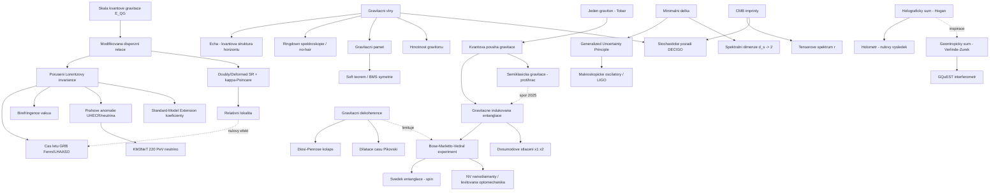

# Experimentální testy a fenomenologie kvantové gravitace (Quantum Gravity Phenomenology & Experimental Tests)

> **TL;DR** — Fenomenologie kvantové gravitace (quantum gravity phenomenology) hledá pozorovatelné stopy planckovské fyziky navzdory tomu, že naivní efekty jsou potlačeny faktorem $E/E_\mathrm{Pl}\sim10^{-19}$ při dostupných energiích. Dvě hlavní strategie využívají *amplifikaci*: (i) astrofyzikální (kosmologické vzdálenosti a vysoké energie zesilují drobné porušení Lorentzovy invariance — Fermi/LHAASO GRB, UHECR, neutrina) a (ii) *stolní kvantová* (tabletop), kde se testuje samotná kvantová povaha gravitačního pole pomocí gravitačně indukované entanglace (Bose–Marletto–Vedral). Nejlepší současné meze na lineární porušení Lorentzovy invariance (LIV) dosahují $E_\mathrm{QG}\gtrsim$ několikanásobek Planckovy energie (GRB 221009A), birefringence vakua omezuje rozměr-5 operátory na $\sim10^{-15}$ úrovni a hmotnost gravitonu je omezena na $m_g\lesssim1.3\times10^{-23}\,\mathrm{eV}/c^2$ (GWTC-3). V letech 2024–2026 je pole v prudkém pohybu: holometr vyloučil jeden model holografického šumu, BMV experimenty vstupují do fáze technologického vývoje (MAGIS-100 dokončil laserovou laboratoř 2026, levitované nanodiamanty), objevil se důkaz „jednoho gravitonu" (Tobar 2024) a probíhá živá debata (Nature 2025), zda entanglace skutečně dokazuje kvantovost gravitace. Poctivé hodnocení: žádný *pozitivní* signál kvantové gravitace dosud neexistuje; pole produkuje hlavně horní meze a vyvíjí technologie, jejichž dosažitelnost je sama předmětem sporu.

## Přehled a historický kontext

Dlouho převládal názor, formulovaný např. Freemanem Dysonem, že kvantová gravitace je *principiálně netestovatelná*, protože jediná přirozená škála — Planckova energie $E_\mathrm{Pl}=\sqrt{\hbar c^5/G}\approx1.22\times10^{19}\,\mathrm{GeV}$ (Planckova délka $\ell_\mathrm{Pl}\approx1.6\times10^{-35}\,\mathrm{m}$, Planckův čas $t_\mathrm{Pl}\approx5.4\times10^{-44}\,\mathrm{s}$) — leží o 15 řádů nad dosahem LHC. Tento defaitismus zlomila tzv. **fenomenologie kvantové gravitace** (quantum-gravity phenomenology), jejíž moderní program zformuloval Giovanni Amelino-Camelia v sérii prací od konce 90. let. Klíčová myšlenka je *amplifikace*: i nepatrný efekt $\sim E/E_\mathrm{Pl}$ se může nahromadit přes kosmologické vzdálenosti (časy letu fotonů z GRB), vysoké energie (prahy UHECR) nebo dlouhou propagaci (birefringence). Mezníkem byl návrh testu energeticky závislého zpoždění fotonů z gama záblesků [Amelino-Camelia et al. 1998](https://arxiv.org/abs/astro-ph/9712103).

Druhá, kvalitativně odlišná větev vznikla v roce 2017: místo testování *propagace* na planckovské škále navrhli [Bose et al. 2017](https://arxiv.org/abs/1707.06050) a [Marletto & Vedral 2017](https://arxiv.org/abs/1707.06036) testovat *samotnou kvantovou povahu gravitačního pole* v laboratoři — pomocí gravitačně indukované entanglace (gravitationally induced entanglement, GIE / quantum gravity induced entanglement of masses, QGEM). Tato „stolní" linie nevyžaduje planckovské energie, ale extrémní kontrolu makroskopických kvantových superpozic.

Sabine Hossenfelder ve svém přehledu [Experimental Search for Quantum Gravity](https://arxiv.org/abs/1010.3420) zdůrazňuje poctivé hodnocení: většina „testů" testuje *specifické modely* (např. Standard-Model Extension, doubly special relativity), nikoli kvantovou gravitaci obecně, a diskrétnost na Planckově délce je „typicky těžké, ne-li nemožné" přímo zkoumat — proto se hledají *imperfekce* (LIV, defekty, šum), nikoli sama diskrétnost.

Metodologicky lze celé pole číst jako katalog *amplifikačních triků*, jak povýšit poměr $E/E_\mathrm{Pl}\sim10^{-19}$ na měřitelnou hodnotu. Amelino-Camelia rozlišuje (i) *kosmologickou amplifikaci vzdáleností* (zpoždění $\propto d/E_\mathrm{Pl}$ — GRB, blazary), (ii) *amplifikaci dlouhou propagací* (birefringence kumuluje stočení polarizace), (iii) *prahovou amplifikaci* (LIV zapíná/vypíná reakci a mění celé spektrum — UHECR, TeV gama), (iv) *amplifikaci interferencí* (gravitační fáze $\propto m^2$ roste s hmotností — BMV) a (v) *amplifikaci přesností* (planckovsky přesné měření korelací polohy — holometr/GQuEST). Žádný z těchto kanálů nedosahuje *přímo* na Planckovu délku; všechny sondují jen *efektivní* nízkoenergetické otisky.

Historický oblouk pole lze shrnout do tří generací. **První generace** (konec 90. let — cca 2010) byla astrofyzikální: čas letu fotonů z GRB (Fermi, MAGIC, HESS), birefringence (Krabí mlhovina, GRB), prahové anomálie UHECR a TeV gama záření. Postupně dosáhla a překročila Planckovu škálu pro lineární LIV, čímž *vyloučila* nejjednodušší modely s $E_\mathrm{QG}\sim E_\mathrm{Pl}$ a $n=1$. **Druhá generace** (2010–2017) přidala precizní laboratorní fyziku: holometr (holografický šum), atomové hodiny a interferometry, optomechaniku, molekulární interferometrii a teorii gravitační dekoherence. **Třetí generace** (2017–dnes) je definována dvěma posuny: (i) přímé GW pozorování (LIGO/Virgo/KAGRA od 2015) otevřelo testy silné gravitace — rychlost a hmotnost gravitonu, echa, ringdown, paměť; (ii) BMV/QGEM přesunulo otázku z *propagace* na *kvantovou povahu pole*. Klíčový koncepční rozdíl: většina astrofyzikálních testů by potvrdila *modifikaci klasické geometrie*, zatímco BMV cílí na *kvantovost* gravitačního pole — to jsou logicky nezávislé otázky.

## Klíčové koncepty

- **Modifikovaná disperzní relace (modified dispersion relation, MDR)** — Planckovsky potlačená deformace vztahu $E^2=p^2c^2+m^2c^4$ tvaru $E^2\simeq p^2c^2\big[1\pm(E/E_\mathrm{QG})^n\big]$, kde $n=1$ (lineární) nebo $n=2$ (kvadratická), $E_\mathrm{QG}$ je hledaná škála kvantové gravitace. Důsledkem je energeticky závislá rychlost fotonu.
- **Porušení Lorentzovy invariance (Lorentz invariance violation, LIV)** — explicitní narušení Lorentzovy symetrie zavedením preferované soustavy/škály; systematicky parametrizováno v **Standard-Model Extension (SME)** koeficientech ($d=4,5,6\dots$ rozměry operátorů). Operátory rozměru 5 a 6 generují MDR a birefringenci.
- **Doubly/Deformed Special Relativity (DSR)** a **κ-Poincaré** — alternativa k LIV: druhá invariantní škála ($E_\mathrm{Pl}$) přidaná *bez* preferované soustavy; relativita je deformována (Hopfova algebra). Důsledkem je **relativní lokalita (relative locality)** — události koincidují jen pro lokálního pozorovatele. Pozor: v některých DSR modelech *nevzniká* žádné měřitelné zpoždění času letu, na rozdíl od LIV.
- **Birefringence vakua (vacuum birefringence)** — pro CPT-lichý (rozměr-5) LIV operátor se levo- a pravotočivá polarizace šíří různou rychlostí; polarizační vektor se s energií stáčí, vysoká polarizace vzdálených zdrojů LIV vylučuje. Citlivější než čas letu o faktor $\sim1/\omega$.
- **Prahová anomálie (threshold anomaly)** — LIV posouvá energetické prahy reakcí (GZK proces $p+\gamma_\mathrm{CMB}\to\Delta$, $\gamma\gamma\to e^+e^-$), což deformuje pozorované spektrum UHECR a TeV gama záření.
- **UHECR a neutrina (UHECR & neutrino LIV)** — kosmické záření nejvyšších energií (Auger, $E\gtrsim10^{20}\,\mathrm{eV}$) a astrofyzikální neutrina (IceCube, PeV události) testují LIV: superluminální LIV by potlačila GZK fotomesonovou produkci a posunula vrchol kosmogenního neutrinového toku; flavorový poměr neutrin je citlivý na LIV ve $\nu$ sektoru. V principu dosažitelné $M_\mathrm{QG}\gtrsim10^{26}\,\mathrm{eV}$ (lineární) / $10^{19}\,\mathrm{eV}$ (kvadratická) z energeticky závislých zpoždění.
- **Gravitačně indukovaná entanglace (gravitationally induced entanglement, GIE/QGEM)** — pokud dvě hmoty v prostorové superpozici, interagující *pouze* gravitačně, vzájemně entanglují, pak (za předpokladu lokality a kvantové teorie informace) musí být gravitační mediátor nekvantový vyloučen → gravitace je kvantová.
- **Bose–Marletto–Vedral (BMV) experiment** — konkrétní realizace GIE se dvěma hmotnostmi $\sim10^{-14}\,\mathrm{kg}$ v Sternových–Gerlachových interferometrech (NV centra v nanodiamantech), spinový svědek entanglace (entanglement witness).
- **Svědek entanglace (entanglement witness)** — pozorovatelná, jejíž hodnota mimo klasický interval certifikuje přítomnost entanglace; v BMV např. spinová korelace $\langle\sigma_x^{(1)}\sigma_y^{(2)}\rangle$.
- **Gravitační dekoherence (gravitational decoherence)** — ztráta koherence superpozic indukovaná gravitací: buď fundamentální kolaps (Diósi–Penrose), nebo univerzální dekoherence z gravitační dilatace času (Pikovski et al.).
- **Diósi–Penrose (DP) model** — gravitací řízený objektivní kolaps vlnové funkce s rychlostí danou gravitační vlastní energií rozdílu hustotních konfigurací; parametr $R_0$ (cutoff délka).
- **Holografický šum (holographic noise)** — Hoganova hypotéza, že transverzní polohy těles náhodně fluktuují o $\sim\ell_\mathrm{Pl}$ za Planckův čas (planckovská geometrická neurčitost); měřitelný korelovaným laserovým interferometrem (holometr).
- **Geontropický šum / Verlinde–Zurek (VZ) efekt** — novější predikce korelovaných fluktuací délky ramene z holografických „pixel" stupňů volnosti, motivovaná vázáním modulární energie a délky v de Sitterově prostoru (Verlinde–Zurek); na rozdíl od Hoganova modelu má *spektrální tvar* a může uniknout holometrovým mezím. Cíl experimentu GQuEST (40 m interferometry, jednofotonová detekce, Caltech/Fermilab).
- **Generalized Uncertainty Principle (GUP)** — deformace $\Delta x\,\Delta p\geq\frac{\hbar}{2}(1+\beta(\Delta p)^2+\dots)$ implikující minimální délku $\Delta x_\mathrm{min}\sim\sqrt{\beta}\,\ell_\mathrm{Pl}$; testovatelná v makroskopických oscilátorech a interferometrech.
- **Minimální délka (minimal length)** — společný rys (string theory, LQG, nekomutativní geometrie): existence nejmenší měřitelné vzdálenosti $\sim\ell_\mathrm{Pl}$.
- **Atomová interferometrie / MAGIS-100** — gradiometr na bázi vln hmoty (matter-wave) o základně 100 m (Fermilab) pro hledání ultralehké temné hmoty, testy kvantové mechaniky na makroskopických škálách a jako prekurzor detektoru GW ve frekvenčním pásmu 0.1–10 Hz.
- **Levitovaná optomechanika (levitated optomechanics)** — levitované nanočástice/nanodiamanty chlazené do základního stavu pohybu; nejslibnější cesta k vysokohmotnostním superpozicím ($10^6$ amu a výše).
- **Spektrální dimenze (spectral dimension)** — efektivní dimenze sondovaná difúzí; mnoho přístupů (CDT, ASG, LQG, NCG, Hořava) predikuje běh $d_s$ z 4 (velké škály) na $\approx2$ (planckovská škála) — „dimenzionální redukce".
- **Echa gravitačních vln (GW echoes)** — opakované pulzy po ringdownu, predikované, pokud horizont nahradí kvantová struktura/„zeď" (firewall, fuzzball, ECO) s odrazem na škále $\sim\ell_\mathrm{Pl}$ od horizontu.
- **Spektroskopie ringdownu (ringdown / black-hole spectroscopy)** — měření kvazinormálních módů (QNM) po splynutí černých děr jako test Kerrovy metriky a beyond-GR struktury.
- **Gravitační paměť (GW memory)** — trvalý posun relativní polohy testovacích hmot po průchodu GW; matematicky Fourierova transformace měkkého (soft) teorému gravitonu (Strominger–Zhiboedov).
- **Detekce jednoho gravitonu (single-graviton detection)** — gravito-fononický analog fotoelektrického jevu: stimulovaná absorpce jednoho gravitonu v makroskopickém kvantovém rezonátoru (Tobar et al. 2024).

## Matematický rámec

Veškerá fenomenologie KG stojí na jednom čísle — poměru $E/E_\mathrm{Pl}\sim10^{-19}$ při laboratorních energiích — a na tricích, jak ho zesílit: propagace přes kosmologickou vzdálenost (vzorce 1–3, 10), kvadratický nárůst počtu fotonů či dlouhý optický dráhový rozdíl (vzorec 9), nebo makroskopická koherentní hmota, kde se gravitační fáze $\propto m^2$ (vzorce 4–5). Následující relace (1–12) jsou organizovány do tří bloků: (A) propagační/astrofyzikální LIV (1–3, 10), (B) stolní kvantová gravitace a dekoherence (4–7), (C) strukturní/kosmologické a šumové signatury (8, 9, 11, 12).

**1. Modifikovaná disperzní relace a rychlost fotonu**

$$E^2 \;=\; p^2 c^2\left[\,1 \;\pm\; \left(\frac{E}{E_{\mathrm{QG},n}}\right)^{n}\,\right],\qquad v(E)=\frac{\partial E}{\partial p}\simeq c\left[\,1 \mp \frac{n+1}{2}\left(\frac{E}{E_{\mathrm{QG},n}}\right)^{n}\right]$$

$E$ je energie fotonu, $p$ hybnost, $c$ rychlost světla v limitě nulové energie, $E_{\mathrm{QG},n}$ je hledaná škála kvantové gravitace (často udávaná v jednotkách $E_\mathrm{Pl}$), $n=1$ pro lineární a $n=2$ pro kvadratickou modifikaci, znaménko $\mp$ rozlišuje subluminální (pomalejší vysoké energie) a superluminální případ. Význam: drobná energetická závislost rychlosti — jádro veškeré time-of-flight fenomenologie.

**2. Zpoždění času letu (time-of-flight delay)**

$$\Delta t \;\simeq\; \frac{n+1}{2}\,\frac{E_h^{\,n}-E_l^{\,n}}{E_{\mathrm{QG},n}^{\,n}}\,\frac{1}{H_0}\int_0^{z}\frac{(1+z')^{n}\,dz'}{\sqrt{\Omega_m(1+z')^3+\Omega_\Lambda}}$$

$\Delta t$ je rozdíl času příletu fotonů o energiích $E_h$ (vysoká) a $E_l$ (nízká) emitovaných současně ze zdroje při rudém posuvu $z$; $H_0$ je Hubbleova konstanta, $\Omega_m,\Omega_\Lambda$ kosmologické parametry. Význam: lineární růst zpoždění s energetickým rozdílem a vzdáleností je signatura LIV; nepozorování $\Delta t$ dává *dolní* mez na $E_\mathrm{QG}$.

**3. Stočení polarizace birefringencí vakua**

$$\Delta\theta(E) \;\simeq\; \xi\,\frac{E^2 - E_0^2}{2\,E_\mathrm{Pl}}\,d$$

$\Delta\theta$ je relativní úhel stočení polarizačního vektoru mezi energiemi $E$ a $E_0$, $\xi$ bezrozměrný LIV parametr (rozměr-5 operátor), $d$ vzdálenost zdroje, $E_\mathrm{Pl}$ Planckova energie. Význam: pokud $\Delta\theta\gtrsim\pi/2$ napříč pásmem, polarizace se vymaže; měření vysoké polarizace GRB tedy omezuje $\xi$ až na $\sim10^{-15}$ — nejpřísnější mez z propagace.

**4. Gravitační fáze v BMV experimentu**

$$\Delta\phi \;=\; \frac{G\,m^2}{\hbar\,d}\,\Delta t,\qquad \phi_i \;=\; \frac{G\,m^2}{\hbar\,d_i}\,\Delta t$$

$G$ gravitační konstanta, $m$ hmotnost každé částice, $d$ (resp. $d_i$ pro $i$-tou větev) vzdálenost mezi superponovanými trajektoriemi, $\Delta t$ doba interakce, $\hbar$ redukovaná Planckova konstanta. Význam: rozdíl gravitačních fází mezi větvemi dvou interferometrů generuje entanglaci; pokud $\Delta\phi\sim\mathcal{O}(1)$ rad během koherenční doby, entanglace je detekovatelná. Pro $m\sim10^{-14}\,\mathrm{kg}$, $d\sim200\,\mu\mathrm{m}$, $\Delta t\sim$ s dostane $\Delta\phi\sim$ rad.

**5. Newtonovský potenciál jako dvoumódové stlačení**

$$V(r)\simeq -\frac{Gm_1 m_2}{d}\left(1+\frac{\delta x_1\,\delta x_2}{d^2}+\dots\right),\qquad H_\mathrm{int}\propto \frac{Gm_1 m_2}{d^3}\,\hat x_1\hat x_2$$

$d$ střední vzdálenost těžišť, $\delta x_i$ výchylky, $\hat x_i$ polohové operátory. Význam: rozvoj newtonovské interakce dává bilineární vazbu $\hat x_1\hat x_2$ — dvoumódové stlačení (two-mode squeezing), které entanglo­vává polohy/hybnosti; mechanismus GIE i ve verzích bez Sternova–Gerlachova rozštěpení.

**6. Diósi–Penrose rychlost kolapsu / dekoherence**

$$\frac{1}{\tau_\mathrm{DP}} \;=\; \frac{1}{\hbar}\,\Delta E_g,\qquad \Delta E_g \;=\; -\,4\pi G\!\int\! d^3x\, d^3y\,\frac{\big[\rho_1(\mathbf x)-\rho_2(\mathbf x)\big]\big[\rho_1(\mathbf y)-\rho_2(\mathbf y)\big]}{|\mathbf x-\mathbf y|}$$

$\tau_\mathrm{DP}$ doba kolapsu superpozice dvou hmotnostních konfigurací $\rho_1,\rho_2$, $\Delta E_g$ gravitační vlastní energie jejich rozdílu (regularizovaná na škále $R_0$). Význam: čím hmotnější a oddělenější superpozice, tím rychlejší gravitační kolaps — fundamentální (ne planckovsky potlačená) predikce, přímo testovatelná hledáním spontánního ohřevu/dekoherence.

**7. Univerzální dekoherence z dilatace času (Pikovski et al.)**

$$\tau_\mathrm{dec} \;\sim\; \frac{\hbar}{E_\mathrm{int}}\,\frac{c^2}{g\,\Delta x},\qquad \Gamma \;\propto\; \frac{E_\mathrm{int}\,g\,\Delta x}{\hbar c^2}$$

$E_\mathrm{int}$ vnitřní energie složené částice (např. tepelné vibrace), $g$ gravitační zrychlení, $\Delta x$ vertikální rozštěpení superpozice. Význam: gravitační dilatace času koreluje vnitřní stupně volnosti s těžištěm a dekoheruje polohu *bez* vnějšího prostředí; už pozemské $g$ stačí dekoherovat mikrometrové objekty — kandidát na vysvětlení klasicity.

**8. Generalized Uncertainty Principle a minimální délka**

$$\Delta x\,\Delta p \;\geq\; \frac{\hbar}{2}\Big(1+\beta\,(\Delta p)^2+\dots\Big)\;\Longrightarrow\;\Delta x_\mathrm{min}=\hbar\sqrt{\beta}=\beta_0\,\ell_\mathrm{Pl}$$

$\beta=\beta_0/(M_\mathrm{Pl}c)^2$ deformační parametr, $\beta_0$ bezrozměrný, $\ell_\mathrm{Pl}$ Planckova délka. Význam: GUP zavádí minimální měřitelnou délku; experimenty (oscilátory, interferometry, LIGO) omezují $\beta_0$ — naivně by $\beta_0\sim1$, ale stolní testy zatím připouštějí $\beta_0\lesssim10^{6}$–$10^{10}$.

**9. Holografický šum (Hoganova predikce)**

$$\langle\Delta x^2\rangle \;\sim\; \ell_\mathrm{Pl}\,L,\qquad S(f)\;\simeq\; \frac{c\,t_\mathrm{Pl}}{2\pi}\quad(\text{plochá, frekvenčně nezávislá})$$

$L$ délka ramene interferometru, $\langle\Delta x^2\rangle$ transverzní fluktuace polohy, $S(f)$ spektrální hustota výkonu nezávislá na frekvenci $f$, určená pouze Planckovým časem $t_\mathrm{Pl}$. Význam: predikce „pixelovaného" vesmíru; holometr měřil $S(f)$ — nulový výsledek vyloučil tento konkrétní model na $4.6\sigma$.

**10. Disperze GW od masivního gravitonu**

$$E^2 = p^2c^2 + m_g^2 c^4 \;\Longrightarrow\; v_g^2/c^2 = 1-\frac{m_g^2 c^4}{E^2},\qquad m_g \;=\; \frac{h}{\lambda_g\,c}$$

$m_g$ hmotnost gravitonu, $\lambda_g$ Comptonova vlnová délka gravitonu, $v_g$ grupová rychlost GW. Význam: nenulová $m_g$ způsobí frekvenčně závislé zpoždění v signálu GW; LIGO/Virgo dává $m_g\lesssim1.3\times10^{-23}\,\mathrm{eV}/c^2$ (GWTC-3), tj. $\lambda_g\gtrsim10^{16}\,\mathrm{km}$.

**11. Spektrální dimenze (běh efektivní dimenze)**

$$d_s(\sigma) \;=\; -2\,\frac{\partial \ln P(\sigma)}{\partial \ln \sigma},\qquad d_s:\;4\ \xrightarrow[\sigma\to\ell_\mathrm{Pl}^2]{}\ \approx 2$$

$P(\sigma)$ pravděpodobnost návratu náhodné procházky po difúzním čase $\sigma$, $d_s$ spektrální dimenze. Význam: univerzální „dimenzionální redukce" na $d_s\approx2$ na planckovské škále napříč mnoha přístupy (CDT, ASG, LQG, NCG, Hořava–Lifshitz) — potenciální sdílená signatura, ale fenomenologicky obtížně přístupná.

**12. Geontropický šum délky ramene (Verlinde–Zurek)**

$$\big\langle \Delta L^2 \big\rangle \;\sim\; \frac{\ell_\mathrm{Pl}\,L}{?}\;\Rightarrow\; \frac{\Delta L}{L}\sim\sqrt{\frac{\ell_\mathrm{Pl}}{L}},\qquad S_{\Delta L}(\omega)\ \text{s charakteristickým spektrálním tvarem (ne plochá)}$$

$L$ délka ramene, $\Delta L$ fluktuace odvozená z fluktuací modulární energie $\langle\Delta K^2\rangle = \langle K\rangle$ holografických stupňů volnosti na hranici kauzálního diamantu, $S_{\Delta L}(\omega)$ spektrální hustota. Význam: na rozdíl od Hoganova *ploché* hustoty má VZ model *frekvenčně závislý* tvar koncentrovaný v IR, díky čemuž může uniknout holometrovým mezím; cíl experimentu GQuEST jednofotonovou detekcí. Otazník zdůrazňuje modelovou nejistotu v normalizaci amplitudy.

## Klíčové výsledky a milníky

- **1998 — Návrh time-of-flight testu z GRB.** [Amelino-Camelia, Ellis, Mavromatos, Nanopoulos & Sarkar 1998](https://arxiv.org/abs/astro-ph/9712103) ukázali, že kosmologické vzdálenosti zesilují $E/E_\mathrm{Pl}$ efekty do měřitelnosti — zrod kvantitativní fenomenologie KG.
- **2009 — Fermi LAT, GRB 090510.** Pozorování GeV fotonu z GRB při $z=0.903$ vyloučilo lineární LIV pod $E_\mathrm{QG,1}\gtrsim E_\mathrm{Pl}$ — první mez přesahující Planckovu škálu z jediného zdroje [Abdo et al. 2009, Nature 462, 331].
- **2011 — Birefringence vakua z GRB041219a.** Polarizace prompt emise omezila rozměr-5 LIV parametr na $\xi\lesssim2.4\times10^{-15}$, o $>5$ řádů lepší než z Krabí mlhoviny [Laurent et al. 2011](https://arxiv.org/abs/1102.2784). Důvod převahy birefringence: účinek se kumuluje jako $1/\omega$ vůči time-of-flight, takže nízkoenergetické polarimetrické zdroje dají paradoxně přísnější meze na rozměr-5 operátory než TeV time-of-flight.
- **2014 — Most paměť ↔ soft teorém ↔ BMS.** [Strominger & Zhiboedov 2014](https://arxiv.org/abs/1411.5745) ukázali, že gravitační paměť je Fourierovou transformací Weinbergova měkkého teorému gravitonu a Wardovy identity BMS supertranslací — propojení pozorovatelné GW fenomenologie s asymptotickými symetriemi a amplitudami.
- **2015 — Holometr: nulový výsledek.** Fermilabský holometr (dva zkřížené 40 m Michelsonovy interferometry, korelace do 25 MHz, strain $<10^{-21}/\sqrt{\mathrm{Hz}}$ v 1–13 MHz) vyloučil Hoganův model holografického šumu na $4.6\sigma$ [Chou et al. 2017](https://arxiv.org/abs/1611.08265).
- **2015 — Univerzální gravitační dekoherence.** [Pikovski, Zych, Costa & Brukner 2015](https://arxiv.org/abs/1311.1095) (Nature Physics 11, 668): dilatace času dekoheruje superpozice složených částic bez prostředí; pozemské $g$ stačí na mikrometrové objekty.
- **2017 — Návrhy BMV/QGEM.** [Bose et al. 2017](https://arxiv.org/abs/1707.06050) (PRL 119, 240401) a [Marletto & Vedral 2017](https://arxiv.org/abs/1707.06036) (PRL 119, 240402): gravitačně indukovaná entanglace dvou hmot $\sim10^{-14}\,\mathrm{kg}$ jako svědek kvantovosti gravitace — paradigmatický posun od propagace ke kvantové povaze pole.
- **2017 — GW170817: rychlost gravitonu.** Současný přílet GW a gama záblesku omezil $|v_g-c|/c\lesssim10^{-15}$, čímž padla celá třída modifikovaných gravitací (mnohé „dark energy" teorie) [Abbott et al. 2017, ApJL 848, L13].
- **2021 — GWTC-3 mez hmotnosti gravitonu.** $m_g\lesssim1.3\times10^{-23}\,\mathrm{eV}/c^2$ z disperze GW [LVK 2021](https://arxiv.org/abs/2112.06861).
- **2022/2023 — GRB 221009A („BOAT").** LHAASO detekoval fotony 0.2–18 TeV při $z=0.151$; rozbory dávají dolní meze na lineární LIV řádu $E_\mathrm{QG,1}\gtrsim5.9\,(6.2)\times E_\mathrm{Pl}$ pro subluminální (superluminální) případ — nejpřísnější time-of-flight meze [Cao et al. / LHAASO 2024](https://arxiv.org/abs/2308.03031); jiné rozbory uvádějí $E_\mathrm{QG,1}>10\,E_\mathrm{Pl}$.
- **2024 — LHAASO „stringent tests".** Oficiální kolaborační rozbor [LHAASO 2024 (PRL 133, 071501)](https://arxiv.org/abs/2402.06009) udává na 95 % CL $E_\mathrm{QG,1}>10\,E_\mathrm{Pl}$ (lineární) a $E_\mathrm{QG,2}>6\times10^{-8}\,E_\mathrm{Pl}$ (kvadratická); kvadratická mez je o faktor 5–7 lepší než předchozí nejlepší. To je definitivní vyloučení nejjednodušších $n=1$ modelů s $E_\mathrm{QG}\sim E_\mathrm{Pl}$.
- **2024 — Detekce „jednoho gravitonu".** [Tobar, Manikandan, Beitel & Pikovski 2024](https://arxiv.org/abs/2308.15440) (Nat. Commun.): stimulovaná absorpce jednoho gravitonu v makroskopickém rezonátoru (gravito-fononický fotoelektrický jev) — „first light on quantum gravity", v dosahu blízké budoucnosti.
- **2024 — BMV s nanodiamanty.** [Pal/Bose et al. 2024](https://arxiv.org/abs/2410.19601) a [Table-top nanodiamond interferometer 2024](https://arxiv.org/abs/2405.21029): detailní návrh s magneticky pasovanými NV nanodiamanty, optický odečet, mez decoherence škálováním molekul.
- **2025 — KM3NeT: rekordní neutrino 220 PeV.** [KM3NeT 2025 (Nature 638, 376)](https://www.km3net.org/km3net-detects-the-highest-energy-neutrino-ever-observed/) detekoval událost KM3-230213A o energii $\sim220\,\mathrm{PeV}$ — nejvyšší energetické neutrino vůbec, otevírající nový kanál pro prahové a time-of-flight LIV testy ve $\nu$ sektoru při bezprecedentní energii.
- **2025 — Spor o „klasickou" entanglaci.** [Aziz & Howl 2025](https://www.nature.com/articles/s41586-025-09595-7) (Nature 646, 813) tvrdí, že i nekvantovaná gravitace produkuje entanglaci; vlna kritik [Marletto, Oppenheim, Vedral & Wilson 2025](https://arxiv.org/abs/2511.07348) a [další 2025](https://arxiv.org/abs/2511.19242) ukazuje, že model je buď chybný (ultralokální limita faktorizuje unitár), nebo entanglaci mediuje kvantová matérie, ne gravitace.
- **2025 — Ringdown spektroskopie GW250114 a Hawkingův zákon plochy.** Nejhlasitější událost O4 (SNR $\approx77$–80, nejčistší GW signál dosud) umožnila identifikaci *prvního overtonu* ($n=1$) fundamentálního kvadrupólového módu na hladině $4.1\sigma$, čímž poskytla nejpřísnější jednoudálostní test „no-hair" teorému a Kerrovy povahy. LVK zároveň podali nejsilnější pozorovací důkaz **Hawkingova zákona neklesající plochy horizontu** (area theorem, 1971): součet ploch horizontů po splynutí neklesl [GW250114, LVK 2025](https://dcc.ligo.org/public/0201/P2500421/010/GW250114.pdf). Výsledky konzistentní s GR, silné meze na třetí (vyšší) tón a beyond-Kerr posuny.
- **2025 — Levitovaná nanočástice v základním stavu za pokojové teploty.** Skupina ETH Zürich demonstrovala chlazení levitované nanočástice do pohybového základního stavu *bez kryogeniky*, s čistotou stavu $\sim92\,\%$ [ETH, srpen 2025](https://modernsciences.org/nanoparticle-quantum-ground-state-room-temperature-august-2025/) — odstraňuje jednu z překážek cesty k makroskopickým superpozicím a kvantovým gravimetrům.
- **2026 — MAGIS-100 laserová laboratoř dokončena.** Fermilab dokončil laserovou laboratoř pro nejdelší vertikální atomový interferometr (100 m v šachtě NuMI); komisování potrvá roky [Fermilab News, leden 2026](https://news.fnal.gov/2026/01/fermilab-completes-laser-lab-construction-for-worlds-largest-vertical-atom-interferometer/).
- **2026 — Model-nezávislé hledání GW ech.** [Wu, Zhang, Huang & Ren 2026](https://arxiv.org/abs/2512.24730) podali model-nezávislý framework pro hledání ech v LVK datech tří významných splynutí — žádný signifikantní signál, ale metodicky robustnější horní meze nezávislé na šablonách.

## Současný stav (2024-2026)

Pole má dnes tři aktivní fronty:

**(1) Astrofyzikální LIV.** GRB 221009A (BOAT, nejjasnější GRB všech dob) dominuje: LHAASO posunul time-of-flight meze na $E_\mathrm{QG,1}\gtrsim$ několik $E_\mathrm{Pl}$ a kvadratické meze na $\sim10^{19}$ GeV. Aktualizují se SME koeficienty pro nebirefringentní fotonový sektor. Neutrina (IceCube) a UHECR (Auger) zůstávají komplementární kanály; LIV by tlumila GZK fotomesonovou produkci a snižovala tok nejvyšších energií. Komplementární je i *synchrotronní* mez z Krabí mlhoviny (LIV by změnila maximální energii synchrotronních elektronů) a *prahová* mez: detekce TeV fotonů ze vzdálených zdrojů omezuje superluminální LIV, protože ta by jinak zapnula reakci $\gamma\to e^+e^-$ ve vakuu a fotony by se nedostaly k nám. Klíčová systematika: *vnitřní* zpoždění emise ve zdroji vs. LIV — nelze je čistě oddělit, proto se preferují *statistické* meze z mnoha zdrojů a birefringence (nezávislá na emisním modelu). Rozbory GRB 221009A se liší podle předpokladu o vnitřní emisi: čísla $5.9$–$10\,E_\mathrm{Pl}$ pro $n=1$ odrážejí různé volby reference (náběh vs. pokles afterglow).

**(2) Stolní QGEM/BMV.** Posun od „papírových" návrhů k technologickému vývoji. Hlavní platformy: (a) NV nanodiamanty v Sternových–Gerlachových interferometrech (Bose group, UCL; needle Paul trap, Ben-Gurion), (b) levitovaná optomechanika chlazená do základního stavu, (c) diamagnetické mikročipové pasti. Cílové parametry: $m\sim10^{-14}\,\mathrm{kg}$, rozštěpení $\sim250\,\mu\mathrm{m}$, koherenční doba $\sim$ s, tlak $\lesssim10^{-15}\,\mathrm{Pa}$, $T\sim$ K, oddělení $\gtrsim200\,\mu\mathrm{m}$ (potlačení Casimir–Polder). Nový směr (2025): elektronová difrakce dává $\sim1000\times$ větší rozštěpení hybnosti než dvoufotonový recoil. Žádný experiment zatím nedosáhl makroskopické superpozice požadované hmotnosti — toto je zásadní *neuzavřená* technologická propast (řádů potřebné citlivosti decoherence).

Rozpočet dekoherence (decoherence budget) je rozhodující: dominantní kanály jsou (i) rozptyl molekul zbytkového plynu (proto $\lesssim10^{-15}\,\mathrm{Pa}$), (ii) absorpce/emise fotonů černého tělesa (proto kryogenika a vnitřní teplota $\sim4\,\mathrm{K}$), (iii) gravitační a magnetické gradienty. Aby gravitační fáze $\Delta\phi\sim$ rad převýšila dekoherenci, musí být míra dekoherence $\ll1/\Delta t\sim1\,\mathrm{s}^{-1}$ — to je o mnoho řádů přísnější, než dnešní levitované systémy zvládají. Návrh s NV nanodiamanty řeší tvorbu superpozice spin-závislou Sternovou–Gerlachovou silou (NV spin $\to$ magnetický gradient $\to$ prostorové rozštěpení) a entanglaci čte přes spinový svědek; optický odečet měří polohu a komplementární bázi [Bose et al. 2024](https://arxiv.org/abs/2410.19601).

*Technologický pokrok 2025.* Klíčovým mezníkem byla demonstrace, že lze levitovanou nanočástici chladit do pohybového základního stavu *za pokojové teploty* s čistotou kvantového stavu $\sim92\,\%$ (skupina ETH Zürich, srpen 2025) — to odstraňuje nutnost kryogeniky pro samotné chlazení těžiště a otevírá cestu k makroskopickým superpozicím a kvantovým gravimetrům. Paralelně se vyvíjí *enhanced gravity sensing* s nanodiamantem v lineární iontové pasti, kde přechodný volný pád dává kvadraticky urychlenou akumulaci relativní fáze. Tyto pokroky však stále neřeší *prostorové rozštěpení* o $\sim100\,\mu\mathrm{m}$ při zachované koherenci — to je nezávislý a mnohem těžší krok. Rekord makroskopické *superpozice* (nikoli jen chlazení) drží stále molekulová interferometrie (oligoporfyriny $\sim2.5\times10^4$ amu, $\sim10^{-22}\,\mathrm{kg}$), o $\sim8$ řádů pod hmotností požadovanou pro BMV.

**(3) Gravitační vlny jako sonda KG.** O4 přinesla hlasité ringdowny (GW250114), přesnou black-hole spektroskopii (testy Kerra, no-hair), nulové výsledky hledání ech (první model-nezávislé meze na pozdní QNM v LVK datech), testy kvadratické gravitace (axi-dilaton, dynamical Chern–Simons, scalar–Gauss–Bonnet). Hmotnost gravitonu a rychlost GW dál zpřesňovány. Budoucí stochastické pozadí (DECIGO citlivější na blue-tilted spektra z non-local QG, string-gas, multifraktálních časoprostorů než LISA/ET). Pět GW kanálů s rozdílnou logikou:

- *Echa (echoes)*: predikují je modely, kde horizont nahradí odrazná „zeď" (firewall, fuzzball, gravastar, ECO) ve vzdálenosti $\sim\ell_\mathrm{Pl}$ od klasického horizontu; zpoždění mezi echy $\Delta t_\mathrm{echo}\sim n\,GM/c^3\,\ln(\dots)$ je logaritmicky citlivé na polohu zdi. Stav: žádný robustní signál, jen model-nezávislé horní meze na SNR a amplitudu pozdních QNM.
- *Ringdown / no-hair*: Kerrova černá díra je plně určena hmotností a spinem, takže frekvence a tlumení *všech* QNM jsou předpovězeny; měření $\geq2$ módů testuje konzistenci. GW250114 dal nejpřísnější test dosud, konzistentní s GR.
- *Paměť (memory)*: trvalý strain offset $\sim G\,\Delta E_\mathrm{rad}/(c^4 R)$; detekce by potvrdila soft-graviton/BMS strukturu. Zatím nedetekováno přímo, hledá se stackingem.
- *Hmotnost a rychlost gravitonu*: disperzní a multimessenger testy; nejtěsnější meze (viz tabulka).
- *Stochastické pozadí (SGWB)*: většina KG modelů dává plochý nebo červený náklon; jen non-local QG, string-gas, ekpyrotika, Brandenberger–Ho NC inflace a multifraktální časoprostory dávají *modrý* náklon, dosažitelný DECIGO, nikoli LISA/ET/LVK.

**(4) Detektory, mise a roadmap.** Fenomenologie KG dnes spoléhá na konkrétní infrastrukturu rozprostřenou přes řády frekvencí a energií:

- *VHE gama (LIV time-of-flight, birefringence):* LHAASO (TeV, BOAT), CTA/CTAO (od 2026 částečné uvedení), Fermi-LAT (GeV), MAGIC/H.E.S.S./VERITAS; polarimetrie POLAR-2, LEAP pro birefringenci.
- *UHECR a neutrina (prahové LIV):* Pierre Auger Observatory ($E\gtrsim10^{20}\,\mathrm{eV}$), IceCube/IceCube-Gen2, KM3NeT (v únoru 2025 detekce $\sim220\,\mathrm{PeV}$ neutrina KM3-230213A — nejvyšší dosud, nový kanál pro LIV ve $\nu$ sektoru).
- *GW (echa, ringdown, paměť, $m_g$):* LIGO-Virgo-KAGRA (O4 do 2025, O5 od $\sim2027$); budoucí Einstein Telescope, Cosmic Explorer (3. generace, $\sim2035$); vesmírná LISA ($\sim2035$, mHz), DECIGO/Big Bang Observer (deci-Hz, jediný kanál citlivý na modrý náklon).
- *Stolní KG (BMV/QGEM, dekoherence):* UCL/Bose (NV nanodiamanty), Ben-Gurion (needle Paul trap), ETH/Vídeň/Southampton (levitovaná optomechanika); molekulová interferometrie (Vídeň, Arndt). Žádný z nich dosud nedosahuje BMV parametrů.
- *Atomová interferometrie:* MAGIC-100 (Fermilab, laserová laboratoř 2026), AION (UK), ZAIGA (Čína), MIGA (Francie); cíl mid-band GW (0.1–10 Hz) a ultralehká temná hmota.
- *Holografický šum / minimální délka:* Fermilab holometr (uzavřen, nulový výsledek), GQuEST (nový interferometr hledající kvantovou geometrii, Caltech/Fermilab), kryogenní rezonátory pro GUP.
- *CMB (primordiální tensory, KG imprinty):* BICEP/Keck, Simons Observatory (od 2024–2025), LiteBIRD (JAXA, $\sim2032$), CMB-S4; cíl $\sigma(r)\lesssim10^{-3}$.

*Spor o interpretaci GIE pokračuje do 2026.* Po práci [Aziz & Howl 2025](https://www.nature.com/articles/s41586-025-09595-7) (Nature 646, 813; říjen 2025), tvrdící, že i klasická gravitace entanglo­vává, následovala vlna kritik. Kritici ukazují, že nalezená entanglace pochází z *vyřazení části přechodových amplitud*; při jejich zachování zůstává počáteční faktorizovaný stav faktorizovaný a žádná entanglace nevzniká [Marletto et al. 2025](https://arxiv.org/abs/2511.07348). Debata vyústila v formálnější analýzy „Can classical theories of gravity produce entanglement?" [2026](https://arxiv.org/abs/2604.19696). Konsenzuální poučení (shodují se i autoři původní práce): detekce GIE *sama o sobě nestačí* k potvrzení kvantové gravitace bez přesné definice „klasického mediátoru" a lokality — přesto by takový experiment byl transformativní.

**Žádný pozitivní signál.** Poctivé shrnutí (v duchu Hossenfelder): k roku 2026 neexistuje *jediný* potvrzený experimentální náznak kvantové gravitace. Produkujeme horní meze, vyvíjíme technologie a — v případě BMV — dosud ani nepanuje shoda, *co přesně* by pozitivní výsledek dokazoval (viz spor 2025–2026).

**Přehled nejlepších současných mezí (řádové hodnoty).**

| Pozorovatelná | Kanál / zdroj | Nejlepší mez (2024–2026) |
|---|---|---|
| Lineární LIV, $E_\mathrm{QG,1}$ (time-of-flight) | GRB 221009A, LHAASO | $\gtrsim 5.9$–$10\,E_\mathrm{Pl}$ |
| Kvadratická LIV, $E_\mathrm{QG,2}$ | GRB 221009A | $\sim10^{19}\,\mathrm{GeV}$ |
| Birefringence vakua (rozměr-5, $\xi$) | polarizace GRB041219a | $\lesssim2.4\times10^{-15}$ |
| Rychlost gravitonu $|v_g-c|/c$ | GW170817 + GRB170817A | $\lesssim10^{-15}$ |
| Hmotnost gravitonu $m_g$ | GWTC-3 | $\lesssim1.3\times10^{-23}\,\mathrm{eV}/c^2$ |
| Holografický šum (Hoganův model) | Fermilab holometr | vyloučeno na $4.6\sigma$ |
| Diósi–Penrose (bezškálový) | podzemní rentgen | vyloučeno (meze na $R_0$) |
| GUP parametr $\beta_0$ | oscilátory, LIGO | $\lesssim10^{6}$–$10^{10}$ |
| Tensor-to-scalar $r_{0.05}$ | BICEP/Keck | $<0.036$ (95 % CL) |

**Poctivé hodnocení testovatelnosti.** Tři ostré hranice, které pole definují: (i) *naivní planckovský efekt je mrtvý* — lineární LIV s $E_\mathrm{QG}\sim E_\mathrm{Pl}$ je vyloučen, takže přežijí jen modely se silným potlačením nebo bez time-of-flight efektu (DSR/relativní lokalita). (ii) *BMV je dosažitelný v principu, ne nutně v praxi* — vyžaduje superpozici o $\sim10$ řádů hmotnější a déletrvající, než cokoli demonstrovaného (rekordní molekulární interferometrie je $\sim10^{-22}\,\mathrm{kg}$, BMV potřebuje $\sim10^{-14}\,\mathrm{kg}$). (iii) *graviton zůstává nepolapitelný* — Dysonův argument o nemožnosti detekce *jednoho* gravitonu v ryze kvantovém (spontánním) procesu zůstává otevřený; Tobarův výsledek řeší *stimulovanou* absorpci, která neoddělí kvantovou od klasické GW.

## Otevřené problémy

1. **Oddělení LIV od zdrojové fyziky.** Time-of-flight zpoždění $\Delta t$ od LIV nelze čistě odlišit od vnitřní (emisní) energetické závislosti ve zdroji GRB. *Proč těžké:* mechanismus prompt emise GRB není z prvních principů znám; degenerace mezi $E_\mathrm{QG}$ a astrofyzikálním zpožděním. *Pokusy:* statistické meze přes mnoho zdrojů, birefringence (model-nezávislá), korelace s rudým posuvem.

2. **Dosažitelnost makroskopické superpozice pro BMV.** Vytvořit a udržet superpozici $10^{-14}\,\mathrm{kg}$ přes $\sim100\,\mu\mathrm{m}$ po dobu $\sim$ s. *Proč těžké:* decoherence z rozptylu zbytkového plynu, záření černého tělesa a gravitačních gradientů škáluje extrémně nepříznivě; potřebné $\sim10^{-15}\,\mathrm{Pa}$ a kryogenika na hraně možného. Klíčová mezera je *řádová*: rekord superpozice (molekulová interferometrie, $\sim10^{-22}\,\mathrm{kg}$) je $\sim8$ řádů pod cílem; demonstrace chlazení do základního stavu (i pokojovětepelná, ETH 2025) řeší jen *těžiště*, ne prostorové rozštěpení s koherencí. *Pokusy:* needle Paul trap, elektronová difrakce ($\sim1000\times$ recoil), levitovaná optomechanika, diamagnetické mikročipové pasti.

3. **Interpretace GIE: co přesně dokazuje?** Spor 2025 (Aziz–Howl vs. Marletto et al.): generuje „klasická" gravitace entanglaci? *Proč těžké:* závisí na definici „klasický mediátor", lokalitě, a na tom, zda entanglaci nedělá místo gravitace kvantová matérie. Semiklasické modely (Newton–Schrödinger, Bohmian) dávají různé predikce [2510.20991](https://arxiv.org/abs/2510.20991). *Pokusy:* zpřísnění kritérií „odpovědnosti" za entanglaci, kvantově-informační teorémy, QFT modely [2503.20855](https://arxiv.org/abs/2503.20855).

4. **Rozlišení LIV vs. DSR fenomenologicky.** LIV (preferovaná soustava) a DSR (deformovaná relativita, relativní lokalita) mohou dát *opačné* predikce — DSR může time-of-flight efekt zcela vynulovat. *Proč těžké:* relativní lokalita znamená, že „zpoždění" závisí na pozorovateli/volbě souřadnic energie-hybnosti. *Pokusy:* víceparticlové koincidence, formalismus relativní lokality [2207.03799](https://arxiv.org/abs/2207.03799).

5. **Fenomenologická přístupnost spektrální dimenze a minimální délky.** Dimenzionální redukce na $d_s\approx2$ a minimální délka jsou sdíleny mnoha přístupy, ale leží $\sim10\,\ell_\mathrm{Pl}$ hluboko. *Proč těžké:* žádný známý pozorovatelný amplifikuje $d_s$ běh do měřitelnosti; GUP meze jsou slabé ($\beta_0\lesssim10^{6}$). *Pokusy:* běh disperze v momentovém prostoru, korelace s LIV.

6. **Detekce jednoho gravitonu vs. dokázání kvantovosti.** Tobar 2024 ukazuje *stimulovanou* absorpci gravitonu, ale stimulovaný proces probíhá i klasicky (klasická GW). *Proč těžké:* odlišit *spontánní* (ryze kvantový) jev od stimulovaného vyžaduje detekci na úrovni vakuových fluktuací — Dysonův argument o nemožnosti detekce gravitonu. *Pokusy:* statistika počítání gravitonů, antibunching, analog fotoelektrického jevu.

7. **Robustnost detekce GW ech.** Echa by signalizovala kvantovou strukturu horizontu, ale nálezy jsou statisticky nevýznamné a citlivé na šablony. *Proč těžké:* nízký SNR v pozdním čase, model-závislost šablon, falešné poplachy z šumu detektoru. *Pokusy:* model-nezávislé hledání pozdních QNM, akumulace přes katalogy [2512.24730](https://arxiv.org/abs/2512.24730).

8. **Univerzálnost gravitační dekoherence/kolapsu.** DP model a Pikovski dekoherence jsou testovatelné, ale parametry ($R_0$, cutoffy) nejsou fixovány teorií. *Proč těžké:* odlišit gravitační kolaps od běžné environmentální dekoherence a od CSL; spontánní ohřev klade meze, ale nevylučuje celé okno. *Pokusy:* meze z rentgenové emise, mechanických oscilátorů, molekulární interferometrie.

9. **Robustnost a jednoznačnost geontropického šumu.** VZ predikce korelovaného šumu délky ramene (GQuEST) má volné předpoklady (modulární energie, IR cutoff, tvar spektra) a může unikat holometrovým mezím právě proto, že je modelově poddeterminovaná. *Proč těžké:* signál je na hranici standardního kvantového limitu, odlišení od klasického šumu vyžaduje jednofotonovou koincidenci; teorie sama nedává jednoznačnou amplitudu. *Pokusy:* jednofotonová detekce v ko-lokovaných interferometrech (GQuEST), křížová korelace, srovnání s nezávislými odvozeními z AdS/CFT a Hubbleova horizontu.

## Vztahy k ostatním přístupům

### Causal sets (kauzální množiny) — *částečně prozkoumáno*
Kauzální množiny predikují Lorentz-invariantní diskrétnost (Poissonovo „sprinkling"), takže — na rozdíl od mřížkových přístupů — *nepredikují* LIV/birefringenci; naopak predikují „swerves" (difúzi hybnosti) a tzv. nelokalitu vedoucí k pozorovatelnému $\Lambda$ (Sorkinova předpověď řádu pozorované kosmologické konstanty). Fenomenologie swerves a CST-šumu byla zkoumána, ale nikdy systematicky propojena s BMV/dekoherencí. Birefringenční meze přímo *podporují* CST oproti naivně diskrétním modelům.

### Loop quantum gravity (smyčková KG) — *částečně prozkoumáno*
LQG motivovala MDR a polymerovou kvantizaci s minimální délkou/plochou ($\sim\ell_\mathrm{Pl}^2$). Rané návrhy LIV z LQG (Gambini–Pullin) byly silně omezeny birefringencí. Loop quantum cosmology predikuje modifikace primordiálního tensorového spektra (CMB). Vztah k QGEM je sotva prozkoumán — LQG nemá jasnou předpověď pro gravitační fázi $\Delta\phi$ v nerelativistické limitě.

### Asymptotic safety (asymptotická bezpečnost) — *částečně prozkoumáno*
ASG predikuje běh konstant a dimenzionální redukci na $d_s\approx2$ (sdíleno s CDT/CST). Fenomenologicky: modifikace GW, black-hole stínů, možná inflační signatury. Spojení s time-of-flight LIV je slabé (ASG zachovává Lorentzovu invarianci v některých formulacích). Sdílená signatura $d_s\to2$ je společný, ale těžko měřitelný most.

### Group field theory (grupová teorie pole) — *sotva prozkoumáno*
GFT je druhokvantizační rámec pro stavební bloky spinové pěny/LQG; fenomenologicky se z ní odvozuje *GFT kondenzátová kosmologie* (kondenzát kvant prostoru jako homogenní vesmír), která dává efektivní Friedmannovu dynamiku s odrazem (bounce) a potenciální modifikace na velkých škálách CMB. Přímá vazba na LIV, BMV či GW je prakticky nulová; jediný hmatatelný kanál je kosmologický (sdílený s LQC/kvantovou kosmologií). Gold-grade nezkoumaný most k laboratorní fenomenologii.

### Causal dynamical triangulations (CDT) — *sotva prozkoumáno*
CDT sdílí dimenzionální redukci $d_s:4\to2$ s ASG/CST a fázové přechody v partiční funkci. Fenomenologicky téměř nepřístupné — žádná přímá predikce pro LIV, BMV ani GW. Sdílené škálování spektrální dimenze je *jediný* identifikovaný most a nebyl kvantitativně přenesen do pozorovatelných.

### Noncommutative geometry / κ-Poincaré (nekomutativní geometrie) — *dobře prozkoumáno (v rámci DSR)*
Nejtěsnější vazba: κ-Poincaré je matematickým jádrem DSR, generuje MDR, relativní lokalitu a deformované time-of-flight predikce (často *nulové*!). Birefringence a UHECR meze přímo testují NCG-inspirované MDR. Toto je *nejlépe* prozkoumaný most mezi fundamentálním přístupem a fenomenologií; přesto otázka, zda NCG vede k pozorovatelnému zpoždění, zůstává sporná (relativní lokalita).

### String theory (teorie strun) — *částečně prozkoumáno*
Strunová délka $\ell_s$ dává minimální délku a GUP (rozptyl strun nemůže rozlišit vzdálenosti pod $\ell_s$); strunná teorie historicky motivovala možnost LIV (Kostelecký–Samuel spontánní porušení Lorentzovy symetrie tenzorovým polem) — to byl jeden z původních teoretických motivátorů SME. Gravitační paměť ↔ měkké teorémy ↔ BMS symetrie (Strominger) je hluboký, dobře prozkoumaný most k amplitudám/holografii a má kořeny ve strunové S-matici. Swampland omezuje inflační pole (tensor-to-scalar $r$, distance/de Sitter conjectures → CMB). QGEM/BMV spojení se strunami je sotva prozkoumáno — struny nemají jasnou predikci pro nerelativistickou gravitační fázi $\Delta\phi$, takže pozitivní BMV výsledek by struny ani nepotvrdil, ani nevyvrátil.

### Twistors & amplitudes (twistory a amplitudy) — *částečně prozkoumáno*
Gravitační paměť je Fourierova transformace měkkého (soft) teorému gravitonu (Strominger–Zhiboedov 2014); detekce paměti by tak testovala soft-graviton strukturu amplitud a asymptotické (BMS) symetrie. Tento most (memory–soft–BMS triangle) je dobře teoreticky rozpracován, fenomenologicky čeká na detekci paměti v LIGO.

### Holography / AdS/CFT — *sotva prozkoumáno (most se ale rozvíjí)*
Hoganův holografický šum byl *inspirován* holografickým principem (informace $\sim$ plocha/$\ell_\mathrm{Pl}^2$), ale holometr ho vyloučil; vztah Hoganova modelu k AdS/CFT je volný a kontroverzní. Novější, konkrétnější most je **Verlinde–Zurek (VZ) geontropický šum**: korelace fluktuací modulární energie/délky odvozená z holografické entropie de Sitterova horizontu, kterou *přímo* testuje experiment **GQuEST** (jednofotonová detekce v 40 m interferometru). To je kvantitativnější propojení holografie s laboratorní fenomenologií než Hoganův model — most se posouvá od „sotva" k „částečně". GW echa navíc testují near-horizon strukturu, kterou holografie/fuzzbally predikují.

### Black holes / information (černé díry, informace) — *částečně prozkoumáno*
GW echa, ringdown spektroskopie a no-hair testy přímo sondují, zda horizont skrývá kvantovou strukturu (firewall, fuzzball, ECO). Detekce ech by byla nejpřímější experimentální vstup do informačního paradoxu. GW250114 (2025) navíc pozorovacím potvrzením **Hawkingova zákona neklesající plochy** propojil GW fenomenologii s termodynamikou horizontů a tedy s entropií černých děr ($S=A/4\ell_\mathrm{Pl}^2$) — to je most k Bekensteinově–Hawkingově vzorci a Page křivce (i když měření plochy je klasické, jeho monotonie je nutnou podmínkou konzistence s druhým termodynamickým zákonem). Vztah je koncepčně jasný, ale echa nejsou detekována a šablony jsou model-závislé.

### Semiclassical gravity (semiklasická gravitace) — *dobře prozkoumáno*
Přímý protihráč BMV: pokud je gravitace fundamentálně semiklasická (Møller–Rosenfeld, $G_{\mu\nu}=8\pi G\langle T_{\mu\nu}\rangle$), neměla by entanglovat. Spor 2025 (Aziz–Howl) je přesně o tom, zda semiklasická/„klasická" gravitace přesto entanglaci produkuje. Newton–Schrödinger model je testovatelný a částečně vyloučený. Toto je nejaktivnější a nejlépe definovaný experimentální rozhodovací bod.

### Conceptual problems (konceptuální problémy) — *dobře prozkoumáno*
BMV/QGEM je laboratoří pro problém měření, kvantově-klasický přechod a otázku, zda *musí* být gravitace kvantována. Pikovski dekoherence a DP kolaps spojují gravitaci s emergencí klasicity. Tyto vazby jsou intenzivně diskutovány (Penrose, Brukner).

### Quantum cosmology (kvantová kosmologie) — *částečně prozkoumáno*
CMB nese potenciální stopy KG: modifikované primordiální tensorové spektrum (NCG fázový prostor, blue-tilt z non-local QG/string-gas/multifraktálů), potlačení výkonu na velkých škálách (>3σ preference v některých analýzách), non-Gaussianita. BICEP/Keck ($r_{0.05}<0.036$, cíl $\sigma(r)\lesssim0.003$ do 2027), Simons Observatory, LiteBIRD a CMB-S4 jsou primární kanály; budoucí stochastické GW pozadí (DECIGO) je komplementární a jako jediné citlivé na *modrý* náklon. Loop quantum cosmology a bounce modely predikují specifické modifikace na velkých škálách (efekty „odrazu" před inflací). Most je jasný, ale predikce jsou modelově roztříštěné a často degenerovány s astrofyzikálními předpoklady; žádný signál není KG-jednoznačný. Klíčová degenerace: blue-tilt tensorů může pocházet z KG i z exotických inflačních modelů, takže detekce sama o sobě KG nepotvrdí.

### Swampland (bažina) — *sotva prozkoumáno*
Swampland conjectures (de Sitter, distance, weak-gravity, tensor-to-scalar meze) se promítají do *kosmologických* pozorovatelných — zejména do horní meze na $r$ a na vývoj temné energie. CMB experimenty (BICEP/Keck, budoucí $\sigma(r)\lesssim10^{-3}$) a sondy $w(z)$ (DESI) tak nepřímo testují swampland. Most běží přes kosmologii, nikoli přes přímé laboratorní testy, a je teprve částečně zmapován; přímá vazba na BMV/LIV chybí.

### Entanglement / spacetime (entanglace a prostoročas) — *sotva prozkoumáno*
Program „prostoročas z entanglace" (Ryu–Takayanagi, ER=EPR, first-law of entanglement → Einsteinovy rovnice) je převážně teoretický, ale VZ geontropický šum je jeho potenciální *experimentální* okno: fluktuace modulární energie (entanglační hamiltonián) holografických stupňů volnosti na hranici kauzálního diamantu generují měřitelný šum délky (GQuEST). To je jediný konkrétní fenomenologický kanál spojující „entanglement = geometrie" s laboratoří. Komplementárně BMV testuje, zda gravitace *entanglo­vává* hmotu — opačný směr téže myšlenky. Oba mosty jsou hluboké, ale fenomenologicky teprve klíčí — gold-grade.

### Supergravity / UV completion (supergravitace) — *sotva prozkoumáno*
Supergravitace a její UV doplnění (M-teorie) predikují specifické spektrum lehkých polí (moduli, axiony, gravitino), jejichž fenomenologie je převážně urychlovačová a kosmologická (temná hmota, $N_\mathrm{eff}$). Vazba na propagační LIV či BMV je nepřímá; nejbližší experimentální dotyk je přes ultralehké axiony hledatelné atomovou interferometrií (MAGIS-100) a přes inflační $r$. Sotva prozkoumaný most.

### Emergent gravity (emergentní gravitace) — *sotva prozkoumáno*
Pokud je gravitace emergentní/termodynamická (Verlinde, Jacobson), nemusí mít kvantovaný mediátor — BMV by mohl rozlišit. Tato možnost je diskutována jako *interpretace* negativního BMV výsledku, ale kvantitativní fenomenologie chybí. Jediný konkrétní fenomenologický kanál je VZ geontropický šum (GQuEST), který odvozuje měřitelný signál z holografické/emergentní entropie horizontu — to je nejhmatatelnější most emergentní gravitace k experimentu, jinak je toto stále gold-grade nezkoumaný most (zejména vazba BMV ↔ emergence).

## Mapa konceptů

## Reference

1. [Amelino-Camelia, Ellis, Mavromatos, Nanopoulos & Sarkar 1998](https://arxiv.org/abs/astro-ph/9712103) — "Tests of quantum gravity from observations of γ-ray bursts", Nature 393, 763. arXiv:astro-ph/9712103. *Zakladatelský návrh time-of-flight testu LIV z GRB.*
2. [Amelino-Camelia 2008/2013](https://arxiv.org/abs/0806.0339) — "Quantum-Spacetime Phenomenology", Living Rev. Relativity 16, 5. arXiv:0806.0339. *Kanonický přehled celé fenomenologie KG.*
3. [Hossenfelder 2010](https://arxiv.org/abs/1010.3420) — "Experimental Search for Quantum Gravity". arXiv:1010.3420. *Poctivý přehled testovatelnosti, modely se sníženou Planckovou škálou i bez ní.*
4. [Bose, Mazumdar, Morley, Ulbricht, Toroš, Paternostro, Geraci, Barker, Kim & Milburn 2017](https://arxiv.org/abs/1707.06050) — "Spin Entanglement Witness for Quantum Gravity", PRL 119, 240401. arXiv:1707.06050. *Návrh QGEM se spinovým svědkem; jedna ze dvou zakladatelských prací BMV.*
5. [Marletto & Vedral 2017](https://arxiv.org/abs/1707.06036) — "Gravitationally Induced Entanglement between Two Massive Particles is Sufficient Evidence of Quantum Effects in Gravity", PRL 119, 240402. arXiv:1707.06036. *Teorém: mediátor entanglace musí být kvantový; druhá zakladatelská práce BMV.*
6. [Pikovski, Zych, Costa & Brukner 2015](https://arxiv.org/abs/1311.1095) — "Universal decoherence due to gravitational time dilation", Nature Physics 11, 668. arXiv:1311.1095. *Dilatace času dekoheruje superpozice bez prostředí.*
7. [Chou et al. (Holometer Collaboration) 2017](https://arxiv.org/abs/1611.08265) — "The Holometer: An Instrument to Probe Planckian Quantum Geometry", Class. Quantum Grav. 34, 065005. arXiv:1611.08265. *Holometr; strain $<10^{-21}/\sqrt{\mathrm{Hz}}$; vyloučení Hoganova šumu na 4.6σ.*
8. [LHAASO Collaboration / Cao et al. 2024](https://arxiv.org/abs/2308.03031) — "Lorentz Invariance Violation Limits from GRB 221009A". arXiv:2308.03031. *Time-of-flight LIV meze $E_\mathrm{QG,1}\gtrsim$ několik $E_\mathrm{Pl}$ z BOAT.*
9. [Yang, Bi & Yin 2024](https://arxiv.org/abs/2312.09079) — "Constraints on Lorentz invariance violation from the LHAASO observation of GRB 221009A", JCAP 04 (2024) 060. arXiv:2312.09079. *Nezávislý (nikoli kolaborační) rozbor LIV z dat LHAASO, fotony 0.2–18 TeV. Autoři: Yu-Ming Yang, Xiao-Jun Bi, Peng-Fei Yin.*
10. [Laurent, Götz, Binétruy, Covino & Fernandez-Soto 2011](https://arxiv.org/abs/1102.2784) — "A New Limit on Planck Scale Lorentz Violation from Gamma-ray Burst Polarization", PRD 83, 121301. arXiv:1102.2784. *Birefringence: rozměr-5 LIV $\xi\lesssim2.4\times10^{-15}$.*
11. [Tobar, Manikandan, Beitel & Pikovski 2024](https://arxiv.org/abs/2308.15440) — "Detecting single gravitons with quantum sensing", Nat. Commun. 15, 7229. arXiv:2308.15440. *Gravito-fononický fotoelektrický jev; stimulovaná absorpce jednoho gravitonu.*
12. [Shenderov et al. 2024](https://arxiv.org/abs/2407.11929) — "Stimulated absorption of single gravitons: First light on quantum gravity". arXiv:2407.11929. *Komplementární analýza detekce jednoho gravitonu.*
13. [Bose et al. (nanodiamond BMV) 2024](https://arxiv.org/abs/2410.19601) — "The Bose-Marletto-Vedral experiment with nanodiamond interferometers: an insight on entanglement detection". arXiv:2410.19601. *Detailní návrh NV nanodiamantového BMV s optickým odečtem.*
14. [Table-top nanodiamond interferometer 2024](https://arxiv.org/abs/2405.21029) — "Table-top nanodiamond interferometer enabling quantum gravity tests". arXiv:2405.21029. *Feasibility study méně náročného stolního QGEM.*
15. [Aziz & Howl 2025](https://www.nature.com/articles/s41586-025-09595-7) — "Classical theories of gravity produce entanglement", Nature 646, 813. *Kontroverzní tvrzení, že nekvantovaná gravitace entanglo­vává; spustilo debatu 2025.*
16. [Marletto, Oppenheim, Vedral & Wilson 2025](https://arxiv.org/abs/2511.07348) — "Classical gravity cannot mediate entanglement". arXiv:2511.07348. *Kritika Aziz–Howl: ultralokální limita faktorizuje, entanglaci dělá matérie.*
17. [Comment on classical-gravity entanglement claims 2025](https://arxiv.org/abs/2511.19242) — "A demonstration that classical gravity does not produce entanglement". arXiv:2511.19242. *Newton–Cartan analýza vyvracející entanglaci klasickou gravitací.*
18. [Absence of GIE in semi-classical theories 2025](https://arxiv.org/abs/2510.20991) — "Absence of gravitationally induced entanglement in certain semi-classical theories of gravity". arXiv:2510.20991. *Newton–Schrödinger, Bohmian, Döner–Grossardt modely a jejich entanglační predikce.*
19. [LVK Collaboration 2021](https://arxiv.org/abs/2112.06861) — "Tests of General Relativity with GWTC-3". arXiv:2112.06861. *Hmotnost gravitonu $m_g\lesssim1.3\times10^{-23}\,\mathrm{eV}/c^2$, disperze GW, beyond-GR.*
20. [Abbott et al. (LVK) 2017](https://arxiv.org/abs/1710.05834) — "Gravitational Waves and Gamma-Rays from a Binary Neutron Star Merger: GW170817 and GRB 170817A", ApJL 848, L13. arXiv:1710.05834. *$|v_g-c|/c\lesssim10^{-15}$; vyloučení řady modifikovaných gravitací.*
21. [MAGIS-100 Collaboration / Abe et al. 2021](https://arxiv.org/abs/2104.02835) — "Matter-wave Atomic Gradiometer Interferometric Sensor (MAGIS-100)", Quantum Sci. Technol. 6, 044003. arXiv:2104.02835. *100 m atomový interferometr; temná hmota, GW v 0.1–10 Hz, testy QM.*
22. [Coleman (MAGIS-100 Collaboration) 2018](https://arxiv.org/abs/1812.00482) — "MAGIS-100 at Fermilab". arXiv:1812.00482. *Konceptuální design MAGIS-100; autor Jon Coleman za kolaboraci.*
23. [Ambjørn, Jurkiewicz & Loll 2005](https://arxiv.org/abs/hep-th/0505113) — "The Spectral Dimension of the Universe is Scale Dependent", PRL 95, 171301. arXiv:hep-th/0505113. *Dimenzionální redukce $d_s:4\to2$ (CDT); sdílená napříč přístupy.*
24. [Carlip 2019](https://arxiv.org/abs/1904.04379) — "Dimension and Dimensional Reduction in Quantum Gravity", Class. Quantum Grav. 34, 193001. arXiv:1904.04379. *Přehled univerzality $d_s\to2$ a její (ne)fenomenologie.*
25. [Amelino-Camelia, Freidel, Kowalski-Glikman & Smolin 2011](https://arxiv.org/abs/1101.0931) — "The principle of relative locality", PRD 84, 084010. arXiv:1101.0931. *Relativní lokalita; proč DSR může vynulovat time-of-flight efekt.*
26. [Amelino-Camelia 2010](https://arxiv.org/abs/1003.3942) — "Doubly-Special Relativity: Facts, Myths and Some Key Open Issues", Symmetry 2, 230. arXiv:1003.3942. *Kritický přehled DSR a κ-Poincaré.*
27. [Strominger & Zhiboedov 2014](https://arxiv.org/abs/1411.5745) — "Gravitational Memory, BMS Supertranslations and Soft Theorems", JHEP 01 (2016) 086. arXiv:1411.5745. *Most paměť ↔ soft teorém ↔ BMS; spojení fenomenologie GW s amplitudami.*
28. [Donadi et al. (Diósi–Penrose test) 2021](https://arxiv.org/abs/2111.13490) — "Underground test of gravity-related wave function collapse", Nature Physics 17, 74. *Spontánní rentgenová emise vylučuje bezškálový DP model; meze na $R_0$.*
29. [On the effectiveness of the collapse in the Diósi–Penrose model 2024](https://arxiv.org/abs/2406.18494) — New J. Phys. 26 (2024). arXiv:2406.18494. *Aktualizované meze na DP parametr $R_0$.*
30. [Calcagni & Kuroyanagi 2020](https://arxiv.org/abs/2012.00170) — "Stochastic gravitational-wave background in quantum gravity", JCAP 03 (2021) 019. arXiv:2012.00170. *Blue-tilt z non-local QG, string-gas, multifraktálů; detekovatelnost DECIGO vs. LISA.*
31. [LHAASO Collaboration 2023](https://arxiv.org/abs/2306.06372) — "A tera-electron-volt afterglow from a narrow jet in the brightest gamma-ray burst" (GRB 221009A), Science 380, 1390. *Detekce TeV afterglow BOAT, vstupní data pro LIV meze.*
32. [BICEP/Keck Collaboration 2024](https://arxiv.org/abs/2405.19469) — "Constraining Inflation with the BICEP/Keck CMB Polarization Experiments". arXiv:2405.19469. *$r_{0.05}<0.036$ (95% CL), $\sigma(r)=0.009$; CMB tensorové meze.*
33. [LHAASO Collaboration 2024](https://arxiv.org/abs/2402.06009) — "Stringent Tests of Lorentz Invariance Violation from LHAASO Observations of GRB 221009A", PRL 133, 071501. arXiv:2402.06009. *Oficiální kolaborační meze: $E_\mathrm{QG,1}>10\,E_\mathrm{Pl}$, $E_\mathrm{QG,2}>6\times10^{-8}\,E_\mathrm{Pl}$.*
34. [LVK Collaboration 2025](https://dcc.ligo.org/public/0201/P2500421/010/GW250114.pdf) — "GW250114: Testing Hawking's Area Law and the Kerr Nature of Black Holes". *Nejčistší GW signál (SNR ~80), první overton na 4.1σ, pozorovací potvrzení zákona plochy.*
35. [KM3NeT Collaboration 2025](https://www.km3net.org/km3net-detects-the-highest-energy-neutrino-ever-observed/) — "Observation of an ultra-high-energy cosmic neutrino with KM3NeT", Nature 638, 376. *KM3-230213A ~220 PeV; nejvyšší energetické neutrino, nový kanál LIV.*
36. [Verlinde & Zurek 2021](https://arxiv.org/abs/1902.08207) — "Observational signatures of quantum gravity in interferometers", Phys. Lett. B 822, 136663. arXiv:1902.08207. *Geontropický šum z holografické modulární energie; teoretický základ experimentu GQuEST.*
37. [Wu, Zhang, Huang & Ren 2026](https://arxiv.org/abs/2512.24730) — "Model-independent search of gravitational wave echoes in LVK data". arXiv:2512.24730. *Šablona-nezávislé hledání ech ve třech splynutích; robustnější horní meze.*
38. [Carmona, Cortés, Relancio & Reyes 2022](https://arxiv.org/abs/2207.03799) — "Time delays, choice of energy-momentum variables and relative locality in doubly special relativity". arXiv:2207.03799. *Kdy DSR dává (ne)nulové time-of-flight zpoždění; vztah k relativní lokalitě.*
39. [QuRIOS / GQuEST Collaboration 2025](http://www.qurios.caltech.edu/publications.html) — "GQuEST: a tabletop interferometer search for quantum gravity / geontropic noise". *Jednofotonová detekce v 40 m interferometru; test VZ predikce.*
40. [Gundhi, Infantino & Bassi 2026](https://arxiv.org/abs/2604.19696) — "Can classical theories of gravity produce entanglement?". arXiv:2604.19696. *Kritika tvrzení Aziz–Howl (Nature 2025); analýza, kdy (ne)vzniká entanglace v klasické gravitaci.*
