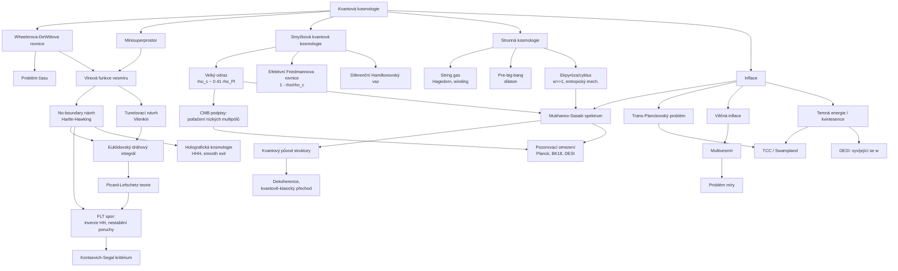

# Kvantová kosmologie (Quantum Cosmology)

> **TL;DR** — Kvantová kosmologie aplikuje kvantovou teorii na vesmír jako celek; jejím jádrem je Wheelerova-DeWittova rovnice (Wheeler-DeWitt equation) na minisuperprostoru (minisuperspace) a definice počáteční podmínky vesmíru pomocí dráhového integrálu (path integral). Dva klasické návrhy — Hartleho-Hawkingův no-boundary (bez hranice) a Vilenkinův tunelovací (tunneling) — předpovídají opačné váhy pro kosmologickou konstantu a od roku 2017 jsou předmětem sporu kvůli Lorentzovskému dráhovému integrálu (Feldbrugge-Lehners-Turok), kde dominantní sedlo dává přesně inverzi Hartleho-Hawkingova výsledku a nestabilní fluktuace. Smyčková kvantová kosmologie (loop quantum cosmology, LQC) nahrazuje velký třesk velkým odrazem (big bounce) při kritické hustotě $\rho_c \approx 0{,}41\,\rho_\mathrm{Pl}$ a nabízí potenciální podpis v potlačení nízkých multipólů CMB. Strunná kosmologie (string gas, pre-big-bang, ekpyrotický/cyklický scénář) a problémy trans-Planckovský, věčné inflace a míry (measure problem) zůstávají otevřené; pozorovací omezení (Planck 2018: $n_s = 0{,}9649$, $r < 0{,}036$; DESI DR2 2024-2025: náznak vyvíjející se temné energie) dnes tvrdě svazují tyto modely.

## Přehled a historický kontext

Kvantová kosmologie vznikla z otázky, zda lze formulovat kvantový stav celého vesmíru, a tím odstranit počáteční singularitu velkého třesku. Kanonický program začal **Bryce DeWitt (1967)**, který kvantoval Hamiltonovskou formulaci obecné relativity (ADM, Arnowitt-Deser-Misner) a získal rovnici, kterou později nazval Wheelerovou-DeWittovou (WDW). Klíčový rys: Hamiltonián je čistě vázaný (constraint), $\hat{\mathcal{H}}\Psi = 0$, takže rovnice neobsahuje vnější čas — odtud slavný **„problém času" (problem of time)**.

Protože plný superprostor (superspace) — prostor všech 3-geometrií — je nekonečněrozměrný, **Charles Misner (1972)** zavedl **minisuperprostor (minisuperspace)**: redukci na konečný počet stupňů volnosti (typicky škálový faktor $a$ a homogenní skalární pole $\phi$). To umožnilo explicitní řešení.

Otázku počáteční podmínky řešily dva návrhy:
- **Hartleho-Hawkingův no-boundary návrh (1983)** — vlnová funkce vesmíru je Euklidovský dráhový integrál přes kompaktní geometrie bez hranice.
- **Vilenkinův tunelovací návrh (1982, 1984)** — vesmír „tuneluje z ničeho" (creation from nothing) do de Sitterovské fáze.

V 80.–90. letech rozvinuli **Halliwell, Hawking, Wada, Vilenkin** semiklasickou interpretaci, dekoherenci a vznik klasických trajektorií. Od roku 2000 dominuje **smyčková kvantová kosmologie (LQC)** rozpracovaná **Bojowaldem, Ashtekarem, Pawlowským a Singhem**, která pomocí technik smyčkové kvantové gravitace nahrazuje singularitu velkým odrazem. Paralelně se rozvíjela **strunná kosmologie** (Gasperini-Veneziano pre-big-bang 1993; Brandenberger-Vafa string gas 1989; Steinhardt-Turok ekpyrotický scénář 2001).

Zásadní obrat nastal **2017**, kdy Feldbrugge, Lehners a Turok přepsali návrhy jako **Lorentzovský dráhový integrál** definovaný **Picardovou-Lefschetzovou teorií** a tvrdili, že no-boundary návrh je nekonzistentní (nestabilní fluktuace). Spor pokračuje dodnes (Halliwell-Hartle-Hertog, Di Tucci-Lehners, Lehnersovo kritérium Kontsevicha-Segala 2021–2025).

Paralelně s kanonickým a dráhově-integrálovým programem se rozvinula **konceptuální a interpretační linie**: dekoherenční historie (Gell-Mann-Hartle), Page-Woottersův mechanismus podmíněných pravděpodobností (1983) a Rovelliho relacionální kvantová mechanika, všechny motivované právě problémem času v kosmologii. Tato linie je dnes znovu aktivní v kontextu vzniku klasického prostoročasu a šipky času (2022-2026). Kvantová kosmologie tak slouží jako „laboratoř" pro nejhlubší konceptuální problémy kvantové gravitace — interpretace vlnové funkce uzavřeného systému bez vnějšího pozorovatele, význam $|\Psi|^2$ pro jediný vesmír a vznik klasicity z kvantové superpozice geometrií.

## Klíčové koncepty

- **Wheelerova-DeWittova rovnice (Wheeler-DeWitt equation, WDW)** — kvantová verze Hamiltonovského vazu obecné relativity, $\hat{\mathcal{H}}\Psi[h_{ij},\phi]=0$. Vlnový funkcionál $\Psi$ žije na superprostoru; rovnice je hyperbolická druhého řádu a neobsahuje čas.

- **Superprostor a minisuperprostor (superspace / minisuperspace)** — superprostor je prostor všech Riemannovských 3-metrik modulo difeomorfismy; minisuperprostor je jeho konečněrozměrná redukce symetrií (homogenita, izotropie). Standardní volba: $(a,\phi)$ pro FLRW.

- **Vlnová funkce vesmíru (wave function of the universe)** — $\Psi$ kódující kvantový stav celé kosmologie; její modul $|\Psi|^2$ se interpretuje (problematicky) jako pravděpodobnost dané 3-geometrie.

- **No-boundary návrh (Hartle-Hawking no-boundary proposal)** — $\Psi$ definovaná Euklidovským dráhovým integrálem přes kompaktní 4-geometrie, jejichž jedinou hranicí je zadaná 3-geometrie; geometrie se „uzavírá" hladce jako jižní pól na kouli (obraz „raketka/shuttlecock").

- **Tunelovací návrh (Vilenkin tunneling / creation from nothing)** — $\Psi$ obsahuje pouze „odcházející" (outgoing, expandující) vlny v asymptotice; vesmír vzniká kvantovým tunelováním z nulového škálového faktoru.

- **Picardova-Lefschetzova teorie (Picard-Lefschetz theory)** — matematický aparát pro definici oscilujícího (Lorentzovského) dráhového integrálu deformací konturu na strmé sestupy (steepest-descent thimbles); klíčová pro spor o no-boundary.

- **Velký odraz (big bounce)** — v LQC nahrazuje singularitu velkého třesku; při $\rho = \rho_c$ se kontrahující vesmír odrazí do expanze díky kvantově-geometrické odpudivosti.

- **Efektivní dynamika (effective dynamics)** — semiklasické rovnice LQC získané z očekávaných hodnot operátorů; modifikovaná Friedmannova rovnice s členem $(1-\rho/\rho_c)$.

- **Holonomické a inverzně-objemové korekce (holonomy / inverse-volume corrections)** — dva typy kvantových oprav v LQC; holonomické dominují u odrazu, inverzně-objemové u malých objemů.

- **Problém času (problem of time)** — WDW rovnice neobsahuje čas; strategie: vnitřní hodiny (skalární pole jako emergentní čas), podmíněné pravděpodobnosti (Page-Wootters), Rovelliho „evolving constants".

- **Trans-Planckovský problém (trans-Planckian problem)** — pozorované módy CMB měly na začátku inflace vlnové délky menší než Planckova délka; spektrum pak závisí na neznámé sub-Planckovské fyzice.

- **Věčná inflace (eternal inflation)** — kvantové fluktuace inflatonu udržují inflaci „navěky" v rostoucím objemu, generujíce multivesmír (multiverse) kapes s různými vlastnostmi.

- **Problém míry (measure problem)** — v nekonečném multivesmíru divergují objemy/počty pozorovatelů; neexistuje kanonická normalizace pravděpodobností.

- **Ekpyrotický/cyklický scénář (ekpyrotic / cyclic)** — kontrahující fáze s tuhou stavovou rovnicí $w \gg 1$ generuje (entropickým mechanismem) škálově invariantní spektrum bez inflace; cyklické verze opakují kosmické cykly.

- **String gas kosmologie (string gas cosmology)** — kvazi-statická Hagedornova fáze plynu strun; T-dualita a vinutí (winding) módy řeší singularitu a generují téměř škálově invariantní spektrum.

- **Pre-big-bang scénář (pre-big-bang)** — dilatonem řízená super-inflace před velkým třeskem, motivovaná T/S-dualitou strun.

- **Kvantový původ struktury (quantum origin of structure)** — primordiální poruchy pocházejí z kvantových fluktuací; jejich kvantově-klasický přechod (decoherence, squeezing) vysvětluje klasickou náhodnost CMB.

- **Dekoherence v kosmologii (cosmic decoherence)** — vystopování (tracing out) krátkovlnných/environmentálních módů vede k diagonalizaci redukované matice hustoty v bázi amplitudy pole; „pointer basis".

## Matematický rámec

### Wheelerova-DeWittova rovnice (plná i minisuperprostorová)

$$
\hat{\mathcal{H}}\,\Psi[h_{ij},\phi] = \left[-16\pi G\, G_{ijkl}\frac{\delta^2}{\delta h_{ij}\delta h_{kl}} - \frac{\sqrt{h}}{16\pi G}\left({}^{(3)}R - 2\Lambda\right) + \hat{\mathcal{H}}_{\text{matter}}\right]\Psi = 0
$$

Zde $h_{ij}$ je 3-metrika, $h=\det h_{ij}$, ${}^{(3)}R$ je vnitřní Ricciho skalár 3-prostoru, $\Lambda$ kosmologická konstanta, $G$ Newtonova konstanta a $G_{ijkl}=\tfrac{1}{2}h^{-1/2}(h_{ik}h_{jl}+h_{il}h_{jk}-h_{ij}h_{kl})$ je **DeWittova supermetrika (DeWitt supermetric)** s Lorentzovskou signaturou $(-+++++)$ na superprostoru. **Význam:** je to kvantový vaz, který nahrazuje Schrödingerovu rovnici pro celý vesmír; absence času je důsledkem invariance vůči reparametrizaci času (difeomorfismů).

### Minisuperprostorová WDW pro uzavřený FLRW vesmír s $\Lambda$

$$
\left[\frac{\hbar^2}{a^p}\frac{d}{da}\left(a^p\frac{d}{da}\right) - a^2 + \frac{\Lambda}{3}a^4\right]\Psi(a) = 0
$$

$a$ je škálový faktor uzavřeného vesmíru, $p$ kóduje nejednoznačnost uspořádání operátorů (operator-ordering ambiguity). Člen $-a^2$ pochází z prostorové křivosti $k=+1$, člen $+\tfrac{\Lambda}{3}a^4$ z kosmologické konstanty. **Význam:** jedná se o efektivní „Schrödingerovu" rovnici s potenciálem $V(a)=a^2-\tfrac{\Lambda}{3}a^4$, který má bariéru — odtud tunelovací interpretace. Klasicky zakázaná oblast je $a < \sqrt{3/\Lambda}$.

### No-boundary (Hartleho-Hawkingova) vlnová funkce

$$
\Psi_{\text{NB}}[h_{ij},\phi] = \int_{\mathcal{C}} \mathcal{D}g_{\mu\nu}\,\mathcal{D}\phi\; e^{-I_E[g_{\mu\nu},\phi]/\hbar}
$$

Integruje se přes kompaktní Euklidovské 4-geometrie $g_{\mu\nu}$ s jedinou hranicí $h_{ij}$ (žádná počáteční hranice), $I_E$ je Euklidovská akce. **Význam:** počáteční podmínka vesmíru je nahrazena geometrickým požadavkem regularity (uzavření) — „vesmír nemá počátek, protože nemá hranici v minulosti".

### Semiklasická no-boundary pravděpodobnost pro de Sitter

$$
|\Psi_{\text{NB}}|^2 \sim \exp\!\left(-\frac{2 I_E}{\hbar}\right) = \exp\!\left(+\frac{3}{8 G^2 \rho_\Lambda}\right) = \exp\!\left(+\frac{12\pi^2}{\hbar\, \Lambda}\right)
$$

$I_E = -\tfrac{3\pi}{2G\Lambda} = -\tfrac{3}{8}\tfrac{1}{G^2\rho_\Lambda}$ (s $\rho_\Lambda=\Lambda/8\pi G$) je akce regulárního Euklidovského de Sitteru (4-sféry). **Význam:** no-boundary návrh upřednostňuje **malé** $\Lambda$ (velké vesmíry pravděpodobnější) — problematicky, protože to favorizuje prázdné vesmíry. Tunelovací návrh dává opačné znaménko $\exp(-12\pi^2/\hbar\Lambda)$, tj. favorizuje **velké** $\Lambda$ a tedy inflaci.

### Vilenkinova tunelovací pravděpodobnost

$$
|\Psi_{\text{T}}|^2 \sim \exp\!\left(-\frac{2}{\hbar}\,|I_E|\right) = \exp\!\left(-\frac{12\pi^2}{\hbar\,\Lambda}\right) = \exp\!\left(-\frac{3}{8 G^2 \rho_\Lambda}\right)
$$

**Význam:** identický modul akce, opačné znaménko v exponentu. Vilenkin tvrdí, že tunelovací návrh správně předpovídá nukleaci vesmírů s **velkou** vakuovou energií, a tedy generuje inflaci. Spor o „správné" znaménko je jádrem debaty mezi oběma návrhy.

### Lorentzovský minisuperprostorový dráhový integrál (Feldbrugge-Lehners-Turok)

$$
G[q_1;q_0] = \int_{0^+}^{\infty} dN \int \mathcal{D}q\; e^{iS[q,N]/\hbar}, \qquad
S = 2\pi^2\!\int_0^1 dt\, N\!\left[-\frac{3}{4N^2}\dot q^2 + 3 - \Lambda q\right]
$$

$q=a^2$ je čtverec škálového faktoru, $N$ lapse (časová „šíře"), integruje se nejprve po $q(t)$ (Gaussovsky) a pak po $N$ s konturem definovaným Picardovou-Lefschetzovou teorií. **Význam:** přechod od podmíněně konvergentního Euklidovského integrálu k absolutně konvergentnímu Lorentzovskému. Klíčový závěr FLT (2017): dominantní sedlo dává faktor, který je **přesně inverzí** Hartleho-Hawkingova výsledku — *„the dominant saddle contributes a semiclassical exponential factor which is precisely the inverse of the famous Hartle-Hawking result"* (čili $e^{-12\pi^2/\hbar\Lambda}$, tunelovací znaménko), a navíc fluktuace mají **inverzně Gaussovskou** (rostoucí) váhu.

### Váha fluktuací v Lorentzovském no-boundary (nestabilita)

$$
P(\text{poruchy}) \sim \exp\!\left(+\frac{3}{2\hbar\Lambda}\,\sum_{l} l(l+1)(l+2)\,|\phi_l|^2\right)
$$

**Význam:** kladný exponent znamená, že větší poruchy jsou **pravděpodobnější** — vlnová funkce je nenormalizovatelná a předpovídá divoké, neklasické fluktuace, což odporuje hladkému pozorovanému CMB. To je hlavní argument FLT proti no-boundary návrhu. (Halliwell-Hartle-Hertog a Di Tucci-Lehners argumentují, že vhodný výběr konturu nebo „weighted/momentum" lapse obnoví správné, **tlumené** poruchy.)

### Efektivní modifikovaná Friedmannova rovnice v LQC

$$
H^2 = \left(\frac{\dot a}{a}\right)^2 = \frac{8\pi G}{3}\,\rho\left(1 - \frac{\rho}{\rho_c}\right), \qquad
\rho_c = \frac{\sqrt{3}}{32\pi^2\gamma^3 G^2\hbar} \approx 0{,}41\,\rho_{\text{Pl}}
$$

$\rho$ je hustota energie, $\rho_c$ kritická hustota (bounce density), $\gamma \approx 0{,}2375$ je Barberův-Immirziho parametr (Barbero-Immirzi parameter). **Význam:** při $\rho \to \rho_c$ je $H \to 0$ a $\dot H > 0$ — vesmír se odrazí. Pro $\rho \ll \rho_c$ se obnovuje klasická Friedmannova rovnice. Toto je nejcitovanější kvantitativní výsledek LQC; $\rho_c \approx 0{,}41\,\rho_{\text{Pl}} \sim 5{,}1\times 10^{99}\,\text{kg/m}^3$.

### Plošná mezera a kvantový Hamiltonovský vaz (diferenční rovnice)

$$
\Delta = 4\sqrt{3}\,\pi\,\gamma\, \ell_{\text{Pl}}^2, \qquad
\hat{C}\,\Psi(v) = C^+(v)\Psi(v+4) + C^0(v)\Psi(v) + C^-(v)\Psi(v-4) = 0
$$

$\Delta$ je nejmenší nenulová vlastní hodnota operátoru plochy (area gap), $v$ je objemová proměnná (úměrná $a^3$, „kvantum objemu"), $C^{\pm,0}$ jsou koeficienty. **Význam:** v LQC je WDW *diferenciální* rovnice nahrazena *diferenční* rovnicí — diskrétnost geometrie zajišťuje řešitelnost přes singularitu a deterministickou evoluci napříč odrazem. Pár $(b,v)$ (kde $b$ je konjugovaný „úhel" holonomie) parametrizuje fázový prostor; $\mu$-bar schéma (improved dynamics) zavádí fyzikální (na stavu závislou) velikost smyčky $\bar\mu \propto 1/\sqrt{|p|}$.

### Spektrum primordiálních poruch (Mukhanovova-Sasakiho rovnice)

$$
v_k'' + \left(k^2 - \frac{z''}{z}\right)v_k = 0, \qquad
\mathcal{P}_{\mathcal{R}}(k) = \frac{k^3}{2\pi^2}\left|\frac{v_k}{z}\right|^2, \quad z = a\frac{\dot\phi}{H}
$$

$v_k$ je Mukhanovova-Sasakiho proměnná pro komóvující křivostní poruchu $\mathcal{R}$, $z$ je „pumpovací" funkce pozadí, $\mathcal{P}_{\mathcal{R}}$ je výkonové spektrum. **Význam:** společný jazyk pro inflaci, LQC, ekpyrotický a string gas scénář — liší se pozadím $z''/z$ a vakuovou volbou. Inflace dává $n_s-1 = -6\epsilon+2\eta$; ekpyróza generuje škálovou invarianci entropickým mechanismem; LQC modifikuje spektrum přes odraz (potlačení na velkých škálách).

### Trans-Planckovské cenzurní kritérium (TCC)

$$
\frac{a_f}{a_i}\,\ell_{\text{Pl}} < \frac{1}{H_f} \quad\Longrightarrow\quad \frac{|V'|}{V} \gtrsim \frac{2}{\sqrt{(d-2)}}\,\frac{1}{M_{\text{Pl}}} \;\; (d=4)
$$

Levá strana: žádný sub-Planckovský mód se nesmí během expanze roztáhnout přes Hubbleův horizont. **Význam:** Bedroya-Vafa (2019) odvodili swampland-podobnou mez, která omezuje energetickou škálu inflace ($V^{1/4} \lesssim 6\times10^8$ GeV pro jednoduché modely) a tedy tensor-to-scalar ratio $r \lesssim 10^{-30}$ — silně v napětí s klasickou high-scale inflací; přímo propojuje kvantovou kosmologii se swamplandem.

## Klíčové výsledky a milníky

- **DeWitt (1967)** — odvození WDW rovnice z kanonického kvantování gravitace; první kvantová rovnice pro vesmír [DeWitt 1967](https://doi.org/10.1103/PhysRev.160.1113).
- **Misner (1969, 1972)** — zavedení minisuperprostoru a kvantové kosmologie typu Mixmaster.
- **Vilenkin (1982)** — „Creation of universes from nothing"; tunelovací návrh [Vilenkin 1982](https://doi.org/10.1016/0370-2693(82)90866-8).
- **Hartle & Hawking (1983)** — „Wave function of the Universe"; no-boundary návrh a Euklidovský dráhový integrál [Hartle & Hawking 1983](https://doi.org/10.1103/PhysRevD.28.2960).
- **Halliwell & Hawking (1985)** — poruchy kolem minisuperprostoru, vznik klasických fluktuací z no-boundary stavu.
- **Bojowald (2001)** — „Absence of a singularity in loop quantum cosmology"; první důkaz řešení singularity diskrétní WDW rovnicí [Bojowald 2001](https://arxiv.org/abs/gr-qc/0102069).
- **Martin & Brandenberger (2001)** — formulace trans-Planckovského problému inflace a modifikovaných disperzí [Martin & Brandenberger 2001](https://arxiv.org/abs/hep-th/0005209).
- **Khoury, Ovrut, Steinhardt, Turok (2001)** — ekpyrotický scénář jako alternativa k inflaci [Khoury et al. 2001](https://arxiv.org/abs/hep-th/0103239).
- **Ashtekar, Pawlowski, Singh (2006)** — „Quantum Nature of the Big Bang"; rigorózní velký odraz při $\rho_c \approx 0{,}41\,\rho_{\text{Pl}}$, skalární pole jako vnitřní hodiny, deterministická evoluce přes Planckův režim [Ashtekar, Pawlowski & Singh 2006](https://arxiv.org/abs/gr-qc/0602086).
- **Taveras (2008)** — odvození efektivní modifikované Friedmannovy rovnice $H^2 \propto \rho(1-\rho/\rho_c)$ z LQG koherentních stavů [Taveras 2008](https://arxiv.org/abs/0807.3325).
- **Hartle, Hawking, Hertog (2008)** — „Classical Universes of the No-Boundary Quantum State"; klasické historie a jejich pravděpodobnosti [Hartle, Hawking & Hertog 2008](https://arxiv.org/abs/0803.1663).
- **Ijjas, Lehners, Steinhardt (2014)** — obecný mechanismus pro škálově invariantní spektrum a malé $f_{\text{NL}}\sim 5$ v ekpyróze [Ijjas, Lehners & Steinhardt 2014](https://arxiv.org/abs/1404.1265).
- **Feldbrugge, Lehners, Turok (2017)** — „Lorentzian Quantum Cosmology"; Picardova-Lefschetzova analýza, dominantní sedlo = inverze Hartleho-Hawkingova výsledku [Feldbrugge, Lehners & Turok 2017](https://arxiv.org/abs/1703.02076).
- **Feldbrugge, Lehners, Turok (2017b)** — „No smooth beginning for spacetime"; nestabilní poruchy v Lorentzovském no-boundary [Feldbrugge, Lehners & Turok 2017b](https://arxiv.org/abs/1705.00192).
- **Hawking & Hertog (2018)** — „A Smooth Exit from Eternal Inflation?"; holografická reformulace, konečný a hladký multivesmír [Hawking & Hertog 2018](https://arxiv.org/abs/1707.07702).
- **Bedroya & Vafa (2019)** — Trans-Planckian Censorship Conjecture, propojení se swamplandem [Bedroya & Vafa 2019](https://arxiv.org/abs/1909.11063).
- **Lehners (2021)** — kritérium Kontsevicha-Segala pro přípustné komplexní metriky v kvantové kosmologii [Lehners 2021](https://arxiv.org/abs/2111.07816).
- **Planck Collaboration (2018)** — $n_s = 0{,}9649 \pm 0{,}0042$, $r_{0{,}002} < 0{,}064$ (s BK14) [Planck 2018 X](https://arxiv.org/abs/1807.06211).
- **BICEP/Keck (2021)** — $r < 0{,}036$ (95 % CL, BK18) [BICEP/Keck 2021](https://arxiv.org/abs/2110.00483).
- **DESI Collaboration (2024-2025)** — náznak vyvíjející se temné energie $w_0w_a$CDM, napětí s $\Lambda$CDM až $\sim 4{,}2\sigma$ při kombinaci dat [DESI 2024](https://arxiv.org/abs/2405.13588).

## Současný stav (2024-2026)

Pole je dnes charakterizováno čtyřmi aktivními frontami:

1. **Spor o no-boundary se posunul k matematickým kritériím přípustnosti.** Místo „kdo má pravdu" se zkoumá, *které komplexní metriky* jsou fyzikálně přípustné. Lehnersovo (2021) a navazující práce aplikují **Kontsevichovo-Segalovo kritérium** (požadavek, aby na metrice byla konzistentně definovatelná kvantová pole) na de Sitter, AdS a no-boundary sedla; ukazuje se, že sedla leží *přesně na okraji* přípustné domény. V letech 2023-2025 vznikla práce *„Kontsevich-Segal Criterion in the No-Boundary State Constrains Inflation"* (Phys. Rev. Lett. 131, 191501) a navazující omezení na anizotropii (Phys. Rev. D 111, 046008, 2025), které kritérium používají k *omezení inflačních modelů*. Di Tucci-Lehners zavedli „no-boundary" přes vážený lapse, který obnovuje tlumené poruchy.

2. **LQC míří k pozorovatelným.** Soustavné studie (2024-2025) počítají primordiální výkonová spektra v různých regularizačních schématech — standardní LQC, Thiemannova regularizace, mLQC-I/II — v *dressed metric* i *hybrid* přístupu. Práce *„Constraining regularization ambiguities in Loop Quantum Cosmology via CMB"* (Phys. Rev. D 110, 066005, 2024) ukazuje, že různá schémata dávají rozlišitelné podpisy a že odraz může přirozeně potlačit nízké multipóly CMB. Všechny tři modely dávají nesingulární odraz s rychlou konvergencí post-bounce fyziky během několika Planckových sekund.

3. **DESI a temná energie.** Nejdůležitější pozorovací událost: DESI DR1 (2024) a DR2 (2025) naznačují **vyvíjející se temnou energii** v $w_0w_a$CDM parametrizaci (CPL: $w(a)=w_0+w_a(1-a)$), s napětím vůči $\Lambda$CDM dosahujícím $2{,}8\sigma$–$4{,}2\sigma$ podle kombinace s CMB a SN Ia. To oživuje kvintesenci a swamplandové scénáře (de Sitter conjecture favorizuje *dynamickou* temnou energii), čímž propojuje kvantovou kosmologii se swamplandem na pozorovací úrovni.

4. **Dekoherence a vznik klasicity.** Aktivní oblast 2022-2026: práce jako *„The Cosmological Arrow of Time from Inflationary Branch Decoherence"* (arXiv:2602.21263, 2026) používají influenční funkcionál pro odvození dekoherence superhorizontových módů, zdůrazňujíce, že samotná WKB struktura a squeezing *nestačí* ke klasicitě — je nutné vystopovat environmentální stupně volnosti. Vzniká tak emergentní kosmologická šipka času.

Strunná kosmologie (string gas, pre-big-bang, ekpyróza) zůstává teoreticky aktivní (Brandenbergerův komplementární přehled „Superstring Cosmology", arXiv:2306.12458, 2023), ale postrádá rozhodující pozorovací podpis; ekpyrotické modely jsou kompatibilní s $r \approx 0$, což je zatím v souladu s BK18.

### Klíčová pozorovací čísla (rychlý přehled)

Pro orientaci, kvantitativní omezení, která dnes svazují všechny scénáře kvantové kosmologie:

| Veličina | Hodnota | Zdroj |
|---|---|---|
| Spektrální index skalárních poruch $n_s$ | $0{,}9649 \pm 0{,}0042$ (68 % CL) | Planck 2018 |
| Tensor-to-scalar ratio $r$ | $< 0{,}064$ (Planck+BK14) → $< 0{,}036$ (BK18, 95 % CL) | Planck 2018 / BICEP-Keck 2021 |
| Amplituda skalárního spektra $A_s$ | $\approx 2{,}1\times 10^{-9}$ (při $k=0{,}05\,\text{Mpc}^{-1}$) | Planck 2018 |
| Lokální non-Gaussianita $f_{\text{NL}}^{\text{local}}$ | $-0{,}9 \pm 5{,}1$ (Planck) | Planck 2018 |
| Predikce ekpyrózy $f_{\text{NL}}$ | $\sim 5$ (z konverze entropie) | Ijjas-Lehners-Steinhardt 2014 |
| Kritická hustota odrazu LQC $\rho_c$ | $\approx 0{,}41\,\rho_{\text{Pl}} \sim 5{,}1\times 10^{99}\,\text{kg/m}^3$ | Ashtekar-Pawlowski-Singh 2006 |
| Barberův-Immirziho parametr $\gamma$ | $\approx 0{,}2375$ | z entropie černé díry |
| No-boundary / tunelovací exponent | $\pm 12\pi^2/\hbar\Lambda = \pm 3/(8 G^2\rho_\Lambda)$ | Hartle-Hawking / Vilenkin |
| Mez TCC na škálu inflace | $V^{1/4} \lesssim 6\times 10^{8}$ GeV, $r \lesssim 10^{-30}$ | Bedroya-Vafa 2019 |
| DESI napětí s $\Lambda$CDM ($w_0w_a$CDM) | $2{,}8\sigma$–$4{,}2\sigma$ (dle kombinace) | DESI 2024-2025 |
| Cíl budoucích misí ($r$) | LiteBIRD/CMB-S4: $\sigma(r)\sim 10^{-3}$ | plánováno |

Tato čísla ukazují, proč je dnes pole „pozorovatelsky svázané": LQC i ekpyróza musí být kompatibilní s $n_s\approx 0{,}965$ a $r<0{,}036$; TCC je v ostrém napětí s high-scale inflací; a DESI poprvé dává empirický vstup pro swamplandové předpovědi temné energie.

## Otevřené problémy

1. **Problém správné počáteční podmínky (no-boundary vs. tunelovací).** Oba návrhy dávají *opačná znaménka* exponentu $\pm 12\pi^2/\hbar\Lambda$, a tedy opačné předpovědi pro $\Lambda$ a pravděpodobnost inflace. *Proč je to těžké:* neexistuje první princip, který by jednoznačně určil kontur Lorentzovského dráhového integrálu; Picardova-Lefschetzova teorie sice kontur fixuje, ale výběr „weighted lapse" či okrajových podmínek mění výsledek. Otevřené i po Kontsevichově-Segalově kritériu.

2. **Stabilita poruch v no-boundary stavu.** FLT (2017) ukázali, že naivní Lorentzovský no-boundary dává **anti-Gaussovské, rostoucí** fluktuace ($P\sim e^{+|\delta\phi|^2/\ldots}$), tedy nenormalizovatelnou vlnovou funkci. *Proč je to těžké:* obhájci (Halliwell-Hartle-Hertog, Di Tucci-Lehners) musejí ad-hoc měnit kontur/okrajové podmínky, aby obnovili tlumené poruchy; konsensus, zda je to legitimní, chybí.

3. **Problém času (problem of time).** WDW rovnice $\hat{\mathcal{H}}\Psi=0$ neobsahuje čas a nemá kanonický kladně-definitní vnitřní součin (Klein-Gordonův součin není pozitivní). *Proč je to těžké:* každá strategie (vnitřní hodiny, Page-Wootters podmíněné pravděpodobnosti, Rovelliho komplet/parciální observable) má cenu — buď ztrátu unitarity, nebo závislost na volbě hodin, nebo problém s globálním časem v zakřivených pozadích.

4. **Problém míry a pravděpodobnosti v jediném vesmíru.** $|\Psi|^2$ se interpretuje jako pravděpodobnost, ale (a) pozorujeme jen jeden vesmír, (b) ve věčné inflaci divergují objemy a počty pozorovatelů. *Proč je to těžké:* žádná navržená míra (causal patch, scale-factor cutoff, stationary measure) není bez paradoxů (Boltzmannovi mozci, „youngness paradox", Q-katastrofa); volba míry mění předpovědi pro $\Lambda$ i $Q$.

5. **Trans-Planckovský problém.** Pozorované CMB módy vznikly z sub-Planckovských vlnových délek; spektrum pak může záviset na neznámé UV fyzice (modifikované disperze à la Corley-Jacobson mění spektrum, Unruhova nemění). *Proč je to těžké:* bez plné teorie kvantové gravitace nelze jednoznačně určit vakuum nad Planckovou škálou; TCC dokonce naznačuje, že standardní inflace je v napětí s kvantovou gravitací.

6. **Pozorovatelná diskriminace mezi scénáři.** Inflace, LQC-odraz, ekpyróza a string gas mohou všechny dát téměř škálově invariantní spektrum. *Proč je to těžké:* rozlišující podpisy (LQC: potlačení nízkých multipólů a specifické oscilace; ekpyróza: $r\approx 0$ a $f_{\text{NL}}\sim 5$; string gas: modrý tensor index) jsou na hranici nebo pod prahem citlivosti Plancku/BK18; CMB-S4 a LiteBIRD je mohou částečně testovat, ale ne rozhodnout.

7. **Vznik klasického prostoročasu (decoherence).** Není shoda, jak přesně se kvantová superpozice geometrií/poruch redukuje na jedno klasické pozadí; samotný squeezing nestačí, je nutné environmentální vystopování, jehož volba není jednoznačná. *Proč je to těžké:* „pointer basis", coarse-graining a definice prostředí jsou v uzavřeném vesmíru (kde není vnější pozorovatel) konceptuálně nejasné.

8. **Mezera mezi minisuperprostorem a plnou teorií.** Téměř všechny výsledky (no-boundary, LQC, WDW) jsou odvozeny v symetricky redukovaném minisuperprostoru; není zaručeno, že přežijí v plné teorii s nekonečně mnoha stupni volnosti (problém „minisuperspace truncation"). *Proč je to těžké:* plný dráhový integrál/WDW je matematicky nedefinovaný; redukce před kvantováním nemusí komutovat s kvantováním.

9. **Temná energie z kvantové gravitace.** Odvodit pozorovanou hodnotu (a možný časový vývoj) temné energie z první principů kvantové gravitace, kompatibilně se swamplandovými konjekturami. *Proč je to těžké:* kvantové korekce naivně dávají kosmologickou konstantu o $\sim 120$ řádů příliš velkou; de Sitter conjecture zakazuje stabilní de Sitter (tlačí ke kvintesenci), ale žádná kontrolovaná strunná konstrukce nedává pozorovanou škálu. Causal-set předpověď $\Lambda \sim \pm 1/\sqrt{V}$ (Sorkin) je řádově správná, ale konceptuálně izolovaná; DESI 2024-2025 fits dynamického $w$ situaci dramatizují.

## Vztahy k ostatním přístupům

### Smyčková kvantová gravitace (Loop Quantum Gravity) — **dobře prozkoumáno**
LQC je symetricky redukovaná „kosmologická vitrína" LQG: přebírá Ashtekarovy proměnné, holonomie, plošnou mezeru $\Delta$ a Barberův-Immirziho parametr $\gamma$. Otevřená otázka: zda je LQC skutečně *limitou* plné LQG, nebo jen heuristikou (problém, zda redukce-pak-kvantování = kvantování-pak-redukce). Existuje program „group field theory cosmology" a „spin foam cosmology", který se snaží odvodit odraz z plné teorie. Most je explicitní a rozsáhle studovaný, ale jeho rigoróznost zůstává otevřená.

### Strunná teorie (String Theory) — **částečně prozkoumáno**
Strunná kosmologie (string gas, pre-big-bang, ekpyróza/cyklus) přímo používá strunné prvky: T-dualitu, Hagedornovu teplotu, vinutí módy, dilaton, brány. No-boundary návrh byl reformulován **holograficky** (Hartle-Hawking-Hertog) přes AdS/CFT — komplexní sedla mají duální popis jako deformace CFT na hranici. Swampland (de Sitter conjecture, TCC) přímo omezuje kosmologické modely. Mezera: chybí plně strunný výpočet vlnové funkce vesmíru a kontrolovaná de Sitterova vakua.

### Holografie / AdS-CFT (Holography / AdS-CFT) — **částečně prozkoumáno**
Holografická kosmologie (Hartle-Hawking-Hertog 2008-2018, Hawking-Hertog 2018 „smooth exit") reprezentuje no-boundary míru pomocí partičních funkcí (Euklidovských) CFT na konečné hranici; eternal inflation je duální deformované CFT „na prahu". Komplexní no-boundary sedla mají reprezentaci jako regulární Euklidovská AdS doménová stěna přecházející do Lorentzovského inflačního vesmíru, takže no-boundary míra je dána partiční funkcí pole na hranici jakožto deformací CFT z AdS/CFT. Hawking-Hertog (2018) z toho usuzují, že výstup z věčné inflace *není* nekonečně fraktální multivesmír, ale **konečný a hladký**. dS/CFT (Strominger, Maldacena) je příbuzný, ale spekulativnější rámec ($Z_{\text{CFT}} = \Psi_{\text{dS}}$). Slibné, ale duální CFT pro realistickou kosmologii nejsou pod kontrolou.

### Swampland (Swampland) — **částečně, rostoucí**
De Sitter conjecture ($|\nabla V|/V \gtrsim c \sim \mathcal{O}(1)$) a TCC přímo omezují inflaci a temnou energii: favorizují *dynamickou* (kvintesenční) temnou energii — což rezonuje s náznakem DESI 2024-2025. TCC dává $r \lesssim 10^{-30}$ pro jednoduché modely, v napětí s high-scale inflací. Most je konceptuálně jasný a aktivně rozvíjený, kvantitativně ale závisí na hodnotách swampland konstant.

### Asymptotická bezpečnost (Asymptotic Safety) — **sotva prozkoumáno**
Asymptoticky bezpečná gravitace nabízí UV-úplnost, která by mohla definovat trans-Planckovskou fyziku a tedy dořešit trans-Planckovský problém i dráhový integrál nad Planckovou škálou. Existují práce o „asymptotically safe cosmology" (RG-zlepšené Friedmannovy rovnice, fixní bod a inflace), ale spojení s WDW vlnovou funkcí a no-boundary návrhem je téměř nezmapované — potenciální zlatá žíla.

### Kauzální dynamické triangulace (Causal Dynamical Triangulations) — **sotva prozkoumáno**
CDT numericky počítá Lorentzovský dráhový integrál gravitace a *získává* de Sitterovskou „kosmologickou kapku" (semiclassical de Sitter universe) z první principů — což je přímo to, co kvantová kosmologie postuluje v minisuperprostoru. Srovnání efektivní minisuperprostorové akce CDT s no-boundary/Lorentzovským dráhovým integrálem je málo prozkoumané, ale konceptuálně velmi blízké (oba jsou Lorentzovské dráhové integrály geometrie).

### Kauzální množiny (Causal Sets) — **sotva prozkoumáno**
Causal set kosmologie (sekvenční růst, „cosmic renormalization", předpověď fluktuace $\Lambda \sim \pm 1/\sqrt{V}$ ~ pozorované hodnotě) nabízí alternativní kvantově-gravitační původ temné energie a počáteční podmínky. Vazba na WDW/no-boundary je prakticky neexistující — slibné neprobádané propojení (zejména Sorkinova předpověď $\Lambda$).

### Nekomutativní geometrie (Noncommutative Geometry) — **sotva prozkoumáno**
Nekomutativita prostoročasu zavádí minimální délku a modifikované disperze, čímž se přímo dotýká trans-Planckovského problému a generalizovaného principu neurčitosti (GUP) v WDW rovnici. Existují izolované práce o „noncommutative quantum cosmology" (deformovaný minisuperprostor), ale systematické propojení s no-boundary/LQC chybí.

### Černé díry a informace (Black Holes / Information) — **částečně prozkoumáno**
Sdílí Euklidovský dráhový integrál a sedlové metody (Hartleho-Hawkingův stav je i jméno termálního vakua černé díry). Page curve, replica wormholes a kosmologické „bra-ket wormholes" (Marolf-Maxfield) propojují kosmologickou vlnovou funkci s problémem informace; α-parametry a baby universes jsou společné téma. Aktivní, ale mladé propojení.

### Semiklasická gravitace (Semiclassical Gravity) — **dobře prozkoumáno**
Kvantová kosmologie přechází v semiklasickou gravitaci ve WKB limitě: $\Psi \sim e^{iS_0/\hbar}$ dává klasické trajektorie + kvantové pole na klasickém pozadí. Odtud se odvozuje funkcionál Schrödingerovy rovnice pro poruchy (Banks, Halliwell-Hawking). Dobře pochopený, je to standardní můstek mezi WDW a inflační teorií poruch.

### Experimentální testy (Experimental Tests) — **částečně prozkoumáno**
Pozorovací rozhraní: CMB (Planck $n_s$, $r$; BK18 $r<0{,}036$; potlačení nízkých multipólů), primordiální gravitační vlny (LiteBIRD, CMB-S4 cílí $r\sim 10^{-3}$), non-Gaussianity ($f_{\text{NL}}$), spektrální distorze, DESI/Euclid pro temnou energii. Spojení s konkrétními predikcemi LQC/ekpyrózy existuje, ale rozhodující test zatím chybí. Konkrétně: LQC predikuje potlačení výkonu na velkých úhlových škálách (nízké multipóly $\ell \lesssim 30$) a charakteristické oscilace v primordiálním spektru závisející na fázi pole při odrazu; ekpyróza předpovídá $r \approx 0$ a $f_{\text{NL}}\sim 5$; string gas dává mírně modrý tensorový index ($n_T > 0$), což je opačné než inflace ($n_T < 0$) — kvalitativně rozlišitelné, pokud bude $r$ vůbec detekováno.

### Pojmové problémy (Conceptual Problems) — **dobře prozkoumáno**
Kvantová kosmologie je arénou, kde jsou nejhlubší konceptuální problémy kvantové gravitace nejostřejší: problém času, význam $|\Psi|^2$ pro jediný vesmír, problém míry a interpretace kvantového stavu uzavřeného systému bez vnějšího pozorovatele. Rozsáhle diskutováno ve filozofii fyziky a literatuře o základech (Isham, Kuchař, Anderson, Page-Wootters). Most je explicitní a bohatě rozpracovaný.

### Provázanost a prostoročas (Entanglement / Spacetime) — **sotva prozkoumáno**
Kvantově-klasický přechod primordiálních poruch a dekoherence se opírají o provázanost mezi pozorovanými superhorizontovými módy a nepozorovaným prostředím; emergentní šipka času a ER=EPR-style myšlenky naznačují, že struktura/prostoročas vzniká z provázanosti. Vazba mezi kosmologickou vlnovou funkcí a prostoročasem budovaným z provázanosti je sugestivní, ale téměř neformalizovaná — potenciální neprobádané propojení.

## Mapa konceptů

## Reference

1. **B. S. DeWitt**, „Quantum Theory of Gravity. I. The Canonical Theory", *Phys. Rev.* **160**, 1113 (1967). DOI: [10.1103/PhysRev.160.1113](https://doi.org/10.1103/PhysRev.160.1113). — Odvození Wheelerovy-DeWittovy rovnice; zrod kanonické kvantové kosmologie.
2. **C. W. Misner**, „Minisuperspace", in *Magic Without Magic* (1972). — Zavedení minisuperprostorové redukce.
3. **A. Vilenkin**, „Creation of Universes from Nothing", *Phys. Lett. B* **117**, 25 (1982). DOI: [10.1016/0370-2693(82)90866-8](https://doi.org/10.1016/0370-2693(82)90866-8). — Tunelovací návrh, vznik vesmíru z ničeho.
4. **J. B. Hartle & S. W. Hawking**, „Wave function of the Universe", *Phys. Rev. D* **28**, 2960 (1983). DOI: [10.1103/PhysRevD.28.2960](https://doi.org/10.1103/PhysRevD.28.2960). — No-boundary návrh; nejcitovanější práce kvantové kosmologie.
5. **J. J. Halliwell & S. W. Hawking**, „Origin of structure in the Universe", *Phys. Rev. D* **31**, 1777 (1985). DOI: [10.1103/PhysRevD.31.1777](https://doi.org/10.1103/PhysRevD.31.1777). — Poruchy kolem minisuperprostoru, vznik struktury z no-boundary.
6. **A. Vilenkin**, „Quantum cosmology and eternal inflation", arXiv: [gr-qc/0204061](https://arxiv.org/abs/gr-qc/0204061) (2002). — Propojení tunelovacího návrhu s věčnou inflací a mírou.
7. **M. Bojowald**, „Absence of a Singularity in Loop Quantum Cosmology", *Phys. Rev. Lett.* **86**, 5227 (2001). arXiv: [gr-qc/0102069](https://arxiv.org/abs/gr-qc/0102069). — První řešení singularity diskrétní WDW rovnicí; zrod LQC.
8. **J. Martin & R. H. Brandenberger**, „The Trans-Planckian Problem of Inflationary Cosmology", *Phys. Rev. D* **63**, 123501 (2001). arXiv: [hep-th/0005209](https://arxiv.org/abs/hep-th/0005209). — Formulace trans-Planckovského problému a modifikovaných disperzí.
9. **J. Khoury, B. A. Ovrut, P. J. Steinhardt, N. Turok**, „The Ekpyrotic Universe", *Phys. Rev. D* **64**, 123522 (2001). arXiv: [hep-th/0103239](https://arxiv.org/abs/hep-th/0103239). — Ekpyrotický scénář jako alternativa k inflaci.
10. **A. Ashtekar, T. Pawlowski, P. Singh**, „Quantum Nature of the Big Bang", *Phys. Rev. Lett.* **96**, 141301 (2006). arXiv: [gr-qc/0602086](https://arxiv.org/abs/gr-qc/0602086). — Rigorózní velký odraz, $\rho_c\approx0{,}41\rho_{\text{Pl}}$, vnitřní hodiny.
11. **A. Ashtekar, T. Pawlowski, P. Singh**, „Quantum Nature of the Big Bang: An Analytical and Numerical Investigation", *Phys. Rev. D* **73**, 124038 (2006). arXiv: [gr-qc/0604013](https://arxiv.org/abs/gr-qc/0604013). — Detailní numerika odrazu.
12. **V. Taveras**, „Corrections to the Friedmann Equations from LQG for a Universe with a Free Scalar Field", *Phys. Rev. D* **78**, 064072 (2008). arXiv: [0807.3325](https://arxiv.org/abs/0807.3325). — Efektivní Friedmannova rovnice $H^2\propto\rho(1-\rho/\rho_c)$.
13. **J. B. Hartle, S. W. Hawking, T. Hertog**, „The Classical Universes of the No-Boundary Quantum State", *Phys. Rev. D* **77**, 123537 (2008). arXiv: [0803.1663](https://arxiv.org/abs/0803.1663). — Klasické historie a jejich pravděpodobnosti.
14. **R. H. Brandenberger**, „String Gas Cosmology", arXiv: [0808.0746](https://arxiv.org/abs/0808.0746) (2008). — Přehled string gas scénáře, Hagedornova fáze, winding módy.
15. **J.-L. Lehners**, „Ekpyrotic and Cyclic Cosmology", *Phys. Rept.* **465**, 223 (2008). arXiv: [0806.1245](https://arxiv.org/abs/0806.1245). — Komplexní přehled ekpyrotických a cyklických modelů.
16. **A. Ashtekar & P. Singh**, „Loop Quantum Cosmology: A Status Report", *Class. Quantum Grav.* **28**, 213001 (2011). arXiv: [1108.0893](https://arxiv.org/abs/1108.0893). — Standardní referenční přehled LQC (138 stran).
17. **A. Ijjas, J.-L. Lehners, P. J. Steinhardt**, „A general mechanism for producing scale-invariant perturbations and small non-Gaussianity in ekpyrotic models", *Phys. Rev. D* **89**, 123520 (2014). arXiv: [1404.1265](https://arxiv.org/abs/1404.1265). — Entropický mechanismus, $f_{\text{NL}}\sim5$.
18. **J. Feldbrugge, J.-L. Lehners, N. Turok**, „Lorentzian Quantum Cosmology", *Phys. Rev. D* **95**, 103508 (2017). arXiv: [1703.02076](https://arxiv.org/abs/1703.02076). — Picardova-Lefschetzova definice; dominantní sedlo = inverze Hartleho-Hawkingova výsledku.
19. **J. Feldbrugge, J.-L. Lehners, N. Turok**, „No smooth beginning for spacetime", *Phys. Rev. Lett.* **119**, 171301 (2017). arXiv: [1705.00192](https://arxiv.org/abs/1705.00192). — Nestabilní, anti-Gaussovské poruchy v Lorentzovském no-boundary.
20. **J. J. Halliwell, J. B. Hartle, T. Hertog**, „What is the no-boundary wave function of the Universe?", *Phys. Rev. D* **99**, 043526 (2019). arXiv: [1812.01760](https://arxiv.org/abs/1812.01760). — Obhajoba no-boundary, reálná vlnová funkce s tlumenými poruchami.
21. **S. W. Hawking & T. Hertog**, „A Smooth Exit from Eternal Inflation?", *JHEP* **04**, 147 (2018). arXiv: [1707.07702](https://arxiv.org/abs/1707.07702). — Holografická reformulace, konečný hladký multivesmír (Hawkingova poslední práce).
22. **A. Di Tucci & J.-L. Lehners**, „No-Boundary Proposal as a Path Integral with Robin Boundary Conditions", *Phys. Rev. Lett.* **122**, 201302 (2019). arXiv: [1903.06757](https://arxiv.org/abs/1903.06757). — Robin/weighted lapse obnovuje stabilitu no-boundary.
23. **A. Bedroya & C. Vafa**, „Trans-Planckian Censorship and the Swampland", *JHEP* **09**, 123 (2020). arXiv: [1909.11063](https://arxiv.org/abs/1909.11063). — TCC; mez $|V'|/V \gtrsim 2/\sqrt{d-2}$, propojení se swamplandem.
24. **J.-L. Lehners**, „Review of the no-boundary wave function", *Phys. Rept.* **1022**, 1 (2023). arXiv: [2303.08802](https://arxiv.org/abs/2303.08802). — Moderní souhrnný přehled stavu sporu o no-boundary.
25. **J.-L. Lehners**, „Allowable complex metrics in minisuperspace quantum cosmology", *Phys. Rev. D* **105**, 026022 (2022). arXiv: [2111.07816](https://arxiv.org/abs/2111.07816). — Kontsevichovo-Segalovo kritérium pro přípustné komplexní metriky.
26. **Planck Collaboration**, „Planck 2018 results. X. Constraints on inflation", *Astron. Astrophys.* **641**, A10 (2020). arXiv: [1807.06211](https://arxiv.org/abs/1807.06211). — $n_s=0{,}9649\pm0{,}0042$, $r_{0{,}002}<0{,}064$.
27. **BICEP/Keck Collaboration**, „Improved Constraints on Primordial Gravitational Waves using Planck, WMAP, and BICEP/Keck Observations through the 2018 Observing Season", *Phys. Rev. Lett.* **127**, 151301 (2021). arXiv: [2110.00483](https://arxiv.org/abs/2110.00483). — $r<0{,}036$ (95 % CL).
28. **DESI Collaboration (K. Lodha et al.)**, „DESI 2024: Constraints on Physics-Focused Aspects of Dark Energy using DESI DR1 BAO Data", arXiv: [2405.13588](https://arxiv.org/abs/2405.13588) (2024). — Náznak vyvíjející se temné energie, napětí s $\Lambda$CDM až $\sim4{,}2\sigma$ při kombinaci DESI DR2 + Planck + DES-Y5.
29. **R. H. Brandenberger**, „Superstring Cosmology — A Complementary Review", arXiv: [2306.12458](https://arxiv.org/abs/2306.12458) (2023). — Přehled string gas, pre-big-bang, ekpyrózy, DFT a matrix kosmologie.
30. **G. Veneziano**, „Scale factor duality for classical and quantum strings", *Phys. Lett. B* **265**, 287 (1991); **M. Gasperini & G. Veneziano**, „Pre-big-bang in string cosmology", *Astropart. Phys.* **1**, 317 (1993). arXiv: [hep-th/9211021](https://arxiv.org/abs/hep-th/9211021). — Pre-big-bang scénář a duality škálového faktoru.
31. **A. Vilenkin**, „Predictions from Quantum Cosmology", *Phys. Rev. Lett.* **74**, 846 (1995). arXiv: [gr-qc/9406010](https://arxiv.org/abs/gr-qc/9406010). — Tunelovací návrh a problém míry/predikcí.
32. **C. J. Isham**, „Canonical Quantum Gravity and the Problem of Time", arXiv: [gr-qc/9210011](https://arxiv.org/abs/gr-qc/9210011) (1992). — Klasický přehled problému času.
33. **A. Nayeri**, „The Cosmological Arrow of Time from Inflationary Branch Decoherence", arXiv: [2602.21263](https://arxiv.org/abs/2602.21263) (2026). — Dekoherence superhorizontových módů (branch decoherence), emergentní kosmologická šipka času.
34. **B.-F. Li, P. Singh, M. Motaharfar**, „Constraining regularization ambiguities in Loop Quantum Cosmology via CMB", *Phys. Rev. D* **110**, 066005 (2024). arXiv: [2405.12296](https://arxiv.org/abs/2405.12296). — Srovnání LQC, mLQC-I/II spekter v dressed-metric i hybrid přístupu a podpisů v CMB.
35. **T. Hertog, O. Janssen, J. Karlsson**, „The Kontsevich-Segal Criterion in the No-Boundary State Constrains Inflation", *Phys. Rev. Lett.* **131**, 191501 (2023). arXiv: [2305.15440](https://arxiv.org/abs/2305.15440). — KS kritérium aplikované na no-boundary sedla omezuje inflační potenciály a dává $r < 0{,}08$; navazující práce omezuje anizotropii (*Phys. Rev. D* **111**, 046008, 2025, arXiv: [2408.02652](https://arxiv.org/abs/2408.02652)).
