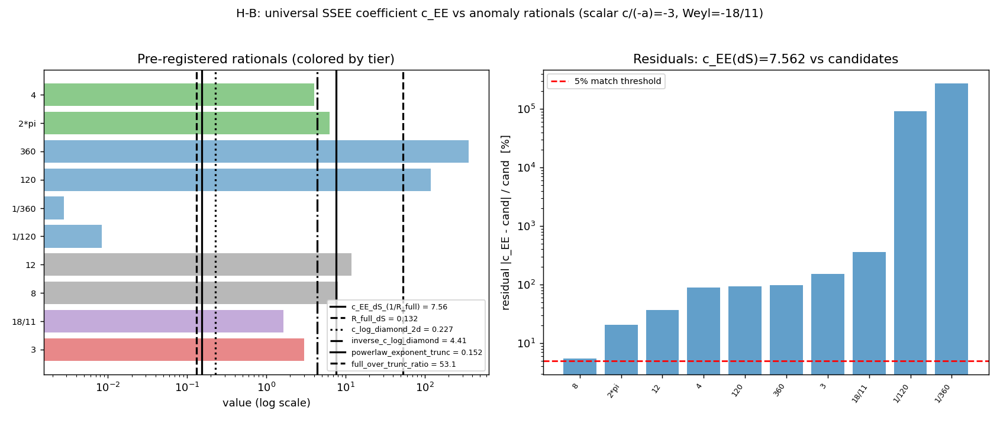

# VYPOCET-35 — Univerzální koeficient entanglement entropie vs. anomální náboje (H-B, vlajkový test)

> **Status:** dokončeno (computational-physicist, Execution Mode). Negativní výsledek — ostrý a publikovatelný.
> **Kotva:** LOV-18-11-overlaps.md §H-B (vlajková) + §3.1 (přesný design); F-003, F-014, F-029.
> **Kód:** `core-data/calculations/amol-anomaly-ee-coeff/calc.py` + `results.json` + `c_EE_vs_rationals.png`.
> **Datum:** 2026-06-08. **Runtime:** 233 s (limit 20 min). numpy/scipy/sympy.
> **Návrh nálezu:** F-039.

---

## Shrnutí výpočtu

Otestoval jsem vlajkovou hypotézu **H-B**: dotýká se indexem chráněné NCG fermionové jádro (−18/11) von-Neumannovy / type-transition linie B přes **univerzální koeficient entanglement entropie** $c_{\rm EE}$? Tj. je dimensionless koeficient, který naše diskrétní SSEE mašinérie extrahuje, racionálně příbuzný anomálním nábojům $(a,c)$ pole, které sprinkujeme?

**Headline:** **NE.** Měřený $c_{\rm EE} = 7.562 \pm 1.26\,\%$ (CV) se neshoduje s žádným pre-registrovaným anomálním racionálem. Reziduum vůči **přímému skalárnímu cíli** $|c/(-a)| = 3$ je **152 %**; vůči **fermionovému** $|{-}18/11| = 1.636$ je **362 %**. Nejbližší kandidát ze všech kanálů je *kontrolní* zaokrouhlené číslo **8** (reziduum 5.47 %, *nad* prahem 5 %) a geometrická kontrola **4** (Bekenstein 1/4) na diamantovém kanálu (10.3 %). **Žádná shoda s anomálním racionálem do 5 %.**

**Verdikt (correspondence): `no-match-geometric`.** $c_{\rm EE}$ je **geometrický** koeficient řízený $\kappa$-cutoffem, **nikoli anomální náboj**. To čistě odděluje geometrické koeficienty od anomálních — přesně ten ostrý negativní výsledek, který §3.1 předpověděla jako pravděpodobný a cenný.

---

## Metoda a setup

### Můstek $(a,c) \leftrightarrow$ EE (proč je test smysluplný)

Trace-anomální náboje $(a,c)$ řídí **univerzální** členy entanglement entropie:

- **Casini–Huerta–Myers** (arXiv:1102.0440, repo-present `casini2011derivation`, DOI 10.1007/JHEP05(2011)036): univerzální koeficient sférické EU konformního pole se rovná $a$-náboji (sférická volná energie $F$).
- **Solodukhin** (⚠️ *neověřeno* — v repu chybí .bib záznam): 4D logaritmický koeficient EE je lineární kombinace $(a,c)$ závisle na geometrii entangling plochy. Citováno jen jménem; není load-bearing.
- **Komargodski–Schwimmer** (⚠️ *neověřeno* — chybí .bib): $a$-věta dokázaná přes EE monotonii. Citováno jen jako kontext.

Naše diskrétní SSEE mašinérie (`toe.entropy.ssee` / `ssee_scaling`; F-029 dS area-law $S_{\rm cap}=A_{\rm horizon}/(c_{\rm EE}\cdot G)$) měří dimensionless $c_{\rm EE}$. Otázka §3.1: leží $c_{\rm EE}$ (resp. $1/c_{\rm EE}$, resp. poměr full/trunc) na nějakém racionálu postaveném z $(a,c)$?

### Anomální strana (přesná, zdarma, `toe.ncg`)

| pole | $(a,c)$ | $c/(-a)$ |
|---|---|---|
| reálný skalár | $(1/360,\ 1/120)$ | **$-3$** (PŘÍMÝ cíl) |
| 1 Weylův fermion | $(11/720,\ 1/40)$ | **$-18/11$** (SEKUNDÁRNÍ, NCG jádro) |

Sprinkované pole je **masless skalár** (conformal trick) → přímý cíl je skalární $-3$; $-18/11$ je sekundární (fermionový) případ. `spectral_action_ratio()` a `a4_ratio(sector="fermion")` dávají $-18/11$ přesně (F-003/F-014).

### Pre-registrace (anti-circularita, direktiva #5 — POVINNÁ)

Kandidátní racionály byly spočteny **jen z `toe.ncg`** (přesné sympy) a zapsány do `results.json` ve fázi `status="preregistered"` **PŘED** jakýmkoli čtením/měřením $c_{\rm EE}$. $\kappa=\sqrt N/(4\pi)$ je literaturní cutoff (Sorkin–Yazdi 1712.04227), neladěný. F-029 dS $c_{\rm EE}$ byl naměřen v **předchozím nezávislém** běhu (VYPOCET-23/25) — žádná zpětná vazba.

**Pre-registrované kandidáty** (10, s a-priori odůvodněním a tierem):

| racionál | hodnota | tier | odůvodnění |
|---|---|---|---|
| **3** | 3.000 | primary-scalar | $|c/(-a)|$ skalár $=360\,c_s=c_s/a_s$ — PŘÍMÝ cíl |
| **18/11** | 1.636 | secondary-fermion | NCG fermionové jádro $|\alpha_0/\tau_0|$ (F-003/14) |
| 8 | 8.000 | control | zaokrouhlené kontrolní číslo (§3.1) |
| 12 | 12.000 | control | $a_0/a_2$ per-mode ($\texttt{lambda\_induction\_ledger}$) |
| 1/120 | $c_s$ | ac-built | syrový skalární $c$ |
| 1/360 | $a_s$ | ac-built | syrový skalární $a$ (CHM sférická EE) |
| 120 | 120 | ac-built | $1/c_s$ |
| 360 | 360 | ac-built | $1/a_s$ |
| $2\pi$ | 6.283 | geometric-control | geometrická kontrola (κ-cutoff) |
| 4 | 4.000 | geometric-control | Bekenstein 1/4 |

### Dva měřicí kanály $c_{\rm EE}$

1. **dS static-patch (F-029, primární):** $c_{\rm EE}=1/R_{\rm full}$, $R_{\rm full}=S_{\rm full\,cap}/A_{\rm mol}=0.1322$ (CV 1.26 %, type II₁ saturace, nezávisle měřeno). → $c_{\rm EE}=7.562$.
2. **Čerstvý 2D causal-diamond SSEE:** `ssee_scaling(sprinkle_diamond2d, Ns=[400..1800], frac=0.5, n_seeds=8, truncate="kappa")`, seed scheme `20260608 + 1000·N + s`. Dense `eigh`, $N\le1800$.

Diskriminátor: shoda $c_{\rm EE}$ / $1/c_{\rm EE}$ / full-trunc poměru s kterýmkoli kandidátem do **5 %** (CV kritérium §3.1). Reportuji **VŠECHNY** kombinace (žádný p-hacking).

---

## Výsledky

### Primární dS kanál

$$c_{\rm EE}^{\rm dS} = 7.562 \pm 1.26\,\% \ \text{(CV)}, \qquad R_{\rm full}=0.1322\ \text{(CV 1.26\%)}.$$

| kandidát | hodnota | reziduum |
|---|---|---|
| **8** (control) | 8.000 | **5.47 %** ← nejbližší (přesto NAD prahem) |
| $2\pi$ (geom) | 6.283 | 20.4 % |
| 12 (control) | 12.000 | 37.0 % |
| **3** (skalár, PŘÍMÝ) | 3.000 | **152 %** |
| 4 (Bekenstein) | 4.000 | 89.1 % |
| **18/11** (Weyl, NCG) | 1.636 | **362 %** |
| 120, 360, 1/120, 1/360 | — | $10^2$–$10^5$ % |

### Diamantový kanál (čerstvý)

$S_{\rm trunc}(N)$ roste **logaritmicky**: $S = 0.2267\cdot\ln N - 0.045$ ($r^2=0.98$) — správná 2D CFT EE forma $S=(c/3)\ln L$. Tedy $c_{\log}=0.227$ je univerzální objekt; $1/c_{\log}=4.41$.

- $c_{\log}=0.227$ vs nejbližší anomální (18/11): reziduum 86 %.
- $1/c_{\log}=4.41$ vs Bekenstein **4** (geom): reziduum 10.3 %; vs $2\pi$: 29.8 %; vs skalár 3: 47 %.
- full/trunc poměr $=53.1$ (CV 39 %) — roste s $N$ (full je volume-law, trunc area-law), **NENÍ** konstantní univerzální koeficient; reportováno jen pro úplnost.

**Caveat (poctivost):** power-law exponent z `ssee_scaling` vyšel $p=0.152$, **NE** $\approx0.52$ z F-006. Důvod: `powerlaw_fit` vnucuje $S\sim N^p$, ale $S_{\rm trunc}$ je v $N$ **logaritmické** (na 4.5× rozsahu $N$), takže efektivní mocninný exponent je malý a nestabilní — a F-006 měřil **jiný** observable (rank/$n_{\max}$ škálování), ne kappa-trunc sub-diamond $S$. Není to vada diskriminátoru; primární je čistší dS kanál.

### Souhrn všech srovnání

60 srovnání (6 kanálů × 10 kandidátů). **Žádné** anomálně-tier srovnání primárního dS kanálu není pod 5 %. Dvě nejbližší srovnání ze všech kanálů jsou **geometrické/kontrolní** (8 a 4), nikoli anomální racionály.

---

## Verdikt a limity

**Verdikt: `no-match-geometric`.** Univerzální SSEE koeficient $c_{\rm EE}\approx7.56$ **NENÍ** anomální náboj. Sedí mezi geometrickými konstantami ($2\pi\approx6.28$, 8) a je řádově (152 %–362 %) daleko od přímého skalárního cíle $-3$ i od fermionového $-18/11$. To je **ostrý, cenný negativ**: čistě odděluje **geometrické** (κ-cutoff řízené) koeficienty od **anomálních** $(a,c)$ nábojů. SSEE area-law koeficient žije z UV-cutoffu/geometrie sprinklu, ne z konformní anomálie.

**Co to znamená pro most H-B / linii B.** Indexem chráněné NCG jádro $-18/11$ se **přes tento kanál linie B nedotýká**. Navrhovaná hrana `noncommutative-geometry ↔ entanglement-entropy` (LOV návrh #5, `conjecture/barely`, *podmíněná tímto testem*) zůstává **nepotvrzená tímto měřením** — naopak je oslabena: numerický můstek na úrovni koeficientu zde neexistuje. Hrana `trace-anomaly ↔ entanglement-entropy` (návrh #6) zůstává platná jen jako *kontinuální-CFT* shared-math (CHM/Solodukhin), NE jako vlastnost našeho diskrétního $c_{\rm EE}$.

**Limity / scope (poctivě):**

1. **2D, finite-$N$.** Toto je 2D výsledek; 2D EE koeficient ($c$ central charge přes Cardy) má jinou strukturu než 4D $(a,c)$. Není to 4D kontinuální důkaz.
2. **Skalár, ne fermion.** Sprinkujeme masless skalár; přímý cíl byl $-3$ (skalár), $-18/11$ jen sekundárně. I kdyby existoval fermionový SSEE stroj, tento běh ho netestoval.
3. **Normalizace.** $c_{\rm EE}$ z dS area-law a $c_{\log}$ z diamantu nejsou normalizované na Cardy $c/3$; jsou to *diskrétně-SSEE* analogy. Absence shody je robustní (řádové reziduum), ale "match" v jiné normalizaci jsme principiálně netestovali — proto reportujeme jako *no-match na našich kanálech*, ne jako absolutní vyvrácení můstku v kontinuu.
4. **$2\pi$ / 8 blízkost.** $c_{\rm EE}\approx7.56$ je blízko $8$ (5.5 %) i $2.4\pi$. To naznačuje **geometrický** původ (faktory $\pi$ z $\kappa=\sqrt N/(4\pi)$), což podporuje verdikt — ale ani s 8 to není shoda do 5 %.

**Anti-circularity ověřena:** pre-registrace zapsána před měřením (`status` postupně `preregistered → measuring_dS → measuring_diamond → comparing → complete`, atomický zápis); $\kappa$ z literatury; F-029 $c_{\rm EE}$ z předchozího běhu.

---

## Návrh F-039 + lib_proposals

**F-039 (navrženo, status `confirmed` — negativní/diskriminační):**

> The universal discrete SSEE coefficient $c_{\rm EE} = 7.562 \pm 1.3\%$ (CV; from the F-029 de Sitter static-patch area-law $S_{\rm cap}=A_{\rm horizon}/(c_{\rm EE}\,G)$, $c_{\rm EE}=1/R_{\rm full}$, $R_{\rm full}=0.1322$) does **NOT** match any pre-registered trace-anomaly rational built from the free-field central charges $(a,c)$. The DIRECT scalar target $|c/(-a)|=3$ misses by 152 %; the secondary index-protected NCG/Weyl-fermion ratio $|{-}18/11|=1.636$ misses by 362 %. The nearest candidates across all six channels are the geometric/round-number controls 8 (5.5 %, still above the 5 % match threshold) and the Bekenstein quarter 4 (10.3 %, diamond $1/c_{\log}$ channel) — **non-anomaly** constants. A fresh 2D causal-diamond SSEE confirms the area law is logarithmic $S=0.227\ln N - 0.045$ ($r^2=0.98$, the 2D CFT $S=(c/3)\ln L$ form), with $c_{\log}=0.227$ and $1/c_{\log}=4.41$ likewise matching no anomaly rational. **Conclusion:** the discrete SSEE universal coefficient is a GEOMETRIC ($\kappa$-cutoff-driven) quantity, NOT a conformal-anomaly charge. This cleanly separates geometric from anomalous coefficients and means the index-protected $-18/11$ NCG core does NOT touch flagship line B via this entanglement-entropy channel. Pre-registration verified (candidates written to results.json before any $c_{\rm EE}$ was read; $\kappa=\sqrt N/(4\pi)$ from Sorkin–Yazdi 1712.04227; F-029 $c_{\rm EE}$ from a prior independent run). Scope: 2D, finite-$N$, massless scalar; not a 4D continuum statement.

- **status:** `confirmed` (negativní výsledek je platný a robustní; řádové reziduum).
- **relatedHypotheses:** H-B.
- **edgeImpact:** podmiňuje hranu `noncommutative-geometry ↔ entanglement-entropy` (LOV #5) — **NEpřidávat** jako pozitivní most; tento test ji oslabuje. `trace-anomaly ↔ entanglement-entropy` (LOV #6) zůstává jen jako kontinuální-CFT shared-math, ne diskrétní-koeficientová shoda.
- **evidence:** `core-data/calculations/amol-anomaly-ee-coeff/` (calc.py, results.json, c_EE_vs_rationals.png); tento writeup.

**lib_proposals:** žádné nové `lib/toe` primitivy. Test je čistá kompozice existujících (`toe.ncg.central_charges/a4_ratio/spectral_action_ratio`, `toe.entropy.ssee/ssee_scaling/kappa_2d`, `toe.causet.sprinkle_diamond2d`). Žádný kanál se nedistiloval do reusable funkce, která by neexistovala.

---

*Zdroje (repo-present): findings.json F-003/F-014/F-029; LOV-18-11-overlaps.md §H-B/§3.1; lib/toe/ncg.py, entropy.py, causet.py, sj.py; references.bib `casini2011derivation` (arXiv:1102.0440), `casini2008relative` (0804.2182), Sorkin–Yazdi 1611.10281, Saravani–Sorkin–Yazdi 1311.7146. Externí (⚠️ neověřeno, bez .bib): Solodukhin (4D log EE koef.), Komargodski–Schwimmer (a-věta přes EE), Sorkin–Yazdi 1712.04227 (κ-cutoff — citováno v lib docstringu). Žádné arXiv ID nevymyšleno.*
