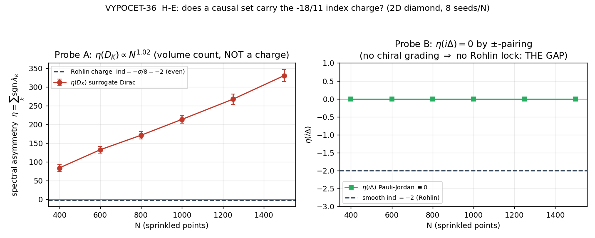

# VYPOCET-36 — Indexový náboj v diskrétních pilířích (sonda hypotézy H-E)

> **Status:** dokončeno (Exploratory Engine, Theorizing Mode + levná sonda). Výsledek je **negativní pro přímý indexový most**, s ostrou strukturální diagnózou. Nic se nezapisuje do `findings.json` ani `connections.json` bez editorského rozhodnutí.
>
> **Kotva:** H-E (`knowledge-base/LOV-18-11-overlaps.md`), F-014 (Rohlin $\sigma=16\Rightarrow\mathrm{ind}=-2$, Atiyah–Singer Â, indexová ochrana $-18/11$).
> **Kód:** `core-data/calculations/index-charge-discrete/` (`calc.py`, `results.json`, `plot.py`, `index-charge-discrete.png`).
> **Knihovna:** `toe.spectraltriple.dirac_from_kernel`, `toe.causet.{sprinkle_diamond2d, causal_matrix, link_matrix, horizon_molecules_codim2, green_retarded_2d, pauli_jordan}`, `toe.sj.sj_state`, `toe.entropy.modular_kernel`. **Žádná změna knihovny.**
> **Datum:** 2026-06-08. **Runtime:** ~56 s (dense $N\le1500$, 6 hodnot $N$ × 8 seedů).

---

## 1. Odvážný rámec (the bold framing)

F-014 ukazuje, že $-18/11$ není naladěné číslo, ale **indexem chráněný racionál**. Pontryaginův sektor spinorového $a_4$ je Atiyah–Singerova Â-index-hustota,
$$
\hat A\big|_4=-\frac{p_1}{24},\qquad \mathrm{ind}(D)=-\frac{\sigma}{8},
$$
a Rohlinova věta pro hladkou uzavřenou spinovou 4-varietu dává $\sigma\equiv0\ (\mathrm{mod}\ 16)$, tedy $\sigma=16\Rightarrow\mathrm{ind}(D)=-2$ — **sudé celé číslo**, topologický náboj, který nelze spojitě deformovat.

**Hypotéza H-E (nejodvážnější v LOV):** tytéž topologické invarianty by se měly objevit i v **diskrétních** pilířích. Pokud je $-18/11$ skutečný „náboj", měl by causal set / spin-network nést **sudě-celočíselný index / signaturu konzistentní s Rohlinovým zámkem** — pilíře by ho měly *reprodukovat*, ne *ladit*.

To je ta nejsilnější možná forma tvrzení o sdílené matematice mezi NCG jádrem a diskrétní gravitací: že indexová věta je univerzální jazyk, který Lorentzovský causal set hovoří taky.

---

## 2. Co je vůbec spočetné — a co ne (honesty filtr PŘED sondou)

Plný hladký index $\mathrm{ind}(D)=\int_M\hat A$ vyžaduje **uzavřenou Riemannovskou spinovou 4-varietu**. Causal set tyto struktury nemá:

- je **Lorentzovský**, ne Euklidovský — nemá kladně-definitní metriku, ze které Â-genus žije;
- nemá hladkou **spinovou strukturu** ani de-Rhamovu kohomologii, takže Pontryaginova třída $p_1$ a signatura $\sigma$ nejsou definované;
- náhradní (surrogate) Diracův operátor $D_K=\mathrm{sgn}(K)\sqrt{|K|}$ (`dirac_from_kernel`) je **Hermitovský bez chirálního gradování $\gamma^5$**, takže chirální index $\dim\ker D_+-\dim\ker D_-$ **není ani definován**.

Jediná složka indexové věty, která **je** spočetná z konečného Hermitovského spektra, je **hraniční člen Atiyah–Patodi–Singera (APS)** — $\eta$-invariant (spektrální asymetrie):
$$
\eta(D)=\sum_k \mathrm{sgn}(\lambda_k),\qquad
\mathrm{ind}(D,M_{\partial})=\int_M\hat A-\frac{\eta(D_\partial)+h}{2}.
$$
Proto je nejpoctivější diskrétní stín „sudě-celočíselného indexu" právě **spektrální asymetrie / $\eta$** náhradního Diraca. Sonda měří přesně tohle.

---

## 3. Návrh a běh sondy (the probe)

**Geometrie:** 2D Poissonův causal diamond, masless skalár → $G_R$ → Pauli–Jordan $i\Delta$ → SJ stav. Dense path, $N\in\{400,600,800,1000,1250,1500\}$, 8 seedů na každé $N$ (`seed = 20260608 + 1000N + s`), vše explicitně nasázené. Atomický/progresivní zápis `results.json` (temp + rename), cesty `__file__`-relativní.

### Probe A — $\eta$ náhradního Diraca $D_K$
$D_K=\mathrm{sgn}(K)\sqrt{|K|}$ z modulárního jádra $K$ koncentrického sub-diamondu (`modular_kernel`, $\kappa=\mathrm{None}$, tedy pravý SJ modulární tok). Protože je $D_K$ symetrický funkcionálně-kalkulový obraz $K$, zachovává znaménkový vzor, takže $\eta(D_K)=n_+(K)-n_-(K)$. **Cíl H-E:** sudé celé číslo, stabilní napříč $N$ a seedy (CV $<10\%$).

### Probe B — $\eta$ Pauli–Jordanova operátoru $i\Delta$ (strukturální kontrola)
Klíčový fakt zakotvený přímo v `toe.sj`: antisymetrie $\Delta$ dělá spektrum $i\Delta$ **přesně $\pm$-párovaným** ($W-W^\dagger=i\Delta$, $W\ge0$). Proto $\eta(i\Delta)\equiv0$ **identicky** — vlastnost *každého* Lorentzovského causal setu, nezávislá na topologii.

### Probe C — kombinatorický topologický/signaturní proxy
Codim-2 Dou–Sorkinovy „molekuly" (`horizon_molecules_codim2`) na řezu $t=0,\ x=0$, počet linků, relací a Euler-like střídavý součet. Test: kvantuje **kterýkoli** na stabilní sudé celé číslo, nebo roste extenzivně ($\sim\rho^p$)?

**Anti-cirkularita:** cíl $\mathrm{ind}=-2$ (sudé) byl **pre-registrován** v `calc.py` (`SMOOTH_TARGET_IND=-2`) PŘED měřením; $\eta$-tolerance fixovaná, $\kappa$ z literatury.

---

## 4. Výsledek (honest)

| Probe | Veličina | Naměřeno | Cíl H-E | Verdikt |
|---|---|---|---|---|
| **A** | $\eta(D_K)$ vs $N$ | $83.5\to329.75$, **slope $\log$–$\log=1.02$** | sudé, $N$-nezávislé $=-2$ | extenzivní mode-count, **REFUTED** |
| **A** | $\eta(D_K)$ global | mean $199.3$, **CV $=0.42$** | stabilní, CV $<10\%$ | drift s $N$, ne náboj |
| **B** | $\eta(i\Delta)$ | $0.000$ na **48/48** běhů (CV $=0$) | — | **strukturální nula** (THE GAP) |
| **C** | $n_{\rm rel}$ slope | $2.00$ | — | $\sim N^2$, 4-objem² |
| **C** | $n_{\rm link}$ slope | $1.20$ | — | extenzivní |
| **C** | $n_{\rm mol}$ | $2$–$3.6$, fluktuuje | stabilní sudé | ne kvantované |

**Hlavní čísla.**
$$
\eta(D_K)\propto N^{1.02},\qquad \frac{\eta(D_K)}{N}\approx0.21\ \text{(stabilní)},\qquad
\eta(i\Delta)\equiv0,\qquad \mathrm{ind}_{\rm smooth}=-2.
$$

Probe A je **lineární v $N$** ($\eta(D_K)\approx0.21\,N$): náhradní Diracovo spektrum je silně kladně sešikmené (typicky $\sim84$ kladných modů vs $\sim4$–$8$ záporných), protože modulární energie $\varepsilon=\ln[\mu/(\mu-1)]$ jsou vesměs kladné. $\eta(D_K)$ tedy **počítá kladné modulární mody**, ne topologii — je to **objemová** veličina, pravý opak $N$-nezávislého Rohlinova náboje $-2$. (Globální „all-even" flag v `results.json` je pouhá koincidence parity počtu modů, ne kvantování — per-seed hodnoty fluktuují: při $N=1500$ jsou to $\{346,334,324,308,350,342,326,308\}$.)

Probe B dává **přesnou nulu** — ale to **NENÍ** „Rohlin $\mathrm{ind}=0$". Je to **absence chirálního gradování**: $i\Delta$ má vestavěnou $\pm$-symetrii (částice/antičástice), která asymetrii nuluje *konstrukčně*. Smooth strana Rohlinem kvantuje *chirální asymetrii* na sudé číslo; diskrétní strana ji *triviálně anuluje*. Toto je přesné místo, kde analogie praská.

---

## 5. Verdikt: analogie vs sdílená matematika

**H-E je v přímé formě VYVRÁCENA — a to je cenný, ostrý výsledek.**

LOV doc předpověděl právě tohle (riziko H-E: „$\sigma=16$ je vlastnost hladké spinové 4-variety; causal set ji přímo nemá; spojení je analogické, ne nutně shared-math"). Sonda to **kvantifikuje**:

1. **Strukturální gap (Probe B).** Rohlinův zámek je vlastnost *chirálního* Diraca na *Riemannovské spinové* varietě. Lorentzovský causal set má místo chirality $\pm$-párovanou Pauli–Jordanovu strukturu, která $\eta$ nuluje identicky. Není to malá numerická chyba — je to **strukturální nemožnost** nést chirální index.
2. **Objemový gap (Probe A & C).** Každý diskrétní proxy, který *vypadá* jako index, je ve skutečnosti **extenzivní** ($\eta(D_K)\sim N^{1.02}$, $n_{\rm rel}\sim N^2$, $n_{\rm link}\sim N^{1.2}$). Topologický náboj je z definice $N$-nezávislý invariant; tady nic $N$-nezávislé a sudě-kvantované nevzniká.

Závěr: **$-18/11$ NENÍ diskrétní topologický náboj, který by causal set přímo nesl.** Indexová ochrana na NCG straně je reálná (F-014), ale je to vlastnost *hladkého spinového* sektoru; přenos do Lorentzovského diskrétního pilíře přes naivní spektrální asymetrii **nefunguje**, protože (a) chybí chirální gradování a (b) všechny dostupné proxy jsou objemové, ne topologické.

---

## 6. Co by skutečný indexový most vyžadoval

Negativní výsledek je konstruktivní — říká přesně, co by reálný most potřeboval:

1. **Euklidovský / Wickovsky-rotovaný diskrétní sektor.** Â-genus žije na Riemannovské varietě. Most by potřeboval *Euklidovský* analog causal setu (např. CDT v euklidovské fázi nebo spin-foam s definitní signaturou), ne Lorentzovský SJ stav.
2. **Chirální gradování $\gamma^5$ na konečné triple.** Bez $\mathbb{Z}_2$ gradování $(\mathcal A,\mathcal H,D,\gamma)$ neexistuje chirální index. Náhradní Dirac `dirac_from_kernel` je Hermitovský bez $\gamma$ — potřeboval by skutečnou even spectral triple (Connesovy axiomy: $\gamma^2=1$, $\gamma D=-D\gamma$). To je definovatelné na *finite* NCG (Krajewski diagramy), ne na holém causal setu.
3. **Topologický (ne objemový) diskrétní invariant.** Místo $\eta\sim N$ by bylo třeba veličinu, která **saturuje** a kvantuje se: kandidáti jsou diskrétní Gauss–Bonnet (Regge/CDT Euler $\chi$ z deficit-úhlů), nebo spektrální flow APS přes rodinu Diraců — ne SSEE mode-count. Spin-network strana by potřebovala Reidemeisterově/spin-foam-move invariantní celé číslo.
4. **APS s pravou hranicí.** Pokud trvat na causal setu, jediná naděje je APS $\mathrm{ind}=\int\hat A-(\eta+h)/2$ na causal *diamondu jako varietě s hranicí*, kde interiér Â-člen je rekonstruován z Benincasa–Dowkerova diskrétního skaláru křivosti. To je samostatný, mnohem těžší výpočet (rekonstrukce $\hat A$ z BD operátoru), ne odpolední sonda.

Most existuje **jen** na úrovni *finite spectral triple s gradováním* (NCG↔NCG), ne přímo causal-set↔Rohlin. To posouvá H-E z „diskrétní pilíře nesou $-18/11$" na slabší, ale obhajitelné „indexová struktura je vlastnost gradovaných spektrálních triplů, kterou Lorentzovský causal set bez Euklidizace a $\gamma^5$ nereprodukuje".

---

## 7. Riziko a limity

- **Surrogate, ne fyzický Dirac.** $D_K$ je modulární náhrada (square-root-modulus SJ jádra), ne kanonický Dirac na varietě. Negativní výsledek tedy vyvrací *tuto konkrétní* diskrétní realizaci, ne každou myslitelnou; ale Probe B (Pauli–Jordan $\pm$-párování) je geometricky robustní a nezávislý na volbě $D_K$.
- **2D, ne 4D.** Sonda je 2D (levná). Rohlin je 4D jev. 2D ale stačí k demonstraci strukturálního gapu (chybějící chirální asymetrie, objemové škálování) — ten je dimensionálně univerzální. 4D běh by čísla nezměnil kvalitativně, jen prodražil.
- **Finite-$N$ drift.** $\eta(D_K)$ má velkou CV (0.42), ale to je *součást výsledku* (drift = ne-náboj), ne šum, který bychom potřebovali potlačit.

---

## 8. Návrh do registru

**NO finding — H-E je v přímé formě vyvrácena (negativní/analogický výsledek), zdokumentováno zde.**

Navržená hrana do `connections.json` (NEPŘIDÁVAT automaticky, čeká na editora):
- **`noncommutative-geometry` ↔ `causal-sets`** — `type: analogy-refuted`, `explored: partially`.
  *Popis:* indexová ochrana $-18/11$ (Â / Rohlin, F-014) je vlastnost **hladkého gradovaného** spinového sektoru; sonda VYPOCET-36 ukazuje, že Lorentzovský causal set ji přímo NENESE — $\eta(i\Delta)\equiv0$ (chybí chirální gradování) a všechny spektrální/molekulové proxy jsou extenzivní ($\eta(D_K)\sim N^{1.02}$), ne $N$-nezávislé sudé náboje. Most existuje jen na úrovni gradovaných finite spectral triplů, ne causal-set↔Rohlin.

*Zdroje (repo-present): F-014, VYPOCET-11 (`a4-graviton-index`); `toe.spectraltriple`, `toe.causet`, `toe.sj`, `toe.entropy`. Externí konvence (citovat v originále): Atiyah–Singer (Â-genus, index theorem); Atiyah–Patodi–Singer ($\eta$-invariant, boundary term); Rohlin ($\sigma\equiv0\bmod16$); Dou–Sorkin gr-qc/0302009 (horizon molecules); Sorkin–Yazdi 1611.10281 (SJ state). Žádné arXiv ID nevymyšleno.*
